# 🎓 Course Management System: Spring Boot REST API

<div align="center">


<a href="https://documenter.getpostman.com/view/46177442/2sBXcLfxEC" target="_blank">


**📚 Complete API Documentation:** https://documenter.getpostman.com/view/46177442/2sBXcLfxEC

</div>

<hr style="border: 1px solid rgb(98, 117, 187)">

<div align="center">
<table>
<tr>
<td align="center">
<br />

<br /><br />

<h3>© 2026 Avinash Dhanuka</h3>
<p>Complete REST API for Online Course Management Platform</p>
<p><em>Built with ❤️ using Spring Boot, MySQL & Modern Architecture</em></p>

<a href="https://github.com/Avinash-706" target="_blank">

</a>
<br />
<a href="https://documenter.getpostman.com/view/46177442/2sBXcLfxEC" target="_blank">

</a>
<br />
<br />
</td>
</tr>
</table>
</div>

> **Project Overview:** A production-ready REST API for managing online courses where instructors create courses, upload materials, and students enroll and access content. Features include user management, course CRUD, enrollment tracking, file uploads, pagination, caching, and comprehensive API documentation.

> **Tech Stack:** Spring Boot 3.5.11 | Java 21 | MySQL | JPA/Hibernate | ModelMapper | Swagger/OpenAPI | Lombok | Bean Validation

---

## 📑 Table of Contents
1. [System Architecture](#1-system-architecture)
2. [Project Structure](#2-project-structure)
3. [Entity Relationships](#3-entity-relationships)
4. [Request Flow & Internal Working](#4-request-flow--internal-working)
5. [API Endpoints](#5-api-endpoints)
6. [Pagination Deep Dive](#6-pagination-deep-dive)
7. [Caching Strategy](#7-caching-strategy)
8. [File Upload Mechanism](#8-file-upload-mechanism)
9. [DTO Pattern & ModelMapper](#9-dto-pattern--modelmapper)
10. [Exception Handling](#10-exception-handling)
11. [Database Configuration](#11-database-configuration)
12. [Setup & Running](#12-setup--running)
13. [Testing with Postman](#13-testing-with-postman)
14. [Production Insights](#14-production-insights)
15. [Interview Questions](#15-interview-questions)

**📚 Complete API Documentation:** https://documenter.getpostman.com/view/46177442/2sBXcLfxEC

---

## 1. SYSTEM ARCHITECTURE

<div align="center">

</div>

> **📝 Author:** Avinash Dhanuka | [GitHub](https://github.com/Avinash-706)

### 📌 Layered Architecture Overview

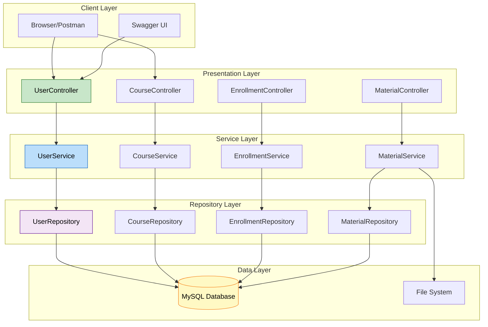

### 🎯 Architecture Principles

| Layer | Responsibility | Technologies |
|:------|:--------------|:------------|
| **Controller** | HTTP request handling, validation | @RestController, @Valid |
| **Service** | Business logic, transactions | @Service, @Transactional |
| **Repository** | Data access, queries | JpaRepository, @Repository |
| **Entity** | Domain models, relationships | @Entity, JPA annotations |
| **DTO** | Data transfer, decoupling | ModelMapper, Lombok |
| **Exception** | Error handling, responses | @ControllerAdvice |


---

## 2. PROJECT STRUCTURE

<div align="center">

</div>

### 📁 Complete Directory Layout

```
course-management-system/
├── src/main/java/com/learning/cms/
│   ├── config/
│   │   ├── CacheConfig.java              # @EnableCaching
│   │   ├── ModelMapperConfig.java        # ModelMapper Bean
│   │   └── SwaggerConfig.java            # OpenAPI Configuration
│   ├── controller/
│   │   ├── UserController.java           # Auth & User APIs
│   │   ├── CourseController.java         # Course CRUD + Pagination
│   │   ├── EnrollmentController.java     # Enrollment APIs
│   │   └── CourseMaterialController.java # File Upload/Download
│   ├── dto/
│   │   ├── RegisterRequestDTO.java
│   │   ├── LoginRequestDTO.java
│   │   ├── UserResponseDTO.java
│   │   ├── CourseRequestDTO.java
│   │   ├── CourseResponseDTO.java
│   │   ├── EnrollmentRequestDTO.java
│   │   ├── EnrollmentResponseDTO.java
│   │   └── MaterialResponseDTO.java
│   ├── entity/
│   │   ├── User.java                     # @OneToMany courses, enrollments
│   │   ├── Course.java                   # @ManyToOne instructor
│   │   ├── Enrollment.java               # Many-to-Many resolver
│   │   ├── CourseMaterial.java           # @ManyToOne course
│   │   ├── Role.java                     # Enum: ADMIN, INSTRUCTOR, STUDENT
│   │   └── EnrollmentStatus.java         # Enum: ACTIVE, COMPLETED, CANCELLED
│   ├── exception/
│   │   ├── ResourceNotFoundException.java
│   │   ├── InvalidRequestException.java
│   │   ├── FileStorageException.java
│   │   ├── ErrorResponse.java
│   │   └── GlobalExceptionHandler.java   # @ControllerAdvice
│   ├── repository/
│   │   ├── UserRepository.java           # findByEmail()
│   │   ├── CourseRepository.java         # findByInstructorId()
│   │   ├── EnrollmentRepository.java     # findByStudentId(), findByCourseId()
│   │   └── CourseMaterialRepository.java # findByCourseId()
│   ├── service/
│   │   ├── UserService.java              # Interface
│   │   ├── CourseService.java
│   │   ├── EnrollmentService.java
│   │   └── CourseMaterialService.java
│   ├── service/impl/
│   │   ├── UserServiceImpl.java          # @Service
│   │   ├── CourseServiceImpl.java        # @Cacheable, @CacheEvict
│   │   ├── EnrollmentServiceImpl.java
│   │   └── CourseMaterialServiceImpl.java
│   ├── util/
│   │   └── FileStorageUtil.java          # File operations
│   └── CourseManagementSystemApplication.java
├── src/main/resources/
│   └── application.properties            # MySQL, JPA, File config
├── uploads/                              # File storage directory
├── pom.xml                               # Maven dependencies
└── README.md

```


---

## 3. ENTITY RELATIONSHIPS

<div align="center">

</div>

### 📌 Entity-Relationship Diagram

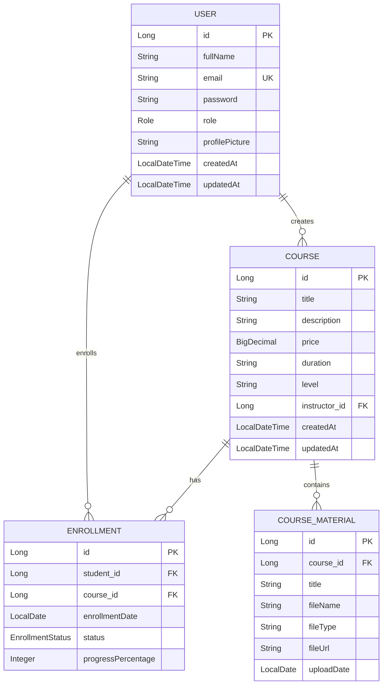

### 🎯 Relationship Breakdown

| Relationship | Type | Explanation |
|:------------|:-----|:-----------|
| **User → Course** | One-to-Many | One instructor creates many courses |
| **User → Enrollment** | One-to-Many | One student enrolls in many courses |
| **Course → Enrollment** | One-to-Many | One course has many enrollments |
| **Course → Material** | One-to-Many | One course contains many materials |
| **Student ↔ Course** | Many-to-Many | Resolved via Enrollment entity |

### 📊 Key Design Decisions

**Why Enrollment Entity Instead of @ManyToMany?**

```java
// ❌ Simple @ManyToMany (Limited)
@ManyToMany
private List<Course> courses;

// ✅ Enrollment Entity (Flexible)
@Entity
public class Enrollment {
    @ManyToOne
    private User student;
    
    @ManyToOne
    private Course course;
    
    private LocalDate enrollmentDate;      // Extra field
    private EnrollmentStatus status;       // Extra field
    private Integer progressPercentage;    // Extra field
}
```

**Benefits:**
- Store enrollment date, status, progress
- Query enrollments independently
- Add business logic to enrollment
- Track enrollment history


---

## 4. REQUEST FLOW & INTERNAL WORKING

<div align="center">

</div>

> **📝 Author:** Avinash Dhanuka | [GitHub](https://github.com/Avinash-706)

### 📌 Complete Request Lifecycle

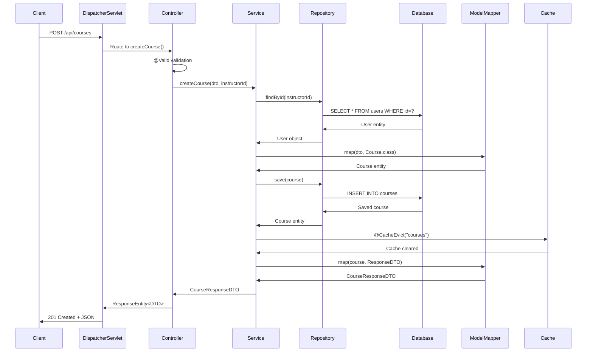

### 🎯 Internal Component Interactions

**1. DispatcherServlet (Front Controller)**
```java
// Spring Boot auto-configures this
@Bean
public DispatcherServlet dispatcherServlet() {
    DispatcherServlet servlet = new DispatcherServlet();
    servlet.setHandlerMappings(handlerMappings);
    servlet.setHandlerAdapters(handlerAdapters);
    return servlet;
}
```

**2. Handler Mapping**
```java
// Maps URL to Controller method
@GetMapping("/api/courses/{id}")  // URL pattern
public ResponseEntity<CourseResponseDTO> getCourseById(@PathVariable Long id) {
    // Handler method
}
```

**3. Argument Resolver**
```java
// Resolves @PathVariable, @RequestParam, @RequestBody
Long id = extractPathVariable(request, "id");
CourseRequestDTO dto = parseRequestBody(request, CourseRequestDTO.class);
```

**4. Bean Validation**
```java
// @Valid triggers validation
@PostMapping
public ResponseEntity<CourseResponseDTO> createCourse(
    @Valid @RequestBody CourseRequestDTO dto) {  // Validates here
    // If validation fails → MethodArgumentNotValidException
}
```


### 📊 Spring Boot Auto-Configuration Magic

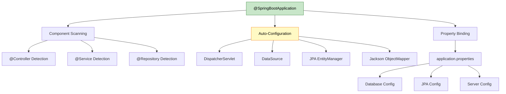

**What Spring Boot Does Automatically:**

| Component | Manual Configuration | Spring Boot Auto-Config |
|:----------|:--------------------|:-----------------------|
| **DispatcherServlet** | web.xml + servlet config | Auto-registered |
| **DataSource** | XML bean definition | From application.properties |
| **EntityManager** | persistence.xml | Auto-configured |
| **ViewResolver** | XML bean | Not needed (REST API) |
| **Exception Handler** | Manual @ControllerAdvice | We added GlobalExceptionHandler |
| **JSON Conversion** | Manual ObjectMapper | Jackson auto-configured |

---

## 5. API ENDPOINTS

<div align="center">

</div>

### 📌 Complete API Reference

**Base URL:** `http://localhost:8080`  
**Swagger UI:** `http://localhost:8080/swagger-ui/index.html`  
**API Docs:** [Postman Documentation](https://documenter.getpostman.com/view/46177442/2sBXcLfxEC)

### 🔐 User Management APIs

| Method | Endpoint | Description | Request Body |
|:-------|:---------|:-----------|:------------|
| POST | `/api/auth/register` | Register new user | `{fullName, email, password, role}` |
| POST | `/api/auth/login` | User login | `{email, password}` |
| GET | `/api/users/{id}` | Get user by ID | - |

**Example:**
```json
POST /api/auth/register
{
  "fullName": "John Instructor",
  "email": "instructor@cms.com",
  "password": "instructor123",
  "role": "INSTRUCTOR"
}
```

### 📚 Course Management APIs

| Method | Endpoint | Description | Query Params |
|:-------|:---------|:-----------|:------------|
| POST | `/api/courses?instructorId={id}` | Create course | instructorId |
| PUT | `/api/courses/{id}` | Update course | - |
| DELETE | `/api/courses/{id}` | Delete course | - |
| GET | `/api/courses` | List courses (paginated) | page, size, sort |
| GET | `/api/courses/{id}` | Get course by ID | - |


### 🎓 Enrollment APIs

| Method | Endpoint | Description |
|:-------|:---------|:-----------|
| POST | `/api/enrollments` | Enroll student in course |
| GET | `/api/enrollments/student/{studentId}` | Get student's enrollments |
| GET | `/api/enrollments/course/{courseId}` | Get course enrollments |

### 📁 Course Material APIs

| Method | Endpoint | Description | Content-Type |
|:-------|:---------|:-----------|:------------|
| POST | `/api/materials/upload` | Upload file | multipart/form-data |
| GET | `/api/materials/{id}/download` | Download file | - |
| GET | `/api/materials/course/{courseId}` | List course materials | - |

---

## 6. PAGINATION DEEP DIVE

<div align="center">

</div>

### 📌 How Pagination Works Internally

```mermaid
graph LR
    A[Client Request] --> B[page=0, size=10, sort=title]
    B --> C[PageRequest.of]
    C --> D[Pageable Object]
    D --> E[Repository.findAll]
    E --> F[SQL LIMIT OFFSET]
    F --> G[Database Query]
    G --> H[Page Object]
    H --> I[content, totalPages, totalElements]
    I --> J[JSON Response]
    
    style D fill:#c8e6c9,stroke:#2e7d32,color:#000
    style H fill:#fff9c4,stroke:#f57f17,color:#000
```

### 🎯 Pagination Implementation

**Controller Layer:**
```java
@GetMapping
public ResponseEntity<Page<CourseResponseDTO>> getAllCourses(
    @RequestParam(defaultValue = "0") int page,
    @RequestParam(defaultValue = "10") int size,
    @RequestParam(defaultValue = "title") String sort) {
    
    Pageable pageable = PageRequest.of(page, size, Sort.by(sort));
    Page<CourseResponseDTO> courses = courseService.getAllCourses(pageable);
    return ResponseEntity.ok(courses);
}
```

**Service Layer:**
```java
@Override
@Cacheable(value = "courses")
public Page<CourseResponseDTO> getAllCourses(Pageable pageable) {
    Page<Course> courses = courseRepository.findAll(pageable);
    return courses.map(course -> {
        CourseResponseDTO dto = modelMapper.map(course, CourseResponseDTO.class);
        dto.setInstructorName(course.getInstructor().getFullName());
        return dto;
    });
}
```

**Generated SQL:**
```sql
SELECT * FROM courses 
ORDER BY title ASC 
LIMIT 10 OFFSET 0;  -- page=0, size=10
```

### 📊 Pagination Response Structure

```json
{
  "content": [
    {
      "id": 1,
      "title": "Spring Boot Fundamentals",
      "price": 99.99,
      "instructorName": "John Instructor"
    }
  ],
  "pageable": {
    "pageNumber": 0,
    "pageSize": 10,
    "sort": {"sorted": true, "unsorted": false}
  },
  "totalPages": 5,
  "totalElements": 50,
  "size": 10,
  "number": 0,
  "first": true,
  "last": false,
  "numberOfElements": 10
}
```


### 🎯 Pagination Best Practices

| Aspect | Implementation | Reason |
|:-------|:--------------|:-------|
| **Default Values** | page=0, size=10 | Prevent unbounded queries |
| **Max Page Size** | Limit to 100 | Avoid memory issues |
| **Sort Fields** | Validate allowed fields | Prevent SQL injection |
| **Caching** | @Cacheable on paginated results | Improve performance |
| **DTO Mapping** | Map inside Page | Efficient transformation |

---

## 7. CACHING STRATEGY

<div align="center">

</div>

### 📌 Cache Configuration

```java
@Configuration
@EnableCaching
public class CacheConfig {
    // Spring Boot auto-configures SimpleCacheManager
}
```

**application.properties:**
```properties
spring.cache.type=simple
```

### 🎯 Cache Annotations in Action

```java
@Service
public class CourseServiceImpl {
    
    @Cacheable(value = "courses")  // Cache read operations
    public Page<CourseResponseDTO> getAllCourses(Pageable pageable) {
        // Expensive database query
        // Result cached with key "courses"
    }
    
    @CacheEvict(value = "courses", allEntries = true)  // Clear cache
    public CourseResponseDTO createCourse(CourseRequestDTO dto, Long instructorId) {
        // After creating course, invalidate cache
    }
    
    @CacheEvict(value = "courses", allEntries = true)
    public CourseResponseDTO updateCourse(Long id, CourseRequestDTO dto) {
        // After updating, invalidate cache
    }
}
```

### 📊 Cache Flow Diagram

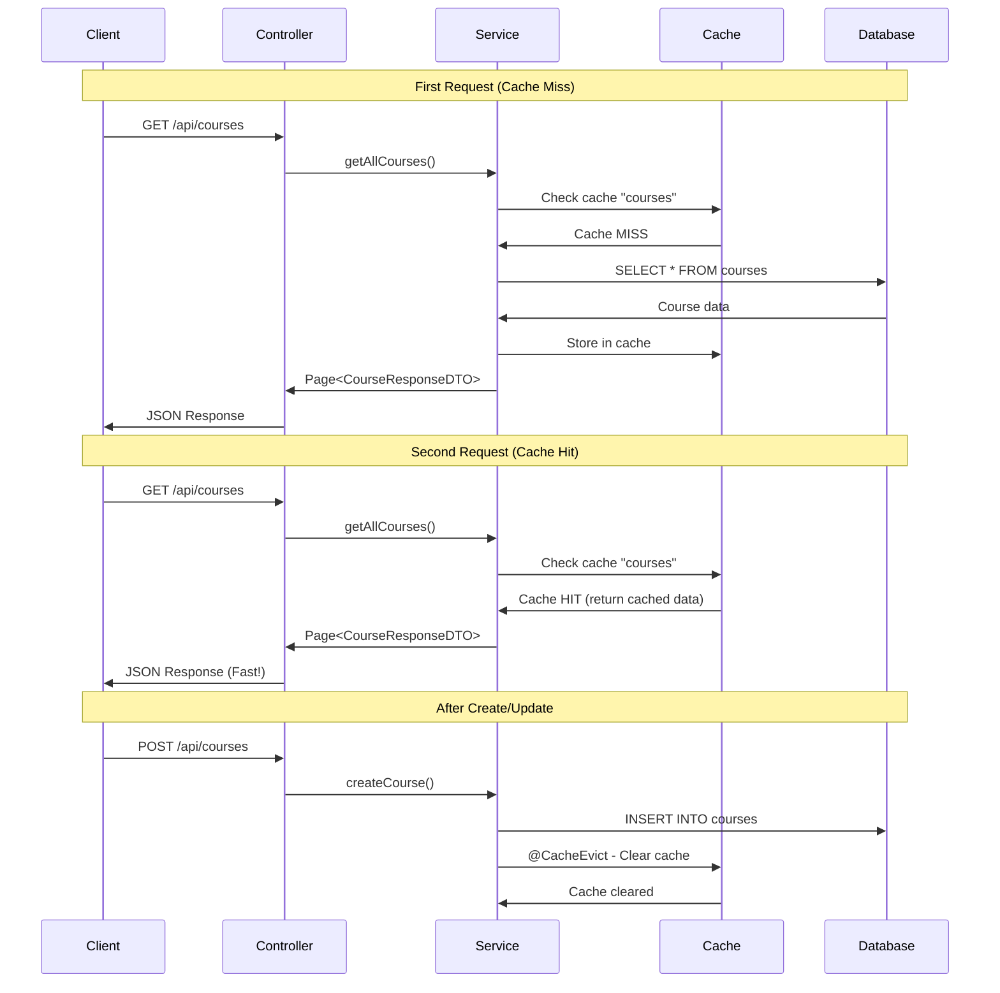


### 🎯 Why Cache Eviction on Write Operations?

**Problem:** Stale data in cache after updates

```java
// Without @CacheEvict
1. GET /api/courses → Returns 10 courses (cached)
2. POST /api/courses → Creates new course (11 total)
3. GET /api/courses → Still returns 10 courses (stale cache!)

// With @CacheEvict
1. GET /api/courses → Returns 10 courses (cached)
2. POST /api/courses → Creates new course + clears cache
3. GET /api/courses → Returns 11 courses (fresh data)
```

---

## 8. FILE UPLOAD MECHANISM

<div align="center">

</div>

### 📌 File Storage Architecture

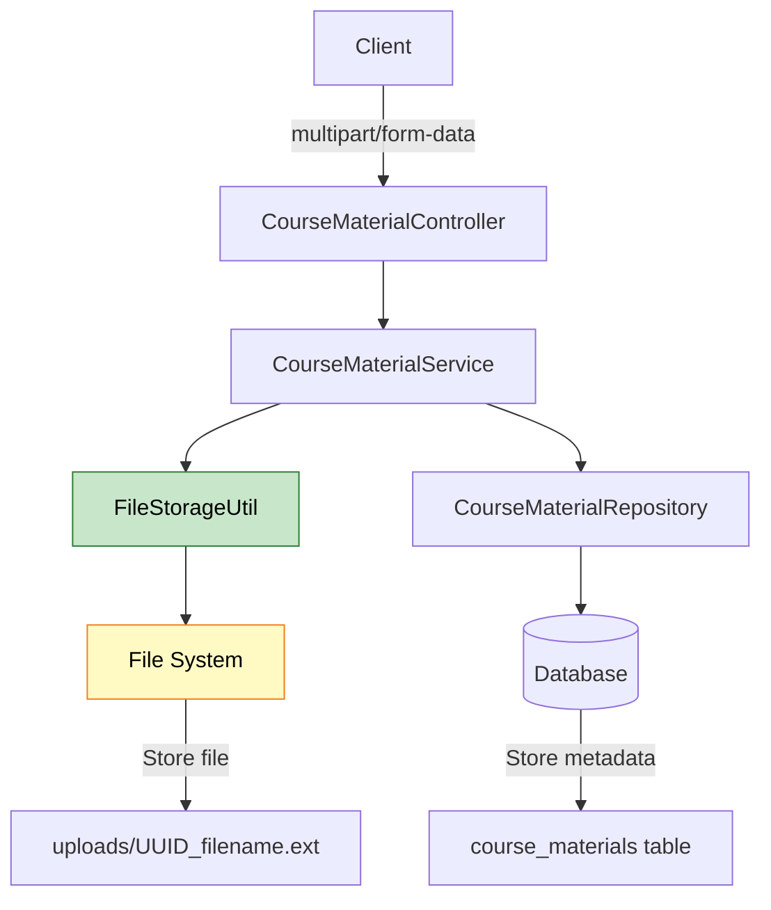

### 🎯 File Upload Implementation

**FileStorageUtil.java:**
```java
@Component
public class FileStorageUtil {
    private final Path fileStorageLocation;
    
    public FileStorageUtil(@Value("${file.upload-dir}") String uploadDir) {
        this.fileStorageLocation = Paths.get(uploadDir).toAbsolutePath().normalize();
        Files.createDirectories(this.fileStorageLocation);
    }
    
    public String storeFile(MultipartFile file) {
        String fileName = UUID.randomUUID() + "_" + file.getOriginalFilename();
        Path targetLocation = this.fileStorageLocation.resolve(fileName);
        Files.copy(file.getInputStream(), targetLocation, REPLACE_EXISTING);
        return fileName;
    }
}
```

**Service Layer:**
```java
@Override
public MaterialResponseDTO uploadMaterial(String title, Long courseId, MultipartFile file) {
    Course course = courseRepository.findById(courseId)
        .orElseThrow(() -> new ResourceNotFoundException("Course not found"));
    
    String fileName = fileStorageUtil.storeFile(file);  // Save to disk
    
    CourseMaterial material = new CourseMaterial();
    material.setTitle(title);
    material.setCourse(course);
    material.setFileName(fileName);
    material.setFileType(file.getContentType());
    material.setFileUrl("/api/materials/" + fileName);
    material.setUploadDate(LocalDate.now());
    
    CourseMaterial saved = courseMaterialRepository.save(material);  // Save metadata
    return modelMapper.map(saved, MaterialResponseDTO.class);
}
```


### 📊 File Storage Strategy

| Aspect | Implementation | Reason |
|:-------|:--------------|:-------|
| **File Naming** | UUID + original name | Avoid conflicts, preserve extension |
| **Storage Location** | uploads/ directory | Configurable via properties |
| **Database** | Store metadata only | Efficient queries, file path reference |
| **Max Size** | 10MB | Prevent abuse, server protection |
| **Download** | Stream via Resource | Memory efficient |

**Why Not Store Files in Database?**

| Storage | Pros | Cons |
|:--------|:-----|:-----|
| **File System** | Fast, scalable, cheap | Backup complexity |
| **Database (BLOB)** | Transactional, backup included | Slow, expensive, DB bloat |

---

## 9. DTO PATTERN & MODELMAPPER

<div align="center">

</div>

> **📝 Author:** Avinash Dhanuka | [GitHub](https://github.com/Avinash-706)

### 📌 Why DTOs?

**Problem: Exposing Entities Directly**
```java
// ❌ BAD: Exposing entity
@GetMapping("/users/{id}")
public User getUser(@PathVariable Long id) {
    return userRepository.findById(id).get();
}

// Response includes password, internal fields, lazy-loaded collections
{
  "id": 1,
  "email": "user@test.com",
  "password": "$2a$10$hashed...",  // Security risk!
  "courses": [...],  // Unnecessary data
  "enrollments": [...]  // N+1 query problem
}
```

**Solution: DTOs**
```java
// ✅ GOOD: Using DTO
@GetMapping("/users/{id}")
public UserResponseDTO getUser(@PathVariable Long id) {
    User user = userRepository.findById(id).get();
    return modelMapper.map(user, UserResponseDTO.class);
}

// Clean response
{
  "id": 1,
  "fullName": "John Doe",
  "email": "user@test.com",
  "role": "STUDENT",
  "createdAt": "2026-03-07T22:00:00"
}
```

### 🎯 ModelMapper Configuration

```java
@Configuration
public class ModelMapperConfig {
    @Bean
    public ModelMapper modelMapper() {
        return new ModelMapper();
    }
}
```

**Usage in Service:**
```java
@Service
@RequiredArgsConstructor
public class CourseServiceImpl {
    private final ModelMapper modelMapper;
    
    public CourseResponseDTO createCourse(CourseRequestDTO dto, Long instructorId) {
        // DTO → Entity
        Course course = modelMapper.map(dto, Course.class);
        course.setInstructor(instructor);
        Course saved = courseRepository.save(course);
        
        // Entity → DTO
        CourseResponseDTO response = modelMapper.map(saved, CourseResponseDTO.class);
        response.setInstructorName(instructor.getFullName());
        return response;
    }
}
```


### 📊 DTO Mapping Flow

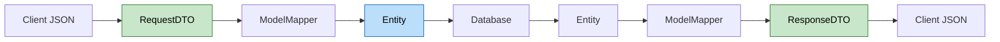

### 🎯 DTO Benefits

| Benefit | Explanation |
|:--------|:-----------|
| **Security** | Hide sensitive fields (password, internal IDs) |
| **Performance** | Avoid lazy loading issues, N+1 queries |
| **Versioning** | Change API without changing entities |
| **Validation** | Separate validation rules for input/output |
| **Decoupling** | API contract independent of database schema |

---

## 10. EXCEPTION HANDLING

<div align="center">

</div>

### 📌 Global Exception Handler

```java
@ControllerAdvice
public class GlobalExceptionHandler {
    
    @ExceptionHandler(ResourceNotFoundException.class)
    public ResponseEntity<ErrorResponse> handleResourceNotFound(
            ResourceNotFoundException ex, WebRequest request) {
        ErrorResponse error = new ErrorResponse(
            LocalDateTime.now(),
            ex.getMessage(),
            request.getDescription(false)
        );
        return new ResponseEntity<>(error, HttpStatus.NOT_FOUND);
    }
    
    @ExceptionHandler(MethodArgumentNotValidException.class)
    public ResponseEntity<Map<String, String>> handleValidationErrors(
            MethodArgumentNotValidException ex) {
        Map<String, String> errors = new HashMap<>();
        ex.getBindingResult().getAllErrors().forEach(error -> {
            String fieldName = ((FieldError) error).getField();
            String errorMessage = error.getDefaultMessage();
            errors.put(fieldName, errorMessage);
        });
        return new ResponseEntity<>(errors, HttpStatus.BAD_REQUEST);
    }
}
```

### 🎯 Exception Hierarchy

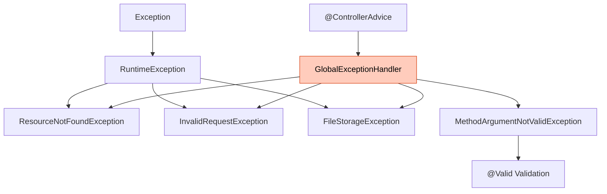

### 📊 Error Response Format

```json
{
  "timestamp": "2026-03-07T22:16:52.636",
  "message": "Course not found with id: 999",
  "details": "uri=/api/courses/999"
}
```

**Validation Errors:**
```json
{
  "title": "Title is required",
  "price": "Price must be positive",
  "email": "Email should be valid"
}
```


---

## 11. DATABASE CONFIGURATION

<div align="center">

</div>

### 📌 application.properties

```properties
# MySQL Configuration
spring.datasource.url=jdbc:mysql://localhost:3306/course_management_db?createDatabaseIfNotExist=true
spring.datasource.username=root
spring.datasource.password=your_password
spring.datasource.driver-class-name=com.mysql.cj.jdbc.Driver

# JPA/Hibernate
spring.jpa.hibernate.ddl-auto=update
spring.jpa.show-sql=true
spring.jpa.properties.hibernate.format_sql=true
spring.jpa.properties.hibernate.dialect=org.hibernate.dialect.MySQLDialect

# File Upload
spring.servlet.multipart.max-file-size=10MB
spring.servlet.multipart.max-request-size=10MB
file.upload-dir=uploads/

# Caching
spring.cache.type=simple

# Server
server.port=8080
```

### 🎯 Hibernate DDL Auto Options

| Value | Behavior | Use Case |
|:------|:---------|:---------|
| **create** | Drop and recreate tables | Testing (data loss!) |
| **create-drop** | Create on start, drop on stop | Integration tests |
| **update** | Update schema, keep data | Development |
| **validate** | Validate schema, no changes | Production |
| **none** | No action | Production (use Flyway/Liquibase) |

**Our Choice: `update`**
- Auto-creates tables on first run
- Preserves data on restart
- Adds new columns automatically
- ⚠️ Not recommended for production (use migrations)

---

## 12. SETUP & RUNNING

<div align="center">

</div>

### 📌 Prerequisites

- Java 21+
- Maven 3.6+
- MySQL 8.0+
- Postman (optional)

### 🎯 Installation Steps

**1. Clone Repository**
```bash
git clone https://github.com/Avinash-706/course-management-system.git
cd course-management-system
```

**2. Configure MySQL**
```sql
CREATE DATABASE course_management_db;
```

**3. Update application.properties**
```properties
spring.datasource.username=your_username
spring.datasource.password=your_password
```

**4. Build Project**
```bash
mvn clean install
```

**5. Run Application**
```bash
mvn spring-boot:run
```

**6. Access Swagger UI**
```
http://localhost:8080/swagger-ui/index.html
```


---

## 13. TESTING WITH POSTMAN

<div align="center">

</div>

### 📌 Import Postman Collection

**Option 1: Import JSON**
```bash
Import file: Course-Management-System.postman_collection.json
```

**Option 2: Use Published Documentation**
```
https://documenter.getpostman.com/view/46177442/2sBXcLfxEC
```

### 🎯 Testing Workflow

**Step 1: Register Users**
```bash
POST /api/auth/register
{
  "fullName": "John Instructor",
  "email": "instructor@cms.com",
  "password": "instructor123",
  "role": "INSTRUCTOR"
}
# Note the returned ID (e.g., 1)
```

**Step 2: Register Student**
```bash
POST /api/auth/register
{
  "fullName": "Jane Student",
  "email": "student@cms.com",
  "password": "student123",
  "role": "STUDENT"
}
# Note the returned ID (e.g., 2)
```

**Step 3: Create Course**
```bash
POST /api/courses?instructorId=1
{
  "title": "Spring Boot Fundamentals",
  "description": "Learn Spring Boot from scratch",
  "price": 99.99,
  "duration": "6 weeks",
  "level": "Beginner"
}
# Note the returned course ID (e.g., 1)
```

**Step 4: Enroll Student**
```bash
POST /api/enrollments
{
  "courseId": 1,
  "studentId": 2
}
```

**Step 5: Test Pagination**
```bash
GET /api/courses?page=0&size=5&sort=price
```

**Step 6: Upload Material**
```bash
POST /api/materials/upload
Form Data:
- title: "Lecture 1 Notes"
- courseId: 1
- file: [select PDF file]
```

---

## 14. PRODUCTION INSIGHTS

<div align="center">

</div>

> **📝 Author:** Avinash Dhanuka | [GitHub](https://github.com/Avinash-706)

### 📌 What's Missing for Production?

| Feature | Current State | Production Need |
|:--------|:-------------|:---------------|
| **Authentication** | Plain password | JWT/OAuth2 + BCrypt |
| **Authorization** | None | Role-based access control |
| **Database Migrations** | ddl-auto=update | Flyway/Liquibase |
| **Logging** | Console | ELK Stack/Splunk |
| **Monitoring** | None | Prometheus + Grafana |
| **API Rate Limiting** | None | Bucket4j/Redis |
| **CORS** | Default | Configured origins |
| **HTTPS** | HTTP | SSL/TLS certificates |
| **File Storage** | Local disk | S3/Azure Blob |
| **Caching** | Simple | Redis/Hazelcast |


### 🎯 Performance Optimizations

**1. N+1 Query Problem**
```java
// ❌ BAD: N+1 queries
List<Course> courses = courseRepository.findAll();
for (Course course : courses) {
    String instructorName = course.getInstructor().getFullName();  // Extra query!
}

// ✅ GOOD: Fetch join
@Query("SELECT c FROM Course c JOIN FETCH c.instructor")
List<Course> findAllWithInstructor();
```

**2. Pagination for Large Datasets**
```java
// Always use pagination for list endpoints
Page<Course> courses = courseRepository.findAll(pageable);
```

**3. Caching Frequently Accessed Data**
```java
@Cacheable(value = "courses")
public Page<CourseResponseDTO> getAllCourses(Pageable pageable) {
    // Cached result
}
```

**4. DTO Projection**
```java
// Fetch only required fields
@Query("SELECT new com.learning.cms.dto.CourseResponseDTO(c.id, c.title, c.price) FROM Course c")
List<CourseResponseDTO> findAllProjected();
```

### 📊 Scalability Considerations

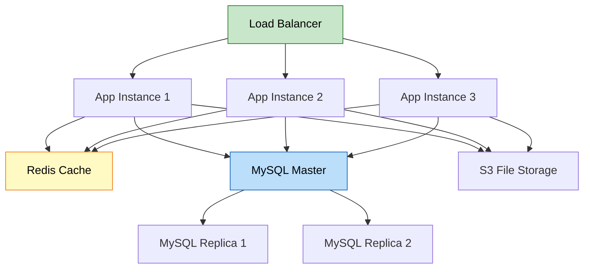

---

## 15. INTERVIEW QUESTIONS

<div align="center">

</div>

### Q1: Why use DTOs instead of exposing entities directly?

**Answer:**

**Security & Data Hiding:**
```java
// Entity has sensitive data
@Entity
public class User {
    private String password;  // Should never be exposed
    private String internalNotes;  // Internal use only
}

// DTO exposes only safe fields
public class UserResponseDTO {
    private Long id;
    private String fullName;
    private String email;
    // No password, no internal fields
}
```

**Performance:**
- Avoid lazy loading issues
- Prevent N+1 queries
- Control data fetching

**Versioning:**
- Change API without changing database
- Support multiple API versions

**Validation:**
- Different rules for input vs output
- Request validation vs response structure


---

### Q2: Explain @Cacheable vs @CacheEvict with real example

**Answer:**

**@Cacheable - Read Operations:**
```java
@Cacheable(value = "courses")
public Page<CourseResponseDTO> getAllCourses(Pageable pageable) {
    // First call: Executes query, stores in cache
    // Subsequent calls: Returns from cache (no DB hit)
}
```

**Flow:**
```
Request 1: Cache MISS → DB Query → Store in cache → Return data
Request 2: Cache HIT → Return from cache (fast!)
Request 3: Cache HIT → Return from cache (fast!)
```

**@CacheEvict - Write Operations:**
```java
@CacheEvict(value = "courses", allEntries = true)
public CourseResponseDTO createCourse(CourseRequestDTO dto, Long instructorId) {
    // After creating course, clear cache
    // Next read will fetch fresh data
}
```

**Why Needed?**
```
1. GET /api/courses → Returns 10 courses (cached)
2. POST /api/courses → Creates 11th course + clears cache
3. GET /api/courses → Returns 11 courses (fresh from DB)

Without @CacheEvict:
3. GET /api/courses → Returns 10 courses (stale cache!)
```

---

### Q3: How does Spring Boot auto-configure DispatcherServlet?

**Answer:**

**Traditional Spring (Manual):**
```xml
<!-- web.xml -->
<servlet>
    <servlet-name>dispatcher</servlet-name>
    <servlet-class>org.springframework.web.servlet.DispatcherServlet</servlet-class>
    <load-on-startup>1</load-on-startup>
</servlet>
<servlet-mapping>
    <servlet-name>dispatcher</servlet-name>
    <url-pattern>/</url-pattern>
</servlet-mapping>
```

**Spring Boot (Auto-configured):**
```java
@SpringBootApplication  // Triggers auto-configuration
public class Application {
    public static void main(String[] args) {
        SpringApplication.run(Application.class, args);
    }
}
```

**What Happens Internally:**
1. `@SpringBootApplication` → `@EnableAutoConfiguration`
2. Scans `spring-boot-autoconfigure.jar`
3. Finds `DispatcherServletAutoConfiguration`
4. Creates `DispatcherServlet` bean
5. Registers with embedded Tomcat
6. Maps to `/` by default

**Key Classes:**
- `DispatcherServletAutoConfiguration`
- `ServletWebServerFactoryAutoConfiguration`
- `TomcatServletWebServerFactory`

---

### Q4: Explain the N+1 query problem and solution

**Answer:**

**Problem:**
```java
// Fetch all courses
List<Course> courses = courseRepository.findAll();  // 1 query

// Access instructor for each course
for (Course course : courses) {
    String name = course.getInstructor().getFullName();  // N queries!
}

// Total: 1 + N queries (if 100 courses → 101 queries!)
```

**SQL Generated:**
```sql
SELECT * FROM courses;  -- 1 query
SELECT * FROM users WHERE id = 1;  -- Query for course 1
SELECT * FROM users WHERE id = 2;  -- Query for course 2
SELECT * FROM users WHERE id = 3;  -- Query for course 3
-- ... 100 queries!
```


**Solution 1: JOIN FETCH**
```java
@Query("SELECT c FROM Course c JOIN FETCH c.instructor")
List<Course> findAllWithInstructor();

// SQL: Single query with JOIN
SELECT c.*, u.* 
FROM courses c 
INNER JOIN users u ON c.instructor_id = u.id;
```

**Solution 2: @EntityGraph**
```java
@EntityGraph(attributePaths = {"instructor"})
List<Course> findAll();
```

**Solution 3: DTO Projection**
```java
@Query("SELECT new CourseDTO(c.id, c.title, i.fullName) " +
       "FROM Course c JOIN c.instructor i")
List<CourseDTO> findAllProjected();
```

---

### Q5: Why use Enrollment entity instead of @ManyToMany?

**Answer:**

**Simple @ManyToMany (Limited):**
```java
@Entity
public class Student {
    @ManyToMany
    private List<Course> courses;
}

@Entity
public class Course {
    @ManyToMany(mappedBy = "courses")
    private List<Student> students;
}

// Generated table: student_course (student_id, course_id)
// Problem: Can't store enrollment date, status, progress!
```

**Enrollment Entity (Flexible):**
```java
@Entity
public class Enrollment {
    @Id
    private Long id;
    
    @ManyToOne
    private User student;
    
    @ManyToOne
    private Course course;
    
    private LocalDate enrollmentDate;      // Extra field!
    private EnrollmentStatus status;       // Extra field!
    private Integer progressPercentage;    // Extra field!
}
```

**Benefits:**
1. Store additional data (date, status, progress)
2. Query enrollments independently
3. Add business logic to enrollment
4. Track enrollment history
5. Implement enrollment workflows

**Real-World Use Cases:**
- "Show all active enrollments"
- "Find enrollments completed in last month"
- "Calculate average progress per course"
- "Send reminder to students with <50% progress"

---

### Q6: How does ModelMapper work internally?

**Answer:**

**Mapping Process:**
```java
CourseRequestDTO dto = new CourseRequestDTO();
dto.setTitle("Spring Boot");
dto.setPrice(99.99);

Course course = modelMapper.map(dto, Course.class);
```

**Internal Steps:**
1. **Reflection:** Analyze source (DTO) and destination (Entity) classes
2. **Property Matching:** Match fields by name (title → title, price → price)
3. **Type Conversion:** Convert types if needed (String → BigDecimal)
4. **Object Creation:** Create new Course instance
5. **Value Assignment:** Set values using setters

**Matching Strategies:**
- **Standard:** Exact name match (title → title)
- **Loose:** Flexible matching (fullName → full_name)
- **Strict:** Strict matching (all fields must match)

**Custom Mapping:**
```java
modelMapper.typeMap(Course.class, CourseResponseDTO.class)
    .addMapping(src -> src.getInstructor().getFullName(), 
                CourseResponseDTO::setInstructorName);
```


---

### Q7: Explain Spring Boot's embedded Tomcat vs external Tomcat

**Answer:**

**Embedded Tomcat (Spring Boot):**
```java
@SpringBootApplication
public class Application {
    public static void main(String[] args) {
        SpringApplication.run(Application.class, args);
        // Tomcat starts automatically
    }
}

// Run: java -jar app.jar
// Packaging: JAR
```

**External Tomcat (Traditional):**
```xml
<!-- pom.xml -->
<packaging>war</packaging>

<!-- Deploy WAR to Tomcat webapps/ -->
```

**Comparison:**

| Aspect | Embedded Tomcat | External Tomcat |
|:-------|:---------------|:---------------|
| **Packaging** | JAR (executable) | WAR (deployable) |
| **Startup** | java -jar app.jar | Deploy to Tomcat |
| **Configuration** | application.properties | server.xml |
| **Portability** | Self-contained | Requires Tomcat |
| **Deployment** | Copy JAR | Copy WAR to webapps |
| **Version Control** | Tomcat version in pom.xml | Server-managed |
| **Microservices** | Perfect fit | Not ideal |

**When to Use:**
- **Embedded:** Microservices, cloud deployment, Docker
- **External:** Legacy systems, shared Tomcat, enterprise standards

---

### Q8: How does @Valid validation work?

**Answer:**

**Validation Flow:**
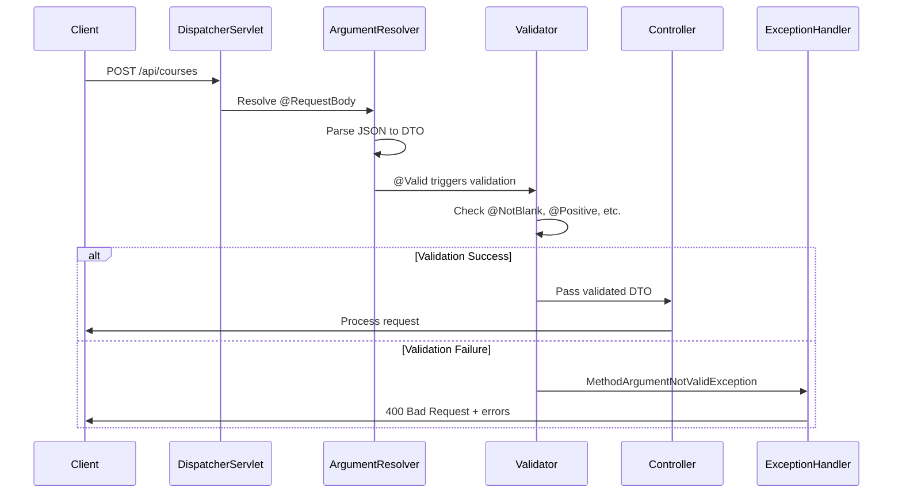

**DTO with Validation:**
```java
public class CourseRequestDTO {
    @NotBlank(message = "Title is required")
    private String title;
    
    @NotNull(message = "Price is required")
    @Positive(message = "Price must be positive")
    private BigDecimal price;
}
```

**Controller:**
```java
@PostMapping
public ResponseEntity<CourseResponseDTO> createCourse(
    @Valid @RequestBody CourseRequestDTO dto) {  // @Valid triggers validation
    // If validation fails, never reaches here
}
```

**Error Response:**
```json
{
  "title": "Title is required",
  "price": "Price must be positive"
}
```

**Common Annotations:**
- `@NotNull` - Field cannot be null
- `@NotBlank` - String cannot be empty/whitespace
- `@Email` - Valid email format
- `@Positive` - Number must be > 0
- `@Size(min, max)` - String/Collection size
- `@Pattern(regex)` - Regex validation


---

### Q9: Explain JPA cascade types with examples

**Answer:**

**Cascade Types:**

```java
@Entity
public class Course {
    @OneToMany(mappedBy = "course", cascade = CascadeType.ALL)
    private List<CourseMaterial> materials;
}
```

**CascadeType Options:**

| Type | Behavior | Example |
|:-----|:---------|:--------|
| **ALL** | All operations cascade | Delete course → delete materials |
| **PERSIST** | Save cascades | Save course → save materials |
| **MERGE** | Update cascades | Update course → update materials |
| **REMOVE** | Delete cascades | Delete course → delete materials |
| **REFRESH** | Refresh cascades | Refresh course → refresh materials |
| **DETACH** | Detach cascades | Detach course → detach materials |

**Example:**
```java
// Without CASCADE
Course course = new Course();
CourseMaterial material = new CourseMaterial();
material.setCourse(course);

courseRepository.save(course);
materialRepository.save(material);  // Must save separately

// With CASCADE.ALL
Course course = new Course();
CourseMaterial material = new CourseMaterial();
material.setCourse(course);
course.getMaterials().add(material);

courseRepository.save(course);  // Saves both course and material!
```

**Danger of CASCADE.REMOVE:**
```java
@OneToMany(cascade = CascadeType.ALL)
private List<CourseMaterial> materials;

courseRepository.delete(course);  // Deletes course AND all materials!
```

**Best Practice:**
- Use `CascadeType.ALL` for composition (parent owns children)
- Avoid `CascadeType.REMOVE` for associations (independent entities)
- Use `orphanRemoval = true` for true ownership

---

### Q10: How does Spring Data JPA generate queries from method names?

**Answer:**

**Method Name Query Generation:**

```java
public interface CourseRepository extends JpaRepository<Course, Long> {
    // Spring generates query from method name
    List<Course> findByInstructorId(Long instructorId);
    
    // Generated SQL:
    // SELECT * FROM courses WHERE instructor_id = ?
}
```

**Parsing Rules:**

| Method Name | Generated SQL |
|:-----------|:-------------|
| `findByTitle` | `WHERE title = ?` |
| `findByTitleAndPrice` | `WHERE title = ? AND price = ?` |
| `findByTitleOrPrice` | `WHERE title = ? OR price = ?` |
| `findByPriceGreaterThan` | `WHERE price > ?` |
| `findByTitleContaining` | `WHERE title LIKE %?%` |
| `findByTitleStartingWith` | `WHERE title LIKE ?%` |
| `findByPriceBetween` | `WHERE price BETWEEN ? AND ?` |
| `findByTitleOrderByPriceDesc` | `WHERE title = ? ORDER BY price DESC` |

**Complex Example:**
```java
List<Course> findByLevelAndPriceGreaterThanOrderByCreatedAtDesc(
    String level, BigDecimal price);

// SQL:
// SELECT * FROM courses 
// WHERE level = ? AND price > ? 
// ORDER BY created_at DESC
```

**Custom Query:**
```java
@Query("SELECT c FROM Course c WHERE c.price < :maxPrice")
List<Course> findAffordableCourses(@Param("maxPrice") BigDecimal maxPrice);
```


---

<div align="center">

<table>
<tr>
<td align="center">

## 🎓 End of Course Management System Documentation

<br>


<br><br>


<br>

**Created with dedication by Avinash Dhanuka**

<br>

[](https://github.com/Avinash-706)
[](https://documenter.getpostman.com/view/46177442/2sBXcLfxEC)
[](mailto:avunashdhanuka@gmail.com)

<br>

---

**Happy Learning! 🚀**

*"Build APIs that Scale, Code that Inspires!"* - Avinash Dhanuka

<br>


---

### 📊 Project Statistics

| Metric | Value |
|:-------|:------|
| **Spring Boot Version** | 3.5.11 |
| **Java Version** | 21 |
| **Database** | MySQL 8.0 |
| **Architecture** | Layered (Controller-Service-Repository) |
| **API Endpoints** | 14 |
| **Entities** | 4 (User, Course, Enrollment, Material) |
| **DTOs** | 8 |
| **Design Patterns** | DTO, Repository, Service Layer, Dependency Injection |
| **Key Features** | Pagination, Caching, File Upload, Exception Handling |
| **Documentation** | Swagger/OpenAPI 3.0 |

---

### 🛠️ Technologies Used

<div align="center">


</div>

---

**© 2026 Avinash Dhanuka | All Rights Reserved**

**📚 API Documentation:** https://documenter.getpostman.com/view/46177442/2sBXcLfxEC

*This project is part of Spring Boot learning series*

---

</td>
</tr>
</table>
</div>
