# ☕ Master Guide: JUnit 5 Testing Framework

<div align="center">


</div>

<hr style="border: 1px solid rgb(98, 117, 187)">

<div align="center">
<table>
<tr>
<td align="center">
<br />

<h3>© 2026 Avinash Dhanuka</h3>
<p>Master Guide: Unit Testing with JUnit 5</p>
<p><em>Crafted with ❤️ for Test-Driven Development</em></p>

<a href="https://github.com/Avinash-706" target="_blank">

</a>
<br />
<a href="https://mail.google.com/mail/?view=cm&fs=1&to=avunashdhanuka@gmail.com&su=JUnit%20Testing%20Query&body=☕%20Hello%20Avinash,%0D%0A%0D%0AMy%20name%20is%20[Your%20Name]%20and%20I%20have%20a%20doubt%20regarding%20JUnit%20Testing.%0D%0A%0D%0A🔹%20Topic:%20[JUnit/Testing]%0D%0A🔹%20Question:%20[Type%20your%20question]%0D%0A%0D%0AThank%20you!" target="_blank">

</a>
<br />
<br />
</td>
</tr>
</table>
</div>

> **Learning Note:** This guide provides a complete understanding of JUnit 5 testing framework, from basic assertions to advanced parameterized testing, with real-world examples and internal execution flow.

---

## 📑 Table of Contents
1. [What is JUnit? (The Foundation)](#1-what-is-junit-the-foundation)
2. [Why Do We Need JUnit?](#2-why-do-we-need-junit)
3. [Project Structure Deep Dive](#3-project-structure-deep-dive)
4. [JUnit Lifecycle & Annotations](#4-junit-lifecycle--annotations)
5. [Assertion Methods (The Core)](#5-assertion-methods-the-core)
6. [Parameterized Testing (Advanced)](#6-parameterized-testing-advanced)
7. [Internal Execution Flow](#7-internal-execution-flow)
8. [Topics Covered in This Project](#8-topics-covered-in-this-project)
9. [Spring Boot vs Plain Java Structure](#9-spring-boot-vs-plain-java-structure)
10. [Interview Questions](#10-top-interview-questions)

---


## 1. WHAT IS JUNIT? (THE FOUNDATION)

### 📌 Definition
**JUnit** is an open-source **Unit Testing Framework** for Java. It is used to write and run repeatable automated tests to ensure that individual units of code (methods, classes) work as expected.

### 🏗️ Key Characteristics
- **Framework Type:** Testing Framework (Not a library)
- **Current Version:** JUnit 5 (Jupiter) - Released in 2017
- **Architecture:** Modular (JUnit Platform + JUnit Jupiter + JUnit Vintage)
- **Annotations-Based:** Uses Java annotations like `@Test`, `@BeforeEach`
- **Assertion Library:** Built-in assertion methods for validation

### 📊 JUnit Evolution

| Version | Year | Key Features |
|:--------|:-----|:-------------|
| **JUnit 3** | 2000 | Test classes extend `TestCase`, method names start with `test` |
| **JUnit 4** | 2006 | Annotation-based (`@Test`), no need to extend classes |
| **JUnit 5** | 2017 | Modular architecture, Lambda support, Parameterized tests |

### 🏛️ JUnit 5 Architecture

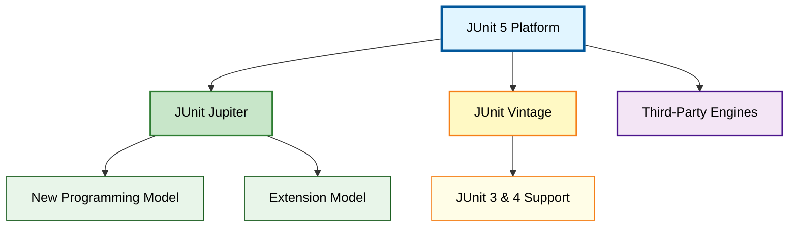

**Components Explained:**
1. **JUnit Platform:** Foundation for launching testing frameworks on the JVM
2. **JUnit Jupiter:** New programming model and extension model for JUnit 5
3. **JUnit Vintage:** Provides backward compatibility with JUnit 3 and 4

---


## 2. WHY DO WE NEED JUNIT?

### 🎯 The Problem Without Testing
Imagine you have a `Calculator` class with 10 methods. Every time you make a change:
- ❌ You manually test each method by running `main()` 
- ❌ You write `System.out.println()` statements everywhere
- ❌ You forget to test edge cases (divide by zero, negative numbers)
- ❌ When bugs appear in production, you don't know which method broke

### ✅ The Solution: Automated Testing with JUnit
1. **Automated Verification:** Write tests once, run them thousands of times
2. **Regression Prevention:** Ensure new code doesn't break existing functionality
3. **Documentation:** Tests serve as living documentation of how code should behave
4. **Confidence:** Refactor code fearlessly knowing tests will catch errors
5. **CI/CD Integration:** Automated tests run in build pipelines before deployment

### 📈 Testing Pyramid

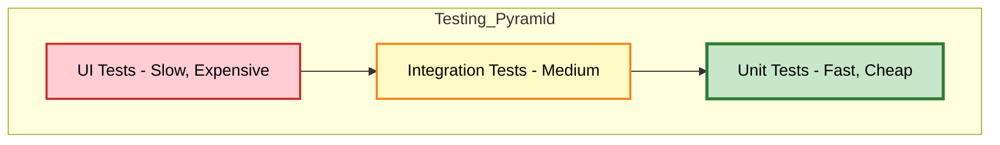

**JUnit focuses on the base:** Unit Tests (70% of all tests should be unit tests)

### 🔄 Test-Driven Development (TDD) Cycle

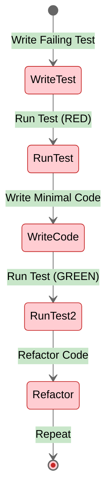

---


## 3. PROJECT STRUCTURE DEEP DIVE

> **📝 Documentation by:** Avinash Dhanuka | [GitHub Profile](https://github.com/Avinash-706)

### 📂 Complete Folder Hierarchy

```
JUnitOne/
├── .idea/                          # IntelliJ IDEA configuration files
├── out/                            # Compiled .class files (bytecode)
├── src/
│   ├── main/                       # Production code
│   │   └── com.tyss/              # Package structure
│   │       ├── Calculator.java
│   │       └── StudentEligibilityService.java
│   └── test/                       # Test code
│       ├── com/tyss/              # Mirror package structure
│       │   ├── Calculator_Test.java
│       │   └── StudentServiceTest.java
│       └── resources/             # Test resources
│           └── calculator-data.csv
├── .gitignore
└── JUnitOne.iml                   # IntelliJ module file
```

### 🏗️ Package Structure Explained

#### Why `com.tyss`?
Java follows **reverse domain naming convention**:
- If your company domain is `tyss.com`
- Package becomes `com.tyss`
- This ensures global uniqueness (no package name conflicts)

#### Main vs Test Separation

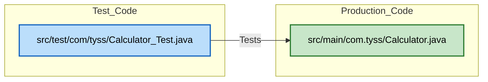

**Critical Rule:** Test classes must be in the **same package** as the class they test (but in the `test` folder)

### 📦 How Packages Work in Java

**Package Declaration (Line 1 of every file):**
```java
package com.tyss;  // This file belongs to com.tyss package
```

**What Happens Internally:**
1. **Compilation:** `javac` creates folder structure matching package name
2. **Bytecode Location:** `Calculator.class` is placed in `out/com/tyss/`
3. **Import Resolution:** JVM searches for classes using package path

**Example:**
```java
// File: Calculator.java
package com.tyss;  // Declares package

public class Calculator {
    // Class code
}
```

When compiled:
```
out/
└── com/
    └── tyss/
        └── Calculator.class  ← Bytecode stored here
```

---


### 🔍 File-by-File Breakdown

#### 1. **Calculator.java** (Production Code)
**Location:** `src/main/com.tyss/Calculator.java`

**Purpose:** Business logic for arithmetic operations

**Key Methods:**
```java
public static int add(int a, int b)      // Addition
public static int divide(int a, int b)   // Division with exception handling
public static boolean isEven(int a)      // Even number check
```

**Why Static?** No need to create object instances for simple utility methods.

---

#### 2. **StudentEligibilityService.java** (Production Code)
**Location:** `src/main/com.tyss/StudentEligibilityService.java`

**Purpose:** Business logic for student eligibility validation

**Key Method:**
```java
public boolean isEligible(int age)  // Returns true if age >= 18
```

**Exception Handling:** Throws `IllegalArgumentException` for negative age

---

#### 3. **Calculator_Test.java** (Test Code)
**Location:** `src/test/com/tyss/Calculator_Test.java`

**Purpose:** Comprehensive testing of Calculator class

**Topics Covered:**
- ✅ Lifecycle annotations (`@BeforeAll`, `@AfterEach`)
- ✅ Basic assertions (`assertEquals`, `assertTrue`)
- ✅ Exception testing (`assertThrows`)
- ✅ Parameterized tests (9 different sources!)
- ✅ Test watchers (custom test result tracking)
- ✅ Repeated tests (`@RepeatedTest`)
- ✅ Disabled tests (`@Disabled`)

**Reference:** See [Calculator_Test.java:21](src/test/com/tyss/Calculator_Test.java#L21) for lifecycle implementation

---

#### 4. **StudentServiceTest.java** (Test Code)
**Location:** `src/test/com/tyss/StudentServiceTest.java`

**Purpose:** Testing StudentEligibilityService

**Topics Covered:**
- ✅ All basic assertions
- ✅ `assertAll()` for grouped assertions
- ✅ `fail()` method for manual test failure
- ✅ Object reference testing (`assertSame`, `assertNotSame`)

---

#### 5. **calculator-data.csv** (Test Resource)
**Location:** `src/test/resources/calculator-data.csv`

**Purpose:** External test data for `@CsvFileSource`

**Format:**
```csv
2,3,5      ← input1, input2, expected_output
10,5,15
20,4,24
```

**Why External Files?**
- Separates test data from test logic
- Easy to modify without changing code
- Can be managed by non-developers (QA team)

---


## 4. JUNIT LIFECYCLE & ANNOTATIONS

### 📌 What are Annotations?
Annotations are **metadata** that provide information to the compiler and JVM about how to execute code.

**Syntax:** `@AnnotationName`

### 🔄 Test Execution Lifecycle

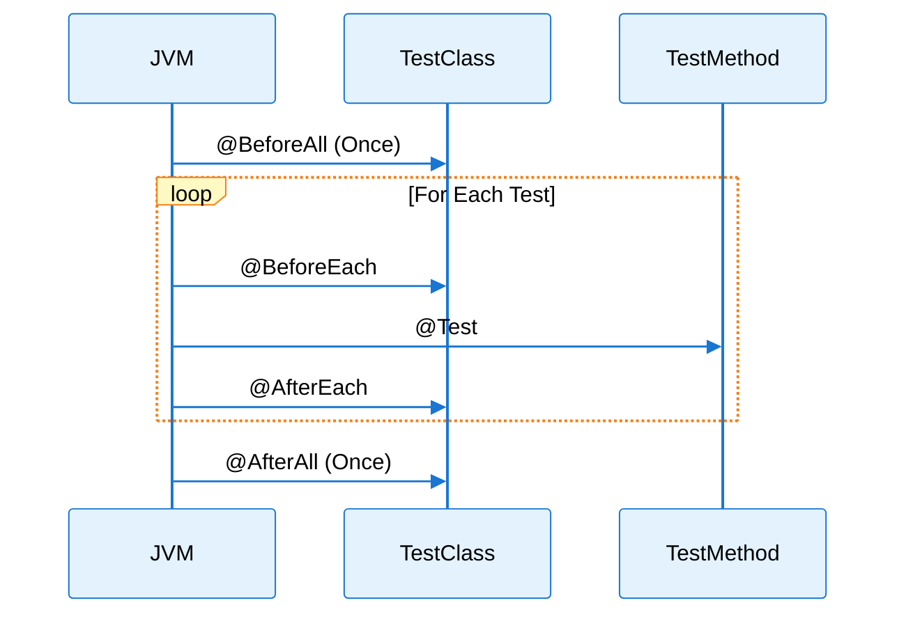

### 📋 Core Lifecycle Annotations

| Annotation | Execution | Method Type | Use Case |
|:-----------|:----------|:------------|:---------|
| **@BeforeAll** | Once before all tests | `static` | Database connection, load config |
| **@BeforeEach** | Before each test | Instance | Create fresh object instances |
| **@Test** | Test execution | Instance | Actual test logic |
| **@AfterEach** | After each test | Instance | Cleanup resources, reset state |
| **@AfterAll** | Once after all tests | `static` | Close connections, print summary |

### 🔍 Real Example from Calculator_Test.java

**Reference:** [Calculator_Test.java:46](src/test/com/tyss/Calculator_Test.java#L46)

```java
@BeforeAll
static void beforeAllTests() {
    System.out.println("-- Start All Tests --");
}

@BeforeEach
void setup() {
    calc = new Calculator();  // Fresh instance for each test
}

@AfterEach
void tearDown() {
    calc = null;  // Cleanup
}
```

**Why Fresh Instances?** Ensures test isolation - one test's changes don't affect another.

---

### 🎯 Test Annotations

| Annotation | Purpose | Example |
|:-----------|:--------|:--------|
| **@Test** | Marks method as test | `@Test void testAdd() {}` |
| **@DisplayName** | Custom test name | `@DisplayName("Division Success Test")` |
| **@Disabled** | Skip test execution | `@Disabled @Test void skip() {}` |
| **@RepeatedTest(n)** | Run test n times | `@RepeatedTest(5)` |

**Reference:** [Calculator_Test.java:217](src/test/com/tyss/Calculator_Test.java#L217)

```java
@RepeatedTest(2)
void testRepeated() {
    assertEquals(4, calc.add(2, 2));  // Runs twice
}
```

---


## 5. ASSERTION METHODS (THE CORE)

### 📌 What is an Assertion?
An **assertion** is a statement that checks if a condition is true. If false, the test fails.

**Syntax:** `assertXxx(expected, actual, message)`

### 🏗️ Internal Working of Assertions

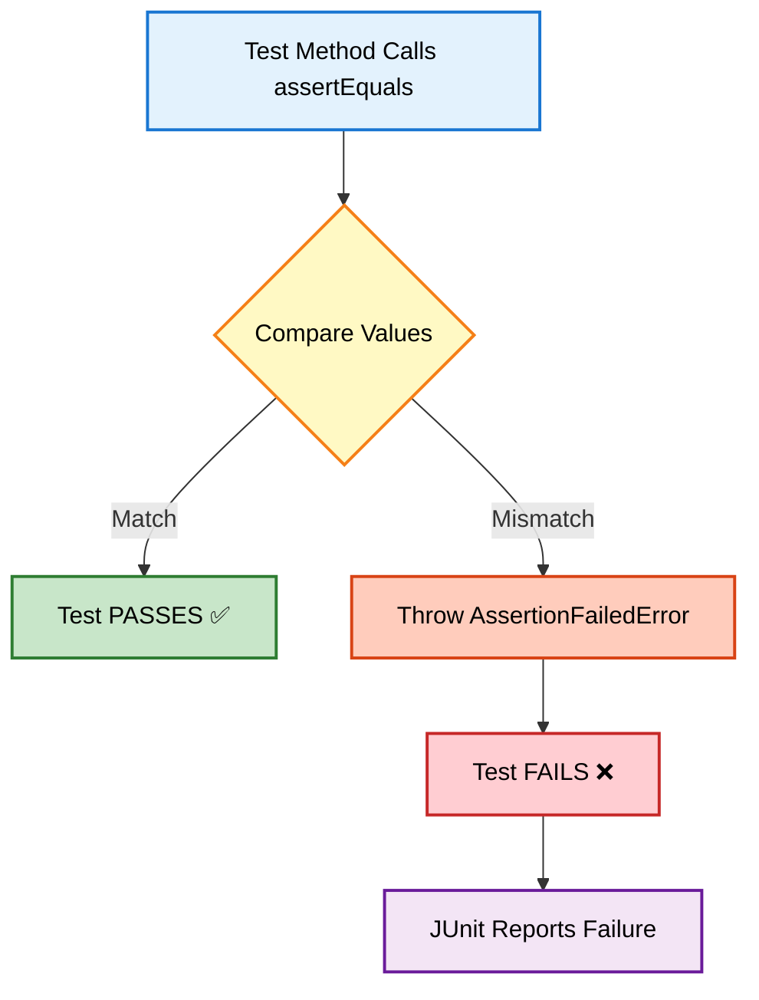

### 📊 Complete Assertion Methods Table

| Method | Purpose | Example | Reference |
|:-------|:--------|:--------|:----------|
| **assertEquals** | Check equality | `assertEquals(5, calc.add(2,3))` | [Calculator_Test.java:163](src/test/com/tyss/Calculator_Test.java#L163) |
| **assertNotEquals** | Check inequality | `assertNotEquals(10, calc.subtract(8,3))` | [Calculator_Test.java:168](src/test/com/tyss/Calculator_Test.java#L168) |
| **assertTrue** | Check boolean true | `assertTrue(calc.isEven(4))` | [Calculator_Test.java:173](src/test/com/tyss/Calculator_Test.java#L173) |
| **assertFalse** | Check boolean false | `assertFalse(calc.isEven(5))` | [Calculator_Test.java:178](src/test/com/tyss/Calculator_Test.java#L178) |
| **assertNull** | Check if null | `assertNull(obj)` | [Calculator_Test.java:184](src/test/com/tyss/Calculator_Test.java#L184) |
| **assertNotNull** | Check if not null | `assertNotNull(calc)` | [Calculator_Test.java:189](src/test/com/tyss/Calculator_Test.java#L189) |
| **assertSame** | Check same reference | `assertSame(ref1, ref2)` | [Calculator_Test.java:195](src/test/com/tyss/Calculator_Test.java#L195) |
| **assertNotSame** | Check different reference | `assertNotSame(new Calc(), new Calc())` | [Calculator_Test.java:202](src/test/com/tyss/Calculator_Test.java#L202) |
| **assertThrows** | Check exception thrown | `assertThrows(ArithmeticException.class, ...)` | [Calculator_Test.java:208](src/test/com/tyss/Calculator_Test.java#L208) |
| **assertAll** | Group multiple assertions | `assertAll(() -> ..., () -> ...)` | [StudentServiceTest.java:60](src/test/com/tyss/StudentServiceTest.java#L60) |
| **fail** | Manually fail test | `fail("Should not reach here")` | [StudentServiceTest.java:74](src/test/com/tyss/StudentServiceTest.java#L74) |

---

### 🔍 Deep Dive: assertEquals vs assertSame

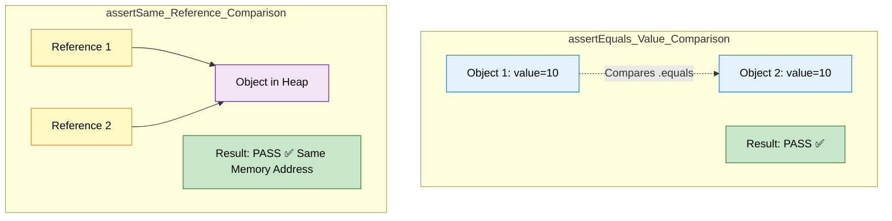

**Example:**
```java
Integer a = 100;
Integer b = 100;
assertEquals(a, b);    // ✅ PASS (values are equal)
assertSame(a, b);      // ✅ PASS (Integer cache: same object)

Integer x = 200;
Integer y = 200;
assertEquals(x, y);    // ✅ PASS (values are equal)
assertSame(x, y);      // ❌ FAIL (different objects in heap)
```

---

### 🎯 assertThrows: Exception Testing

**Why Important?** Ensures your code handles errors correctly.

**Reference:** [Calculator_Test.java:208](src/test/com/tyss/Calculator_Test.java#L208)

```java
@Test
void testAssertThrows() {
    assertThrows(ArithmeticException.class, () -> {
        calc.divide(10, 0);  // Should throw exception
    });
}
```

**Internal Flow:**
1. JUnit executes the lambda `() -> calc.divide(10, 0)`
2. If `ArithmeticException` is thrown → Test PASSES ✅
3. If no exception or different exception → Test FAILS ❌

---


## 6. PARAMETERIZED TESTING (ADVANCED)

> **📝 Comprehensive Guide by:** Avinash Dhanuka | © 2026

### 📌 What is Parameterized Testing?
Running the **same test logic** with **different input data** without duplicating code.

### 🎯 The Problem Without Parameterization

```java
// ❌ BAD: Repetitive code
@Test void testAdd1() { assertEquals(5, calc.add(2, 3)); }
@Test void testAdd2() { assertEquals(0, calc.add(0, 0)); }
@Test void testAdd3() { assertEquals(5, calc.add(-5, 10)); }
// ... 100 more tests? 😱
```

### ✅ The Solution: @ParameterizedTest

```java
// ✅ GOOD: One test, multiple data sets
@ParameterizedTest
@CsvSource({"2,3,5", "0,0,0", "-5,10,5"})
void testAdd(int a, int b, int expected) {
    assertEquals(expected, calc.add(a, b));
}
```

---

### 📊 All 9 Parameterized Sources Covered

| Source | Use Case | Example | Reference |
|:-------|:---------|:--------|:----------|
| **@CsvSource** | Multiple parameters inline | `@CsvSource({"2,3,5"})` | [Calculator_Test.java:64](src/test/com/tyss/Calculator_Test.java#L64) |
| **@ValueSource** | Single parameter | `@ValueSource(ints={2,4,6})` | [Calculator_Test.java:77](src/test/com/tyss/Calculator_Test.java#L77) |
| **@MethodSource** | Complex/dynamic data | `@MethodSource("provideData")` | [Calculator_Test.java:105](src/test/com/tyss/Calculator_Test.java#L105) |
| **@CsvFileSource** | External CSV file | `@CsvFileSource(resources="/data.csv")` | [Calculator_Test.java:113](src/test/com/tyss/Calculator_Test.java#L113) |
| **@NullSource** | Null values | `@NullSource` | [Calculator_Test.java:120](src/test/com/tyss/Calculator_Test.java#L120) |
| **@EmptySource** | Empty strings/collections | `@EmptySource` | [Calculator_Test.java:128](src/test/com/tyss/Calculator_Test.java#L128) |
| **@NullAndEmptySource** | Both null and empty | `@NullAndEmptySource` | [Calculator_Test.java:136](src/test/com/tyss/Calculator_Test.java#L136) |
| **@EnumSource** | Enum values | `@EnumSource(Operation.class)` | [Calculator_Test.java:149](src/test/com/tyss/Calculator_Test.java#L149) |

---

### 🔍 Deep Dive: Each Source Type

#### 1️⃣ @CsvSource (Comma-Separated Values)

**When to Use:** Multiple parameters with expected output

**Reference:** [Calculator_Test.java:64](src/test/com/tyss/Calculator_Test.java#L64)

```java
@ParameterizedTest
@CsvSource({
    "2, 3, 5",      // Test case 1
    "0, 0, 0",      // Test case 2
    "-5, 10, 5"     // Test case 3
})
void testAdd(int a, int b, int expected) {
    assertEquals(expected, calc.add(a, b));
}
```

**Internal Execution:**
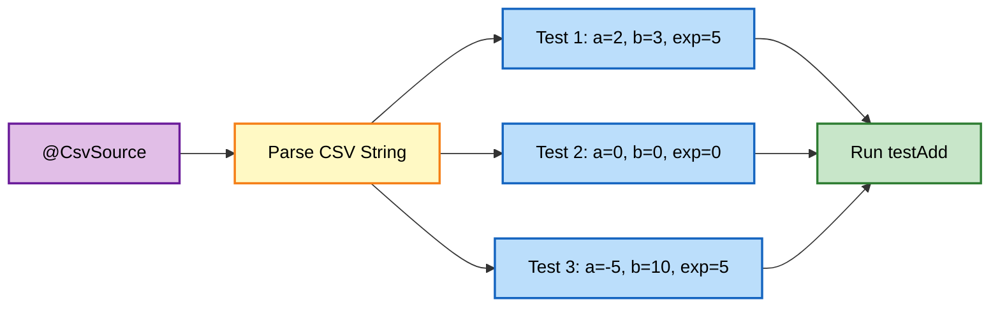

---

#### 2️⃣ @ValueSource (Single Parameter)

**When to Use:** Testing with single input values

**Reference:** [Calculator_Test.java:77](src/test/com/tyss/Calculator_Test.java#L77)

```java
@ParameterizedTest
@ValueSource(ints = {2, 4, 6, 8, 10})
void testIsEven(int number) {
    assertTrue(calc.isEven(number));
}
```

**Supported Types:** `ints`, `strings`, `doubles`, `longs`, `booleans`, `shorts`, `bytes`, `chars`, `floats`, `classes`

---

#### 3️⃣ @MethodSource (Dynamic Data)

**When to Use:** Complex test data, reusable data sets

**Reference:** [Calculator_Test.java:93](src/test/com/tyss/Calculator_Test.java#L93)

```java
// Data provider method
private static Stream<Arguments> provideDivisionTestCases() {
    return Stream.of(
        Arguments.of(20, 4, 5),
        Arguments.of(10, 2, 5)
    );
}

@ParameterizedTest
@MethodSource("provideDivisionTestCases")
void testDivide(int a, int b, int expected) {
    assertEquals(expected, calc.divide(a, b));
}
```

**Rules:**
- Method must be `static`
- Must return `Stream<Arguments>`
- Method name matches annotation value

---

#### 4️⃣ @CsvFileSource (External Data)

**When to Use:** Large data sets, data managed by QA team

**Reference:** [Calculator_Test.java:113](src/test/com/tyss/Calculator_Test.java#L113)

```java
@ParameterizedTest
@CsvFileSource(resources = "/resources/calculator-data.csv", numLinesToSkip = 0)
void testAddUsingCsvFile(int a, int b, int expected) {
    assertEquals(expected, calc.add(a, b));
}
```

**CSV File Format:** [calculator-data.csv](src/test/resources/calculator-data.csv)
```csv
2,3,5
10,5,15
20,4,24
```

**Advantages:**
- ✅ Separate test data from code
- ✅ Easy to add/modify test cases
- ✅ Can be version controlled separately

---

#### 5️⃣ @NullSource, @EmptySource, @NullAndEmptySource

**When to Use:** Testing null/empty handling

**Reference:** [Calculator_Test.java:120](src/test/com/tyss/Calculator_Test.java#L120)

```java
@ParameterizedTest
@NullSource
void testNull(Integer value) {
    assertNull(value);  // value will be null
}

@ParameterizedTest
@EmptySource
void testEmpty(String value) {
    assertTrue(value.isEmpty());  // value will be ""
}

@ParameterizedTest
@NullAndEmptySource
void testBoth(String value) {
    assertTrue(value == null || value.isEmpty());
}
```

---

#### 6️⃣ @EnumSource (Enum Testing)

**When to Use:** Testing all enum values

**Reference:** [Calculator_Test.java:149](src/test/com/tyss/Calculator_Test.java#L149)

```java
enum Operation { ADD, SUBTRACT, MULTIPLY, DIVIDE }

@ParameterizedTest
@EnumSource(Operation.class)
void testEnum(Operation op) {
    assertNotNull(op);  // Runs 4 times (one per enum)
}
```

---


## 7. INTERNAL EXECUTION FLOW

> **📝 Deep Dive by:** Avinash Dhanuka | Understanding JVM Internals

### 🏭 How JUnit Executes Tests (JVM Level)

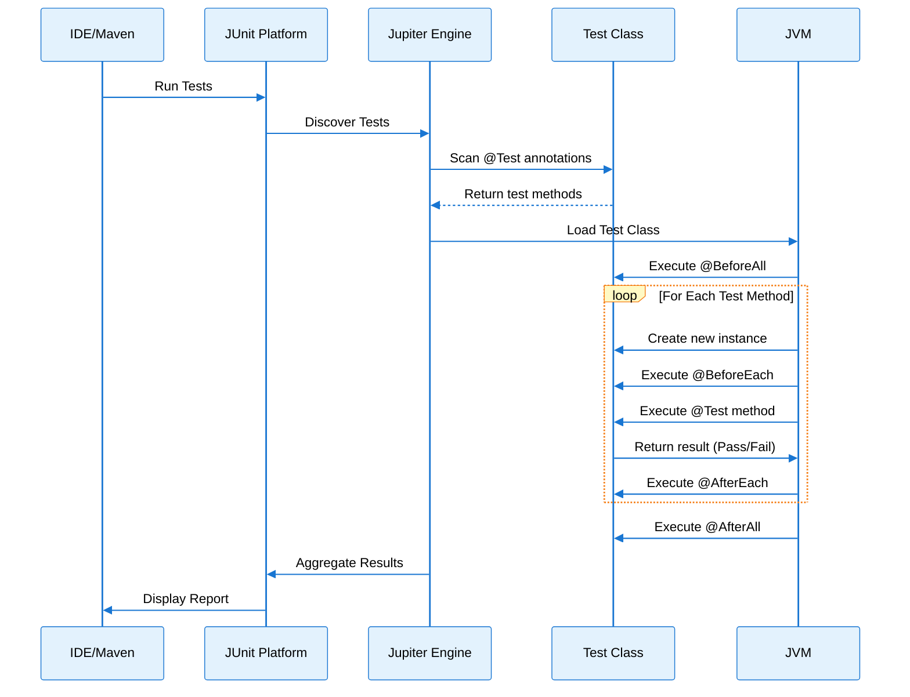

### 🔍 Step-by-Step Execution

**Example Test:** `Calculator_Test.testAdd()`

1. **Class Loading:**
   ```
   JVM loads Calculator_Test.class into memory
   ```

2. **Static Initialization:**
   ```java
   static int passed = 0;  // Initialized once
   @BeforeAll static void beforeAllTests() { ... }  // Runs once
   ```

3. **Instance Creation (Per Test):**
   ```java
   Calculator_Test testInstance = new Calculator_Test();  // Fresh instance
   ```

4. **Setup:**
   ```java
   @BeforeEach void setup() {
       calc = new Calculator();  // New Calculator object
   }
   ```

5. **Test Execution:**
   ```java
   @Test void testAdd() {
       assertEquals(5, calc.add(2, 3));  // Assertion checked
   }
   ```

6. **Teardown:**
   ```java
   @AfterEach void tearDown() {
       calc = null;  // Cleanup
   }
   ```

7. **Final Cleanup:**
   ```java
   @AfterAll static void afterAllTests() {
       System.out.println("Tests: " + passed);  // Summary
   }
   ```

---

### 🧠 Memory Architecture During Testing

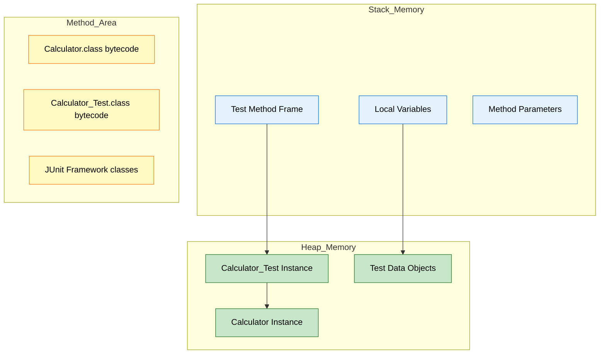

**Key Points:**
- Each `@Test` method gets a **new instance** of the test class
- Static variables (`passed`, `failed`) persist across all tests
- `@BeforeAll` and `@AfterAll` execute in **static context** (no instance)

---

### 🎯 TestWatcher Extension (Advanced)

**Reference:** [Calculator_Test.java:21](src/test/com/tyss/Calculator_Test.java#L21)

```java
@RegisterExtension
TestWatcher watcher = new TestWatcher() {
    @Override
    public void testSuccessful(ExtensionContext context) {
        passed++;  // Increment on success
    }
    
    @Override
    public void testFailed(ExtensionContext context, Throwable cause) {
        failed++;  // Increment on failure
    }
};
```

**What is TestWatcher?**
- An **Extension** that hooks into test lifecycle
- Allows custom logic after each test completes
- Used here to track pass/fail/skip counts

**Execution Flow:**
```mermaid
graph LR
    A[@Test Executes] --> B{Result?}
    B -->|Pass| C[testSuccessful called]
    B -->|Fail| D[testFailed called]
    B -->|Skip| E[testDisabled called]
    
    C --> F[passed++]
    D --> G[failed++]
    E --> H[skipped++]
    
    style A fill:#e3f2fd,stroke:#1976d2,color:#000
    style B fill:#f3e5f5,stroke:#6a1b9a,color:#000
    style C fill:#c8e6c9,stroke:#2e7d32,color:#000
    style D fill:#ffcdd2,stroke:#c62828,color:#000
    style E fill:#fff9c4,stroke:#f57f17,color:#000
    style F fill:#a5d6a7,stroke:#2e7d32,color:#000
    style G fill:#ef9a9a,stroke:#c62828,color:#000
    style H fill:#fff59d,stroke:#f57f17,color:#000
```

---


## 8. TOPICS COVERED IN THIS PROJECT

### ✅ Complete Checklist

#### 🎯 Core JUnit Concepts
- ✅ **Test Class Structure:** Proper naming convention (`ClassName_Test`)
- ✅ **Package Organization:** Mirroring production code structure
- ✅ **Lifecycle Annotations:** `@BeforeAll`, `@BeforeEach`, `@AfterEach`, `@AfterAll`
- ✅ **Test Annotations:** `@Test`, `@DisplayName`, `@Disabled`, `@RepeatedTest`

#### 🔍 Assertion Methods (11 Types)
- ✅ `assertEquals` - Value equality
- ✅ `assertNotEquals` - Value inequality
- ✅ `assertTrue` - Boolean true check
- ✅ `assertFalse` - Boolean false check
- ✅ `assertNull` - Null check
- ✅ `assertNotNull` - Not null check
- ✅ `assertSame` - Reference equality
- ✅ `assertNotSame` - Reference inequality
- ✅ `assertThrows` - Exception testing
- ✅ `assertAll` - Grouped assertions
- ✅ `fail` - Manual test failure

#### 🎲 Parameterized Testing (9 Sources)
- ✅ `@CsvSource` - Inline CSV data
- ✅ `@ValueSource` - Single parameter arrays
- ✅ `@MethodSource` - Dynamic data from methods
- ✅ `@CsvFileSource` - External CSV files
- ✅ `@NullSource` - Null value testing
- ✅ `@EmptySource` - Empty value testing
- ✅ `@NullAndEmptySource` - Combined null/empty
- ✅ `@EnumSource` - Enum value testing

#### 🔧 Advanced Features
- ✅ **TestWatcher Extension:** Custom test result tracking
- ✅ **@RegisterExtension:** Extension registration
- ✅ **Exception Handling:** Testing expected exceptions
- ✅ **Test Resources:** External data files
- ✅ **Static vs Instance Methods:** Understanding context

---

### 📚 Learning Path Progression

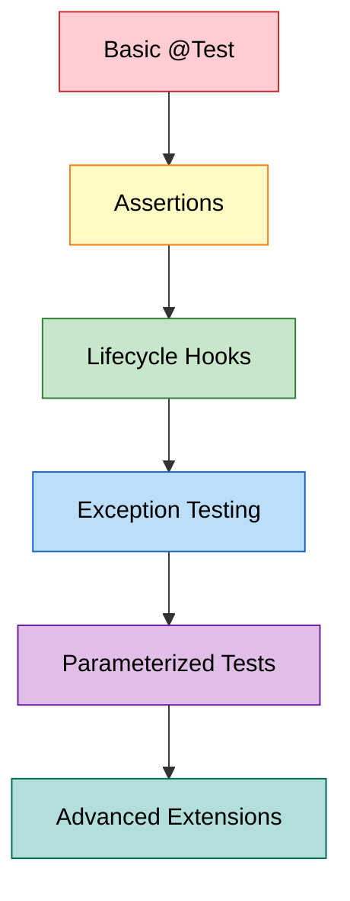

**Beginner → Intermediate → Advanced**

---

### 🎓 Real-World Applications

| Concept | Real-World Use Case |
|:--------|:-------------------|
| **@CsvSource** | Testing payment calculations with different amounts |
| **@MethodSource** | Testing user authentication with various credentials |
| **@CsvFileSource** | Testing data import from Excel/CSV files |
| **assertThrows** | Validating API error responses |
| **@BeforeEach** | Setting up database connections before each test |
| **TestWatcher** | Generating custom test reports for stakeholders |
| **@RepeatedTest** | Stress testing concurrent operations |

---


## 9. SPRING BOOT VS PLAIN JAVA STRUCTURE

> **📝 Detailed Comparison by:** Avinash Dhanuka | [Connect on GitHub](https://github.com/Avinash-706)

### 🏗️ Architectural Comparison

```mermaid
graph TD
    subgraph Plain_Java_JUnit_Project
        A1[src/main/com.tyss/]
        A2[src/test/com/tyss/]
        A3[.iml file]
        A4[Manual dependency management]
    end
    
    subgraph Spring_Boot_Project
        B1[src/main/java/com/tyss/]
        B2[src/main/resources/]
        B3[src/test/java/com/tyss/]
        B4[pom.xml or build.gradle]
        B5[application.properties]
        B6[@SpringBootApplication]
    end
    
    style A1 fill:#e3f2fd,stroke:#1976d2,color:#000
    style A2 fill:#e3f2fd,stroke:#1976d2,color:#000
    style A3 fill:#e3f2fd,stroke:#1976d2,color:#000
    style A4 fill:#e3f2fd,stroke:#1976d2,color:#000
    style B1 fill:#c8e6c9,stroke:#2e7d32,color:#000
    style B2 fill:#c8e6c9,stroke:#2e7d32,color:#000
    style B3 fill:#c8e6c9,stroke:#2e7d32,color:#000
    style B4 fill:#c8e6c9,stroke:#2e7d32,color:#000
    style B5 fill:#c8e6c9,stroke:#2e7d32,color:#000
    style B6 fill:#c8e6c9,stroke:#2e7d32,color:#000
```

---

### 📊 Detailed Comparison Table

| Aspect | Plain Java (This Project) | Spring Boot |
|:-------|:--------------------------|:------------|
| **Project Type** | Simple Java Application | Enterprise Web Application |
| **Build Tool** | None (IDE managed) | Maven/Gradle (pom.xml/build.gradle) |
| **Dependency Management** | Manual JAR files | Automatic via Maven Central |
| **Main Folder** | `src/main/com.tyss/` | `src/main/java/com/company/` |
| **Resources Folder** | `src/test/resources/` only | `src/main/resources/` + `src/test/resources/` |
| **Configuration** | None | `application.properties` or `application.yml` |
| **Entry Point** | `public static void main()` | `@SpringBootApplication` class |
| **Dependency Injection** | Manual object creation | `@Autowired`, `@Component` |
| **Testing** | JUnit 5 (Jupiter) | JUnit 5 + Spring Test (`@SpringBootTest`) |
| **Web Layer** | Not applicable | Controllers (`@RestController`) |
| **Database** | Not applicable | JPA, Hibernate (`@Entity`, `@Repository`) |
| **Packaging** | `.jar` (plain) | `.jar` (executable with embedded Tomcat) |

---

### 🔍 Folder Structure Comparison

#### Plain Java (Current Project)
```
JUnitOne/
├── src/
│   ├── main/
│   │   └── com.tyss/          ← Business logic only
│   │       ├── Calculator.java
│   │       └── StudentEligibilityService.java
│   └── test/
│       ├── com/tyss/          ← Test classes
│       └── resources/         ← Test data files
├── out/                       ← Compiled classes
└── JUnitOne.iml              ← IntelliJ config
```

#### Spring Boot Project
```
spring-boot-app/
├── src/
│   ├── main/
│   │   ├── java/com/company/
│   │   │   ├── SpringBootAppApplication.java  ← Entry point
│   │   │   ├── controller/                    ← REST APIs
│   │   │   │   └── UserController.java
│   │   │   ├── service/                       ← Business logic
│   │   │   │   └── UserService.java
│   │   │   ├── repository/                    ← Database access
│   │   │   │   └── UserRepository.java
│   │   │   └── model/                         ← Data entities
│   │   │       └── User.java
│   │   └── resources/
│   │       ├── application.properties         ← Configuration
│   │       ├── static/                        ← CSS, JS files
│   │       └── templates/                     ← HTML templates
│   └── test/
│       └── java/com/company/
│           └── UserServiceTest.java
├── target/                                    ← Build output
├── pom.xml                                    ← Maven dependencies
└── mvnw                                       ← Maven wrapper
```

---

### 🎯 Key Differences Explained

#### 1. **Dependency Management**

**Plain Java:**
```java
// Manual import of JUnit JAR
import org.junit.jupiter.api.Test;
```
You must download `junit-jupiter-5.x.x.jar` and add to classpath manually.

**Spring Boot (pom.xml):**
```xml
<dependency>
    <groupId>org.springframework.boot</groupId>
    <artifactId>spring-boot-starter-test</artifactId>
    <scope>test</scope>
</dependency>
```
Maven automatically downloads JUnit + Mockito + AssertJ + Spring Test.

---

#### 2. **Object Creation**

**Plain Java:**
```java
@BeforeEach
void setup() {
    calc = new Calculator();  // Manual instantiation
}
```

**Spring Boot:**
```java
@Autowired
private Calculator calc;  // Spring creates and injects automatically
```

---

#### 3. **Testing Approach**

**Plain Java (Unit Test):**
```java
@Test
void testAdd() {
    Calculator calc = new Calculator();
    assertEquals(5, calc.add(2, 3));  // Pure unit test
}
```

**Spring Boot (Integration Test):**
```java
@SpringBootTest
class UserServiceTest {
    @Autowired
    private UserService userService;  // Tests with real Spring context
    
    @Test
    void testCreateUser() {
        User user = userService.createUser("John");
        assertNotNull(user.getId());  // Tests database interaction
    }
}
```

---

#### 4. **Application Entry Point**

**Plain Java:**
```java
public class Calculator {
    public static void main(String[] args) {
        System.out.println("Hello");  // Simple console app
    }
}
```

**Spring Boot:**
```java
@SpringBootApplication
public class Application {
    public static void main(String[] args) {
        SpringApplication.run(Application.class, args);  // Starts web server
    }
}
```

---

### 🌐 When to Use What?

| Use Case | Choose |
|:---------|:-------|
| Learning Java basics | Plain Java |
| Simple utility libraries | Plain Java |
| Command-line tools | Plain Java |
| REST APIs | Spring Boot |
| Microservices | Spring Boot |
| Database applications | Spring Boot |
| Enterprise applications | Spring Boot |

---

### 🔄 Migration Path


**Steps to Convert This Project to Spring Boot:**
1. Create `pom.xml` with Spring Boot dependencies
2. Move `com.tyss` to `src/main/java/com/tyss/`
3. Add `@Component` to `Calculator` and `StudentEligibilityService`
4. Create `@SpringBootApplication` main class
5. Change tests to use `@SpringBootTest` and `@Autowired`
    
---


## 10. TOP INTERVIEW QUESTIONS

> **📝 Curated by:** Avinash Dhanuka | © 2026 | [GitHub](https://github.com/Avinash-706)

### 🧠 JUnit Fundamentals

#### Q1: What is the difference between JUnit 4 and JUnit 5?

| Feature | JUnit 4 | JUnit 5 |
|:--------|:--------|:--------|
| **Architecture** | Monolithic | Modular (Platform + Jupiter + Vintage) |
| **Annotations** | `@Before`, `@After` | `@BeforeEach`, `@AfterEach` |
| **Assertions** | `org.junit.Assert` | `org.junit.jupiter.api.Assertions` |
| **Test Instance** | One per class | One per method (default) |
| **Parameterized** | `@RunWith(Parameterized.class)` | `@ParameterizedTest` |
| **Lambda Support** | No | Yes (`assertThrows(() -> ...)`) |

---

#### Q2: Why does JUnit create a new instance for each test method?

**Answer:** To ensure **test isolation**. If tests shared the same instance, one test could modify state that affects another test, causing unpredictable failures.

**Example:**
```java
class MyTest {
    int counter = 0;  // Instance variable
    
    @Test void test1() { counter++; }  // counter = 1
    @Test void test2() { counter++; }  // counter = 1 (new instance!)
}
```

Each test gets `counter = 0` because JUnit creates a fresh instance.

---

#### Q3: What is the difference between `assertEquals` and `assertSame`?

**Answer:**
- **assertEquals:** Compares **values** using `.equals()` method
- **assertSame:** Compares **memory references** using `==` operator

**Example:**
```java
String s1 = new String("hello");
String s2 = new String("hello");

assertEquals(s1, s2);   // ✅ PASS (values are equal)
assertSame(s1, s2);     // ❌ FAIL (different objects in heap)
```

---

#### Q4: When should you use `@BeforeAll` vs `@BeforeEach`?

| Annotation | Use Case | Example |
|:-----------|:---------|:--------|
| **@BeforeAll** | Expensive setup (once) | Database connection, load config file |
| **@BeforeEach** | Fresh state (per test) | Create new object instances, reset variables |

**Reference:** [Calculator_Test.java:46](src/test/com/tyss/Calculator_Test.java#L46)

---

#### Q5: How do you test if a method throws an exception?

**Answer:** Use `assertThrows()`

**Reference:** [Calculator_Test.java:208](src/test/com/tyss/Calculator_Test.java#L208)

```java
@Test
void testDivideByZero() {
    assertThrows(ArithmeticException.class, () -> {
        calc.divide(10, 0);
    });
}
```

**Why Lambda?** JUnit needs to execute the code and catch the exception. Lambda delays execution until JUnit is ready.

---

### 🎯 Parameterized Testing

#### Q6: What is the advantage of `@MethodSource` over `@CsvSource`?

**Answer:**

| Feature | @CsvSource | @MethodSource |
|:--------|:-----------|:--------------|
| **Data Type** | Strings only | Any Java object |
| **Complexity** | Simple values | Complex objects, lists |
| **Reusability** | No | Yes (method can be reused) |
| **Dynamic Data** | No | Yes (can read from DB/API) |

**Example:**
```java
// @MethodSource can return complex objects
private static Stream<Arguments> provideUsers() {
    return Stream.of(
        Arguments.of(new User("John", 25)),
        Arguments.of(new User("Jane", 30))
    );
}
```

---

#### Q7: How does `@CsvFileSource` find the CSV file?

**Answer:** It looks in the **classpath** under `src/test/resources/`

**Reference:** [Calculator_Test.java:113](src/test/com/tyss/Calculator_Test.java#L113)

```java
@CsvFileSource(resources = "/resources/calculator-data.csv")
```

**Path Resolution:**
1. JUnit looks in `src/test/resources/resources/calculator-data.csv`
2. During build, files are copied to `out/test/resources/`
3. JVM loads from classpath

---

#### Q8: Can you use multiple parameterized sources on one test?

**Answer:** No, but you can combine some:

```java
// ✅ VALID: Combines null and empty
@ParameterizedTest
@NullAndEmptySource
@ValueSource(strings = {"  ", "\t", "\n"})
void testBlankStrings(String input) {
    assertTrue(input == null || input.trim().isEmpty());
}
```

---

### 🔧 Advanced Concepts

#### Q9: What is a TestWatcher and when would you use it?

**Answer:** A **TestWatcher** is a JUnit extension that hooks into test lifecycle events.

**Use Cases:**
- Custom logging
- Screenshot capture on test failure (Selenium)
- Performance metrics tracking
- Custom reporting

**Reference:** [Calculator_Test.java:21](src/test/com/tyss/Calculator_Test.java#L21)

---

#### Q10: Why are `@BeforeAll` and `@AfterAll` methods static?

**Answer:** Because they run **before any instance is created**. JUnit needs to call them without instantiating the test class.

**Memory Timeline:**
```
1. Load Calculator_Test.class into Method Area
2. Execute @BeforeAll (static context)
3. Create instance #1 → run test1
4. Create instance #2 → run test2
5. Execute @AfterAll (static context)
```

---

#### Q11: What happens if an assertion fails in `@BeforeEach`?

**Answer:** The test is **skipped** and marked as **failed**. The `@Test` method never executes.

**Execution Flow:**
```mermaid
graph TD
    A[@BeforeEach] --> B{Assertion Pass?}
    B -->|Yes| C[@Test Executes]
    B -->|No| D[Test Marked as FAILED]
    D --> E[@AfterEach Still Runs]
    
    style A fill:#e3f2fd,stroke:#1976d2,color:#000
    style B fill:#fff9c4,stroke:#f57f17,color:#000
    style C fill:#c8e6c9,stroke:#2e7d32,color:#000
    style D fill:#ffcdd2,stroke:#c62828,color:#000
    style E fill:#f3e5f5,stroke:#6a1b9a,color:#000
```

---

#### Q12: How do you skip a test conditionally?

**Answer:** Use `Assumptions.assumeTrue()`

```java
@Test
void testOnlyOnWindows() {
    Assumptions.assumeTrue(System.getProperty("os.name").contains("Windows"));
    // Test only runs on Windows
}
```

**Difference from `@Disabled`:**
- `@Disabled`: Always skips
- `Assumptions`: Skips based on runtime condition

---

### 🎓 Scenario-Based Questions

#### Q13: You have 100 test methods. How do you run only tests related to "addition"?

**Answer:** Use `@Tag` annotation

```java
@Test
@Tag("addition")
void testAdd() { ... }

@Test
@Tag("division")
void testDivide() { ... }
```

**Run Command:**
```bash
mvn test -Dgroups="addition"
```

---

#### Q14: How would you test a method that takes 10 seconds to execute?

**Answer:** Use `@Timeout` annotation

```java
@Test
@Timeout(value = 5, unit = TimeUnit.SECONDS)
void testSlowMethod() {
    slowService.process();  // Fails if takes > 5 seconds
}
```

---

#### Q15: Your test passes locally but fails in CI/CD. What could be wrong?

**Possible Causes:**
1. **Environment Variables:** Missing in CI
2. **File Paths:** Absolute paths instead of relative
3. **Time Zones:** Date/time assertions
4. **Test Order Dependency:** Tests not isolated
5. **Resource Files:** Not included in build

**Solution:** Use `@TestInstance(Lifecycle.PER_CLASS)` to debug state issues.

---

### 💡 Best Practices

#### Q16: What are the characteristics of a good unit test?

**FIRST Principles:**
- **F**ast: Runs in milliseconds
- **I**ndependent: No dependencies between tests
- **R**epeatable: Same result every time
- **S**elf-Validating: Pass/fail, no manual verification
- **T**imely: Written before or with production code (TDD)

---

#### Q17: Should you test private methods?

**Answer:** **No.** Test public methods only. Private methods are implementation details.

**Reasoning:**
- Private methods are tested indirectly through public methods
- Testing private methods couples tests to implementation
- Refactoring becomes difficult

**If you must test private methods:**
```java
// Use reflection (not recommended)
Method method = Calculator.class.getDeclaredMethod("privateMethod");
method.setAccessible(true);
method.invoke(calc);
```

---

### 🚀 Real-World Scenarios

#### Q18: How do you test a REST API controller in Spring Boot?

**Answer:** Use `@WebMvcTest` + `MockMvc`

```java
@WebMvcTest(UserController.class)
class UserControllerTest {
    @Autowired
    private MockMvc mockMvc;
    
    @Test
    void testGetUser() throws Exception {
        mockMvc.perform(get("/users/1"))
               .andExpect(status().isOk())
               .andExpect(jsonPath("$.name").value("John"));
    }
}
```

---

#### Q19: How do you test database operations?

**Answer:** Use `@DataJpaTest` with H2 in-memory database

```java
@DataJpaTest
class UserRepositoryTest {
    @Autowired
    private UserRepository repository;
    
    @Test
    void testSaveUser() {
        User user = new User("John");
        User saved = repository.save(user);
        assertNotNull(saved.getId());
    }
}
```

---

#### Q20: What is the difference between Unit Test and Integration Test?

| Aspect | Unit Test | Integration Test |
|:-------|:----------|:-----------------|
| **Scope** | Single method/class | Multiple components |
| **Dependencies** | Mocked | Real (database, APIs) |
| **Speed** | Fast (milliseconds) | Slow (seconds) |
| **Annotation** | `@Test` | `@SpringBootTest` |
| **Example** | Testing `Calculator.add()` | Testing REST API → Service → Database |

**This Project:** Pure **Unit Tests** (no external dependencies)

---

<div align="center">

### 🎓 End of Master Guide

**Created with dedication by Avinash Dhanuka**

[](https://github.com/Avinash-706)
[](mailto:avunashdhanuka@gmail.com)

**© 2026 Avinash Dhanuka | All Rights Reserved**

*This documentation is protected intellectual property. Unauthorized reproduction or distribution is prohibited.*

---

**Happy Testing! 🎉**

*"Write tests, not bugs!"* - Avinash Dhanuka

</div>

