# ☕ Master Guide: Mockito Testing Framework with Maven

<div align="center">


</div>

<hr style="border: 1px solid rgb(98, 117, 187)">

<div align="center">
<table>
<tr>
<td align="center">
<br />

<h3>© 2026 Avinash Dhanuka</h3>
<p>Master Guide: Mocking & Dependency Testing</p>
<p><em>Crafted with ❤️ for Advanced Unit Testing</em></p>

<a href="https://github.com/Avinash-706" target="_blank">

</a>
<br />
<a href="https://mail.google.com/mail/?view=cm&fs=1&to=avunashdhanuka@gmail.com&su=Mockito%20Testing%20Query&body=☕%20Hello%20Avinash,%0D%0A%0D%0AMy%20name%20is%20[Your%20Name]%20and%20I%20have%20a%20doubt%20regarding%20Mockito%20Testing.%0D%0A%0D%0A🔹%20Topic:%20[Mockito/Mocking]%0D%0A🔹%20Question:%20[Type%20your%20question]%0D%0A%0D%0AThank%20you!" target="_blank">

</a>
<br />
<br />
</td>
</tr>
</table>
</div>

> **Learning Note:** This guide builds upon Day 01 (JUnit 5) and introduces Mockito - the most popular mocking framework for Java. Learn how to test classes with dependencies without needing real implementations.

> **Prerequisites:** Complete understanding of [Day 01 - JUnit 5 Fundamentals](../../day01/JUnitOne/README.md)

---

## 📑 Table of Contents
1. [What is Mockito? (The Foundation)](#1-what-is-mockito-the-foundation)
2. [Why Do We Need Mockito?](#2-why-do-we-need-mockito)
3. [Maven Project Structure](#3-maven-project-structure)
4. [Understanding Dependencies](#4-understanding-dependencies)
5. [Mockito Core Concepts](#5-mockito-core-concepts)
6. [Annotations Deep Dive](#6-annotations-deep-dive)
7. [Stubbing & Verification](#7-stubbing--verification)
8. [Internal Execution Flow](#8-internal-execution-flow)
9. [Topics Covered in This Project](#9-topics-covered-in-this-project)
10. [Day 01 vs Day 02 Comparison](#10-day-01-vs-day-02-comparison)
11. [Interview Questions](#11-top-interview-questions)

---


## 1. WHAT IS MOCKITO? (THE FOUNDATION)

> **📝 Author:** Avinash Dhanuka | [GitHub](https://github.com/Avinash-706)

### 📌 Definition
**Mockito** is a powerful **mocking framework** for Java that allows you to create and configure **mock objects** (fake objects) for testing. It works seamlessly with JUnit 5 to test classes that have dependencies on other classes.

### 🏗️ Key Characteristics
- **Framework Type:** Mocking Framework (Works with JUnit)
- **Current Version:** Mockito 5.12.0 (Used in this project)
- **Purpose:** Create fake objects to isolate unit tests
- **Integration:** Works with JUnit 4, JUnit 5, TestNG
- **Behavior:** Allows you to define how mock objects should behave

### 📊 Evolution Timeline

| Version | Year | Key Features |
|:--------|:-----|:-------------|
| **Mockito 1.x** | 2008 | Basic mocking, `when().thenReturn()` |
| **Mockito 2.x** | 2016 | Java 8 support, better error messages |
| **Mockito 3.x** | 2019 | Java 11 support, inline mocking |
| **Mockito 4.x** | 2021 | Java 17 support, improved performance |
| **Mockito 5.x** | 2023 | Java 21 support, enhanced annotations |

### 🎯 What is a "Mock"?

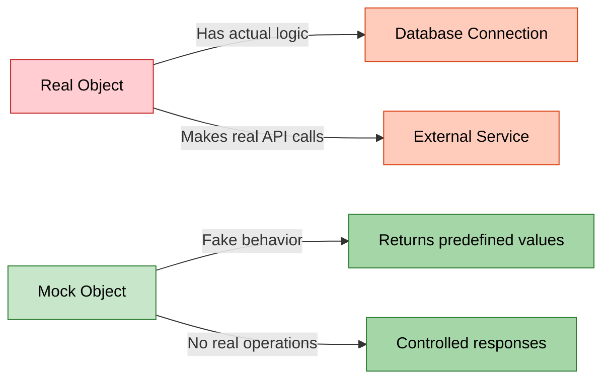

**Simple Analogy:**
- **Real Object:** A real bank that processes actual money
- **Mock Object:** A toy bank that pretends to process money (for testing)

---


## 2. WHY DO WE NEED MOCKITO?

### 🎯 The Problem Without Mocking

Imagine you're testing an `OrderService` that depends on a `PaymentService`:

```java
public class OrderService {
    private PaymentService paymentService;
    
    public String placeOrder(double amount) {
        boolean success = paymentService.processPayment(amount);
        return success ? "ORDER PLACED" : "PAYMENT FAILED";
    }
}
```

**Problems when testing WITHOUT Mockito:**
1. ❌ `PaymentService` might connect to a real payment gateway (costs money!)
2. ❌ Tests become slow (network calls, database queries)
3. ❌ Tests fail if external service is down
4. ❌ Hard to test error scenarios (what if payment fails?)
5. ❌ Cannot test in isolation (testing OrderService + PaymentService together)

### ✅ The Solution: Mockito

```java
@Test
void testPlaceOrder() {
    // Create a FAKE PaymentService
    PaymentService mockPayment = mock(PaymentService.class);
    
    // Tell the fake: "When processPayment is called, return true"
    when(mockPayment.processPayment(500.0)).thenReturn(true);
    
    // Now test OrderService with the fake
    OrderService orderService = new OrderService(mockPayment);
    String result = orderService.placeOrder(500.0);
    
    assertEquals("ORDER PLACED", result);  // ✅ Test passes!
}
```

**Benefits:**
1. ✅ No real payment processing (fast & free)
2. ✅ Tests run in milliseconds
3. ✅ Can simulate any scenario (success, failure, exceptions)
4. ✅ True unit testing (test ONE class at a time)
5. ✅ No external dependencies needed

### 📈 Testing Pyramid with Mocking

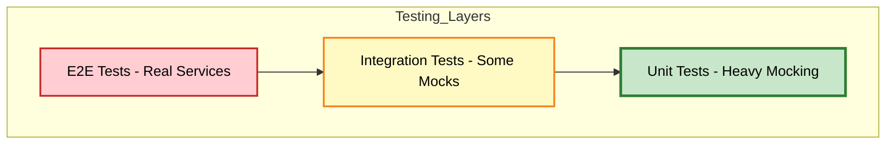

**Mockito is used heavily in Unit Tests (the base of the pyramid)**

---


## 3. MAVEN PROJECT STRUCTURE

> **📝 Documentation by:** Avinash Dhanuka | [GitHub Profile](https://github.com/Avinash-706)

### 📂 Complete Folder Hierarchy

```
MockitoMaven/
├── .idea/                          # IntelliJ IDEA configuration
├── .mvn/                           # Maven wrapper files
├── src/
│   ├── main/
│   │   ├── java/org/example/
│   │   │   ├── Main.java                    # Entry point (not used in tests)
│   │   │   ├── OrderService.java            # Class under test
│   │   │   └── PaymentService.java          # Dependency (will be mocked)
│   │   └── resources/                       # Application resources
│   └── test/
│       └── java/org/example/
│           └── OrderServiceTest.java        # Mockito test class
├── target/                         # Compiled classes (Maven output)
├── .gitignore
└── pom.xml                         # Maven configuration file
```

### 🆚 Day 01 vs Day 02 Structure

| Aspect | Day 01 (JUnit Only) | Day 02 (Mockito + Maven) |
|:-------|:-------------------|:------------------------|
| **Build Tool** | None (IDE managed) | Maven (pom.xml) |
| **Dependencies** | Manual JAR files | Automatic via Maven |
| **Project Type** | Plain Java | Maven Project |
| **Folder Structure** | `src/main/com.tyss/` | `src/main/java/org/example/` |
| **Dependency Injection** | Not used | Constructor Injection |
| **Testing Focus** | Basic assertions | Mocking dependencies |

### 🏗️ What is Maven?

**Maven** is a **build automation tool** and **dependency manager** for Java projects.

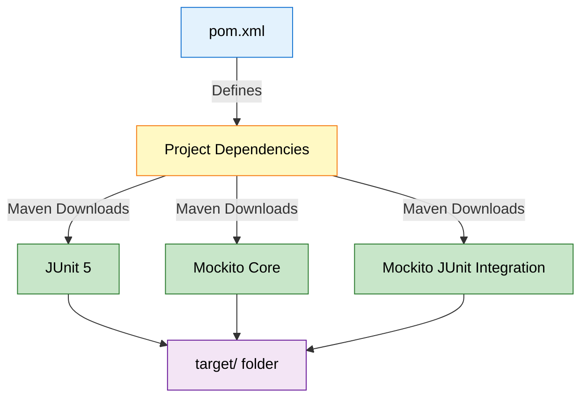

**Key Maven Concepts:**

1. **pom.xml** - Project Object Model (configuration file)
2. **Dependencies** - External libraries your project needs
3. **target/** - Where Maven puts compiled `.class` files
4. **Maven Central** - Online repository of Java libraries

---

### 📦 Understanding pom.xml

**Reference:** [pom.xml](pom.xml)

```xml
<project>
    <groupId>org.example</groupId>           <!-- Company/Organization -->
    <artifactId>MockitoMaven</artifactId>    <!-- Project Name -->
    <version>1.0-SNAPSHOT</version>          <!-- Project Version -->
    
    <properties>
        <maven.compiler.source>21</maven.compiler.source>  <!-- Java 21 -->
        <maven.compiler.target>21</maven.compiler.target>
    </properties>
    
    <dependencies>
        <!-- JUnit 5 -->
        <dependency>
            <groupId>org.junit.jupiter</groupId>
            <artifactId>junit-jupiter</artifactId>
            <version>5.10.2</version>
            <scope>test</scope>  <!-- Only for testing -->
        </dependency>
        
        <!-- Mockito Core -->
        <dependency>
            <groupId>org.mockito</groupId>
            <artifactId>mockito-core</artifactId>
            <version>5.12.0</version>
            <scope>test</scope>
        </dependency>
        
        <!-- Mockito + JUnit 5 Integration -->
        <dependency>
            <groupId>org.mockito</groupId>
            <artifactId>mockito-junit-jupiter</artifactId>
            <version>5.12.0</version>
            <scope>test</scope>
        </dependency>
    </dependencies>
</project>
```

**What Each Dependency Does:**

| Dependency | Purpose |
|:-----------|:--------|
| **junit-jupiter** | JUnit 5 testing framework (from Day 01) |
| **mockito-core** | Core Mockito library for creating mocks |
| **mockito-junit-jupiter** | Integrates Mockito with JUnit 5 annotations |

**How Maven Works:**

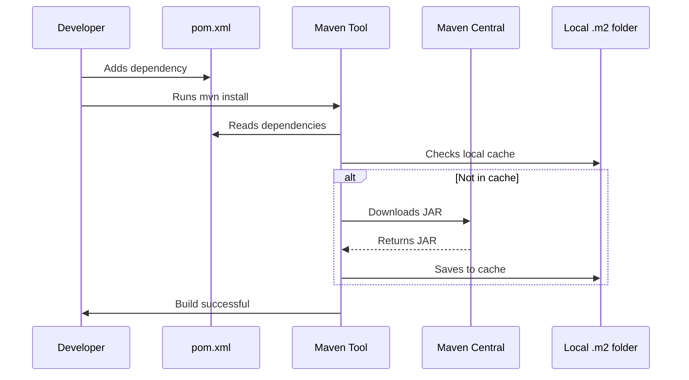

**Maven Local Repository:** `C:\Users\YourName\.m2\repository\` (Windows)

---


## 4. UNDERSTANDING DEPENDENCIES

### 📌 What is a Dependency?

A **dependency** is when one class needs another class to function.

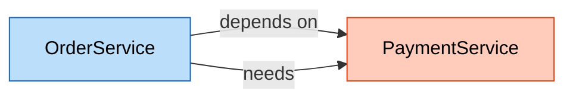

**Real-World Analogy:**
- You (OrderService) want to buy something online
- You need a payment method (PaymentService) to complete the purchase
- You **depend** on the payment service

### 🔍 Code Analysis: PaymentService.java

**Reference:** [PaymentService.java:3](src/main/java/org/example/PaymentService.java#L3)

```java
public class PaymentService {
    public boolean processPayment(double amount) {
        System.out.println("Processing Payment of $" + amount);
        return true;  // Simulates successful payment
    }
    
    public String getTransactionId(double amount) {
        return "TXN" + System.currentTimeMillis();
    }
}
```

**What This Class Does:**
- `processPayment()` - Simulates processing a payment
- `getTransactionId()` - Generates a transaction ID
- In real life, this would connect to Stripe, PayPal, etc.

---

### 🔍 Code Analysis: OrderService.java

**Reference:** [OrderService.java:3](src/main/java/org/example/OrderService.java#L3)

```java
public class OrderService {
    private PaymentService paymentservice;  // Dependency
    
    // Constructor Injection
    public OrderService(PaymentService paymentservice) {
        this.paymentservice = paymentservice;
    }
    
    public String placeOrder(double amount) {
        boolean paymentSuccess = paymentservice.processPayment(amount);
        if (paymentSuccess) {
            return "ORDER PLACED";
        }
        return "PAYMENT FAILED";
    }
}
```

**Key Concepts:**

1. **Dependency Declaration:**
   ```java
   private PaymentService paymentservice;  // OrderService NEEDS PaymentService
   ```

2. **Constructor Injection:**
   ```java
   public OrderService(PaymentService paymentservice) {
       this.paymentservice = paymentservice;  // Inject dependency
   }
   ```
   - **Why?** Allows us to pass a MOCK PaymentService during testing!

3. **Using the Dependency:**
   ```java
   paymentservice.processPayment(amount);  // Calls the dependency
   ```

### 🎯 Dependency Injection Explained

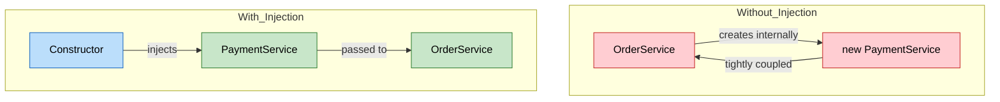

**Bad (Tight Coupling):**
```java
public class OrderService {
    private PaymentService paymentservice = new PaymentService();  // ❌ Hard to test
}
```

**Good (Dependency Injection):**
```java
public class OrderService {
    private PaymentService paymentservice;
    
    public OrderService(PaymentService paymentservice) {  // ✅ Easy to test
        this.paymentservice = paymentservice;
    }
}
```

**Why is this important for testing?**
- With injection, we can pass a MOCK PaymentService
- Without injection, OrderService always uses the real PaymentService

---


## 5. MOCKITO CORE CONCEPTS

> **📝 Comprehensive Guide by:** Avinash Dhanuka | © 2026

### 📌 The Three Pillars of Mockito

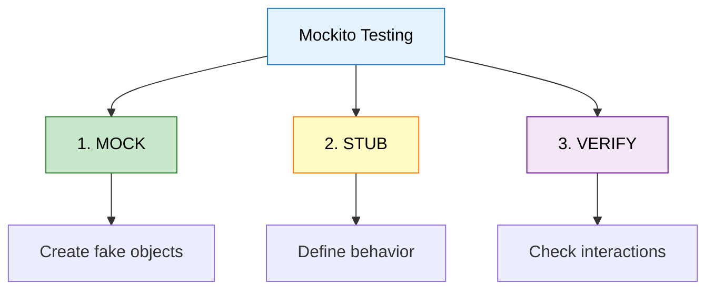

### 1️⃣ MOCK - Creating Fake Objects

**What is Mocking?**
Creating a fake version of a class that looks real but doesn't do anything.

```java
// Create a mock (fake) PaymentService
PaymentService mockPayment = mock(PaymentService.class);
```

**What happens internally:**
- Mockito creates a fake PaymentService object
- All methods return default values (false, null, 0)
- No real code from PaymentService executes

### 2️⃣ STUB - Defining Behavior

**What is Stubbing?**
Telling the mock object how to behave when methods are called.

```java
// Tell the mock: "When processPayment(500.0) is called, return true"
when(mockPayment.processPayment(500.0)).thenReturn(true);
```

**Stubbing Syntax:**
```
when(mockObject.method(arguments)).thenReturn(value);
```

### 3️⃣ VERIFY - Checking Interactions

**What is Verification?**
Confirming that a method was actually called on the mock.

```java
// Check: Was processPayment(500.0) called?
verify(mockPayment).processPayment(500.0);
```

---

### 🔄 Complete Mockito Flow

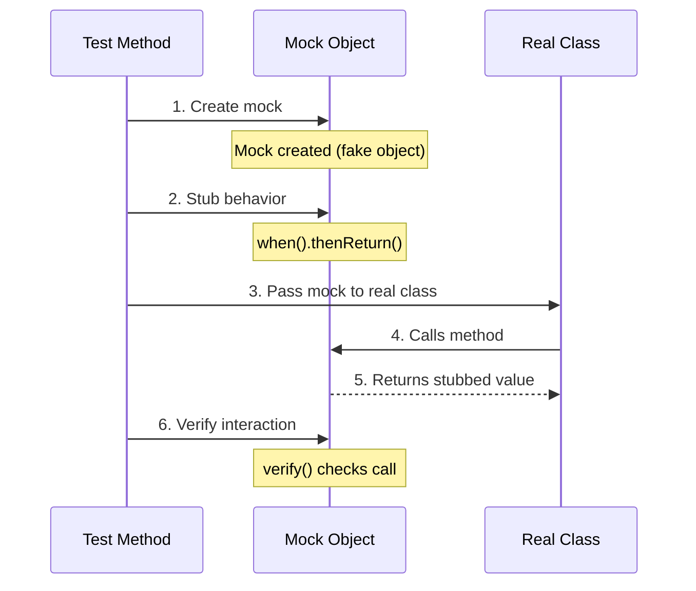

**Step-by-Step Example:**

```java
// Step 1: Create mock
PaymentService mockPayment = mock(PaymentService.class);

// Step 2: Stub behavior
when(mockPayment.processPayment(500.0)).thenReturn(true);

// Step 3: Pass mock to real class
OrderService orderService = new OrderService(mockPayment);

// Step 4 & 5: Real class calls mock, gets stubbed value
String result = orderService.placeOrder(500.0);

// Step 6: Verify interaction
verify(mockPayment).processPayment(500.0);
```

---

### 📊 Mock vs Real Object Comparison

| Aspect | Real Object | Mock Object |
|:-------|:------------|:------------|
| **Creation** | `new PaymentService()` | `mock(PaymentService.class)` |
| **Behavior** | Executes actual code | Returns predefined values |
| **Speed** | Slow (real operations) | Fast (no operations) |
| **Dependencies** | Needs database, network | No dependencies |
| **Control** | Cannot control output | Full control over output |
| **Use Case** | Production code | Testing only |

---


## 6. ANNOTATIONS DEEP DIVE

### 📌 Mockito Annotations

Mockito provides annotations to simplify mock creation and injection.

### 🏷️ Core Annotations

| Annotation | Purpose | Example |
|:-----------|:--------|:--------|
| **@Mock** | Creates a mock object | `@Mock PaymentService paymentService;` |
| **@InjectMocks** | Injects mocks into this object | `@InjectMocks OrderService orderService;` |
| **@Spy** | Creates a partial mock | `@Spy PaymentService paymentService;` |
| **@Captor** | Captures method arguments | `@Captor ArgumentCaptor<String> captor;` |

---

### 1️⃣ @Mock Annotation

**Reference:** [OrderServiceTest.java:18](src/test/java/org/example/OrderServiceTest.java#L18)

```java
@Mock
PaymentService paymentServiceMock;
```

**What it does:**
- Creates a mock (fake) PaymentService
- Equivalent to: `PaymentService paymentServiceMock = mock(PaymentService.class);`

**Internal Working:**


---

### 2️⃣ @InjectMocks Annotation

**Reference:** [OrderServiceTest.java:21](src/test/java/org/example/OrderServiceTest.java#L21)

```java
@InjectMocks
OrderService orderService;
```

**What it does:**
- Creates a real OrderService object
- Automatically injects all @Mock objects into it
- Equivalent to: `OrderService orderService = new OrderService(paymentServiceMock);`

**Injection Process:**

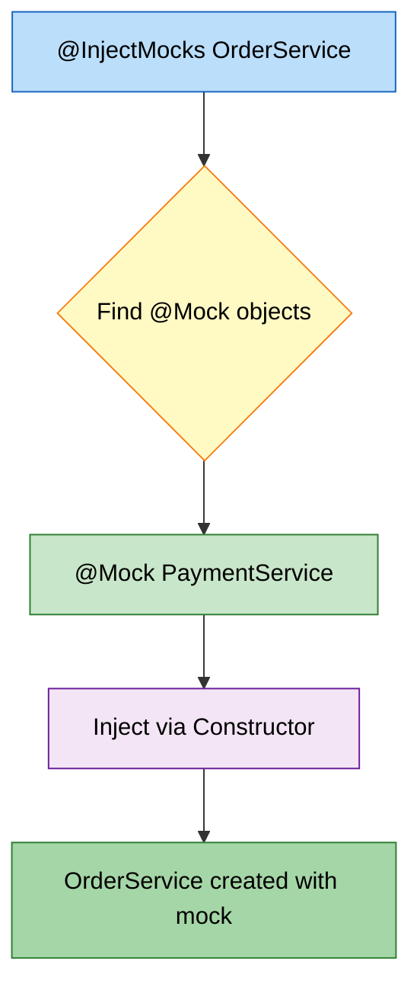

**How Mockito Injects:**
1. **Constructor Injection** (preferred) - Passes mock via constructor
2. **Setter Injection** - Calls setter methods
3. **Field Injection** - Directly sets private fields (reflection)

---

### 3️⃣ MockitoAnnotations.openMocks()

**Reference:** [OrderServiceTest.java:24](src/test/java/org/example/OrderServiceTest.java#L24)

```java
@BeforeEach
void setUp() {
    MockitoAnnotations.openMocks(this);
}
```

**What it does:**
- Initializes all @Mock and @InjectMocks annotations
- Must be called before tests run
- Usually placed in @BeforeEach

**Without this line:**
- @Mock creates null objects
- @InjectMocks doesn't inject anything
- Tests will fail with NullPointerException

**Alternative (JUnit 5 Extension):**
```java
@ExtendWith(MockitoExtension.class)  // Automatically initializes mocks
public class OrderServiceTest {
    @Mock PaymentService paymentServiceMock;
    @InjectMocks OrderService orderService;
    // No need for MockitoAnnotations.openMocks(this)
}
```

---

### 📊 Annotation Comparison

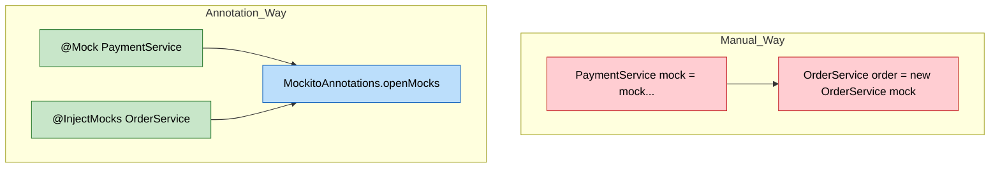

**Benefits of Annotations:**
- ✅ Less boilerplate code
- ✅ Cleaner test classes
- ✅ Automatic injection
- ✅ Better readability

---


## 7. STUBBING & VERIFICATION

> **📝 Deep Dive by:** Avinash Dhanuka | Understanding Mock Behavior

### 📌 Stubbing Methods

Stubbing = Defining how a mock should behave when its methods are called.

### 1️⃣ Basic Stubbing: when().thenReturn()

**Reference:** [OrderServiceTest.java:36](src/test/java/org/example/OrderServiceTest.java#L36)

```java
@Test
void testPlaceOrder_Success() {
    // STUB: Tell mock what to return
    when(paymentServiceMock.processPayment(500.0))
        .thenReturn(true);
    
    // ACT: Call the method being tested
    String result = orderService.placeOrder(500.0);
    
    // ASSERT: Check the result
    assertEquals("ORDER PLACED", result);
    
    // VERIFY: Confirm mock was called
    verify(paymentServiceMock).processPayment(500.0);
}
```

**Breakdown:**

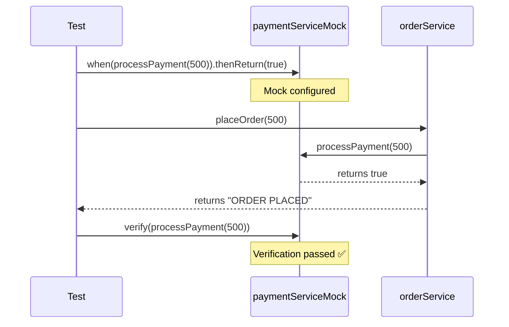

---

### 2️⃣ Stubbing with anyDouble()

**Reference:** [OrderServiceTest.java:64](src/test/java/org/example/OrderServiceTest.java#L64)

```java
@Test
void testPlaceOrder_AnyAmount() {
    // STUB: Return true for ANY double value
    when(paymentServiceMock.processPayment(anyDouble()))
        .thenReturn(true);
    
    String result = orderService.placeOrder(999.99);  // Any amount works!
    
    assertEquals("ORDER PLACED", result);
}
```

**Argument Matchers:**

| Matcher | Purpose | Example |
|:--------|:--------|:--------|
| **anyDouble()** | Matches any double | `anyDouble()` |
| **anyInt()** | Matches any int | `anyInt()` |
| **anyString()** | Matches any String | `anyString()` |
| **any(Class)** | Matches any object of type | `any(User.class)` |
| **eq(value)** | Matches exact value | `eq(500.0)` |

**When to use:**
- `anyDouble()` - When you don't care about the exact value
- `500.0` - When you want to test a specific value

---

### 3️⃣ Stubbing Exceptions: when().thenThrow()

**Reference:** [OrderServiceTest.java:85](src/test/java/org/example/OrderServiceTest.java#L85)

```java
@Test
void testPlaceOrder_Exception() {
    // STUB: Throw exception when method is called
    when(paymentServiceMock.processPayment(anyDouble()))
        .thenThrow(new RuntimeException("Bank API down!"));
    
    // ASSERT: Expect exception to be thrown
    RuntimeException exception = assertThrows(
        RuntimeException.class,
        () -> orderService.placeOrder(100.0)
    );
    
    assertEquals("Bank API down!", exception.getMessage());
}
```

**Use Cases for thenThrow():**
- Simulate network failures
- Test error handling
- Simulate database connection errors
- Test timeout scenarios

---

### 4️⃣ Multiple Stubbing

```java
// Return different values on consecutive calls
when(mockPayment.processPayment(anyDouble()))
    .thenReturn(true)      // First call returns true
    .thenReturn(false)     // Second call returns false
    .thenThrow(new RuntimeException());  // Third call throws exception
```

---

### 📊 Stubbing Methods Summary

| Method | Purpose | Example |
|:-------|:--------|:--------|
| **thenReturn()** | Return a value | `.thenReturn(true)` |
| **thenThrow()** | Throw exception | `.thenThrow(new RuntimeException())` |
| **thenAnswer()** | Custom logic | `.thenAnswer(invocation -> ...)` |
| **thenCallRealMethod()** | Call actual method | `.thenCallRealMethod()` |
| **doNothing()** | Do nothing (void methods) | `doNothing().when(mock).method()` |

---

### 🔍 Verification Methods

**Purpose:** Confirm that mock methods were called as expected.

### 1️⃣ Basic Verification

```java
// Verify method was called once with exact arguments
verify(paymentServiceMock).processPayment(500.0);
```

### 2️⃣ Verification with Times

```java
// Verify method was called exactly 2 times
verify(paymentServiceMock, times(2)).processPayment(anyDouble());

// Verify method was never called
verify(paymentServiceMock, never()).processPayment(anyDouble());

// Verify method was called at least once
verify(paymentServiceMock, atLeastOnce()).processPayment(anyDouble());

// Verify method was called at most 3 times
verify(paymentServiceMock, atMost(3)).processPayment(anyDouble());
```

### 3️⃣ Verification Order

```java
InOrder inOrder = inOrder(paymentServiceMock);
inOrder.verify(paymentServiceMock).processPayment(100.0);
inOrder.verify(paymentServiceMock).getTransactionId(100.0);
```

---

### 🎯 Complete Test Anatomy

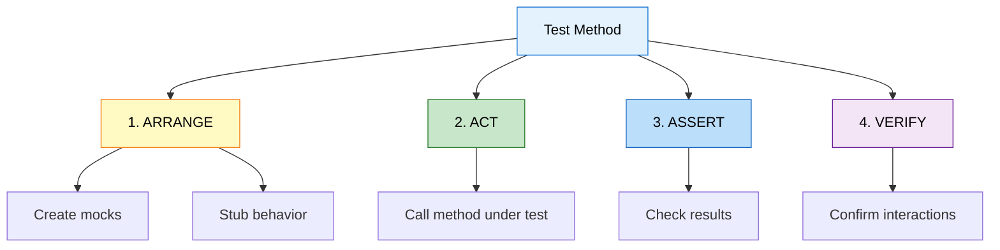

**AAA Pattern (Arrange-Act-Assert):**

```java
@Test
void testExample() {
    // ARRANGE: Set up test data and mocks
    when(mockPayment.processPayment(500.0)).thenReturn(true);
    
    // ACT: Execute the method being tested
    String result = orderService.placeOrder(500.0);
    
    // ASSERT: Verify the result
    assertEquals("ORDER PLACED", result);
    
    // VERIFY: Confirm mock interactions (optional)
    verify(mockPayment).processPayment(500.0);
}
```

---


## 8. INTERNAL EXECUTION FLOW

> **📝 Deep Dive by:** Avinash Dhanuka | Understanding JVM + Mockito Internals

### 🏭 How Mockito Works Internally

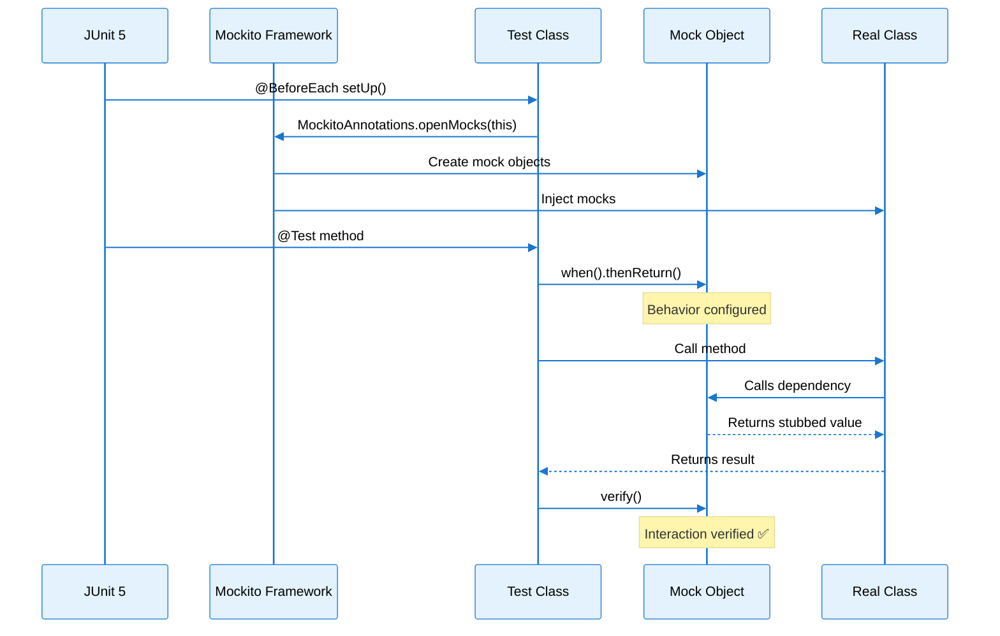

---

### 🧠 Memory Architecture with Mocks

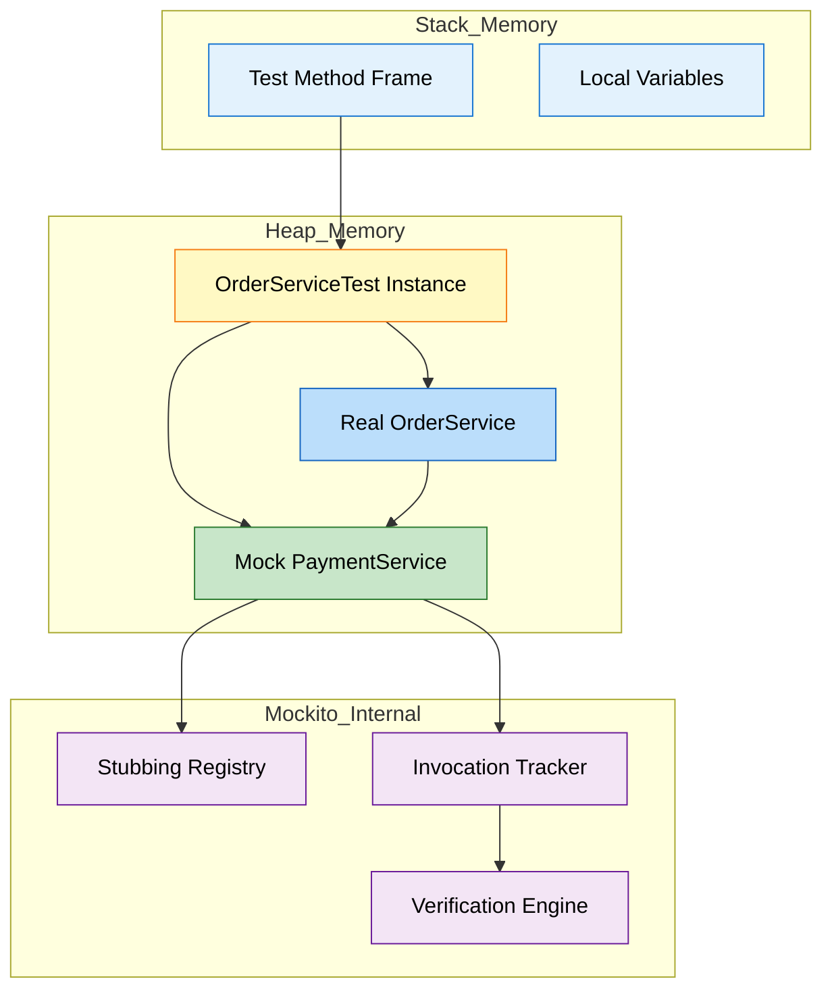

**Key Components:**

1. **Stubbing Registry:** Stores all when().thenReturn() configurations
2. **Invocation Tracker:** Records every method call on mocks
3. **Verification Engine:** Checks if expected calls were made

---

### 🔍 Step-by-Step Execution

**Test Code:**
```java
@Test
void testPlaceOrder_Success() {
    when(paymentServiceMock.processPayment(500.0)).thenReturn(true);
    String result = orderService.placeOrder(500.0);
    assertEquals("ORDER PLACED", result);
    verify(paymentServiceMock).processPayment(500.0);
}
```

**Execution Steps:**

#### Step 1: Test Initialization
```
JUnit calls @BeforeEach setUp()
  └─> MockitoAnnotations.openMocks(this)
      └─> Scans for @Mock annotations
          └─> Creates mock PaymentService (proxy object)
              └─> Scans for @InjectMocks
                  └─> Creates OrderService
                      └─> Injects mock via constructor
```

#### Step 2: Stubbing
```java
when(paymentServiceMock.processPayment(500.0)).thenReturn(true);
```

**Internal Process:**
```
1. Mockito intercepts the call to processPayment(500.0)
2. Stores in Stubbing Registry:
   {
     method: "processPayment",
     arguments: [500.0],
     returnValue: true
   }
3. Does NOT execute real processPayment code
```

#### Step 3: Method Execution
```java
String result = orderService.placeOrder(500.0);
```

**Internal Process:**
```
1. orderService.placeOrder(500.0) is called
2. Inside placeOrder:
   paymentservice.processPayment(500.0) is called
3. Mockito intercepts this call
4. Checks Stubbing Registry for matching stub
5. Finds: processPayment(500.0) → return true
6. Returns true (without executing real code)
7. placeOrder returns "ORDER PLACED"
```

#### Step 4: Verification
```java
verify(paymentServiceMock).processPayment(500.0);
```

**Internal Process:**
```
1. Mockito checks Invocation Tracker
2. Looks for: processPayment(500.0)
3. Found: ✅ Called once
4. Verification passes
```

---

### 🎯 Mock Object Creation (Bytecode Level)

**What happens when you create a mock:**

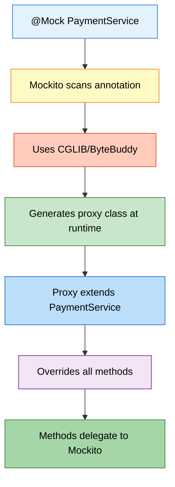

**Generated Proxy (Simplified):**
```java
// Mockito generates something like this at runtime
public class PaymentService$MockitoMock extends PaymentService {
    private MockHandler handler;
    
    @Override
    public boolean processPayment(double amount) {
        // Delegate to Mockito's handler
        return (boolean) handler.handle(
            this,
            "processPayment",
            new Object[]{amount}
        );
    }
}
```

---

### 📊 Real vs Mock Execution Comparison

```mermaid
graph TD
    subgraph Real_Object_Flow
        A1[Call method] --> B1[Execute actual code]
        B1 --> C1[Database query]
        C1 --> D1[Network call]
        D1 --> E1[Return result]
    end
    
    subgraph Mock_Object_Flow
        A2[Call method] --> B2[Mockito intercepts]
        B2 --> C2[Check stubbing registry]
        C2 --> D2[Return stubbed value]
    end
    
    style A1 fill:#ffcdd2,stroke:#c62828,color:#000
    style B1 fill:#ffcdd2,stroke:#c62828,color:#000
    style C1 fill:#ffcdd2,stroke:#c62828,color:#000
    style D1 fill:#ffcdd2,stroke:#c62828,color:#000
    style E1 fill:#ffcdd2,stroke:#c62828,color:#000
    
    style A2 fill:#c8e6c9,stroke:#2e7d32,color:#000
    style B2 fill:#c8e6c9,stroke:#2e7d32,color:#000
    style C2 fill:#c8e6c9,stroke:#2e7d32,color:#000
    style D2 fill:#c8e6c9,stroke:#2e7d32,color:#000
```

**Performance Impact:**
- Real Object: 100ms (database + network)
- Mock Object: <1ms (in-memory lookup)

---


## 9. TOPICS COVERED IN THIS PROJECT

### ✅ Complete Checklist

#### 🎯 Maven & Build Tools
- ✅ **Maven Project Structure:** Understanding pom.xml
- ✅ **Dependency Management:** Automatic JAR downloads
- ✅ **Maven Central Repository:** Where libraries come from
- ✅ **Build Lifecycle:** compile, test, package
- ✅ **Scope:** Understanding `<scope>test</scope>`

#### 🔧 Dependency Injection
- ✅ **Constructor Injection:** Passing dependencies via constructor
- ✅ **Tight vs Loose Coupling:** Why injection matters
- ✅ **Testability:** How injection enables testing
- ✅ **Dependency Declaration:** `private PaymentService paymentservice;`

#### 🎭 Mockito Fundamentals
- ✅ **Mock Creation:** `@Mock` annotation
- ✅ **Mock Injection:** `@InjectMocks` annotation
- ✅ **Mock Initialization:** `MockitoAnnotations.openMocks(this)`
- ✅ **Alternative:** `@ExtendWith(MockitoExtension.class)`

#### 📝 Stubbing Techniques
- ✅ **Basic Stubbing:** `when().thenReturn()`
- ✅ **Exception Stubbing:** `when().thenThrow()`
- ✅ **Argument Matchers:** `anyDouble()`, `anyInt()`, `anyString()`
- ✅ **Exact Matching:** Specific values vs any values
- ✅ **Multiple Returns:** Consecutive call stubbing

#### ✔️ Verification Methods
- ✅ **Basic Verification:** `verify(mock).method()`
- ✅ **Times Verification:** `times()`, `never()`, `atLeastOnce()`
- ✅ **Argument Verification:** Checking exact arguments
- ✅ **Interaction Tracking:** What was called and when

#### 🧪 Testing Patterns
- ✅ **AAA Pattern:** Arrange-Act-Assert
- ✅ **Test Isolation:** Each test independent
- ✅ **Success Scenarios:** Testing happy path
- ✅ **Failure Scenarios:** Testing error cases
- ✅ **Exception Testing:** Using `assertThrows()`

---

### 📚 Learning Path Progression

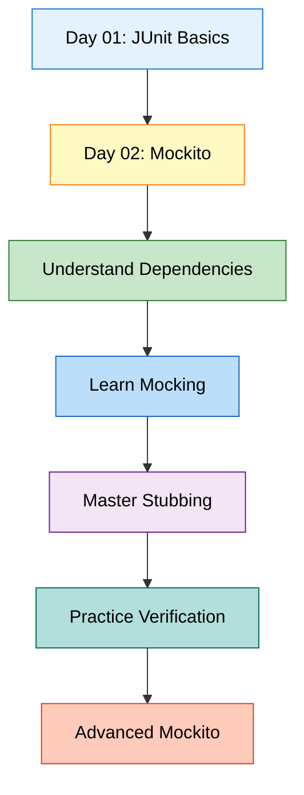

---

### 🎓 Real-World Applications

| Concept | Real-World Use Case |
|:--------|:-------------------|
| **Mocking PaymentService** | Test order processing without charging real money |
| **Stubbing Exceptions** | Test how app handles payment gateway failures |
| **Argument Matchers** | Test with various input amounts without writing 100 tests |
| **Verification** | Ensure audit logs are created for every transaction |
| **Constructor Injection** | Swap real database with mock for testing |
| **Maven Dependencies** | Automatically get latest security patches |

---


## 10. DAY 01 VS DAY 02 COMPARISON

> **📝 Detailed Comparison by:** Avinash Dhanuka | [Connect on GitHub](https://github.com/Avinash-706)

### 🔄 Evolution of Learning

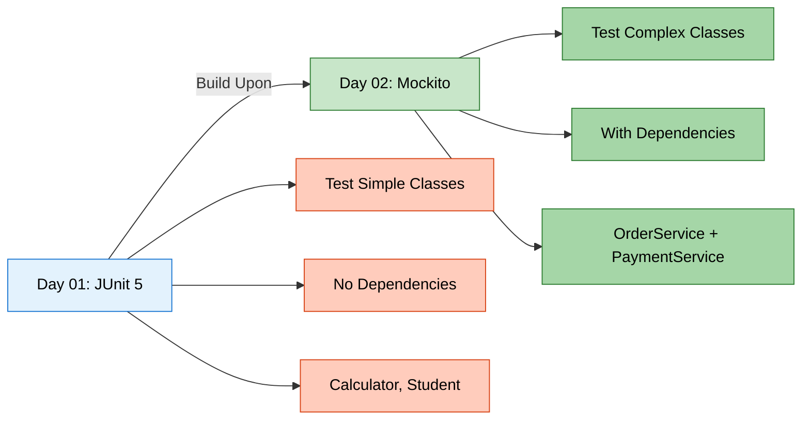

---

### 📊 Comprehensive Comparison Table

| Aspect | Day 01 (JUnit Only) | Day 02 (Mockito + Maven) |
|:-------|:-------------------|:------------------------|
| **Main Topic** | Unit Testing Basics | Mocking Dependencies |
| **Framework** | JUnit 5 | JUnit 5 + Mockito |
| **Build Tool** | None (IDE) | Maven (pom.xml) |
| **Dependencies** | Manual JARs | Automatic via Maven |
| **Classes Tested** | Calculator, StudentService | OrderService |
| **Dependencies in Code** | None | PaymentService |
| **Testing Approach** | Direct testing | Mock dependencies |
| **Complexity** | Simple (no external deps) | Complex (with deps) |
| **New Concepts** | Assertions, Lifecycle | Mocking, Stubbing, Verification |
| **Annotations** | @Test, @BeforeEach | @Mock, @InjectMocks |
| **Test Speed** | Fast | Even Faster (no real deps) |
| **Real-World Readiness** | Basic | Production-ready |

---

### 🎯 What Day 01 Taught Us

```java
// Day 01: Testing a simple class
@Test
void testAdd() {
    Calculator calc = new Calculator();
    assertEquals(5, calc.add(2, 3));  // Direct testing
}
```

**Limitations:**
- ❌ Cannot test classes with dependencies
- ❌ No way to isolate units
- ❌ Cannot simulate failures

---

### 🎯 What Day 02 Teaches Us

```java
// Day 02: Testing a class with dependencies
@Mock
PaymentService paymentServiceMock;  // Fake dependency

@InjectMocks
OrderService orderService;  // Real class with fake dependency

@Test
void testPlaceOrder() {
    when(paymentServiceMock.processPayment(500.0)).thenReturn(true);
    String result = orderService.placeOrder(500.0);
    assertEquals("ORDER PLACED", result);
}
```

**Advantages:**
- ✅ Can test classes with dependencies
- ✅ True unit testing (isolated)
- ✅ Can simulate any scenario
- ✅ Production-ready testing

---

### 🔄 How They Work Together

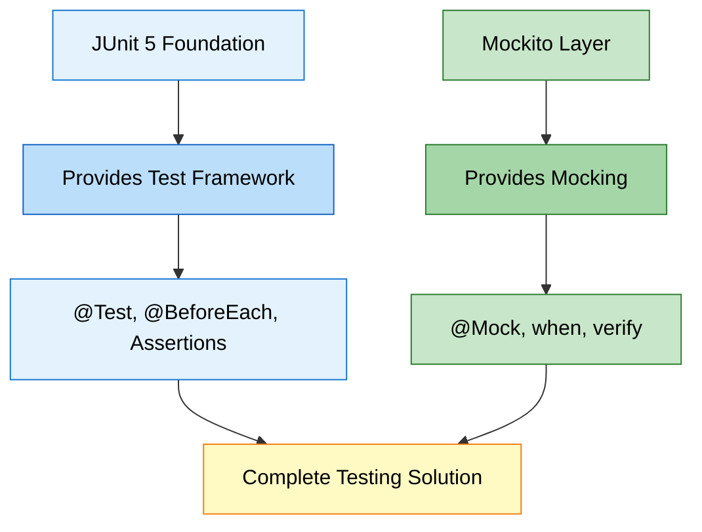

**Relationship:**
- JUnit 5 = Test execution engine
- Mockito = Mocking library
- Together = Complete testing toolkit

---

### 📈 Skill Progression

| Skill Level | Day 01 | Day 02 |
|:------------|:-------|:-------|
| **Beginner** | ✅ Write basic tests | ✅ Understand dependencies |
| **Intermediate** | ✅ Use assertions | ✅ Create mocks |
| **Advanced** | ✅ Parameterized tests | ✅ Stub complex behaviors |
| **Expert** | ✅ Test lifecycle | ✅ Verify interactions |

---

### 🌐 When to Use What?

| Scenario | Use Day 01 Approach | Use Day 02 Approach |
|:---------|:-------------------|:-------------------|
| Testing utility methods | ✅ Yes | ❌ Overkill |
| Testing business logic | ✅ If no deps | ✅ If has deps |
| Testing with database | ❌ Cannot | ✅ Mock database |
| Testing with APIs | ❌ Cannot | ✅ Mock API calls |
| Testing calculations | ✅ Perfect | ❌ Not needed |
| Testing services | ❌ Limited | ✅ Perfect |

---


## 11. TOP INTERVIEW QUESTIONS

> **📝 Curated by:** Avinash Dhanuka | © 2026 | [GitHub](https://github.com/Avinash-706)

### 🧠 Mockito Fundamentals

#### Q1: What is the difference between Mock and Spy in Mockito?

| Feature | Mock | Spy |
|:--------|:-----|:----|
| **Creation** | `@Mock` or `mock()` | `@Spy` or `spy()` |
| **Behavior** | All methods return default values | Calls real methods unless stubbed |
| **Use Case** | Complete fake object | Partial mocking |
| **Real Code** | Never executes | Executes by default |

**Example:**
```java
// Mock - No real code executes
@Mock PaymentService mockPayment;
when(mockPayment.processPayment(100)).thenReturn(true);  // Must stub

// Spy - Real code executes unless stubbed
@Spy PaymentService spyPayment;
// processPayment() will execute real code
when(spyPayment.processPayment(100)).thenReturn(true);  // Override specific call
```

---

#### Q2: What is the difference between @Mock and mock()?

**Answer:** They do the same thing, but syntax differs.

```java
// Annotation way (cleaner)
@Mock
PaymentService paymentService;

// Manual way
PaymentService paymentService = mock(PaymentService.class);
```

**When to use:**
- `@Mock` - When using annotations (recommended)
- `mock()` - When creating mocks dynamically in test methods

---

#### Q3: Why do we need MockitoAnnotations.openMocks(this)?

**Answer:** To initialize all @Mock and @InjectMocks annotations.

**Without it:**
```java
@Mock PaymentService payment;  // This is NULL!
```

**With it:**
```java
@BeforeEach
void setUp() {
    MockitoAnnotations.openMocks(this);  // Now payment is initialized
}
```

**Alternative:**
```java
@ExtendWith(MockitoExtension.class)  // Automatic initialization
public class MyTest { }
```

---

#### Q4: What is the difference between when().thenReturn() and doReturn().when()?

**Answer:**

| Syntax | Type Safety | Use Case |
|:-------|:------------|:---------|
| `when().thenReturn()` | Type-safe | Normal methods |
| `doReturn().when()` | Not type-safe | Void methods, Spies |

**Example:**
```java
// Normal stubbing
when(mock.method()).thenReturn(value);

// For void methods
doNothing().when(mock).voidMethod();

// For spies (avoids calling real method)
doReturn(value).when(spy).method();
```

---

#### Q5: How do you verify a method was never called?

**Answer:** Use `verify()` with `never()`.

```java
verify(mockPayment, never()).processPayment(anyDouble());
```

**Other verification modes:**
```java
verify(mock, times(2)).method();        // Called exactly 2 times
verify(mock, atLeastOnce()).method();   // Called at least once
verify(mock, atMost(3)).method();       // Called at most 3 times
```

---

### 🎯 Stubbing & Verification

#### Q6: What are Argument Matchers and when should you use them?

**Answer:** Argument matchers allow flexible stubbing without specifying exact values.

```java
// Without matcher - must match exactly
when(mock.processPayment(500.0)).thenReturn(true);

// With matcher - matches any double
when(mock.processPayment(anyDouble())).thenReturn(true);
```

**Common Matchers:**
- `anyInt()`, `anyDouble()`, `anyString()`
- `any(Class.class)` - Any object of type
- `eq(value)` - Exact value (when mixing matchers)

**Rule:** If you use one matcher, use matchers for ALL arguments.

```java
// ❌ WRONG - Mixing matcher and exact value
when(mock.method(anyInt(), 100)).thenReturn(true);

// ✅ CORRECT - All matchers
when(mock.method(anyInt(), eq(100))).thenReturn(true);
```

---

#### Q7: How do you stub a method to throw an exception?

**Answer:** Use `when().thenThrow()` or `doThrow().when()`.

```java
// For methods that return values
when(mock.processPayment(anyDouble()))
    .thenThrow(new RuntimeException("Payment failed"));

// For void methods
doThrow(new RuntimeException()).when(mock).voidMethod();
```

---

#### Q8: Can you stub the same method multiple times?

**Answer:** Yes! Last stubbing wins, or use consecutive returns.

```java
// Last stubbing wins
when(mock.method()).thenReturn(1);
when(mock.method()).thenReturn(2);  // This one is used

// Consecutive returns
when(mock.method())
    .thenReturn(1)   // First call
    .thenReturn(2)   // Second call
    .thenReturn(3);  // Third call
```

---

### 🔧 Advanced Concepts

#### Q9: What is @InjectMocks and how does it work?

**Answer:** `@InjectMocks` creates a real instance and injects all @Mock objects into it.

**Injection Order:**
1. **Constructor Injection** (preferred)
2. **Setter Injection**
3. **Field Injection** (reflection)

```java
@Mock PaymentService paymentMock;
@InjectMocks OrderService orderService;  // Injects paymentMock

// Equivalent to:
OrderService orderService = new OrderService(paymentMock);
```

---

#### Q10: What is the difference between Unit Test and Integration Test with Mockito?

| Aspect | Unit Test | Integration Test |
|:-------|:----------|:-----------------|
| **Mocking** | Heavy (all dependencies) | Minimal (only external) |
| **Speed** | Very fast | Slower |
| **Scope** | Single class | Multiple classes |
| **Example** | Mock PaymentService | Real PaymentService + Mock Bank API |

**Unit Test (Day 02 approach):**
```java
@Mock PaymentService payment;  // Mock everything
@InjectMocks OrderService order;
```

**Integration Test:**
```java
PaymentService payment = new PaymentService();  // Real service
OrderService order = new OrderService(payment);  // Test together
```

---

#### Q11: How do you test void methods?

**Answer:** Use `verify()` to check if they were called.

```java
// Void method
public void sendEmail(String to) {
    // Sends email
}

// Test
@Test
void testSendEmail() {
    doNothing().when(mockEmailService).sendEmail(anyString());
    
    orderService.placeOrder(100);  // This calls sendEmail internally
    
    verify(mockEmailService).sendEmail("customer@example.com");
}
```

---

#### Q12: What is the difference between Mockito and PowerMock?

| Feature | Mockito | PowerMock |
|:--------|:--------|:----------|
| **Static Methods** | ❌ Cannot mock | ✅ Can mock |
| **Private Methods** | ❌ Cannot mock | ✅ Can mock |
| **Final Classes** | ❌ Cannot mock (Mockito 4-) | ✅ Can mock |
| **Constructors** | ❌ Cannot mock | ✅ Can mock |
| **Recommendation** | ✅ Use this | ❌ Avoid (bad design) |

**Why avoid PowerMock?**
- If you need to mock static/private methods, your design is probably wrong
- Refactor code to use dependency injection instead

---

### 💡 Best Practices

#### Q13: Should you verify every mock interaction?

**Answer:** No! Only verify what matters for the test.

```java
// ❌ BAD - Over-verification
verify(mock).method1();
verify(mock).method2();
verify(mock).method3();
// ... 20 more verifications

// ✅ GOOD - Verify what matters
verify(mock).criticalMethod();  // Only verify important interactions
```

---

#### Q14: When should you NOT use Mockito?

**Answer:**
1. Testing simple utility classes (use real objects)
2. Testing data classes (POJOs)
3. Integration tests (use real dependencies)
4. When mocking makes test more complex than code

**Example - Don't mock this:**
```java
// Simple utility - no need to mock
public class MathUtils {
    public int add(int a, int b) {
        return a + b;
    }
}
```

---

#### Q15: What is the difference between @ExtendWith(MockitoExtension.class) and MockitoAnnotations.openMocks()?

**Answer:**

| Approach | When | Pros | Cons |
|:---------|:-----|:-----|:-----|
| **@ExtendWith** | Class level | Automatic, cleaner | JUnit 5 only |
| **openMocks()** | @BeforeEach | Works everywhere | Manual setup |

```java
// Approach 1: Automatic (recommended)
@ExtendWith(MockitoExtension.class)
public class MyTest {
    @Mock PaymentService payment;
}

// Approach 2: Manual
public class MyTest {
    @Mock PaymentService payment;
    
    @BeforeEach
    void setUp() {
        MockitoAnnotations.openMocks(this);
    }
}
```

---

### 🚀 Real-World Scenarios

#### Q16: How do you test a method that calls multiple dependencies?

**Answer:** Mock all dependencies and verify each interaction.

```java
public class OrderService {
    private PaymentService payment;
    private EmailService email;
    private InventoryService inventory;
    
    public void placeOrder(Order order) {
        inventory.reserve(order);
        payment.process(order.getAmount());
        email.send(order.getCustomer());
    }
}

@Test
void testPlaceOrder() {
    // Mock all dependencies
    when(inventory.reserve(any())).thenReturn(true);
    when(payment.process(anyDouble())).thenReturn(true);
    doNothing().when(email).send(anyString());
    
    orderService.placeOrder(order);
    
    // Verify all interactions
    verify(inventory).reserve(order);
    verify(payment).process(100.0);
    verify(email).send("customer@example.com");
}
```

---

#### Q17: How do you test asynchronous methods with Mockito?

**Answer:** Use `CompletableFuture` or `@Timeout`.

```java
@Test
@Timeout(value = 5, unit = TimeUnit.SECONDS)
void testAsyncMethod() throws Exception {
    CompletableFuture<String> future = orderService.placeOrderAsync(100);
    String result = future.get();  // Wait for completion
    assertEquals("ORDER PLACED", result);
}
```

---

#### Q18: How do you mock a chain of method calls?

**Answer:** Use `RETURNS_DEEP_STUBS`.

```java
// Chain: user.getAddress().getCity().getName()
User mockUser = mock(User.class, RETURNS_DEEP_STUBS);
when(mockUser.getAddress().getCity().getName()).thenReturn("New York");
```

**Warning:** This is a code smell. Better to refactor.

---

#### Q19: What is ArgumentCaptor and when to use it?

**Answer:** Captures arguments passed to mocked methods for verification.

```java
@Captor
ArgumentCaptor<String> emailCaptor;

@Test
void testEmailSent() {
    orderService.placeOrder(100);
    
    verify(emailService).send(emailCaptor.capture());
    String capturedEmail = emailCaptor.getValue();
    
    assertEquals("customer@example.com", capturedEmail);
}
```

---

#### Q20: How do you test legacy code with Mockito?

**Answer:**
1. Identify dependencies
2. Refactor to use constructor injection
3. Mock dependencies
4. Write tests

**Before (untestable):**
```java
public class OrderService {
    public void placeOrder() {
        PaymentService payment = new PaymentService();  // Hard-coded
        payment.process();
    }
}
```

**After (testable):**
```java
public class OrderService {
    private PaymentService payment;
    
    public OrderService(PaymentService payment) {  // Injected
        this.payment = payment;
    }
}
```

---

<div align="center">

<div align = "center">
### 🎓 End of Day 02 Master Guide
<br>
<br>
<div align = "center">

</div>
**Created with dedication by Avinash Dhanuka**
</div>

[](https://github.com/Avinash-706)
[](mailto:avunashdhanuka@gmail.com)

**© 2026 Avinash Dhanuka | All Rights Reserved**

*This documentation is protected intellectual property. Unauthorized reproduction or distribution is prohibited.*

---

**Happy Mocking! 🎭**

*"Mock it till you make it!"* - Avinash Dhanuka
</div>
