# ☕ Master Guide: Hibernate ORM Framework with MySQL

<div align="center">


</div>

<hr style="border: 1px solid rgb(98, 117, 187)">

<div align="center">
<table>
<tr>
<td align="center">
<br />

<h3>© 2026 Avinash Dhanuka</h3>
<p>Master Guide: Database Persistence with Hibernate</p>
<p><em>Crafted with ❤️ for Object-Relational Mapping</em></p>

<a href="https://github.com/Avinash-706" target="_blank">

</a>
<br />
<a href="https://mail.google.com/mail/?view=cm&fs=1&to=avunashdhanuka@gmail.com&su=Hibernate%20Query&body=☕%20Hello%20Avinash,%0D%0A%0D%0AMy%20name%20is%20[Your%20Name]%20and%20I%20have%20a%20doubt%20regarding%20Hibernate.%0D%0A%0D%0A🔹%20Topic:%20[Hibernate/ORM]%0D%0A%0D%0AThank%20you!" target="_blank">

</a>
<br />
<br />
</td>
</tr>
</table>
</div>

> **Learning Note:** This guide builds upon Day 01 (JUnit 5) and Day 02 (Mockito) by introducing database persistence. Learn how to map Java objects to database tables without writing SQL!

> **Prerequisites:** 
> - Complete understanding of [Day 01 - JUnit 5 Fundamentals](../../day01/JUnitOne/README.md)
> - Complete understanding of [Day 02 - Mockito Testing](../../day02/MockitoMaven/README.md)
> - MySQL Server installed and running

---

## 📑 Table of Contents
1. [What is Hibernate? (The Foundation)](#1-what-is-hibernate-the-foundation)
2. [Why Do We Need Hibernate?](#2-why-do-we-need-hibernate)
3. [Maven Project Structure](#3-maven-project-structure)
4. [Understanding ORM (Object-Relational Mapping)](#4-understanding-orm-object-relational-mapping)
5. [Hibernate Core Concepts](#5-hibernate-core-concepts)
6. [JPA Annotations Deep Dive](#6-jpa-annotations-deep-dive)
7. [Hibernate Configuration](#7-hibernate-configuration)
8. [CRUD Operations Explained](#8-crud-operations-explained)
9. [Internal Execution Flow](#9-internal-execution-flow)
10. [Topics Covered in This Project](#10-topics-covered-in-this-project)
11. [Day 01 vs Day 02 vs Day 03 Comparison](#11-day-01-vs-day-02-vs-day-03-comparison)
12. [Interview Questions](#12-top-interview-questions)

---

## 1. WHAT IS HIBERNATE? (THE FOUNDATION)

> **📝 Author:** Avinash Dhanuka | [GitHub](https://github.com/Avinash-706)

### 📌 Definition
**Hibernate** is a powerful **Object-Relational Mapping (ORM)** framework for Java that simplifies database operations by mapping Java objects to database tables automatically. It eliminates the need to write complex SQL queries manually.

### 🏗️ Key Characteristics
- **Framework Type:** ORM Framework (Database Persistence)
- **Current Version:** Hibernate 6.4.4 (Used in this project)
- **Purpose:** Bridge between Java objects and relational databases
- **Standard:** Implements JPA (Jakarta Persistence API)
- **Database Support:** MySQL, PostgreSQL, Oracle, SQL Server, etc.

### 📊 Hibernate Evolution

| Version | Year | Key Features |
|:--------|:-----|:-------------|
| **Hibernate 3.x** | 2005 | Annotations support, JPA 1.0 |
| **Hibernate 4.x** | 2011 | Multi-tenancy, improved performance |
| **Hibernate 5.x** | 2015 | Java 8 support, JPA 2.1 |
| **Hibernate 6.x** | 2022 | Jakarta EE, Java 17+, JPA 3.0 |

### 🎯 What Problem Does Hibernate Solve?

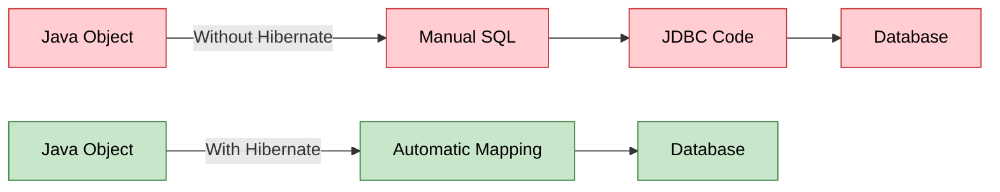

**Simple Analogy:**
- **Without Hibernate:** You're a translator who manually translates every sentence between two languages
- **With Hibernate:** You have an automatic translation tool that does it for you

---


## 2. WHY DO WE NEED HIBERNATE?

### 🎯 The Problem Without Hibernate (Using Plain JDBC)

Imagine you want to save a Student object to the database:

```java
// ❌ WITHOUT HIBERNATE - Manual JDBC Code (Painful!)
public void saveStudent(Student student) {
    Connection conn = null;
    PreparedStatement stmt = null;
    
    try {
        // 1. Load driver
        Class.forName("com.mysql.cj.jdbc.Driver");
        
        // 2. Create connection
        conn = DriverManager.getConnection(
            "jdbc:mysql://localhost:3306/mydb", "root", "password"
        );
        
        // 3. Write SQL manually
        String sql = "INSERT INTO students (name, age) VALUES (?, ?)";
        stmt = conn.prepareStatement(sql);
        
        // 4. Set parameters manually
        stmt.setString(1, student.getName());
        stmt.setInt(2, student.getAge());
        
        // 5. Execute
        stmt.executeUpdate();
        
    } catch (Exception e) {
        e.printStackTrace();
    } finally {
        // 6. Close resources manually
        try {
            if (stmt != null) stmt.close();
            if (conn != null) conn.close();
        } catch (SQLException e) {
            e.printStackTrace();
        }
    }
}
```

**Problems:**
1. ❌ Too much boilerplate code (20+ lines for simple save!)
2. ❌ Manual SQL writing (error-prone)
3. ❌ Manual type conversion (Java int → SQL INT)
4. ❌ Manual resource management (connections, statements)
5. ❌ Database-specific SQL (not portable)
6. ❌ No automatic relationship handling

### ✅ The Solution: Hibernate

```java
// ✅ WITH HIBERNATE - Simple & Clean!
public void saveStudent(Student student) {
    Session session = factory.openSession();
    Transaction tx = session.beginTransaction();
    
    session.persist(student);  // That's it! 🎉
    
    tx.commit();
    session.close();
}
```

**Benefits:**
1. ✅ Minimal code (5 lines vs 30+ lines)
2. ✅ No SQL writing (Hibernate generates it)
3. ✅ Automatic type conversion
4. ✅ Automatic resource management
5. ✅ Database-independent (works with any DB)
6. ✅ Automatic relationship handling

### 📈 JDBC vs Hibernate Comparison

```mermaid
graph TD
    subgraph JDBC_Approach
        A1[Write SQL manually] --> B1[Set parameters]
        B1 --> C1[Execute query]
        C1 --> D1[Parse ResultSet]
        D1 --> E1[Create objects manually]
        E1 --> F1[Close resources]
    end
    
    subgraph Hibernate_Approach
        A2[session.persist object] --> B2[Done! ✅]
    end
    
    style A1 fill:#ffcdd2,stroke:#c62828,color:#000
    style B1 fill:#ffcdd2,stroke:#c62828,color:#000
    style C1 fill:#ffcdd2,stroke:#c62828,color:#000
    style D1 fill:#ffcdd2,stroke:#c62828,color:#000
    style E1 fill:#ffcdd2,stroke:#c62828,color:#000
    style F1 fill:#ffcdd2,stroke:#c62828,color:#000
    
    style A2 fill:#c8e6c9,stroke:#2e7d32,color:#000
    style B2 fill:#c8e6c9,stroke:#2e7d32,color:#000
```

---


## 3. MAVEN PROJECT STRUCTURE

> **📝 Documentation by:** Avinash Dhanuka | [GitHub Profile](https://github.com/Avinash-706)

### 📂 Complete Folder Hierarchy

```
HibernateDemo/
├── .idea/                          # IntelliJ IDEA configuration
├── .mvn/                           # Maven wrapper files
├── src/
│   ├── main/
│   │   ├── java/org/example/
│   │   │   ├── entity/
│   │   │   │   └── Student.java            # Entity class (maps to table)
│   │   │   └── App.java                    # Main application
│   │   └── resources/
│   │       └── hibernate.cfg.xml           # Hibernate configuration
│   └── test/
│       └── java/org/example/
│           └── AppTest.java                # Test class
├── target/                         # Compiled classes (Maven output)
├── .gitignore
├── pom.xml                         # Maven dependencies
├── info.txt                        # Project notes
└── HIBERNATE-SUCCESS.md            # Setup verification
```

### 🆚 Day 02 vs Day 03 Structure

| Aspect | Day 02 (Mockito) | Day 03 (Hibernate) |
|:-------|:----------------|:-------------------|
| **Focus** | Testing with mocks | Database persistence |
| **Main Package** | `org.example` | `org.example` + `entity` |
| **New Folder** | None | `resources/` (for config) |
| **Configuration** | None | `hibernate.cfg.xml` |
| **External System** | None | MySQL Database |
| **Dependencies** | JUnit + Mockito | Hibernate + MySQL |

---

### 📦 Understanding pom.xml Dependencies

**Reference:** [pom.xml](pom.xml)

```xml
<dependencies>
    <!-- Hibernate Core -->
    <dependency>
        <groupId>org.hibernate.orm</groupId>
        <artifactId>hibernate-core</artifactId>
        <version>6.4.4.Final</version>
    </dependency>
    
    <!-- MySQL Connector -->
    <dependency>
        <groupId>com.mysql</groupId>
        <artifactId>mysql-connector-j</artifactId>
        <version>8.3.0</version>
    </dependency>
    
    <!-- HikariCP Connection Pool -->
    <dependency>
        <groupId>com.zaxxer</groupId>
        <artifactId>HikariCP</artifactId>
        <version>5.1.0</version>
    </dependency>
</dependencies>
```

### 🔍 What Each Dependency Does

| Dependency | Purpose | Why We Need It |
|:-----------|:--------|:---------------|
| **hibernate-core** | Core Hibernate ORM framework | Maps Java objects to database tables |
| **mysql-connector-j** | MySQL JDBC driver | Connects Java to MySQL database |
| **HikariCP** | Connection pool manager | Manages database connections efficiently |
| **hibernate-hikaricp** | Hibernate + HikariCP integration | Integrates connection pooling with Hibernate |
| **slf4j-api** | Logging API | Logs Hibernate operations |
| **slf4j-simple** | Simple logger implementation | Displays logs in console |

### 🏊 What is Connection Pooling?

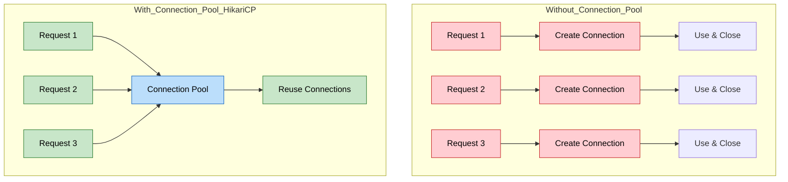

**Real-World Analogy:**
- **Without Pool:** Every time you want water, you dig a new well (slow!)
- **With Pool:** You have a swimming pool with water ready to use (fast!)

**HikariCP Benefits:**
- ✅ Reuses database connections (faster)
- ✅ Manages connection lifecycle automatically
- ✅ Prevents connection leaks
- ✅ Optimizes performance

---


## 4. UNDERSTANDING ORM (OBJECT-RELATIONAL MAPPING)

### 📌 What is ORM?

**ORM** = Object-Relational Mapping

It's a technique that maps:
- **Java Objects** (classes, fields) ↔ **Database Tables** (tables, columns)

### 🔄 The Mapping Process

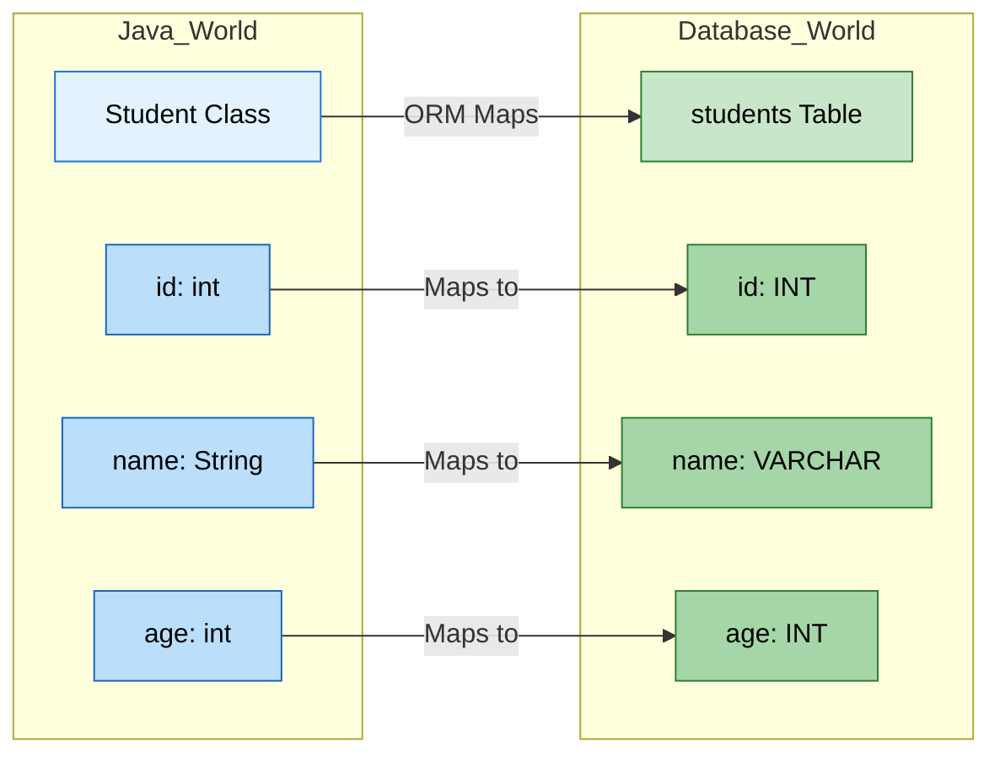

### 📊 Java vs Database Mapping

| Java Concept | Database Concept | Example |
|:-------------|:-----------------|:--------|
| **Class** | Table | `Student` class → `students` table |
| **Object** | Row | `new Student()` → One row in table |
| **Field** | Column | `name` field → `name` column |
| **Data Type** | SQL Type | `String` → `VARCHAR`, `int` → `INT` |
| **Primary Key** | Primary Key | `@Id` → `PRIMARY KEY` |
| **Relationship** | Foreign Key | `@ManyToOne` → `FOREIGN KEY` |

### 🎯 Real-World Example

**Java Code:**
```java
@Entity
@Table(name = "students")
public class Student {
    @Id
    @GeneratedValue(strategy = GenerationType.IDENTITY)
    private int id;
    
    @Column(name = "name")
    private String name;
    
    @Column(name = "age")
    private int age;
}
```

**Hibernate Generates This SQL:**
```sql
CREATE TABLE students (
    id INT AUTO_INCREMENT PRIMARY KEY,
    name VARCHAR(100),
    age INT
);
```

**When you save an object:**
```java
Student student = new Student();
student.setName("John");
student.setAge(20);
session.persist(student);  // Hibernate generates INSERT SQL
```

**Hibernate Executes:**
```sql
INSERT INTO students (name, age) VALUES ('John', 20);
```

---


## 5. HIBERNATE CORE CONCEPTS

> **📝 Comprehensive Guide by:** Avinash Dhanuka | © 2026

### 📌 The Four Pillars of Hibernate

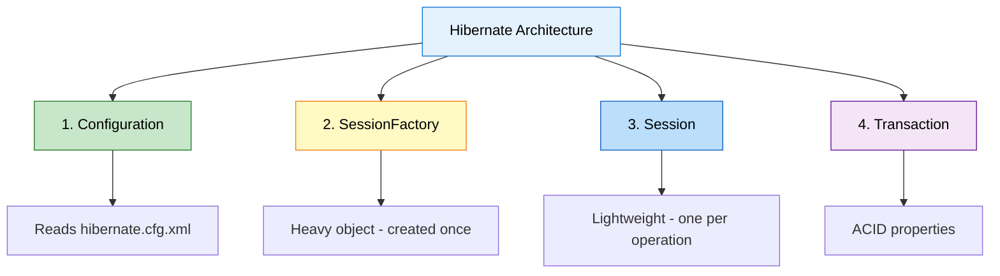

---

### 1️⃣ Configuration

**What is it?**
The Configuration object reads settings from `hibernate.cfg.xml` and prepares Hibernate.

**Code Example:**
```java
Configuration configuration = new Configuration()
    .configure("hibernate.cfg.xml");  // Reads config file
```

**What it does internally:**
1. Reads database connection details (URL, username, password)
2. Loads entity mappings (which classes map to tables)
3. Sets Hibernate properties (show SQL, auto-create tables, etc.)

---

### 2️⃣ SessionFactory

**What is it?**
A **heavy, thread-safe object** that creates Session objects. Created ONCE per application.

**Code Example:**
```java
SessionFactory factory = configuration.buildSessionFactory();
```

**Key Characteristics:**

| Property | Value |
|:---------|:------|
| **Weight** | Heavy (expensive to create) |
| **Thread Safety** | Thread-safe (can be shared) |
| **Lifecycle** | Created once, used throughout app |
| **Purpose** | Factory for creating Sessions |

**Real-World Analogy:**
- **SessionFactory** = A car factory (built once, produces many cars)
- **Session** = Individual cars (produced by the factory)

**Internal Working:**
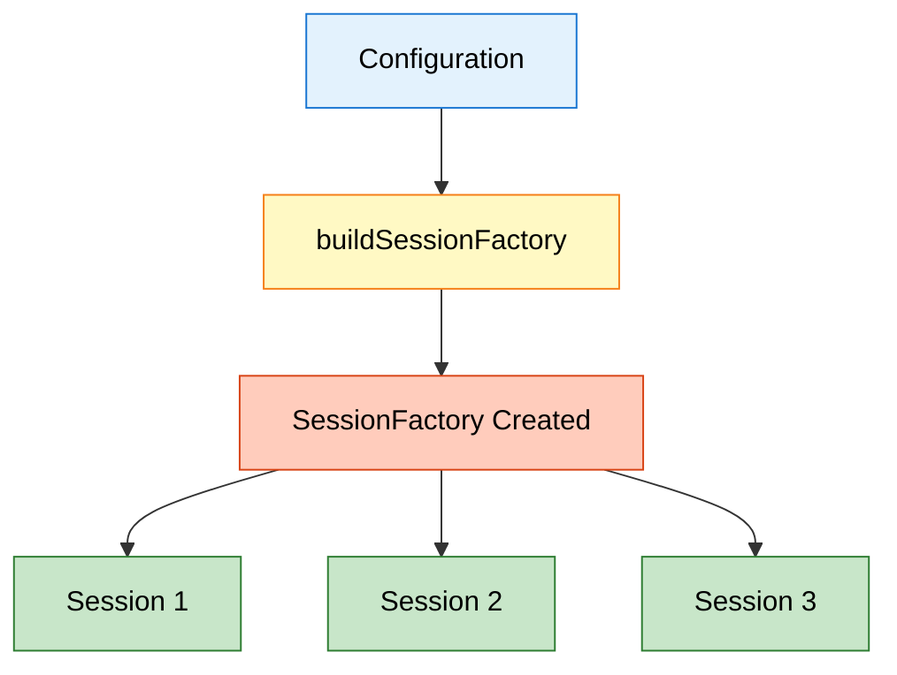

---

### 3️⃣ Session

**What is it?**
A **lightweight, short-lived object** that represents a connection to the database. Created for each operation.

**Code Example:**
```java
Session session = factory.openSession();  // Open connection
// ... perform database operations ...
session.close();  // Close connection
```

**Key Characteristics:**

| Property | Value |
|:---------|:------|
| **Weight** | Lightweight (cheap to create) |
| **Thread Safety** | NOT thread-safe (one per thread) |
| **Lifecycle** | Created per operation, closed after use |
| **Purpose** | Performs CRUD operations |

**Session Methods:**

| Method | Purpose | Example |
|:-------|:--------|:--------|
| **persist()** | Save new object | `session.persist(student)` |
| **get()** | Retrieve by ID | `session.get(Student.class, 1)` |
| **merge()** | Update object | `session.merge(student)` |
| **remove()** | Delete object | `session.remove(student)` |
| **createQuery()** | Execute HQL | `session.createQuery("FROM Student")` |

---

### 4️⃣ Transaction

**What is it?**
Represents a unit of work that follows **ACID properties**.

**Code Example:**
```java
Transaction tx = session.beginTransaction();
try {
    session.persist(student);  // Database operation
    tx.commit();  // Save changes permanently
} catch (Exception e) {
    tx.rollback();  // Undo changes if error
}
```

**ACID Properties:**

| Property | Meaning | Example |
|:---------|:--------|:--------|
| **A**tomicity | All or nothing | Either all operations succeed or all fail |
| **C**onsistency | Valid state | Database remains in valid state |
| **I**solation | Independent | Transactions don't interfere with each other |
| **D**urability | Permanent | Committed changes are permanent |

**Transaction Flow:**

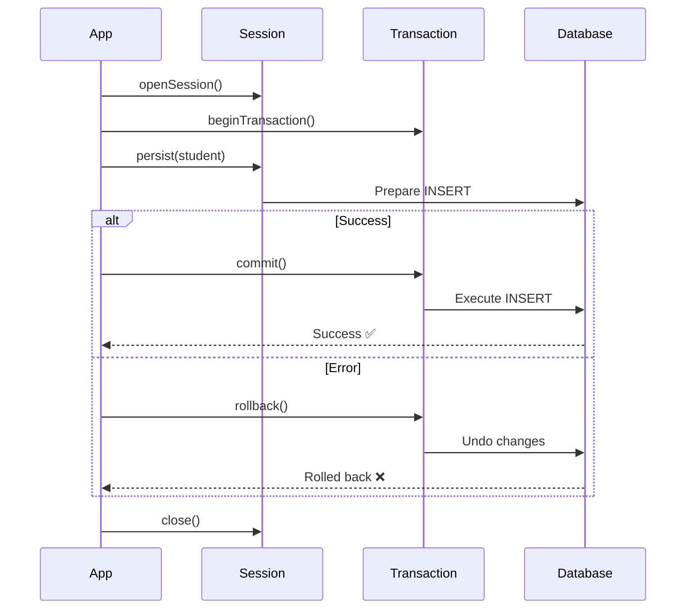

---

### 🔄 Complete Hibernate Workflow

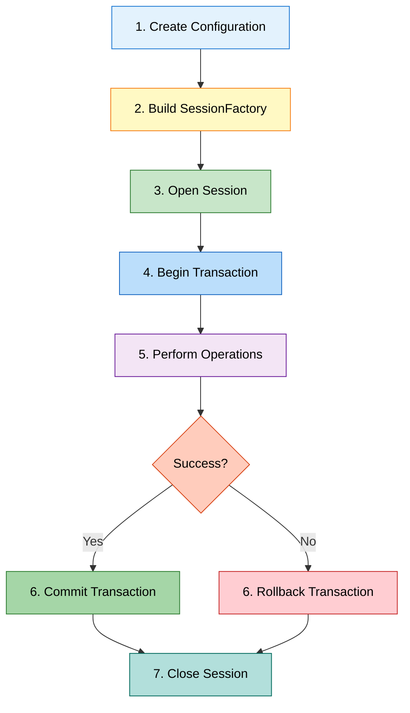

---


## 6. JPA ANNOTATIONS DEEP DIVE

> **📝 Deep Dive by:** Avinash Dhanuka | Understanding Entity Mapping

### 📌 What is JPA?

**JPA** = Jakarta Persistence API (formerly Java Persistence API)

- **Standard specification** for ORM in Java
- **Hibernate** is one implementation of JPA
- Other implementations: EclipseLink, OpenJPA

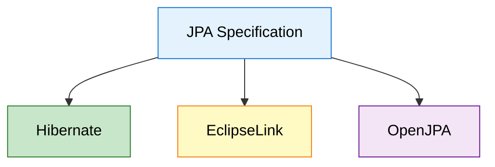

---

### 🏷️ Core JPA Annotations

**Reference:** [Student.java](src/main/java/org/example/entity/Student.java)

#### 1️⃣ @Entity

**Purpose:** Marks a class as a database entity (maps to a table)

```java
@Entity
public class Student {
    // This class will be mapped to a database table
}
```

**What Hibernate does:**
- Creates a table named `student` (lowercase class name)
- Maps all fields to columns

---

#### 2️⃣ @Table

**Purpose:** Customizes the table name and properties

```java
@Entity
@Table(name = "students")  // Custom table name
public class Student {
    // Maps to "students" table instead of "student"
}
```

**Additional Options:**
```java
@Table(
    name = "students",
    schema = "school_db",  // Database schema
    indexes = {@Index(name = "idx_name", columnList = "name")}  // Create index
)
```

---

#### 3️⃣ @Id

**Purpose:** Marks a field as the primary key

```java
@Id
private int id;  // This becomes PRIMARY KEY
```

**What Hibernate generates:**
```sql
CREATE TABLE students (
    id INT PRIMARY KEY,
    ...
);
```

---

#### 4️⃣ @GeneratedValue

**Purpose:** Specifies how the primary key is generated

```java
@Id
@GeneratedValue(strategy = GenerationType.IDENTITY)
private int id;  // Auto-increment
```

**Generation Strategies:**

| Strategy | Description | Database Support |
|:---------|:------------|:-----------------|
| **IDENTITY** | Database auto-increment | MySQL, PostgreSQL |
| **SEQUENCE** | Database sequence | Oracle, PostgreSQL |
| **TABLE** | Separate table for IDs | All databases |
| **AUTO** | Hibernate chooses best | All databases |

**Example SQL Generated:**
```sql
CREATE TABLE students (
    id INT AUTO_INCREMENT PRIMARY KEY,  -- IDENTITY strategy
    ...
);
```

---

#### 5️⃣ @Column

**Purpose:** Customizes column properties

```java
@Column(name = "student_name", nullable = false, length = 100)
private String name;
```

**Column Properties:**

| Property | Purpose | Example |
|:---------|:--------|:--------|
| **name** | Custom column name | `name = "student_name"` |
| **nullable** | Allow NULL values | `nullable = false` |
| **length** | String length | `length = 100` |
| **unique** | Unique constraint | `unique = true` |
| **insertable** | Allow insert | `insertable = true` |
| **updatable** | Allow update | `updatable = true` |

**Generated SQL:**
```sql
CREATE TABLE students (
    student_name VARCHAR(100) NOT NULL,
    ...
);
```

---

### 📊 Complete Student Entity Breakdown

**Reference:** [Student.java:6](src/main/java/org/example/entity/Student.java#L6)

```java
@Entity  // 1. Mark as entity
@Table(name = "students")  // 2. Custom table name
public class Student {
    
    @Id  // 3. Primary key
    @GeneratedValue(strategy = GenerationType.IDENTITY)  // 4. Auto-increment
    @Column(name = "id")  // 5. Column name
    private int id;
    
    @Column(name = "name", nullable = false, length = 100)
    private String name;
    
    @Column(name = "age")
    private int age;
    
    // Constructors, Getters, Setters, toString()
}
```

**What Hibernate Generates:**

```sql
CREATE TABLE students (
    id INT AUTO_INCREMENT PRIMARY KEY,
    name VARCHAR(100) NOT NULL,
    age INT
);
```

---

### 🔍 Annotation Mapping Visualization

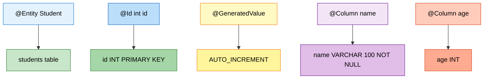

---

### 🎯 Why POJO (Plain Old Java Object)?

**POJO** = A simple Java class with:
- Private fields
- Public getters/setters
- No-argument constructor
- No special requirements

```java
// ✅ This is a POJO
public class Student {
    private int id;
    private String name;
    
    public Student() {}  // No-arg constructor
    
    public int getId() { return id; }
    public void setId(int id) { this.id = id; }
    // ... more getters/setters
}
```

**Why Hibernate needs POJOs:**
- Hibernate uses reflection to access fields
- No-arg constructor needed to create instances
- Getters/setters for property access

---


## 7. HIBERNATE CONFIGURATION

> **📝 Configuration Guide by:** Avinash Dhanuka

### 📌 Understanding hibernate.cfg.xml

**Reference:** [hibernate.cfg.xml](src/main/resources/hibernate.cfg.xml)

This XML file contains all Hibernate settings.

### 🔍 Configuration Breakdown

#### 1️⃣ Database Connection Settings

```xml
<!-- JDBC Driver -->
<property name="hibernate.connection.driver_class">
    com.mysql.cj.jdbc.Driver
</property>

<!-- Database URL -->
<property name="hibernate.connection.url">
    jdbc:mysql://localhost:3306/hibernate_db?useSSL=false&amp;serverTimezone=UTC
</property>

<!-- Credentials -->
<property name="hibernate.connection.username">root</property>
<property name="hibernate.connection.password">Asansol@0341</property>
```

**URL Breakdown:**
```
jdbc:mysql://localhost:3306/hibernate_db?useSSL=false&serverTimezone=UTC
│    │      │         │     │             │
│    │      │         │     │             └─ Parameters
│    │      │         │     └─ Database name
│    │      │         └─ Port (default MySQL port)
│    │      └─ Host (localhost = your computer)
│    └─ Database type
└─ Protocol
```

---

#### 2️⃣ Connection Pool Settings (HikariCP)

```xml
<!-- Use HikariCP for connection pooling -->
<property name="hibernate.connection.provider_class">
    org.hibernate.hikaricp.internal.HikariCPConnectionProvider
</property>

<!-- Minimum idle connections -->
<property name="hibernate.hikari.minimumIdle">5</property>

<!-- Maximum pool size -->
<property name="hibernate.hikari.maximumPoolSize">20</property>

<!-- Idle timeout (milliseconds) -->
<property name="hibernate.hikari.idleTimeout">30000</property>
```

**What these settings mean:**

| Setting | Value | Meaning |
|:--------|:------|:--------|
| **minimumIdle** | 5 | Keep at least 5 connections ready |
| **maximumPoolSize** | 20 | Maximum 20 connections at once |
| **idleTimeout** | 30000 | Close idle connections after 30 seconds |

**Visualization:**

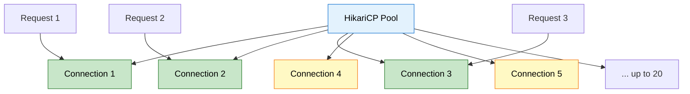

---

#### 3️⃣ Hibernate Behavior Settings

```xml
<!-- Show SQL in console -->
<property name="hibernate.show_sql">true</property>

<!-- Format SQL for readability -->
<property name="hibernate.format_sql">true</property>

<!-- Auto-create/update tables -->
<property name="hibernate.hbm2ddl.auto">update</property>
```

**hibernate.hbm2ddl.auto Options:**

| Value | Behavior | Use Case |
|:------|:---------|:---------|
| **create** | Drop and recreate tables every time | Development (data loss!) |
| **create-drop** | Create on start, drop on exit | Testing |
| **update** | Update schema if needed | Development |
| **validate** | Only validate schema | Production |
| **none** | Do nothing | Production (manual schema) |

**⚠️ Warning:** Never use `create` or `update` in production!

---

#### 4️⃣ Entity Mapping

```xml
<!-- Register entity classes -->
<mapping class="org.example.entity.Student"/>
```

**What this does:**
- Tells Hibernate which classes are entities
- Hibernate scans these classes for annotations
- Creates/updates tables based on annotations

---

### 🎯 Complete Configuration Flow

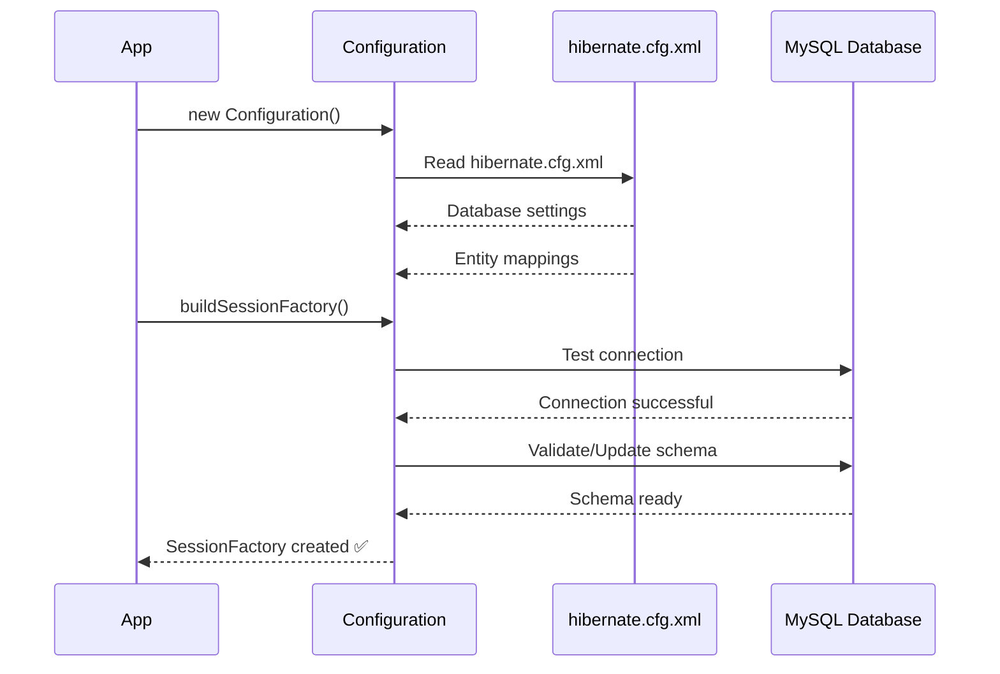

---

### 📊 Dialect: Database-Specific SQL

**What is Dialect?**
Hibernate generates SQL, but each database has slightly different SQL syntax. Dialect tells Hibernate which database you're using.

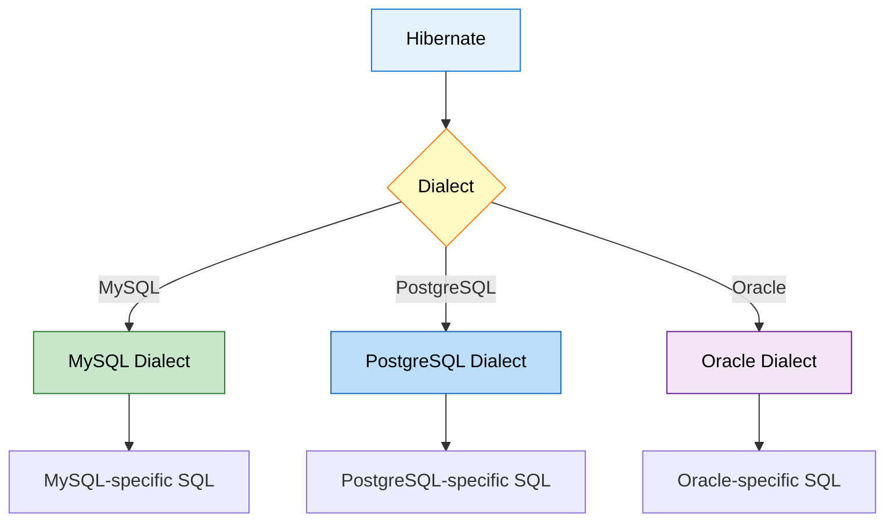

**Example:**
- **MySQL:** `AUTO_INCREMENT`
- **PostgreSQL:** `SERIAL`
- **Oracle:** `SEQUENCE`

Hibernate automatically detects the dialect from the JDBC URL in version 6.x!

---


## 8. CRUD OPERATIONS EXPLAINED

> **📝 CRUD Guide by:** Avinash Dhanuka | Create, Read, Update, Delete

### 📌 What is CRUD?

**CRUD** = The four basic database operations

| Operation | SQL | Hibernate Method |
|:----------|:----|:-----------------|
| **C**reate | INSERT | `session.persist()` |
| **R**ead | SELECT | `session.get()` |
| **U**pdate | UPDATE | `session.merge()` |
| **D**elete | DELETE | `session.remove()` |

---

### 1️⃣ CREATE - Saving Data

**Reference:** [App.java:14](src/main/java/org/example/App.java#L14)

```java
public static void createStudent(SessionFactory factory) {
    // 1. Open session
    Session session = factory.openSession();
    
    // 2. Begin transaction
    Transaction transaction = session.beginTransaction();
    
    try {
        // 3. Create object
        Student student = new Student();
        student.setName("John Doe");
        student.setAge(20);
        
        // 4. Save to database
        session.persist(student);
        
        // 5. Commit transaction
        transaction.commit();
        System.out.println("Student Saved: " + student);
        
    } catch (Exception e) {
        // 6. Rollback on error
        transaction.rollback();
        e.printStackTrace();
    } finally {
        // 7. Close session
        session.close();
    }
}
```

**What Hibernate Executes:**
```sql
INSERT INTO students (name, age) VALUES ('John Doe', 20);
```

**Step-by-Step Flow:**

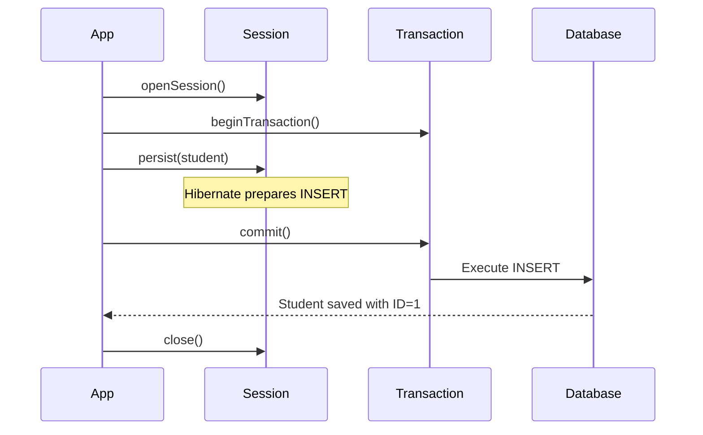

---

### 2️⃣ READ - Retrieving Data

```java
public static void readStudent(SessionFactory factory, int id) {
    Session session = factory.openSession();
    
    try {
        // Retrieve by ID
        Student student = session.get(Student.class, id);
        
        if (student != null) {
            System.out.println("Found: " + student);
        } else {
            System.out.println("Student not found");
        }
        
    } finally {
        session.close();
    }
}
```

**What Hibernate Executes:**
```sql
SELECT id, name, age FROM students WHERE id = 1;
```

**get() vs find():**

| Method | Behavior | When to Use |
|:-------|:---------|:------------|
| **get()** | Returns null if not found | When you expect it might not exist |
| **find()** | Same as get() (JPA standard) | JPA compatibility |

---

### 3️⃣ UPDATE - Modifying Data

```java
public static void updateStudent(SessionFactory factory, int id) {
    Session session = factory.openSession();
    Transaction tx = session.beginTransaction();
    
    try {
        // 1. Retrieve existing student
        Student student = session.get(Student.class, id);
        
        if (student != null) {
            // 2. Modify fields
            student.setName("John Updated");
            student.setAge(21);
            
            // 3. Update in database
            session.merge(student);
            
            tx.commit();
            System.out.println("Student Updated: " + student);
        }
        
    } catch (Exception e) {
        tx.rollback();
        e.printStackTrace();
    } finally {
        session.close();
    }
}
```

**What Hibernate Executes:**
```sql
UPDATE students SET name = 'John Updated', age = 21 WHERE id = 1;
```

---

### 4️⃣ DELETE - Removing Data

```java
public static void deleteStudent(SessionFactory factory, int id) {
    Session session = factory.openSession();
    Transaction tx = session.beginTransaction();
    
    try {
        // 1. Retrieve student
        Student student = session.get(Student.class, id);
        
        if (student != null) {
            // 2. Delete from database
            session.remove(student);
            
            tx.commit();
            System.out.println("Student Deleted: " + student);
        }
        
    } catch (Exception e) {
        tx.rollback();
        e.printStackTrace();
    } finally {
        session.close();
    }
}
```

**What Hibernate Executes:**
```sql
DELETE FROM students WHERE id = 1;
```

---

### 📊 CRUD Operations Comparison

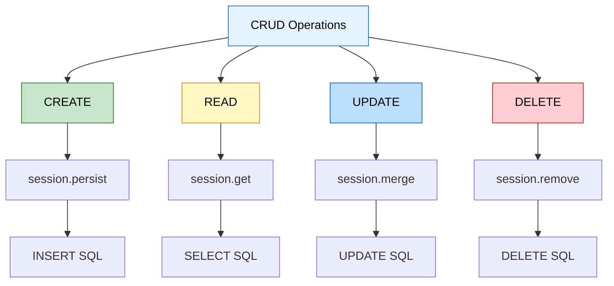

---

### 🎯 Best Practices

#### 1. Always Use Try-Catch-Finally

```java
Session session = factory.openSession();
Transaction tx = session.beginTransaction();

try {
    // Database operations
    tx.commit();
} catch (Exception e) {
    tx.rollback();  // Undo changes on error
    e.printStackTrace();
} finally {
    session.close();  // Always close session
}
```

#### 2. Check for Null

```java
Student student = session.get(Student.class, id);
if (student != null) {
    // Safe to use student
} else {
    System.out.println("Not found");
}
```

#### 3. Use Transactions for Write Operations

```java
// ✅ GOOD - With transaction
Transaction tx = session.beginTransaction();
session.persist(student);
tx.commit();

// ❌ BAD - Without transaction (may not save!)
session.persist(student);
```

---


## 9. INTERNAL EXECUTION FLOW

> **📝 Deep Dive by:** Avinash Dhanuka | Understanding Hibernate Internals

### 🏭 Complete Application Flow

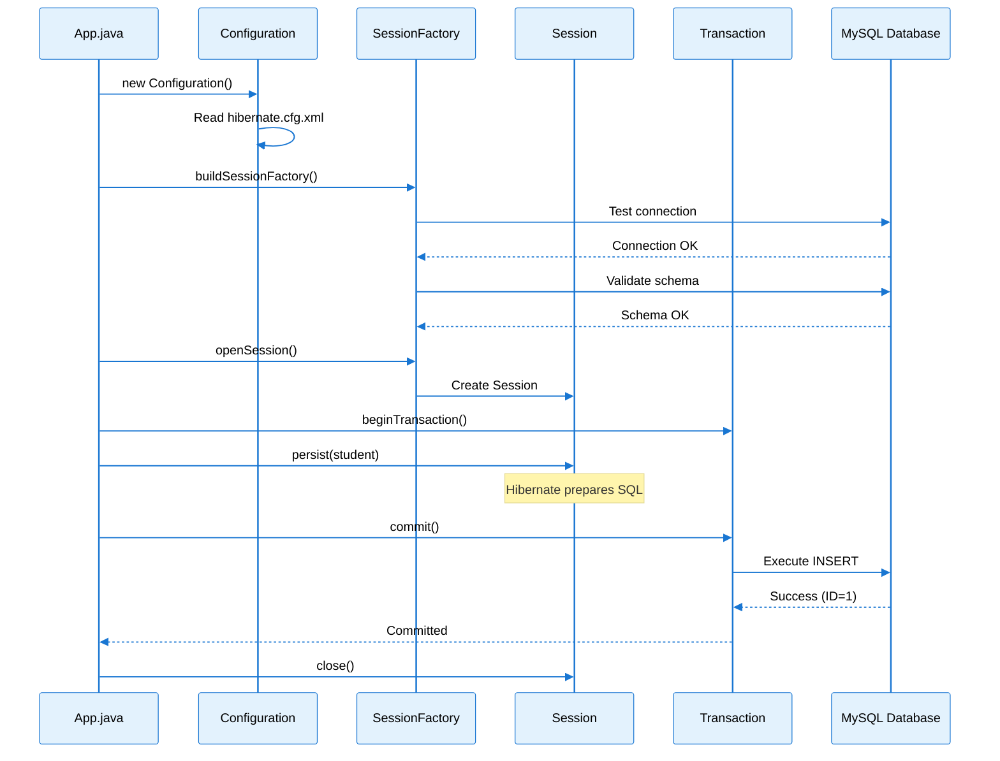

---

### 🧠 Memory Architecture

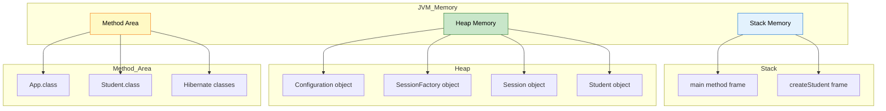

---

### 🔍 What Happens When You Call persist()?

**Code:**
```java
session.persist(student);
```

**Internal Steps:**

1. **Hibernate checks if object is transient (new)**
   ```
   Is student.id == 0? → Yes, it's new
   ```

2. **Hibernate generates SQL**
   ```sql
   INSERT INTO students (name, age) VALUES (?, ?)
   ```

3. **Hibernate prepares statement**
   ```java
   PreparedStatement stmt = connection.prepareStatement(sql);
   stmt.setString(1, student.getName());
   stmt.setInt(2, student.getAge());
   ```

4. **On commit(), SQL is executed**
   ```
   Database executes INSERT
   Returns generated ID (e.g., 1)
   ```

5. **Hibernate updates object**
   ```java
   student.setId(1);  // Hibernate sets the generated ID
   ```

---

### 📊 Entity States in Hibernate

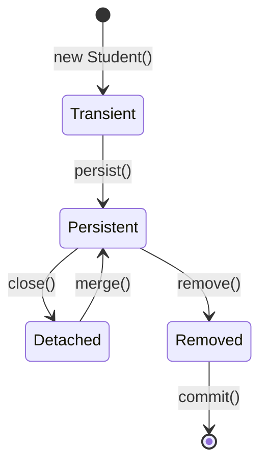

**State Explanations:**

| State | Description | Example |
|:------|:------------|:--------|
| **Transient** | New object, not in database | `Student s = new Student()` |
| **Persistent** | Managed by Hibernate, in database | After `persist()` |
| **Detached** | Was persistent, session closed | After `session.close()` |
| **Removed** | Marked for deletion | After `remove()` |

**Code Example:**
```java
// Transient state
Student student = new Student();
student.setName("John");

// Persistent state (Hibernate tracks changes)
session.persist(student);
student.setAge(20);  // Hibernate will UPDATE this automatically!

// Detached state (Hibernate no longer tracks)
session.close();
student.setAge(21);  // This change is NOT saved

// Back to Persistent
Session newSession = factory.openSession();
newSession.merge(student);  // Now changes are tracked again
```

---

### 🎯 Hibernate Caching

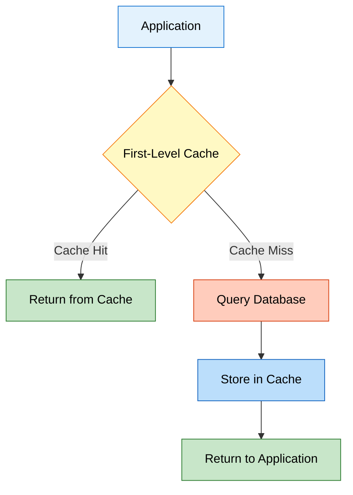

**First-Level Cache (Session Cache):**
- Enabled by default
- Lives within a Session
- Cleared when session closes

**Example:**
```java
Session session = factory.openSession();

// First call - queries database
Student s1 = session.get(Student.class, 1);

// Second call - returns from cache (no SQL!)
Student s2 = session.get(Student.class, 1);

System.out.println(s1 == s2);  // true (same object!)

session.close();
```

---

### 🔄 Transaction Isolation Levels

**What is Isolation?**
How transactions interact with each other.

| Level | Description | Problems Prevented |
|:------|:------------|:-------------------|
| **READ_UNCOMMITTED** | Can read uncommitted changes | None |
| **READ_COMMITTED** | Only read committed changes | Dirty reads |
| **REPEATABLE_READ** | Same read results in transaction | Dirty reads, Non-repeatable reads |
| **SERIALIZABLE** | Complete isolation | All problems |

**Default in MySQL:** REPEATABLE_READ

---


## 10. TOPICS COVERED IN THIS PROJECT

### ✅ Complete Checklist

#### 🎯 Hibernate Fundamentals
- ✅ **ORM Concept:** Object-Relational Mapping explained
- ✅ **Hibernate Architecture:** Configuration, SessionFactory, Session, Transaction
- ✅ **JPA vs Hibernate:** Understanding the relationship
- ✅ **POJO:** Plain Old Java Objects as entities

#### 🏗️ Configuration & Setup
- ✅ **Maven Dependencies:** hibernate-core, mysql-connector, HikariCP
- ✅ **hibernate.cfg.xml:** Complete configuration file
- ✅ **Connection Pooling:** HikariCP integration
- ✅ **Dialect:** Database-specific SQL generation
- ✅ **Schema Management:** hbm2ddl.auto options

#### 🏷️ JPA Annotations
- ✅ **@Entity:** Mark class as entity
- ✅ **@Table:** Customize table name
- ✅ **@Id:** Primary key
- ✅ **@GeneratedValue:** Auto-increment strategies
- ✅ **@Column:** Column customization

#### 💾 CRUD Operations
- ✅ **CREATE:** `session.persist()` - Insert data
- ✅ **READ:** `session.get()` - Retrieve data
- ✅ **UPDATE:** `session.merge()` - Modify data
- ✅ **DELETE:** `session.remove()` - Remove data

#### 🔧 Advanced Concepts
- ✅ **Transaction Management:** ACID properties
- ✅ **Entity States:** Transient, Persistent, Detached, Removed
- ✅ **First-Level Cache:** Session-level caching
- ✅ **Exception Handling:** Rollback on errors
- ✅ **Resource Management:** Proper session closing

---

### 📚 Learning Path Progression

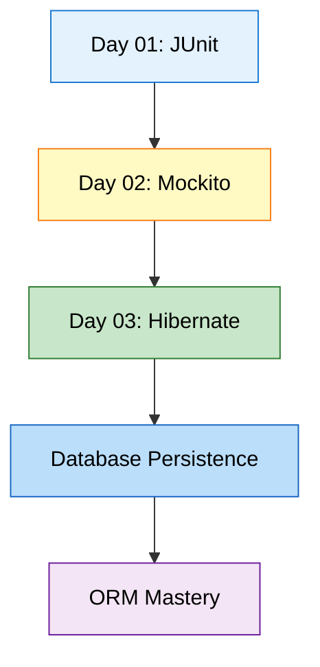

---

### 🎓 Real-World Applications

| Concept | Real-World Use Case |
|:--------|:-------------------|
| **Hibernate ORM** | E-commerce product catalog management |
| **Connection Pooling** | High-traffic web applications |
| **Transaction Management** | Banking systems (money transfers) |
| **Entity Mapping** | User management systems |
| **CRUD Operations** | Any database-driven application |
| **Caching** | Improve performance in read-heavy apps |

---


## 11. DAY 01 VS DAY 02 VS DAY 03 COMPARISON

> **📝 Comprehensive Comparison by:** Avinash Dhanuka | [Connect on GitHub](https://github.com/Avinash-706)

### 🔄 Evolution of Learning

```mermaid
graph LR
    A[Day 01: Testing] -->|Build Upon| B[Day 02: Mocking]
    B -->|Build Upon| C[Day 03: Persistence]
    
    A --> D[JUnit 5]
    B --> E[Mockito]
    C --> F[Hibernate]
    
    D --> G[Test Code]
    E --> H[Mock Dependencies]
    F --> I[Save to Database]
    
    style A fill:#e3f2fd,stroke:#1976d2,color:#000
    style B fill:#fff9c4,stroke:#f57f17,color:#000
    style C fill:#c8e6c9,stroke:#2e7d32,color:#000
```

---

### 📊 Comprehensive Comparison Table

| Aspect | Day 01 (JUnit) | Day 02 (Mockito) | Day 03 (Hibernate) |
|:-------|:--------------|:----------------|:-------------------|
| **Main Topic** | Unit Testing | Mocking Dependencies | Database Persistence |
| **Framework** | JUnit 5 | JUnit 5 + Mockito | Hibernate ORM |
| **Purpose** | Test code correctness | Test with fake objects | Save/retrieve data |
| **External System** | None | None | MySQL Database |
| **Key Classes** | Calculator, Student | OrderService, PaymentService | Student (Entity) |
| **Key Annotations** | @Test, @BeforeEach | @Mock, @InjectMocks | @Entity, @Id, @Column |
| **Main Operations** | Assertions | Stubbing, Verification | CRUD (Create, Read, Update, Delete) |
| **Configuration** | None | None | hibernate.cfg.xml |
| **Dependencies** | junit-jupiter | mockito-core | hibernate-core, mysql-connector |
| **Complexity** | Simple | Medium | Advanced |
| **Real-World Use** | Verify logic | Test without real services | Store data permanently |

---

### 🎯 What Each Day Teaches

#### Day 01: Foundation
```java
// Testing simple methods
@Test
void testAdd() {
    Calculator calc = new Calculator();
    assertEquals(5, calc.add(2, 3));
}
```
**Focus:** Verify code works correctly

---

#### Day 02: Isolation
```java
// Testing with dependencies
@Mock PaymentService paymentMock;
@InjectMocks OrderService orderService;

@Test
void testOrder() {
    when(paymentMock.process(100)).thenReturn(true);
    assertEquals("SUCCESS", orderService.placeOrder(100));
}
```
**Focus:** Test without real dependencies

---

#### Day 03: Persistence
```java
// Saving to database
Session session = factory.openSession();
Transaction tx = session.beginTransaction();

Student student = new Student();
student.setName("John");
session.persist(student);  // Saves to MySQL!

tx.commit();
session.close();
```
**Focus:** Store data permanently

---

### 🔄 How They Work Together

```mermaid
graph TD
    A[Real Application] --> B[Business Logic]
    B --> C[Database Layer]
    
    D[Day 01: JUnit] --> E[Test Business Logic]
    F[Day 02: Mockito] --> G[Mock Database Layer]
    H[Day 03: Hibernate] --> I[Implement Database Layer]
    
    E --> B
    G --> C
    I --> C
    
    style A fill:#e3f2fd,stroke:#1976d2,color:#000
    style B fill:#fff9c4,stroke:#f57f17,color:#000
    style C fill:#c8e6c9,stroke:#2e7d32,color:#000
    style D fill:#bbdefb,stroke:#1565c0,color:#000
    style E fill:#e3f2fd,stroke:#1976d2,color:#000
    style F fill:#ffccbc,stroke:#d84315,color:#000
    style G fill:#fff9c4,stroke:#f57f17,color:#000
    style H fill:#a5d6a7,stroke:#2e7d32,color:#000
    style I fill:#c8e6c9,stroke:#2e7d32,color:#000
```

**Example: E-commerce Application**

```java
// Day 03: Database layer (Hibernate)
public class ProductRepository {
    public void save(Product product) {
        session.persist(product);  // Hibernate saves to DB
    }
}

// Day 02: Business logic (uses repository)
public class OrderService {
    private ProductRepository repository;  // Will be mocked in tests
    
    public String createOrder(Product product) {
        repository.save(product);
        return "Order created";
    }
}

// Day 01: Test the business logic
@Test
void testCreateOrder() {
    @Mock ProductRepository mockRepo;  // Mock the database layer
    @InjectMocks OrderService orderService;
    
    String result = orderService.createOrder(product);
    assertEquals("Order created", result);
    verify(mockRepo).save(product);  // Veri
fy save was called
}
```

---

### 📈 Skill Progression

| Skill Level | Day 01 | Day 02 | Day 03 |
|:------------|:-------|:-------|:-------|
| **Beginner** | ✅ Write basic tests | ✅ Understand dependencies | ✅ Understand databases |
| **Intermediate** | ✅ Use assertions | ✅ Create mocks | ✅ Map entities |
| **Advanced** | ✅ Parameterized tests | ✅ Stub complex behaviors | ✅ Manage transactions |
| **Expert** | ✅ Test lifecycle | ✅ Verify interactions | ✅ Optimize queries |

---

### 🌐 When to Use What?

| Scenario | Day 01 (JUnit) | Day 02 (Mockito) | Day 03 (Hibernate) |
|:---------|:--------------|:----------------|:-------------------|
| Testing utility methods | ✅ Perfect | ❌ Overkill | ❌ Not needed |
| Testing business logic | ✅ If no deps | ✅ If has deps | ❌ Not for testing |
| Saving user data | ❌ Cannot | ❌ Cannot | ✅ Perfect |
| Testing with database | ❌ Cannot | ✅ Mock it | ✅ Real DB (integration) |
| Building REST API | ❌ Limited | ✅ For testing | ✅ For data layer |
| Simple calculations | ✅ Perfect | ❌ Not needed | ❌ Not needed |

---

### 🔄 Complete Application Stack

```mermaid
graph TD
    A[User Interface] --> B[REST Controller]
    B --> C[Service Layer - Business Logic]
    C --> D[Repository Layer - Hibernate]
    D --> E[MySQL Database]
    
    F[Day 01: JUnit] -.->|Tests| C
    G[Day 02: Mockito] -.->|Mocks| D
    H[Day 03: Hibernate] -.->|Implements| D
    
    style A fill:#e3f2fd,stroke:#1976d2,color:#000
    style B fill:#fff9c4,stroke:#f57f17,color:#000
    style C fill:#c8e6c9,stroke:#2e7d32,color:#000
    style D fill:#bbdefb,stroke:#1565c0,color:#000
    style E fill:#f3e5f5,stroke:#6a1b9a,color:#000
    style F fill:#ffccbc,stroke:#d84315,color:#000
    style G fill:#ffab91,stroke:#d84315,color:#000
    style H fill:#a5d6a7,stroke:#2e7d32,color:#000
```

---


## 12. TOP INTERVIEW QUESTIONS

> **📝 Curated by:** Avinash Dhanuka | © 2026 | [GitHub](https://github.com/Avinash-706)

### 🧠 Hibernate Fundamentals

#### Q1: What is the difference between JPA and Hibernate?

**Answer:**

| Aspect | JPA | Hibernate |
|:-------|:----|:----------|
| **Type** | Specification (Interface) | Implementation (Framework) |
| **Provider** | Standard API | One of many implementations |
| **Annotations** | `jakarta.persistence.*` | `org.hibernate.*` |
| **Portability** | Can switch providers | Vendor-specific |
| **Features** | Basic ORM | Advanced features (caching, etc.) |

**Real-World Analogy:**
- **JPA** = JDBC (standard interface)
- **Hibernate** = MySQL Driver (specific implementation)

**Code Example:**
```java
// JPA annotations (portable)
import jakarta.persistence.Entity;
import jakarta.persistence.Id;

@Entity
public class Student {
    @Id
    private int id;
}

// Hibernate-specific (not portable)
import org.hibernate.annotations.Cache;

@Entity
@Cache(usage = CacheConcurrencyStrategy.READ_WRITE)
public class Student { }
```

---

#### Q2: What is ORM and why do we need it?

**Answer:** ORM (Object-Relational Mapping) bridges the gap between object-oriented programming and relational databases.

**Without ORM (Plain JDBC):**
```java
// ❌ Manual SQL, type conversion, resource management
String sql = "INSERT INTO students (name, age) VALUES (?, ?)";
PreparedStatement stmt = conn.prepareStatement(sql);
stmt.setString(1, student.getName());
stmt.setInt(2, student.getAge());
stmt.executeUpdate();
stmt.close();
```

**With ORM (Hibernate):**
```java
// ✅ Simple, clean, automatic
session.persist(student);
```

**Benefits:**
1. ✅ No SQL writing (Hibernate generates it)
2. ✅ Database independence (works with any DB)
3. ✅ Automatic type conversion
4. ✅ Relationship management
5. ✅ Caching support

---

#### Q3: Explain the Hibernate architecture (4 core components)

**Answer:**

```mermaid
graph TD
    A[Configuration] -->|Builds| B[SessionFactory]
    B -->|Creates| C[Session]
    C -->|Manages| D[Transaction]
    
    style A fill:#e3f2fd,stroke:#1976d2,color:#000
    style B fill:#fff9c4,stroke:#f57f17,color:#000
    style C fill:#c8e6c9,stroke:#2e7d32,color:#000
    style D fill:#f3e5f5,stroke:#6a1b9a,color:#000
```

| Component | Purpose | Lifecycle | Thread-Safe |
|:----------|:--------|:----------|:------------|
| **Configuration** | Reads hibernate.cfg.xml | Created once | Yes |
| **SessionFactory** | Factory for Sessions | Created once, reused | Yes |
| **Session** | Database connection | Per operation | No |
| **Transaction** | ACID operations | Per operation | No |

**Code Flow:**
```java
// 1. Configuration (once)
Configuration config = new Configuration().configure();

// 2. SessionFactory (once)
SessionFactory factory = config.buildSessionFactory();

// 3. Session (per operation)
Session session = factory.openSession();

// 4. Transaction (per operation)
Transaction tx = session.beginTransaction();
session.persist(student);
tx.commit();
session.close();
```

---

#### Q4: What is the difference between Session and SessionFactory?

| Aspect | SessionFactory | Session |
|:-------|:--------------|:--------|
| **Weight** | Heavy (expensive to create) | Lightweight |
| **Thread-Safe** | Yes (shared across threads) | No (one per thread) |
| **Lifecycle** | Application lifetime | Short-lived |
| **Creation** | Once per application | Many times |
| **Purpose** | Factory for Sessions | Performs DB operations |
| **Cost** | High memory/CPU | Low memory/CPU |

**Real-World Analogy:**
- **SessionFactory** = Car factory (built once, produces many cars)
- **Session** = Individual car (produced by factory, used for one trip)

**Best Practice:**
```java
// ✅ GOOD: One SessionFactory for entire app
public class HibernateUtil {
    private static SessionFactory factory;
    
    static {
        factory = new Configuration().configure().buildSessionFactory();
    }
    
    public static Session getSession() {
        return factory.openSession();  // Create new session each time
    }
}
```

---

#### Q5: What are the different states of an entity in Hibernate?

**Answer:**

```mermaid
stateDiagram-v2
    [*] --> Transient: new Student()
    Transient --> Persistent: persist() / save()
    Persistent --> Detached: close() / evict()
    Detached --> Persistent: merge() / update()
    Persistent --> Removed: remove() / delete()
    Removed --> [*]: commit()
    
    note right of Transient: Not in DB, not tracked
    note right of Persistent: In DB, tracked by Hibernate
    note right of Detached: In DB, not tracked
    note right of Removed: Marked for deletion
```

**Code Example:**
```java
// 1. TRANSIENT - New object, not in database
Student student = new Student();
student.setName("John");

// 2. PERSISTENT - Saved to DB, tracked by Hibernate
session.persist(student);
student.setAge(20);  // Hibernate will UPDATE this automatically!

// 3. DETACHED - Session closed, no longer tracked
session.close();
student.setAge(21);  // This change is NOT saved

// 4. PERSISTENT again - Reattach to new session
Session newSession = factory.openSession();
newSession.merge(student);  // Now changes are tracked

// 5. REMOVED - Marked for deletion
newSession.remove(student);
```

---

### 🏷️ Annotations & Mapping

#### Q6: Explain @Entity, @Table, @Id, @GeneratedValue, @Column

**Answer:**

| Annotation | Purpose | Example |
|:-----------|:--------|:--------|
| **@Entity** | Marks class as database entity | `@Entity public class Student` |
| **@Table** | Customizes table name | `@Table(name = "students")` |
| **@Id** | Marks primary key field | `@Id private int id;` |
| **@GeneratedValue** | Auto-generate primary key | `@GeneratedValue(strategy = IDENTITY)` |
| **@Column** | Customizes column properties | `@Column(name = "student_name", length = 100)` |

**Complete Example:**
```java
@Entity  // This class maps to a table
@Table(name = "students")  // Table name is "students"
public class Student {
    
    @Id  // Primary key
    @GeneratedValue(strategy = GenerationType.IDENTITY)  // Auto-increment
    @Column(name = "id")
    private int id;
    
    @Column(name = "name", nullable = false, length = 100)
    private String name;
    
    @Column(name = "age")
    private int age;
}
```

**Generated SQL:**
```sql
CREATE TABLE students (
    id INT AUTO_INCREMENT PRIMARY KEY,
    name VARCHAR(100) NOT NULL,
    age INT
);
```

---

#### Q7: What are the different @GeneratedValue strategies?

**Answer:**

| Strategy | Description | Database Support | Use Case |
|:---------|:------------|:-----------------|:---------|
| **IDENTITY** | Database auto-increment | MySQL, PostgreSQL | Most common |
| **SEQUENCE** | Database sequence | Oracle, PostgreSQL | High performance |
| **TABLE** | Separate table for IDs | All databases | Portable |
| **AUTO** | Hibernate chooses | All databases | Let Hibernate decide |

**Examples:**
```java
// IDENTITY (MySQL, PostgreSQL)
@GeneratedValue(strategy = GenerationType.IDENTITY)
private int id;

// SEQUENCE (Oracle, PostgreSQL)
@GeneratedValue(strategy = GenerationType.SEQUENCE, generator = "student_seq")
@SequenceGenerator(name = "student_seq", sequenceName = "student_sequence")
private int id;

// TABLE (All databases)
@GeneratedValue(strategy = GenerationType.TABLE, generator = "student_gen")
@TableGenerator(name = "student_gen", table = "id_generator")
private int id;

// AUTO (Hibernate decides)
@GeneratedValue(strategy = GenerationType.AUTO)
private int id;
```

---

#### Q8: What is the difference between @Column(nullable = false) and @NotNull?

**Answer:**

| Annotation | Package | Validation Level | When Checked |
|:-----------|:--------|:----------------|:-------------|
| **@Column(nullable = false)** | JPA | Database level | When SQL executes |
| **@NotNull** | Bean Validation | Application level | Before saving |

**Example:**
```java
@Entity
public class Student {
    
    // Database constraint (SQL level)
    @Column(nullable = false)
    private String name;
    
    // Application validation (Java level)
    @NotNull
    @Column(nullable = false)  // Both for extra safety
    private String email;
}
```

**Best Practice:** Use both for complete validation!

---

### 💾 CRUD Operations

#### Q9: What is the difference between persist() and save()?

**Answer:**

| Method | Return Type | JPA Standard | Behavior |
|:-------|:------------|:-------------|:---------|
| **persist()** | void | Yes (JPA) | Doesn't return generated ID immediately |
| **save()** | Serializable | No (Hibernate) | Returns generated ID immediately |

**Code Example:**
```java
// persist() - JPA standard
session.persist(student);
// student.getId() might be 0 until flush/commit

// save() - Hibernate specific
Serializable id = session.save(student);
System.out.println("Generated ID: " + id);  // Immediate ID
```

**Recommendation:** Use `persist()` for JPA compatibility.

---

#### Q10: What is the difference between get() and load()?

**Answer:**

| Method | Eager/Lazy | Returns | Exception if Not Found |
|:-------|:-----------|:--------|:----------------------|
| **get()** | Eager (immediate query) | Actual object or null | No exception |
| **load()** | Lazy (proxy object) | Proxy object | LazyInitializationException |

**Code Example:**
```java
// get() - Immediate database hit
Student student = session.get(Student.class, 1);
if (student == null) {
    System.out.println("Not found");
}

// load() - Returns proxy, queries only when accessed
Student student = session.load(Student.class, 1);  // No SQL yet
System.out.println(student.getName());  // SQL executes here
```

**When to use:**
- **get()**: When you need the object immediately
- **load()**: When you only need the reference (e.g., setting foreign key)

---

#### Q11: What is the difference between update() and merge()?

**Answer:**

| Method | Entity State | Behavior | JPA Standard |
|:-------|:-------------|:---------|:-------------|
| **update()** | Detached | Reattaches existing entity | No (Hibernate) |
| **merge()** | Detached | Creates new persistent copy | Yes (JPA) |

**Code Example:**
```java
// Scenario: Entity is detached
Student student = new Student();
student.setId(1);
student.setName("Updated Name");

// update() - Reattaches the same object
session.update(student);  // student becomes persistent

// merge() - Creates a new persistent copy
Student merged = session.merge(student);  // Returns new object
// student is still detached, merged is persistent
```

**Recommendation:** Use `merge()` for JPA compatibility.

---

### ⚙️ Configuration & Performance

#### Q12: What is hibernate.hbm2ddl.auto and what are its values?

**Answer:**

| Value | Behavior | Use Case | Data Loss Risk |
|:------|:---------|:---------|:---------------|
| **create** | Drop and recreate tables | Development | ⚠️ HIGH (deletes all data) |
| **create-drop** | Create on start, drop on exit | Testing | ⚠️ HIGH |
| **update** | Update schema if needed | Development | ⚠️ MEDIUM |
| **validate** | Only validate schema | Production | ✅ SAFE |
| **none** | Do nothing | Production | ✅ SAFE |

**Configuration:**
```xml
<property name="hibernate.hbm2ddl.auto">update</property>
```

**⚠️ WARNING:** Never use `create` or `update` in production!

**Production Best Practice:**
```xml
<!-- Production -->
<property name="hibernate.hbm2ddl.auto">validate</property>

<!-- Use Flyway or Liquibase for schema migrations -->
```

---

#### Q13: What is connection pooling and why do we need it?

**Answer:** Connection pooling reuses database connections instead of creating new ones for each request.

**Without Connection Pool:**
```mermaid
graph LR
    A[Request 1] --> B[Create Connection]
    B --> C[Use]
    C --> D[Close]
    E[Request 2] --> F[Create Connection]
    F --> G[Use]
    G --> H[Close]
    
    style B fill:#ffcdd2,stroke:#c62828,color:#000
    style F fill:#ffcdd2,stroke:#c62828,color:#000
```

**With Connection Pool (HikariCP):**
```mermaid
graph LR
    A[Request 1] --> B[Get from Pool]
    B --> C[Use]
    C --> D[Return to Pool]
    E[Request 2] --> F[Reuse Connection]
    
    style B fill:#c8e6c9,stroke:#2e7d32,color:#000
    style F fill:#c8e6c9,stroke:#2e7d32,color:#000
```

**Configuration:**
```xml
<property name="hibernate.connection.provider_class">
    org.hibernate.hikaricp.internal.HikariCPConnectionProvider
</property>
<property name="hibernate.hikari.minimumIdle">5</property>
<property name="hibernate.hikari.maximumPoolSize">20</property>
```

**Benefits:**
- ✅ Faster (reuse connections)
- ✅ Efficient (limited connections)
- ✅ Scalable (handles high traffic)

---

#### Q14: What is the difference between show_sql and format_sql?

**Answer:**

| Property | Purpose | Output |
|:---------|:--------|:-------|
| **show_sql** | Display SQL in console | Single line SQL |
| **format_sql** | Pretty-print SQL | Multi-line formatted SQL |

**Configuration:**
```xml
<property name="hibernate.show_sql">true</property>
<property name="hibernate.format_sql">true</property>
```

**Output without format_sql:**
```sql
insert into students (age, name) values (?, ?)
```

**Output with format_sql:**
```sql
insert 
into
    students
    (age, name) 
values
    (?, ?)
```

---

### 🔄 Transactions & Caching

#### Q15: What are ACID properties in transactions?

**Answer:**

| Property | Meaning | Example |
|:---------|:--------|:--------|
| **A**tomicity | All or nothing | Transfer money: debit AND credit both succeed or both fail |
| **C**onsistency | Valid state always | Account balance never negative |
| **I**solation | Independent transactions | Two users booking same seat don't conflict |
| **D**urability | Permanent after commit | Power failure after commit doesn't lose data |

**Code Example:**
```java
Transaction tx = session.beginTransaction();
try {
    // Atomicity: Both operations succeed or both fail
    account1.setBalance(account1.getBalance() - 100);
    account2.setBalance(account2.getBalance() + 100);
    
    session.merge(account1);
    session.merge(account2);
    
    tx.commit();  // Durability: Changes are permanent
} catch (Exception e) {
    tx.rollback();  // Atomicity: Undo all changes
}
```

---

#### Q16: What is Hibernate caching? Explain first-level and second-level cache.

**Answer:**

```mermaid
graph TD
    A[Application] --> B{First-Level Cache}
    B -->|Cache Hit| C[Return from Session]
    B -->|Cache Miss| D{Second-Level Cache}
    D -->|Cache Hit| E[Return from SessionFactory]
    D -->|Cache Miss| F[Query Database]
    
    style A fill:#e3f2fd,stroke:#1976d2,color:#000
    style B fill:#fff9c4,stroke:#f57f17,color:#000
    style C fill:#c8e6c9,stroke:#2e7d32,color:#000
    style D fill:#bbdefb,stroke:#1565c0,color:#000
    style E fill:#c8e6c9,stroke:#2e7d32,color:#000
    style F fill:#ffccbc,stroke:#d84315,color:#000
```

| Cache Level | Scope | Enabled By Default | Shared Across Sessions |
|:------------|:------|:-------------------|:-----------------------|
| **First-Level** | Session | Yes | No |
| **Second-Level** | SessionFactory | No | Yes |

**First-Level Cache Example:**
```java
Session session = factory.openSession();

// First call - queries database
Student s1 = session.get(Student.class, 1);

// Second call - returns from cache (no SQL!)
Student s2 = session.get(Student.class, 1);

System.out.println(s1 == s2);  // true (same object!)

session.close();  // Cache cleared
```

**Second-Level Cache (requires configuration):**
```xml
<property name="hibernate.cache.use_second_level_cache">true</property>
<property name="hibernate.cache.region.factory_class">
    org.hibernate.cache.jcache.JCacheRegionFactory
</property>
```

---

#### Q17: What happens if you don't close a Session?

**Answer:**

**Problems:**
1. ❌ **Memory Leak:** Session objects accumulate in memory
2. ❌ **Connection Leak:** Database connections not returned to pool
3. ❌ **Resource Exhaustion:** Eventually runs out of connections
4. ❌ **Application Crash:** "Too many connections" error

**Best Practice:**
```java
Session session = null;
try {
    session = factory.openSession();
    // ... operations ...
} finally {
    if (session != null) {
        session.close();  // Always close!
    }
}

// Or use try-with-resources (Java 7+)
try (Session session = factory.openSession()) {
    // ... operations ...
}  // Automatically closed
```

---

### 🎯 Real-World Scenarios

#### Q18: How do you handle exceptions in Hibernate?

**Answer:**

```java
Session session = factory.openSession();
Transaction tx = null;

try {
    tx = session.beginTransaction();
    
    // Database operations
    session.persist(student);
    
    tx.commit();
    
} catch (HibernateException e) {
    // Rollback on any Hibernate error
    if (tx != null) {
        tx.rollback();
    }
    e.printStackTrace();
    
} catch (Exception e) {
    // Rollback on any other error
    if (tx != null) {
        tx.rollback();
    }
    e.printStackTrace();
    
} finally {
    // Always close session
    session.close();
}
```

**Common Exceptions:**
- `HibernateException`: Base exception for all Hibernate errors
- `ConstraintViolationException`: Database constraint violated
- `StaleStateException`: Optimistic locking failure
- `LazyInitializationException`: Accessing lazy-loaded data after session closed

---

#### Q19: What is N+1 query problem and how to solve it?

**Answer:** The N+1 problem occurs when Hibernate executes 1 query to fetch N records, then N additional queries to fetch related data.

**Problem Example:**
```java
// 1 query to fetch all students
List<Student> students = session.createQuery("FROM Student").list();

// N queries (one per student) to fetch courses
for (Student student : students) {
    System.out.println(student.getCourses());  // Lazy loading triggers query
}
// Total: 1 + N queries!
```

**Solution 1: JOIN FETCH**
```java
// Single query with JOIN
List<Student> students = session.createQuery(
    "FROM Student s JOIN FETCH s.courses"
).list();
// Total: 1 query!
```

**Solution 2: @BatchSize**
```java
@Entity
public class Student {
    @OneToMany
    @BatchSize(size = 10)  // Fetch 10 at a time
    private List<Course> courses;
}
```

---

#### Q20: How would you implement soft delete in Hibernate?

**Answer:** Soft delete marks records as deleted instead of actually deleting them.

**Implementation:**
```java
@Entity
@Table(name = "students")
@SQLDelete(sql = "UPDATE students SET deleted = true WHERE id = ?")
@Where(clause = "deleted = false")
public class Student {
    
    @Id
    @GeneratedValue(strategy = GenerationType.IDENTITY)
    private int id;
    
    private String name;
    
    @Column(name = "deleted")
    private boolean deleted = false;
    
    // Getters and setters
}
```

**Usage:**
```java
// This executes UPDATE instead of DELETE
session.remove(student);

// Queries automatically filter deleted records
List<Student> students = session.createQuery("FROM Student").list();
// Only returns students where deleted = false
```

---


### 🚀 Advanced Topics

#### Q21: What is the difference between Eager and Lazy loading?

**Answer:**

| Loading Type | When Data Loaded | Performance | Use Case |
|:-------------|:----------------|:------------|:---------|
| **Eager** | Immediately with parent | Slower (more data) | Small related data |
| **Lazy** | Only when accessed | Faster (less data) | Large related data |

**Code Example:**
```java
@Entity
public class Student {
    @Id
    private int id;
    
    // Eager loading - courses loaded immediately
    @OneToMany(fetch = FetchType.EAGER)
    private List<Course> courses;
    
    // Lazy loading - address loaded only when accessed
    @OneToOne(fetch = FetchType.LAZY)
    private Address address;
}

// Usage
Student student = session.get(Student.class, 1);
// courses are already loaded (EAGER)
// address is NOT loaded yet (LAZY)

System.out.println(student.getAddress());  // NOW address is loaded
```

**Default Behavior:**
- `@OneToOne`, `@ManyToOne` → EAGER
- `@OneToMany`, `@ManyToMany` → LAZY

---

#### Q22: What is HQL (Hibernate Query Language)?

**Answer:** HQL is an object-oriented query language similar to SQL but works with entities instead of tables.

**SQL vs HQL:**

| Aspect | SQL | HQL |
|:-------|:----|:----|
| **Works With** | Tables and columns | Entities and properties |
| **Case Sensitive** | No | Yes (for entity names) |
| **Syntax** | `SELECT * FROM students` | `FROM Student` |

**Examples:**
```java
// HQL - Query by entity name
List<Student> students = session.createQuery(
    "FROM Student WHERE age > 18", Student.class
).list();

// HQL - With parameters
List<Student> students = session.createQuery(
    "FROM Student s WHERE s.name = :name", Student.class
)
.setParameter("name", "John")
.list();

// HQL - Joins
List<Student> students = session.createQuery(
    "FROM Student s JOIN FETCH s.courses WHERE s.age > 18", 
    Student.class
).list();

// HQL - Aggregate functions
Long count = session.createQuery(
    "SELECT COUNT(s) FROM Student s", Long.class
).uniqueResult();
```

---

#### Q23: What is Criteria API?

**Answer:** Criteria API is a type-safe, programmatic way to build queries without writing HQL strings.

**HQL vs Criteria API:**
```java
// HQL - String-based (error-prone)
List<Student> students = session.createQuery(
    "FROM Student WHERE age > 18", Student.class
).list();

// Criteria API - Type-safe
CriteriaBuilder cb = session.getCriteriaBuilder();
CriteriaQuery<Student> cq = cb.createQuery(Student.class);
Root<Student> root = cq.from(Student.class);
cq.select(root).where(cb.gt(root.get("age"), 18));

List<Student> students = session.createQuery(cq).list();
```

**Advantages:**
- ✅ Type-safe (compile-time checking)
- ✅ No string concatenation
- ✅ IDE auto-completion
- ✅ Refactoring-friendly

---

#### Q24: What is the difference between save(), persist(), merge(), and update()?

**Answer:**

| Method | Return Type | JPA Standard | Transient → Persistent | Detached → Persistent |
|:-------|:------------|:-------------|:----------------------|:---------------------|
| **save()** | Serializable | No | ✅ Yes | ❌ No |
| **persist()** | void | Yes | ✅ Yes | ❌ No |
| **merge()** | Entity | Yes | ✅ Yes | ✅ Yes |
| **update()** | void | No | ✅ Yes | ✅ Yes |

**Code Examples:**
```java
// save() - Returns generated ID
Serializable id = session.save(student);
System.out.println("ID: " + id);

// persist() - No return value
session.persist(student);

// merge() - Returns managed entity
Student managed = session.merge(detachedStudent);

// update() - Reattaches entity
session.update(detachedStudent);
```

**Best Practice:** Use `persist()` and `merge()` for JPA compatibility.

---

#### Q25: How do you implement one-to-many relationship in Hibernate?

**Answer:**

**Scenario:** One Department has many Employees

```java
// Parent Entity
@Entity
@Table(name = "departments")
public class Department {
    @Id
    @GeneratedValue(strategy = GenerationType.IDENTITY)
    private int id;
    
    private String name;
    
    // One department has many employees
    @OneToMany(mappedBy = "department", cascade = CascadeType.ALL)
    private List<Employee> employees = new ArrayList<>();
    
    // Helper method
    public void addEmployee(Employee employee) {
        employees.add(employee);
        employee.setDepartment(this);
    }
}

// Child Entity
@Entity
@Table(name = "employees")
public class Employee {
    @Id
    @GeneratedValue(strategy = GenerationType.IDENTITY)
    private int id;
    
    private String name;
    
    // Many employees belong to one department
    @ManyToOne
    @JoinColumn(name = "department_id")
    private Department department;
}
```

**Usage:**
```java
Department dept = new Department();
dept.setName("IT");

Employee emp1 = new Employee();
emp1.setName("John");

Employee emp2 = new Employee();
emp2.setName("Jane");

dept.addEmployee(emp1);
dept.addEmployee(emp2);

session.persist(dept);  // Saves department and employees (cascade)
```

**Generated Tables:**
```sql
CREATE TABLE departments (
    id INT AUTO_INCREMENT PRIMARY KEY,
    name VARCHAR(255)
);

CREATE TABLE employees (
    id INT AUTO_INCREMENT PRIMARY KEY,
    name VARCHAR(255),
    department_id INT,
    FOREIGN KEY (department_id) REFERENCES departments(id)
);
```

---

### 💡 Best Practices & Tips

#### Q26: What are Hibernate best practices?

**Answer:**

**1. Always Use Transactions**
```java
// ✅ GOOD
Transaction tx = session.beginTransaction();
session.persist(student);
tx.commit();

// ❌ BAD
session.persist(student);  // May not save!
```

**2. Always Close Sessions**
```java
// ✅ GOOD - Try-with-resources
try (Session session = factory.openSession()) {
    // operations
}

// ❌ BAD
Session session = factory.openSession();
// ... forgot to close
```

**3. Use Connection Pooling**
```xml
<!-- ✅ GOOD -->
<property name="hibernate.connection.provider_class">
    org.hibernate.hikaricp.internal.HikariCPConnectionProvider
</property>
```

**4. Enable SQL Logging in Development Only**
```xml
<!-- Development -->
<property name="hibernate.show_sql">true</property>

<!-- Production -->
<property name="hibernate.show_sql">false</property>
```

**5. Use Proper Fetch Strategies**
```java
// ✅ GOOD - Lazy for large collections
@OneToMany(fetch = FetchType.LAZY)
private List<Order> orders;

// ❌ BAD - Eager for large collections
@OneToMany(fetch = FetchType.EAGER)
private List<Order> orders;  // Loads all orders always!
```

**6. Never Use hbm2ddl.auto=create in Production**
```xml
<!-- ❌ NEVER in production -->
<property name="hibernate.hbm2ddl.auto">create</property>

<!-- ✅ Production -->
<property name="hibernate.hbm2ddl.auto">validate</property>
```

**7. Use Named Queries for Reusability**
```java
@Entity
@NamedQuery(
    name = "Student.findByAge",
    query = "FROM Student s WHERE s.age > :age"
)
public class Student { }

// Usage
List<Student> students = session.createNamedQuery("Student.findByAge", Student.class)
    .setParameter("age", 18)
    .list();
```

---

#### Q27: Common Hibernate errors and solutions

**Answer:**

**1. LazyInitializationException**
```
Error: could not initialize proxy - no Session
```
**Cause:** Accessing lazy-loaded data after session closed
**Solution:**
```java
// ✅ Access within session
try (Session session = factory.openSession()) {
    Student student = session.get(Student.class, 1);
    student.getCourses().size();  // Force loading
}

// Or use EAGER fetch
@OneToMany(fetch = FetchType.EAGER)
```

**2. NonUniqueObjectException**
```
Error: a different object with the same identifier value was already associated with the session
```
**Cause:** Two objects with same ID in one session
**Solution:**
```java
// ✅ Use merge instead of persist
session.merge(student);
```

**3. ConstraintViolationException**
```
Error: Duplicate entry for key 'PRIMARY'
```
**Cause:** Trying to insert duplicate primary key
**Solution:**
```java
// ✅ Check if exists first
Student existing = session.get(Student.class, id);
if (existing == null) {
    session.persist(student);
}
```

**4. Connection Pool Exhausted**
```
Error: Timeout waiting for connection from pool
```
**Cause:** Not closing sessions
**Solution:**
```java
// ✅ Always close sessions
try (Session session = factory.openSession()) {
    // operations
}
```

---

### 📚 Additional Resources

#### Q28: What are the alternatives to Hibernate?

**Answer:**

| ORM Framework | Language | Pros | Cons |
|:--------------|:---------|:-----|:-----|
| **Hibernate** | Java | Feature-rich, mature | Complex, heavy |
| **EclipseLink** | Java | JPA reference implementation | Less popular |
| **MyBatis** | Java | SQL control, lightweight | More manual work |
| **JOOQ** | Java | Type-safe SQL | Not full ORM |
| **Spring Data JPA** | Java | Built on Hibernate, simpler | Less control |

**When to use what:**
- **Hibernate**: Complex domain models, relationships
- **MyBatis**: Need SQL control, legacy databases
- **Spring Data JPA**: Spring Boot applications
- **JOOQ**: Type-safe SQL, complex queries

---

#### Q29: How does Hibernate compare to JDBC?

**Answer:**

```mermaid
graph TD
    A[Database Operations] --> B{Choose Approach}
    B -->|Simple, SQL Control| C[JDBC]
    B -->|Complex, OOP| D[Hibernate]
    
    C --> E[Manual SQL]
    C --> F[More Code]
    C --> G[Full Control]
    
    D --> H[Automatic SQL]
    D --> I[Less Code]
    D --> J[Abstraction]
    
    style A fill:#e3f2fd,stroke:#1976d2,color:#000
    style B fill:#fff9c4,stroke:#f57f17,color:#000
    style C fill:#ffccbc,stroke:#d84315,color:#000
    style D fill:#c8e6c9,stroke:#2e7d32,color:#000
```

| Aspect | JDBC | Hibernate |
|:-------|:-----|:----------|
| **Code Amount** | More (30+ lines) | Less (5 lines) |
| **SQL Writing** | Manual | Automatic |
| **Database Independence** | No | Yes |
| **Caching** | Manual | Built-in |
| **Relationships** | Manual | Automatic |
| **Learning Curve** | Easy | Moderate |
| **Performance** | Can be faster | Good with tuning |
| **Use Case** | Simple queries | Complex applications |

**Example Comparison:**

**JDBC (30+ lines):**
```java
Connection conn = null;
PreparedStatement stmt = null;
ResultSet rs = null;

try {
    Class.forName("com.mysql.cj.jdbc.Driver");
    conn = DriverManager.getConnection(url, user, password);
    
    String sql = "INSERT INTO students (name, age) VALUES (?, ?)";
    stmt = conn.prepareStatement(sql);
    stmt.setString(1, student.getName());
    stmt.setInt(2, student.getAge());
    stmt.executeUpdate();
    
} catch (Exception e) {
    e.printStackTrace();
} finally {
    if (rs != null) rs.close();
    if (stmt != null) stmt.close();
    if (conn != null) conn.close();
}
```

**Hibernate (5 lines):**
```java
Session session = factory.openSession();
Transaction tx = session.beginTransaction();
session.persist(student);
tx.commit();
session.close();
```

---

#### Q30: What's next after learning Hibernate?

**Answer:**

**Learning Path:**

```mermaid
graph TD
    A[Day 03: Hibernate Basics] --> B[Advanced Hibernate]
    B --> C[Spring Data JPA]
    C --> D[Spring Boot]
    D --> E[Microservices]
    
    B --> F[Relationships]
    B --> G[Caching]
    B --> H[Query Optimization]
    
    C --> I[Repositories]
    C --> J[Query Methods]
    
    D --> K[REST APIs]
    D --> L[Full Stack Apps]
    
    style A fill:#e3f2fd,stroke:#1976d2,color:#000
    style B fill:#fff9c4,stroke:#f57f17,color:#000
    style C fill:#c8e6c9,stroke:#2e7d32,color:#000
    style D fill:#bbdefb,stroke:#1565c0,color:#000
    style E fill:#f3e5f5,stroke:#6a1b9a,color:#000
```

**Next Steps:**

1. **Advanced Hibernate Topics**
   - One-to-Many, Many-to-Many relationships
   - Inheritance mapping
   - Second-level caching
   - Query optimization

2. **Spring Data JPA**
   - Repository pattern
   - Query methods
   - Specifications
   - Pagination

3. **Spring Boot**
   - Auto-configuration
   - REST APIs
   - Security
   - Microservices

4. **Real-World Projects**
   - E-commerce application
   - Blog platform
   - Social media app
   - Banking system

---


## 📝 Project Summary

### What We Built in Day 03

This project demonstrates a complete Hibernate ORM implementation with:

✅ **Entity Mapping**: Student class mapped to database table  
✅ **Configuration**: hibernate.cfg.xml with MySQL connection  
✅ **Connection Pooling**: HikariCP for efficient database connections  
✅ **CRUD Operations**: Create operation with user input  
✅ **Transaction Management**: Proper commit/rollback handling  
✅ **Auto Schema Generation**: Hibernate creates tables automatically  

### Key Files in This Project

| File | Purpose | Lines |
|:-----|:--------|:------|
| **Student.java** | Entity class with JPA annotations | 65 |
| **App.java** | Main application with CRUD operations | 50 |
| **hibernate.cfg.xml** | Hibernate configuration | 40 |
| **pom.xml** | Maven dependencies | 70 |
| **info.txt** | Project notes and setup instructions | 80 |

### What You Learned

**Core Concepts:**
- 🎯 Object-Relational Mapping (ORM)
- 🎯 JPA Annotations (@Entity, @Id, @Column)
- 🎯 Hibernate Architecture (Configuration, SessionFactory, Session, Transaction)
- 🎯 CRUD Operations (Create, Read, Update, Delete)
- 🎯 Connection Pooling with HikariCP
- 🎯 Transaction Management (ACID properties)

**Practical Skills:**
- ✅ Setting up Hibernate with Maven
- ✅ Configuring MySQL database connection
- ✅ Creating entity classes
- ✅ Performing database operations without SQL
- ✅ Handling transactions and exceptions
- ✅ Using connection pooling for performance

---

## 🎯 Quick Reference

### Essential Code Snippets

**1. Create SessionFactory (Once per application)**
```java
SessionFactory factory = new Configuration()
    .configure("hibernate.cfg.xml")
    .buildSessionFactory();
```

**2. Save Entity (CREATE)**
```java
Session session = factory.openSession();
Transaction tx = session.beginTransaction();
try {
    session.persist(student);
    tx.commit();
} catch (Exception e) {
    tx.rollback();
} finally {
    session.close();
}
```

**3. Retrieve Entity (READ)**
```java
Session session = factory.openSession();
Student student = session.get(Student.class, 1);
session.close();
```

**4. Update Entity (UPDATE)**
```java
Session session = factory.openSession();
Transaction tx = session.beginTransaction();
try {
    Student student = session.get(Student.class, 1);
    student.setName("Updated Name");
    session.merge(student);
    tx.commit();
} catch (Exception e) {
    tx.rollback();
} finally {
    session.close();
}
```

**5. Delete Entity (DELETE)**
```java
Session session = factory.openSession();
Transaction tx = session.beginTransaction();
try {
    Student student = session.get(Student.class, 1);
    session.remove(student);
    tx.commit();
} catch (Exception e) {
    tx.rollback();
} finally {
    session.close();
}
```

---

## 🔗 Related Projects

### Day 01: JUnit 5 Testing
- **Location**: `day01/JUnitOne/`
- **Focus**: Unit testing fundamentals
- **README**: [Day 01 README](../../day01/JUnitOne/README.md)

### Day 02: Mockito Testing
- **Location**: `day02/MockitoMaven/`
- **Focus**: Mocking dependencies in tests
- **README**: [Day 02 README](../../day02/MockitoMaven/README.md)

### Day 04: Advanced Hibernate (Coming Soon)
- **Topics**: Relationships, HQL, Criteria API
- **Focus**: Advanced ORM features

---

<div align="center">

## 🎓 End of Day 03 Master Guide

<br>


<br>

**Created with dedication by Avinash Dhanuka**

<br>

[](https://github.com/Avinash-706)
[](mailto:avunashdhanuka@gmail.com)

<br>

---

**Happy Coding! 🚀**

*"From Java Objects to Database Tables - The Magic of ORM!"* - Avinash Dhanuka

---

**Stay tuned for more learning!**

---

</div>

