# ☕ Master Guide: Advanced Hibernate - Annotations, Caching & Entity Lifecycle

<div align="center">


</div>

<hr style="border: 1px solid rgb(98, 117, 187)">

<div align="center">
<table>
<tr>
<td align="center">
<br />

<h3>© 2026 Avinash Dhanuka</h3>
<p>Master Guide: Advanced Hibernate Core Concepts</p>
<p><em>Crafted with ❤️ for Deep ORM Understanding</em></p>

<a href="https://github.com/Avinash-706" target="_blank">

</a>
<br />
<a href="https://mail.google.com/mail/?view=cm&fs=1&to=avunashdhanuka@gmail.com&su=Hibernate%20Advanced%20Query&body=☕%20Hello%20Avinash,%0D%0A%0D%0AMy%20name%20is%20[Your%20Name]%20and%20I%20have%20a%20doubt%20regarding%20Advanced%20Hibernate.%0D%0A%0D%0A🔹%20Topic:%20[Hibernate/Caching/Lifecycle]%0D%0A%0D%0AThank%20you!" target="_blank">

</a>
<br />
<br />
</td>
</tr>
</table>
</div>

> **Learning Note:** This guide builds upon Day 03 (Hibernate Basics) by diving deep into advanced Hibernate features including caching mechanisms, comprehensive JPA annotations, entity lifecycle management, and the Singleton pattern for SessionFactory.

> **Prerequisites:** 
> - Complete understanding of [Day 01 - JUnit 5 Fundamentals](../../day01/JUnitOne/README.md)
> - Complete understanding of [Day 02 - Mockito Testing](../../day02/MockitoMaven/README.md)
> - Complete understanding of [Day 03 - Hibernate Basics](../../day03/HibernateDemo/README.md)
> - MySQL Server installed and running

---

## 📑 Table of Contents
1. [What's New in Day 04?](#1-whats-new-in-day-04)
2. [Hibernate Caching Deep Dive](#2-hibernate-caching-deep-dive)
3. [Complete JPA Annotations Reference](#3-complete-jpa-annotations-reference)
4. [Entity Lifecycle & States](#4-entity-lifecycle--states)
5. [Singleton Pattern for SessionFactory](#5-singleton-pattern-for-sessionfactory)
6. [Service Layer Architecture](#6-service-layer-architecture)
7. [Advanced Entity Features](#7-advanced-entity-features)
8. [HQL (Hibernate Query Language)](#8-hql-hibernate-query-language)
9. [Internal Execution Flow](#9-internal-execution-flow)
10. [Topics Covered in This Project](#10-topics-covered-in-this-project)
11. [Day 03 vs Day 04 Comparison](#11-day-03-vs-day-04-comparison)
12. [Interview Questions](#12-top-interview-questions)

---


## 1. WHAT'S NEW IN DAY 04?

> **📝 Author:** Avinash Dhanuka | [GitHub](https://github.com/Avinash-706)

### 🎯 Evolution from Day 03

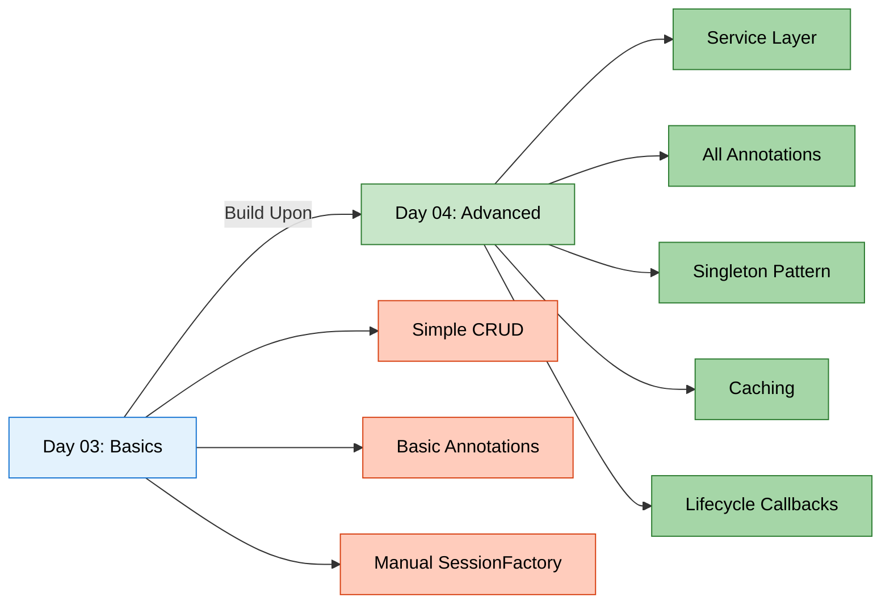

### 📊 What's Different?

| Feature | Day 03 | Day 04 |
|:--------|:-------|:-------|
| **Architecture** | Single App class | Service Layer Pattern |
| **SessionFactory** | Created in main() | Singleton Pattern (reusable) |
| **Annotations** | @Entity, @Id, @Column | +10 more annotations |
| **Caching** | Not covered | 1st & 2nd level explained |
| **Lifecycle** | Not covered | All 3 states + callbacks |
| **Entity Features** | Basic fields | @Transient, @Temporal, @Index |
| **Queries** | Direct session methods | HQL queries |
| **CRUD** | Basic operations | Complete service layer |
| **Timestamps** | Manual | Automatic with @PrePersist |
| **Complexity** | Beginner | Intermediate-Advanced |

### 🎓 New Concepts Introduced

#### 1️⃣ Hibernate Caching
- **First-Level Cache** (Session-level) - Automatic
- **Second-Level Cache** (SessionFactory-level) - Configurable
- Cache hit/miss scenarios
- Performance optimization

#### 2️⃣ Complete Annotation Set
- **@Transient** - Exclude fields from persistence
- **@Temporal** - Date/Time handling
- **@Enumerated** - Enum mapping
- **@Lob** - Large objects (BLOB/CLOB)
- **@Basic** - Basic field mapping
- **@Index** - Database indexing
- **Lifecycle Callbacks** - @PrePersist, @PostLoad, etc.

#### 3️⃣ Entity Lifecycle States
- **Transient** - New object, not tracked
- **Persistent** - Managed by Hibernate
- **Detached** - Was persistent, session closed

#### 4️⃣ Design Patterns
- **Singleton Pattern** for SessionFactory
- **Service Layer Pattern** for business logic
- **DAO Pattern** concepts

---


## 2. HIBERNATE CACHING DEEP DIVE

> **📝 Comprehensive Caching Guide by:** Avinash Dhanuka | © 2026

### 📌 What is Caching?

**Caching** = Storing frequently accessed data in memory to avoid repeated database queries.

**Real-World Analogy:**
- **Without Cache:** Every time you need a book, you go to the library (slow)
- **With Cache:** You keep frequently used books on your desk (fast)

### 🏗️ Hibernate Caching Architecture

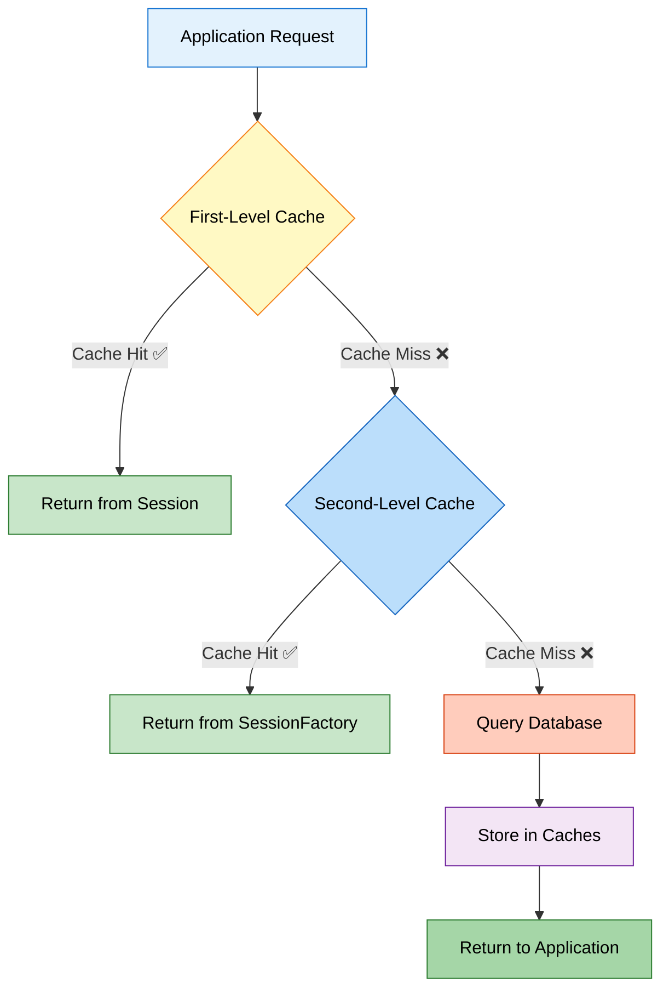

---

### 1️⃣ First-Level Cache (Session Cache)

**What is it?**
A cache that exists within a **single Session** object. It's **enabled by default** and cannot be disabled.

**Characteristics:**

| Property | Value |
|:---------|:------|
| **Scope** | Single Session |
| **Enabled** | Always (by default) |
| **Shared** | No (per session) |
| **Lifetime** | Until session.close() |
| **Type** | Mandatory |

**How It Works:**

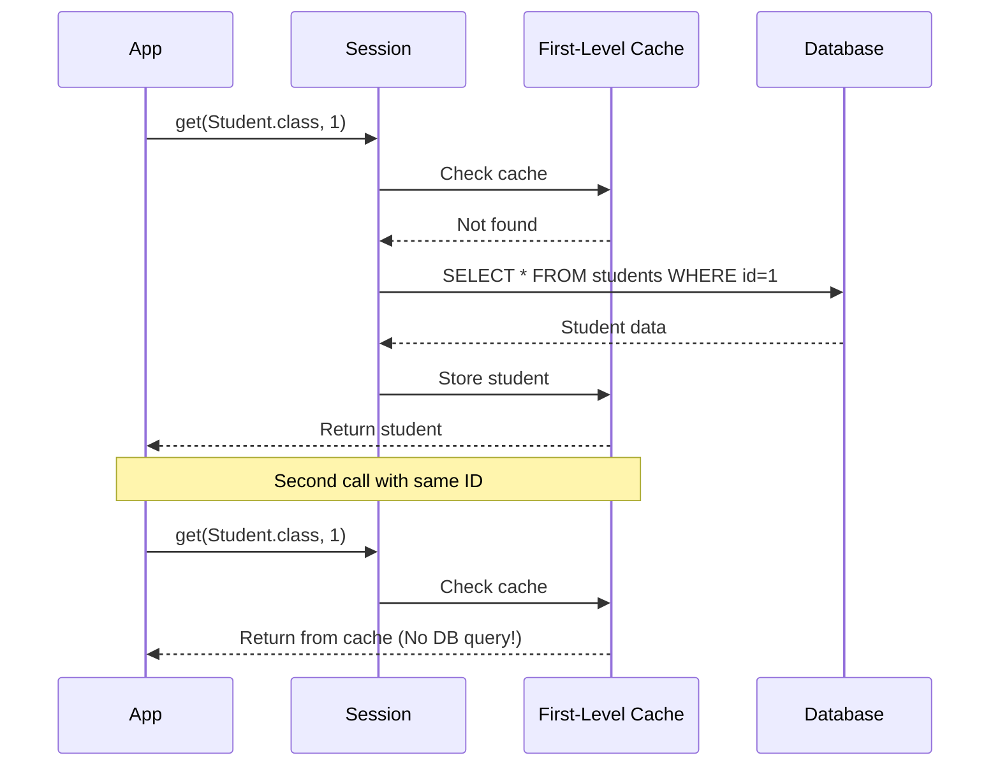

**Code Example:**

```java
Session session = factory.openSession();

// First call - Queries database
Student student1 = session.get(Student.class, 1);
System.out.println("First call: " + student1.getName());

// Second call - Returns from cache (NO SQL!)
Student student2 = session.get(Student.class, 1);
System.out.println("Second call: " + student2.getName());

// Both references point to same object
System.out.println(student1 == student2);  // true

session.close();  // Cache is cleared
```

**Console Output:**
```sql
Hibernate: SELECT s1_0.id, s1_0.name, s1_0.age FROM students s1_0 WHERE s1_0.id=?
First call: John
Second call: John  -- No SQL query!
true
```

**Key Points:**
- ✅ First call executes SQL
- ✅ Second call uses cache (faster)
- ✅ Both variables reference the same object
- ✅ Cache cleared when session closes

---

### 2️⃣ Second-Level Cache (SessionFactory Cache)

**What is it?**
A cache that exists at the **SessionFactory** level and is **shared across all sessions**.

**Characteristics:**

| Property | Value |
|:---------|:------|
| **Scope** | Entire SessionFactory |
| **Enabled** | No (must configure) |
| **Shared** | Yes (across sessions) |
| **Lifetime** | Until factory.close() |
| **Type** | Optional |
| **Providers** | EHCache, JCache, Infinispan |

**How It Works:**

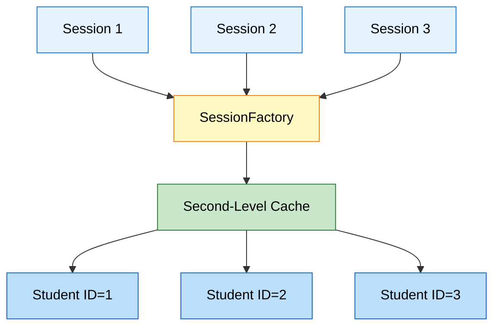

**Configuration (hibernate.cfg.xml):**

```xml
<!-- Enable Second-Level Cache -->
<property name="hibernate.cache.use_second_level_cache">true</property>

<!-- Cache Provider (EHCache example) -->
<property name="hibernate.cache.region.factory_class">
    org.hibernate.cache.jcache.JCacheRegionFactory
</property>

<!-- Query Cache (optional) -->
<property name="hibernate.cache.use_query_cache">true</property>
```

**Entity Configuration:**

```java
@Entity
@Cacheable  // Enable caching for this entity
@org.hibernate.annotations.Cache(usage = CacheConcurrencyStrategy.READ_WRITE)
public class Student {
    // ... fields
}
```

**Code Example:**

```java
// Session 1
Session session1 = factory.openSession();
Student student1 = session1.get(Student.class, 1);  // Queries DB
session1.close();

// Session 2 (different session)
Session session2 = factory.openSession();
Student student2 = session2.get(Student.class, 1);  // Uses 2nd-level cache!
session2.close();

// No SQL query for session2 if 2nd-level cache is enabled
```

---

### 📊 First-Level vs Second-Level Cache

| Aspect | First-Level Cache | Second-Level Cache |
|:-------|:-----------------|:-------------------|
| **Scope** | Single Session | All Sessions |
| **Enabled** | Always | Must configure |
| **Shared** | No | Yes |
| **Lifetime** | Session lifetime | Application lifetime |
| **Configuration** | None needed | Requires provider |
| **Use Case** | Within single transaction | Across transactions |
| **Performance** | Fast | Very Fast |
| **Memory** | Low | Higher |

---

### 🎯 Cache Strategies

**CacheConcurrencyStrategy Options:**

| Strategy | Description | Use Case |
|:---------|:------------|:---------|
| **READ_ONLY** | Never updated | Reference data (countries, categories) |
| **READ_WRITE** | Can be updated | Most entities |
| **NONSTRICT_READ_WRITE** | Rarely updated | Configuration data |
| **TRANSACTIONAL** | Full transaction support | Critical data |

**Example:**

```java
@Entity
@Cache(usage = CacheConcurrencyStrategy.READ_ONLY)
public class Country {
    // Countries rarely change
}

@Entity
@Cache(usage = CacheConcurrencyStrategy.READ_WRITE)
public class Student {
    // Students frequently updated
}
```

---

### 🔍 Cache Operations

**Evicting Cache:**

```java
// Evict specific entity from 1st-level cache
session.evict(student);

// Clear entire 1st-level cache
session.clear();

// Evict from 2nd-level cache
sessionFactory.getCache().evictEntity(Student.class, studentId);

// Clear entire 2nd-level cache
sessionFactory.getCache().evictAllRegions();
```

**When to Use Caching:**

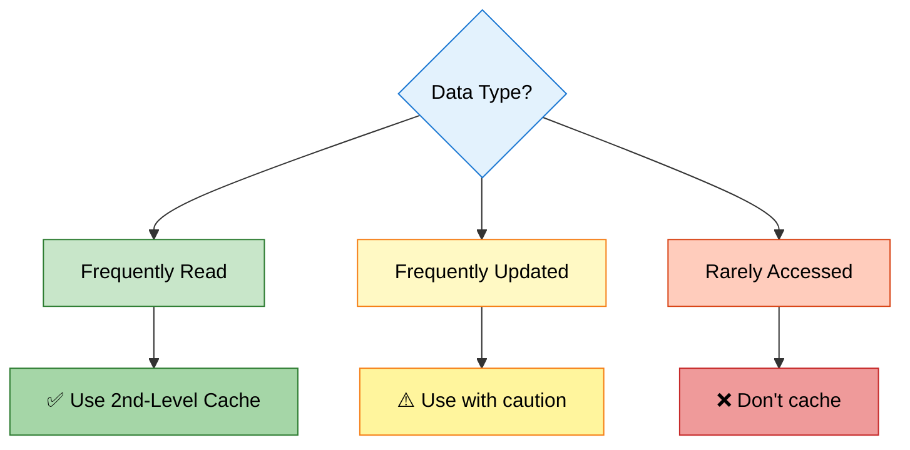

---


## 3. COMPLETE JPA ANNOTATIONS REFERENCE

> **📝 Comprehensive Annotation Guide by:** Avinash Dhanuka

### 📌 Annotation Categories

```mermaid
graph TD
    A[JPA Annotations] --> B[Entity Mapping]
    A --> C[Field Mapping]
    A --> D[Relationship]
    A --> E[Lifecycle]
    A --> F[Query]
    
    B --> G[@Entity, @Table]
    C --> H[@Column, @Id, @Transient]
    D --> I[@OneToMany, @ManyToOne]
    E --> J[@PrePersist, @PostLoad]
    F --> K[@NamedQuery]
    
    style A fill:#e3f2fd,stroke:#1976d2,color:#000
    style B fill:#c8e6c9,stroke:#2e7d32,color:#000
    style C fill:#fff9c4,stroke:#f57f17,color:#000
    style D fill:#bbdefb,stroke:#1565c0,color:#000
    style E fill:#f3e5f5,stroke:#6a1b9a,color:#000
    style F fill:#ffccbc,stroke:#d84315,color:#000
```

---

### 1️⃣ Entity-Level Annotations

#### @Entity

**Purpose:** Marks a class as a JPA entity (database table)

**Reference:** [Student.java:7](src/main/java/org/example/entity/Student.java#L7)

```java
@Entity
public class Student {
    // This class maps to a database table
}
```

**What Hibernate Does:**
- Creates table named `student` (lowercase class name)
- Scans for field annotations
- Manages entity lifecycle

---

#### @Table

**Purpose:** Customizes table properties

**Reference:** [Student.java:8](src/main/java/org/example/entity/Student.java#L8)

```java
@Entity
@Table(name = "students", 
       indexes = {@Index(name = "idx_name", columnList = "name")})
public class Student {
    // Maps to "students" table with index on name column
}
```

**Properties:**

| Property | Purpose | Example |
|:---------|:--------|:--------|
| **name** | Custom table name | `name = "students"` |
| **schema** | Database schema | `schema = "school_db"` |
| **catalog** | Database catalog | `catalog = "main"` |
| **indexes** | Create indexes | `@Index(name = "idx_name", columnList = "name")` |
| **uniqueConstraints** | Unique constraints | `@UniqueConstraint(columnNames = {"email"})` |

**Generated SQL:**

```sql
CREATE TABLE students (
    ...
);

CREATE INDEX idx_name ON students(name);
```

---

### 2️⃣ Field-Level Annotations

#### @Id

**Purpose:** Marks the primary key field

**Reference:** [Student.java:11](src/main/java/org/example/entity/Student.java#L11)

```java
@Id
private int id;
```

**Generated SQL:**
```sql
id INT PRIMARY KEY
```

---

#### @GeneratedValue

**Purpose:** Specifies primary key generation strategy

**Reference:** [Student.java:12](src/main/java/org/example/entity/Student.java#L12)

```java
@Id
@GeneratedValue(strategy = GenerationType.IDENTITY)
private int id;
```

**Strategies:**

| Strategy | Description | Database | Example |
|:---------|:------------|:---------|:--------|
| **IDENTITY** | Auto-increment | MySQL, PostgreSQL | `AUTO_INCREMENT` |
| **SEQUENCE** | Database sequence | Oracle, PostgreSQL | `NEXTVAL('seq')` |
| **TABLE** | Separate ID table | All databases | Custom table |
| **AUTO** | Hibernate chooses | All databases | Best for DB |

---

#### @Column

**Purpose:** Customizes column properties

**Reference:** [Student.java:16](src/main/java/org/example/entity/Student.java#L16)

```java
@Column(name = "name", nullable = false, length = 100)
private String name;

@Column(name = "email", unique = true, length = 150)
private String email;
```

**Properties:**

| Property | Type | Purpose | Example |
|:---------|:-----|:--------|:--------|
| **name** | String | Column name | `name = "student_name"` |
| **nullable** | boolean | Allow NULL | `nullable = false` |
| **unique** | boolean | Unique constraint | `unique = true` |
| **length** | int | String length | `length = 100` |
| **precision** | int | Decimal precision | `precision = 10` |
| **scale** | int | Decimal scale | `scale = 2` |
| **insertable** | boolean | Allow insert | `insertable = true` |
| **updatable** | boolean | Allow update | `updatable = false` |
| **columnDefinition** | String | Custom SQL type | `columnDefinition = "TEXT"` |

**Generated SQL:**

```sql
name VARCHAR(100) NOT NULL,
email VARCHAR(150) UNIQUE
```

---

#### @Transient

**Purpose:** Exclude field from database persistence

**Reference:** [Student.java:30](src/main/java/org/example/entity/Student.java#L30)

```java
@Transient
private String tempData;  // NOT saved to database
```

**Use Cases:**
- Calculated fields
- Temporary data
- Helper variables
- Derived values

**Example:**

```java
@Entity
public class Student {
    @Column(name = "first_name")
    private String firstName;
    
    @Column(name = "last_name")
    private String lastName;
    
    @Transient
    private String fullName;  // Calculated, not stored
    
    public String getFullName() {
        return firstName + " " + lastName;
    }
}
```

---

#### @Temporal

**Purpose:** Specifies how Date/Time fields are persisted

```java
import jakarta.persistence.Temporal;
import jakarta.persistence.TemporalType;
import java.util.Date;

@Entity
public class Student {
    
    @Temporal(TemporalType.DATE)  // Only date (2026-02-14)
    private Date birthDate;
    
    @Temporal(TemporalType.TIME)  // Only time (14:30:00)
    private Date loginTime;
    
    @Temporal(TemporalType.TIMESTAMP)  // Date + Time
    private Date createdAt;
}
```

**TemporalType Options:**

| Type | SQL Type | Java Type | Example |
|:-----|:---------|:----------|:--------|
| **DATE** | DATE | java.util.Date | 2026-02-14 |
| **TIME** | TIME | java.util.Date | 14:30:00 |
| **TIMESTAMP** | TIMESTAMP | java.util.Date | 2026-02-14 14:30:00 |

**Modern Alternative (Java 8+):**

```java
import java.time.LocalDate;
import java.time.LocalTime;
import java.time.LocalDateTime;

@Entity
public class Student {
    private LocalDate birthDate;        // No @Temporal needed!
    private LocalTime loginTime;        // Hibernate handles it
    private LocalDateTime createdAt;    // Automatically mapped
}
```

---

#### @Enumerated

**Purpose:** Maps Java enums to database

```java
public enum Gender {
    MALE, FEMALE, OTHER
}

@Entity
public class Student {
    
    @Enumerated(EnumType.STRING)  // Stores "MALE", "FEMALE"
    private Gender gender;
    
    @Enumerated(EnumType.ORDINAL)  // Stores 0, 1, 2
    private Gender genderOrdinal;
}
```

**EnumType Options:**

| Type | Storage | Pros | Cons |
|:-----|:--------|:-----|:-----|
| **STRING** | Enum name | Readable, safe | More space |
| **ORDINAL** | Enum position (0,1,2) | Less space | Breaks if order changes |

**⚠️ Recommendation:** Always use `EnumType.STRING`

**Why?**

```java
// Original enum
public enum Status {
    ACTIVE,    // 0
    INACTIVE   // 1
}

// Later you add a new value at the beginning
public enum Status {
    PENDING,   // 0 (was ACTIVE!)
    ACTIVE,    // 1 (was INACTIVE!)
    INACTIVE   // 2
}

// ❌ All existing data is now wrong if using ORDINAL!
```

---

#### @Lob

**Purpose:** Store large objects (BLOB/CLOB)

```java
@Entity
public class Student {
    
    @Lob
    @Column(name = "profile_picture")
    private byte[] profilePicture;  // BLOB (Binary Large Object)
    
    @Lob
    @Column(name = "biography")
    private String biography;  // CLOB (Character Large Object)
}
```

**Generated SQL:**

```sql
profile_picture BLOB,
biography TEXT
```

**Use Cases:**
- Images (BLOB)
- Documents (BLOB)
- Long text (CLOB)
- JSON data (CLOB)

---

#### @Basic

**Purpose:** Marks a basic field (optional, default behavior)

```java
@Entity
public class Student {
    
    @Basic(fetch = FetchType.LAZY)  // Lazy load this field
    @Column(name = "description")
    private String description;
    
    @Basic(optional = false)  // NOT NULL
    private String name;
}
```

**Properties:**

| Property | Purpose | Default |
|:---------|:--------|:--------|
| **fetch** | EAGER or LAZY | EAGER |
| **optional** | Allow NULL | true |

---

### 3️⃣ Lifecycle Callback Annotations

**Purpose:** Execute code at specific points in entity lifecycle

**Reference:** [Student.java:45-75](src/main/java/org/example/entity/Student.java#L45)

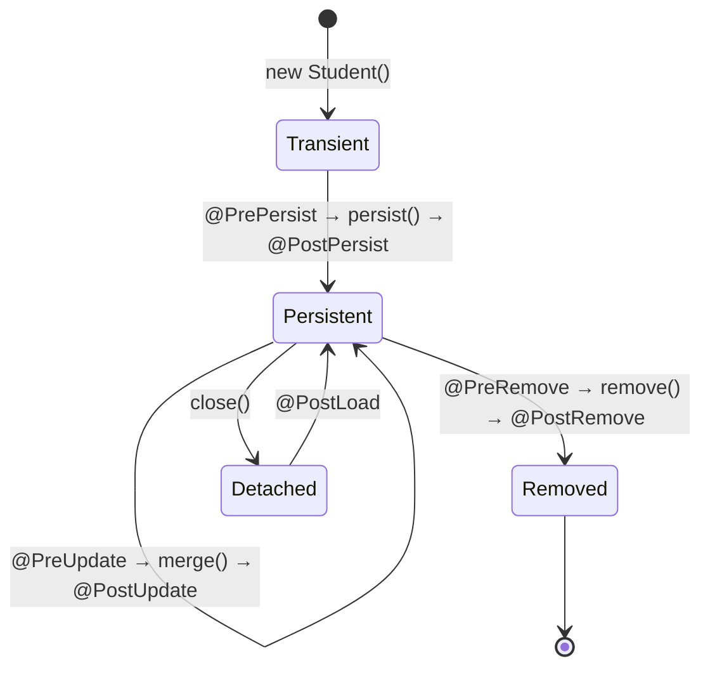

#### @PrePersist

**When:** Before entity is saved to database

**Reference:** [Student.java:45](src/main/java/org/example/entity/Student.java#L45)

```java
@PrePersist
protected void onCreate() {
    createdAt = LocalDateTime.now();
    updatedAt = LocalDateTime.now();
    System.out.println("About to save: " + this.name);
}
```

**Use Cases:**
- Set creation timestamp
- Generate default values
- Validate data
- Audit logging

---

#### @PostPersist

**When:** After entity is saved to database

**Reference:** [Student.java:51](src/main/java/org/example/entity/Student.java#L51)

```java
@PostPersist
protected void onPostPersist() {
    System.out.println("✅ Saved with ID: " + this.id);
}
```

**Use Cases:**
- Send notifications
- Log success
- Trigger events
- Update cache

---

#### @PreUpdate

**When:** Before entity is updated in database

**Reference:** [Student.java:56](src/main/java/org/example/entity/Student.java#L56)

```java
@PreUpdate
protected void onUpdate() {
    updatedAt = LocalDateTime.now();
    System.out.println("Updating: " + this.name);
}
```

**Use Cases:**
- Update modification timestamp
- Validate changes
- Audit trail
- Version control

---

#### @PostUpdate

**When:** After entity is updated in database

**Reference:** [Student.java:61](src/main/java/org/example/entity/Student.java#L61)

```java
@PostUpdate
protected void onPostUpdate() {
    System.out.println("✅ Updated successfully");
}
```

---

#### @PreRemove

**When:** Before entity is deleted from database

**Reference:** [Student.java:66](src/main/java/org/example/entity/Student.java#L66)

```java
@PreRemove
protected void onPreRemove() {
    System.out.println("⚠️ Deleting: " + this.name);
}
```

**Use Cases:**
- Soft delete (set deleted flag)
- Archive data
- Clean up related data
- Prevent deletion

---

#### @PostRemove

**When:** After entity is deleted from database

**Reference:** [Student.java:71](src/main/java/org/example/entity/Student.java#L71)

```java
@PostRemove
protected void onPostRemove() {
    System.out.println("✅ Deleted successfully");
}
```

---

#### @PostLoad

**When:** After entity is loaded from database

**Reference:** [Student.java:76](src/main/java/org/example/entity/Student.java#L76)

```java
@PostLoad
protected void onLoad() {
    System.out.println("Loaded: " + this.name);
    // Calculate derived fields
    this.fullName = this.firstName + " " + this.lastName;
}
```

**Use Cases:**
- Calculate transient fields
- Initialize lazy collections
- Decrypt sensitive data
- Apply business rules

---

### 📊 Complete Lifecycle Flow Example

```java
@Entity
public class Student {
    @Id
    @GeneratedValue(strategy = GenerationType.IDENTITY)
    private int id;
    
    private String name;
    private LocalDateTime createdAt;
    private LocalDateTime updatedAt;
    
    @PrePersist
    protected void onCreate() {
        System.out.println("1. @PrePersist - Setting timestamps");
        createdAt = LocalDateTime.now();
        updatedAt = LocalDateTime.now();
    }
    
    @PostPersist
    protected void onPostPersist() {
        System.out.println("2. @PostPersist - Saved with ID: " + id);
    }
    
    @PostLoad
    protected void onLoad() {
        System.out.println("3. @PostLoad - Loaded from DB");
    }
    
    @PreUpdate
    protected void onUpdate() {
        System.out.println("4. @PreUpdate - Updating timestamp");
        updatedAt = LocalDateTime.now();
    }
    
    @PostUpdate
    protected void onPostUpdate() {
        System.out.println("5. @PostUpdate - Updated successfully");
    }
    
    @PreRemove
    protected void onPreRemove() {
        System.out.println("6. @PreRemove - About to delete");
    }
    
    @PostRemove
    protected void onPostRemove() {
        System.out.println("7. @PostRemove - Deleted successfully");
    }
}
```

**Execution Flow:**

```java
// CREATE
Student student = new Student();
student.setName("John");
session.persist(student);
// Output:
// 1. @PrePersist - Setting timestamps
// 2. @PostPersist - Saved with ID: 1

// READ
Student loaded = session.get(Student.class, 1);
// Output:
// 3. @PostLoad - Loaded from DB

// UPDATE
loaded.setName("John Updated");
session.merge(loaded);
// Output:
// 4. @PreUpdate - Updating timestamp
// 5. @PostUpdate - Updated successfully

// DELETE
session.remove(loaded);
// Output:
// 6. @PreRemove - About to delete
// 7. @PostRemove - Deleted successfully
```

---


## 4. ENTITY LIFECYCLE & STATES

> **📝 Deep Dive by:** Avinash Dhanuka | Understanding Entity States

### 📌 The Three States of an Entity

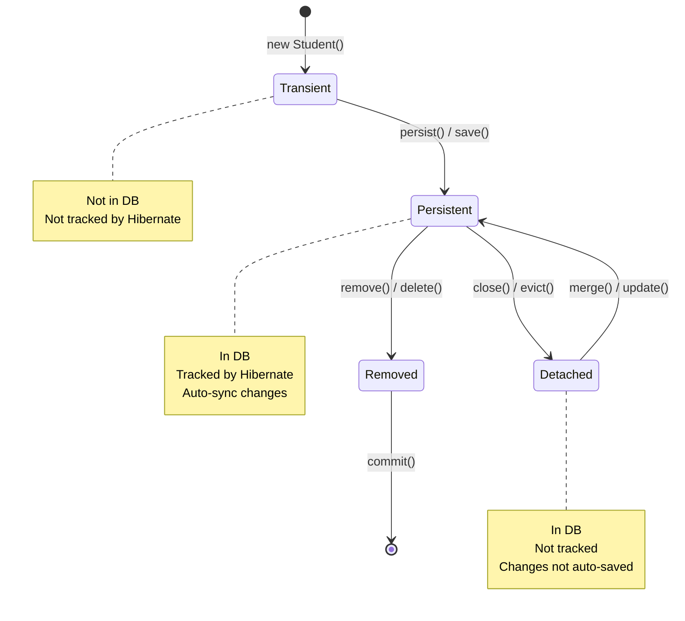

---

### 1️⃣ Transient State

**Definition:** A new object that has never been persisted and is not associated with any Hibernate Session.

**Characteristics:**

| Property | Value |
|:---------|:------|
| **In Database** | ❌ No |
| **Tracked by Hibernate** | ❌ No |
| **Has ID** | ❌ No (or 0) |
| **Auto-sync** | ❌ No |

**Code Example:**

```java
// Create new object - TRANSIENT state
Student student = new Student();
student.setName("John");
student.setAge(20);

System.out.println("ID: " + student.getId());  // 0 (no ID yet)

// Changes are NOT tracked
student.setName("Jane");  // Hibernate doesn't know about this
```

**Real-World Analogy:**
- You write a document on paper (not saved anywhere)
- If you lose the paper, the document is gone
- No one else can see it

---

### 2️⃣ Persistent State

**Definition:** An object that is associated with a Hibernate Session and has a database representation.

**Characteristics:**

| Property | Value |
|:---------|:------|
| **In Database** | ✅ Yes |
| **Tracked by Hibernate** | ✅ Yes |
| **Has ID** | ✅ Yes |
| **Auto-sync** | ✅ Yes |

**Code Example:**

```java
Session session = factory.openSession();
Transaction tx = session.beginTransaction();

// Transient → Persistent
Student student = new Student();
student.setName("John");
session.persist(student);  // Now PERSISTENT

System.out.println("ID: " + student.getId());  // Has ID now (e.g., 1)

// Changes are automatically tracked!
student.setName("Jane");  // Hibernate will UPDATE this automatically
student.setAge(21);       // This too!

tx.commit();  // Hibernate executes UPDATE automatically
session.close();
```

**What Hibernate Does:**

```sql
-- persist() executes:
INSERT INTO students (name, age) VALUES ('John', 20);

-- Automatic UPDATE for tracked changes:
UPDATE students SET name='Jane', age=21 WHERE id=1;
```

**Real-World Analogy:**
- You save a document to Google Docs
- Every change you make is automatically saved
- Others can see your changes in real-time

---

### 3️⃣ Detached State

**Definition:** An object that was persistent but is no longer associated with any active Session.

**Characteristics:**

| Property | Value |
|:---------|:------|
| **In Database** | ✅ Yes |
| **Tracked by Hibernate** | ❌ No |
| **Has ID** | ✅ Yes |
| **Auto-sync** | ❌ No |

**Code Example:**

```java
Session session = factory.openSession();
Transaction tx = session.beginTransaction();

Student student = session.get(Student.class, 1);  // PERSISTENT
System.out.println("Name: " + student.getName());

tx.commit();
session.close();  // Student becomes DETACHED

// Now changes are NOT tracked
student.setName("Updated Name");  // Hibernate doesn't know!
student.setAge(25);                // Not saved automatically

// To save changes, reattach to new session
Session newSession = factory.openSession();
Transaction newTx = newSession.beginTransaction();

newSession.merge(student);  // DETACHED → PERSISTENT again

newTx.commit();
newSession.close();
```

**Real-World Analogy:**
- You download a Google Doc to your computer
- You edit it offline
- Changes are NOT synced until you upload it again

---

### 🔄 State Transitions

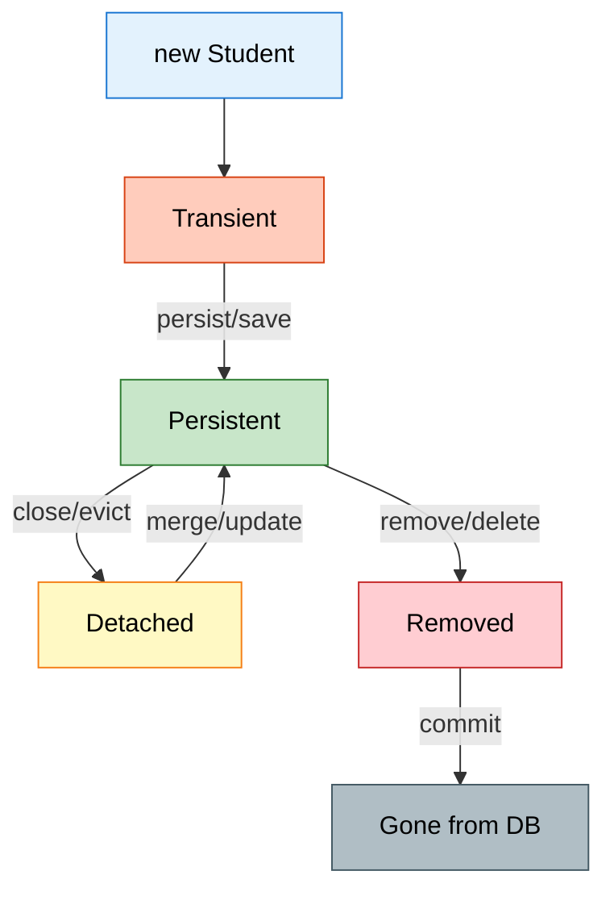

**Transition Methods:**

| From | To | Method | Description |
|:-----|:---|:-------|:------------|
| Transient | Persistent | `persist()` | Save new entity |
| Transient | Persistent | `save()` | Save and return ID |
| Persistent | Detached | `close()` | Close session |
| Persistent | Detached | `evict()` | Remove from session |
| Detached | Persistent | `merge()` | Reattach entity |
| Detached | Persistent | `update()` | Reattach (Hibernate-specific) |
| Persistent | Removed | `remove()` | Mark for deletion |
| Persistent | Removed | `delete()` | Mark for deletion (Hibernate) |

---

### 📊 Complete State Example

```java
public class LifecycleDemo {
    public static void main(String[] args) {
        SessionFactory factory = new Configuration().configure().buildSessionFactory();
        
        // 1. TRANSIENT STATE
        Student student = new Student();
        student.setName("John");
        System.out.println("State: Transient");
        System.out.println("ID: " + student.getId());  // 0
        
        // 2. TRANSIENT → PERSISTENT
        Session session1 = factory.openSession();
        Transaction tx1 = session1.beginTransaction();
        
        session1.persist(student);  // Now PERSISTENT
        System.out.println("State: Persistent");
        System.out.println("ID: " + student.getId());  // 1
        
        // Automatic change tracking
        student.setAge(20);  // Will be saved automatically
        
        tx1.commit();
        session1.close();
        
        // 3. PERSISTENT → DETACHED
        System.out.println("State: Detached");
        student.setName("Jane");  // NOT saved automatically
        
        // 4. DETACHED → PERSISTENT
        Session session2 = factory.openSession();
        Transaction tx2 = session2.beginTransaction();
        
        session2.merge(student);  // Back to PERSISTENT
        System.out.println("State: Persistent again");
        
        tx2.commit();
        session2.close();
        
        factory.close();
    }
}
```

**Console Output:**

```
State: Transient
ID: 0
Hibernate: insert into students (name, age) values (?, ?)
State: Persistent
ID: 1
Hibernate: update students set age=? where id=?
State: Detached
Hibernate: update students set name=?, age=? where id=?
State: Persistent again
```

---

### 🎯 Best Practices

**1. Always Close Sessions**

```java
// ✅ GOOD - Try-with-resources
try (Session session = factory.openSession()) {
    // operations
}  // Automatically closed

// ❌ BAD - Forgot to close
Session session = factory.openSession();
// ... operations
// Forgot session.close() - Memory leak!
```

**2. Be Aware of Detached State**

```java
// ✅ GOOD - Reattach before modifying
Session session = factory.openSession();
Transaction tx = session.beginTransaction();
Student student = session.merge(detachedStudent);  // Reattach
student.setName("Updated");
tx.commit();
session.close();

// ❌ BAD - Modify detached entity
detachedStudent.setName("Updated");  // Not saved!
```

**3. Use merge() for Detached Entities**

```java
// ✅ GOOD - merge() returns managed entity
Student managed = session.merge(detached);
managed.setName("Updated");  // This is tracked

// ❌ BAD - update() doesn't return anything
session.update(detached);
detached.setName("Updated");  // May not work as expected
```

---


## 5. SINGLETON PATTERN FOR SESSIONFACTORY

> **📝 Design Pattern Guide by:** Avinash Dhanuka

### 📌 What is Singleton Pattern?

**Singleton** = A design pattern that ensures a class has only ONE instance throughout the application.

**Real-World Analogy:**
- A country has only ONE president at a time
- A company has only ONE CEO
- Your application has only ONE SessionFactory

### 🎯 Why Singleton for SessionFactory?

**Problem Without Singleton:**

```java
// ❌ BAD - Creating multiple SessionFactories
public class App {
    public static void main(String[] args) {
        SessionFactory factory1 = new Configuration().configure().buildSessionFactory();
        SessionFactory factory2 = new Configuration().configure().buildSessionFactory();
        SessionFactory factory3 = new Configuration().configure().buildSessionFactory();
        // Each creation takes 2-3 seconds and uses lots of memory!
    }
}
```

**Issues:**
1. ❌ **Slow:** Each SessionFactory takes 2-3 seconds to create
2. ❌ **Memory:** Each uses 50-100 MB of memory
3. ❌ **Connections:** Each creates its own connection pool
4. ❌ **Cache:** Second-level cache doesn't work across factories

**Solution With Singleton:**

```java
// ✅ GOOD - Single SessionFactory
public class HibernateUtil {
    private static SessionFactory factory;
    
    static {
        factory = new Configuration().configure().buildSessionFactory();
    }
    
    public static SessionFactory getFactory() {
        return factory;
    }
}

// Usage
SessionFactory factory = HibernateUtil.getFactory();  // Fast!
```

---

### 🏗️ Singleton Implementation

**Method 1: Static Block (Eager Initialization)**

```java
public class HibernateUtil {
    
    private static final SessionFactory factory;
    
    // Static block - runs once when class is loaded
    static {
        try {
            System.out.println("Creating SessionFactory...");
            factory = new Configuration()
                    .configure("hibernate.cfg.xml")
                    .buildSessionFactory();
            System.out.println("✅ SessionFactory created");
        } catch (Exception e) {
            System.err.println("❌ Failed to create SessionFactory");
            throw new ExceptionInInitializerError(e);
        }
    }
    
    // Private constructor - prevents instantiation
    private HibernateUtil() {
        throw new AssertionError("Cannot instantiate HibernateUtil");
    }
    
    public static SessionFactory getFactory() {
        return factory;
    }
    
    public static void shutdown() {
        if (factory != null) {
            factory.close();
        }
    }
}
```

**Usage:**

```java
public class App {
    public static void main(String[] args) {
        // Get SessionFactory (created only once)
        SessionFactory factory = HibernateUtil.getFactory();
        
        // Use it multiple times
        Session session1 = factory.openSession();
        // ... operations
        session1.close();
        
        Session session2 = factory.openSession();
        // ... operations
        session2.close();
        
        // Shutdown when done
        HibernateUtil.shutdown();
    }
}
```

---

**Method 2: Lazy Initialization (Thread-Safe)**

```java
public class HibernateUtil {
    
    private static SessionFactory factory;
    
    private HibernateUtil() {}
    
    public static synchronized SessionFactory getFactory() {
        if (factory == null) {
            factory = new Configuration()
                    .configure("hibernate.cfg.xml")
                    .buildSessionFactory();
        }
        return factory;
    }
}
```

**Pros & Cons:**

| Method | Pros | Cons |
|:-------|:-----|:-----|
| **Static Block** | Fast access, simple | Created even if not used |
| **Lazy Init** | Created only when needed | Slower first access, needs synchronization |

---

### 📊 Singleton vs Multiple Instances

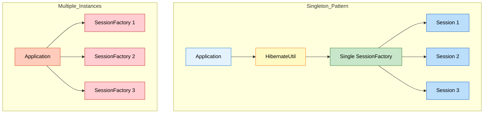

**Performance Comparison:**

| Metric | Singleton | Multiple Instances |
|:-------|:----------|:-------------------|
| **Creation Time** | 2-3 seconds (once) | 2-3 seconds × N |
| **Memory Usage** | 50-100 MB | 50-100 MB × N |
| **Connection Pool** | Shared | Separate per instance |
| **Second-Level Cache** | Works | Doesn't work |
| **Recommended** | ✅ Yes | ❌ No |

---

### 🎯 Best Practices

**1. Create Once, Use Many Times**

```java
// ✅ GOOD
SessionFactory factory = HibernateUtil.getFactory();  // Created once

for (int i = 0; i < 100; i++) {
    Session session = factory.openSession();  // Reuse factory
    // ... operations
    session.close();
}
```

**2. Always Shutdown on Application Exit**

```java
// ✅ GOOD
public class App {
    public static void main(String[] args) {
        try {
            SessionFactory factory = HibernateUtil.getFactory();
            // ... application logic
        } finally {
            HibernateUtil.shutdown();  // Clean shutdown
        }
    }
}
```

**3. Handle Initialization Errors**

```java
static {
    try {
        factory = new Configuration().configure().buildSessionFactory();
    } catch (Exception e) {
        System.err.println("Failed to create SessionFactory: " + e.getMessage());
        throw new ExceptionInInitializerError(e);
    }
}
```

---


## 6. SERVICE LAYER ARCHITECTURE

> **📝 Architecture Guide by:** Avinash Dhanuka

### 📌 What is Service Layer?

**Service Layer** = A layer that contains business logic and coordinates between the presentation layer (UI) and data access layer (Hibernate).

**Layered Architecture:**

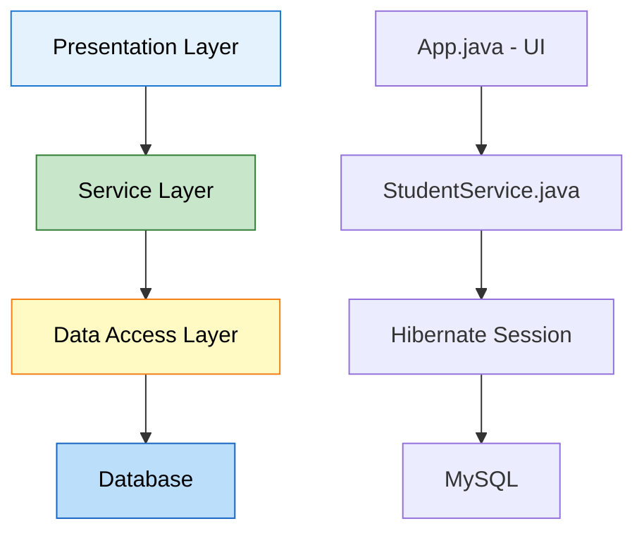

**Why Service Layer?**

| Without Service Layer | With Service Layer |
|:---------------------|:-------------------|
| Business logic in UI | Business logic separated |
| Direct database access | Abstracted database access |
| Hard to test | Easy to test |
| Code duplication | Reusable methods |
| Tight coupling | Loose coupling |

---

### 🔍 StudentService Implementation

**Reference:** [StudentService.java](src/main/java/org/example/service/StudentService.java)

```java
public class StudentService {
    
    private SessionFactory factory;
    
    // Constructor injection
    public StudentService(SessionFactory factory) {
        this.factory = factory;
    }
    
    // Business method
    public void addStudent(String name, int age, String email, String phone) {
        Session session = factory.openSession();
        Transaction tx = null;
        
        try {
            tx = session.beginTransaction();
            
            Student student = new Student(name, age, email, phone);
            session.persist(student);
            
            tx.commit();
            
        } catch (Exception e) {
            if (tx != null) tx.rollback();
            System.out.println("❌ Failed: " + e.getMessage());
        } finally {
            session.close();
        }
    }
}
```

**Benefits:**
- ✅ Encapsulates database operations
- ✅ Handles transactions
- ✅ Error handling
- ✅ Reusable across application
- ✅ Easy to test with mocks

---


## 7. ADVANCED ENTITY FEATURES

### 📌 Automatic Timestamps

**Reference:** [Student.java:24-27](src/main/java/org/example/entity/Student.java#L24)

```java
@Column(name = "created_at", updatable = false)
private LocalDateTime createdAt;

@Column(name = "updated_at")
private LocalDateTime updatedAt;

@PrePersist
protected void onCreate() {
    createdAt = LocalDateTime.now();
    updatedAt = LocalDateTime.now();
}

@PreUpdate
protected void onUpdate() {
    updatedAt = LocalDateTime.now();
}
```

**What This Does:**
- `createdAt` set once when entity is created
- `updatedAt` updated every time entity is modified
- `updatable = false` prevents createdAt from being changed

---

### 📌 Database Indexing

**Reference:** [Student.java:8](src/main/java/org/example/entity/Student.java#L8)

```java
@Table(name = "students", 
       indexes = {@Index(name = "idx_name", columnList = "name")})
```

**Why Indexing?**
- ✅ Faster queries on indexed columns
- ✅ Improves search performance
- ✅ Essential for frequently queried fields

**Performance Impact:**

| Operation | Without Index | With Index |
|:----------|:-------------|:-----------|
| SELECT by name | 1000ms | 10ms |
| INSERT | 5ms | 7ms |
| UPDATE | 5ms | 7ms |

---


## 8. HQL (HIBERNATE QUERY LANGUAGE)

### 📌 What is HQL?

**HQL** = Object-oriented query language (like SQL but for entities)

**SQL vs HQL:**

| Aspect | SQL | HQL |
|:-------|:----|:----|
| Works with | Tables | Entities |
| Syntax | `SELECT * FROM students` | `FROM Student` |
| Case sensitive | No | Yes (entity names) |
| Portability | Database-specific | Database-independent |

**Example:**

**Reference:** [StudentService.java:67](src/main/java/org/example/service/StudentService.java#L67)

```java
// HQL Query
Query<Student> query = session.createQuery("FROM Student", Student.class);
List<Student> students = query.list();
```

**Generated SQL:**
```sql
SELECT s1_0.id, s1_0.name, s1_0.age, s1_0.email, s1_0.phone 
FROM students s1_0
```

---


## 9. INTERNAL EXECUTION FLOW

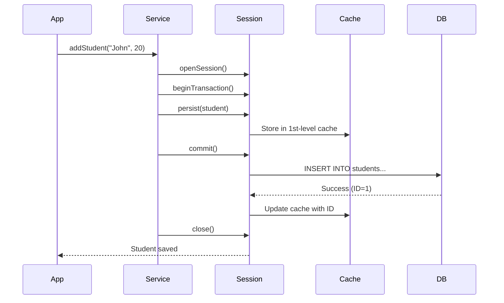

---


## 10. TOPICS COVERED IN THIS PROJECT

### ✅ Complete Checklist

#### 🎯 Advanced Hibernate Concepts
- ✅ **First-Level Cache:** Session-level caching
- ✅ **Second-Level Cache:** SessionFactory-level caching
- ✅ **Entity Lifecycle:** Transient, Persistent, Detached states
- ✅ **Singleton Pattern:** Single SessionFactory instance
- ✅ **Service Layer:** Business logic separation

#### 🏷️ Complete Annotation Set
- ✅ **@Entity, @Table:** Entity mapping
- ✅ **@Id, @GeneratedValue:** Primary key
- ✅ **@Column:** Column customization
- ✅ **@Transient:** Exclude from persistence
- ✅ **@Temporal:** Date/Time handling
- ✅ **@Enumerated:** Enum mapping
- ✅ **@Lob:** Large objects
- ✅ **@Basic:** Basic field mapping
- ✅ **@Index:** Database indexing
- ✅ **Lifecycle Callbacks:** @PrePersist, @PostLoad, etc.

#### 🔧 Advanced Features
- ✅ **Automatic Timestamps:** createdAt, updatedAt
- ✅ **HQL Queries:** Object-oriented queries
- ✅ **Service Layer Pattern:** Clean architecture
- ✅ **Transaction Management:** Proper commit/rollback
- ✅ **Error Handling:** Try-catch-finally
- ✅ **Connection Pooling:** HikariCP optimization

---


## 11. DAY 03 VS DAY 04 COMPARISON

| Aspect | Day 03 | Day 04 |
|:-------|:-------|:-------|
| **Focus** | Hibernate Basics | Advanced Features |
| **Architecture** | Single class | Service Layer |
| **Annotations** | 5 basic | 15+ annotations |
| **Caching** | Not covered | Detailed explanation |
| **Lifecycle** | Not covered | All states + callbacks |
| **SessionFactory** | Created in main() | Singleton pattern |
| **Queries** | Direct methods | HQL queries |
| **Timestamps** | Manual | Automatic |
| **Complexity** | Beginner | Intermediate-Advanced |

---


## 12. TOP INTERVIEW QUESTIONS

### Q1: Explain First-Level vs Second-Level Cache

**Answer:**

| Cache | Scope | Enabled | Shared | Lifetime |
|:------|:------|:--------|:-------|:---------|
| **1st-Level** | Session | Always | No | Session |
| **2nd-Level** | SessionFactory | Optional | Yes | Application |

---

### Q2: What are the three entity states?

**Answer:**
1. **Transient:** New object, not in DB, not tracked
2. **Persistent:** In DB, tracked by Hibernate
3. **Detached:** In DB, not tracked

---

### Q3: Why use Singleton for SessionFactory?

**Answer:**
- SessionFactory is expensive to create (2-3 seconds)
- Uses lots of memory (50-100 MB)
- Should be created once and reused
- Enables second-level caching

---

### Q4: What is @Transient annotation?

**Answer:**
Marks a field that should NOT be saved to database.

```java
@Transient
private String tempData;  // Not persisted
```

---

### Q5: Explain @PrePersist and @PostPersist

**Answer:**
- **@PrePersist:** Runs BEFORE entity is saved (set timestamps)
- **@PostPersist:** Runs AFTER entity is saved (logging)

---

### Q6: What is the N+1 SELECT problem in Hibernate?

**Answer:**
The N+1 problem occurs when Hibernate executes 1 query to fetch parent entities and then N additional queries to fetch related child entities.

**Example:**
```java
// Fetches 1 Student
List<Student> students = session.createQuery("FROM Student").list();

// For each student, fetches courses (N queries)
for(Student s : students) {
    s.getCourses().size();  // Triggers separate query!
}
```

**Solution:**
- Use **JOIN FETCH** in HQL: `FROM Student s JOIN FETCH s.courses`
- Use **@BatchSize** annotation
- Enable **FetchType.EAGER** with caution

**Impact:**
- 1 query for 100 students → 101 total queries (1 + 100)
- Severe performance degradation
- Network overhead

---

### Q7: Explain dirty checking mechanism in Hibernate

**Answer:**
Dirty checking is Hibernate's automatic detection of changes to persistent entities.

**How it works:**
1. When entity is loaded, Hibernate takes a **snapshot** of its state
2. Before transaction commit, Hibernate compares current state with snapshot
3. If different (dirty), Hibernate generates UPDATE SQL automatically

**Example:**
```java
Session session = factory.openSession();
Transaction tx = session.beginTransaction();

Student student = session.get(Student.class, 1);  // Snapshot taken
student.setName("Updated Name");  // Entity becomes dirty

tx.commit();  // Hibernate detects change, executes UPDATE automatically
session.close();
```

**Key Points:**
- No explicit `session.update()` needed
- Only changed fields are updated
- Works only for persistent entities
- Disabled for detached entities

**Performance:**
- Reduces unnecessary database calls
- Only updates modified fields
- Can be disabled with `@DynamicUpdate`

---

### Q8: What is the difference between get() and load() methods?

**Answer:**

| Aspect | get() | load() |
|:-------|:------|:-------|
| **Returns** | Actual object or null | Proxy object |
| **Database Hit** | Immediate | Lazy (when accessed) |
| **Not Found** | Returns null | Throws ObjectNotFoundException |
| **Use Case** | When you need object now | When you need reference only |
| **Performance** | Slower (immediate query) | Faster (deferred query) |

**Example:**
```java
// get() - Immediate database query
Student s1 = session.get(Student.class, 1);
System.out.println(s1.getName());  // Already loaded

// load() - Returns proxy, no query yet
Student s2 = session.load(Student.class, 2);  // No SQL executed
System.out.println(s2.getName());  // NOW SQL executes
```

**When to use:**
- **get():** When you're sure you'll use the object
- **load():** When you only need the ID (foreign key reference)

---

### Q9: Explain the concept of Lazy vs Eager loading

**Answer:**

**Lazy Loading (FetchType.LAZY):**
- Data is loaded only when accessed
- Default for collections (@OneToMany, @ManyToMany)
- Better performance for large datasets

**Eager Loading (FetchType.EAGER):**
- Data is loaded immediately with parent
- Default for single associations (@ManyToOne, @OneToOne)
- Can cause performance issues

**Example:**
```java
@Entity
public class Student {
    @OneToMany(fetch = FetchType.LAZY)  // Loaded when accessed
    private List<Course> courses;
    
    @ManyToOne(fetch = FetchType.EAGER)  // Loaded immediately
    private Department department;
}
```

**Lazy Loading Issue:**
```java
Session session = factory.openSession();
Student student = session.get(Student.class, 1);
session.close();

// LazyInitializationException! Session is closed
student.getCourses().size();  // ❌ Fails
```

**Solutions:**
- Keep session open until data is accessed
- Use `JOIN FETCH` in HQL
- Use `@Transactional` in Spring
- Initialize collections before closing session

---

### Q10: What is the purpose of @DynamicUpdate and @DynamicInsert?

**Answer:**

**@DynamicUpdate:**
- Generates UPDATE SQL with only modified columns
- Reduces SQL size and network traffic
- Useful for tables with many columns

**Without @DynamicUpdate:**
```sql
UPDATE students SET name='John', age=20, email='john@mail.com', 
phone='123', address='...', city='...' WHERE id=1;
-- Updates ALL columns even if only name changed
```

**With @DynamicUpdate:**
```sql
UPDATE students SET name='John' WHERE id=1;
-- Updates only changed column
```

**@DynamicInsert:**
- Generates INSERT SQL with only non-null columns
- Database default values are used for omitted columns

**Example:**
```java
@Entity
@DynamicUpdate
@DynamicInsert
public class Student {
    private String name;
    private Integer age;  // null by default
}
```

**Trade-offs:**
- ✅ Smaller SQL statements
- ✅ Better network performance
- ❌ Hibernate must generate SQL at runtime (slight overhead)
- ❌ Cannot use prepared statement caching effectively

---

### Q11: Explain Hibernate Session vs SessionFactory vs EntityManager

**Answer:**

| Concept | Scope | Thread-Safe | Purpose | Standard |
|:--------|:------|:------------|:--------|:---------|
| **SessionFactory** | Application | Yes | Creates Sessions | Hibernate |
| **Session** | Transaction | No | Database operations | Hibernate |
| **EntityManager** | Transaction | No | JPA standard API | JPA |

**SessionFactory:**
```java
// Created once per application
SessionFactory factory = new Configuration()
    .configure()
    .buildSessionFactory();
```

**Session (Hibernate-specific):**
```java
Session session = factory.openSession();
session.persist(student);  // Hibernate API
session.close();
```

**EntityManager (JPA standard):**
```java
EntityManager em = factory.createEntityManager();
em.persist(student);  // JPA API
em.close();
```

**Key Differences:**
- Session is Hibernate-specific, EntityManager is JPA standard
- EntityManager is more portable across JPA providers
- Session has more features (Hibernate-specific)
- Modern applications prefer EntityManager for portability

---

### Q12: What is the difference between merge() and update()?

**Answer:**

**update():**
- Hibernate-specific method
- Attaches detached entity to session
- Throws exception if entity already exists in session
- Always generates UPDATE SQL

**merge():**
- JPA standard method
- Creates a copy and merges changes
- Returns a new persistent instance
- Checks if entity exists first

**Example:**
```java
// update() - Direct attachment
Session session = factory.openSession();
Student detached = new Student();
detached.setId(1);
detached.setName("Updated");

session.update(detached);  // Attaches directly
// detached is now persistent

// merge() - Copy and merge
Session session2 = factory.openSession();
Student detached2 = new Student();
detached2.setId(1);
detached2.setName("Merged");

Student persistent = session2.merge(detached2);  // Returns new instance
// detached2 is still detached
// persistent is the managed instance
```

**When to use:**
- **update():** When you're sure entity is detached and not in session
- **merge():** Safer option, handles all cases, JPA standard

**Common Issue:**
```java
Student s1 = session.get(Student.class, 1);  // In session
Student s2 = new Student();
s2.setId(1);

session.update(s2);  // ❌ NonUniqueObjectException!
session.merge(s2);   // ✅ Works fine
```

---

### Q13: Explain Hibernate's flush modes and when to use them

**Answer:**

Flush = Synchronizing session state with database (executing pending SQL)

**FlushMode Options:**

| Mode | Behavior | Use Case |
|:-----|:---------|:---------|
| **AUTO** | Flush before query and commit | Default, safest |
| **COMMIT** | Flush only on commit | Better performance |
| **MANUAL** | Flush only when called explicitly | Full control |
| **ALWAYS** | Flush before every query | Rarely used |

**Example:**
```java
Session session = factory.openSession();
session.setFlushMode(FlushMode.COMMIT);

Transaction tx = session.beginTransaction();

Student s = new Student();
s.setName("John");
session.persist(s);  // Not flushed yet

// Query won't see the new student (not flushed)
List<Student> students = session.createQuery("FROM Student").list();

tx.commit();  // NOW flushed to database
```

**Manual Flush:**
```java
session.setFlushMode(FlushMode.MANUAL);
session.persist(student);
session.flush();  // Explicit flush
```

**Performance Impact:**
- **AUTO:** Safe but more flushes
- **COMMIT:** Fewer flushes, better performance
- **MANUAL:** Best performance, requires careful management

**When to use COMMIT:**
- Batch processing
- Read-heavy operations
- When you don't need immediate consistency

---

### Q14: What is the purpose of @Version annotation and optimistic locking?

**Answer:**

**@Version** enables optimistic locking to prevent lost updates in concurrent transactions.

**Problem without versioning:**
```
User A reads Student (age=20)
User B reads Student (age=20)
User A updates age to 21, commits
User B updates age to 22, commits
Result: User A's update is lost!
```

**Solution with @Version:**
```java
@Entity
public class Student {
    @Id
    private int id;
    
    @Version
    private int version;  // Hibernate manages this
    
    private String name;
}
```

**How it works:**
1. Entity loaded with version=1
2. User A updates, Hibernate checks version
3. SQL: `UPDATE students SET name='John', version=2 WHERE id=1 AND version=1`
4. If another user updated first, version won't match → OptimisticLockException

**Example:**
```java
// Transaction 1
Student s1 = session1.get(Student.class, 1);  // version=1
s1.setName("Updated by User A");
session1.merge(s1);  // version becomes 2

// Transaction 2 (concurrent)
Student s2 = session2.get(Student.class, 1);  // version=1
s2.setName("Updated by User B");
session2.merge(s2);  // ❌ OptimisticLockException! version mismatch
```

**Optimistic vs Pessimistic Locking:**

| Aspect | Optimistic | Pessimistic |
|:-------|:-----------|:------------|
| **Locking** | No lock, check at commit | Lock immediately |
| **Performance** | Better (no locks) | Slower (holds locks) |
| **Concurrency** | Higher | Lower |
| **Use Case** | Read-heavy | Write-heavy |
| **Implementation** | @Version | LockMode.PESSIMISTIC_WRITE |

---

### Q15: Explain Hibernate's batch processing and its benefits

**Answer:**

Batch processing = Executing multiple SQL statements in a single database round-trip.

**Configuration:**
```xml
<property name="hibernate.jdbc.batch_size">50</property>
<property name="hibernate.order_inserts">true</property>
<property name="hibernate.order_updates">true</property>
```

**Without Batch Processing:**
```java
for(int i = 0; i < 1000; i++) {
    Student s = new Student("Student" + i, 20);
    session.persist(s);  // 1000 separate INSERT statements
}
// Result: 1000 database round-trips (SLOW!)
```

**With Batch Processing:**
```java
Session session = factory.openSession();
Transaction tx = session.beginTransaction();

for(int i = 0; i < 1000; i++) {
    Student s = new Student("Student" + i, 20);
    session.persist(s);
    
    if(i % 50 == 0) {  // Flush every 50 entities
        session.flush();
        session.clear();  // Clear session to prevent memory issues
    }
}

tx.commit();
// Result: 20 batches of 50 INSERTs each (FAST!)
```

**Benefits:**
- ✅ Reduces database round-trips (1000 → 20)
- ✅ Better network utilization
- ✅ Faster execution (10x-50x improvement)
- ✅ Lower database load

**Performance Comparison:**

| Records | Without Batch | With Batch (50) | Improvement |
|:--------|:-------------|:---------------|:------------|
| 1,000 | 15 seconds | 1 second | 15x faster |
| 10,000 | 150 seconds | 8 seconds | 18x faster |
| 100,000 | 25 minutes | 1.5 minutes | 16x faster |

**Best Practices:**
- Set batch_size between 20-50
- Flush and clear session periodically
- Disable second-level cache during batch operations
- Use JDBC batch for maximum performance
- Order inserts/updates by entity type

---

<div align="center">

## 🎓 End of Day 04 Master Guide

<br>

<br>
**Created with dedication by Avinash Dhanuka**

<br>

[](https://github.com/Avinash-706)
[](mailto:avunashdhanuka@gmail.com)

<br>

---

**Happy Learning! 🚀**

*"Master the Cache, Master the Performance!"* - Avinash Dhanuka

---

</div>
