# ☕ Day 05: Hibernate One-to-One Relationship

<div align="center">


</div>

<hr style="border: 1px solid rgb(98, 117, 187)">

<div align="center">
<table>
<tr>
<td align="center">
<br />

<h3>© 2026 Avinash Dhanuka</h3>
<p>Day 05: Mastering One-to-One Relationships in Hibernate</p>
<p><em>Crafted with ❤️ for Understanding Entity Relationships</em></p>

<a href="https://github.com/Avinash-706" target="_blank">

</a>
<br />
<a href="https://mail.google.com/mail/?view=cm&fs=1&to=avunashdhanuka@gmail.com&su=Hibernate%20Relationships%20Query&body=☕%20Hello%20Avinash,%0D%0A%0D%0AMy%20name%20is%20[Your%20Name]%20and%20I%20have%20a%20doubt%20regarding%20Hibernate%20Relationships.%0D%0A%0D%0A🔹%20Topic:%20[Hibernate/Relationships]%0D%0A%0D%0AThank%20you!" target="_blank">

</a>
<br />
<br />
</td>
</tr>
</table>
</div>

> **Learning Note:** This guide builds upon Day 04 (Advanced Hibernate) by introducing One-to-One entity relationships. Learn how to map real-world relationships between entities using Hibernate!

> **Prerequisites:** 
> - Complete understanding of [Day 03 - Hibernate Basics](../../day03/HibernateDemo/README.md)
> - Complete understanding of [Day 04 - Advanced Hibernate](../../day04/HibernateCore/README.md)
> - MySQL Server installed and running

---

## 📑 Table of Contents
1. [What's New in Day 05?](#1-whats-new-in-day-05)
2. [Database Relationships Overview](#2-database-relationships-overview)
3. [One-to-One Relationship (Deep Dive)](#3-one-to-one-relationship-deep-dive)
4. [Project Structure](#4-project-structure)
5. [Entity Classes Explained](#5-entity-classes-explained)
6. [Key Annotations](#6-key-annotations)
7. [Bidirectional Relationship](#7-bidirectional-relationship)
8. [Cascade Operations](#8-cascade-operations)
9. [Fetch Types: LAZY vs EAGER](#9-fetch-types-lazy-vs-eager)
10. [ID Generation Strategies](#10-id-generation-strategies)
11. [Lifecycle Callbacks (@PrePersist)](#11-lifecycle-callbacks-prepersist)
12. [CRUD Operations](#12-crud-operations)
13. [Running the Application](#13-running-the-application)
14. [What I Learned](#14-what-i-learned)
15. [Interview Questions](#15-interview-questions)

---

## 1. WHAT'S NEW IN DAY 05?

> **📝 Author:** Avinash Dhanuka | [GitHub](https://github.com/Avinash-706)

### 🎯 Evolution from Day 04

In Day 04, we worked with single entities (Student). Now in Day 05, we're learning how to connect multiple entities together!

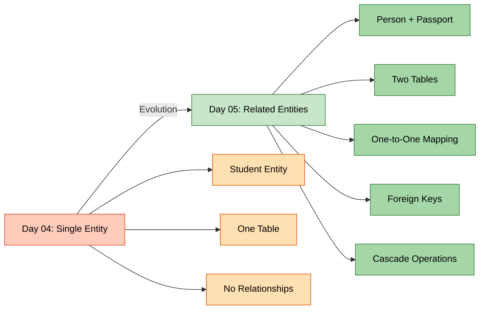

**Day 04:**
- Single entity (Student)
- One table
- No relationships

**Day 05:**
- Multiple entities (Person + Passport)
- Two related tables
- One-to-One relationship
- Foreign keys
- Cascade operations

### 📊 What We Built

A **Person-Passport Management System** where:
- One Person has exactly One Passport
- One Passport belongs to exactly One Person
- Deleting a Person automatically deletes their Passport
- Passport number is auto-generated
- Can search by passport number and find the person

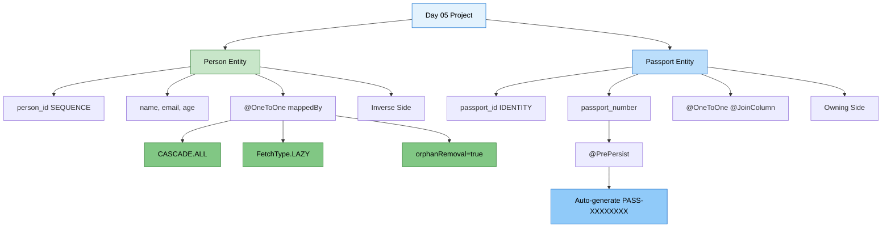

---

<div align="center">

**📚 Learning Path Progress**

Day 01 (JUnit) → Day 02 (Mockito) → Day 03 (Hibernate Basics) → Day 04 (Advanced Hibernate) → **Day 05 (Relationships)** ✅

*Created by Avinash Dhanuka | © 2026*

</div>

---

## 2. DATABASE RELATIONSHIPS OVERVIEW

> **�  Comprehensive Guide by:** Avinash Dhanuka | © 2026

### 📌 What are Database Relationships?

**Relationships** = Connections between tables that represent how data relates to each other.

### 🔍 Types of Relationships (Brief Overview)

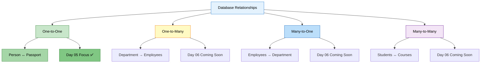


| Relationship | Description | Example | Day 05 Coverage |
|:-------------|:------------|:--------|:----------------|
| **One-to-One** | One entity ↔ One entity | Person ↔ Passport | ✅ **Detailed** |
| **One-to-Many** | One entity → Many entities | Department → Employees | ⏭️ Day 06 |
| **Many-to-One** | Many entities → One entity | Employees → Department | ⏭️ Day 06 |
| **Many-to-Many** | Many entities ↔ Many entities | Students ↔ Courses | ⏭️ Day 06 |

**Note:** Day 05 focuses ONLY on One-to-One relationships. Other relationships will be covered in Day 06.

### 🎯 Real-World One-to-One Examples

- 🧑 Person ↔ 🛂 Passport (Our Project)
- 👤 User ↔ 👤 Profile
- 🏠 House ↔ 🚪 Main Door
- 💳 Person ↔ 💳 Social Security Number
- 🚗 Vehicle ↔ 📄 Registration

---

## 3. ONE-TO-ONE RELATIONSHIP (DEEP DIVE)

> **� WDeep Dive by:** Avinash Dhanuka | Understanding One-to-One Mapping

### 📌 What is One-to-One?

**One-to-One** = Each record in Table A is associated with exactly ONE record in Table B, and vice versa.

### 🏗️ Database Structure

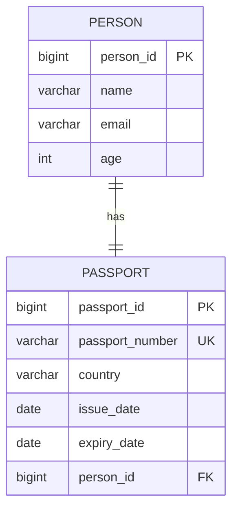

```
┌─────────────────┐              ┌──────────────────┐
│     PERSON      │              │     PASSPORT     │
├─────────────────┤              ├──────────────────┤
│ person_id (PK)  │◄─────────────│ passport_id (PK) │
│ name            │              │ passport_number  │
│ email           │              │ country          │
│ age             │              │ issue_date       │
└─────────────────┘              │ expiry_date      │
                                 │ person_id (FK)   │
                                 └──────────────────┘
```

**Key Points:**
- `PERSON` table has NO foreign key
- `PASSPORT` table has `person_id` as foreign key
- `person_id` in PASSPORT must be UNIQUE (ensures 1-to-1)
- PASSPORT is the "owning side" (has the FK)
- PERSON is the "inverse side" (referenced by FK)


### 📊 SQL Tables Created by Hibernate

```sql
-- Person table (no foreign key)
CREATE TABLE person (
    person_id BIGINT PRIMARY KEY,
    name VARCHAR(100) NOT NULL,
    email VARCHAR(100) UNIQUE,
    age INT
);

-- Passport table (has foreign key to person)
CREATE TABLE passport (
    passport_id BIGINT AUTO_INCREMENT PRIMARY KEY,
    passport_number VARCHAR(50) UNIQUE NOT NULL,
    country VARCHAR(100) NOT NULL,
    issue_date DATE,
    expiry_date DATE,
    person_id BIGINT UNIQUE NOT NULL,
    FOREIGN KEY (person_id) REFERENCES person(person_id)
);

-- Sequence for person_id generation
CREATE SEQUENCE person_sequence START WITH 1 INCREMENT BY 1;
```

---

## 4. PROJECT STRUCTURE

> **📝 Project Architecture by:** Avinash Dhanuka | © 2026

<div align="center">

---


© 2026 Avinash Dhanuka. All Rights Reserved.
 [avunashdhanuka@gmail.com](mailto:avunashdhanuka@gmail.com)

---

</div>

```
HibernateRelationships/
├── src/
│   ├── main/
│   │   ├── java/
│   │   │   └── org/example/
│   │   │       ├── entity/
│   │   │       │   ├── Person.java          ← Person entity (inverse side)
│   │   │       │   └── Passport.java        ← Passport entity (owning side)
│   │   │       ├── util/
│   │   │       │   └── HibernateUtil.java   ← SessionFactory singleton
│   │   │       └── App.java                 ← Main application with CRUD
│   │   └── resources/
│   │       └── hibernate.cfg.xml            ← Hibernate configuration
├── pom.xml                                  ← Maven dependencies
├── database_setup.sql                       ← Database creation script
└── README.md                                ← This file
```

---

## 5. ENTITY CLASSES EXPLAINED

### 👤 Person Entity (Inverse Side)

**File:** `src/main/java/org/example/entity/Person.java`

```java
@Entity
@Table(name = "person")
public class Person {
    
    @Id
    @GeneratedValue(strategy = GenerationType.SEQUENCE, generator = "person_seq")
    @SequenceGenerator(name = "person_seq", sequenceName = "person_sequence", 
                       initialValue = 1, allocationSize = 1)
    @Column(name = "person_id")
    private Long personId;
    
    @Column(name = "name", nullable = false, length = 100)
    private String name;
    
    @Column(name = "email", unique = true, length = 100)
    private String email;
    
    @Column(name = "age")
    private Integer age;
    
    // One-to-One relationship (inverse side)
    @OneToOne(mappedBy = "person", cascade = CascadeType.ALL, 
              fetch = FetchType.LAZY, orphanRemoval = true)
    private Passport passport;
    
    // Constructors, getters, setters...
}
```


**Key Points:**
- Uses `@SequenceGenerator` for ID generation
- `mappedBy = "person"` indicates this is the inverse side
- `cascade = CascadeType.ALL` means all operations cascade to Passport
- `fetch = FetchType.LAZY` means Passport loads only when accessed
- `orphanRemoval = true` deletes Passport if unlinked from Person

### 🛂 Passport Entity (Owning Side)

**File:** `src/main/java/org/example/entity/Passport.java`

```java
@Entity
@Table(name = "passport")
public class Passport {
    
    @Id
    @GeneratedValue(strategy = GenerationType.IDENTITY)
    @Column(name = "passport_id")
    private Long passportId;
    
    @Column(name = "passport_number", unique = true, nullable = false, length = 50)
    private String passportNumber;
    
    @Column(name = "country", nullable = false, length = 100)
    private String country;
    
    @Column(name = "issue_date")
    private LocalDate issueDate;
    
    @Column(name = "expiry_date")
    private LocalDate expiryDate;
    
    // One-to-One relationship (owning side)
    @OneToOne(fetch = FetchType.LAZY)
    @JoinColumn(name = "person_id", unique = true, nullable = false)
    private Person person;
    
    // Auto-generate passport number before saving
    @PrePersist
    public void generatePassportNumber() {
        if (this.passportNumber == null) {
            this.passportNumber = "PASS-" + 
                UUID.randomUUID().toString().substring(0, 8).toUpperCase();
        }
    }
    
    // Constructors, getters, setters...
}
```

**Key Points:**
- Uses `@GeneratedValue(strategy = IDENTITY)` for ID
- `@JoinColumn(name = "person_id")` creates the foreign key column
- `unique = true` ensures one-to-one relationship
- `@PrePersist` auto-generates passport number before saving
- This is the "owning side" because it has the foreign key

---

## 6. KEY ANNOTATIONS

### 📌 Relationship Annotations

| Annotation | Purpose | Used In | Example |
|:-----------|:--------|:--------|:--------|
| **@OneToOne** | Defines 1-to-1 relationship | Both entities | `@OneToOne` |
| **@JoinColumn** | Specifies FK column | Owning side (Passport) | `@JoinColumn(name = "person_id")` |
| **mappedBy** | Defines inverse side | Inverse side (Person) | `mappedBy = "person"` |


### 📌 Cascade Types

| Cascade Type | What It Does | Example |
|:-------------|:-------------|:--------|
| **CascadeType.ALL** | All operations cascade | Save Person → Save Passport |
| **CascadeType.PERSIST** | Only save cascades | `session.save(person)` saves passport |
| **CascadeType.MERGE** | Only update cascades | `session.update(person)` updates passport |
| **CascadeType.REMOVE** | Only delete cascades | `session.delete(person)` deletes passport |

**Our Project Uses:** `CascadeType.ALL` - All operations cascade from Person to Passport

### 📌 Fetch Types

| Fetch Type | When Data Loads | Performance | Use Case |
|:-----------|:---------------|:------------|:---------|
| **FetchType.LAZY** | When accessed | Better | Load only when needed |
| **FetchType.EAGER** | Immediately | Slower | Always need the data |

**Our Project Uses:** `FetchType.LAZY` - Better performance, loads Passport only when accessed

### 📌 ID Generation Strategies

| Strategy | How It Works | Used In | Database Support |
|:---------|:------------|:--------|:-----------------|
| **SEQUENCE** | Database sequence | Person | Oracle, PostgreSQL, MySQL 8+ |
| **IDENTITY** | AUTO_INCREMENT | Passport | MySQL, SQL Server |

---

## 7. BIDIRECTIONAL RELATIONSHIP

> **� Navigiation Guide by:** Avinash Dhanuka | © 2026

### 📌 What is Bidirectional?

**Bidirectional** = You can navigate from Person to Passport AND from Passport to Person.

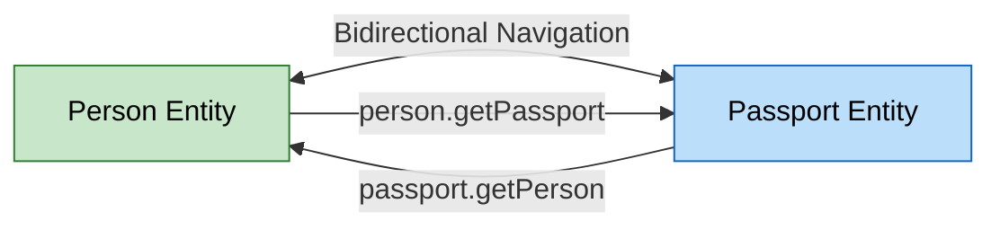

```java
// Navigate from Person to Passport
Person person = session.get(Person.class, 1L);
Passport passport = person.getPassport();  // ✅ Works!

// Navigate from Passport to Person
Passport passport = session.get(Passport.class, 1L);
Person person = passport.getPerson();  // ✅ Also works!
```

### 🔄 Synchronization

**Important:** When setting relationships, both sides must be synchronized!

```java
// ✅ CORRECT: Person.setPassport() synchronizes both sides
public void setPassport(Passport passport) {
    this.passport = passport;
    if (passport != null) {
        passport.setPerson(this);  // Sync both sides
    }
}
```

### 📊 Owning Side vs Inverse Side

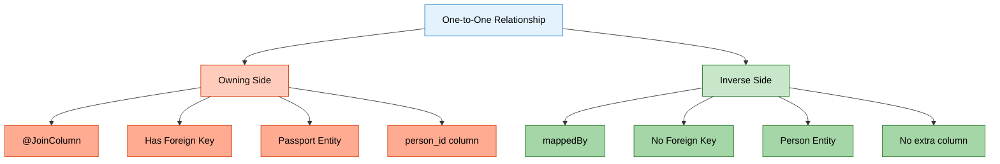

| Aspect | Owning Side (Passport) | Inverse Side (Person) |
|:-------|:----------------------|:---------------------|
| **Annotation** | `@JoinColumn` | `mappedBy` |
| **Foreign Key** | ✅ Has FK column | ❌ No FK |
| **Database Column** | `person_id` exists | No extra column |
| **Responsibility** | Manages relationship | Just references it |

---

## 8. CASCADE OPERATIONS

<div align="center">

---

**📝 AUTHOR SIGNATURE**

This comprehensive guide is created by **Avinash Dhanuka**

© 2026 | All Rights Reserved

[](https://github.com/Avinash-706)

---

</div>

> **📝 Cascade Guide by:** Avinash Dhanuka | Understanding Operation Propagation

### 📌 What is Cascade?

**Cascade** = Automatically propagating operations from parent (Person) to child (Passport).

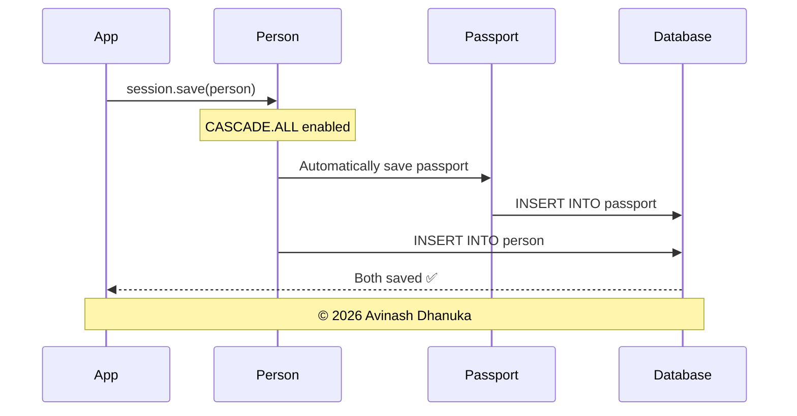


### 🔄 How CASCADE.ALL Works

```java
// WITHOUT CASCADE - Must save both manually
Person person = new Person("John", "john@email.com", 30);
Passport passport = new Passport("USA", issueDate, expiryDate);
person.setPassport(passport);

session.save(person);    // Save person
session.save(passport);  // Must save passport separately ❌

// WITH CASCADE.ALL - Automatic!
Person person = new Person("John", "john@email.com", 30);
Passport passport = new Passport("USA", issueDate, expiryDate);
person.setPassport(passport);

session.save(person);  // Passport saved automatically! ✅
```

### 📊 Cascade Operations in Our Project

| Operation | Code | Effect on Passport |
|:----------|:-----|:-------------------|
| **Save** | `session.save(person)` | Passport also saved |
| **Update** | `session.update(person)` | Passport also updated |
| **Delete** | `session.delete(person)` | Passport also deleted |
| **Refresh** | `session.refresh(person)` | Passport also refreshed |

### 🗑️ Orphan Removal

**orphanRemoval = true** means if you unlink the Passport from Person, it gets deleted automatically.

```java
Person person = session.get(Person.class, 1L);
person.setPassport(null);  // Unlink passport
session.update(person);
// Passport is automatically deleted from database! ✅
```

---

## 9. FETCH TYPES: LAZY VS EAGER

> **📝 Performance Guide by:** Avinash Dhanuka | Understanding Loading Strategies

### 📌 What is Fetch Type?

**Fetch Type** = When Hibernate loads related entities from the database.

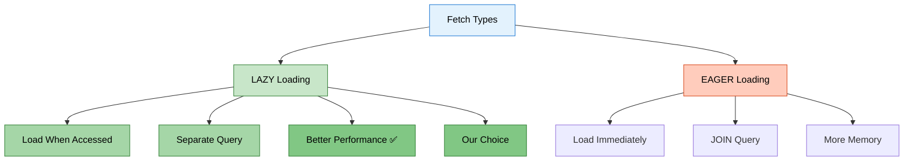

### ⚡ LAZY Loading (Our Implementation)

```java
@OneToOne(fetch = FetchType.LAZY)
private Passport passport;
```

**How it works:**

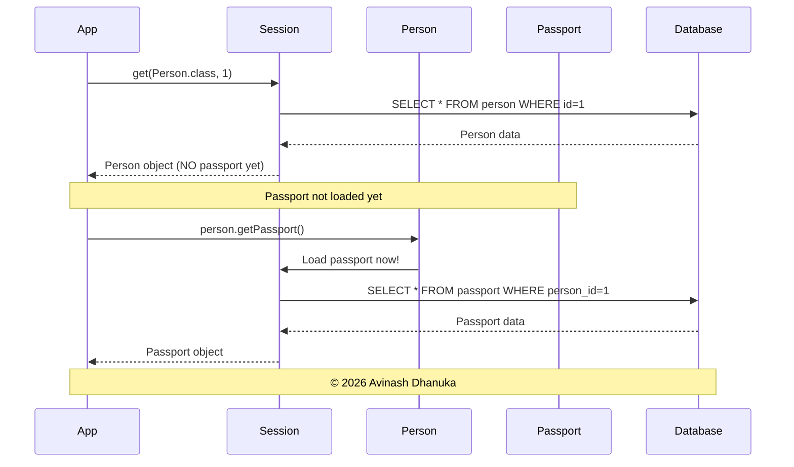

```java
// Load person - Passport NOT loaded yet
Person person = session.get(Person.class, 1L);
// SQL: SELECT * FROM person WHERE person_id = 1

System.out.println(person.getName());  // No additional query

// Access passport - NOW it loads
Passport passport = person.getPassport();
// SQL: SELECT * FROM passport WHERE person_id = 1
```

### 📊 LAZY vs EAGER Comparison

| Aspect | LAZY | EAGER |
|:-------|:-----|:------|
| **Loading Time** | When accessed | Immediately |
| **SQL Queries** | 2 separate queries | 1 query with JOIN |
| **Performance** | Better | Slower |
| **Memory Usage** | Lower | Higher |
| **Our Choice** | ✅ Yes | ❌ No |

**Why LAZY?** Better performance - load Passport only when you actually need it!

---

## 10. ID GENERATION STRATEGIES

> **📝 ID Generation Guide by:** Avinash Dhanuka | Understanding Primary Key Strategies

### 📌 Two Different Strategies in Our Project

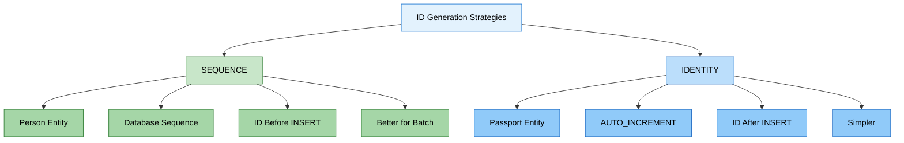


### 🔢 SEQUENCE Strategy (Person)

```java
@Id
@GeneratedValue(strategy = GenerationType.SEQUENCE, generator = "person_seq")
@SequenceGenerator(name = "person_seq", sequenceName = "person_sequence", 
                   initialValue = 1, allocationSize = 1)
private Long personId;
```

**How it works:**
1. Hibernate creates a sequence: `CREATE SEQUENCE person_sequence`
2. Before INSERT, gets next value: `SELECT NEXT VALUE FOR person_sequence`
3. Then INSERT with known ID

**Benefits:**
- ✅ ID available before INSERT
- ✅ Better for batch operations
- ✅ More control

### 🔢 IDENTITY Strategy (Passport)

```java
@Id
@GeneratedValue(strategy = GenerationType.IDENTITY)
private Long passportId;
```

**How it works:**
1. Column has AUTO_INCREMENT
2. INSERT without ID
3. Database assigns ID automatically

**Benefits:**
- ✅ Simple to use
- ✅ Widely supported
- ✅ No extra database objects

### 📊 Comparison

| Aspect | SEQUENCE (Person) | IDENTITY (Passport) |
|:-------|:-----------------|:-------------------|
| **ID Available** | Before INSERT | After INSERT |
| **Batch Insert** | ✅ Efficient | ❌ Not efficient |
| **Database Object** | Creates SEQUENCE | No extra object |
| **Complexity** | More complex | Simple |

---

## 11. LIFECYCLE CALLBACKS (@PrePersist)

> **📝 Lifecycle Guide by:** Avinash Dhanuka | Auto-Generation Before Save

### 📌 What is @PrePersist?

**@PrePersist** = A method that runs automatically BEFORE an entity is saved to the database.

### 🔧 Our Implementation

```java
@PrePersist
public void generatePassportNumber() {
    if (this.passportNumber == null) {
        this.passportNumber = "PASS-" + 
            UUID.randomUUID().toString().substring(0, 8).toUpperCase();
    }
}
```

### 🔄 Execution Flow

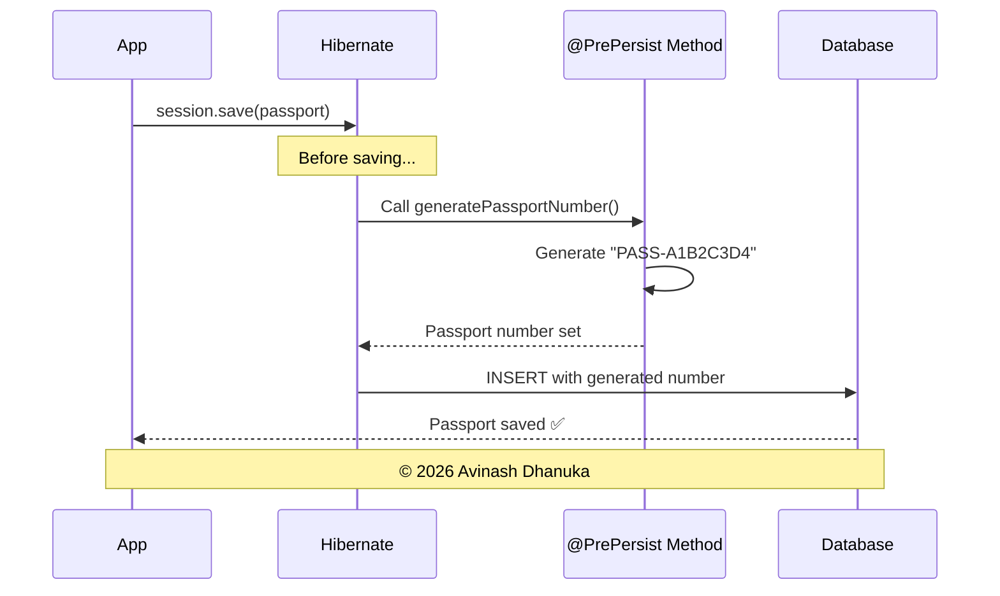

```
1. Create Passport (passportNumber = null)
   ↓
2. session.save(passport)
   ↓
3. @PrePersist method executes
   ↓
4. passportNumber = "PASS-A1B2C3D4"
   ↓
5. INSERT INTO passport with generated number
```

**Example Output:**
```
Passport Number: PASS-A1B2C3D4 (@PrePersist auto-generated)
```

### 📌 Other Lifecycle Callbacks (Brief)

| Callback | When It Runs | Use Case |
|:---------|:------------|:---------|
| **@PrePersist** | Before INSERT | Generate values, set defaults |
| **@PostPersist** | After INSERT | Logging, notifications |
| **@PreUpdate** | Before UPDATE | Update timestamps |
| **@PostUpdate** | After UPDATE | Audit trail |
| **@PreRemove** | Before DELETE | Soft delete |
| **@PostRemove** | After DELETE | Cleanup |

---

## 12. CRUD OPERATIONS

> **📝 CRUD Guide by:** Avinash Dhanuka | Operations with Related Entities

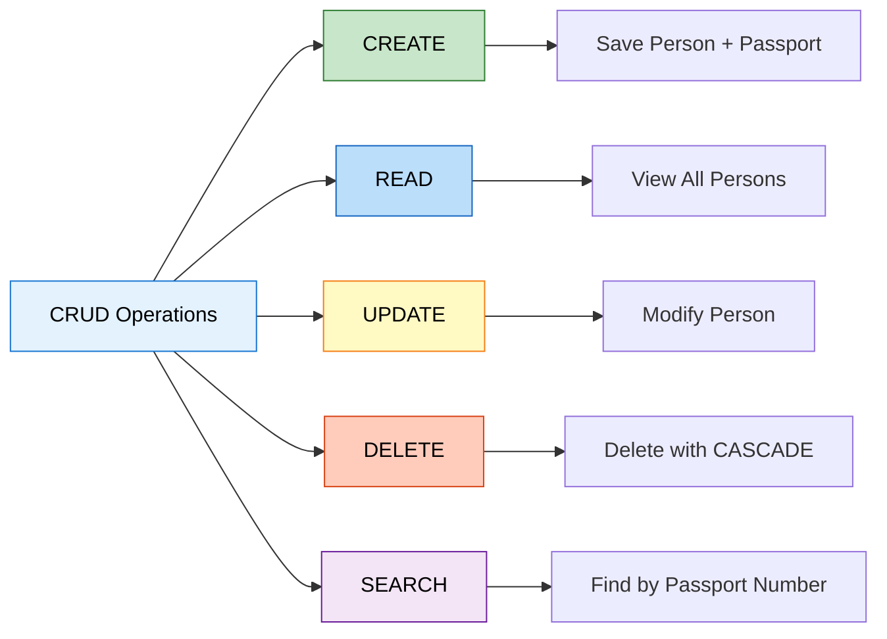

### 1️⃣ CREATE - Save Person with Passport

```java
// Create entities
Person person = new Person("John Doe", "john@email.com", 30);
Passport passport = new Passport("USA", LocalDate.now(), LocalDate.now().plusYears(10));

// Establish relationship
person.setPassport(passport);

// Save - CASCADE saves passport automatically!
session.save(person);
```

**What Happens:**
1. Person saved with ID from SEQUENCE
2. Passport number auto-generated by @PrePersist
3. Passport saved automatically (CASCADE)
4. Foreign key set automatically

**SQL Generated:**
```sql
SELECT NEXT VALUE FOR person_sequence;  -- Gets 1
INSERT INTO person (person_id, name, email, age) VALUES (1, 'John Doe', 'john@email.com', 30);
INSERT INTO passport (passport_number, country, issue_date, expiry_date, person_id) 
VALUES ('PASS-A1B2C3D4', 'USA', '2026-02-14', '2036-02-14', 1);
```

### 2️⃣ READ - View All Persons

```java
List<Person> persons = session.createQuery("FROM Person", Person.class).list();

for (Person p : persons) {
    System.out.println("Name: " + p.getName());
    
    // Access passport (LAZY loading triggers here)
    if (p.getPassport() != null) {
        Passport pass = p.getPassport();
        System.out.println("Passport: " + pass.getPassportNumber());
    }
}
```

**SQL Generated:**
```sql
-- First query: Get all persons
SELECT person_id, name, email, age FROM person;

-- For each person (LAZY loading):
SELECT passport_id, passport_number, country, issue_date, expiry_date, person_id 
FROM passport WHERE person_id = ?;
```

### 3️⃣ UPDATE - Modify Person

```java
Person person = session.get(Person.class, 1L);
person.setName("John Smith");
person.setEmail("johnsmith@email.com");
session.update(person);
```

**SQL Generated:**
```sql
UPDATE person SET name = 'John Smith', email = 'johnsmith@email.com' WHERE person_id = 1;
```

### 4️⃣ DELETE - Remove Person (CASCADE deletes Passport)

```java
Person person = session.get(Person.class, 1L);
session.delete(person);
// Passport automatically deleted due to CASCADE.ALL
```

**SQL Generated:**
```sql
-- Delete passport first (foreign key constraint)
DELETE FROM passport WHERE person_id = 1;

-- Then delete person
DELETE FROM person WHERE person_id = 1;
```

### 5️⃣ SEARCH - Find by Passport Number (Bidirectional)

```java
String hql = "FROM Passport WHERE passportNumber = :number";
Passport passport = session.createQuery(hql, Passport.class)
                          .setParameter("number", "PASS-A1B2C3D4")
                          .uniqueResult();

// Navigate to Person (bidirectional relationship)
Person person = passport.getPerson();
System.out.println("Person: " + person.getName());
```

---

## 13. RUNNING THE APPLICATION

<div align="center">

---
**Created by: Avinash Dhanuka** © 2026 Avinash Dhanuka

[GitHub Profile](https://github.com/Avinash-706) | [Contact Me](mailto:avunashdhanuka@gmail.com)

---

</div>

### 📋 Prerequisites

1. **MySQL Server** installed and running
2. **Java 11** or higher
3. **Maven** installed

### 🚀 Step-by-Step Setup


**Step 1: Create Database**

```bash
mysql -u root -p
```

```sql
CREATE DATABASE hibernate_relationships_db;
USE hibernate_relationships_db;
```

Or run the provided script:
```bash
mysql -u root -p < database_setup.sql
```

**Step 2: Update Database Credentials**

Edit `src/main/resources/hibernate.cfg.xml`:

```xml
<property name="hibernate.connection.username">your_username</property>
<property name="hibernate.connection.password">your_password</property>
```

**Step 3: Build the Project**

```bash
mvn clean install
```

**Step 4: Run the Application**

```bash
mvn exec:java -Dexec.mainClass="org.example.App"
```

### 📱 Application Menu

```
--- MENU ---
1. Create Person with Passport
2. View All Persons
3. Update Person
4. Delete Person
5. Search by Passport Number
6. Exit
```

### 🎯 Sample Interaction

```
Choose option: 1

--- Create Person with Passport ---
Enter Name: John Doe
Enter Email: john@email.com
Enter Age: 30
Enter Country: USA
Enter Issue Date (YYYY-MM-DD): 2026-01-01
Enter Expiry Date (YYYY-MM-DD): 2036-01-01

✓ Success! Person and Passport created.
  Person ID: 1 (@SequenceGenerator)
  Passport Number: PASS-A1B2C3D4 (@PrePersist auto-generated)

  Annotations Used:
  - @SequenceGenerator for Person ID
  - @PrePersist for Passport Number generation
  - CASCADE saves Passport automatically
```

---

## 14. WHAT I LEARNED

> **📝 Learning Summary by:** Avinash Dhanuka | © 2026

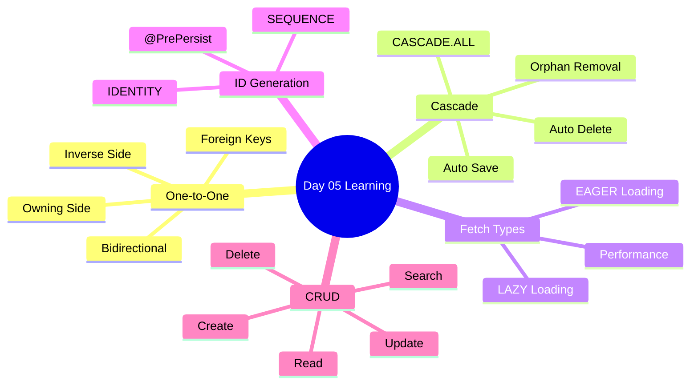

### ✅ Core Concepts Mastered

**1. One-to-One Relationship**
- How to map 1-to-1 relationships between entities
- Understanding owning side vs inverse side
- Using @OneToOne, @JoinColumn, and mappedBy

**2. Bidirectional Navigation**
- Can navigate from Person to Passport
- Can navigate from Passport to Person
- Synchronizing both sides of the relationship

**3. Cascade Operations**
- CASCADE.ALL propagates all operations
- Save Person → Passport saved automatically
- Delete Person → Passport deleted automatically
- No need to manually save/delete child entities

**4. Fetch Strategies**
- FetchType.LAZY loads data when accessed (better performance)
- FetchType.EAGER loads data immediately
- Chose LAZY for better performance

**5. Orphan Removal**
- orphanRemoval = true deletes orphaned entities
- If you unlink Passport from Person, it's deleted
- Keeps database clean

**6. ID Generation**
- SEQUENCE strategy for Person (more control)
- IDENTITY strategy for Passport (simpler)
- Understanding when to use which

**7. Lifecycle Callbacks**
- @PrePersist runs before INSERT
- Used to auto-generate passport number
- Can set default values, timestamps, etc.

**8. Foreign Keys**
- Passport has person_id foreign key
- UNIQUE constraint ensures 1-to-1
- Hibernate manages FK automatically


### 📊 Day 04 vs Day 05 Comparison

| Feature | Day 04 | Day 05 |
|:--------|:-------|:-------|
| **Entities** | 1 (Student) | 2 (Person + Passport) |
| **Tables** | 1 table | 2 related tables |
| **Relationships** | None | One-to-One |
| **Foreign Keys** | Not used | Used (person_id) |
| **Cascade** | Not covered | CASCADE.ALL |
| **Fetch Strategy** | Not covered | LAZY vs EAGER |
| **Orphan Removal** | Not covered | Implemented |
| **ID Generation** | IDENTITY only | SEQUENCE + IDENTITY |
| **@PrePersist** | Not used | Auto-generate passport number |
| **Navigation** | N/A | Bidirectional |

### 🎯 Practical Skills Gained

✅ Built a complete Person-Passport management system<br>
✅ Implemented CRUD operations with relationships<br>
✅ Used HQL to query related entities<br>
✅ Handled bidirectional navigation<br>
✅ Applied cascade operations correctly<br>
✅ Optimized with LAZY loading<br>
✅ Auto-generated values with @PrePersist<br>
✅ Managed foreign keys automatically<br>

---

## 15. INTERVIEW QUESTIONS

> **📝 Curated by:** Avinash Dhanuka | © 2026 | [GitHub](https://github.com/Avinash-706)

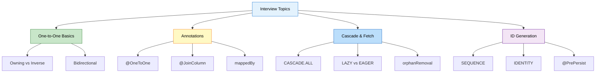

### Q1: What is a One-to-One relationship? Give a real-world example.

**Answer:**

A One-to-One relationship means each record in Table A is associated with exactly ONE record in Table B, and vice versa.

**Real-World Examples:**
- Person ↔ Passport (one person has one passport)
- User ↔ Profile (one user has one profile)
- Employee ↔ Desk (one employee assigned one desk)

**Database Structure:**
```sql
CREATE TABLE person (person_id BIGINT PRIMARY KEY, name VARCHAR(100));
CREATE TABLE passport (
    passport_id BIGINT PRIMARY KEY,
    passport_number VARCHAR(50),
    person_id BIGINT UNIQUE,  -- UNIQUE ensures 1-to-1
    FOREIGN KEY (person_id) REFERENCES person(person_id)
);
```

**Key Point:** The UNIQUE constraint on the foreign key ensures it's truly one-to-one.

---

### Q2: What is the difference between Owning Side and Inverse Side?

**Answer:**

| Aspect | Owning Side | Inverse Side |
|:-------|:------------|:-------------|
| **Annotation** | @JoinColumn | mappedBy |
| **Foreign Key** | Has FK column | No FK |
| **Example** | Passport (has person_id) | Person (no FK) |
| **Responsibility** | Manages relationship | Just references it |

**Code Example:**

```java
// OWNING SIDE (Passport)
@OneToOne
@JoinColumn(name = "person_id")
private Person person;

// INVERSE SIDE (Person)
@OneToOne(mappedBy = "person")
private Passport passport;
```

**Why It Matters:** Only the owning side can update the foreign key in the database.

---

### Q3: Explain CASCADE operations with an example.

**Answer:**

**Cascade** = Automatically propagating operations from parent to child entity.

**CASCADE.ALL includes:**
- PERSIST (save)
- MERGE (update)
- REMOVE (delete)
- REFRESH (reload)
- DETACH (detach)

**Example:**

```java
@OneToOne(cascade = CascadeType.ALL)
private Passport passport;

// Save person - passport saved automatically
Person person = new Person("John", "john@email.com", 30);
Passport passport = new Passport("USA", dates...);
person.setPassport(passport);
session.save(person);  // ✅ Passport also saved

// Delete person - passport deleted automatically
session.delete(person);  // ✅ Passport also deleted
```

**Without CASCADE:**
```java
session.save(person);    // Save person
session.save(passport);  // Must save passport separately ❌
```

---

### Q4: What is the difference between LAZY and EAGER loading?

**Answer:**

| Aspect | LAZY | EAGER |
|:-------|:-----|:------|
| **Loading Time** | When accessed | Immediately |
| **SQL Queries** | Separate query | JOIN or separate |
| **Performance** | Better | Slower |
| **Memory** | Lower | Higher |

**LAZY Example:**

```java
@OneToOne(fetch = FetchType.LAZY)
private Passport passport;

Person person = session.get(Person.class, 1L);
// SQL: SELECT * FROM person WHERE person_id = 1
// Passport NOT loaded yet

Passport passport = person.getPassport();  // NOW it loads
// SQL: SELECT * FROM passport WHERE person_id = 1
```

**EAGER Example:**

```java
@OneToOne(fetch = FetchType.EAGER)
private Passport passport;

Person person = session.get(Person.class, 1L);
// SQL: SELECT * FROM person p LEFT JOIN passport ps ON p.id = ps.person_id
// Both loaded immediately
```

**Best Practice:** Use LAZY by default for better performance.

---

### Q5: What is orphanRemoval and how is it different from CASCADE.REMOVE?

**Answer:**

**orphanRemoval** = Automatically delete child when it's no longer referenced by parent.

| Scenario | CASCADE.REMOVE | orphanRemoval |
|:---------|:--------------|:--------------|
| Delete parent | ✅ Deletes child | ✅ Deletes child |
| Unlink child | ❌ Child remains | ✅ Deletes child |

**Example:**

```java
@OneToOne(cascade = CascadeType.ALL, orphanRemoval = true)
private Passport passport;

// Scenario 1: Delete parent
session.delete(person);
// Both CASCADE.REMOVE and orphanRemoval delete passport

// Scenario 2: Unlink child
person.setPassport(null);
session.update(person);
// Only orphanRemoval deletes the passport!
// Without orphanRemoval, passport remains in database (orphaned)
```

**Use Case:** Use orphanRemoval for true parent-child relationships where child cannot exist without parent.

---

### Q6: Explain @PrePersist with an example.

**Answer:**

**@PrePersist** = A lifecycle callback that runs automatically BEFORE an entity is saved.

**Example:**

```java
@Entity
public class Passport {
    private String passportNumber;
    
    @PrePersist
    public void generatePassportNumber() {
        if (this.passportNumber == null) {
            this.passportNumber = "PASS-" + 
                UUID.randomUUID().toString().substring(0, 8).toUpperCase();
        }
    }
}
```

**Execution Flow:**

```
1. Create passport (passportNumber = null)
2. session.save(passport)
3. @PrePersist executes → passportNumber = "PASS-A1B2C3D4"
4. INSERT INTO passport with generated number
```

**Other Lifecycle Callbacks:**
- @PostPersist (after INSERT)
- @PreUpdate (before UPDATE)
- @PostUpdate (after UPDATE)
- @PreRemove (before DELETE)
- @PostRemove (after DELETE)

---

### Q7: What is the difference between SEQUENCE and IDENTITY generation strategies?

**Answer:**

| Aspect | SEQUENCE | IDENTITY |
|:-------|:---------|:---------|
| **How It Works** | Database sequence | AUTO_INCREMENT |
| **ID Available** | Before INSERT | After INSERT |
| **Batch Insert** | ✅ Efficient | ❌ Not efficient |
| **Database Support** | Oracle, PostgreSQL, MySQL 8+ | MySQL, SQL Server |

**SEQUENCE Example:**

```java
@Id
@GeneratedValue(strategy = GenerationType.SEQUENCE, generator = "person_seq")
@SequenceGenerator(name = "person_seq", sequenceName = "person_sequence")
private Long personId;
```

```sql
CREATE SEQUENCE person_sequence;
SELECT NEXT VALUE FOR person_sequence;  -- Gets ID before INSERT
INSERT INTO person (person_id, ...) VALUES (1, ...);
```

**IDENTITY Example:**

```java
@Id
@GeneratedValue(strategy = GenerationType.IDENTITY)
private Long passportId;
```

```sql
CREATE TABLE passport (passport_id BIGINT AUTO_INCREMENT PRIMARY KEY, ...);
INSERT INTO passport (...) VALUES (...);  -- ID assigned by database
```

**When to Use:**
- SEQUENCE: Better performance, batch operations
- IDENTITY: Simplicity, legacy databases

---

### Q8: How do you ensure both sides of a bidirectional relationship are synchronized?

**Answer:**

**Problem:** In bidirectional relationships, you must keep both sides in sync.

**Solution:** Add synchronization logic in setter methods.

```java
// ❌ BAD: Not synchronized
Person person = new Person("John", "john@email.com", 30);
Passport passport = new Passport("USA", dates...);
passport.setPerson(person);  // Set one side only
// person.getPassport() returns null! ❌

// ✅ GOOD: Synchronized
@Entity
public class Person {
    public void setPassport(Passport passport) {
        this.passport = passport;
        if (passport != null) {
            passport.setPerson(this);  // Sync both sides
        }
    }
}

// Usage
person.setPassport(passport);
// Both sides synchronized automatically! ✅
```

**Best Practice:** Always synchronize both sides in the setter method of the inverse side.

---

### Q9: What SQL queries are generated when you save a Person with Passport?

**Answer:**

**Code:**

```java
Person person = new Person("John", "john@email.com", 30);
Passport passport = new Passport("USA", issueDate, expiryDate);
person.setPassport(passport);
session.save(person);
```

**SQL Generated:**

```sql
-- 1. Get next person_id from sequence
SELECT NEXT VALUE FOR person_sequence;  -- Returns 1

-- 2. Insert person
INSERT INTO person (person_id, name, email, age) 
VALUES (1, 'John', 'john@email.com', 30);

-- 3. Insert passport (CASCADE effect)
INSERT INTO passport (passport_number, country, issue_date, expiry_date, person_id)
VALUES ('PASS-A1B2C3D4', 'USA', '2026-01-01', '2036-01-01', 1);
```

**Key Points:**
- Only need to save Person (CASCADE saves Passport)
- Passport number auto-generated by @PrePersist
- Foreign key (person_id) set automatically

---

### Q10: How do you query from the Passport side to find the Person?

**Answer:**

**HQL Query:**

```java
String hql = "FROM Passport WHERE passportNumber = :number";
Passport passport = session.createQuery(hql, Passport.class)
                          .setParameter("number", "PASS-A1B2C3D4")
                          .uniqueResult();

// Navigate to Person (bidirectional relationship)
Person person = passport.getPerson();
System.out.println("Person: " + person.getName());
```

**SQL Generated:**

```sql
-- First query: Find passport
SELECT passport_id, passport_number, country, issue_date, expiry_date, person_id
FROM passport WHERE passport_number = 'PASS-A1B2C3D4';

-- Second query: Load person (LAZY loading)
SELECT person_id, name, email, age FROM person WHERE person_id = 1;
```

**This demonstrates:**
- Bidirectional navigation (Passport → Person)
- HQL with parameters
- LAZY loading of Person

---

## 📚 Related Learning Resources

### Previous Days

**Day 03: Hibernate Basics**
- Location: `day03/HibernateDemo/`
- Focus: Introduction to Hibernate ORM
- [View README](../../day03/HibernateDemo/README.md)

**Day 04: Advanced Hibernate**
- Location: `day04/HibernateCore/`
- Focus: Caching, lifecycle states, batch operations
- [View README](../../day04/HibernateCore/README.md)

### Next Steps

**Day 06: More Relationships (Coming Soon)**
- One-to-Many relationships
- Many-to-One relationships
- Many-to-Many relationships
- Join tables and composite keys

---

## 🎯 Key Takeaways

✅ Mastered One-to-One bidirectional relationships<br>
✅ Understood owning side vs inverse side<br>
✅ Implemented CASCADE operations for automatic propagation<br>
✅ Used LAZY loading for better performance<br>
✅ Applied orphanRemoval to prevent orphaned records<br>
✅ Learned SEQUENCE vs IDENTITY ID generation<br>
✅ Used @PrePersist for auto-generation<br>
✅ Built complete CRUD with relationships<br>
✅ Handled foreign keys automatically<br>
✅ Navigated relationships bidirectionally<br>

---

<div align="center">

## 🎓 End of Day 05 Master Guide

<br>


<br>

**Created with dedication by Avinash Dhanuka**

<br>

[](https://github.com/Avinash-706)
[](mailto:avunashdhanuka@gmail.com)

<br>

---

**Happy Learning! 🚀**

*"Master the Relationships, Master the Database!"* - Avinash Dhanuka

---

</div>
