# ☕ Hibernate Many-to-One: Unidirectional vs Bidirectional

<div align="center">


</div>

<hr style="border: 1px solid rgb(98, 117, 187)">

<div align="center">
<table>
<tr>
<td align="center">
<br />

<h3>© 2026 Avinash Dhanuka</h3>
<p>Mastering Unidirectional & Bidirectional Many-to-One Relationships</p>
<p><em>Crafted with ❤️ for Understanding Relationship Directions</em></p>

<a href="https://github.com/Avinash-706" target="_blank">

</a>
<br />
<a href="https://mail.google.com/mail/?view=cm&fs=1&to=avunashdhanuka@gmail.com&su=Hibernate%20Relationships%20Query&body=☕%20Hello%20Avinash,%0D%0A%0D%0AMy%20name%20is%20[Your%20Name]%20and%20I%20have%20a%20doubt%20regarding%20Hibernate%20Relationships.%0D%0A%0D%0A🔹%20Topic:%20[Many-to-One]%0D%0A%0D%0AThank%20you!" target="_blank">

</a>
<br />
<br />
</td>
</tr>
</table>
</div>

> **Learning Note:** This guide demonstrates BOTH Unidirectional and Bidirectional Many-to-One relationships using Department-Employee example!

> **Prerequisites:** 
> - Complete understanding of [One-to-Many Bidirectional](../HibernateRelatonship2/README.md)
> - MySQL Server installed and running

---

## 📑 Table of Contents
1. [What's New?](#1-whats-new)
2. [Unidirectional vs Bidirectional](#2-unidirectional-vs-bidirectional)
3. [Unidirectional Many-to-One](#3-unidirectional-many-to-one)
4. [Bidirectional Many-to-One](#4-bidirectional-many-to-one)
5. [Sequence Generators](#5-sequence-generators)
6. [Key Differences](#6-key-differences)
7. [Cascade Operations](#7-cascade-operations)
8. [Running the Application](#8-running-the-application)
9. [What I Learned](#9-what-i-learned)
10. [Interview Questions](#10-interview-questions)

---

## 1. WHAT'S NEW?

> **📝 Author:** Avinash Dhanuka | [GitHub](https://github.com/Avinash-706)

### 🎯 Two Implementations in One Project

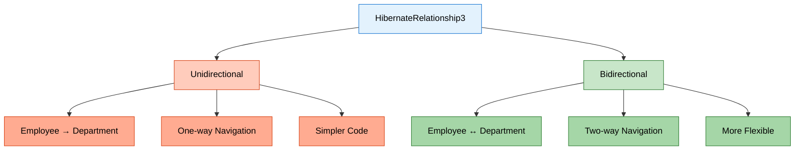

### 📊 What We're Building

A **Department-Employee Management System** with TWO implementations:

**Unidirectional:**
- Employee knows Department
- Department doesn't know Employees
- One-way navigation only

**Bidirectional:**
- Employee knows Department
- Department knows Employees
- Two-way navigation

### 🎯 Special Features

- **Sequence Generators** with custom increments
- **Department IDs:** 10, 20, 30, 40... (increment by 10)
- **Employee IDs:** 101, 102, 103, 104... (increment by 1)
- **Interactive Menu** for both implementations
- **Separate Tables** for each implementation

---

<div align="center">

**📚 Learning Path Progress**

One-to-Many Bidirectional → **Many-to-One (Uni & Bi)** ✅ → Many-to-Many

*Created by Avinash Dhanuka | © 2026*

</div>

---

## 2. UNIDIRECTIONAL VS BIDIRECTIONAL

> **📝 Comprehensive Guide by:** Avinash Dhanuka | © 2026

### 📌 What is Directionality?

**Directionality** = The ability to navigate between entities in your code.

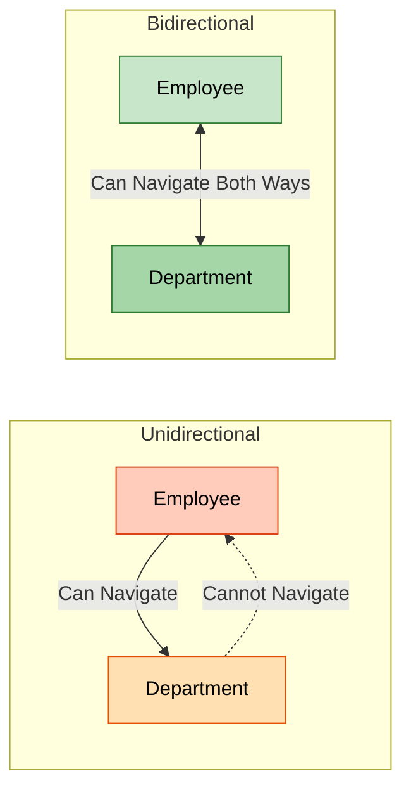


### 🔍 Real-World Analogy

**Unidirectional = One-Way Street**
```
Employee knows their Department
But Department doesn't track Employees
```

**Bidirectional = Two-Way Street**
```
Employee knows their Department
AND Department tracks all Employees
```

### 📊 Comparison Table

| Feature | Unidirectional | Bidirectional |
|---------|---------------|---------------|
| **Navigation** | Employee → Department only | Employee ↔ Department |
| **Code Complexity** | Simpler | More complex |
| **Memory Usage** | Lower | Higher |
| **Use Case** | Simple lookups | Full management |
| **@JoinColumn** | In Employee only | In Employee only |
| **mappedBy** | Not needed | Required in Department |
| **Helper Methods** | Not needed | Recommended |
| **Cascade** | Limited options | Full control |

### 💡 When to Use Which?

**Use Unidirectional When:**
- You only need to find Department from Employee
- Simpler code is priority
- Memory optimization matters
- Read-only operations

**Use Bidirectional When:**
- You need to find Employees from Department
- Full CRUD operations required
- Cascade operations needed
- Complex business logic

---

<div align="center">

**🎓 Understanding Directionality is Key to Mastering Relationships**

*Guide by Avinash Dhanuka | © 2026*

</div>

---

## 3. UNIDIRECTIONAL MANY-TO-ONE

> **📝 Author:** Avinash Dhanuka | [Contact via Gmail](mailto:avunashdhanuka@gmail.com)

### 🎯 What is Unidirectional Many-to-One?

**Many Employees → One Department** (One-way navigation)

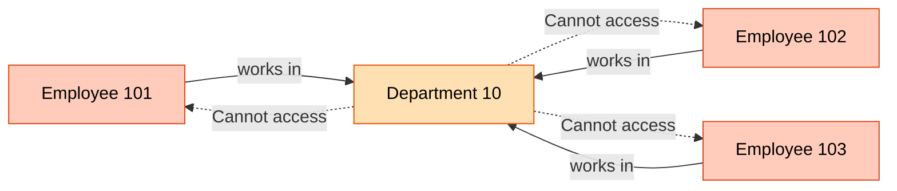

### 🏗️ Database Structure

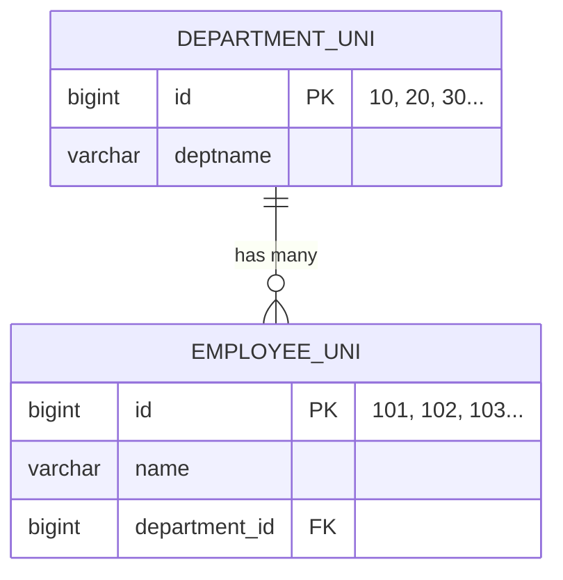

### 📝 Entity Classes

#### Department.java (Unidirectional)

```java
@Entity
@Table(name = "department_uni")
public class Department {
    
    @Id
    @GeneratedValue(strategy = GenerationType.SEQUENCE, generator = "dept_seq")
    @SequenceGenerator(name = "dept_seq", initialValue = 10, allocationSize = 10)
    private Long id;
    
    private String deptname;
    
    // NO reference to Employee!
    // Department doesn't know about Employees
    
    // Constructors, Getters, Setters, toString()
}
```


#### Employee.java (Unidirectional)

```java
@Entity
@Table(name = "employee_uni")
public class Employee {
    
    @Id
    @GeneratedValue(strategy = GenerationType.SEQUENCE, generator = "emp_seq")
    @SequenceGenerator(name = "emp_seq", initialValue = 101, allocationSize = 1)
    private Long id;
    
    private String name;
    
    // Employee knows Department (Unidirectional)
    @ManyToOne
    @JoinColumn(name = "department_id")
    private Department department;
    
    // Constructors, Getters, Setters, toString()
}
```

**Key Points:**
- `@ManyToOne` in Employee only
- `@JoinColumn` defines FK column name
- Department has NO reference to Employee
- Simple and straightforward

### 🔄 How It Works

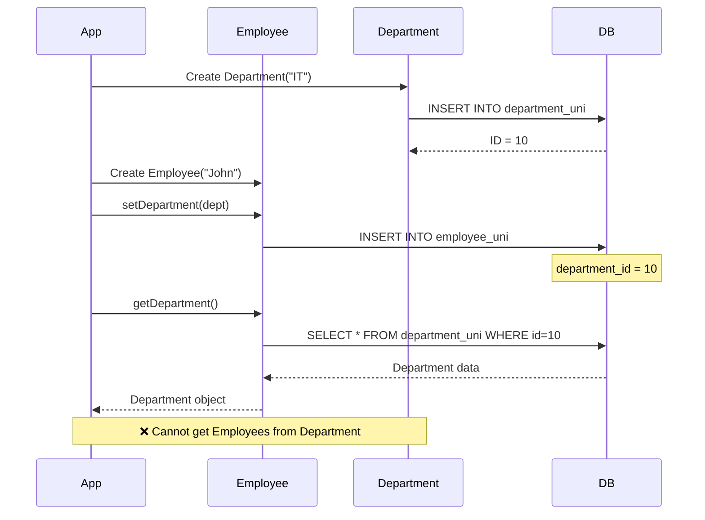

### 💻 Usage Example

```java
// Create Department
Department dept = new Department("IT");
session.save(dept); // ID = 10

// Create Employees
Employee emp1 = new Employee("John");
emp1.setDepartment(dept);
session.save(emp1); // ID = 101

Employee emp2 = new Employee("Jane");
emp2.setDepartment(dept);
session.save(emp2); // ID = 102

// ✅ Can navigate from Employee to Department
System.out.println(emp1.getDepartment().getDeptname()); // "IT"

// ❌ Cannot navigate from Department to Employees
// dept.getEmployees() - Method doesn't exist!
```


### ⚡ Advantages & Disadvantages

**✅ Advantages:**
- Simpler code structure
- Less memory overhead
- Easier to maintain
- No risk of circular references
- Faster for simple queries

**❌ Disadvantages:**
- Cannot get Employees from Department
- Limited cascade options
- Need HQL/SQL for reverse queries
- Less flexible for complex operations

### 📊 Memory Representation

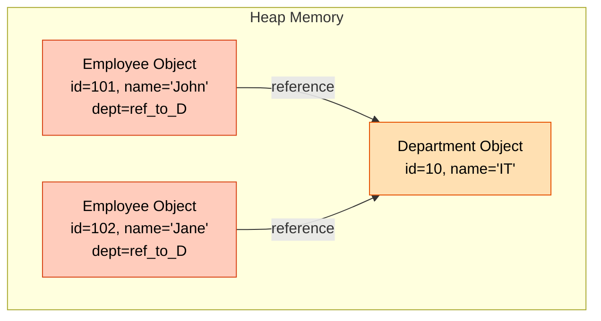

---

<div align="center">

**🔥 Unidirectional = Simple & Efficient for One-Way Navigation**

*© 2026 Avinash Dhanuka*

</div>

---

## 4. BIDIRECTIONAL MANY-TO-ONE

> **📝 Comprehensive Guide by:** Avinash Dhanuka | © 2026

### 🎯 What is Bidirectional Many-to-One?

**Many Employees ↔ One Department** (Two-way navigation)

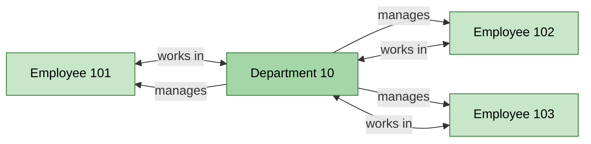

### 🏗️ Database Structure

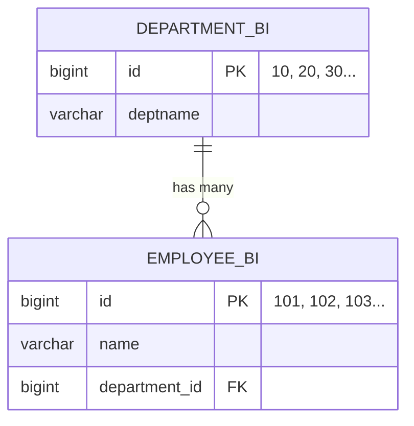

**Note:** Database structure is SAME as Unidirectional! The difference is in Java code only.


### 📝 Entity Classes

#### DepartmentBi.java (Bidirectional)

```java
@Entity
@Table(name = "department_bi")
public class DepartmentBi {
    
    @Id
    @GeneratedValue(strategy = GenerationType.SEQUENCE, generator = "dept_bi_seq")
    @SequenceGenerator(name = "dept_bi_seq", initialValue = 10, allocationSize = 10)
    private Long id;
    
    private String deptname;
    
    // Department now knows about Employees!
    @OneToMany(mappedBy = "department", cascade = CascadeType.ALL, orphanRemoval = true)
    private List<EmployeeBi> employees = new ArrayList<>();
    
    // Helper methods to maintain bidirectional relationship
    public void addEmployee(EmployeeBi employee) {
        employees.add(employee);
        employee.setDepartment(this);
    }
    
    public void removeEmployee(EmployeeBi employee) {
        employees.remove(employee);
        employee.setDepartment(null);
    }
    
    // Constructors, Getters, Setters, toString()
}
```

**Key Points:**
- `@OneToMany(mappedBy = "department")` - Points to Employee's field
- `cascade = CascadeType.ALL` - Operations cascade to Employees
- `orphanRemoval = true` - Removes orphaned Employees
- Helper methods maintain both sides

#### EmployeeBi.java (Bidirectional)

```java
@Entity
@Table(name = "employee_bi")
public class EmployeeBi {
    
    @Id
    @GeneratedValue(strategy = GenerationType.SEQUENCE, generator = "emp_bi_seq")
    @SequenceGenerator(name = "emp_bi_seq", initialValue = 101, allocationSize = 1)
    private Long id;
    
    private String name;
    
    // Employee knows Department (Owner side)
    @ManyToOne
    @JoinColumn(name = "department_id")
    private Department department;
    
    // Constructors, Getters, Setters, toString()
}
```

**Key Points:**
- `@ManyToOne` with `@JoinColumn` - Owner side
- Only ONE side has `@JoinColumn`
- Other side uses `mappedBy`


### 🔄 How It Works

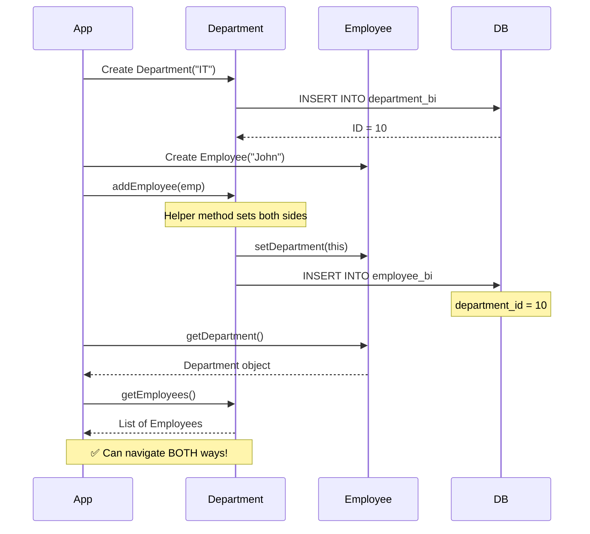

### 🎯 The Golden Rule of Bidirectional

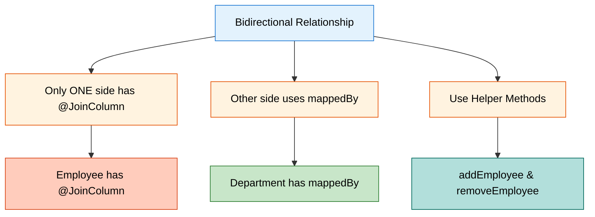

**Why This Rule?**

If you add `@JoinColumn` on BOTH sides:
- 💥 Hibernate gets confused
- 💥 Doesn't know which controls FK
- 💥 Throws `AnnotationException`

### 💻 Usage Example

```java
// Create Department
DepartmentBi dept = new DepartmentBi("IT");
session.save(dept); // ID = 10

// Create Employees using helper method
EmployeeBi emp1 = new EmployeeBi("John");
dept.addEmployee(emp1); // Sets both sides automatically

EmployeeBi emp2 = new EmployeeBi("Jane");
dept.addEmployee(emp2);

session.update(dept); // Cascade saves employees

// ✅ Navigate from Employee to Department
System.out.println(emp1.getDepartment().getDeptname()); // "IT"

// ✅ Navigate from Department to Employees
for (EmployeeBi emp : dept.getEmployees()) {
    System.out.println(emp.getName());
}
```


### 🔥 Why Helper Methods?

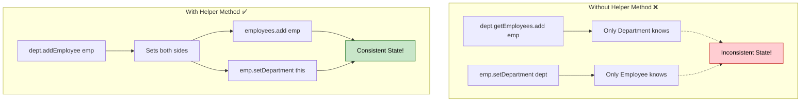

**Helper Method Benefits:**
- Maintains consistency on both sides
- Prevents bugs and data inconsistency
- Cleaner code
- Easier to maintain

### ⚡ Advantages & Disadvantages

**✅ Advantages:**
- Two-way navigation
- Full cascade control
- Flexible operations
- Better for complex logic
- Can get Employees from Department

**❌ Disadvantages:**
- More complex code
- Higher memory usage
- Risk of circular references
- Need helper methods
- More maintenance

---

<div align="center">

**🎓 Bidirectional = Full Control with Two-Way Navigation**

*Crafted by Avinash Dhanuka | © 2026*

</div>

---

## 5. SEQUENCE GENERATORS

> **📝 Author:** Avinash Dhanuka | [GitHub](https://github.com/Avinash-706)

### 🎯 What are Sequence Generators?

**Sequence Generators** = Custom ID generation strategies in Hibernate

### 📊 Our Custom Sequences

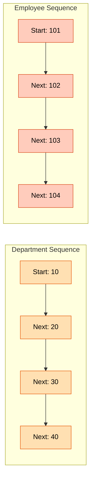


### 💻 Department Sequence Configuration

```java
@Id
@GeneratedValue(strategy = GenerationType.SEQUENCE, generator = "dept_seq")
@SequenceGenerator(
    name = "dept_seq",           // Generator name
    initialValue = 10,           // Start from 10
    allocationSize = 10          // Increment by 10
)
private Long id;
```

**Result:** 10, 20, 30, 40, 50...

### 💻 Employee Sequence Configuration

```java
@Id
@GeneratedValue(strategy = GenerationType.SEQUENCE, generator = "emp_seq")
@SequenceGenerator(
    name = "emp_seq",            // Generator name
    initialValue = 101,          // Start from 101
    allocationSize = 1           // Increment by 1
)
private Long id;
```

**Result:** 101, 102, 103, 104, 105...

### 📊 Sequence Parameters Explained

| Parameter | Description | Example |
|-----------|-------------|---------|
| `name` | Unique generator name | "dept_seq" |
| `initialValue` | Starting value | 10 or 101 |
| `allocationSize` | Increment step | 10 or 1 |
| `sequenceName` | DB sequence name (optional) | "dept_id_seq" |

### 🔄 How Sequences Work

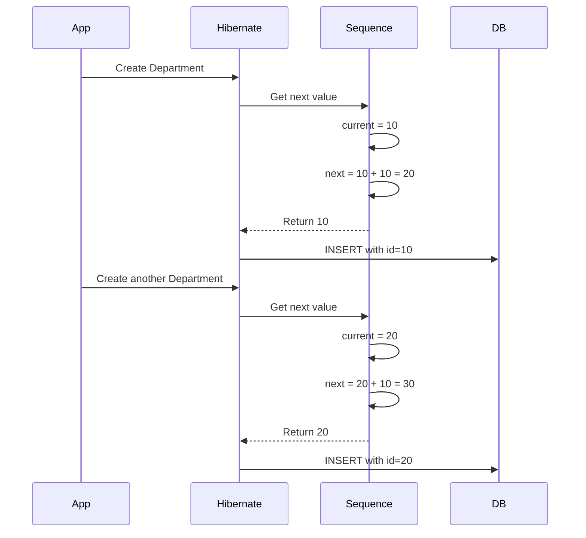

### 💡 Why Custom Sequences?

**Benefits:**
- Meaningful IDs (10, 20, 30 easier to remember than 1, 2, 3)
- Room for manual insertions between IDs
- Better organization
- Professional appearance
- Easier debugging

**Real-World Example:**
```
Department IDs: 10, 20, 30, 40
Employee IDs: 101, 102, 103, 104

Easy to identify:
- ID 30 = Department
- ID 103 = Employee
```

---

<div align="center">

**🔢 Custom Sequences = Professional ID Management**

*© 2026 Avinash Dhanuka*

</div>

---


## 6. KEY DIFFERENCES

> **📝 Comprehensive Comparison by:** Avinash Dhanuka | © 2026

### 📊 Unidirectional vs Bidirectional

| Aspect | Unidirectional | Bidirectional |
|--------|---------------|---------------|
| **Navigation** | Employee → Department only | Employee ↔ Department |
| **@JoinColumn** | In Employee | In Employee |
| **@OneToMany** | Not present | In Department with mappedBy |
| **mappedBy** | Not needed | Required |
| **Helper Methods** | Not needed | Strongly recommended |
| **Cascade** | Limited | Full control |
| **orphanRemoval** | Not applicable | Available |
| **Code Complexity** | Simple | More complex |
| **Memory Usage** | Lower | Higher |
| **Query Flexibility** | Limited | High |
| **Use Case** | Simple lookups | Full management |
| **Maintenance** | Easier | Requires care |

### 🎯 Code Comparison

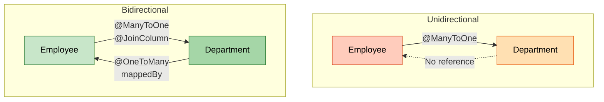

### 💻 Side-by-Side Code

**Unidirectional:**
```java
// Department - NO reference to Employee
@Entity
public class Department {
    @Id
    private Long id;
    private String deptname;
    // No employees field!
}

// Employee - Has reference to Department
@Entity
public class Employee {
    @Id
    private Long id;
    private String name;
    
    @ManyToOne
    @JoinColumn(name = "department_id")
    private Department department;
}
```

**Bidirectional:**
```java
// Department - Has reference to Employees
@Entity
public class DepartmentBi {
    @Id
    private Long id;
    private String deptname;
    
    @OneToMany(mappedBy = "department", cascade = CascadeType.ALL)
    private List<EmployeeBi> employees = new ArrayList<>();
    
    public void addEmployee(EmployeeBi emp) {
        employees.add(emp);
        emp.setDepartment(this);
    }
}

// Employee - Has reference to Department
@Entity
public class EmployeeBi {
    @Id
    private Long id;
    private String name;
    
    @ManyToOne
    @JoinColumn(name = "department_id")
    private DepartmentBi department;
}
```


### 🔍 Operation Comparison

```mermaid
graph TD
    subgraph "Unidirectional Operations"
    U1[Create Department] --> U2[Create Employee]
    U2 --> U3[Set Department in Employee]
    U3 --> U4[Save Employee]
    U4 --> U5[✅ Get Department from Employee]
    U5 --> U6[❌ Cannot get Employees from Department]
    end
    
    subgraph "Bidirectional Operations"
    B1[Create Department] --> B2[Create Employee]
    B2 --> B3[Use addEmployee helper]
    B3 --> B4[Update Department]
    B4 --> B5[✅ Get Department from Employee]
    B5 --> B6[✅ Get Employees from Department]
    end
    
    style U6 fill:#ffcdd2,stroke:#c62828,color:#000
    style B6 fill:#c8e6c9,stroke:#2e7d32,color:#000
```

### 📈 Performance Comparison

| Operation | Unidirectional | Bidirectional |
|-----------|---------------|---------------|
| **Insert Employee** | Fast | Fast |
| **Get Department** | Fast | Fast |
| **Get Employees** | Need HQL | Direct access |
| **Cascade Save** | Limited | Full support |
| **Memory** | Lower | Higher |
| **Lazy Loading** | Simple | Complex |

### 🎯 Decision Matrix

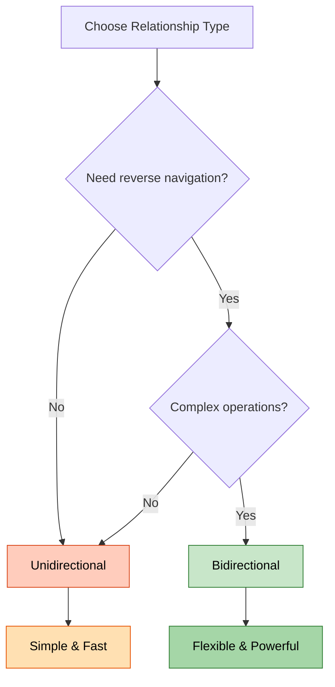

---

<div align="center">

**🎓 Choose Based on Your Requirements, Not Complexity**

*Guide by Avinash Dhanuka | © 2026*

</div>

---

## 7. CASCADE OPERATIONS

> **📝 Detailed Guide by:** Avinash Dhanuka | [Contact](mailto:avunashdhanuka@gmail.com)

### 🎯 What is Cascade?

**Cascade** = Propagating operations from parent to child entities automatically.

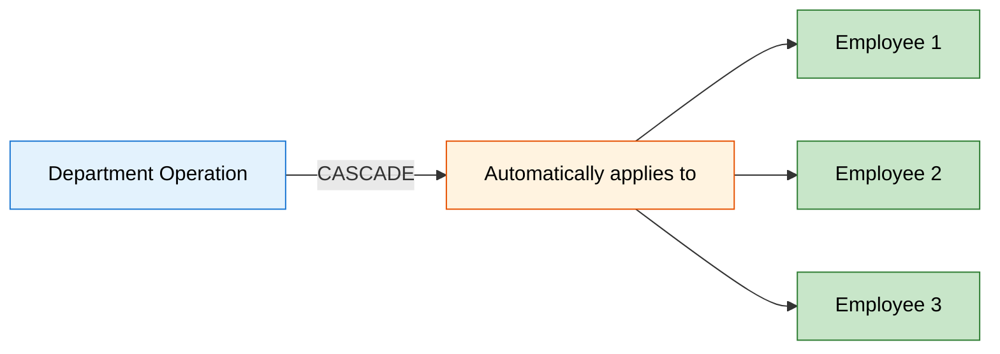


### 📊 Cascade Types

| Cascade Type | What It Does | When to Use |
|--------------|--------------|-------------|
| **PERSIST** | Save child when parent is saved | Creating new entities |
| **MERGE** | Update child when parent is updated | Updating entities |
| **REMOVE** | Delete child when parent is deleted | Deleting entities |
| **REFRESH** | Reload child when parent is refreshed | Syncing with DB |
| **DETACH** | Detach child when parent is detached | Session management |
| **ALL** | All of the above | Full lifecycle management |

### 🔥 CASCADE.PERSIST

**What it does:** When you save Department, Employees are saved automatically.

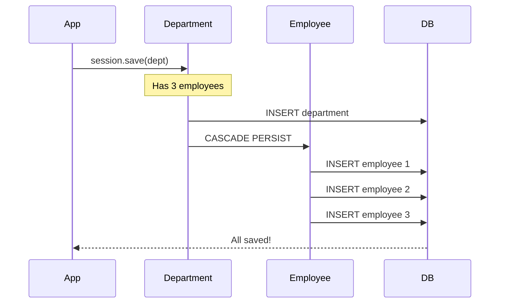

**Code Example:**
```java
@OneToMany(mappedBy = "department", cascade = CascadeType.PERSIST)
private List<EmployeeBi> employees;

// Usage
DepartmentBi dept = new DepartmentBi("IT");
dept.addEmployee(new EmployeeBi("John"));
dept.addEmployee(new EmployeeBi("Jane"));

session.save(dept); // Saves department AND employees!
```

### 🔥 CASCADE.MERGE

**What it does:** When you update Department, Employees are updated automatically.

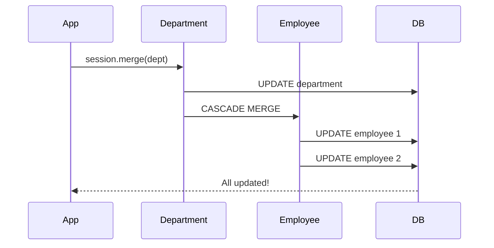

**Code Example:**
```java
@OneToMany(mappedBy = "department", cascade = CascadeType.MERGE)
private List<EmployeeBi> employees;

// Usage
dept.setDeptname("IT Department");
dept.getEmployees().get(0).setName("John Doe");

session.merge(dept); // Updates department AND employees!
```


### 🔥 CASCADE.REMOVE

**What it does:** When you delete Department, Employees are deleted automatically.

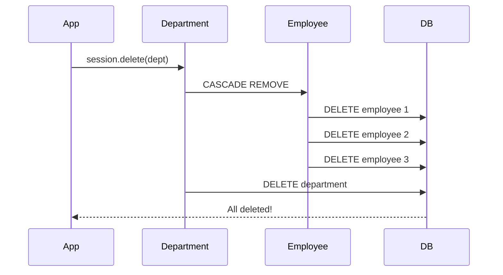

**Code Example:**
```java
@OneToMany(mappedBy = "department", cascade = CascadeType.REMOVE)
private List<EmployeeBi> employees;

// Usage
session.delete(dept); // Deletes department AND all employees!
```

**⚠️ Warning:** Use carefully! This will delete all child records.

### 🔥 CASCADE.REFRESH

**What it does:** When you refresh Department, Employees are refreshed from DB.

```mermaid
sequenceDiagram
    participant App
    participant Department
    participant Employee
    participant DB
    
    Note over Department: Data might be stale
    App->>Department: session.refresh(dept)
    Department->>DB: SELECT department
    DB-->>Department: Fresh data
    Department->>Employee: CASCADE REFRESH
    Employee->>DB: SELECT employees
    DB-->>Employee: Fresh data
    Employee-->>App: All refreshed!
```

**Code Example:**
```java
@OneToMany(mappedBy = "department", cascade = CascadeType.REFRESH)
private List<EmployeeBi> employees;

// Usage
session.refresh(dept); // Reloads department AND employees from DB!
```

### 🔥 CASCADE.DETACH

**What it does:** When you detach Department, Employees are detached from session.

```mermaid
graph TD
    A[Session] --> B[Department Attached]
    A --> C[Employees Attached]
    
    D[session.detach dept] --> E[Department Detached]
    D --> F[CASCADE DETACH]
    F --> G[Employees Detached]
    
    style B fill:#c8e6c9,stroke:#2e7d32,color:#000
    style C fill:#c8e6c9,stroke:#2e7d32,color:#000
    style E fill:#ffccbc,stroke:#d84315,color:#000
    style G fill:#ffccbc,stroke:#d84315,color:#000
```

**Code Example:**
```java
@OneToMany(mappedBy = "department", cascade = CascadeType.DETACH)
private List<EmployeeBi> employees;

// Usage
session.detach(dept); // Detaches department AND employees!
```


### 🔥 CASCADE.ALL

**What it does:** Applies ALL cascade types (PERSIST, MERGE, REMOVE, REFRESH, DETACH).

```mermaid
graph TD
    A[CASCADE.ALL] --> B[PERSIST]
    A --> C[MERGE]
    A --> D[REMOVE]
    A --> E[REFRESH]
    A --> F[DETACH]
    
    B --> G[Save cascades]
    C --> H[Update cascades]
    D --> I[Delete cascades]
    E --> J[Refresh cascades]
    F --> K[Detach cascades]
    
    style A fill:#e3f2fd,stroke:#1976d2,color:#000
    style B fill:#c8e6c9,stroke:#2e7d32,color:#000
    style C fill:#c8e6c9,stroke:#2e7d32,color:#000
    style D fill:#ffccbc,stroke:#d84315,color:#000
    style E fill:#fff3e0,stroke:#e65100,color:#000
    style F fill:#b2dfdb,stroke:#00695c,color:#000
```

**Code Example:**
```java
@OneToMany(mappedBy = "department", cascade = CascadeType.ALL, orphanRemoval = true)
private List<EmployeeBi> employees;

// Usage - Everything cascades!
session.save(dept);     // Saves employees
session.merge(dept);    // Updates employees
session.delete(dept);   // Deletes employees
session.refresh(dept);  // Refreshes employees
session.detach(dept);   // Detaches employees
```

### 🎯 orphanRemoval

**What it does:** Removes child entities that are no longer referenced by parent.

```mermaid
sequenceDiagram
    participant App
    participant Department
    participant Employee
    participant DB
    
    Note over Department: Has 3 employees
    App->>Department: dept.removeEmployee(emp2)
    Note over Department: Now has 2 employees
    App->>Department: session.update(dept)
    Department->>Employee: Check orphans
    Employee->>DB: DELETE employee 2 (orphan)
    DB-->>App: Orphan removed!
```

**Code Example:**
```java
@OneToMany(mappedBy = "department", cascade = CascadeType.ALL, orphanRemoval = true)
private List<EmployeeBi> employees;

// Usage
dept.removeEmployee(emp); // Employee is removed from list
session.update(dept);     // Employee is deleted from DB!
```

### 📊 Cascade Comparison

| Scenario | Without Cascade | With Cascade |
|----------|----------------|--------------|
| Save Department | Manual save each Employee | Auto-saves Employees |
| Update Department | Manual update each Employee | Auto-updates Employees |
| Delete Department | Manual delete each Employee | Auto-deletes Employees |
| Refresh Department | Manual refresh each Employee | Auto-refreshes Employees |
| Remove from List | Employee remains in DB | Employee deleted (orphanRemoval) |


### 💡 Best Practices

```mermaid
mindmap
  root((Cascade Best Practices))
    Use CASCADE.ALL
      For parent-child relationships
      When child cannot exist without parent
      Example: Department-Employee
    Use PERSIST only
      When you want to save together
      But delete separately
    Use REMOVE carefully
      Can delete many records
      Always test first
    Combine with orphanRemoval
      For true parent-child
      Automatic cleanup
    Avoid on Many-to-Many
      Can cause unexpected deletes
      Use carefully
```

**Golden Rules:**
1. Use `CASCADE.ALL` for true parent-child relationships
2. Always combine with `orphanRemoval = true` for cleanup
3. Use helper methods to maintain consistency
4. Test cascade operations thoroughly
5. Be careful with `REMOVE` - it deletes data!

---

<div align="center">

**🔥 Cascade = Automatic Propagation of Operations**

*© 2026 Avinash Dhanuka*

</div>

---

## 8. RUNNING THE APPLICATION

> **📝 Step-by-Step Guide by:** Avinash Dhanuka | © 2026

### 🎯 Prerequisites

```mermaid
graph LR
    A[Prerequisites] --> B[Java 11+]
    A --> C[MySQL 8.0+]
    A --> D[Maven]
    A --> E[IDE]
    
    style A fill:#e3f2fd,stroke:#1976d2,color:#000
    style B fill:#fff3e0,stroke:#e65100,color:#000
    style C fill:#e1f5fe,stroke:#0277bd,color:#000
    style D fill:#fce4ec,stroke:#c2185b,color:#000
    style E fill:#f3e5f5,stroke:#7b1fa2,color:#000
```

### 📝 Step 1: Database Setup

```sql
-- Create database
CREATE DATABASE hibernate_relationship3;

-- Use database
USE hibernate_relationship3;

-- Tables will be created automatically by Hibernate
```

### 📝 Step 2: Configure hibernate.cfg.xml

```xml
<hibernate-configuration>
    <session-factory>
        <property name="hibernate.connection.driver_class">com.mysql.cj.jdbc.Driver</property>
        <property name="hibernate.connection.url">jdbc:mysql://localhost:3306/hibernate_relationship3</property>
        <property name="hibernate.connection.username">root</property>
        <property name="hibernate.connection.password">your_password</property>
        
        <property name="hibernate.dialect">org.hibernate.dialect.MySQL8Dialect</property>
        <property name="hibernate.hbm2ddl.auto">update</property>
        <property name="hibernate.show_sql">true</property>
        <property name="hibernate.format_sql">true</property>
        
        <!-- Entity mappings -->
        <mapping class="org.example.unidirectional.Department"/>
        <mapping class="org.example.unidirectional.Employee"/>
        <mapping class="org.example.bidirectional.DepartmentBi"/>
        <mapping class="org.example.bidirectional.EmployeeBi"/>
    </session-factory>
</hibernate-configuration>
```


### 📝 Step 3: Run Unidirectional Demo

```bash
# Navigate to project directory
cd day06/HibernateRelationship3

# Run Unidirectional Demo
mvn exec:java -Dexec.mainClass="org.example.unidirectional.UnidirectionalDemo"
```

**Menu Options:**
```
--- MENU ---
1. Create Department
2. Create Employee
3. Display All Departments
4. Display All Employees
5. Exit
```

**Sample Flow:**
```
1. Create Department "IT" → ID: 10
2. Create Department "HR" → ID: 20
3. Create Employee "John" → Assign to Dept 10 → ID: 101
4. Create Employee "Jane" → Assign to Dept 10 → ID: 102
5. Display Employees → Shows John (IT), Jane (IT)
```

### 📝 Step 4: Run Bidirectional Demo

```bash
# Run Bidirectional Demo
mvn exec:java -Dexec.mainClass="org.example.bidirectional.BidirectionalDemo"
```

**Menu Options:**
```
--- MENU ---
1. Create Department
2. Create Employee
3. Display All Departments with Employees
4. Display All Employees
5. Exit
```

**Sample Flow:**
```
1. Create Department "IT" → ID: 10
2. Create Employee "John" → Assign to Dept 10 → ID: 101
3. Create Employee "Jane" → Assign to Dept 10 → ID: 102
4. Display Departments with Employees → Shows IT with John, Jane
```

### 🔄 Execution Flow

```mermaid
sequenceDiagram
    participant User
    participant App
    participant Hibernate
    participant MySQL
    
    User->>App: Run Demo
    App->>Hibernate: Initialize SessionFactory
    Hibernate->>MySQL: Create tables if not exist
    MySQL-->>Hibernate: Tables ready
    
    User->>App: Select menu option
    App->>Hibernate: Execute operation
    Hibernate->>MySQL: SQL query
    MySQL-->>Hibernate: Result
    Hibernate-->>App: Entity objects
    App-->>User: Display result
```

### 📊 Database Tables Created

```mermaid
erDiagram
    DEPARTMENT_UNI ||--o{ EMPLOYEE_UNI : "unidirectional"
    DEPARTMENT_BI ||--o{ EMPLOYEE_BI : "bidirectional"
    
    DEPARTMENT_UNI {
        bigint id PK
        varchar deptname
    }
    
    EMPLOYEE_UNI {
        bigint id PK
        varchar name
        bigint department_id FK
    }
    
    DEPARTMENT_BI {
        bigint id PK
        varchar deptname
    }
    
    EMPLOYEE_BI {
        bigint id PK
        varchar name
        bigint department_id FK
    }
```


### 💻 Expected Output

**Unidirectional Demo:**
```
=== Unidirectional Many-to-One Relationship Demo ===
Department IDs: Auto-generated (10, 20, 30...)
Employee IDs: Auto-generated (101, 102, 103...)

--- MENU ---
1. Create Department
2. Create Employee
3. Display All Departments
4. Display All Employees
5. Exit
Enter your choice: 1

Enter Department Name: IT
✓ Department created successfully with ID: 10

Enter your choice: 2
Enter Employee Name: John

Available Departments:
  ID: 10 - IT
Enter Department ID to assign: 10
✓ Employee created successfully with ID: 101
```

**Bidirectional Demo:**
```
=== Bidirectional Many-to-One Relationship Demo ===

--- MENU ---
1. Create Department
2. Create Employee
3. Display All Departments with Employees
4. Display All Employees
5. Exit
Enter your choice: 3

=== All Departments with Employees ===

Department [id=10, deptname=IT]
  Employees:
    - ID: 101, Name: John
    - ID: 102, Name: Jane
```

---

<div align="center">

**🚀 Both Implementations Running Successfully!**

*Setup Guide by Avinash Dhanuka | © 2026*

</div>

---

## 9. WHAT I LEARNED

> **📝 Personal Learning Journey by:** Avinash Dhanuka | © 2026

```mermaid
mindmap
  root((Day 06 Learning))
    Directionality
      Unidirectional
        One-way navigation
        Simpler code
        Employee → Department
      Bidirectional
        Two-way navigation
        More flexible
        Employee ↔ Department
    Many-to-One
      Multiple employees per department
      @ManyToOne annotation
      @JoinColumn for FK
      Owner side relationship
    Sequence Generators
      Custom ID generation
      initialValue parameter
      allocationSize parameter
      Department: 10, 20, 30
      Employee: 101, 102, 103
    Cascade Operations
      CASCADE.PERSIST
      CASCADE.MERGE
      CASCADE.REMOVE
      CASCADE.REFRESH
      CASCADE.DETACH
      CASCADE.ALL
      orphanRemoval
    Helper Methods
      addEmployee
      removeEmployee
      Maintain consistency
      Prevent bugs
    mappedBy
      Points to owner field
      Only in non-owner side
      Department uses it
      Employee doesn't
    Best Practices
      Use helper methods
      Test cascade carefully
      Choose right directionality
      Consistent naming
```


### 🎯 Key Takeaways

1. **Directionality Matters**
   - Unidirectional = Simple, one-way navigation
   - Bidirectional = Flexible, two-way navigation
   - Choose based on requirements, not complexity

2. **The Golden Rule**
   - Only ONE side has `@JoinColumn`
   - Other side uses `mappedBy`
   - Never put `@JoinColumn` on both sides

3. **Helper Methods are Essential**
   - Maintain consistency on both sides
   - Prevent data inconsistency bugs
   - Make code cleaner and safer

4. **Cascade is Powerful**
   - Automates operation propagation
   - Use `CASCADE.ALL` for parent-child
   - Combine with `orphanRemoval = true`
   - Test thoroughly before production

5. **Sequence Generators**
   - Custom ID generation strategies
   - Professional ID management
   - Easier debugging and organization

6. **Database Structure is Same**
   - Unidirectional and Bidirectional have same DB structure
   - Difference is only in Java code
   - Foreign key always in child table

### 💡 Real-World Applications

**Unidirectional Use Cases:**
- Employee → Department lookup
- Product → Category
- Order → Customer (simple)
- Comment → Post (read-only)

**Bidirectional Use Cases:**
- Department ↔ Employees (full management)
- Customer ↔ Orders (with cascade)
- Author ↔ Books
- Teacher ↔ Students

### 🔥 Interview-Ready Concepts

- Difference between Unidirectional and Bidirectional
- Why only one side has `@JoinColumn`
- What `mappedBy` does internally
- All CASCADE types and their uses
- When to use `orphanRemoval`
- How Sequence Generators work
- Helper methods importance

---

<div align="center">

**🎓 Mastered Unidirectional & Bidirectional Many-to-One Relationships!**

*Learning documented by Avinash Dhanuka | © 2026*

</div>

---

## 10. INTERVIEW QUESTIONS

> **📝 Comprehensive Q&A by:** Avinash Dhanuka | [GitHub](https://github.com/Avinash-706)

### ❓ Question 1: What is the difference between Unidirectional and Bidirectional Many-to-One?

**Answer:**

**Unidirectional:**
- Navigation only from Employee to Department
- Department doesn't have reference to Employees
- Simpler code, less memory
- Cannot get Employees from Department directly

**Bidirectional:**
- Navigation from both sides
- Department has List of Employees
- More complex, more memory
- Can get Employees from Department

**Code Difference:**
```java
// Unidirectional - Department has NO employees field
@Entity
public class Department {
    @Id
    private Long id;
    private String deptname;
}

// Bidirectional - Department HAS employees field
@Entity
public class DepartmentBi {
    @Id
    private Long id;
    private String deptname;
    
    @OneToMany(mappedBy = "department")
    private List<EmployeeBi> employees;
}
```

**Database:** Both have SAME structure! Difference is only in Java code.


---

### ❓ Question 2: Why can only ONE side have @JoinColumn in Bidirectional?

**Answer:**

**Reason:** Hibernate needs to know which side controls the foreign key.

**What happens if both have @JoinColumn:**
```java
// ❌ WRONG - Both sides have @JoinColumn
@Entity
public class Employee {
    @ManyToOne
    @JoinColumn(name = "department_id")  // ❌
    private Department department;
}

@Entity
public class Department {
    @OneToMany
    @JoinColumn(name = "department_id")  // ❌
    private List<Employee> employees;
}

// Result: AnnotationException - Hibernate is confused!
```

**Correct Way:**
```java
// ✅ CORRECT - Only Employee has @JoinColumn
@Entity
public class Employee {
    @ManyToOne
    @JoinColumn(name = "department_id")  // ✅ Owner side
    private Department department;
}

@Entity
public class Department {
    @OneToMany(mappedBy = "department")  // ✅ Points to Employee's field
    private List<Employee> employees;
}
```

**Rule:** Owner side (Many side) has `@JoinColumn`, other side uses `mappedBy`.

---

### ❓ Question 3: What does mappedBy do internally?

**Answer:**

**mappedBy** tells Hibernate: "Don't create a new column, use the existing one from the other side."

**Without mappedBy:**
```java
@OneToMany
private List<Employee> employees;

// Hibernate creates a JOIN TABLE:
// department_employee (department_id, employee_id)
```

**With mappedBy:**
```java
@OneToMany(mappedBy = "department")
private List<Employee> employees;

// Hibernate uses existing FK in employee table:
// employee (id, name, department_id)
```

**How it works:**
1. Hibernate sees `mappedBy = "department"`
2. Looks for field named "department" in Employee
3. Finds `@JoinColumn(name = "department_id")`
4. Uses that column for the relationship
5. No extra table created!

**Interview Tip:** mappedBy = "field name in the other entity"

---

### ❓ Question 4: Explain all CASCADE types with examples.

**Answer:**

**1. CASCADE.PERSIST** - Save child when parent is saved
```java
dept.addEmployee(new Employee("John"));
session.save(dept); // Saves department AND John
```

**2. CASCADE.MERGE** - Update child when parent is updated
```java
dept.setDeptname("IT Dept");
session.merge(dept); // Updates department AND employees
```

**3. CASCADE.REMOVE** - Delete child when parent is deleted
```java
session.delete(dept); // Deletes department AND all employees
```

**4. CASCADE.REFRESH** - Reload child when parent is refreshed
```java
session.refresh(dept); // Reloads department AND employees from DB
```

**5. CASCADE.DETACH** - Detach child when parent is detached
```java
session.detach(dept); // Detaches department AND employees from session
```

**6. CASCADE.ALL** - All of the above
```java
@OneToMany(mappedBy = "department", cascade = CascadeType.ALL)
private List<Employee> employees;
```

**Interview Tip:** CASCADE.ALL = PERSIST + MERGE + REMOVE + REFRESH + DETACH

---

### ❓ Question 5: What is orphanRemoval and when to use it?

**Answer:**

**orphanRemoval** = Automatically delete child entities that are no longer referenced by parent.

**Without orphanRemoval:**
```java
@OneToMany(mappedBy = "department", cascade = CascadeType.ALL)
private List<Employee> employees;

dept.removeEmployee(emp); // Removes from list
session.update(dept);     // Employee still in DB! (orphan)
```

**With orphanRemoval:**
```java
@OneToMany(mappedBy = "department", cascade = CascadeType.ALL, orphanRemoval = true)
private List<Employee> employees;

dept.removeEmployee(emp); // Removes from list
session.update(dept);     // Employee deleted from DB! ✅
```

**When to use:**
- True parent-child relationships
- Child cannot exist without parent
- Example: Department-Employee, Order-OrderItem

**When NOT to use:**
- Child can exist independently
- Shared relationships
- Example: Student-Course (student can exist without course)

**Interview Tip:** orphanRemoval = true means "delete child if removed from parent's collection"


---

### ❓ Question 6: Why use helper methods in Bidirectional relationships?

**Answer:**

**Problem without helper methods:**
```java
// ❌ Inconsistent state
dept.getEmployees().add(emp);  // Department knows Employee
// But emp.getDepartment() is null! // Employee doesn't know Department

// OR

emp.setDepartment(dept);       // Employee knows Department
// But dept.getEmployees() is empty! // Department doesn't know Employee
```

**Solution with helper methods:**
```java
// ✅ Consistent state
public void addEmployee(Employee emp) {
    employees.add(emp);        // Department knows Employee
    emp.setDepartment(this);   // Employee knows Department
}

// Usage
dept.addEmployee(emp); // Both sides updated automatically!
```

**Benefits:**
1. Maintains consistency on both sides
2. Prevents bugs and data inconsistency
3. Cleaner, more maintainable code
4. Single point of control
5. Easier to test

**Interview Tip:** Helper methods are ESSENTIAL for Bidirectional relationships to maintain consistency.

---

### ❓ Question 7: How do Sequence Generators work in Hibernate?

**Answer:**

**Sequence Generator** = Custom ID generation strategy with configurable start and increment.

**Configuration:**
```java
@Id
@GeneratedValue(strategy = GenerationType.SEQUENCE, generator = "dept_seq")
@SequenceGenerator(
    name = "dept_seq",        // Generator name
    initialValue = 10,        // Start from 10
    allocationSize = 10       // Increment by 10
)
private Long id;
```

**How it works:**
1. First entity: ID = 10
2. Second entity: ID = 10 + 10 = 20
3. Third entity: ID = 20 + 10 = 30
4. And so on...

**Parameters:**
- `name`: Unique generator name
- `initialValue`: Starting value (default: 1)
- `allocationSize`: Increment step (default: 50)
- `sequenceName`: Database sequence name (optional)

**Real-World Example:**
```java
// Department: 10, 20, 30, 40...
@SequenceGenerator(name = "dept_seq", initialValue = 10, allocationSize = 10)

// Employee: 101, 102, 103, 104...
@SequenceGenerator(name = "emp_seq", initialValue = 101, allocationSize = 1)
```

**Benefits:**
- Meaningful IDs
- Easy to identify entity type
- Room for manual insertions
- Professional appearance

**Interview Tip:** allocationSize is the increment, NOT the total number of IDs!

---

### ❓ Question 8: When to use Unidirectional vs Bidirectional?

**Answer:**

**Use Unidirectional when:**
- Only need to navigate from child to parent
- Simpler code is priority
- Memory optimization matters
- Read-only operations
- Example: Comment → Post (just need to know which post)

**Use Bidirectional when:**
- Need to navigate from both sides
- Full CRUD operations required
- Cascade operations needed
- Complex business logic
- Example: Department ↔ Employees (need to manage both)

**Decision Matrix:**

| Requirement | Unidirectional | Bidirectional |
|-------------|---------------|---------------|
| Get parent from child | ✅ | ✅ |
| Get children from parent | ❌ (need HQL) | ✅ |
| Cascade operations | Limited | Full |
| Code complexity | Simple | Complex |
| Memory usage | Lower | Higher |
| Maintenance | Easier | Requires care |

**Interview Tip:** Choose based on navigation needs, not complexity!

---

### ❓ Question 9: What's the difference between CASCADE.REMOVE and orphanRemoval?

**Answer:**

**CASCADE.REMOVE:**
- Triggered when parent is DELETED
- Deletes all children
- Explicit delete operation

```java
@OneToMany(mappedBy = "department", cascade = CascadeType.REMOVE)
private List<Employee> employees;

session.delete(dept); // Deletes department AND all employees
```

**orphanRemoval:**
- Triggered when child is REMOVED from collection
- Deletes only orphaned children
- Implicit delete operation

```java
@OneToMany(mappedBy = "department", orphanRemoval = true)
private List<Employee> employees;

dept.removeEmployee(emp); // Removes from list
session.update(dept);     // Deletes emp from DB
```

**Key Differences:**

| Aspect | CASCADE.REMOVE | orphanRemoval |
|--------|---------------|---------------|
| **Trigger** | Parent deleted | Child removed from collection |
| **Scope** | All children | Only orphaned children |
| **Operation** | Explicit delete | Implicit delete |
| **Use Case** | Delete entire hierarchy | Remove specific child |

**Combined Usage:**
```java
@OneToMany(mappedBy = "department", 
           cascade = CascadeType.ALL, 
           orphanRemoval = true)
private List<Employee> employees;

// Now both work:
session.delete(dept);        // CASCADE.REMOVE deletes all
dept.removeEmployee(emp);    // orphanRemoval deletes emp
```

**Interview Tip:** CASCADE.REMOVE = delete parent → delete children. orphanRemoval = remove from list → delete child.


---

### ❓ Question 10: Explain the complete flow of Bidirectional relationship with code.

**Answer:**

**Complete Flow:**

**Step 1: Entity Setup**
```java
// Employee (Owner side)
@Entity
public class Employee {
    @Id
    @GeneratedValue(strategy = GenerationType.SEQUENCE, generator = "emp_seq")
    @SequenceGenerator(name = "emp_seq", initialValue = 101, allocationSize = 1)
    private Long id;
    
    private String name;
    
    @ManyToOne
    @JoinColumn(name = "department_id")
    private Department department;
    
    // Getters, Setters
}

// Department (Non-owner side)
@Entity
public class Department {
    @Id
    @GeneratedValue(strategy = GenerationType.SEQUENCE, generator = "dept_seq")
    @SequenceGenerator(name = "dept_seq", initialValue = 10, allocationSize = 10)
    private Long id;
    
    private String deptname;
    
    @OneToMany(mappedBy = "department", cascade = CascadeType.ALL, orphanRemoval = true)
    private List<Employee> employees = new ArrayList<>();
    
    // Helper methods
    public void addEmployee(Employee emp) {
        employees.add(emp);
        emp.setDepartment(this);
    }
    
    public void removeEmployee(Employee emp) {
        employees.remove(emp);
        emp.setDepartment(null);
    }
    
    // Getters, Setters
}
```

**Step 2: Create and Save**
```java
Session session = sessionFactory.openSession();
Transaction tx = session.beginTransaction();

// Create Department
Department dept = new Department("IT");
session.save(dept); // ID = 10

// Create Employees
Employee emp1 = new Employee("John");
Employee emp2 = new Employee("Jane");

// Use helper method
dept.addEmployee(emp1); // Sets both sides
dept.addEmployee(emp2);

session.update(dept); // Cascade saves employees
tx.commit();

// Result:
// department: id=10, deptname='IT'
// employee: id=101, name='John', department_id=10
// employee: id=102, name='Jane', department_id=10
```

**Step 3: Navigate Both Ways**
```java
// From Employee to Department
System.out.println(emp1.getDepartment().getDeptname()); // "IT"

// From Department to Employees
for (Employee emp : dept.getEmployees()) {
    System.out.println(emp.getName()); // "John", "Jane"
}
```

**Step 4: Remove Employee**
```java
dept.removeEmployee(emp1); // Removes from list
session.update(dept);      // orphanRemoval deletes from DB
tx.commit();

// Result: emp1 deleted from database
```

**Interview Tip:** Always use helper methods, always use cascade, always test both navigation directions!

---

<div align="center">

<br>
**© 2026 Avinash Dhanuka**

*This comprehensive guide was crafted with ❤️ by Avinash Dhanuka*

</div>
