# ☕ Hibernate Many-to-Many: Unidirectional vs Bidirectional

<div align="center">


</div>

<hr style="border: 1px solid rgb(98, 117, 187)">

<div align="center">
<table>
<tr>
<td align="center">
<br />

<br>
<h3>© 2026 Avinash Dhanuka</h3>
<p>Mastering Unidirectional & Bidirectional Many-to-Many Relationships</p>
<p><em>Crafted with ❤️ for Understanding Complex Relationships</em></p>

<a href="https://github.com/Avinash-706" target="_blank">

</a>
<br />
<a href="https://mail.google.com/mail/?view=cm&fs=1&to=avunashdhanuka@gmail.com&su=Hibernate%20Relationships%20Query&body=☕%20Hello%20Avinash,%0D%0A%0D%0AMy%20name%20is%20[Your%20Name]%20and%20I%20have%20a%20doubt%20regarding%20Hibernate%20Relationships.%0D%0A%0D%0A🔹%20Topic:%20[Many-to-Many]%0D%0A%0D%0AThank%20you!" target="_blank">

</a>
<br />
<br />
</td>
</tr>
</table>
</div>

> **Learning Note:** This guide demonstrates BOTH Unidirectional and Bidirectional Many-to-Many relationships using Student-Course example!

> **Prerequisites:** 
> - Complete understanding of [Many-to-One Relationships](../HibernateRelationship3/README.md)
> - MySQL Server installed and running
> - Understanding of Join Tables

---

## 📑 Table of Contents
1. [What's New?](#1-whats-new)
2. [Understanding Many-to-Many](#2-understanding-many-to-many)
3. [Join Tables Explained](#3-join-tables-explained)
4. [Unidirectional Many-to-Many](#4-unidirectional-many-to-many)
5. [Bidirectional Many-to-Many](#5-bidirectional-many-to-many)
6. [Key Differences](#6-key-differences)
7. [Cascade Operations](#7-cascade-operations)
8. [LAZY vs EAGER Loading](#8-lazy-vs-eager-loading)
9. [Running the Application](#9-running-the-application)
10. [What I Learned](#10-what-i-learned)
11. [Interview Questions](#11-interview-questions)

---

## 1. WHAT'S NEW?

> **📝 Author:** Avinash Dhanuka | [GitHub](https://github.com/Avinash-706)

### 🎯 The Most Complex Relationship

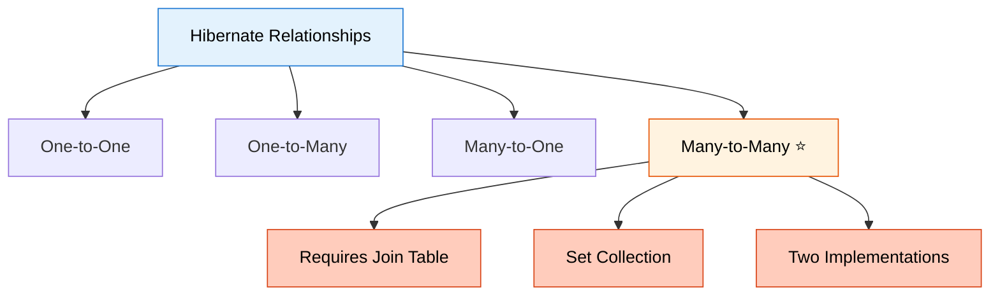


### 📊 What We're Building

A **Student-Course Management System** with TWO implementations:

**Unidirectional:**
- Student knows Courses
- Course doesn't know Students
- One-way navigation only
- Simpler implementation

**Bidirectional:**
- Student knows Courses
- Course knows Students
- Two-way navigation
- More flexible

### 🎯 Special Features

- **Join Table** for Many-to-Many mapping
- **Set Collection** (no duplicates)
- **Two separate implementations** in one project
- **Interactive demos** for both types
- **Separate tables** for each implementation

### 🔥 Why Many-to-Many is Special

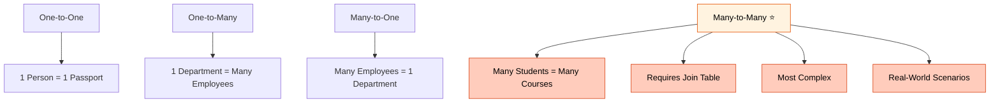

---

<div align="center">

**📚 Learning Path Progress**

One-to-One ✅ → One-to-Many ✅ → Many-to-One ✅ → **Many-to-Many** ✅

*Created by Avinash Dhanuka | © 2026*

</div>

---

## 2. UNDERSTANDING MANY-TO-MANY

> **📝 Comprehensive Guide by:** Avinash Dhanuka | © 2026

### 🎯 What is Many-to-Many?

**Many-to-Many** = Multiple entities on BOTH sides can be associated with multiple entities on the OTHER side.

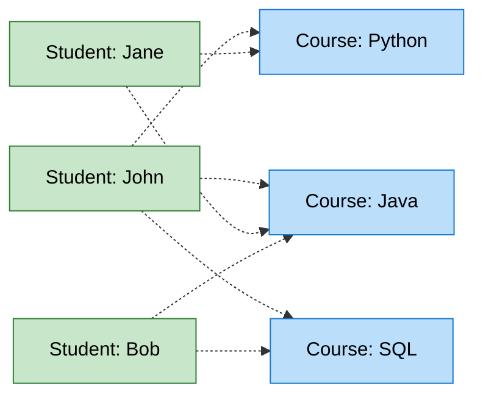

**Real-World Examples:**
- Students ↔ Courses (One student takes many courses, one course has many students)
- Authors ↔ Books (One author writes many books, one book can have many authors)
- Actors ↔ Movies (One actor acts in many movies, one movie has many actors)
- Products ↔ Categories (One product in many categories, one category has many products)


### 📊 Comparison with Other Relationships

| Relationship | Left Side | Right Side | Example |
|--------------|-----------|------------|---------|
| **One-to-One** | 1 entity | 1 entity | Person ↔ Passport |
| **One-to-Many** | 1 entity | Many entities | Department → Employees |
| **Many-to-One** | Many entities | 1 entity | Employees → Department |
| **Many-to-Many** | Many entities | Many entities | Students ↔ Courses |

### 🔍 Why Can't We Use Foreign Key Directly?

**Problem with Foreign Key:**

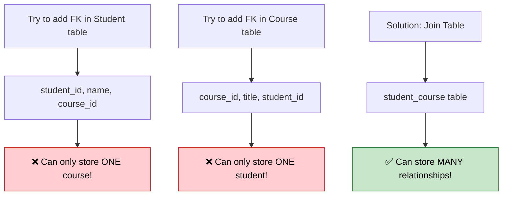

**Solution:** We need a JOIN TABLE (also called junction table or bridge table)!

### 💡 The Join Table Concept

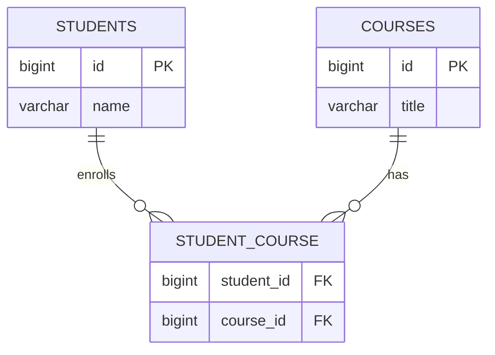

**How it works:**
1. Student table stores student data
2. Course table stores course data
3. Join table stores relationships (which student enrolled in which course)

---

<div align="center">

**🎓 Many-to-Many Always Requires a Join Table**

*Guide by Avinash Dhanuka | © 2026*

</div>

---

## 3. JOIN TABLES EXPLAINED

> **📝 Author:** Avinash Dhanuka | [Contact via Gmail](mailto:avunashdhanuka@gmail.com)

### 🎯 What is a Join Table?

**Join Table** = A separate table that stores the relationships between two entities in a Many-to-Many relationship.

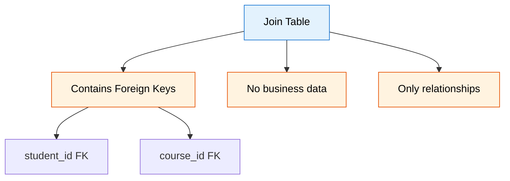


### 📊 Join Table Structure

**Example Data:**

**Students Table:**
| id | name |
|----|------|
| 1  | John |
| 2  | Jane |
| 3  | Bob  |

**Courses Table:**
| id | title  |
|----|--------|
| 1  | Java   |
| 2  | Python |
| 3  | SQL    |

**Student_Course Join Table:**
| student_id | course_id |
|------------|-----------|
| 1          | 1         | (John enrolled in Java)
| 1          | 2         | (John enrolled in Python)
| 2          | 1         | (Jane enrolled in Java)
| 2          | 3         | (Jane enrolled in SQL)
| 3          | 1         | (Bob enrolled in Java)

### 🔄 How Join Table Works

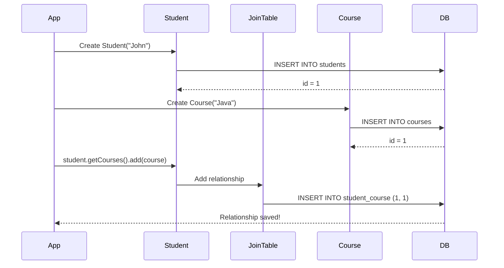

### 💻 @JoinTable Annotation

```java
@ManyToMany
@JoinTable(
    name = "student_course",              // Join table name
    joinColumns = @JoinColumn(name = "student_id"),        // FK to Student
    inverseJoinColumns = @JoinColumn(name = "course_id")   // FK to Course
)
private Set<Course> courses = new HashSet<>();
```

**Parameters Explained:**

| Parameter | Description | Example |
|-----------|-------------|---------|
| `name` | Join table name | "student_course" |
| `joinColumns` | FK column for owning side | "student_id" |
| `inverseJoinColumns` | FK column for inverse side | "course_id" |

### 🎯 Why Set Instead of List?

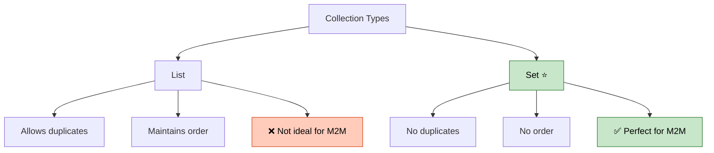

**Why Set?**
- Prevents duplicate enrollments (John can't enroll in Java twice)
- Better performance for Many-to-Many
- Matches database constraint (composite PK prevents duplicates)


### 🔥 Join Table Best Practices

**DO:**
- Use meaningful table names (student_course, not sc)
- Use Set collection type
- Define composite primary key (student_id + course_id)
- Keep join table simple (only FKs)

**DON'T:**
- Add business data to join table (use separate entity instead)
- Use List for Many-to-Many
- Forget to define both FKs
- Make join table name too long

---

<div align="center">

**🔗 Join Tables = The Bridge Between Many-to-Many Entities**

*© 2026 Avinash Dhanuka*

</div>

---

## 4. UNIDIRECTIONAL MANY-TO-MANY

> **📝 Author:** Avinash Dhanuka | [GitHub](https://github.com/Avinash-706)

### 🎯 What is Unidirectional Many-to-Many?

**Many Students → Many Courses** (One-way navigation)

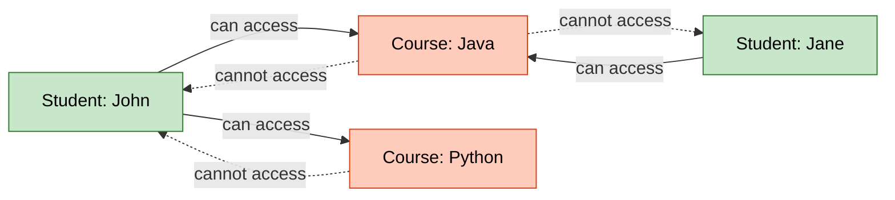

**Key Point:** Student can get Courses, but Course CANNOT get Students!

### 🏗️ Database Structure

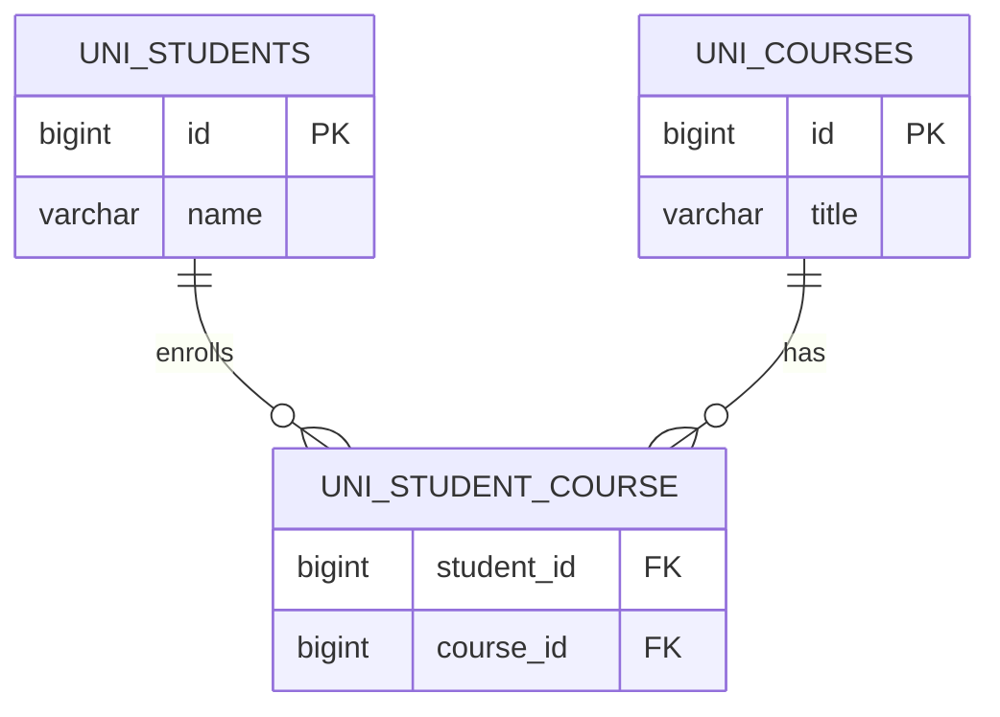

### 📝 Entity Classes

#### Student.java (Unidirectional)

```java
@Entity(name = "UniStudent")
@Table(name = "uni_students")
public class Student {
    
    @Id
    @GeneratedValue(strategy = GenerationType.IDENTITY)
    private Long id;
    
    private String name;
    
    // UNIDIRECTIONAL: Only Student knows about Course
    @ManyToMany
    @JoinTable(
        name = "uni_student_course",
        joinColumns = @JoinColumn(name = "student_id"),
        inverseJoinColumns = @JoinColumn(name = "course_id")
    )
    private Set<Course> courses = new HashSet<>();
    
    // Constructors, Getters, Setters
}
```

**Key Points:**
- `@ManyToMany` annotation
- `@JoinTable` defines join table structure
- `Set<Course>` collection (no duplicates)
- Course has NO reference to Student


#### Course.java (Unidirectional)

```java
@Entity(name = "UniCourse")
@Table(name = "uni_courses")
public class Course {
    
    @Id
    @GeneratedValue(strategy = GenerationType.IDENTITY)
    private Long id;
    
    private String title;
    
    // UNIDIRECTIONAL: Course does NOT have any reference to Student
    // NO Set<Student> field!
    
    // Constructors, Getters, Setters
}
```

**Key Points:**
- Simple entity with no relationship mapping
- No reference to Student
- Cannot navigate to Students from Course

### 🔄 How It Works

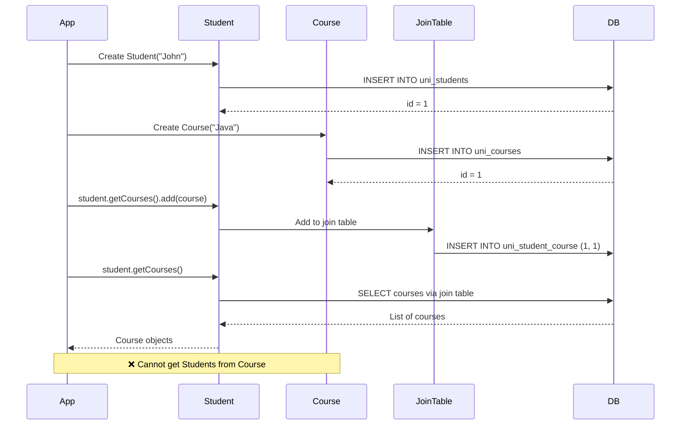

### 💻 Usage Example

```java
Session session = sessionFactory.openSession();
Transaction tx = session.beginTransaction();

// Create Student
Student john = new Student("John");

// Create Courses
Course java = new Course("Java");
Course python = new Course("Python");

// Add courses to student (Unidirectional)
john.getCourses().add(java);
john.getCourses().add(python);

// Save
session.persist(john);
session.persist(java);
session.persist(python);

tx.commit();

// ✅ Can navigate from Student to Courses
System.out.println("John's courses:");
for (Course c : john.getCourses()) {
    System.out.println("  - " + c.getTitle());
}

// ❌ Cannot navigate from Course to Students
// java.getStudents() - Method doesn't exist!
```

### ⚡ Advantages & Disadvantages

**✅ Advantages:**
- Simpler code structure
- Less memory overhead
- Easier to maintain
- Clear ownership
- Faster for simple queries

**❌ Disadvantages:**
- Cannot get Students from Course
- Need HQL for reverse queries
- Limited flexibility
- One-way operations only


### 📊 Memory Representation

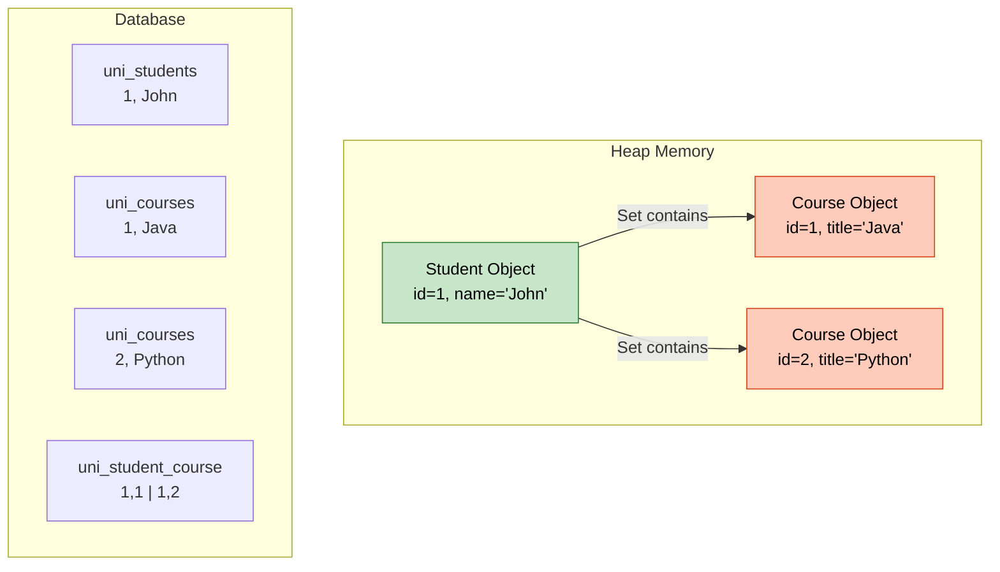

---

<div align="center">

**🔥 Unidirectional = Simple One-Way Navigation**

*© 2026 Avinash Dhanuka*

</div>

---

## 5. BIDIRECTIONAL MANY-TO-MANY

> **📝 Comprehensive Guide by:** Avinash Dhanuka | © 2026

### 🎯 What is Bidirectional Many-to-Many?

**Many Students ↔ Many Courses** (Two-way navigation)

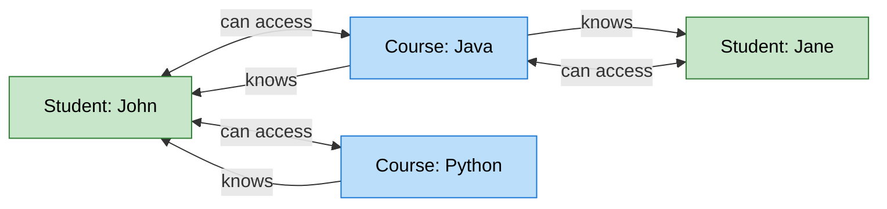

**Key Point:** Student can get Courses AND Course can get Students!

### 🏗️ Database Structure

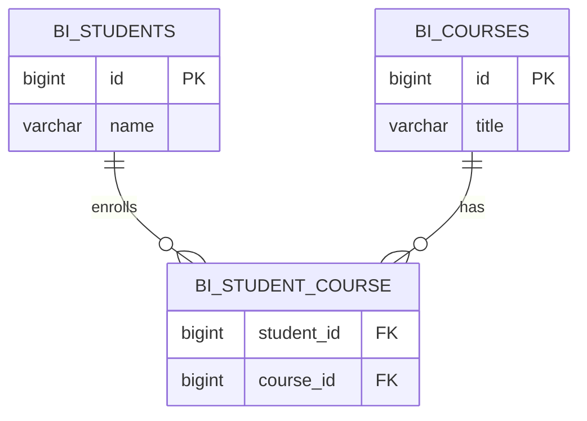

**Note:** Database structure is SAME as Unidirectional! The difference is in Java code only.

### 📝 Entity Classes

#### Student.java (Bidirectional - Owner Side)

```java
@Entity(name = "BiStudent")
@Table(name = "bi_students")
public class Student {
    
    @Id
    @GeneratedValue(strategy = GenerationType.IDENTITY)
    private Long id;
    
    private String name;
    
    // BIDIRECTIONAL: Student knows about Course (owning side)
    @ManyToMany
    @JoinTable(
        name = "bi_student_course",
        joinColumns = @JoinColumn(name = "student_id"),
        inverseJoinColumns = @JoinColumn(name = "course_id")
    )
    private Set<Course> courses = new HashSet<>();
    
    // Constructors, Getters, Setters
}
```

**Key Points:**
- `@ManyToMany` with `@JoinTable`
- Owner side (controls join table)
- Defines join table structure


#### Course.java (Bidirectional - Inverse Side)

```java
@Entity(name = "BiCourse")
@Table(name = "bi_courses")
public class Course {
    
    @Id
    @GeneratedValue(strategy = GenerationType.IDENTITY)
    private Long id;
    
    private String title;
    
    // BIDIRECTIONAL: Course has reference back to Student
    // mappedBy indicates this is the inverse side
    @ManyToMany(mappedBy = "courses")
    private Set<Student> students = new HashSet<>();
    
    // Constructors, Getters, Setters
}
```

**Key Points:**
- `@ManyToMany(mappedBy = "courses")`
- Inverse side (doesn't control join table)
- Points to Student's field name
- No `@JoinTable` annotation

### 🎯 The Golden Rule of Bidirectional Many-to-Many

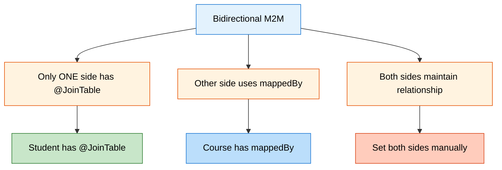

**Why This Rule?**

If you add `@JoinTable` on BOTH sides:
- 💥 Hibernate creates TWO join tables
- 💥 Data inconsistency
- 💥 Confusion about ownership

### 🔄 How It Works

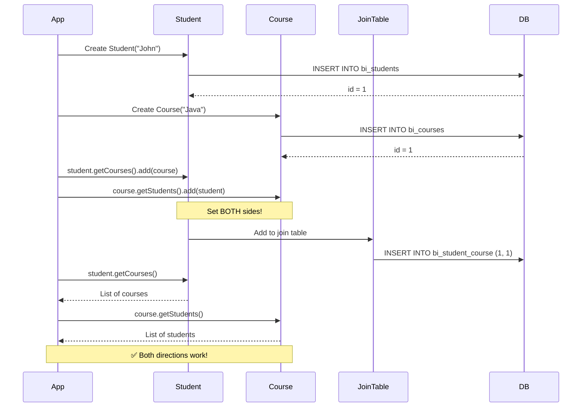


### 💻 Usage Example

```java
Session session = sessionFactory.openSession();
Transaction tx = session.beginTransaction();

// Create Student
Student john = new Student("John");

// Create Courses
Course java = new Course("Java");
Course python = new Course("Python");

// BIDIRECTIONAL: Set BOTH sides of the relationship
john.getCourses().add(java);
john.getCourses().add(python);

java.getStudents().add(john);
python.getStudents().add(john);

// Save
session.persist(john);
session.persist(java);
session.persist(python);

tx.commit();

// ✅ Navigate from Student to Courses
System.out.println("John's courses:");
for (Course c : john.getCourses()) {
    System.out.println("  - " + c.getTitle());
}

// ✅ Navigate from Course to Students
System.out.println("Java course students:");
for (Student s : java.getStudents()) {
    System.out.println("  - " + s.getName());
}
```

### 🔥 Why Set Both Sides Manually?

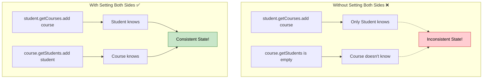

**Important:** In Many-to-Many Bidirectional, you MUST set both sides manually! Unlike One-to-Many, there are no helper methods in the entities.

### ⚡ Advantages & Disadvantages

**✅ Advantages:**
- Two-way navigation
- Full flexibility
- Can query from both sides
- Better for complex operations
- More intuitive

**❌ Disadvantages:**
- More complex code
- Higher memory usage
- Must maintain both sides
- Risk of inconsistency
- More maintenance

---

<div align="center">

**🎓 Bidirectional = Full Control with Two-Way Navigation**

*Crafted by Avinash Dhanuka | © 2026*

</div>

---

## 6. KEY DIFFERENCES

> **📝 Comprehensive Comparison by:** Avinash Dhanuka | © 2026

### 📊 Unidirectional vs Bidirectional

| Aspect | Unidirectional | Bidirectional |
|--------|---------------|---------------|
| **Navigation** | Student → Course only | Student ↔ Course |
| **@JoinTable** | In Student | In Student (owner) |
| **@ManyToMany** | In Student only | In both entities |
| **mappedBy** | Not needed | Required in Course |
| **Set Both Sides** | Not needed | Required manually |
| **Code Complexity** | Simple | More complex |
| **Memory Usage** | Lower | Higher |
| **Query Flexibility** | Limited | High |
| **Use Case** | Simple lookups | Full management |
| **Maintenance** | Easier | Requires care |


### 🎯 Code Comparison

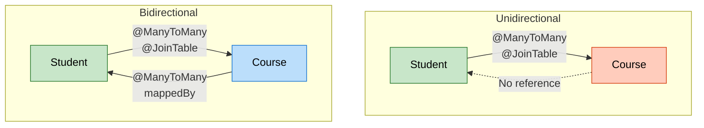

### 💻 Side-by-Side Code

**Unidirectional:**
```java
// Student - Has reference to Course
@Entity
public class Student {
    @Id
    private Long id;
    private String name;
    
    @ManyToMany
    @JoinTable(
        name = "student_course",
        joinColumns = @JoinColumn(name = "student_id"),
        inverseJoinColumns = @JoinColumn(name = "course_id")
    )
    private Set<Course> courses = new HashSet<>();
}

// Course - NO reference to Student
@Entity
public class Course {
    @Id
    private Long id;
    private String title;
    // No students field!
}
```

**Bidirectional:**
```java
// Student - Has reference to Course (Owner)
@Entity
public class Student {
    @Id
    private Long id;
    private String name;
    
    @ManyToMany
    @JoinTable(
        name = "student_course",
        joinColumns = @JoinColumn(name = "student_id"),
        inverseJoinColumns = @JoinColumn(name = "course_id")
    )
    private Set<Course> courses = new HashSet<>();
}

// Course - Has reference to Student (Inverse)
@Entity
public class Course {
    @Id
    private Long id;
    private String title;
    
    @ManyToMany(mappedBy = "courses")
    private Set<Student> students = new HashSet<>();
}
```

### 🔍 Operation Comparison

```mermaid
graph TD
    subgraph "Unidirectional Operations"
    U1[Create Student & Course] --> U2[Add course to student]
    U2 --> U3[Save both]
    U3 --> U4[✅ Get Courses from Student]
    U4 --> U5[❌ Cannot get Students from Course]
    end
    
    subgraph "Bidirectional Operations"
    B1[Create Student & Course] --> B2[Add course to student]
    B2 --> B3[Add student to course]
    B3 --> B4[Save both]
    B4 --> B5[✅ Get Courses from Student]
    B5 --> B6[✅ Get Students from Course]
    end
    
    style U5 fill:#ffcdd2,stroke:#c62828,color:#000
    style B6 fill:#c8e6c9,stroke:#2e7d32,color:#000
```

### 🎯 Decision Matrix

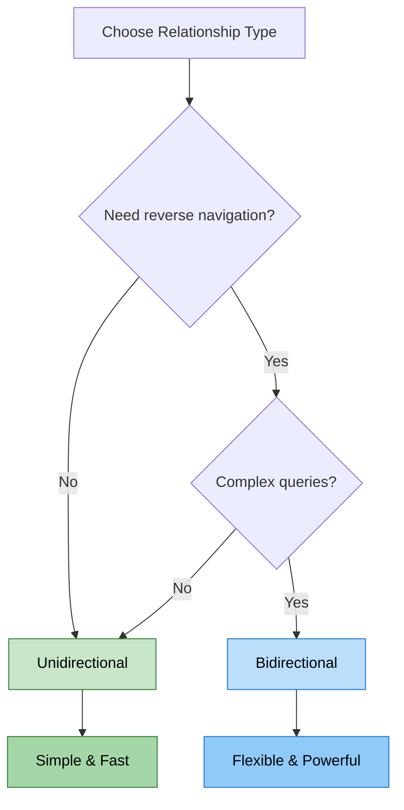

---

<div align="center">

**🎓 Choose Based on Navigation Needs**

*Guide by Avinash Dhanuka | © 2026*

</div>

---

## 7. CASCADE OPERATIONS

> **📝 Detailed Guide by:** Avinash Dhanuka | [Contact](mailto:avunashdhanuka@gmail.com)

### 🎯 What is Cascade in Many-to-Many?

**Cascade** = Propagating operations from one entity to related entities automatically.

```mermaid
graph LR
    A[Student Operation] -->|CASCADE| B[Automatically applies to]
    B --> C[Course 1]
    B --> D[Course 2]
    B --> E[Course 3]
    
    style A fill:#e3f2fd,stroke:#1976d2,color:#000
    style B fill:#fff3e0,stroke:#e65100,color:#000
    style C fill:#bbdefb,stroke:#1976d2,color:#000
    style D fill:#bbdefb,stroke:#1976d2,color:#000
    style E fill:#bbdefb,stroke:#1976d2,color:#000
```

### ⚠️ CASCADE WARNING for Many-to-Many

```mermaid
graph TD
    A[CASCADE in M2M] --> B[⚠️ Use with EXTREME CAUTION]
    B --> C[Can delete shared entities]
    B --> D[Affects multiple relationships]
    B --> E[Unexpected data loss]
    
    style A fill:#fff3e0,stroke:#e65100,color:#000
    style B fill:#ffcdd2,stroke:#c62828,color:#000
    style C fill:#ffcdd2,stroke:#c62828,color:#000
    style D fill:#ffcdd2,stroke:#c62828,color:#000
    style E fill:#ffcdd2,stroke:#c62828,color:#000
```

**Why Dangerous?**

Imagine:
- John enrolled in Java course
- Jane also enrolled in Java course
- If you delete John with CASCADE.REMOVE
- Java course gets deleted!
- Jane loses her course too! 💥

### 📊 Cascade Types

| Cascade Type | Safe for M2M? | Description |
|--------------|---------------|-------------|
| **PERSIST** | ✅ Safe | Save related entities |
| **MERGE** | ✅ Safe | Update related entities |
| **REMOVE** | ❌ DANGEROUS | Delete related entities |
| **REFRESH** | ✅ Safe | Reload related entities |
| **DETACH** | ✅ Safe | Detach related entities |
| **ALL** | ❌ DANGEROUS | All operations (includes REMOVE) |

### 🔥 CASCADE.PERSIST (Safe)

**What it does:** When you save Student, Courses are saved automatically.

```java
@ManyToMany(cascade = CascadeType.PERSIST)
@JoinTable(
    name = "student_course",
    joinColumns = @JoinColumn(name = "student_id"),
    inverseJoinColumns = @JoinColumn(name = "course_id")
)
private Set<Course> courses = new HashSet<>();

// Usage
Student john = new Student("John");
Course java = new Course("Java");
john.getCourses().add(java);

session.persist(john); // Saves john AND java automatically!
```

**Safe because:** Only saves new entities, doesn't delete anything.

### 🔥 CASCADE.MERGE (Safe)

**What it does:** When you update Student, Courses are updated automatically.

```java
@ManyToMany(cascade = CascadeType.MERGE)
private Set<Course> courses = new HashSet<>();

// Usage
john.setName("John Doe");
john.getCourses().iterator().next().setTitle("Advanced Java");

session.merge(john); // Updates john AND course!
```

**Safe because:** Only updates existing entities, doesn't delete anything.

### 🔥 CASCADE.REMOVE (DANGEROUS!)

**What it does:** When you delete Student, Courses are deleted automatically.

```java
@ManyToMany(cascade = CascadeType.REMOVE)
private Set<Course> courses = new HashSet<>();

// Usage
session.delete(john); // Deletes john AND all his courses!
```

**DANGEROUS because:**
```mermaid
sequenceDiagram
    participant App
    participant John
    participant Java
    participant Jane
    participant DB
    
    Note over John,Java: John enrolled in Java
    Note over Jane,Java: Jane also enrolled in Java
    
    App->>John: session.delete(john)
    John->>Java: CASCADE.REMOVE
    Java->>DB: DELETE Java course
    
    Note over Jane: Jane loses Java course! 💥
    Jane->>DB: Query Java course
    DB-->>Jane: Course not found!
```

**Never use CASCADE.REMOVE in Many-to-Many unless you're absolutely sure!**


### 🔥 CASCADE.REFRESH (Safe)

**What it does:** When you refresh Student, Courses are refreshed from DB.

```java
@ManyToMany(cascade = CascadeType.REFRESH)
private Set<Course> courses = new HashSet<>();

// Usage
session.refresh(john); // Reloads john AND all courses from DB
```

**Safe because:** Only reloads data, doesn't modify or delete anything.

### 🔥 CASCADE.DETACH (Safe)

**What it does:** When you detach Student, Courses are detached from session.

```java
@ManyToMany(cascade = CascadeType.DETACH)
private Set<Course> courses = new HashSet<>();

// Usage
session.detach(john); // Detaches john AND all courses from session
```

**Safe because:** Only affects session state, doesn't modify database.

### 💡 Best Practices for Many-to-Many Cascade

```mermaid
mindmap
  root((M2M Cascade Best Practices))
    Safe Operations
      Use PERSIST
      Use MERGE
      Use REFRESH
      Use DETACH
    Dangerous Operations
      NEVER use REMOVE
      NEVER use ALL
      Think twice before cascading
    Alternative Approaches
      Manage relationships manually
      Use service layer logic
      Remove from join table only
    Testing
      Test cascade thoroughly
      Check shared entities
      Verify data integrity
```

**Golden Rules:**
1. NEVER use `CASCADE.REMOVE` in Many-to-Many
2. NEVER use `CASCADE.ALL` in Many-to-Many (includes REMOVE)
3. Use `PERSIST` and `MERGE` for convenience
4. Manage deletions manually
5. Always test cascade operations

### 📊 Recommended Cascade Configuration

```java
// ✅ RECOMMENDED: Safe cascades only
@ManyToMany(cascade = {CascadeType.PERSIST, CascadeType.MERGE})
@JoinTable(
    name = "student_course",
    joinColumns = @JoinColumn(name = "student_id"),
    inverseJoinColumns = @JoinColumn(name = "course_id")
)
private Set<Course> courses = new HashSet<>();
```

### 🔄 Manual Relationship Management

**Instead of CASCADE.REMOVE, do this:**

```java
// Remove relationship from join table only
Student john = session.get(Student.class, 1L);
Course java = session.get(Course.class, 1L);

// Remove from both sides
john.getCourses().remove(java);
java.getStudents().remove(john);

session.update(john);
// Java course still exists, only relationship removed!
```

---

<div align="center">

**⚠️ CASCADE in Many-to-Many = Use with Extreme Caution**

*© 2026 Avinash Dhanuka*

</div>

---

## 8. LAZY VS EAGER LOADING

> **📝 Author:** Avinash Dhanuka | [GitHub](https://github.com/Avinash-706)

### 🎯 What is Fetch Type?

**Fetch Type** = When and how Hibernate loads related entities from the database.

```mermaid
graph TD
    A[Fetch Types] --> B[EAGER Loading]
    A --> C[LAZY Loading ⭐]
    
    B --> D[Load immediately]
    B --> E[All data at once]
    B --> F[Higher memory]
    
    C --> G[Load on demand]
    C --> H[Only when accessed]
    C --> I[Lower memory]
    
    style A fill:#e3f2fd,stroke:#1976d2,color:#000
    style C fill:#c8e6c9,stroke:#2e7d32,color:#000
    style I fill:#c8e6c9,stroke:#2e7d32,color:#000
```


### 📊 Default Fetch Types

| Relationship | Default Fetch Type |
|--------------|-------------------|
| @OneToOne | EAGER |
| @ManyToOne | EAGER |
| @OneToMany | LAZY |
| @ManyToMany | LAZY ⭐ |

**Many-to-Many defaults to LAZY** - This is good for performance!

### 🔥 EAGER Loading

**What it does:** Loads Student AND all Courses immediately.

```java
@ManyToMany(fetch = FetchType.EAGER)
@JoinTable(
    name = "student_course",
    joinColumns = @JoinColumn(name = "student_id"),
    inverseJoinColumns = @JoinColumn(name = "course_id")
)
private Set<Course> courses = new HashSet<>();
```

**How it works:**

```mermaid
sequenceDiagram
    participant App
    participant Hibernate
    participant DB
    
    App->>Hibernate: session.get(Student.class, 1L)
    Hibernate->>DB: SELECT * FROM students WHERE id=1
    Hibernate->>DB: SELECT * FROM courses JOIN student_course...
    Note over Hibernate: Loads ALL courses immediately
    DB-->>Hibernate: Student + All Courses
    Hibernate-->>App: Student with Courses loaded
    
    App->>App: student.getCourses()
    Note over App: No DB query! Already loaded
```

**Real-World Analogy:**

```
EAGER = Food + Bill + Chef details + Owner details all come together 😵

You order food, and they bring:
- Your food
- The bill
- Chef's biography
- Restaurant owner's life story
- Everything at once!
```

**Advantages:**
- No LazyInitializationException
- All data available immediately
- Simpler code

**Disadvantages:**
- Higher memory usage
- Slower initial load
- Loads unnecessary data
- Performance issues with large collections

### 🔥 LAZY Loading (Default & Recommended)

**What it does:** Loads Student first, Courses only when accessed.

```java
@ManyToMany(fetch = FetchType.LAZY) // Default, can omit
@JoinTable(
    name = "student_course",
    joinColumns = @JoinColumn(name = "student_id"),
    inverseJoinColumns = @JoinColumn(name = "course_id")
)
private Set<Course> courses = new HashSet<>();
```

**How it works:**

```mermaid
sequenceDiagram
    participant App
    participant Hibernate
    participant DB
    
    App->>Hibernate: session.get(Student.class, 1L)
    Hibernate->>DB: SELECT * FROM students WHERE id=1
    DB-->>Hibernate: Student only
    Hibernate-->>App: Student (courses not loaded)
    
    Note over App: Later...
    App->>App: student.getCourses()
    App->>Hibernate: Access courses
    Hibernate->>DB: SELECT * FROM courses JOIN student_course...
    DB-->>Hibernate: Courses
    Hibernate-->>App: Courses loaded now
```

**Real-World Analogy:**

```
LAZY = You only get food 🍔

You order food, and they bring:
- Your food only

If you ask for bill → then they give bill
If you ask for chef → then they give chef details
If you ask for owner → then they give owner info

On-demand loading!
```

**Advantages:**
- Lower memory usage
- Faster initial load
- Loads only needed data
- Better performance

**Disadvantages:**
- LazyInitializationException if session closed
- Need to keep session open
- More complex code


### ⚠️ LazyInitializationException

**The Problem:**

```java
Session session = sessionFactory.openSession();
Student john = session.get(Student.class, 1L);
session.close(); // Session closed!

// ❌ LazyInitializationException!
john.getCourses().forEach(c -> System.out.println(c.getTitle()));
```

**Why?**
- Courses are LAZY loaded
- Session is closed
- Hibernate can't fetch courses anymore
- Exception thrown!

**Solutions:**

**1. Keep Session Open:**
```java
Session session = sessionFactory.openSession();
Student john = session.get(Student.class, 1L);

// Access courses while session is open
john.getCourses().forEach(c -> System.out.println(c.getTitle()));

session.close(); // Close after accessing
```

**2. Use JOIN FETCH (HQL):**
```java
Session session = sessionFactory.openSession();

// Fetch student with courses in one query
Student john = session.createQuery(
    "SELECT s FROM Student s JOIN FETCH s.courses WHERE s.id = :id",
    Student.class
)
.setParameter("id", 1L)
.getSingleResult();

session.close();

// ✅ Works! Courses already loaded
john.getCourses().forEach(c -> System.out.println(c.getTitle()));
```

**3. Initialize Collection:**
```java
Session session = sessionFactory.openSession();
Student john = session.get(Student.class, 1L);

// Force initialization
Hibernate.initialize(john.getCourses());

session.close();

// ✅ Works! Courses initialized
john.getCourses().forEach(c -> System.out.println(c.getTitle()));
```

### 📊 EAGER vs LAZY Comparison

| Aspect | EAGER | LAZY |
|--------|-------|------|
| **Loading Time** | Immediate | On-demand |
| **Memory Usage** | Higher | Lower |
| **Performance** | Slower initial load | Faster initial load |
| **Session Requirement** | Not needed after load | Needed when accessing |
| **LazyInitializationException** | Never | Possible |
| **Use Case** | Small collections | Large collections |
| **Default for M2M** | No | Yes ⭐ |

### 💡 Best Practices

```mermaid
mindmap
  root((Fetch Type Best Practices))
    Use LAZY
      Default for M2M
      Better performance
      Lower memory
      Recommended
    Use EAGER when
      Small collections
      Always need data
      Simple queries
      No performance issues
    Avoid LazyInitializationException
      Keep session open
      Use JOIN FETCH
      Initialize collections
      Plan data access
    Performance
      Profile queries
      Monitor memory
      Test with real data
      Optimize as needed
```

**Golden Rules:**
1. Stick with LAZY (default) for Many-to-Many
2. Use JOIN FETCH when you need data immediately
3. Keep session open when accessing LAZY collections
4. Profile and optimize based on real usage
5. Don't use EAGER unless necessary

---

<div align="center">

**🚀 LAZY Loading = Better Performance for Many-to-Many**

*© 2026 Avinash Dhanuka*

</div>

---

## 9. RUNNING THE APPLICATION

> **📝 Step-by-Step Guide by:** Avinash Dhanuka | © 2026

### 🎯 Prerequisites

```mermaid
graph LR
    A[Prerequisites] --> B[Java 21+]
    A --> C[MySQL 8.0+]
    A --> D[Maven]
    A --> E[IDE]
    
    style A fill:#e3f2fd,stroke:#1976d2,color:#000
    style B fill:#fff3e0,stroke:#e65100,color:#000
    style C fill:#e1f5fe,stroke:#0277bd,color:#000
    style D fill:#fce4ec,stroke:#c2185b,color:#000
    style E fill:#f3e5f5,stroke:#7b1fa2,color:#000
```

### 📝 Step 1: Database Setup

```sql
-- Create database
CREATE DATABASE hibernate_relationships_db;

-- Use database
USE hibernate_relationships_db;

-- Tables will be created automatically by Hibernate
```


### 📝 Step 2: Configure hibernate.cfg.xml

```xml
<hibernate-configuration>
    <session-factory>
        <property name="hibernate.connection.driver_class">com.mysql.cj.jdbc.Driver</property>
        <property name="hibernate.connection.url">jdbc:mysql://localhost:3306/hibernate_relationships_db</property>
        <property name="hibernate.connection.username">root</property>
        <property name="hibernate.connection.password">your_password</property>
        
        <property name="hibernate.dialect">org.hibernate.dialect.MySQLDialect</property>
        <property name="hibernate.hbm2ddl.auto">update</property>
        <property name="hibernate.show_sql">true</property>
        <property name="hibernate.format_sql">true</property>
        
        <!-- Entity mappings -->
        <mapping class="org.example.unidirectional.Student"/>
        <mapping class="org.example.unidirectional.Course"/>
        <mapping class="org.example.bidirectional.Student"/>
        <mapping class="org.example.bidirectional.Course"/>
    </session-factory>
</hibernate-configuration>
```

### 📝 Step 3: Run Unidirectional Demo

```bash
# Navigate to project directory
cd day06/HibernateRelationship4

# Run Unidirectional Demo
mvn exec:java -Dexec.mainClass="org.example.unidirectional.UnidirectionalApp"
```

**Sample Interaction:**
```
========================================
   UNIDIRECTIONAL ManyToMany Example
========================================
Navigation: Student -> Course (ONE WAY)
Course does NOT know about Student

Enter student name: John
Enter course title: Java

--- Saving Data ---
✓ Student saved with 1 course(s)
✓ Course saved (no student reference)

--- Testing Navigation ---
FROM Student -> Course:
  Student 'John' enrolled in:
    - Java

FROM Course -> Student:
  Course 'Java' has students:
    ✗ CANNOT ACCESS - No reference exists!
    (Course class has no 'students' field)
```

### 📝 Step 4: Run Bidirectional Demo

```bash
# Run Bidirectional Demo
mvn exec:java -Dexec.mainClass="org.example.bidirectional.BidirectionalApp"
```

**Sample Interaction:**
```
========================================
   BIDIRECTIONAL ManyToMany Example
========================================
Navigation: Student <-> Course (TWO WAY)
Both entities know about each other

Enter student name: Jane
Enter course title: Python

--- Saving Data ---
✓ Student saved with 1 course(s)
✓ Course saved with 1 student(s)

--- Testing Navigation ---
FROM Student -> Course:
  Student 'Jane' enrolled in:
    - Python

FROM Course -> Student:
  Course 'Python' has students:
    - Jane
    ✓ SUCCESS - Both directions work!
```

### 🔄 Execution Flow

```mermaid
sequenceDiagram
    participant User
    participant App
    participant Hibernate
    participant MySQL
    
    User->>App: Run Demo
    App->>Hibernate: Initialize SessionFactory
    Hibernate->>MySQL: Create tables if not exist
    MySQL-->>Hibernate: Tables ready
    
    User->>App: Enter student & course
    App->>Hibernate: Create entities
    Hibernate->>MySQL: INSERT student
    Hibernate->>MySQL: INSERT course
    Hibernate->>MySQL: INSERT into join table
    MySQL-->>Hibernate: Success
    
    App->>Hibernate: Fetch and display
    Hibernate->>MySQL: SELECT queries
    MySQL-->>Hibernate: Data
    Hibernate-->>App: Entity objects
    App-->>User: Display results
```


### 📊 Database Tables Created

```mermaid
erDiagram
    UNI_STUDENTS ||--o{ UNI_STUDENT_COURSE : "unidirectional"
    UNI_COURSES ||--o{ UNI_STUDENT_COURSE : "unidirectional"
    
    BI_STUDENTS ||--o{ BI_STUDENT_COURSE : "bidirectional"
    BI_COURSES ||--o{ BI_STUDENT_COURSE : "bidirectional"
    
    UNI_STUDENTS {
        bigint id PK
        varchar name
    }
    
    UNI_COURSES {
        bigint id PK
        varchar title
    }
    
    UNI_STUDENT_COURSE {
        bigint student_id FK
        bigint course_id FK
    }
    
    BI_STUDENTS {
        bigint id PK
        varchar name
    }
    
    BI_COURSES {
        bigint id PK
        varchar title
    }
    
    BI_STUDENT_COURSE {
        bigint student_id FK
        bigint course_id FK
    }
```

### 💻 Verify in MySQL

```sql
-- Check tables
SHOW TABLES;

-- Check unidirectional data
SELECT * FROM uni_students;
SELECT * FROM uni_courses;
SELECT * FROM uni_student_course;

-- Check bidirectional data
SELECT * FROM bi_students;
SELECT * FROM bi_courses;
SELECT * FROM bi_student_course;

-- Join query to see relationships
SELECT s.name, c.title
FROM uni_students s
JOIN uni_student_course sc ON s.id = sc.student_id
JOIN uni_courses c ON c.id = sc.course_id;
```

---

<div align="center">

**🚀 Both Implementations Running Successfully!**

*Setup Guide by Avinash Dhanuka | © 2026*

</div>

---

## 10. WHAT I LEARNED

> **📝 Personal Learning Journey by:** Avinash Dhanuka | © 2026

```mermaid
mindmap
  root((Day 06 Learning))
    Many-to-Many Basics
      Most complex relationship
      Requires join table
      Set collection type
      Two implementations
    Join Tables
      Bridge between entities
      Contains only FKs
      No business data
      Composite PK
      @JoinTable annotation
    Unidirectional
      One-way navigation
      Student → Course
      Simpler code
      Lower memory
      Limited flexibility
    Bidirectional
      Two-way navigation
      Student ↔ Course
      More complex
      Higher memory
      Full flexibility
      mappedBy required
    Cascade Operations
      PERSIST safe
      MERGE safe
      REMOVE DANGEROUS
      NEVER use ALL
      Manual management better
    LAZY Loading
      Default for M2M
      On-demand loading
      Better performance
      LazyInitializationException
      Keep session open
    EAGER Loading
      Immediate loading
      Higher memory
      No exceptions
      Use sparingly
    Best Practices
      Use LAZY by default
      Avoid CASCADE REMOVE
      Set both sides manually
      Use Set not List
      Test thoroughly
```


### 🎯 Key Takeaways

1. **Many-to-Many is Special**
   - Always requires a join table
   - Cannot use simple foreign key
   - Most complex relationship type
   - Real-world scenarios everywhere

2. **Join Table is Essential**
   - Stores relationships only
   - Contains two foreign keys
   - No business data
   - Managed by Hibernate automatically

3. **Set vs List**
   - Always use Set for Many-to-Many
   - Prevents duplicate relationships
   - Better performance
   - Matches database constraints

4. **Directionality Matters**
   - Unidirectional = Simple, one-way
   - Bidirectional = Flexible, two-way
   - Choose based on navigation needs
   - Database structure is same

5. **CASCADE is Dangerous**
   - NEVER use CASCADE.REMOVE
   - NEVER use CASCADE.ALL
   - Use PERSIST and MERGE only
   - Manage deletions manually

6. **LAZY Loading is Default**
   - Better performance
   - Lower memory usage
   - Watch for LazyInitializationException
   - Keep session open when accessing

7. **Bidirectional Requires Both Sides**
   - Must set both sides manually
   - No automatic synchronization
   - Use helper methods if needed
   - Test consistency

### 💡 Real-World Applications

**Many-to-Many Use Cases:**
- Students ↔ Courses (Education)
- Actors ↔ Movies (Entertainment)
- Authors ↔ Books (Publishing)
- Products ↔ Categories (E-commerce)
- Users ↔ Roles (Security)
- Tags ↔ Posts (Blogging)
- Doctors ↔ Patients (Healthcare)
- Projects ↔ Employees (Management)

### 🔥 Interview-Ready Concepts

- Why Many-to-Many needs join table
- Difference between Unidirectional and Bidirectional
- Why use Set instead of List
- @JoinTable annotation parameters
- Why CASCADE.REMOVE is dangerous
- LAZY vs EAGER loading
- LazyInitializationException solutions
- mappedBy in Bidirectional
- When to use which directionality

---

<div align="center">

**🎓 Mastered Many-to-Many Relationships!**

*Learning documented by Avinash Dhanuka | © 2026*

</div>

---

## 11. INTERVIEW QUESTIONS

> **📝 Comprehensive Q&A by:** Avinash Dhanuka | [GitHub](https://github.com/Avinash-706)

### ❓ Question 1: Why does Many-to-Many require a join table?

**Answer:**

**Problem:** Cannot use foreign key directly in either table.

**Example:**
```
Students table with course_id FK:
- Can only store ONE course per student ❌

Courses table with student_id FK:
- Can only store ONE student per course ❌
```

**Solution:** Join table stores all relationships.

```
student_course join table:
student_id | course_id
1          | 1         (John → Java)
1          | 2         (John → Python)
2          | 1         (Jane → Java)
✅ Can store MANY relationships!
```

**Database Structure:**
```sql
CREATE TABLE students (
    id BIGINT PRIMARY KEY,
    name VARCHAR(255)
);

CREATE TABLE courses (
    id BIGINT PRIMARY KEY,
    title VARCHAR(255)
);

CREATE TABLE student_course (
    student_id BIGINT,
    course_id BIGINT,
    PRIMARY KEY (student_id, course_id),
    FOREIGN KEY (student_id) REFERENCES students(id),
    FOREIGN KEY (course_id) REFERENCES courses(id)
);
```

**Interview Tip:** Join table is the ONLY way to implement Many-to-Many in relational databases.


---

### ❓ Question 2: What is the difference between Unidirectional and Bidirectional Many-to-Many?

**Answer:**

**Unidirectional:**
- Navigation only from Student to Course
- Course has NO reference to Student
- Simpler code
- Cannot get Students from Course

```java
// Student
@ManyToMany
@JoinTable(...)
private Set<Course> courses; // ✅ Has reference

// Course
// No students field! ❌
```

**Bidirectional:**
- Navigation from both sides
- Both have references to each other
- More complex code
- Can get Students from Course

```java
// Student (Owner)
@ManyToMany
@JoinTable(...)
private Set<Course> courses; // ✅ Has reference

// Course (Inverse)
@ManyToMany(mappedBy = "courses")
private Set<Student> students; // ✅ Has reference
```

**Database:** SAME structure! Difference is only in Java code.

**When to use:**
- Unidirectional: Simple lookups, one-way queries
- Bidirectional: Full management, complex queries

**Interview Tip:** Database structure is identical; directionality is a Java-level concept.

---

### ❓ Question 3: Why use Set instead of List for Many-to-Many?

**Answer:**

**Set Advantages:**
1. **No Duplicates:** Student can't enroll in same course twice
2. **Better Performance:** No need to check for duplicates
3. **Matches Database:** Composite PK prevents duplicates
4. **Hibernate Recommendation:** Official best practice

**List Problems:**
```java
@ManyToMany
private List<Course> courses; // ❌ Problems

student.getCourses().add(java);
student.getCourses().add(java); // Duplicate allowed!
// Database constraint violation on save
```

**Set Solution:**
```java
@ManyToMany
private Set<Course> courses; // ✅ Correct

student.getCourses().add(java);
student.getCourses().add(java); // Ignored, no duplicate
// No database error
```

**Comparison:**

| Feature | List | Set |
|---------|------|-----|
| Duplicates | Allowed | Not allowed |
| Order | Maintained | Not maintained |
| Performance | Slower | Faster |
| M2M Suitability | ❌ Poor | ✅ Perfect |

**Interview Tip:** Always use Set for Many-to-Many to prevent duplicate relationships.

---

### ❓ Question 4: Explain @JoinTable annotation with all parameters.

**Answer:**

**@JoinTable** defines the join table structure for Many-to-Many relationships.

**Complete Example:**
```java
@ManyToMany
@JoinTable(
    name = "student_course",                    // Join table name
    joinColumns = @JoinColumn(name = "student_id"),        // FK to Student
    inverseJoinColumns = @JoinColumn(name = "course_id")   // FK to Course
)
private Set<Course> courses;
```

**Parameters Explained:**

**1. name:** Join table name in database
```java
name = "student_course"
// Creates table: student_course
```

**2. joinColumns:** Foreign key column for owning side (Student)
```java
joinColumns = @JoinColumn(name = "student_id")
// Column in join table pointing to students.id
```

**3. inverseJoinColumns:** Foreign key column for inverse side (Course)
```java
inverseJoinColumns = @JoinColumn(name = "course_id")
// Column in join table pointing to courses.id
```

**Generated SQL:**
```sql
CREATE TABLE student_course (
    student_id BIGINT NOT NULL,
    course_id BIGINT NOT NULL,
    PRIMARY KEY (student_id, course_id),
    FOREIGN KEY (student_id) REFERENCES students(id),
    FOREIGN KEY (course_id) REFERENCES courses(id)
);
```

**Interview Tip:** Only the OWNER side has @JoinTable; inverse side uses mappedBy.


---

### ❓ Question 5: Why is CASCADE.REMOVE dangerous in Many-to-Many?

**Answer:**

**CASCADE.REMOVE** in Many-to-Many can delete shared entities, causing data loss.

**Dangerous Scenario:**
```java
@ManyToMany(cascade = CascadeType.REMOVE) // ❌ DANGEROUS!
private Set<Course> courses;

// John enrolled in Java
// Jane also enrolled in Java

session.delete(john); // Delete John
// CASCADE.REMOVE deletes Java course!
// Jane loses her course! 💥
```

**Why Dangerous:**
```mermaid
graph TD
    A[Delete John] --> B[CASCADE.REMOVE]
    B --> C[Delete Java Course]
    C --> D[Jane loses Java!]
    C --> E[Bob loses Java!]
    C --> F[All students lose Java!]
    
    style A fill:#fff3e0,stroke:#e65100,color:#000
    style B fill:#ffcdd2,stroke:#c62828,color:#000
    style C fill:#ffcdd2,stroke:#c62828,color:#000
    style D fill:#ffcdd2,stroke:#c62828,color:#000
    style E fill:#ffcdd2,stroke:#c62828,color:#000
    style F fill:#ffcdd2,stroke:#c62828,color:#000
```

**Safe Alternative:**
```java
// ✅ Remove relationship only, not entities
Student john = session.get(Student.class, 1L);
Course java = session.get(Course.class, 1L);

john.getCourses().remove(java);
java.getStudents().remove(john);

session.update(john);
// Only relationship removed from join table
// Java course still exists for other students
```

**Safe Cascades:**
```java
@ManyToMany(cascade = {CascadeType.PERSIST, CascadeType.MERGE})
private Set<Course> courses;
```

**Interview Tip:** NEVER use CASCADE.REMOVE or CASCADE.ALL in Many-to-Many relationships.

---

### ❓ Question 6: What is LAZY loading and why is it default for Many-to-Many?

**Answer:**

**LAZY Loading** = Load related entities only when accessed, not immediately.

**How it works:**
```java
// LAZY (default)
@ManyToMany(fetch = FetchType.LAZY)
private Set<Course> courses;

// Load student
Student john = session.get(Student.class, 1L);
// SQL: SELECT * FROM students WHERE id=1
// Courses NOT loaded yet

// Access courses
john.getCourses().forEach(...);
// SQL: SELECT * FROM courses JOIN student_course...
// Courses loaded NOW
```

**Why Default for Many-to-Many:**

1. **Performance:** Many-to-Many can have MANY relationships
   - Student might have 50 courses
   - Loading all immediately is expensive

2. **Memory:** Lower memory usage
   - Only load what you need
   - Avoid loading unnecessary data

3. **Scalability:** Better for large datasets
   - Course might have 1000 students
   - EAGER would load all 1000 immediately

**EAGER Alternative:**
```java
@ManyToMany(fetch = FetchType.EAGER)
private Set<Course> courses;

Student john = session.get(Student.class, 1L);
// SQL: SELECT * FROM students WHERE id=1
// SQL: SELECT * FROM courses JOIN student_course...
// Courses loaded IMMEDIATELY
```

**Comparison:**

| Aspect | LAZY | EAGER |
|--------|------|-------|
| Loading | On-demand | Immediate |
| Performance | Better | Worse |
| Memory | Lower | Higher |
| Session | Must be open | Can close |
| Default | Yes ⭐ | No |

**Interview Tip:** LAZY is default for @OneToMany and @ManyToMany; EAGER is default for @OneToOne and @ManyToOne.

---

### ❓ Question 7: What is LazyInitializationException and how to fix it?

**Answer:**

**LazyInitializationException** = Trying to access LAZY collection after session is closed.

**Problem:**
```java
Session session = sessionFactory.openSession();
Student john = session.get(Student.class, 1L);
session.close(); // ❌ Session closed!

// LazyInitializationException!
john.getCourses().forEach(c -> System.out.println(c.getTitle()));
```

**Why it happens:**
- Courses are LAZY loaded
- Session is closed
- Hibernate can't fetch from database
- Exception thrown

**Solution 1: Keep Session Open**
```java
Session session = sessionFactory.openSession();
Student john = session.get(Student.class, 1L);

// Access while session is open
john.getCourses().forEach(c -> System.out.println(c.getTitle()));

session.close(); // Close after accessing
```

**Solution 2: JOIN FETCH (HQL)**
```java
Student john = session.createQuery(
    "SELECT s FROM Student s JOIN FETCH s.courses WHERE s.id = :id",
    Student.class
)
.setParameter("id", 1L)
.getSingleResult();

session.close();

// ✅ Works! Courses already loaded
john.getCourses().forEach(c -> System.out.println(c.getTitle()));
```

**Solution 3: Hibernate.initialize()**
```java
Session session = sessionFactory.openSession();
Student john = session.get(Student.class, 1L);

// Force initialization
Hibernate.initialize(john.getCourses());

session.close();

// ✅ Works! Courses initialized
john.getCourses().forEach(c -> System.out.println(c.getTitle()));
```

**Solution 4: Use EAGER (Not Recommended)**
```java
@ManyToMany(fetch = FetchType.EAGER)
private Set<Course> courses;
```

**Interview Tip:** Best solution is JOIN FETCH for specific queries or keep session open for transaction scope.


---

### ❓ Question 8: How does mappedBy work in Bidirectional Many-to-Many?

**Answer:**

**mappedBy** tells Hibernate which side owns the relationship and controls the join table.

**Without mappedBy (WRONG):**
```java
// Student
@ManyToMany
@JoinTable(name = "student_course", ...)
private Set<Course> courses;

// Course
@ManyToMany
@JoinTable(name = "course_student", ...) // ❌ Creates 2nd join table!
private Set<Student> students;

// Result: TWO join tables created! 💥
// student_course AND course_student
```

**With mappedBy (CORRECT):**
```java
// Student (Owner)
@ManyToMany
@JoinTable(name = "student_course", ...)
private Set<Course> courses;

// Course (Inverse)
@ManyToMany(mappedBy = "courses") // ✅ Points to Student's field
private Set<Student> students;

// Result: ONE join table (student_course)
```

**How mappedBy works:**
1. Hibernate sees `mappedBy = "courses"` in Course
2. Looks for field named "courses" in Student
3. Finds `@JoinTable` definition there
4. Uses that join table for the relationship
5. No second table created

**Rules:**
- Only ONE side has `@JoinTable` (owner)
- Other side has `mappedBy` (inverse)
- mappedBy value = field name in owner entity
- Owner side controls join table structure

**Interview Tip:** mappedBy = "field name in the OTHER entity that owns the relationship"

---

### ❓ Question 9: What happens if you don't set both sides in Bidirectional?

**Answer:**

**Problem:** Inconsistent state in memory, but database might be correct.

**Scenario:**
```java
Student john = new Student("John");
Course java = new Course("Java");

// Only set one side
john.getCourses().add(java);
// java.getStudents().add(john); // ❌ Forgot this!

session.persist(john);
session.persist(java);
session.flush();

// Database: Relationship saved (because Student is owner)
// Memory: java.getStudents() is empty!
```

**Memory vs Database:**

**In Memory:**
```java
john.getCourses() → [Java] ✅
java.getStudents() → [] ❌ Empty!
```

**In Database:**
```sql
SELECT * FROM student_course;
-- student_id | course_id
-- 1          | 1         ✅ Relationship exists!
```

**Why Database is Correct:**
- Student is the OWNER (has @JoinTable)
- Hibernate uses owner side to persist
- Inverse side (Course) is ignored for persistence

**Why Memory is Wrong:**
- Course's students Set was never updated
- In-memory object is inconsistent
- Can cause bugs in same session

**Correct Way:**
```java
Student john = new Student("John");
Course java = new Course("Java");

// Set BOTH sides
john.getCourses().add(java);
java.getStudents().add(john); // ✅ Set both!

session.persist(john);
session.persist(java);

// Memory: Both sides consistent
// Database: Relationship saved
```

**Interview Tip:** Always set both sides in Bidirectional relationships for consistency, even though only owner side is persisted.

---

### ❓ Question 10: Compare all Hibernate relationships with examples.

**Answer:**

**1. One-to-One**
- One entity relates to exactly one other entity
- Example: Person ↔ Passport
- FK in either table
- Use `@OneToOne`

```java
@OneToOne
@JoinColumn(name = "passport_id")
private Passport passport;
```

**2. One-to-Many**
- One entity relates to many other entities
- Example: Department → Employees
- FK in "many" side table
- Use `@OneToMany`

```java
@OneToMany(mappedBy = "department")
private List<Employee> employees;
```

**3. Many-to-One**
- Many entities relate to one entity
- Example: Employees → Department
- FK in "many" side table
- Use `@ManyToOne`

```java
@ManyToOne
@JoinColumn(name = "department_id")
private Department department;
```

**4. Many-to-Many**
- Many entities relate to many other entities
- Example: Students ↔ Courses
- Requires join table
- Use `@ManyToMany`

```java
@ManyToMany
@JoinTable(
    name = "student_course",
    joinColumns = @JoinColumn(name = "student_id"),
    inverseJoinColumns = @JoinColumn(name = "course_id")
)
private Set<Course> courses;
```

**Comparison Table:**

| Relationship | Example | FK Location | Join Table | Annotation |
|--------------|---------|-------------|------------|------------|
| One-to-One | Person-Passport | Either table | No | @OneToOne |
| One-to-Many | Dept-Employees | Many side | No | @OneToMany |
| Many-to-One | Employees-Dept | Many side | No | @ManyToOne |
| Many-to-Many | Students-Courses | Join table | Yes | @ManyToMany |

**Default Fetch Types:**

| Relationship | Default Fetch |
|--------------|---------------|
| @OneToOne | EAGER |
| @ManyToOne | EAGER |
| @OneToMany | LAZY |
| @ManyToMany | LAZY |

**Interview Tip:** Many-to-Many is the only relationship that REQUIRES a join table.

---

<div align="center">

<br>
**© 2026 Avinash Dhanuka**

*This comprehensive guide was crafted with ❤️ by Avinash Dhanuka*

</div>
