# ☕ Hibernate One-to-Many & Many-to-One Bidirectional Relationship

<div align="center">


</div>

<hr style="border: 1px solid rgb(98, 117, 187)">

<div align="center">
<table>
<tr>
<td align="center">
<br />


<h3>© 2026 Avinash Dhanuka</h3>
<p>Mastering One-to-Many & Many-to-One Bidirectional Relationships</p>
<p><em>Crafted with ❤️ for Understanding Complex Entity Relationships</em></p>

<a href="https://github.com/Avinash-706" target="_blank">

</a>
<br />
<a href="https://mail.google.com/mail/?view=cm&fs=1&to=avunashdhanuka@gmail.com&su=Hibernate%20Relationships%20Query&body=☕%20Hello%20Avinash,%0D%0A%0D%0AMy%20name%20is%20[Your%20Name]%20and%20I%20have%20a%20doubt%20regarding%20Hibernate%20Relationships.%0D%0A%0D%0A🔹%20Topic:%20[One-to-Many/Many-to-One]%0D%0A%0D%0AThank%20you!" target="_blank">

</a>
<br />
<br />
</td>
</tr>
</table>
</div>

> **Learning Note:** This guide covers One-to-Many and Many-to-One bidirectional relationships - the most common relationship type in real-world applications!

> **Prerequisites:** 
> - Complete understanding of [Day 05 - One-to-One Relationships](../../day05/HibernateRelationships/README.md)
> - MySQL Server installed and running
> - Basic understanding of foreign keys

---

## 📑 Table of Contents
1. [What's New?](#1-whats-new)
2. [One-to-Many vs Many-to-One](#2-one-to-many-vs-many-to-one)
3. [Bidirectional Relationship Explained](#3-bidirectional-relationship-explained)
4. [Database Structure](#4-database-structure)
5. [Entity Classes](#5-entity-classes)
6. [Key Annotations](#6-key-annotations)
7. [Cascade Operations Deep Dive](#7-cascade-operations-deep-dive)
8. [Fetch Types: LAZY vs EAGER](#8-fetch-types-lazy-vs-eager)
9. [The mappedBy Attribute](#9-the-mappedby-attribute)
10. [Helper Methods](#10-helper-methods)
11. [CRUD Operations](#11-crud-operations)
12. [Running the Application](#12-running-the-application)
13. [What I Learned](#13-what-i-learned)
14. [Interview Questions](#14-interview-questions)

---

## 1. WHAT'S NEW?

> **📝 Author:** Avinash Dhanuka | [GitHub](https://github.com/Avinash-706)

### 🎯 Evolution from One-to-One

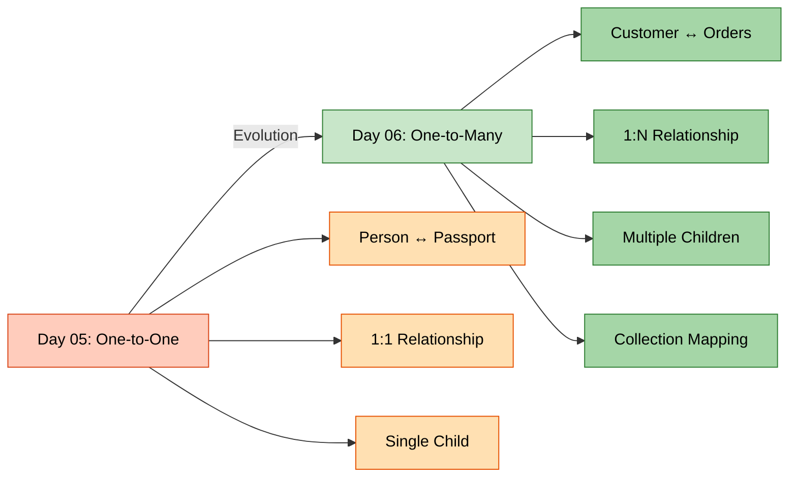

### 📊 What We're Building

A **Customer-Orders Management System** where:
- One Customer can have Multiple Orders (One-to-Many)
- Many Orders belong to One Customer (Many-to-One)
- Bidirectional navigation between Customer and Orders
- Cascade operations automatically manage child entities
- LAZY loading for better performance


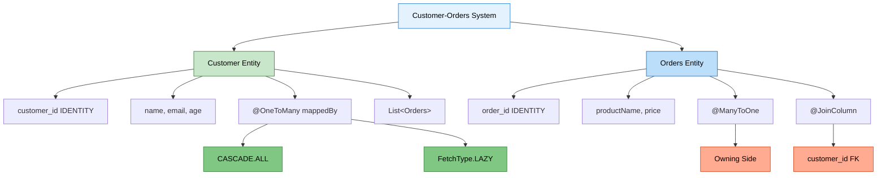

---

<div align="center">

**📚 Learning Path Progress**

Day 05 (One-to-One) → **Day 06 Part 1 (One-to-Many Bidirectional)** ✅ → Day 06 Part 2 (Many-to-Many)

*Created by Avinash Dhanuka | © 2026*

</div>

---

## 2. ONE-TO-MANY VS MANY-TO-ONE

> **📝 Comprehensive Guide by:** Avinash Dhanuka | © 2026

### 📌 What is One-to-Many?

**One-to-Many** = One entity (parent) is associated with multiple entities (children).

**Real-World Examples:**
- 🧑 Customer → 📦 Orders (Our Project)
- 🏢 Department → 👥 Employees
- 📚 Author → 📖 Books
- 🏫 Teacher → 👨‍🎓 Students
- 🏠 House → 🚪 Rooms

### 📌 What is Many-to-One?

**Many-to-One** = Multiple entities (children) are associated with one entity (parent).

**It's the SAME relationship, viewed from the other side!**

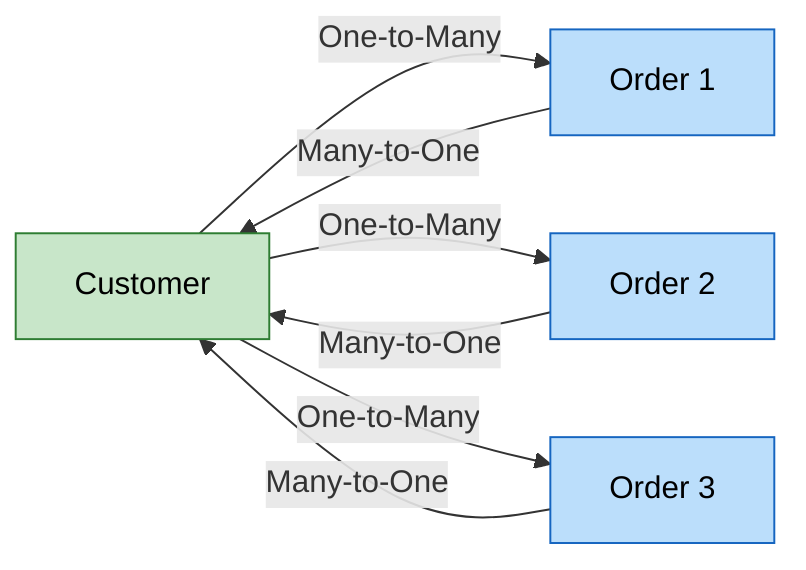

### 📊 Comparison Table

| Aspect | One-to-Many | Many-to-One |
|:-------|:------------|:------------|
| **Perspective** | Parent's view | Child's view |
| **Example** | Customer has many Orders | Many Orders belong to Customer |
| **Annotation** | `@OneToMany` | `@ManyToOne` |
| **Collection** | Uses List/Set | Single object reference |
| **Foreign Key** | In child table | In child table (same!) |
| **Owning Side** | Child (Orders) | Child (Orders) |

**Key Point:** In a bidirectional relationship, we use BOTH annotations!


---

## 3. BIDIRECTIONAL RELATIONSHIP EXPLAINED

> **📝 Navigation Guide by:** Avinash Dhanuka | © 2026

### 📌 What is Bidirectional?

**Bidirectional** = You can navigate from Customer to Orders AND from Orders to Customer.

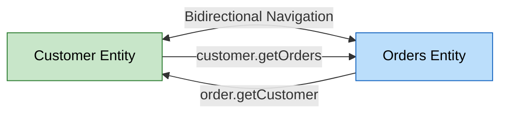

**Code Example:**

```java
// Navigate from Customer to Orders
Customer customer = session.get(Customer.class, 1);
List<Orders> orders = customer.getOrders();  // ✅ Works!

// Navigate from Order to Customer
Orders order = session.get(Orders.class, 1);
Customer customer = order.getCustomer();  // ✅ Also works!
```

### 🎯 Golden Rule of Bidirectional Relationships

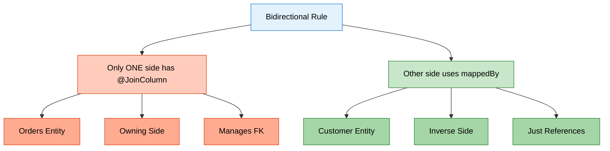

**Remember for Interviews:** 🔥
- Only ONE side defines `@JoinColumn`
- The other side uses `mappedBy`
- The side with `@JoinColumn` is the "owning side"
- Hibernate looks at the owning side for FK definition

### ⚠️ What Happens if You Add @JoinColumn on Both Sides?

```java
// ❌ WRONG: Both sides have @JoinColumn
@Entity
public class Customer {
    @OneToMany
    @JoinColumn(name = "customer_id")  // ❌ Wrong!
    private List<Orders> orders;
}

@Entity
public class Orders {
    @ManyToOne
    @JoinColumn(name = "customer_id")  // ❌ Duplicate!
    private Customer customer;
}
```

**Result:**
- 💥 Hibernate gets confused
- 💥 Doesn't know which side controls FK
- 💥 Throws `AnnotationException`
- 💥 May create duplicate columns

**✅ CORRECT Way:**

```java
// Customer (Inverse Side)
@OneToMany(mappedBy = "customer")  // ✅ Uses mappedBy
private List<Orders> orders;

// Orders (Owning Side)
@ManyToOne
@JoinColumn(name = "customer_id")  // ✅ Only here!
private Customer customer;
```


---

## 4. DATABASE STRUCTURE

> **📝 Database Design by:** Avinash Dhanuka | © 2026

### 🏗️ Entity-Relationship Diagram

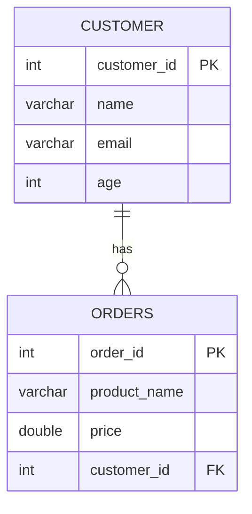

### 📊 Table Structure

```
┌─────────────────┐              ┌──────────────────┐
│    CUSTOMER     │              │      ORDERS      │
├─────────────────┤              ├──────────────────┤
│ customer_id(PK) │◄─────────────│ order_id (PK)    │
│ name            │      1:N     │ product_name     │
│ email           │              │ price            │
│ age             │              │ customer_id (FK) │
└─────────────────┘              └──────────────────┘
```

**Key Points:**
- `CUSTOMER` table has NO foreign key
- `ORDERS` table has `customer_id` as foreign key
- `customer_id` in ORDERS is NOT UNIQUE (allows multiple orders per customer)
- ORDERS is the "owning side" (has the FK)
- CUSTOMER is the "inverse side" (referenced by FK)

### 📝 SQL Tables Created by Hibernate

```sql
-- Customer table (no foreign key)
CREATE TABLE customer (
    customer_id INT AUTO_INCREMENT PRIMARY KEY,
    name VARCHAR(255),
    email VARCHAR(255),
    age INT
);

-- Orders table (has foreign key to customer)
CREATE TABLE orders (
    order_id INT AUTO_INCREMENT PRIMARY KEY,
    product_name VARCHAR(255),
    price DOUBLE,
    customer_id INT,
    FOREIGN KEY (customer_id) REFERENCES customer(customer_id)
);
```

**Notice:** Unlike One-to-One, there's NO UNIQUE constraint on `customer_id` in orders table!

---

## 5. ENTITY CLASSES

> **📝 Entity Design by:** Avinash Dhanuka | © 2026

<div align="center">

---

**⚠️ COPYRIGHT NOTICE ⚠️**

**This documentation is the intellectual property of Avinash Dhanuka.**

© 2026 Avinash Dhanuka. All Rights Reserved.

For permissions: [avunashdhanuka@gmail.com](mailto:avunashdhanuka@gmail.com)

---

</div>

### 👤 Customer Entity (Inverse Side)

**File:** `src/main/java/org/example/entity/Customer.java`

```java
@Entity
@Table(name = "customer")
public class Customer {
    
    @Id
    @GeneratedValue(strategy = GenerationType.IDENTITY)
    @Column(name = "customer_id")
    private int customerId;
    
    private String name;
    private String email;
    private int age;
    
    // One-to-Many relationship (inverse side)
    @OneToMany(mappedBy = "customer", cascade = CascadeType.ALL, 
               fetch = FetchType.LAZY)
    private List<Orders> orders;
    
    // Helper Methods for Bidirectional sync
    public void addOrder(Orders order) {
        orders.add(order);
        order.setCustomer(this);  // Sync both sides
    }
    
    public void removeOrder(Orders order) {
        orders.remove(order);
        order.setCustomer(null);  // Sync both sides
    }
    
    // Constructors, getters, setters...
}
```

**Key Points:**
- Uses `List<Orders>` to hold multiple orders
- `mappedBy = "customer"` indicates this is the inverse side
- `cascade = CascadeType.ALL` means all operations cascade to Orders
- `fetch = FetchType.LAZY` means Orders load only when accessed
- Helper methods `addOrder()` and `removeOrder()` keep both sides synchronized


### 📦 Orders Entity (Owning Side)

**File:** `src/main/java/org/example/entity/Orders.java`

```java
@Entity
@Table(name = "orders")
public class Orders {
    
    @Id
    @GeneratedValue(strategy = GenerationType.IDENTITY)
    private int orderId;
    
    private String productName;
    private double price;
    
    // Many-to-One relationship (owning side)
    @ManyToOne(fetch = FetchType.LAZY)
    @JoinColumn(name = "customer_id")
    private Customer customer;
    
    // Constructors, getters, setters...
}
```

**Key Points:**
- Uses `@ManyToOne` annotation (child's perspective)
- `@JoinColumn(name = "customer_id")` creates the foreign key column
- `fetch = FetchType.LAZY` means Customer loads only when accessed
- This is the "owning side" because it has the foreign key
- Single `Customer` object reference (not a collection)

### 📊 Owning Side vs Inverse Side

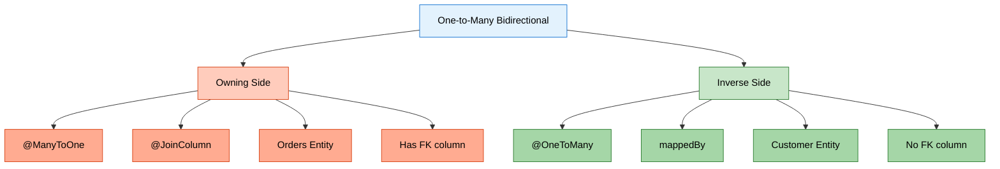

| Aspect | Owning Side (Orders) | Inverse Side (Customer) |
|:-------|:--------------------|:-----------------------|
| **Annotation** | `@ManyToOne` + `@JoinColumn` | `@OneToMany` + `mappedBy` |
| **Foreign Key** | ✅ Has FK column | ❌ No FK |
| **Database Column** | `customer_id` exists | No extra column |
| **Collection** | Single object | List/Set |
| **Responsibility** | Manages relationship | Just references it |
| **Update FK** | ✅ Can update | ❌ Cannot update |

---

## 6. KEY ANNOTATIONS

> **📝 Annotation Guide by:** Avinash Dhanuka | © 2026

### 📌 Relationship Annotations

| Annotation | Purpose | Used In | Example |
|:-----------|:--------|:--------|:--------|
| **@OneToMany** | Defines 1-to-N relationship | Parent (Customer) | `@OneToMany(mappedBy = "customer")` |
| **@ManyToOne** | Defines N-to-1 relationship | Child (Orders) | `@ManyToOne` |
| **@JoinColumn** | Specifies FK column | Owning side (Orders) | `@JoinColumn(name = "customer_id")` |
| **mappedBy** | Defines inverse side | Inverse side (Customer) | `mappedBy = "customer"` |

### 📌 Collection Types

| Type | Ordered | Duplicates | Use Case |
|:-----|:--------|:-----------|:---------|
| **List** | ✅ Yes | ✅ Allowed | Most common, maintains order |
| **Set** | ❌ No | ❌ Not allowed | Unique elements only |
| **Map** | ❌ No | ❌ Keys unique | Key-value pairs |

**Our Project Uses:** `List<Orders>` - Most common and practical choice


---

## 7. CASCADE OPERATIONS DEEP DIVE

> **📝 Cascade Guide by:** Avinash Dhanuka | Understanding Operation Propagation

<div align="center">

---

**📝 AUTHOR SIGNATURE**

This comprehensive guide is created by **Avinash Dhanuka**

© 2026 | All Rights Reserved

[](https://github.com/Avinash-706)

---

</div>

### 📌 What is Cascade?

**Cascade** = Automatically propagating operations from parent (Customer) to children (Orders).

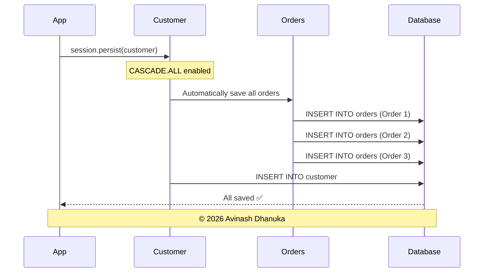

### 📊 All Cascade Types Explained

| Cascade Type | What It Does | When to Use | Example |
|:-------------|:-------------|:------------|:--------|
| **CascadeType.PERSIST** | Save child when parent saved | Creating new entities | `session.persist(customer)` saves orders |
| **CascadeType.MERGE** | Update child when parent updated | Updating entities | `session.merge(customer)` updates orders |
| **CascadeType.REMOVE** | Delete child when parent deleted | Deleting entities | `session.remove(customer)` deletes orders |
| **CascadeType.REFRESH** | Reload child when parent reloaded | Refreshing from DB | `session.refresh(customer)` refreshes orders |
| **CascadeType.DETACH** | Detach child when parent detached | Detaching from session | `session.detach(customer)` detaches orders |
| **CascadeType.ALL** | All of the above | Parent-child relationships | All operations cascade |

### 🔍 CASCADE.PERSIST in Detail

**What it does:** When you save the parent, children are automatically saved.

```java
// WITHOUT CASCADE.PERSIST
Customer customer = new Customer("John", "john@email.com", 30);
Orders order1 = new Orders("Laptop", 50000);
Orders order2 = new Orders("Mouse", 500);

session.persist(customer);  // Save customer
session.persist(order1);    // Must save order1 separately ❌
session.persist(order2);    // Must save order2 separately ❌

// WITH CASCADE.PERSIST (or CASCADE.ALL)
Customer customer = new Customer("John", "john@email.com", 30);
Orders order1 = new Orders("Laptop", 50000);
Orders order2 = new Orders("Mouse", 500);

List<Orders> orderList = new ArrayList<>();
orderList.add(order1);
orderList.add(order2);
customer.setOrders(orderList);

session.persist(customer);  // All orders saved automatically! ✅
```

**SQL Generated:**
```sql
INSERT INTO customer (name, email, age) VALUES ('John', 'john@email.com', 30);
-- customer_id = 1

INSERT INTO orders (product_name, price, customer_id) VALUES ('Laptop', 50000, 1);
INSERT INTO orders (product_name, price, customer_id) VALUES ('Mouse', 500, 1);
```


### 🔍 CASCADE.MERGE in Detail

**What it does:** When you update the parent, children are automatically updated.

```java
// Fetch existing customer with orders
Customer customer = session.get(Customer.class, 1);
customer.setName("John Updated");

// Update one of the orders
Orders firstOrder = customer.getOrders().get(0);
firstOrder.setPrice(55000);  // Update price

session.merge(customer);  // Customer AND orders updated! ✅
```

**SQL Generated:**
```sql
UPDATE customer SET name = 'John Updated' WHERE customer_id = 1;
UPDATE orders SET price = 55000 WHERE order_id = 1;
```

### 🔍 CASCADE.REMOVE in Detail

**What it does:** When you delete the parent, children are automatically deleted.

```java
Customer customer = session.get(Customer.class, 1);
session.remove(customer);  // Customer AND all orders deleted! ✅
```

**SQL Generated:**
```sql
-- Delete all orders first (foreign key constraint)
DELETE FROM orders WHERE customer_id = 1;

-- Then delete customer
DELETE FROM customer WHERE customer_id = 1;
```

**⚠️ Warning:** Be careful with CASCADE.REMOVE! It will delete ALL child records.

### 🔍 CASCADE.REFRESH in Detail

**What it does:** When you reload the parent from database, children are also reloaded.

```java
Customer customer = session.get(Customer.class, 1);
customer.setName("Modified in memory");  // Not saved to DB

session.refresh(customer);  // Reloads from DB, discards memory changes
// Customer AND orders refreshed from database ✅
```

### 🔍 CASCADE.DETACH in Detail

**What it does:** When you detach the parent from session, children are also detached.

```java
Customer customer = session.get(Customer.class, 1);
// customer is in PERSISTENT state

session.detach(customer);  // Customer AND orders detached
// Now in DETACHED state, changes won't be saved
```

### 🔍 CASCADE.ALL - The Complete Package

**What it does:** Combines ALL cascade types.

```java
@OneToMany(mappedBy = "customer", cascade = CascadeType.ALL)
private List<Orders> orders;
```

**Equivalent to:**
```java
@OneToMany(mappedBy = "customer", 
           cascade = {CascadeType.PERSIST, CascadeType.MERGE, 
                      CascadeType.REMOVE, CascadeType.REFRESH, 
                      CascadeType.DETACH})
private List<Orders> orders;
```

### 📊 When to Use Which Cascade Type?

| Scenario | Recommended Cascade | Reason |
|:---------|:-------------------|:-------|
| **Parent-Child (Orders)** | CASCADE.ALL | Children can't exist without parent |
| **Shared Entities** | PERSIST, MERGE only | Don't delete shared entities |
| **Independent Entities** | NONE | Manage separately |
| **Lookup Tables** | NONE | Never cascade to lookup data |

### ⚠️ Cascade Best Practices

```java
// ✅ GOOD: Cascade on true parent-child
@OneToMany(mappedBy = "customer", cascade = CascadeType.ALL)
private List<Orders> orders;

// ⚠️ CAREFUL: Cascade on shared entities
@ManyToOne(cascade = CascadeType.PERSIST)  // Only PERSIST, not REMOVE
private Category category;

// ❌ BAD: Cascade on lookup tables
@ManyToOne(cascade = CascadeType.ALL)  // ❌ Never do this!
private Country country;  // Deleting user would delete country!
```


---

## 8. FETCH TYPES: LAZY VS EAGER

> **📝 Performance Guide by:** Avinash Dhanuka | Understanding Loading Strategies

### 📌 What is Fetch Type?

**Fetch Type** = When and how Hibernate loads related entities from the database.

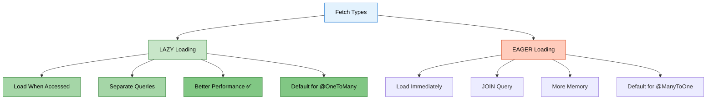

### 📊 Default Fetch Types

| Relationship | Default Fetch Type | Reason |
|:-------------|:------------------|:-------|
| **@OneToOne** | EAGER | Usually need related data |
| **@ManyToOne** | EAGER | Usually need parent data |
| **@OneToMany** | LAZY | May have many children |
| **@ManyToMany** | LAZY | May have many related entities |

**Our Project:** Both use `FetchType.LAZY` for better performance!

### ⚡ LAZY Loading (Our Implementation)

```java
// Customer side
@OneToMany(mappedBy = "customer", fetch = FetchType.LAZY)
private List<Orders> orders;

// Orders side
@ManyToOne(fetch = FetchType.LAZY)
private Customer customer;
```

**How LAZY Works:**

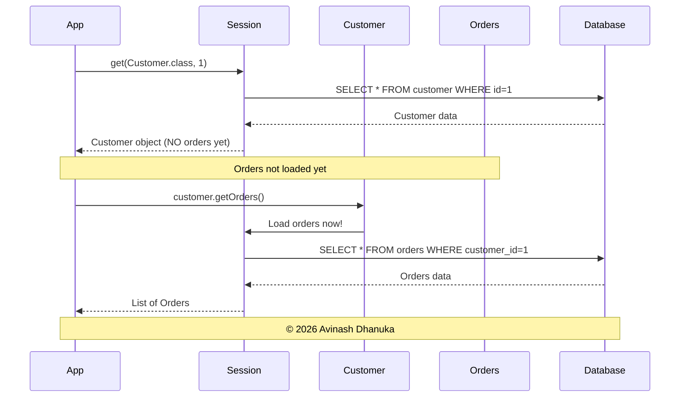

**Code Example:**

```java
Session session = factory.openSession();

// Load customer - Orders NOT loaded yet
Customer customer = session.get(Customer.class, 1);
// SQL: SELECT * FROM customer WHERE customer_id = 1

System.out.println("Customer: " + customer.getName());  // No additional query

// Access orders - NOW they load
List<Orders> orders = customer.getOrders();
// SQL: SELECT * FROM orders WHERE customer_id = 1

for (Orders order : orders) {
    System.out.println("Order: " + order.getProductName());
}

session.close();
```


### 🔥 EAGER Loading (Alternative)

```java
@OneToMany(mappedBy = "customer", fetch = FetchType.EAGER)
private List<Orders> orders;
```

**How EAGER Works:**

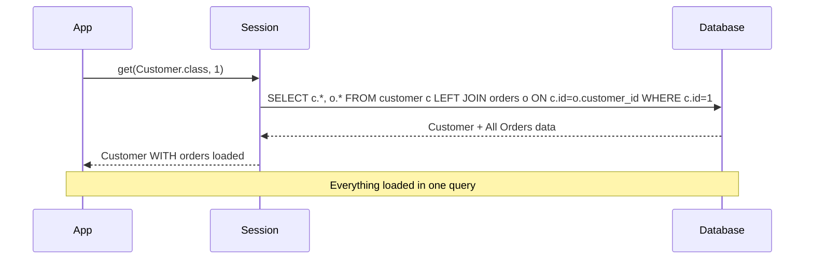

**Code Example:**

```java
Session session = factory.openSession();

Customer customer = session.get(Customer.class, 1);
// SQL: SELECT * FROM customer c LEFT JOIN orders o ON c.customer_id = o.customer_id WHERE c.customer_id = 1
// Both Customer AND Orders loaded immediately!

List<Orders> orders = customer.getOrders();  // No additional query!
System.out.println("Orders: " + orders.size());

session.close();
```

### 📊 LAZY vs EAGER Comparison

| Aspect | LAZY | EAGER |
|:-------|:-----|:------|
| **Loading Time** | When accessed | Immediately |
| **SQL Queries** | 2 separate queries | 1 query with JOIN |
| **Performance** | Better (load on demand) | Slower (loads everything) |
| **Memory Usage** | Lower | Higher |
| **LazyInitializationException** | Can occur | Never |
| **Use Case** | Sometimes need data | Always need data |
| **Our Choice** | ✅ Yes | ❌ No |

### 🎯 Real-World Analogy

**EAGER Loading:**
```
🍔 Food + 🧾 Bill + 👨‍🍳 Chef details + 👔 Owner details all come together 😵
```

**LAZY Loading:**
```
🍔 You only get food
📄 If you ask for bill → then they give bill
👨‍🍳 If you ask for chef → then they give chef details
```

### ⚠️ LazyInitializationException

**The Problem:**

```java
Session session = factory.openSession();

Customer customer = session.get(Customer.class, 1);
session.close();  // Session closed!

// Try to access orders AFTER session closed
List<Orders> orders = customer.getOrders();  // ❌ LazyInitializationException!
```

**Error Message:**
```
org.hibernate.LazyInitializationException: failed to lazily initialize a collection of role: 
org.example.entity.Customer.orders, could not initialize proxy - no Session
```

**Solutions:**

```java
// Solution 1: Access within session
Session session = factory.openSession();
Customer customer = session.get(Customer.class, 1);
List<Orders> orders = customer.getOrders();  // ✅ Access before closing
session.close();

// Solution 2: Initialize explicitly
Session session = factory.openSession();
Customer customer = session.get(Customer.class, 1);
Hibernate.initialize(customer.getOrders());  // Force load
session.close();
List<Orders> orders = customer.getOrders();  // ✅ Works now

// Solution 3: Use JOIN FETCH in HQL
List<Customer> customers = session.createQuery(
    "FROM Customer c JOIN FETCH c.orders", Customer.class
).list();
session.close();
// ✅ Orders already loaded
```


---

## 9. THE MAPPEDBY ATTRIBUTE

> **📝 mappedBy Explained by:** Avinash Dhanuka | © 2026

### 📌 What is mappedBy?

**mappedBy** = Tells Hibernate which side of the relationship owns the foreign key.

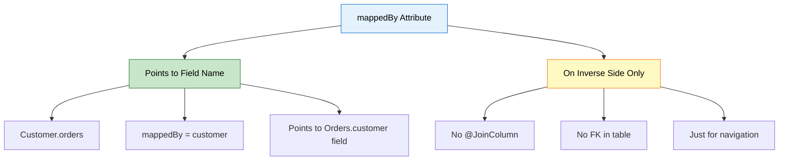

### 🔍 How mappedBy Works Internally

```java
// Customer (Inverse Side)
@OneToMany(mappedBy = "customer")  // Points to "customer" field in Orders
private List<Orders> orders;

// Orders (Owning Side)
@ManyToOne
@JoinColumn(name = "customer_id")
private Customer customer;  // This is the field mappedBy points to!
```

**What Hibernate Does:**

1. Sees `mappedBy = "customer"` in Customer entity
2. Looks for a field named `customer` in Orders entity
3. Finds `@JoinColumn(name = "customer_id")` there
4. Uses that to manage the foreign key

### ⚠️ What Happens if You Remove mappedBy?

```java
// ❌ WITHOUT mappedBy
@OneToMany
@JoinColumn(name = "customer_id")  // Now Customer tries to own it
private List<Orders> orders;

@ManyToOne
@JoinColumn(name = "customer_id")  // Orders also tries to own it
private Customer customer;
```

**Result:**
- 💥 Hibernate creates TWO foreign keys
- 💥 Or creates a join table (unintended)
- 💥 Confusion about which side controls the relationship
- 💥 Data inconsistency

### ✅ Correct Usage

```java
// Customer (Inverse Side)
@OneToMany(mappedBy = "customer")  // ✅ Uses mappedBy
private List<Orders> orders;

// Orders (Owning Side)
@ManyToOne
@JoinColumn(name = "customer_id")  // ✅ Only here!
private Customer customer;
```

---

## 10. HELPER METHODS

> **📝 Synchronization Guide by:** Avinash Dhanuka | © 2026

### 📌 Why Helper Methods?

In bidirectional relationships, you must keep BOTH sides synchronized!

**Problem Without Helper Methods:**

```java
// ❌ BAD: Not synchronized
Customer customer = new Customer("John", "john@email.com", 30);
Orders order = new Orders("Laptop", 50000);

customer.getOrders().add(order);  // Added to customer
// But order.getCustomer() is still null! ❌

session.persist(customer);
// Foreign key NOT set because Orders doesn't know about Customer!
```

### ✅ Solution: Helper Methods

```java
@Entity
public class Customer {
    
    @OneToMany(mappedBy = "customer", cascade = CascadeType.ALL)
    private List<Orders> orders = new ArrayList<>();
    
    // Helper method to add order
    public void addOrder(Orders order) {
        orders.add(order);           // Add to customer's list
        order.setCustomer(this);     // Set customer in order
    }
    
    // Helper method to remove order
    public void removeOrder(Orders order) {
        orders.remove(order);        // Remove from customer's list
        order.setCustomer(null);     // Remove customer from order
    }
}
```

**Usage:**

```java
// ✅ GOOD: Both sides synchronized
Customer customer = new Customer("John", "john@email.com", 30);
Orders order = new Orders("Laptop", 50000);

customer.addOrder(order);  // Syncs both sides automatically!

session.persist(customer);  // ✅ Works perfectly!
```

### 📊 With vs Without Helper Methods

| Aspect | Without Helper | With Helper |
|:-------|:--------------|:------------|
| **Code** | More verbose | Clean and simple |
| **Synchronization** | Manual | Automatic |
| **Error-prone** | ✅ Yes | ❌ No |
| **Maintainability** | Difficult | Easy |
| **Best Practice** | ❌ No | ✅ Yes |


---

## 11. CRUD OPERATIONS

> **📝 CRUD Guide by:** Avinash Dhanuka | Operations with One-to-Many

### 1️⃣ CREATE - Save Customer with Orders

```java
Session session = factory.openSession();
Transaction tx = session.beginTransaction();

// Create customer
Customer customer = new Customer("John Doe", "john@email.com", 30);

// Create orders
Orders order1 = new Orders("Laptop", 50000);
Orders order2 = new Orders("Mouse", 500);
Orders order3 = new Orders("Keyboard", 1500);

// Create list and add orders
List<Orders> orderList = new ArrayList<>();
orderList.add(order1);
orderList.add(order2);
orderList.add(order3);

// Set customer for each order (bidirectional sync)
order1.setCustomer(customer);
order2.setCustomer(customer);
order3.setCustomer(customer);

customer.setOrders(orderList);

// Save customer (CASCADE saves all orders)
session.persist(customer);

tx.commit();
session.close();
```

**SQL Generated:**
```sql
INSERT INTO customer (name, email, age) VALUES ('John Doe', 'john@email.com', 30);
-- customer_id = 1

INSERT INTO orders (product_name, price, customer_id) VALUES ('Laptop', 50000, 1);
INSERT INTO orders (product_name, price, customer_id) VALUES ('Mouse', 500, 1);
INSERT INTO orders (product_name, price, customer_id) VALUES ('Keyboard', 1500, 1);
```

### 2️⃣ READ - Fetch Customer with Orders

```java
Session session = factory.openSession();

// Fetch customer
Customer customer = session.get(Customer.class, 1);
System.out.println("Customer: " + customer.getName());

// Access orders (LAZY loading triggers here)
List<Orders> orders = customer.getOrders();
System.out.println("Total Orders: " + orders.size());

for (Orders order : orders) {
    System.out.println("  - " + order.getProductName() + ": ₹" + order.getPrice());
}

session.close();
```

### 3️⃣ UPDATE - Modify Customer and Orders

```java
Session session = factory.openSession();
Transaction tx = session.beginTransaction();

Customer customer = session.get(Customer.class, 1);
customer.setEmail("newemail@example.com");

// Update an order
Orders firstOrder = customer.getOrders().get(0);
firstOrder.setPrice(55000);

session.merge(customer);  // CASCADE updates orders too

tx.commit();
session.close();
```

### 4️⃣ DELETE - Remove Customer (CASCADE deletes Orders)

```java
Session session = factory.openSession();
Transaction tx = session.beginTransaction();

Customer customer = session.get(Customer.class, 1);
session.remove(customer);  // All orders deleted automatically!

tx.commit();
session.close();
```

---

## 12. RUNNING THE APPLICATION

<div align="center">

**🔒 PROTECTED CONTENT 🔒**

**Created by: Avinash Dhanuka**

© 2026 Avinash Dhanuka

[GitHub Profile](https://github.com/Avinash-706) | [Contact Me](mailto:avunashdhanuka@gmail.com)

---

</div>

### 📋 Prerequisites

1. **MySQL Server** installed and running
2. **Java 11** or higher
3. **Maven** installed

### 🚀 Setup Steps

**Step 1: Create Database**

```sql
CREATE DATABASE hibernate_relationships_db;
USE hibernate_relationships_db;
```

**Step 2: Update hibernate.cfg.xml**

```xml
<property name="hibernate.connection.username">your_username</property>
<property name="hibernate.connection.password">your_password</property>
```

**Step 3: Run the Application**

```bash
mvn clean install
mvn exec:java -Dexec.mainClass="org.example.App"
```

### 📱 Sample Interaction

```
Enter Customer Name:
John Doe

Enter Customer Age:
30

Enter Customer Email:
john@email.com

How many orders you want to add?
2

Enter Order 1 Product Name:
Laptop

Enter Order 1 Price:
50000

Enter Order 2 Product Name:
Mouse

Enter Order 2 Price:
500

Data Saved Successfully ✅
```


---

## 13. WHAT I LEARNED

> **📝 Learning Summary by:** Avinash Dhanuka | © 2026

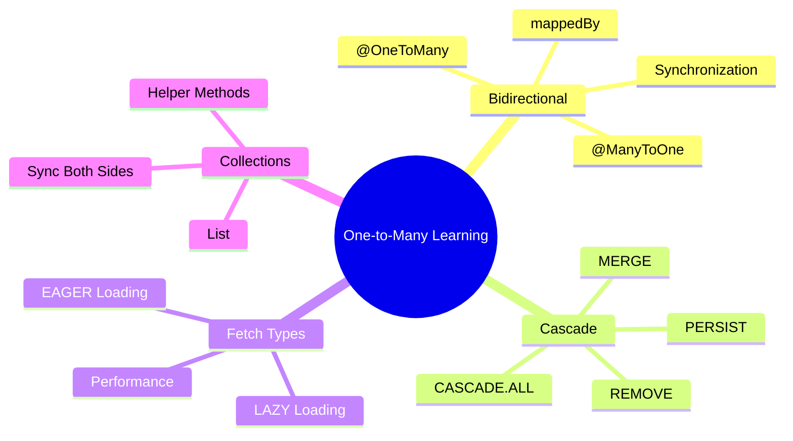

### ✅ Core Concepts Mastered

**1. One-to-Many & Many-to-One Relationships**
- One Customer has Many Orders
- Many Orders belong to One Customer
- Same relationship, different perspectives
- Using `List<Orders>` for collections

**2. Bidirectional Mapping**
- Navigate from Customer to Orders
- Navigate from Orders to Customer
- Must synchronize both sides
- Helper methods for synchronization

**3. Owning Side vs Inverse Side**
- Orders is owning side (has @JoinColumn)
- Customer is inverse side (has mappedBy)
- Only owning side can update FK
- Golden rule: Only ONE side has @JoinColumn

**4. Cascade Operations**
- CASCADE.ALL propagates all operations
- PERSIST saves children automatically
- MERGE updates children automatically
- REMOVE deletes children automatically
- REFRESH reloads children automatically
- DETACH detaches children automatically

**5. Fetch Strategies**
- FetchType.LAZY loads data when accessed
- FetchType.EAGER loads data immediately
- LAZY is default for @OneToMany
- EAGER is default for @ManyToOne
- Chose LAZY for better performance

**6. mappedBy Attribute**
- Points to field name on owning side
- Only used on inverse side
- Tells Hibernate where FK is defined
- Prevents duplicate FK columns

**7. Helper Methods**
- addOrder() synchronizes both sides
- removeOrder() synchronizes both sides
- Prevents synchronization errors
- Best practice for bidirectional relationships

**8. LazyInitializationException**
- Occurs when accessing LAZY data after session closed
- Solutions: Access within session, Hibernate.initialize(), JOIN FETCH
- Important to understand for production code

### 📊 Comparison with One-to-One

| Aspect | One-to-One | One-to-Many |
|:-------|:-----------|:------------|
| **Child Entities** | Single object | Collection (List/Set) |
| **FK Constraint** | UNIQUE | No UNIQUE |
| **Use Case** | Person-Passport | Customer-Orders |
| **Complexity** | Simpler | More complex |
| **Helper Methods** | Not needed | Recommended |


---

## 14. INTERVIEW QUESTIONS

> **📝 Curated by:** Avinash Dhanuka | © 2026 | [GitHub](https://github.com/Avinash-706)

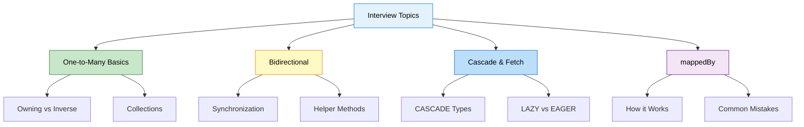

### Q1: What is the difference between One-to-Many and Many-to-One?

**Answer:**

They are the SAME relationship viewed from different perspectives!

**One-to-Many (Parent's view):**
- One Customer has Many Orders
- Uses `@OneToMany` annotation
- Uses `List<Orders>` or `Set<Orders>`
- Example: `customer.getOrders()`

**Many-to-One (Child's view):**
- Many Orders belong to One Customer
- Uses `@ManyToOne` annotation
- Uses single object reference
- Example: `order.getCustomer()`

**In Bidirectional Relationship:**
```java
// Customer (One-to-Many)
@OneToMany(mappedBy = "customer")
private List<Orders> orders;

// Orders (Many-to-One)
@ManyToOne
@JoinColumn(name = "customer_id")
private Customer customer;
```

**Key Point:** The foreign key is ALWAYS in the "Many" side (Orders table).

---

### Q2: Explain the Golden Rule of Bidirectional Relationships.

**Answer:**

**Golden Rule:** Only ONE side defines `@JoinColumn`, the other side uses `mappedBy`.

**Why?**
- Prevents duplicate foreign keys
- Avoids confusion about which side controls the relationship
- Hibernate needs to know which side manages the FK

**Correct Implementation:**

```java
// Customer (Inverse Side)
@OneToMany(mappedBy = "customer")  // ✅ Uses mappedBy
private List<Orders> orders;

// Orders (Owning Side)
@ManyToOne
@JoinColumn(name = "customer_id")  // ✅ Only here!
private Customer customer;
```

**Wrong Implementation:**

```java
// ❌ Both sides have @JoinColumn
@OneToMany
@JoinColumn(name = "customer_id")  // ❌ Wrong!
private List<Orders> orders;

@ManyToOne
@JoinColumn(name = "customer_id")  // ❌ Duplicate!
private Customer customer;
```

**Result of Wrong Implementation:**
- Hibernate throws `AnnotationException`
- May create duplicate columns
- Confusion about FK management

---

### Q3: What is mappedBy and how does it work internally?

**Answer:**

**mappedBy** = Attribute that tells Hibernate which field on the owning side manages the relationship.

**How it Works:**

```java
// Customer
@OneToMany(mappedBy = "customer")  // Points to field name
private List<Orders> orders;

// Orders
@ManyToOne
@JoinColumn(name = "customer_id")
private Customer customer;  // This is the field mappedBy points to!
```

**Internal Process:**
1. Hibernate sees `mappedBy = "customer"` in Customer entity
2. Looks for a field named `customer` in Orders entity
3. Finds `@JoinColumn(name = "customer_id")` there
4. Uses that definition to manage the foreign key

**What Happens Without mappedBy:**
- Hibernate may create a join table
- Or create duplicate foreign keys
- Relationship management becomes ambiguous

---

### Q4: Explain all CASCADE types with examples.

**Answer:**

| Cascade Type | What It Does | Example |
|:-------------|:-------------|:--------|
| **PERSIST** | Save children when parent saved | `session.persist(customer)` saves orders |
| **MERGE** | Update children when parent updated | `session.merge(customer)` updates orders |
| **REMOVE** | Delete children when parent deleted | `session.remove(customer)` deletes orders |
| **REFRESH** | Reload children when parent reloaded | `session.refresh(customer)` refreshes orders |
| **DETACH** | Detach children when parent detached | `session.detach(customer)` detaches orders |
| **ALL** | All of the above | All operations cascade |

**Code Examples:**

```java
// CASCADE.PERSIST
@OneToMany(cascade = CascadeType.PERSIST)
private List<Orders> orders;

Customer customer = new Customer("John", "john@email.com", 30);
Orders order = new Orders("Laptop", 50000);
customer.addOrder(order);
session.persist(customer);  // ✅ Order also saved

// CASCADE.REMOVE
@OneToMany(cascade = CascadeType.REMOVE)
private List<Orders> orders;

session.remove(customer);  // ✅ All orders also deleted

// CASCADE.ALL
@OneToMany(cascade = CascadeType.ALL)
private List<Orders> orders;
// All operations cascade
```

**When to Use:**
- **CASCADE.ALL**: True parent-child relationships (Orders)
- **PERSIST, MERGE**: Shared entities
- **NONE**: Independent entities, lookup tables

---

### Q5: What is the difference between LAZY and EAGER loading?

**Answer:**

| Aspect | LAZY | EAGER |
|:-------|:-----|:------|
| **Loading Time** | When accessed | Immediately |
| **SQL Queries** | Separate queries | JOIN query |
| **Performance** | Better | Slower |
| **Memory** | Lower | Higher |
| **Default for @OneToMany** | ✅ Yes | ❌ No |
| **Default for @ManyToOne** | ❌ No | ✅ Yes |

**LAZY Example:**

```java
@OneToMany(fetch = FetchType.LAZY)
private List<Orders> orders;

Customer customer = session.get(Customer.class, 1);
// SQL: SELECT * FROM customer WHERE customer_id = 1
// Orders NOT loaded yet

List<Orders> orders = customer.getOrders();  // NOW loads
// SQL: SELECT * FROM orders WHERE customer_id = 1
```

**EAGER Example:**

```java
@OneToMany(fetch = FetchType.EAGER)
private List<Orders> orders;

Customer customer = session.get(Customer.class, 1);
// SQL: SELECT c.*, o.* FROM customer c LEFT JOIN orders o ...
// Both loaded immediately
```

**Best Practice:** Use LAZY by default, use EAGER only when you ALWAYS need the data.

---

### Q6: Why do we need Helper Methods in bidirectional relationships?

**Answer:**

**Problem Without Helper Methods:**

```java
// ❌ Not synchronized
Customer customer = new Customer("John", "john@email.com", 30);
Orders order = new Orders("Laptop", 50000);

customer.getOrders().add(order);  // Added to customer
// But order.getCustomer() is null! ❌

session.persist(customer);
// FK not set, data inconsistency!
```

**Solution With Helper Methods:**

```java
// Customer entity
public void addOrder(Orders order) {
    orders.add(order);        // Add to list
    order.setCustomer(this);  // Set customer in order
}

// Usage
customer.addOrder(order);  // ✅ Both sides synchronized!
session.persist(customer);  // ✅ Works perfectly!
```

**Benefits:**
- Automatic synchronization
- Prevents data inconsistency
- Cleaner code
- Less error-prone
- Best practice for bidirectional relationships

---

### Q7: What is LazyInitializationException and how to fix it?

**Answer:**

**What is it?**

Exception thrown when trying to access LAZY-loaded data after the session is closed.

**Example:**

```java
Session session = factory.openSession();
Customer customer = session.get(Customer.class, 1);
session.close();  // Session closed!

List<Orders> orders = customer.getOrders();  // ❌ LazyInitializationException!
```

**Solutions:**

```java
// Solution 1: Access within session
Session session = factory.openSession();
Customer customer = session.get(Customer.class, 1);
List<Orders> orders = customer.getOrders();  // ✅ Before closing
session.close();

// Solution 2: Hibernate.initialize()
Session session = factory.openSession();
Customer customer = session.get(Customer.class, 1);
Hibernate.initialize(customer.getOrders());  // Force load
session.close();
List<Orders> orders = customer.getOrders();  // ✅ Works

// Solution 3: JOIN FETCH in HQL
List<Customer> customers = session.createQuery(
    "FROM Customer c JOIN FETCH c.orders", Customer.class
).list();
session.close();
// ✅ Orders already loaded

// Solution 4: Use EAGER (not recommended)
@OneToMany(fetch = FetchType.EAGER)
private List<Orders> orders;
```

---

### Q8: What SQL queries are generated when you save a Customer with Orders?

**Answer:**

**Code:**

```java
Customer customer = new Customer("John", "john@email.com", 30);
Orders order1 = new Orders("Laptop", 50000);
Orders order2 = new Orders("Mouse", 500);

customer.addOrder(order1);
customer.addOrder(order2);

session.persist(customer);
```

**SQL Generated:**

```sql
-- 1. Insert customer
INSERT INTO customer (name, email, age) 
VALUES ('John', 'john@email.com', 30);
-- customer_id = 1

-- 2. Insert order 1 (CASCADE effect)
INSERT INTO orders (product_name, price, customer_id)
VALUES ('Laptop', 50000, 1);

-- 3. Insert order 2 (CASCADE effect)
INSERT INTO orders (product_name, price, customer_id)
VALUES ('Mouse', 500, 1);
```

**Key Points:**
- Only need to persist Customer (CASCADE persists Orders)
- Foreign key (customer_id) set automatically
- All inserts happen in one transaction

---

### Q9: Can you have One-to-Many without Many-to-One (Unidirectional)?

**Answer:**

**Yes!** You can have unidirectional One-to-Many.

**Unidirectional One-to-Many:**

```java
// Customer (only side)
@OneToMany
@JoinColumn(name = "customer_id")  // No mappedBy!
private List<Orders> orders;

// Orders (no reference to Customer)
@Entity
public class Orders {
    // No Customer field!
}
```

**Characteristics:**
- Can navigate from Customer to Orders
- Cannot navigate from Orders to Customer
- Simpler but less flexible
- Still uses foreign key in Orders table

**When to Use:**
- When you only need one-way navigation
- Simpler relationships
- Less code to maintain

**Bidirectional vs Unidirectional:**

| Aspect | Bidirectional | Unidirectional |
|:-------|:--------------|:---------------|
| **Navigation** | Both ways | One way only |
| **Complexity** | More complex | Simpler |
| **Flexibility** | High | Limited |
| **Use Case** | Most common | Simple relationships |

---

### Q10: What happens if you delete a Customer with CASCADE.ALL?

**Answer:**

**Code:**

```java
@OneToMany(mappedBy = "customer", cascade = CascadeType.ALL)
private List<Orders> orders;

Customer customer = session.get(Customer.class, 1);
session.remove(customer);
```

**What Happens:**

1. Hibernate checks cascade settings
2. Finds CASCADE.ALL (includes REMOVE)
3. Deletes all child Orders first
4. Then deletes Customer

**SQL Generated:**

```sql
-- Step 1: Delete all orders (foreign key constraint)
DELETE FROM orders WHERE customer_id = 1;

-- Step 2: Delete customer
DELETE FROM customer WHERE customer_id = 1;
```

**Why This Order?**
- Orders has foreign key to Customer
- Must delete children before parent
- Otherwise: Foreign key constraint violation

**Without CASCADE.REMOVE:**

```java
@OneToMany(mappedBy = "customer")  // No cascade
private List<Orders> orders;

session.remove(customer);
// ❌ ERROR: Cannot delete customer because orders still reference it
```

---

<div align="center">

## 🎓 End of One-to-Many Bidirectional Guide

<br>

**Created with dedication by Avinash Dhanuka**

<br>

[](https://github.com/Avinash-706)
[](mailto:avunashdhanuka@gmail.com)

<br>

---

<br>
**Happy Learning! 🚀**

*"Master One-to-Many, Master Real-World Applications!"* - Avinash Dhanuka

---

**Next:** Many-to-Many Relationships

---

</div>
