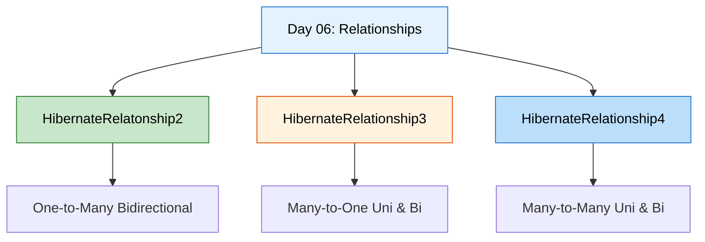
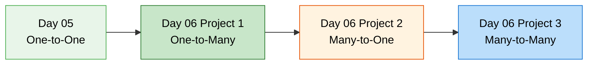
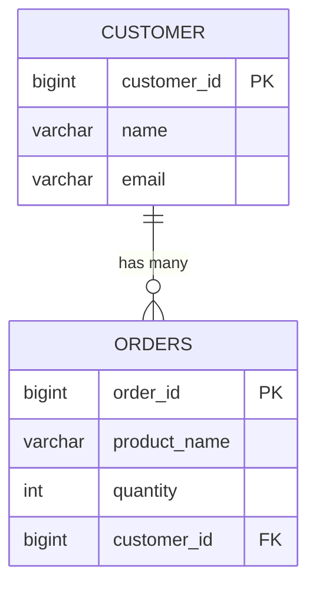
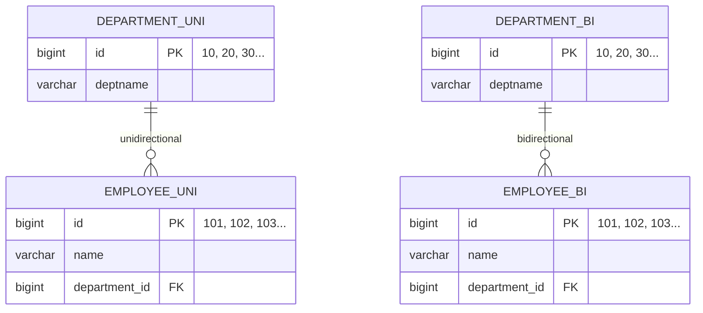
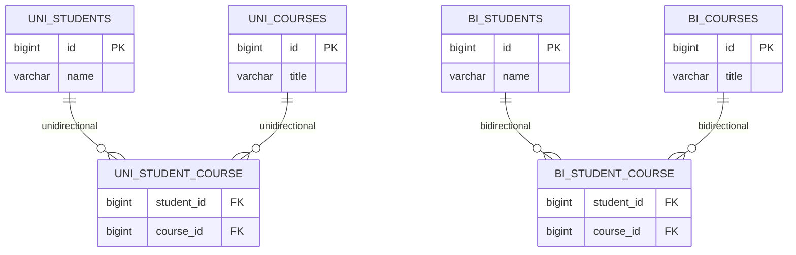
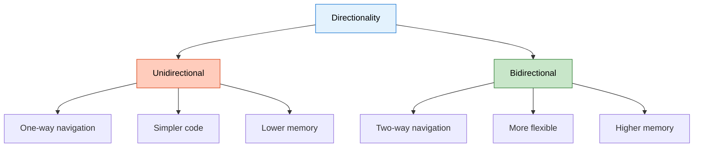
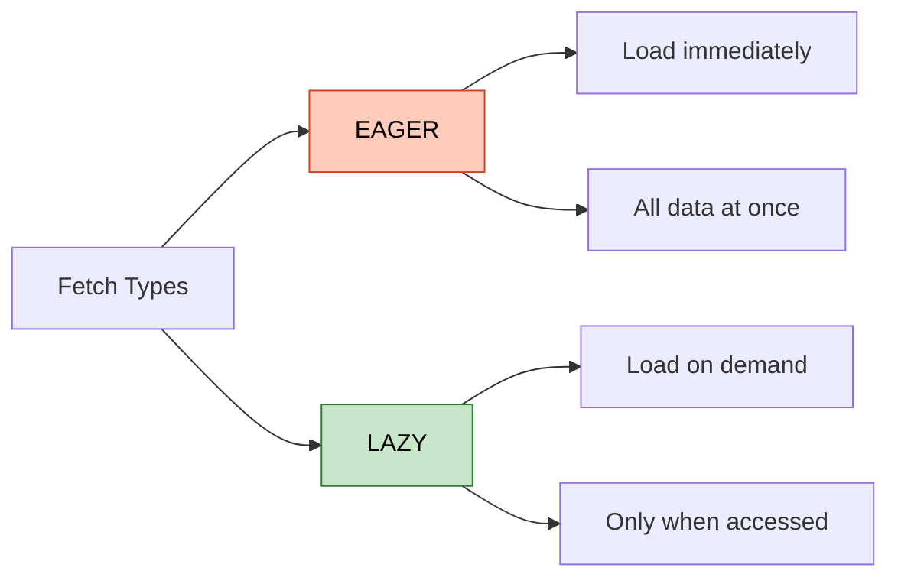
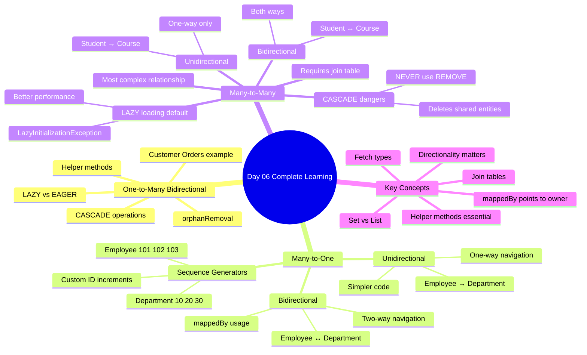

# 📚 Day 06: Hibernate Relationships Deep Dive

<div align="center">


</div>

<hr style="border: 1px solid rgb(98, 117, 187)">

<div align="center">
<table>
<tr>
<td align="center">
<br />

<br>

<h3>© 2026 Avinash Dhanuka</h3>
<p>Complete Guide to Hibernate Relationships</p>
<p><em>Crafted with ❤️ for Mastering All Relationship Types</em></p>

<a href="https://github.com/Avinash-706" target="_blank">

</a>
<br />
<a href="https://mail.google.com/mail/?view=cm&fs=1&to=avunashdhanuka@gmail.com&su=Hibernate%20Relationships%20Query&body=☕%20Hello%20Avinash,%0D%0A%0D%0AMy%20name%20is%20[Your%20Name]%20and%20I%20have%20a%20doubt%20regarding%20Hibernate%20Relationships.%0D%0A%0D%0A🔹%20Topic:%20[Relationships]%0D%0A%0D%0AThank%20you!" target="_blank">

</a>
<br />
<br />
</td>
</tr>
</table>
</div>

> **Day 06 Focus:** Advanced Hibernate Relationships - One-to-Many, Many-to-One, and Many-to-Many with both Unidirectional and Bidirectional implementations

---

## 📑 Table of Contents
1. [Overview](#1-overview)
2. [Project Structure](#2-project-structure)
3. [Relationships Covered](#3-relationships-covered)
4. [Key Concepts](#4-key-concepts)
5. [What I Learned](#5-what-i-learned)
6. [Quick Reference](#6-quick-reference)

---

## 1. OVERVIEW

> **📝 Author:** Avinash Dhanuka | [GitHub](https://github.com/Avinash-706)

### 🎯 Day 06 Goals

Day 06 focuses on mastering THREE major Hibernate relationship types with BOTH Unidirectional and Bidirectional implementations:



### 📊 Learning Path



---

## 2. PROJECT STRUCTURE

> **📝 Organized Learning by:** Avinash Dhanuka | © 2026

### 📁 Directory Structure

```
day06/
├── HibernateRelatonship2/          # One-to-Many Bidirectional
│   ├── src/
│   │   └── main/
│   │       ├── java/
│   │       │   └── org/example/
│   │       │       ├── entity/
│   │       │       │   ├── Customer.java
│   │       │       │   └── Order.java
│   │       │       ├── util/
│   │       │       │   └── HibernateUtil.java
│   │       │       └── App.java
│   │       └── resources/
│   │           └── hibernate.cfg.xml
│   ├── pom.xml
│   └── README.md                   # Detailed documentation
│
├── HibernateRelationship3/         # Many-to-One (Uni & Bi)
│   ├── src/
│   │   └── main/
│   │       ├── java/
│   │       │   └── org/example/
│   │       │       ├── unidirectional/
│   │       │       │   ├── Employee.java
│   │       │       │   ├── Department.java
│   │       │       │   └── UnidirectionalDemo.java
│   │       │       ├── bidirectional/
│   │       │       │   ├── EmployeeBi.java
│   │       │       │   ├── DepartmentBi.java
│   │       │       │   └── BidirectionalDemo.java
│   │       │       └── util/
│   │       │           └── HibernateUtil.java
│   │       └── resources/
│   │           └── hibernate.cfg.xml
│   ├── pom.xml
│   └── README.md                   # Detailed documentation
│
├── HibernateRelationship4/         # Many-to-Many (Uni & Bi)
│   ├── src/
│   │   └── main/
│   │       ├── java/
│   │       │   └── org/example/
│   │       │       ├── unidirectional/
│   │       │       │   ├── Student.java
│   │       │       │   ├── Course.java
│   │       │       │   └── UnidirectionalApp.java
│   │       │       ├── bidirectional/
│   │       │       │   ├── Student.java
│   │       │       │   ├── Course.java
│   │       │       │   └── BidirectionalApp.java
│   │       │       └── HibernateUtil.java
│   │       └── resources/
│   │           └── hibernate.cfg.xml
│   ├── pom.xml
│   └── README.md                   # Detailed documentation
│
├── info.txt                        # Day 06 notes
└── README.md                       # This file
```


---

## 3. RELATIONSHIPS COVERED

> **📝 Comprehensive Coverage by:** Avinash Dhanuka | © 2026

### 📊 Project 1: HibernateRelatonship2

**Relationship:** One-to-Many Bidirectional

**Example:** Customer ↔ Orders



**Key Features:**
- Bidirectional navigation (Customer ↔ Orders)
- CASCADE operations (ALL, PERSIST, MERGE, REMOVE)
- LAZY vs EAGER loading
- Helper methods for consistency
- orphanRemoval

**Documentation:** [HibernateRelatonship2/README.md](./HibernateRelatonship2/README.md)

---

### 📊 Project 2: HibernateRelationship3

**Relationship:** Many-to-One (Unidirectional & Bidirectional)

**Example:** Employee → Department (Uni) | Employee ↔ Department (Bi)



**Key Features:**
- TWO implementations (Unidirectional & Bidirectional)
- Sequence Generators with custom increments
- Department IDs: 10, 20, 30... (increment by 10)
- Employee IDs: 101, 102, 103... (increment by 1)
- Comparison of both approaches
- mappedBy usage

**Documentation:** [HibernateRelationship3/README.md](./HibernateRelationship3/README.md)

---

### 📊 Project 3: HibernateRelationship4

**Relationship:** Many-to-Many (Unidirectional & Bidirectional)

**Example:** Student → Course (Uni) | Student ↔ Course (Bi)



**Key Features:**
- TWO implementations (Unidirectional & Bidirectional)
- Join Table (@JoinTable)
- Set collection type
- CASCADE warnings (REMOVE is dangerous!)
- LAZY loading (default)
- LazyInitializationException handling

**Documentation:** [HibernateRelationship4/README.md](./HibernateRelationship4/README.md)

---

## 4. KEY CONCEPTS

> **📝 Essential Learning by:** Avinash Dhanuka | © 2026

### 🎯 Directionality



**Unidirectional:**
- Navigation in one direction only
- Example: Employee → Department (can't go back)
- Simpler, less memory
- Use when reverse navigation not needed

**Bidirectional:**
- Navigation in both directions
- Example: Employee ↔ Department (can go both ways)
- More complex, more memory
- Use when full management needed


### 🔥 CASCADE Operations

| Cascade Type | What It Does | Safe for M2M? |
|--------------|--------------|---------------|
| **PERSIST** | Save child when parent saved | ✅ Yes |
| **MERGE** | Update child when parent updated | ✅ Yes |
| **REMOVE** | Delete child when parent deleted | ⚠️ Dangerous for M2M |
| **REFRESH** | Reload child when parent refreshed | ✅ Yes |
| **DETACH** | Detach child when parent detached | ✅ Yes |
| **ALL** | All of the above | ⚠️ Dangerous for M2M |

**Important:**
- Use CASCADE carefully in Many-to-Many
- NEVER use CASCADE.REMOVE in M2M (deletes shared entities!)
- Use helper methods in Bidirectional relationships

### 🚀 LAZY vs EAGER Loading



**Default Fetch Types:**

| Relationship | Default |
|--------------|---------|
| @OneToOne | EAGER |
| @ManyToOne | EAGER |
| @OneToMany | LAZY ⭐ |
| @ManyToMany | LAZY ⭐ |

**Real-World Analogy:**

**EAGER:**
```
Food + Bill + Chef + Owner details all come together 😵
```

**LAZY:**
```
You only get food 🍔
If you ask for bill → then they give bill
If you ask for chef → then they give chef details
```

### 🎯 mappedBy

**What it does:** Tells Hibernate which side owns the relationship.

```java
// Owner side (has @JoinColumn or @JoinTable)
@OneToMany
@JoinColumn(name = "customer_id")
private List<Order> orders;

// Inverse side (has mappedBy)
@ManyToOne
@JoinColumn(name = "customer_id")
private Customer customer;

// In Customer:
@OneToMany(mappedBy = "customer") // Points to Order's "customer" field
private List<Order> orders;
```

**Golden Rule:** Only ONE side has @JoinColumn/@JoinTable, other side uses mappedBy.

### 🔗 Join Tables (Many-to-Many)

**Why needed:** Cannot use simple FK for Many-to-Many.

```java
@ManyToMany
@JoinTable(
    name = "student_course",                    // Join table name
    joinColumns = @JoinColumn(name = "student_id"),        // FK to Student
    inverseJoinColumns = @JoinColumn(name = "course_id")   // FK to Course
)
private Set<Course> courses;
```

**Important:**
- Always use Set (not List) for Many-to-Many
- Only owner side has @JoinTable
- Inverse side uses mappedBy

---

## 5. WHAT I LEARNED

> **📝 Personal Learning Journey by:** Avinash Dhanuka | © 2026




### 🎯 Key Takeaways

1. **Directionality is Crucial**
   - Unidirectional = Simple, one-way navigation
   - Bidirectional = Flexible, two-way navigation
   - Choose based on requirements

2. **CASCADE with Caution**
   - Safe: PERSIST, MERGE, REFRESH, DETACH
   - Dangerous in M2M: REMOVE, ALL
   - Always test cascade operations

3. **LAZY is Better**
   - Default for @OneToMany and @ManyToMany
   - Better performance and memory
   - Watch for LazyInitializationException

4. **mappedBy is Essential**
   - Only ONE side owns relationship
   - Other side uses mappedBy
   - Points to field name in owner

5. **Many-to-Many is Special**
   - Always requires join table
   - Use Set (not List)
   - CASCADE.REMOVE is dangerous

6. **Helper Methods Matter**
   - Maintain consistency in Bidirectional
   - Set both sides of relationship
   - Prevent bugs and data issues

---

## 6. QUICK REFERENCE

> **📝 Handy Reference by:** Avinash Dhanuka | © 2026

### 📊 Relationship Comparison

| Relationship | Example | FK Location | Join Table | Annotation |
|--------------|---------|-------------|------------|------------|
| One-to-One | Person-Passport | Either table | No | @OneToOne |
| One-to-Many | Customer-Orders | Many side | No | @OneToMany |
| Many-to-One | Employees-Dept | Many side | No | @ManyToOne |
| Many-to-Many | Students-Courses | Join table | Yes | @ManyToMany |

### 🎯 When to Use Which

**Use Unidirectional when:**
- Simple lookups needed
- One-way navigation sufficient
- Memory optimization important
- Simpler code preferred

**Use Bidirectional when:**
- Full CRUD operations needed
- Two-way navigation required
- Complex business logic
- Cascade operations needed

### 🔥 Common Pitfalls

**❌ Don't:**
- Use CASCADE.REMOVE in Many-to-Many
- Forget to set both sides in Bidirectional
- Use List for Many-to-Many (use Set)
- Add @JoinColumn on both sides
- Access LAZY collections after session closed

**✅ Do:**
- Use helper methods in Bidirectional
- Test cascade operations thoroughly
- Keep session open for LAZY loading
- Use mappedBy correctly
- Choose right directionality

### 💻 Running the Projects

**Project 1: One-to-Many**
```bash
cd day06/HibernateRelatonship2
mvn clean compile exec:java -Dexec.mainClass="org.example.App"
```

**Project 2: Many-to-One Unidirectional**
```bash
cd day06/HibernateRelationship3
mvn exec:java -Dexec.mainClass="org.example.unidirectional.UnidirectionalDemo"
```

**Project 2: Many-to-One Bidirectional**
```bash
cd day06/HibernateRelationship3
mvn exec:java -Dexec.mainClass="org.example.bidirectional.BidirectionalDemo"
```

**Project 3: Many-to-Many Unidirectional**
```bash
cd day06/HibernateRelationship4
mvn exec:java -Dexec.mainClass="org.example.unidirectional.UnidirectionalApp"
```

**Project 3: Many-to-Many Bidirectional**
```bash
cd day06/HibernateRelationship4
mvn exec:java -Dexec.mainClass="org.example.bidirectional.BidirectionalApp"
```

### 📚 Documentation Links

- [HibernateRelatonship2 - One-to-Many Bidirectional](./HibernateRelatonship2/README.md)
- [HibernateRelationship3 - Many-to-One (Uni & Bi)](./HibernateRelationship3/README.md)
- [HibernateRelationship4 - Many-to-Many (Uni & Bi)](./HibernateRelationship4/README.md)

---

<div align="center">

<br>
**© 2026 Avinash Dhanuka**

*This comprehensive guide was crafted with ❤️ by Avinash Dhanuka*

</div>
