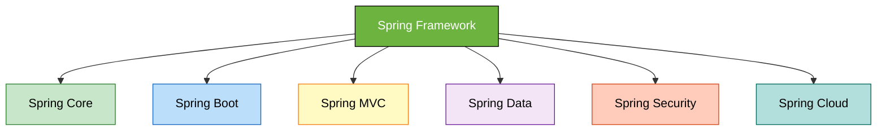

# ☕ Spring Framework - Quick Start Guide

<div align="center">


</div>

<hr style="border: 1px solid rgb(98, 117, 187)">

<div align="center">
<table>
<tr>
<td align="center">
<br />

<h3>© 2026 Avinash Dhanuka</h3>
<p>Quick Guide: Spring Framework Basics</p>
<p><em>Understanding the Why and What of Spring</em></p>


<a href="https://github.com/Avinash-706" target="_blank">

</a>
<br />
<a href="https://mail.google.com/mail/?view=cm&fs=1&to=avunashdhanuka@gmail.com&su=Spring%20Framework%20Query&body=☕%20Hello%20Avinash,%0D%0A%0D%0AMy%20name%20is%20[Your%20Name]%20and%20I%20have%20a%20doubt%20regarding%20Spring%20Framework.%0D%0A%0D%0A🔹%20Topic:%20[Spring%20Core/IoC/Dependency%20Injection]%0D%0A%0D%0AThank%20you!" target="_blank">

</a>
<br />
<br />
</td>
</tr>
</table>
</div>

---

## 📑 Table of Contents
1. [What is Spring Framework?](#1-what-is-spring-framework)
2. [Why Do We Need Spring?](#2-why-do-we-need-spring)
3. [Spring vs Core Java](#3-spring-vs-core-java)
4. [Spring Ecosystem](#4-spring-ecosystem)
5. [IoC Container: BeanFactory vs ApplicationContext](#5-ioc-container-beanfactory-vs-applicationcontext)
6. [Real-World Example](#6-real-world-example)

---

## 1. WHAT IS SPRING FRAMEWORK?

**Spring** is a lightweight Java framework that makes building enterprise applications easier.

**Simple Definition:**
- Spring = A framework that manages your Java objects and their dependencies
- You focus on business logic, Spring handles the "plumbing"

**Real-World Analogy:**
Think of Spring as a **restaurant manager**:
- You (developer) are the chef who creates dishes (business logic)
- Spring is the manager who handles staff, supplies, and coordination
- You don't worry about hiring waiters or buying ingredients - the manager does it

---

## 2. WHY DO WE NEED SPRING?

### Problems in Core Java:

```java
// ❌ Core Java - You create and manage everything
public class App {
    public static void main(String[] args) {
        // You manually create objects
        Database db = new Database();
        UserService service = new UserService(db);
        UserController controller = new UserController(service);
        
        // You manage their lifecycle
        controller.getUser();
        
        // You clean up
        db.close();
    }
}
```

### Solution with Spring:

```java
// ✅ Spring - Framework manages objects for you
public class App {
    public static void main(String[] args) {
        ApplicationContext context = new AnnotationConfigApplicationContext(AppConfig.class);
        
        // Spring creates and injects everything
        UserController controller = context.getBean(UserController.class);
        controller.getUser();
        
        // Spring handles cleanup automatically
    }
}
```

### Key Benefits:

| Problem | Spring Solution |
|:--------|:---------------|
| Manual object creation | Automatic object management (IoC) |
| Tight coupling | Loose coupling (Dependency Injection) |
| Boilerplate code | Reduced code with annotations |
| Complex configuration | Simple configuration |
| Testing difficulty | Easy testing with mocks |

---

## 3. SPRING VS CORE JAVA

| Aspect | Core Java | Spring Framework |
|:-------|:----------|:----------------|
| **Object Creation** | Manual (`new` keyword) | Automatic (Spring creates) |
| **Dependency Management** | You wire dependencies | Spring injects dependencies |
| **Configuration** | Hardcoded in code | External (XML/Annotations) |
| **Coupling** | Tight coupling | Loose coupling |
| **Testing** | Difficult | Easy (mock injection) |
| **Boilerplate Code** | Lots of repetitive code | Minimal code |
| **Enterprise Features** | Build from scratch | Built-in (transactions, security) |

**Example:**

```java
// Core Java - Tight Coupling
public class OrderService {
    private PaymentService payment = new PayPalPayment();  // Hardcoded!
    
    public void processOrder() {
        payment.pay();
    }
}

// Spring - Loose Coupling
@Service
public class OrderService {
    @Autowired
    private PaymentService payment;  // Spring injects any implementation
    
    public void processOrder() {
        payment.pay();
    }
}
```

---

## 4. SPRING ECOSYSTEM

Spring is not just one framework - it's a family of frameworks for different purposes.



### Spring Modules:

| Module | Purpose | Real-World Example |
|:-------|:--------|:-------------------|
| **Spring Core** | Foundation - IoC, DI, Bean management | Restaurant manager (coordinates everything) |
| **Spring Boot** | Quick setup with auto-configuration | Instant restaurant franchise kit |
| **Spring MVC** | Web applications (REST APIs) | Restaurant's online ordering system |
| **Spring Data** | Database operations made easy | Restaurant's inventory management |
| **Spring Security** | Authentication & Authorization | Restaurant's security guard |
| **Spring Cloud** | Microservices & distributed systems | Chain of restaurants working together |

### Quick Comparison:

**Spring Core:**
```java
// Lots of configuration needed
@Configuration
public class AppConfig {
    @Bean
    public DataSource dataSource() {
        // Manual configuration
    }
}
```

**Spring Boot:**
```java
// Auto-configuration - just add dependency!
@SpringBootApplication
public class App {
    public static void main(String[] args) {
        SpringApplication.run(App.class, args);
    }
}
```

---

## 5. IOC CONTAINER: BEANFACTORY VS APPLICATIONCONTEXT

### What is IoC (Inversion of Control)?

**Normal Control Flow:**
- You create objects
- You manage their lifecycle
- You control everything

**Inverted Control (IoC):**
- Spring creates objects
- Spring manages lifecycle
- Spring controls everything

**Real-World Analogy:**
- **Without IoC:** You cook, clean, serve, and manage everything yourself
- **With IoC:** You hire a manager (Spring) who handles staff and operations

### What is a Bean?

**Bean** = Any object managed by Spring

```java
// This is a Bean - Spring manages it
@Component
public class MessageService {
    public String getMessage() {
        return "Hello from Spring Bean!";
    }
}
```

### BeanFactory vs ApplicationContext

Both are **IoC containers** that manage Beans, but ApplicationContext is more powerful.

| Feature | BeanFactory | ApplicationContext |
|:--------|:-----------|:------------------|
| **Type** | Basic container | Advanced container |
| **Bean Loading** | Lazy (on-demand) | Eager (at startup) |
| **Features** | Basic | Advanced (events, i18n, AOP) |
| **Usage** | Rarely used | Commonly used |
| **Memory** | Lightweight | Heavier |
| **Recommended** | ❌ No | ✅ Yes |

**Simple Explanation:**
- **BeanFactory** = Basic toolbox (hammer, screwdriver)
- **ApplicationContext** = Professional workshop (all tools + power tools)

**Code Example:**

```java
// BeanFactory (basic)
BeanFactory factory = new XmlBeanFactory(new FileSystemResource("beans.xml"));
MessageService service = (MessageService) factory.getBean("messageService");

// ApplicationContext (recommended)
ApplicationContext context = new AnnotationConfigApplicationContext(AppConfig.class);
MessageService service = context.getBean(MessageService.class);
```

**When to Use:**
- **BeanFactory:** Never (outdated)
- **ApplicationContext:** Always (modern Spring)

---

## 6. REAL-WORLD EXAMPLE

### Scenario: Coffee Shop Application

**Without Spring (Core Java):**

```java
public class CoffeeShop {
    public static void main(String[] args) {
        // You manually create everything
        CoffeeMachine machine = new CoffeeMachine();
        MilkFrother frother = new MilkFrother();
        Grinder grinder = new Grinder();
        
        // You wire dependencies manually
        Barista barista = new Barista(machine, frother, grinder);
        
        // You manage operations
        barista.makeCoffee("Latte");
        
        // You clean up
        machine.shutdown();
        frother.shutdown();
        grinder.shutdown();
    }
}
```

**Problems:**
- ❌ Too much manual work
- ❌ Hard to change (tight coupling)
- ❌ Difficult to test
- ❌ Repetitive code

**With Spring:**

```java
// 1. Define Beans
@Component
public class CoffeeMachine {
    public void brew() { }
}

@Component
public class MilkFrother {
    public void froth() { }
}

@Component
public class Barista {
    @Autowired
    private CoffeeMachine machine;
    
    @Autowired
    private MilkFrother frother;
    
    public void makeCoffee(String type) {
        machine.brew();
        frother.froth();
    }
}

// 2. Configuration
@Configuration
@ComponentScan(basePackages = "com.coffeeshop")
public class CoffeeShopConfig {
}

// 3. Main Application
public class CoffeeShopApp {
    public static void main(String[] args) {
        ApplicationContext context = 
            new AnnotationConfigApplicationContext(CoffeeShopConfig.class);
        
        // Spring creates and injects everything!
        Barista barista = context.getBean(Barista.class);
        barista.makeCoffee("Latte");
    }
}
```

**Benefits:**
- ✅ Spring manages all objects
- ✅ Easy to swap implementations
- ✅ Easy to test (inject mocks)
- ✅ Clean, minimal code

---

## 📊 Quick Summary

### What is Spring?
A framework that manages your Java objects and makes enterprise development easier.

### Why Spring?
- Reduces boilerplate code
- Manages object lifecycle automatically
- Loose coupling (easy to change)
- Built-in enterprise features

### Key Concepts:
- **IoC (Inversion of Control):** Spring controls object creation
- **DI (Dependency Injection):** Spring injects dependencies
- **Bean:** Object managed by Spring
- **ApplicationContext:** Container that manages Beans

### Remember:
- Spring Core = Foundation (IoC, DI)
- Spring Boot = Quick start with auto-configuration
- ApplicationContext > BeanFactory (always use ApplicationContext)

---

<div align="center">

## 🎓 Next Steps

**You've learned the basics!**

Next, you'll dive deeper into:
- Deep Dive in Internal Working
- Bean Factory in very detail
- Dependency Injection in detail
- Bean scopes and lifecycle
- Spring Boot auto-configuration

<br>

[](https://github.com/Avinash-706)

<br>

---


**Happy Learning! 🚀**

*"Spring makes Java development spring into action!"*

---

</div>
