# ☕ Master Guide: Dependency Injection - From Core Java to Spring Framework

<div align="center">


</div>

<hr style="border: 1px solid rgb(98, 117, 187)">

<div align="center">
<table>
<tr>
<td align="center">
<br />

<h3>© 2026 Avinash Dhanuka</h3>
<p>Master Guide: Dependency Injection Deep Dive</p>
<p><em>Crafted with ❤️ for Understanding Loose Coupling & DI</em></p>

<a href="https://github.com/Avinash-706" target="_blank">

</a>
<br />
<a href="https://mail.google.com/mail/?view=cm&fs=1&to=avunashdhanuka@gmail.com&su=Dependency%20Injection%20Query&body=☕%20Hello%20Avinash,%0D%0A%0D%0AMy%20name%20is%20[Your%20Name]%20and%20I%20have%20a%20doubt%20regarding%20Dependency%20Injection.%0D%0A%0D%0A🔹%20Topic:%20[DI/Spring/IoC]%0D%0A%0D%0AThank%20you!" target="_blank">

</a>
<br />
<br />
</td>
</tr>
</table>
</div>

> **Learning Note:** This guide demonstrates Dependency Injection using Core Java to build a strong foundation before diving into Spring Framework's IoC Container. Understanding DI in plain Java helps you appreciate what Spring does behind the scenes.

> **Prerequisites:** 
> - Basic understanding of Java OOP concepts
> - Knowledge of Interfaces and Polymorphism
> - Understanding of Design Patterns (helpful but not required)

---

## 📑 Table of Contents
1. [What is Dependency Injection?](#1-what-is-dependency-injection)
2. [Tight Coupling vs Loose Coupling](#2-tight-coupling-vs-loose-coupling)
3. [Real-World Examples](#3-real-world-examples)
4. [Types of Dependency Injection](#4-types-of-dependency-injection)
5. [Project Structure & Implementation](#5-project-structure--implementation)
6. [Internal Working Mechanism](#6-internal-working-mechanism)
7. [Spring Framework Connection](#7-spring-framework-connection)
8. [Advantages & Disadvantages](#8-advantages--disadvantages)
9. [Best Practices](#9-best-practices)
10. [Interview Questions](#10-top-interview-questions)

---

## 1. WHAT IS DEPENDENCY INJECTION?

<div align="center">

</div>

> **📝 Author:** Avinash Dhanuka | [GitHub](https://github.com/Avinash-706)

### 📌 Definition

**Dependency Injection (DI)** is a design pattern where objects receive their dependencies from external sources rather than creating them internally.

**Simple Analogy:**
- **Without DI:** You build your own car engine from scratch every time you need a car
- **With DI:** Someone hands you a ready-made engine, and you just install it in your car

### 🎯 Core Concept

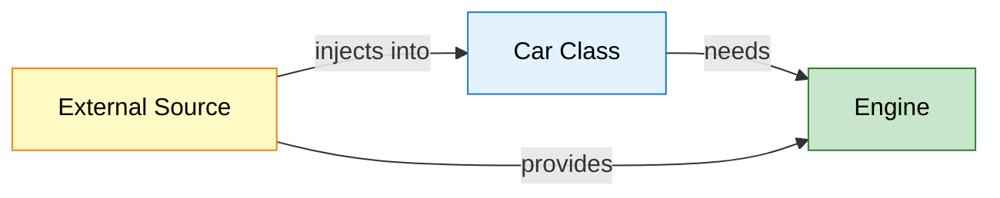

**Key Principle:** "Don't create dependencies, receive them!"


### 📊 Problem Statement

**Reference:** [Car.java](src/main/java/org/example/entity/Car.java)

**❌ Without Dependency Injection (Tight Coupling):**

```java
public class Car {
    private DieselEngine engine;  // Tightly coupled to DieselEngine
    
    public Car() {
        this.engine = new DieselEngine();  // Car creates its own dependency
    }
    
    public void start() {
        engine.run();
    }
}
```

**Problems:**
1. ❌ Car is locked to DieselEngine only
2. ❌ Cannot switch to PetrolEngine without modifying Car class
3. ❌ Hard to test (cannot mock engine)
4. ❌ Violates Open-Closed Principle
5. ❌ High coupling, low flexibility

**✅ With Dependency Injection (Loose Coupling):**

```java
public class Car {
    private Engine engine;  // Depends on interface, not implementation
    
    // Constructor Injection
    public Car(Engine engine) {
        this.engine = engine;  // Dependency is injected
    }
    
    public void start() {
        engine.run();
    }
}

// Usage
Engine petrolEngine = new PetrolEngine();
Car car1 = new Car(petrolEngine);  // Inject PetrolEngine

Engine dieselEngine = new DieselEngine();
Car car2 = new Car(dieselEngine);  // Inject DieselEngine
```

**Benefits:**
1. ✅ Car works with any Engine implementation
2. ✅ Easy to switch engines without changing Car
3. ✅ Easy to test with mock engines
4. ✅ Follows SOLID principles
5. ✅ Low coupling, high flexibility

<div align="center">

</div>

---

## 2. TIGHT COUPLING VS LOOSE COUPLING

<div align="center">

</div>

> **📝 Understanding Coupling by:** Avinash Dhanuka

### 📌 What is Coupling?

**Coupling** = The degree of dependency between classes/modules.

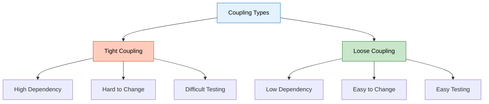


### 🔴 Tight Coupling (Rigid Coupling)

<div align="center">

</div>

**Definition:** Classes are highly dependent on each other. Changes in one class require changes in dependent classes.

#### 5 Real-World Examples of Tight Coupling

#### Example 1: Laptop with Soldered RAM

**Real-Life Scenario:**
- Old MacBook Pro has RAM soldered directly to motherboard
- Cannot upgrade RAM without replacing entire motherboard
- Expensive and inflexible

**Code Example:**

```java
public class Laptop {
    private SolderedRAM ram;  // Tightly coupled
    
    public Laptop() {
        this.ram = new SolderedRAM(8);  // Fixed 8GB, cannot change
    }
    
    public void boot() {
        ram.initialize();
    }
}

class SolderedRAM {
    private int size;
    
    public SolderedRAM(int size) {
        this.size = size;
    }
    
    public void initialize() {
        System.out.println("Initializing " + size + "GB RAM");
    }
}

// Problem: Want 16GB? Buy new laptop! 💸
```

**Issues:**
- ❌ Cannot upgrade RAM
- ❌ Laptop class must change if RAM changes
- ❌ Cannot test with different RAM sizes
- ❌ Expensive to modify

---

#### Example 2: Facebook App with Hardcoded Database

**Real-Life Scenario:**
- Facebook app directly creates MySQL database connection
- Want to switch to PostgreSQL? Rewrite entire app!
- Cannot test without real database

**Code Example:**

```java
public class FacebookApp {
    private MySQLDatabase database;  // Tightly coupled
    
    public FacebookApp() {
        this.database = new MySQLDatabase();  // Hardcoded dependency
    }
    
    public void savePost(String content) {
        database.insert("posts", content);
    }
}

class MySQLDatabase {
    public void insert(String table, String data) {
        System.out.println("Inserting into MySQL: " + data);
    }
}

// Problem: Switching to PostgreSQL requires changing FacebookApp class
```

**Issues:**
- ❌ Locked to MySQL only
- ❌ Cannot switch databases easily
- ❌ Hard to test (needs real MySQL)
- ❌ Violates Single Responsibility Principle

---

#### Example 3: Free Fire Game with Fixed Graphics Engine

**Real-Life Scenario:**
- Game directly instantiates DirectX graphics engine
- Want to support OpenGL for Linux? Rewrite game!
- Cannot run on different platforms

**Code Example:**

```java
public class FreeFireGame {
    private DirectXEngine graphics;  // Tightly coupled
    
    public FreeFireGame() {
        this.graphics = new DirectXEngine();  // Windows only
    }
    
    public void render() {
        graphics.drawFrame();
    }
}

class DirectXEngine {
    public void drawFrame() {
        System.out.println("Rendering with DirectX (Windows only)");
    }
}

// Problem: Cannot run on Mac or Linux!
```

**Issues:**
- ❌ Windows-only game
- ❌ Cannot support multiple platforms
- ❌ Hard to add new graphics engines
- ❌ Limited market reach

---

#### Example 4: Male-Female Relationship (Monogamous Marriage)

**Real-Life Scenario:**
- Person class is hardcoded to marry only one specific person
- Cannot change partner without "rewriting" the person
- Inflexible relationship model

**Code Example:**

```java
public class Male {
    private Female wife;  // Tightly coupled to specific Female
    
    public Male() {
        this.wife = new Female("Alice");  // Hardcoded wife
    }
    
    public void introduce() {
        System.out.println("My wife is " + wife.getName());
    }
}

class Female {
    private String name;
    
    public Female(String name) {
        this.name = name;
    }
    
    public String getName() {
        return name;
    }
}

// Problem: Male is forever bound to Alice. No flexibility!
```

**Issues:**
- ❌ Cannot change partner
- ❌ Male class must be modified for different Female
- ❌ Not reusable
- ❌ Unrealistic model

---

#### Example 5: Coffee Machine with Built-in Grinder

**Real-Life Scenario:**
- Coffee machine has grinder permanently attached
- Grinder breaks? Throw away entire machine!
- Cannot use pre-ground coffee

**Code Example:**

```java
public class CoffeeMachine {
    private BuiltInGrinder grinder;  // Tightly coupled
    
    public CoffeeMachine() {
        this.grinder = new BuiltInGrinder();  // Cannot replace
    }
    
    public void makeCoffee() {
        grinder.grind();
        System.out.println("Brewing coffee...");
    }
}

class BuiltInGrinder {
    public void grind() {
        System.out.println("Grinding beans...");
    }
}

// Problem: Grinder breaks = entire machine useless
```

**Issues:**
- ❌ Cannot replace broken grinder
- ❌ Cannot use different grinder types
- ❌ Wasteful (throw away working parts)
- ❌ Expensive to maintain


---

### 🟢 Loose Coupling

<div align="center">

</div>

**Definition:** Classes depend on abstractions (interfaces) rather than concrete implementations. Easy to swap dependencies.

#### 5 Real-World Examples of Loose Coupling

#### Example 1: Laptop with Removable RAM

**Real-Life Scenario:**
- Modern laptop has RAM slots
- Can upgrade from 8GB to 16GB to 32GB
- Just swap RAM modules, no motherboard change needed

**Code Example:**

```java
// Interface (abstraction)
interface RAM {
    void initialize();
    int getSize();
}

// Implementations
class RAM8GB implements RAM {
    public void initialize() {
        System.out.println("Initializing 8GB RAM");
    }
    
    public int getSize() {
        return 8;
    }
}

class RAM16GB implements RAM {
    public void initialize() {
        System.out.println("Initializing 16GB RAM");
    }
    
    public int getSize() {
        return 16;
    }
}

// Laptop depends on interface, not implementation
public class Laptop {
    private RAM ram;  // Loosely coupled
    
    public Laptop(RAM ram) {  // Dependency Injection
        this.ram = ram;
    }
    
    public void boot() {
        ram.initialize();
        System.out.println("Laptop booted with " + ram.getSize() + "GB RAM");
    }
}

// Usage - Easy to swap!
RAM ram8 = new RAM8GB();
Laptop laptop1 = new Laptop(ram8);  // 8GB laptop

RAM ram16 = new RAM16GB();
Laptop laptop2 = new Laptop(ram16);  // 16GB laptop - no code change!
```

**Benefits:**
- ✅ Easy to upgrade RAM
- ✅ Laptop code never changes
- ✅ Can test with mock RAM
- ✅ Flexible and maintainable

---

#### Example 2: Facebook App with Database Interface

**Real-Life Scenario:**
- Facebook can switch between MySQL, PostgreSQL, MongoDB
- Same app code works with any database
- Easy to test with in-memory database

**Code Example:**

```java
// Interface (abstraction)
interface Database {
    void insert(String table, String data);
    String query(String table, String id);
}

// Implementations
class MySQLDatabase implements Database {
    public void insert(String table, String data) {
        System.out.println("MySQL: Inserting into " + table);
    }
    
    public String query(String table, String id) {
        return "MySQL data from " + table;
    }
}

class PostgreSQLDatabase implements Database {
    public void insert(String table, String data) {
        System.out.println("PostgreSQL: Inserting into " + table);
    }
    
    public String query(String table, String id) {
        return "PostgreSQL data from " + table;
    }
}

class MongoDBDatabase implements Database {
    public void insert(String table, String data) {
        System.out.println("MongoDB: Inserting into " + table);
    }
    
    public String query(String table, String id) {
        return "MongoDB data from " + table;
    }
}

// Facebook app depends on interface
public class FacebookApp {
    private Database database;  // Loosely coupled
    
    public FacebookApp(Database database) {  // Dependency Injection
        this.database = database;
    }
    
    public void savePost(String content) {
        database.insert("posts", content);
    }
    
    public String getPost(String id) {
        return database.query("posts", id);
    }
}

// Usage - Switch databases easily!
Database mysql = new MySQLDatabase();
FacebookApp app1 = new FacebookApp(mysql);  // MySQL version

Database postgres = new PostgreSQLDatabase();
FacebookApp app2 = new FacebookApp(postgres);  // PostgreSQL version

Database mongo = new MongoDBDatabase();
FacebookApp app3 = new FacebookApp(mongo);  // MongoDB version
```

**Benefits:**
- ✅ Switch databases without changing app code
- ✅ Easy to test with mock database
- ✅ Can use different databases for different environments
- ✅ Follows Open-Closed Principle

---

#### Example 3: Free Fire Game with Graphics Interface

**Real-Life Scenario:**
- Game supports DirectX (Windows), OpenGL (Linux), Metal (Mac)
- Same game code runs on all platforms
- Just inject appropriate graphics engine

**Code Example:**

```java
// Interface (abstraction)
interface GraphicsEngine {
    void drawFrame();
    void renderTexture(String texture);
}

// Implementations
class DirectXEngine implements GraphicsEngine {
    public void drawFrame() {
        System.out.println("DirectX: Rendering frame (Windows)");
    }
    
    public void renderTexture(String texture) {
        System.out.println("DirectX: Loading " + texture);
    }
}

class OpenGLEngine implements GraphicsEngine {
    public void drawFrame() {
        System.out.println("OpenGL: Rendering frame (Linux/Mac)");
    }
    
    public void renderTexture(String texture) {
        System.out.println("OpenGL: Loading " + texture);
    }
}

class MetalEngine implements GraphicsEngine {
    public void drawFrame() {
        System.out.println("Metal: Rendering frame (Mac)");
    }
    
    public void renderTexture(String texture) {
        System.out.println("Metal: Loading " + texture);
    }
}

// Game depends on interface
public class FreeFireGame {
    private GraphicsEngine graphics;  // Loosely coupled
    
    public FreeFireGame(GraphicsEngine graphics) {  // Dependency Injection
        this.graphics = graphics;
    }
    
    public void render() {
        graphics.drawFrame();
        graphics.renderTexture("player.png");
    }
}

// Usage - Cross-platform support!
GraphicsEngine directX = new DirectXEngine();
FreeFireGame windowsGame = new FreeFireGame(directX);  // Windows

GraphicsEngine openGL = new OpenGLEngine();
FreeFireGame linuxGame = new FreeFireGame(openGL);  // Linux

GraphicsEngine metal = new MetalEngine();
FreeFireGame macGame = new FreeFireGame(metal);  // Mac
```

**Benefits:**
- ✅ Cross-platform game
- ✅ Same code runs everywhere
- ✅ Easy to add new graphics engines
- ✅ Larger market reach

---

#### Example 4: Person with Partner Interface (Modern Relationships)

**Real-Life Scenario:**
- Person can have different types of partners
- Relationship is flexible and changeable
- Realistic model of modern relationships

**Code Example:**

```java
// Interface (abstraction)
interface Partner {
    String getName();
    void interact();
}

// Implementations
class Male implements Partner {
    private String name;
    
    public Male(String name) {
        this.name = name;
    }
    
    public String getName() {
        return name;
    }
    
    public void interact() {
        System.out.println(name + " is interacting as male partner");
    }
}

class Female implements Partner {
    private String name;
    
    public Female(String name) {
        this.name = name;
    }
    
    public String getName() {
        return name;
    }
    
    public void interact() {
        System.out.println(name + " is interacting as female partner");
    }
}

// Person depends on interface
public class Person {
    private String name;
    private Partner partner;  // Loosely coupled
    
    public Person(String name) {
        this.name = name;
    }
    
    public void setPartner(Partner partner) {  // Dependency Injection
        this.partner = partner;
    }
    
    public void introduce() {
        if (partner != null) {
            System.out.println(name + "'s partner is " + partner.getName());
            partner.interact();
        }
    }
}

// Usage - Flexible relationships!
Person john = new Person("John");

Partner alice = new Female("Alice");
john.setPartner(alice);  // John with Alice
john.introduce();

Partner bob = new Male("Bob");
john.setPartner(bob);  // John with Bob - no code change!
john.introduce();
```

**Benefits:**
- ✅ Flexible relationship model
- ✅ Person class never changes
- ✅ Realistic and inclusive
- ✅ Easy to extend

---

#### Example 5: Coffee Machine with Interchangeable Grinder

**Real-Life Scenario:**
- Coffee machine accepts any grinder
- Grinder breaks? Just replace it!
- Can use different grinders for different beans

**Code Example:**

```java
// Interface (abstraction)
interface Grinder {
    void grind();
    String getType();
}

// Implementations
class BurrGrinder implements Grinder {
    public void grind() {
        System.out.println("Burr grinder: Grinding beans uniformly");
    }
    
    public String getType() {
        return "Burr";
    }
}

class BladeGrinder implements Grinder {
    public void grind() {
        System.out.println("Blade grinder: Grinding beans quickly");
    }
    
    public String getType() {
        return "Blade";
    }
}

class ManualGrinder implements Grinder {
    public void grind() {
        System.out.println("Manual grinder: Grinding beans by hand");
    }
    
    public String getType() {
        return "Manual";
    }
}

// Coffee machine depends on interface
public class CoffeeMachine {
    private Grinder grinder;  // Loosely coupled
    
    public CoffeeMachine(Grinder grinder) {  // Dependency Injection
        this.grinder = grinder;
    }
    
    public void setGrinder(Grinder grinder) {
        this.grinder = grinder;
    }
    
    public void makeCoffee() {
        System.out.println("Using " + grinder.getType() + " grinder");
        grinder.grind();
        System.out.println("Brewing coffee...");
    }
}

// Usage - Swap grinders easily!
Grinder burr = new BurrGrinder();
CoffeeMachine machine = new CoffeeMachine(burr);
machine.makeCoffee();

// Grinder broke? Just replace it!
Grinder blade = new BladeGrinder();
machine.setGrinder(blade);
machine.makeCoffee();

// Want manual? No problem!
Grinder manual = new ManualGrinder();
machine.setGrinder(manual);
machine.makeCoffee();
```

**Benefits:**
- ✅ Easy to replace grinder
- ✅ Can use different grinders
- ✅ Sustainable (replace only broken part)
- ✅ Cost-effective


---

### 📊 Tight vs Loose Coupling Comparison

| Aspect | Tight Coupling | Loose Coupling |
|:-------|:--------------|:---------------|
| **Dependency** | Concrete classes | Interfaces/Abstractions |
| **Flexibility** | Low | High |
| **Maintainability** | Hard | Easy |
| **Testability** | Difficult | Easy |
| **Reusability** | Low | High |
| **Change Impact** | High (ripple effect) | Low (isolated) |
| **Example** | `new DieselEngine()` | `Engine engine` (interface) |
| **Real-Life** | Soldered RAM | Removable RAM |

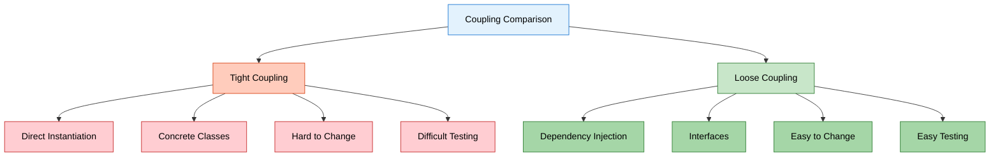

---

## 3. REAL-WORLD EXAMPLES

<div align="center">

</div>

> **📝 Practical Understanding by:** Avinash Dhanuka

### 🎯 Our Project: Car and Engine System

**Reference:** [Driver.java](src/main/java/org/example/driver/Driver.java)

**Scenario:** A car needs an engine to run. The car should work with any type of engine (Petrol or Diesel).

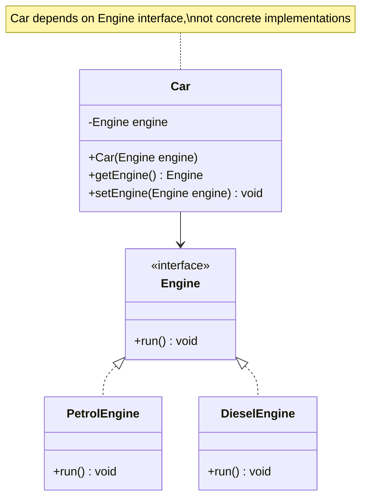

**Real-Life Analogy:**
- **Car** = Your application
- **Engine** = A service/dependency your app needs
- **PetrolEngine/DieselEngine** = Different implementations of the service
- **Injection** = Providing the engine to the car from outside


### 📱 More Real-World Examples

#### Example 1: Payment Gateway in E-Commerce

```java
// Interface
interface PaymentGateway {
    boolean processPayment(double amount);
}

// Implementations
class PayPal implements PaymentGateway {
    public boolean processPayment(double amount) {
        System.out.println("Processing $" + amount + " via PayPal");
        return true;
    }
}

class Stripe implements PaymentGateway {
    public boolean processPayment(double amount) {
        System.out.println("Processing $" + amount + " via Stripe");
        return true;
    }
}

class Razorpay implements PaymentGateway {
    public boolean processPayment(double amount) {
        System.out.println("Processing ₹" + amount + " via Razorpay");
        return true;
    }
}

// E-Commerce app
class ShoppingCart {
    private PaymentGateway paymentGateway;
    
    public ShoppingCart(PaymentGateway paymentGateway) {
        this.paymentGateway = paymentGateway;
    }
    
    public void checkout(double amount) {
        paymentGateway.processPayment(amount);
    }
}

// Usage
PaymentGateway paypal = new PayPal();
ShoppingCart cart1 = new ShoppingCart(paypal);  // PayPal checkout

PaymentGateway stripe = new Stripe();
ShoppingCart cart2 = new ShoppingCart(stripe);  // Stripe checkout
```

**Benefits:**
- ✅ Easy to add new payment gateways
- ✅ Can switch gateways based on user preference
- ✅ Easy to test with mock payment gateway

---

#### Example 2: Notification System

```java
// Interface
interface NotificationService {
    void send(String message, String recipient);
}

// Implementations
class EmailNotification implements NotificationService {
    public void send(String message, String recipient) {
        System.out.println("Email to " + recipient + ": " + message);
    }
}

class SMSNotification implements NotificationService {
    public void send(String message, String recipient) {
        System.out.println("SMS to " + recipient + ": " + message);
    }
}

class PushNotification implements NotificationService {
    public void send(String message, String recipient) {
        System.out.println("Push notification to " + recipient + ": " + message);
    }
}

// User service
class UserService {
    private NotificationService notificationService;
    
    public UserService(NotificationService notificationService) {
        this.notificationService = notificationService;
    }
    
    public void notifyUser(String message, String recipient) {
        notificationService.send(message, recipient);
    }
}

// Usage
NotificationService email = new EmailNotification();
UserService service1 = new UserService(email);  // Email notifications

NotificationService sms = new SMSNotification();
UserService service2 = new UserService(sms);  // SMS notifications
```

---

#### Example 3: Logger System

```java
// Interface
interface Logger {
    void log(String message);
}

// Implementations
class ConsoleLogger implements Logger {
    public void log(String message) {
        System.out.println("[CONSOLE] " + message);
    }
}

class FileLogger implements Logger {
    public void log(String message) {
        System.out.println("[FILE] Writing to log.txt: " + message);
    }
}

class DatabaseLogger implements Logger {
    public void log(String message) {
        System.out.println("[DATABASE] Inserting log: " + message);
    }
}

// Application
class Application {
    private Logger logger;
    
    public Application(Logger logger) {
        this.logger = logger;
    }
    
    public void doSomething() {
        logger.log("Application started");
        // Business logic
        logger.log("Application finished");
    }
}

// Usage - Switch loggers easily
Logger console = new ConsoleLogger();
Application app1 = new Application(console);  // Console logging

Logger file = new FileLogger();
Application app2 = new Application(file);  // File logging

Logger database = new DatabaseLogger();
Application app3 = new Application(database);  // Database logging
```

---

## 4. TYPES OF DEPENDENCY INJECTION

<div align="center">

</div>

> **📝 Three Ways to Inject Dependencies by:** Avinash Dhanuka

### 📌 Overview

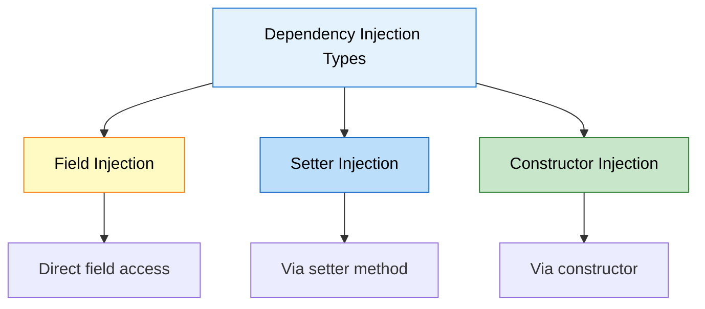

**Reference:** [Driver.java:30-44](src/main/java/org/example/driver/Driver.java#L30)


---

### 1️⃣ Field Injection (Direct Assignment)

**Definition:** Directly assigning dependency to a field.

**Reference:** [Driver.java:32-34](src/main/java/org/example/driver/Driver.java#L32)

**Code Example:**

```java
public class Car {
    // Field is accessible (not recommended in production)
    public Engine engine;  // or package-private
}

// Usage
Car car = new Car();
Engine engine = new PetrolEngine();
car.engine = engine;  // Direct field injection
car.engine.run();
```

**Pros:**
- ✅ Simple and straightforward
- ✅ Less boilerplate code
- ✅ Quick for prototyping

**Cons:**
- ❌ Breaks encapsulation (field must be public/package-private)
- ❌ Hard to make field final (immutability)
- ❌ Difficult to test
- ❌ Not recommended in production
- ❌ Violates OOP principles

**Real-Life Analogy:**
- Like putting engine directly into car without proper installation
- No safety checks, no proper mounting
- Works but not professional

**When to Use:**
- ⚠️ Only for quick prototypes or demos
- ⚠️ Not recommended for production code

---

### 2️⃣ Setter Injection (Method-Based)

**Definition:** Injecting dependency through a setter method.

**Reference:** [Driver.java:37-39](src/main/java/org/example/driver/Driver.java#L37) | [Car.java:9-15](src/main/java/org/example/entity/Car.java#L9)

**Code Example:**

```java
public class Car {
    private Engine engine;  // Private field (encapsulated)
    
    // Setter method for injection
    public void setEngine(Engine engine) {
        this.engine = engine;
    }
    
    // Getter method
    public Engine getEngine() {
        return engine;
    }
}

// Usage
Car car = new Car();
Engine engine = new PetrolEngine();
car.setEngine(engine);  // Setter injection
car.getEngine().run();
```

**Pros:**
- ✅ Maintains encapsulation (private field)
- ✅ Optional dependencies (can be null)
- ✅ Can change dependency at runtime
- ✅ Flexible for optional features

**Cons:**
- ❌ Dependency can be null (NullPointerException risk)
- ❌ Object can be in invalid state
- ❌ Cannot make field final
- ❌ Mutable (can be changed anytime)

**Real-Life Analogy:**
- Like installing engine after car is built
- Can swap engine later if needed
- But car might run without engine (dangerous!)

**When to Use:**
- ✅ Optional dependencies
- ✅ Dependencies that might change at runtime
- ✅ Circular dependencies (rare cases)

**Example with Optional Dependency:**

```java
public class Car {
    private Engine engine;
    private GPS gps;  // Optional feature
    
    public void setEngine(Engine engine) {
        this.engine = engine;  // Required
    }
    
    public void setGPS(GPS gps) {
        this.gps = gps;  // Optional
    }
    
    public void start() {
        if (engine == null) {
            throw new IllegalStateException("Engine is required!");
        }
        engine.run();
        
        if (gps != null) {
            gps.navigate();  // Use GPS if available
        }
    }
}
```

---

### 3️⃣ Constructor Injection (Recommended ✅)

**Definition:** Injecting dependency through constructor parameters.

**Reference:** [Driver.java:42-44](src/main/java/org/example/driver/Driver.java#L42) | [Car.java:17-23](src/main/java/org/example/entity/Car.java#L17)

**Code Example:**

```java
public class Car {
    private final Engine engine;  // Final = immutable
    
    // Constructor injection
    public Car(Engine engine) {
        if (engine == null) {
            throw new IllegalArgumentException("Engine cannot be null");
        }
        this.engine = engine;
    }
    
    public Engine getEngine() {
        return engine;
    }
}

// Usage
Engine engine = new PetrolEngine();
Car car = new Car(engine);  // Constructor injection
car.getEngine().run();
```

**Pros:**
- ✅ **Best practice** (recommended by Spring)
- ✅ Immutable (field can be final)
- ✅ Guarantees object is fully initialized
- ✅ Easy to test (clear dependencies)
- ✅ Compile-time safety
- ✅ Cannot create object without dependencies

**Cons:**
- ❌ More verbose for many dependencies
- ❌ Cannot change dependency at runtime
- ❌ Circular dependencies are harder to resolve

**Real-Life Analogy:**
- Like building car with engine already installed
- Car cannot exist without engine
- Safe and professional approach

**When to Use:**
- ✅ **Always** for required dependencies
- ✅ Production code
- ✅ When immutability is important
- ✅ When you want compile-time safety

**Example with Multiple Dependencies:**

```java
public class Car {
    private final Engine engine;
    private final Transmission transmission;
    private final Brakes brakes;
    
    // Constructor injection with multiple dependencies
    public Car(Engine engine, Transmission transmission, Brakes brakes) {
        if (engine == null || transmission == null || brakes == null) {
            throw new IllegalArgumentException("All components are required");
        }
        this.engine = engine;
        this.transmission = transmission;
        this.brakes = brakes;
    }
    
    public void start() {
        engine.run();
        transmission.engage();
    }
    
    public void stop() {
        brakes.apply();
        engine.stop();
    }
}

// Usage
Engine engine = new PetrolEngine();
Transmission transmission = new AutomaticTransmission();
Brakes brakes = new DiscBrakes();

Car car = new Car(engine, transmission, brakes);  // All dependencies provided
```

---

### 📊 Comparison of Injection Types

| Aspect | Field Injection | Setter Injection | Constructor Injection |
|:-------|:---------------|:----------------|:---------------------|
| **Encapsulation** | ❌ Broken | ✅ Maintained | ✅ Maintained |
| **Immutability** | ❌ No | ❌ No | ✅ Yes (final) |
| **Null Safety** | ❌ No | ❌ No | ✅ Yes |
| **Testability** | ⚠️ Moderate | ✅ Good | ✅ Excellent |
| **Optional Dependencies** | ✅ Yes | ✅ Yes | ❌ No |
| **Runtime Changes** | ✅ Yes | ✅ Yes | ❌ No |
| **Spring Recommendation** | ❌ Not recommended | ⚠️ For optional | ✅ **Recommended** |
| **Use Case** | Prototypes only | Optional features | Required dependencies |

**Visual Comparison:**

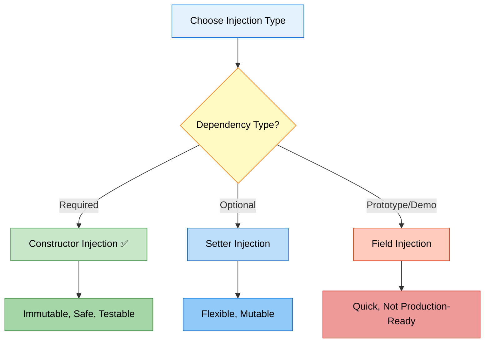


---

## 5. PROJECT STRUCTURE & IMPLEMENTATION

<div align="center">

</div>

> **📝 Code Walkthrough by:** Avinash Dhanuka

### 📁 Project Structure

```
DependencyInjections/
├── src/
│   ├── main/
│   │   └── java/
│   │       └── org/
│   │           └── example/
│   │               ├── App.java
│   │               ├── driver/
│   │               │   └── Driver.java          # Main execution
│   │               └── entity/
│   │                   ├── Engine.java          # Interface
│   │                   ├── PetrolEngine.java    # Implementation 1
│   │                   ├── DieselEngine.java    # Implementation 2
│   │                   └── Car.java             # Dependent class
│   └── test/
│       └── java/
│           └── org/
│               └── example/
│                   └── AppTest.java
├── pom.xml
└── README.md
```

---

### 🔍 Code Implementation

#### 1️⃣ Engine Interface (Abstraction)

**Reference:** [Engine.java](src/main/java/org/example/entity/Engine.java)

```java
package org.example.entity;

public interface Engine {
    void run();
}
```

**Purpose:**
- Defines contract for all engine types
- Enables loose coupling
- Allows polymorphism

**Real-Life Analogy:**
- Like a blueprint that says "all engines must have a run() method"
- Doesn't care HOW engine runs, just that it CAN run

---

#### 2️⃣ PetrolEngine Implementation

**Reference:** [PetrolEngine.java](src/main/java/org/example/entity/PetrolEngine.java)

```java
package org.example.entity;

public class PetrolEngine implements Engine {
    @Override
    public void run() {
        System.out.println("Running with LESS vibrations");
    }
}
```

**Characteristics:**
- Implements Engine interface
- Provides specific behavior (less vibrations)
- Can be injected into Car

**Real-Life:**
- Petrol engines are smoother
- Less noise and vibration
- Higher RPM capability

---

#### 3️⃣ DieselEngine Implementation

**Reference:** [DieselEngine.java](src/main/java/org/example/entity/DieselEngine.java)

```java
package org.example.entity;

public class DieselEngine implements Engine {
    @Override
    public void run() {
        System.out.println("Running with MORE vibrations");
    }
}
```

**Characteristics:**
- Implements Engine interface
- Provides specific behavior (more vibrations)
- Can be injected into Car

**Real-Life:**
- Diesel engines are more powerful
- More torque for heavy loads
- More vibration and noise

---

#### 4️⃣ Car Class (Dependent)

**Reference:** [Car.java](src/main/java/org/example/entity/Car.java)

```java
package org.example.entity;

public class Car {
    // Field for dependency
    private Engine engine;
    
    // Getter for Setter Injection
    public Engine getEngine() {
        return engine;
    }
    
    // Setter for Setter Injection
    public void setEngine(Engine engine) {
        this.engine = engine;
    }
    
    // Default constructor
    public Car() {
        // Empty constructor for Field/Setter injection
    }
    
    // Constructor for Constructor Injection
    public Car(Engine engine) {
        this.engine = engine;
    }
}
```

**Key Points:**
- Depends on Engine interface (not concrete class)
- Supports all three injection types
- Loose coupling achieved

**Design Decisions:**
- `private Engine engine` - Encapsulation
- Interface type - Polymorphism
- Multiple constructors - Flexibility

---

#### 5️⃣ Driver Class (Main Execution)

**Reference:** [Driver.java](src/main/java/org/example/driver/Driver.java)

```java
package org.example.driver;

import org.example.entity.Car;
import org.example.entity.DieselEngine;
import org.example.entity.Engine;
import org.example.entity.PetrolEngine;

import java.util.Scanner;

public class Driver {
    public static void main(String[] args) {
        Scanner sc = new Scanner(System.in);
        
        // User menu
        System.out.println("1. Petrol Engine");
        System.out.println("2. Diesel Engine");
        System.out.print("Enter Engine choice : ");
        byte userInput = sc.nextByte();
        sc.nextLine();
        
        // Eager instantiation of Car
        Car car = new Car();
        Engine engine = null;
        
        // Lazy instantiation of Engine based on user choice
        switch (userInput) {
            case 1:
                engine = new PetrolEngine();
                break;
            case 2:
                engine = new DieselEngine();
                break;
            default:
                System.out.println("Wrong Input");
                break;
        }
        
        System.out.println("Great Choice !!");
        
        // ===== FIELD INJECTION (Commented) =====
        // car.engine = engine;
        // car.engine.run();
        // System.out.println(car.engine.getClass());
        
        // ===== SETTER INJECTION (Commented) =====
        // car.setEngine(engine);
        // car.getEngine().run();
        // System.out.println(car.getEngine().getClass());
        
        // ===== CONSTRUCTOR INJECTION (Active) =====
        car = new Car(engine);
        car.getEngine().run();
        System.out.println(car.getEngine().getClass());
    }
}
```

**Execution Flow:**

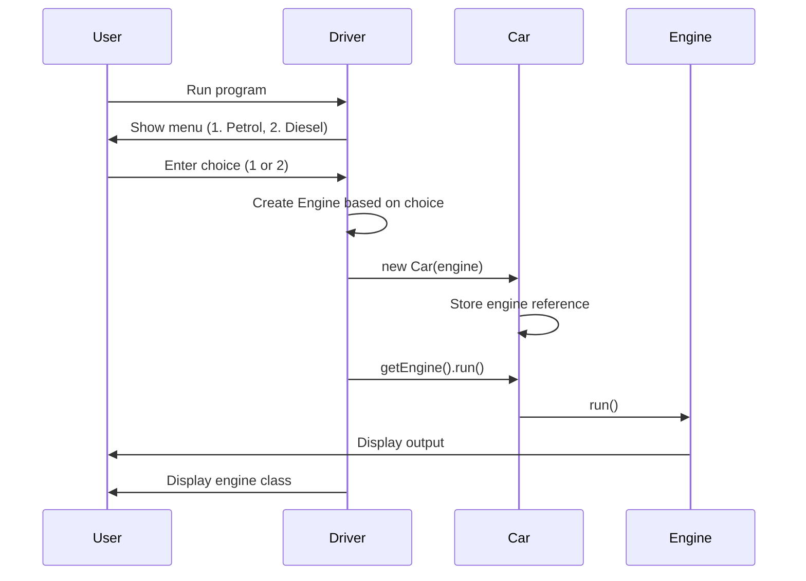

**Key Concepts:**

1. **Eager Instantiation:**
   ```java
   Car car = new Car();  // Created immediately
   ```

2. **Lazy Instantiation:**
   ```java
   Engine engine = null;  // Created only when needed
   switch (userInput) {
       case 1: engine = new PetrolEngine(); break;
   }
   ```

3. **Polymorphism:**
   ```java
   Engine engine = new PetrolEngine();  // Engine reference, PetrolEngine object
   ```

4. **Dependency Injection:**
   ```java
   car = new Car(engine);  // Injecting dependency via constructor
   ```

---

### 🎮 Sample Execution

**Scenario 1: Petrol Engine**

```
1. Petrol Engine
2. Diesel Engine
Enter Engine choice : 1
Great Choice !!
Running with LESS vibrations
class org.example.entity.PetrolEngine
```

**Scenario 2: Diesel Engine**

```
1. Petrol Engine
2. Diesel Engine
Enter Engine choice : 2
Great Choice !!
Running with MORE vibrations
class org.example.entity.DieselEngine
```

**Scenario 3: Invalid Input**

```
1. Petrol Engine
2. Diesel Engine
Enter Engine choice : 5
Wrong Input
Great Choice !!
Exception in thread "main" java.lang.NullPointerException
```

**⚠️ Note:** The code has a bug - it doesn't handle invalid input properly. Engine remains null, causing NullPointerException.

**Fixed Version:**

```java
if (engine == null) {
    System.out.println("Invalid choice. Exiting...");
    return;
}

System.out.println("Great Choice !!");
car = new Car(engine);
car.getEngine().run();
```


---

## 6. INTERNAL WORKING MECHANISM

<div align="center">

</div>

> **📝 Deep Dive into How DI Works by:** Avinash Dhanuka

### 📌 Memory Allocation & Object Creation

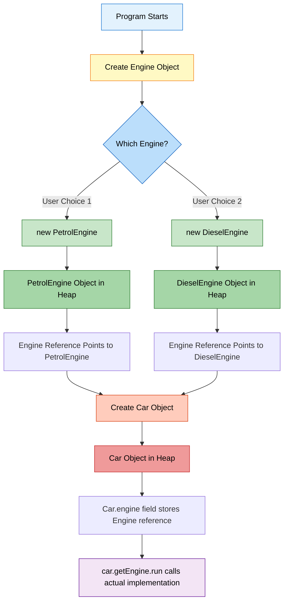

### 🧠 Step-by-Step Execution

#### Step 1: User Input

```java
Scanner sc = new Scanner(System.in);
System.out.print("Enter Engine choice : ");
byte userInput = sc.nextByte();  // User enters 1
```

**Memory State:**
```
Stack:
  userInput = 1

Heap:
  Scanner object
```

---

#### Step 2: Create Car Object (Eager)

```java
Car car = new Car();
```

**Memory State:**
```
Stack:
  userInput = 1
  car = reference to Car@123

Heap:
  Car@123 {
    engine = null
  }
```

---

#### Step 3: Create Engine Object (Lazy)

```java
Engine engine = null;
switch (userInput) {
    case 1:
        engine = new PetrolEngine();  // Executed
        break;
}
```

**Memory State:**
```
Stack:
  userInput = 1
  car = reference to Car@123
  engine = reference to PetrolEngine@456

Heap:
  Car@123 {
    engine = null
  }
  PetrolEngine@456 {
    // PetrolEngine object
  }
```

**Key Point:** `engine` is of type `Engine` (interface) but points to `PetrolEngine` object (polymorphism).

---

#### Step 4: Constructor Injection

```java
car = new Car(engine);
```

**What Happens:**
1. New Car object is created
2. Constructor `Car(Engine engine)` is called
3. Parameter `engine` (PetrolEngine@456) is passed
4. Inside constructor: `this.engine = engine;`
5. Car's engine field now points to PetrolEngine@456

**Memory State:**
```
Stack:
  userInput = 1
  car = reference to Car@789  (new object!)
  engine = reference to PetrolEngine@456

Heap:
  Car@123 {  // Old car object (garbage collected later)
    engine = null
  }
  Car@789 {  // New car object
    engine = reference to PetrolEngine@456
  }
  PetrolEngine@456 {
    // PetrolEngine object
  }
```

---

#### Step 5: Method Invocation

```java
car.getEngine().run();
```

**Execution Flow:**

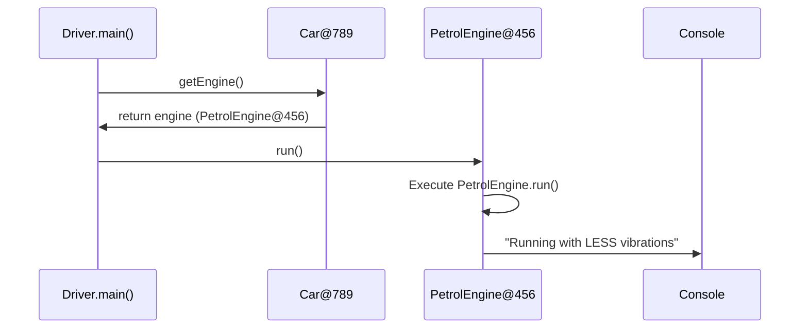

**What Happens:**
1. `car.getEngine()` returns the engine field (PetrolEngine@456)
2. `.run()` is called on PetrolEngine@456
3. JVM uses **dynamic method dispatch** to call `PetrolEngine.run()`
4. Output: "Running with LESS vibrations"

---

#### Step 6: Reflection (getClass())

```java
System.out.println(car.getEngine().getClass());
```

**Output:**
```
class org.example.entity.PetrolEngine
```

**Explanation:**
- `getClass()` returns the actual runtime class
- Even though reference is `Engine`, actual object is `PetrolEngine`
- This proves polymorphism is working

---

### 🔬 Polymorphism in Action

**Compile-Time (Static Binding):**
```java
Engine engine = new PetrolEngine();
```
- Compiler sees: `Engine` type
- Compiler checks: Does `Engine` have `run()` method? ✅ Yes

**Runtime (Dynamic Binding):**
```java
engine.run();
```
- JVM sees: Actual object is `PetrolEngine`
- JVM calls: `PetrolEngine.run()` (not `Engine.run()`)
- This is called **dynamic method dispatch**

**Visual Representation:**

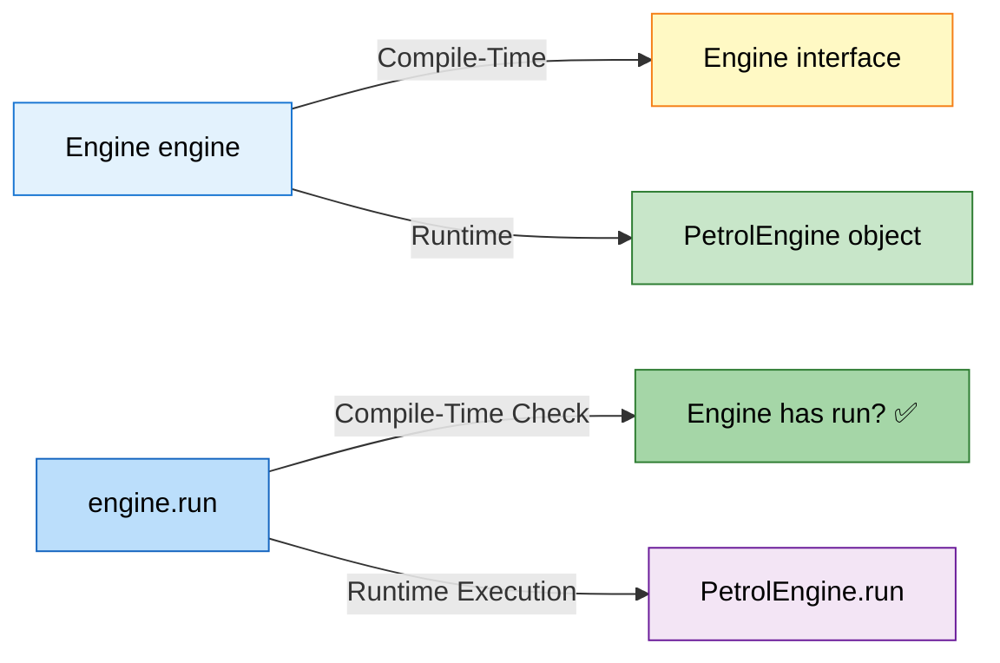

---

### 🎯 Why This Works (Technical Explanation)

<div align="center">

</div>

#### 1. Interface Reference, Concrete Object

```java
Engine engine = new PetrolEngine();
```

**What's Happening:**
- `Engine` is an interface (contract)
- `PetrolEngine` is a concrete class (implementation)
- Reference type is `Engine`, object type is `PetrolEngine`
- This is **upcasting** (automatic)

**Memory Layout:**
```
Stack:
  engine (Engine type) --> Points to Heap

Heap:
  PetrolEngine object {
    - PetrolEngine data
    - Implements Engine interface
    - Has run() method
  }
```

---

#### 2. Method Resolution (Virtual Method Table)

**How JVM Resolves `engine.run()`:**

1. **Compile-Time:**
   - Check if `Engine` interface has `run()` method ✅
   - Compilation succeeds

2. **Runtime:**
   - Look at actual object type: `PetrolEngine`
   - Find `PetrolEngine.run()` in Virtual Method Table (vtable)
   - Execute `PetrolEngine.run()`

**Virtual Method Table (vtable):**

```
Engine Interface:
  - run() (abstract)

PetrolEngine vtable:
  - run() --> PetrolEngine.run() implementation

DieselEngine vtable:
  - run() --> DieselEngine.run() implementation
```

**When `engine.run()` is called:**
- JVM looks up vtable of actual object (PetrolEngine)
- Finds and executes PetrolEngine.run()

---

#### 3. Dependency Injection Flow

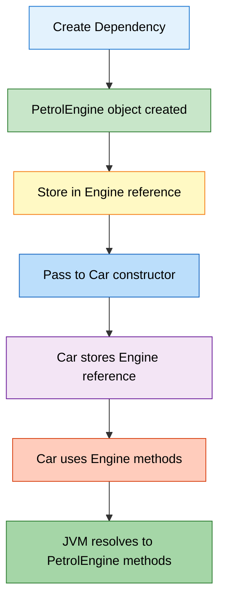

**Code Flow:**

```java
// 1. Create dependency
Engine engine = new PetrolEngine();  // Heap: PetrolEngine@456

// 2. Inject into Car
Car car = new Car(engine);  // Car.engine = PetrolEngine@456

// 3. Use dependency
car.getEngine().run();  // Calls PetrolEngine.run()
```

**Memory References:**

```
Stack:
  engine --> PetrolEngine@456
  car --> Car@789

Heap:
  PetrolEngine@456 { ... }
  Car@789 {
    engine --> PetrolEngine@456  (same reference!)
  }
```

**Key Point:** Both `engine` variable and `car.engine` field point to the SAME object in heap.


---

## 7. SPRING FRAMEWORK CONNECTION


> **📝 From Core Java to Spring by:** Avinash Dhanuka

### 📌 What is Spring Framework?

**Spring Framework** is a comprehensive framework for building Java applications. Its core feature is **Inversion of Control (IoC)** container that manages dependency injection automatically.

**Key Concept:** Spring does automatically what we did manually in our project!

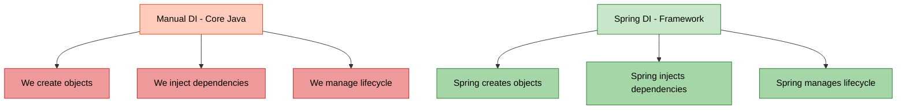

---

### 🔄 Manual DI vs Spring DI

#### Our Manual Implementation (Core Java)

**Reference:** [Driver.java](src/main/java/org/example/driver/Driver.java)

```java
// We manually create objects
Engine engine = new PetrolEngine();

// We manually inject dependencies
Car car = new Car(engine);

// We manually call methods
car.getEngine().run();
```

**Problems:**
- ❌ We write boilerplate code
- ❌ We manage object creation
- ❌ We handle dependencies manually
- ❌ Hard to manage in large applications

---

#### Spring Framework Implementation

**Same functionality with Spring:**

**1. Define Beans (Components):**

```java
// Engine interface (same as before)
public interface Engine {
    void run();
}

// PetrolEngine with Spring annotation
@Component  // Spring will manage this
public class PetrolEngine implements Engine {
    @Override
    public void run() {
        System.out.println("Running with LESS vibrations");
    }
}

// DieselEngine with Spring annotation
@Component  // Spring will manage this
public class DieselEngine implements Engine {
    @Override
    public void run() {
        System.out.println("Running with MORE vibrations");
    }
}

// Car with Spring annotation
@Component  // Spring will manage this
public class Car {
    private final Engine engine;
    
    @Autowired  // Spring will inject dependency automatically
    public Car(Engine engine) {
        this.engine = engine;
    }
    
    public Engine getEngine() {
        return engine;
    }
}
```

**2. Spring Configuration:**

```java
@Configuration
@ComponentScan("org.example.entity")  // Scan for @Component classes
public class AppConfig {
    
    // Optional: Manually define which Engine to use
    @Bean
    @Primary  // Use this when multiple implementations exist
    public Engine engine() {
        return new PetrolEngine();  // or new DieselEngine()
    }
}
```

**3. Usage (Spring Boot):**

```java
@SpringBootApplication
public class Application {
    
    public static void main(String[] args) {
        ApplicationContext context = SpringApplication.run(Application.class, args);
        
        // Spring creates and injects everything automatically!
        Car car = context.getBean(Car.class);
        car.getEngine().run();
    }
}
```

**What Spring Does Behind the Scenes:**

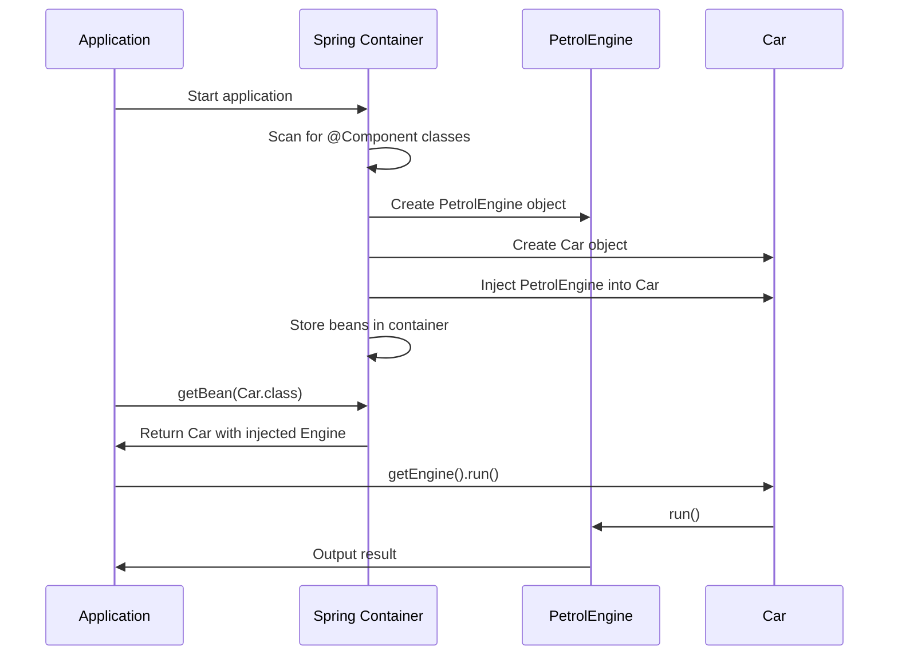

---

### 🎯 Spring Core Concepts

#### 1. IoC Container (Inversion of Control)

**Definition:** Container that manages object creation and dependency injection.

**Manual Control (Our Code):**
```java
// We control object creation
Engine engine = new PetrolEngine();
Car car = new Car(engine);
```

**Inverted Control (Spring):**
```java
// Spring controls object creation
Car car = context.getBean(Car.class);  // Spring created it
```

**Inversion:**
- **Before:** We create objects → We control
- **After:** Spring creates objects → Control inverted to Spring

---

#### 2. Bean

**Definition:** An object managed by Spring IoC container.

**Our Code:**
```java
Engine engine = new PetrolEngine();  // Regular object
```

**Spring:**
```java
@Component
public class PetrolEngine implements Engine {
    // This is a Spring Bean
}
```

**Bean Lifecycle:**


---

#### 3. Dependency Injection in Spring

**Three Ways (Same as our manual implementation!):**

**a) Constructor Injection (Recommended):**

```java
@Component
public class Car {
    private final Engine engine;
    
    @Autowired  // Optional in Spring 4.3+
    public Car(Engine engine) {
        this.engine = engine;
    }
}
```

**b) Setter Injection:**

```java
@Component
public class Car {
    private Engine engine;
    
    @Autowired
    public void setEngine(Engine engine) {
        this.engine = engine;
    }
}
```

**c) Field Injection (Not Recommended):**

```java
@Component
public class Car {
    @Autowired
    private Engine engine;  // Spring injects directly
}
```

---

#### 4. Handling Multiple Implementations

**Problem:** What if we have both PetrolEngine and DieselEngine?

```java
@Component
public class PetrolEngine implements Engine { ... }

@Component
public class DieselEngine implements Engine { ... }

@Component
public class Car {
    private final Engine engine;
    
    @Autowired
    public Car(Engine engine) {  // Which Engine? 🤔
        this.engine = engine;
    }
}
```

**Solution 1: @Primary**

```java
@Component
@Primary  // Use this by default
public class PetrolEngine implements Engine { ... }

@Component
public class DieselEngine implements Engine { ... }
```

**Solution 2: @Qualifier**

```java
@Component
public class Car {
    private final Engine engine;
    
    @Autowired
    public Car(@Qualifier("petrolEngine") Engine engine) {
        this.engine = engine;
    }
}
```

**Solution 3: @Profile**

```java
@Component
@Profile("petrol")  // Active when profile is "petrol"
public class PetrolEngine implements Engine { ... }

@Component
@Profile("diesel")  // Active when profile is "diesel"
public class DieselEngine implements Engine { ... }
```

---

### 📊 Manual DI vs Spring DI Comparison

| Aspect | Manual DI (Our Code) | Spring DI |
|:-------|:--------------------|:----------|
| **Object Creation** | `new PetrolEngine()` | `@Component` |
| **Dependency Injection** | `new Car(engine)` | `@Autowired` |
| **Configuration** | Java code | Annotations + Config |
| **Lifecycle Management** | Manual | Automatic |
| **Boilerplate Code** | High | Low |
| **Flexibility** | Low | High |
| **Testing** | Moderate | Easy (mocking) |
| **Learning Curve** | Easy | Moderate |
| **Use Case** | Small projects | Enterprise applications |

---

### 🎓 Why Learn Manual DI First?


**Benefits of Understanding Manual DI:**

1. ✅ **Understand the Concept:** Know what DI actually is
2. ✅ **Appreciate Spring:** Understand what Spring does for you
3. ✅ **Debug Better:** Know what's happening behind annotations
4. ✅ **Interview Prep:** Explain DI without framework dependency
5. ✅ **Foundation:** Build strong OOP and design pattern knowledge

**Analogy:**
- Learning manual DI = Learning to drive manual transmission car
- Using Spring = Driving automatic transmission car
- You appreciate automatic more when you know manual!

---

### 🔗 Spring Boot Auto-Configuration

<div align="center">

</div>

**Spring Boot** takes it even further with auto-configuration:

```java
@SpringBootApplication  // Includes @Configuration, @ComponentScan, @EnableAutoConfiguration
public class Application {
    
    public static void main(String[] args) {
        SpringApplication.run(Application.class, args);
    }
}
```

**What Spring Boot Does:**
1. Scans for components automatically
2. Configures beans automatically
3. Sets up database connections automatically
4. Configures web server automatically
5. And much more!

**Our Manual Code:**
- 50+ lines of configuration
- Manual object creation
- Manual dependency wiring

**Spring Boot:**
- 5 lines of code
- Everything automatic
- Just focus on business logic


---

## 8. ADVANTAGES & DISADVANTAGES

> **📝 Pros and Cons Analysis by:** Avinash Dhanuka

### ✅ Advantages of Dependency Injection

<div align="center">

</div>

#### 1. Loose Coupling

**Benefit:** Classes depend on abstractions, not concrete implementations.

**Example:**
```java
// Loose coupling - Car works with any Engine
public class Car {
    private Engine engine;  // Interface, not PetrolEngine
    
    public Car(Engine engine) {
        this.engine = engine;
    }
}

// Easy to switch engines
Car car1 = new Car(new PetrolEngine());
Car car2 = new Car(new DieselEngine());
Car car3 = new Car(new ElectricEngine());  // New engine? No problem!
```

---

#### 2. Easy Testing

**Benefit:** Can inject mock objects for testing.

**Without DI:**
```java
public class Car {
    private PetrolEngine engine = new PetrolEngine();  // Hard to test
    
    public void start() {
        engine.run();  // Always uses real PetrolEngine
    }
}

// Testing is difficult - always uses real engine
```

**With DI:**
```java
public class Car {
    private Engine engine;
    
    public Car(Engine engine) {
        this.engine = engine;
    }
    
    public void start() {
        engine.run();
    }
}

// Testing is easy - inject mock engine
class MockEngine implements Engine {
    public void run() {
        System.out.println("Mock engine for testing");
    }
}

// Test
Car car = new Car(new MockEngine());  // Inject mock
car.start();  // Uses mock engine
```

---

#### 3. Reusability

**Benefit:** Same class can be used with different dependencies.

**Example:**
```java
// Same Car class works with different engines
Car petrolCar = new Car(new PetrolEngine());
Car dieselCar = new Car(new DieselEngine());
Car electricCar = new Car(new ElectricEngine());
Car hybridCar = new Car(new HybridEngine());

// Same NotificationService works with different notifiers
NotificationService emailService = new NotificationService(new EmailNotifier());
NotificationService smsService = new NotificationService(new SMSNotifier());
NotificationService pushService = new NotificationService(new PushNotifier());
```

---

#### 4. Maintainability

**Benefit:** Changes in dependencies don't affect dependent classes.

**Scenario:** Need to add logging to all engines.

**Without DI:**
```java
// Must modify Car class
public class Car {
    private PetrolEngine engine = new PetrolEngine();
    
    public void start() {
        System.out.println("Starting car...");  // Add logging here
        engine.run();
        System.out.println("Car started");  // And here
    }
}
```

**With DI:**
```java
// Create LoggingEngine decorator
public class LoggingEngine implements Engine {
    private Engine engine;
    
    public LoggingEngine(Engine engine) {
        this.engine = engine;
    }
    
    public void run() {
        System.out.println("Starting engine...");
        engine.run();
        System.out.println("Engine started");
    }
}

// Car class unchanged!
Engine engine = new LoggingEngine(new PetrolEngine());
Car car = new Car(engine);
```

---

#### 5. Flexibility

**Benefit:** Easy to add new implementations without changing existing code.

**Example:**
```java
// Add new ElectricEngine - no changes to Car class
public class ElectricEngine implements Engine {
    public void run() {
        System.out.println("Running silently with electric motor");
    }
}

// Use immediately
Car electricCar = new Car(new ElectricEngine());  // Works!
```

---

#### 6. Follows SOLID Principles

**Single Responsibility:**
- Car is responsible for car operations
- Engine is responsible for engine operations
- Separate concerns

**Open-Closed:**
- Open for extension (add new engines)
- Closed for modification (Car class unchanged)

**Liskov Substitution:**
- Any Engine implementation can replace another
- Car works with all Engine types

**Interface Segregation:**
- Engine interface has only necessary methods
- No unnecessary methods

**Dependency Inversion:**
- Car depends on Engine interface (abstraction)
- Not on PetrolEngine (concrete class)

---

### ❌ Disadvantages of Dependency Injection

<div align="center">

</div>

#### 1. Increased Complexity

**Problem:** More classes and interfaces to manage.

**Simple Code (No DI):**
```java
public class Car {
    private PetrolEngine engine = new PetrolEngine();
}
```
- 1 class
- Simple and straightforward

**With DI:**
```java
// Need interface
public interface Engine { ... }

// Need implementations
public class PetrolEngine implements Engine { ... }
public class DieselEngine implements Engine { ... }

// Need dependent class
public class Car { ... }
```
- 1 interface + 2 implementations + 1 dependent class = 4 files
- More complex structure

---

#### 2. Learning Curve

**Problem:** Beginners find it confusing.

**Questions Beginners Ask:**
- Why use interface when I only have one implementation?
- Why not just `new PetrolEngine()`?
- What's the benefit of extra complexity?
- How does polymorphism work?

**Solution:** Learn gradually, understand benefits through practice.

---

#### 3. Runtime Errors

**Problem:** Errors appear at runtime, not compile-time.

**Example:**
```java
Engine engine = null;  // Forgot to initialize
Car car = new Car(engine);  // Compiles fine
car.getEngine().run();  // NullPointerException at runtime!
```

**Without DI:**
```java
public class Car {
    private PetrolEngine engine = new PetrolEngine();  // Always initialized
}
```
- No null pointer risk

---

#### 4. Debugging Difficulty

**Problem:** Harder to trace which implementation is being used.

**Example:**
```java
Engine engine = getEngineFromSomewhere();  // Which engine?
Car car = new Car(engine);
car.getEngine().run();  // What will this print?
```

**Need to:**
- Check where engine comes from
- Trace through multiple layers
- Use debugger to see actual type

---

#### 5. Overhead for Small Projects

**Problem:** Overkill for simple applications.

**Small Project:**
```java
// Just need a simple car with petrol engine
public class Car {
    private PetrolEngine engine = new PetrolEngine();  // Simple and works
}
```

**With DI:**
```java
// Need interface, implementations, injection...
// Too much for a simple project
```

**Rule of Thumb:**
- Small project (< 10 classes): DI might be overkill
- Medium project (10-50 classes): DI is beneficial
- Large project (> 50 classes): DI is essential

---

### 📊 When to Use Dependency Injection?

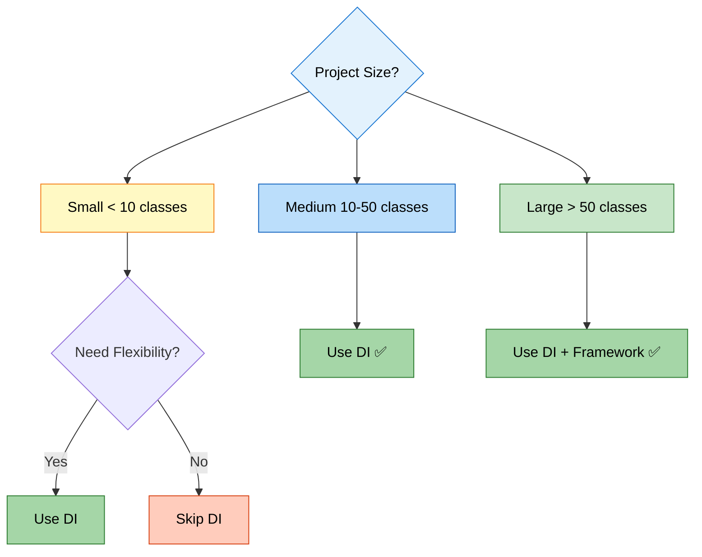

**Use DI When:**
- ✅ Multiple implementations exist
- ✅ Need to test with mocks
- ✅ Code needs to be flexible
- ✅ Working on team projects
- ✅ Building enterprise applications
- ✅ Following SOLID principles

**Skip DI When:**
- ❌ Very small project
- ❌ Only one implementation ever
- ❌ Prototype or throwaway code
- ❌ Learning basic Java
- ❌ Performance is critical (rare cases)

---

## 9. BEST PRACTICES

<div align="center">

</div>

> **📝 Professional Guidelines by:** Avinash Dhanuka

### 🎯 Design Principles

#### 1. Prefer Constructor Injection

**✅ Good:**
```java
public class Car {
    private final Engine engine;  // Final = immutable
    
    public Car(Engine engine) {
        if (engine == null) {
            throw new IllegalArgumentException("Engine cannot be null");
        }
        this.engine = engine;
    }
}
```

**❌ Bad:**
```java
public class Car {
    private Engine engine;  // Mutable
    
    public void setEngine(Engine engine) {
        this.engine = engine;  // Can be changed anytime
    }
}
```

**Why Constructor Injection?**
- Immutability (final fields)
- Null safety (check in constructor)
- Clear dependencies (visible in constructor)
- Easy testing (pass mocks in constructor)

---

#### 2. Depend on Abstractions, Not Implementations

**✅ Good:**
```java
public class Car {
    private Engine engine;  // Interface
}
```

**❌ Bad:**
```java
public class Car {
    private PetrolEngine engine;  // Concrete class
}
```

**Why?**
- Loose coupling
- Easy to swap implementations
- Follows Dependency Inversion Principle

---

#### 3. Keep Interfaces Small and Focused

**✅ Good:**
```java
public interface Engine {
    void run();
    void stop();
}
```

**❌ Bad:**
```java
public interface Engine {
    void run();
    void stop();
    void refuel();  // Not all engines need refueling (electric!)
    void changeOil();  // Not all engines have oil
    void checkSparkPlugs();  // Diesel engines don't have spark plugs
}
```

**Why?**
- Interface Segregation Principle
- Easier to implement
- More flexible

---

#### 4. Validate Dependencies

**✅ Good:**
```java
public Car(Engine engine) {
    if (engine == null) {
        throw new IllegalArgumentException("Engine cannot be null");
    }
    this.engine = engine;
}
```

**❌ Bad:**
```java
public Car(Engine engine) {
    this.engine = engine;  // No validation
}
```

**Why?**
- Fail fast (catch errors early)
- Clear error messages
- Prevent NullPointerException

---

#### 5. Use Meaningful Names

**✅ Good:**
```java
public interface PaymentProcessor {
    boolean processPayment(double amount);
}

public class PayPalPaymentProcessor implements PaymentProcessor { ... }
public class StripePaymentProcessor implements PaymentProcessor { ... }
```

**❌ Bad:**
```java
public interface PP {
    boolean process(double a);
}

public class PP1 implements PP { ... }
public class PP2 implements PP { ... }
```

---

#### 6. Document Your Code

**✅ Good:**
```java
/**
 * Represents a car that requires an engine to operate.
 * The engine is injected via constructor to ensure the car
 * is always in a valid state.
 */
public class Car {
    private final Engine engine;
    
    /**
     * Creates a new car with the specified engine.
     * 
     * @param engine the engine to power this car (must not be null)
     * @throws IllegalArgumentException if engine is null
     */
    public Car(Engine engine) {
        if (engine == null) {
            throw new IllegalArgumentException("Engine cannot be null");
        }
        this.engine = engine;
    }
}
```

---

### 🧪 Testing Best Practices

<div align="center">

</div>

#### 1. Use Mock Objects for Testing

```java
// Mock engine for testing
class MockEngine implements Engine {
    private boolean runCalled = false;
    
    public void run() {
        runCalled = true;
    }
    
    public boolean wasRunCalled() {
        return runCalled;
    }
}

// Test
@Test
public void testCarStart() {
    MockEngine mockEngine = new MockEngine();
    Car car = new Car(mockEngine);
    
    car.start();
    
    assertTrue(mockEngine.wasRunCalled());
}
```

---

#### 2. Test with Different Implementations

```java
@Test
public void testCarWithPetrolEngine() {
    Engine petrol = new PetrolEngine();
    Car car = new Car(petrol);
    car.start();
    // Assert expected behavior
}

@Test
public void testCarWithDieselEngine() {
    Engine diesel = new DieselEngine();
    Car car = new Car(diesel);
    car.start();
    // Assert expected behavior
}
```

---

### 🏗️ Architecture Best Practices

<div align="center">

</div>

#### 1. Layer Your Application

```
Presentation Layer (UI)
    ↓
Service Layer (Business Logic)
    ↓
Repository Layer (Data Access)
    ↓
Database
```

**Example:**
```java
// Presentation Layer
public class CarController {
    private CarService carService;
    
    public CarController(CarService carService) {
        this.carService = carService;
    }
}

// Service Layer
public class CarService {
    private CarRepository carRepository;
    
    public CarService(CarRepository carRepository) {
        this.carRepository = carRepository;
    }
}

// Repository Layer
public class CarRepository {
    private Database database;
    
    public CarRepository(Database database) {
        this.database = database;
    }
}
```

---

#### 2. Use Factory Pattern for Complex Creation

```java
public class EngineFactory {
    public static Engine createEngine(String type) {
        switch (type.toLowerCase()) {
            case "petrol":
                return new PetrolEngine();
            case "diesel":
                return new DieselEngine();
            case "electric":
                return new ElectricEngine();
            default:
                throw new IllegalArgumentException("Unknown engine type: " + type);
        }
    }
}

// Usage
Engine engine = EngineFactory.createEngine("petrol");
Car car = new Car(engine);
```


---

## 10. TOP INTERVIEW QUESTIONS

<div align="center">

</div>

> **📝 Interview Preparation by:** Avinash Dhanuka

### Q1: What is Dependency Injection?

**Answer:**

Dependency Injection is a design pattern where objects receive their dependencies from external sources rather than creating them internally. It promotes loose coupling and makes code more testable and maintainable.

**Example:**
```java
// Without DI (tight coupling)
public class Car {
    private PetrolEngine engine = new PetrolEngine();  // Creates own dependency
}

// With DI (loose coupling)
public class Car {
    private Engine engine;
    
    public Car(Engine engine) {  // Receives dependency
        this.engine = engine;
    }
}
```

**Key Points:**
- Promotes loose coupling
- Improves testability
- Follows SOLID principles
- Makes code more flexible

---

### Q2: What are the types of Dependency Injection?

**Answer:**

There are three types:

**1. Constructor Injection (Recommended):**
```java
public class Car {
    private final Engine engine;
    
    public Car(Engine engine) {
        this.engine = engine;
    }
}
```
- Best for required dependencies
- Immutable (final fields)
- Null-safe

**2. Setter Injection:**
```java
public class Car {
    private Engine engine;
    
    public void setEngine(Engine engine) {
        this.engine = engine;
    }
}
```
- Best for optional dependencies
- Mutable
- Can be null

**3. Field Injection:**
```java
public class Car {
    public Engine engine;  // Direct access
}
```
- Not recommended
- Breaks encapsulation
- Hard to test

---

### Q3: What is the difference between tight coupling and loose coupling?

**Answer:**

| Aspect | Tight Coupling | Loose Coupling |
|:-------|:--------------|:---------------|
| **Definition** | Classes directly depend on concrete implementations | Classes depend on abstractions (interfaces) |
| **Example** | `private PetrolEngine engine = new PetrolEngine();` | `private Engine engine;` |
| **Flexibility** | Low | High |
| **Testability** | Difficult | Easy |
| **Maintainability** | Hard | Easy |

**Tight Coupling Example:**
```java
public class Car {
    private PetrolEngine engine = new PetrolEngine();  // Locked to PetrolEngine
}
```

**Loose Coupling Example:**
```java
public class Car {
    private Engine engine;  // Works with any Engine
    
    public Car(Engine engine) {
        this.engine = engine;
    }
}
```

---

### Q4: What is Inversion of Control (IoC)?

**Answer:**

Inversion of Control is a principle where the control of object creation and dependency management is transferred from the application code to a framework or container.

**Traditional Control:**
```java
// Application controls object creation
public class Main {
    public static void main(String[] args) {
        Engine engine = new PetrolEngine();  // We create
        Car car = new Car(engine);  // We inject
    }
}
```

**Inverted Control (Spring):**
```java
// Spring controls object creation
@Component
public class Car {
    @Autowired
    private Engine engine;  // Spring creates and injects
}
```

**Key Points:**
- Framework manages object lifecycle
- Reduces boilerplate code
- Centralized configuration
- Easier to manage dependencies

---

### Q5: Why is Constructor Injection preferred over Setter Injection?

**Answer:**

Constructor Injection is preferred because:

**1. Immutability:**
```java
public class Car {
    private final Engine engine;  // Can be final
    
    public Car(Engine engine) {
        this.engine = engine;
    }
}
```

**2. Null Safety:**
```java
public Car(Engine engine) {
    if (engine == null) {
        throw new IllegalArgumentException("Engine cannot be null");
    }
    this.engine = engine;
}
```

**3. Clear Dependencies:**
- All dependencies visible in constructor
- Easy to see what's required

**4. Compile-Time Safety:**
- Cannot create object without dependencies
- Compiler enforces dependency provision

**5. Testability:**
```java
// Easy to test
Car car = new Car(new MockEngine());
```

**When to use Setter Injection:**
- Optional dependencies
- Circular dependencies (rare)
- Need to change dependency at runtime

---

### Q6: Explain the SOLID principles and how DI relates to them

**Answer:**

**S - Single Responsibility Principle:**
- Each class has one responsibility
- DI helps by separating concerns

```java
// Car is responsible for car operations
public class Car {
    private Engine engine;  // Engine is responsible for engine operations
}
```

**O - Open-Closed Principle:**
- Open for extension, closed for modification
- DI allows adding new implementations without changing existing code

```java
// Add new engine without modifying Car
public class ElectricEngine implements Engine { ... }
Car car = new Car(new ElectricEngine());  // Works!
```

**L - Liskov Substitution Principle:**
- Subtypes must be substitutable for their base types
- Any Engine implementation can replace another

```java
Engine engine1 = new PetrolEngine();
Engine engine2 = new DieselEngine();
// Both can be used interchangeably
```

**I - Interface Segregation Principle:**
- Clients shouldn't depend on interfaces they don't use
- DI uses focused interfaces

```java
public interface Engine {
    void run();  // Only necessary methods
}
```

**D - Dependency Inversion Principle:**
- Depend on abstractions, not concretions
- DI enforces this principle

```java
public class Car {
    private Engine engine;  // Depends on interface (abstraction)
    // Not: private PetrolEngine engine;  // Concrete class
}
```

---

### Q7: How does Dependency Injection improve testability?

**Answer:**

DI improves testability by allowing mock objects to be injected:

**Without DI (Hard to Test):**
```java
public class Car {
    private PetrolEngine engine = new PetrolEngine();  // Always real engine
    
    public void start() {
        engine.run();  // Cannot test without real engine
    }
}

// Testing requires real PetrolEngine
@Test
public void testStart() {
    Car car = new Car();  // Uses real engine
    car.start();  // Depends on PetrolEngine implementation
}
```

**With DI (Easy to Test):**
```java
public class Car {
    private Engine engine;
    
    public Car(Engine engine) {
        this.engine = engine;
    }
    
    public void start() {
        engine.run();
    }
}

// Testing with mock
class MockEngine implements Engine {
    boolean runCalled = false;
    
    public void run() {
        runCalled = true;
    }
}

@Test
public void testStart() {
    MockEngine mock = new MockEngine();
    Car car = new Car(mock);  // Inject mock
    
    car.start();
    
    assertTrue(mock.runCalled);  // Verify behavior
}
```

**Benefits:**
- No external dependencies in tests
- Fast test execution
- Predictable test results
- Easy to verify behavior

---

### Q8: What is the difference between @Autowired and @Inject in Spring?

**Answer:**

| Aspect | @Autowired | @Inject |
|:-------|:-----------|:--------|
| **Source** | Spring-specific | Java standard (JSR-330) |
| **Required** | Has `required` attribute | No `required` attribute |
| **Portability** | Spring only | Works with any JSR-330 container |

**@Autowired (Spring):**
```java
@Component
public class Car {
    @Autowired(required = false)  // Optional dependency
    private Engine engine;
}
```

**@Inject (Java Standard):**
```java
@Component
public class Car {
    @Inject  // No required attribute
    private Engine engine;
}
```

**Recommendation:**
- Use `@Inject` for portability
- Use `@Autowired` if you need Spring-specific features

---

### Q9: What is circular dependency? How to resolve it?

**Answer:**

**Circular Dependency:** When two or more beans depend on each other.

**Example:**
```java
@Component
public class A {
    @Autowired
    private B b;  // A depends on B
}

@Component
public class B {
    @Autowired
    private A a;  // B depends on A
}
```

**Problem:**
- Spring cannot create A without B
- Spring cannot create B without A
- Results in `BeanCurrentlyInCreationException`

**Solutions:**

**1. Redesign (Best Solution):**
```java
// Extract common functionality to a third class
@Component
public class C {
    // Common functionality
}

@Component
public class A {
    @Autowired
    private C c;  // Both depend on C
}

@Component
public class B {
    @Autowired
    private C c;  // No circular dependency
}
```

**2. Use @Lazy:**
```java
@Component
public class A {
    @Autowired
    @Lazy  // Lazy initialization
    private B b;
}

@Component
public class B {
    @Autowired
    private A a;
}
```

**3. Use Setter Injection:**
```java
@Component
public class A {
    private B b;
    
    @Autowired
    public void setB(B b) {
        this.b = b;
    }
}

@Component
public class B {
    private A a;
    
    @Autowired
    public void setA(A a) {
        this.a = a;
    }
}
```

---

### Q10: What are the advantages and disadvantages of Dependency Injection?

**Answer:**

**Advantages:**

1. **Loose Coupling:** Classes depend on abstractions, not implementations
2. **Easy Testing:** Can inject mock objects for unit testing
3. **Reusability:** Same class works with different dependencies
4. **Maintainability:** Changes in dependencies don't affect dependent classes
5. **Flexibility:** Easy to add new implementations
6. **SOLID Principles:** Follows all SOLID principles

**Disadvantages:**

1. **Increased Complexity:** More classes and interfaces to manage
2. **Learning Curve:** Beginners find it confusing
3. **Runtime Errors:** Errors appear at runtime, not compile-time
4. **Debugging Difficulty:** Harder to trace which implementation is being used
5. **Overhead:** Overkill for small projects

**When to Use DI:**
- Multiple implementations exist
- Need to test with mocks
- Building enterprise applications
- Working on team projects

**When to Skip DI:**
- Very small projects
- Only one implementation ever
- Prototype or throwaway code

---

### Q11: Explain the Bean lifecycle in Spring

**Answer:**

**Bean Lifecycle Phases:**

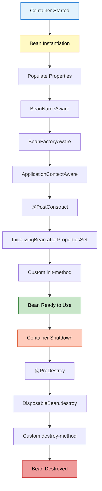

**Example:**

```java
@Component
public class Car {
    private Engine engine;
    
    @Autowired
    public Car(Engine engine) {
        System.out.println("1. Constructor called");
        this.engine = engine;
    }
    
    @PostConstruct
    public void init() {
        System.out.println("2. @PostConstruct - Bean initialized");
    }
    
    public void doSomething() {
        System.out.println("3. Bean in use");
    }
    
    @PreDestroy
    public void cleanup() {
        System.out.println("4. @PreDestroy - Bean being destroyed");
    }
}
```

**Output:**
```
1. Constructor called
2. @PostConstruct - Bean initialized
3. Bean in use
4. @PreDestroy - Bean being destroyed
```

---

### Q12: What is the difference between @Component, @Service, @Repository, and @Controller?

**Answer:**

All are specializations of `@Component` for different layers:

| Annotation | Layer | Purpose |
|:-----------|:------|:--------|
| **@Component** | Generic | Generic Spring-managed component |
| **@Service** | Service | Business logic layer |
| **@Repository** | Data Access | Database operations |
| **@Controller** | Presentation | Web controllers (MVC) |

**Example:**

```java
// Generic component
@Component
public class UtilityClass { ... }

// Service layer
@Service
public class CarService {
    public void processCarData() { ... }
}

// Data access layer
@Repository
public class CarRepository {
    public Car findById(int id) { ... }
}

// Web layer
@Controller
public class CarController {
    @GetMapping("/cars")
    public String getCars() { ... }
}
```

**Why Different Annotations?**
- **Clarity:** Shows the role of the class
- **AOP:** Can apply different aspects to different layers
- **Exception Translation:** `@Repository` translates database exceptions

---

### Q13: How would you implement DI without a framework?

**Answer:**

**Manual DI Implementation (Our Project):**

**1. Define Interface:**
```java
public interface Engine {
    void run();
}
```

**2. Create Implementations:**
```java
public class PetrolEngine implements Engine {
    public void run() {
        System.out.println("Petrol engine running");
    }
}

public class DieselEngine implements Engine {
    public void run() {
        System.out.println("Diesel engine running");
    }
}
```

**3. Create Dependent Class:**
```java
public class Car {
    private Engine engine;
    
    public Car(Engine engine) {
        this.engine = engine;
    }
    
    public void start() {
        engine.run();
    }
}
```

**4. Manual Injection:**
```java
public class Main {
    public static void main(String[] args) {
        // Create dependency
        Engine engine = new PetrolEngine();
        
        // Inject dependency
        Car car = new Car(engine);
        
        // Use
        car.start();
    }
}
```

**5. Optional: Create Simple DI Container:**
```java
public class DIContainer {
    private Map<Class<?>, Object> beans = new HashMap<>();
    
    public <T> void register(Class<T> type, T instance) {
        beans.put(type, instance);
    }
    
    public <T> T get(Class<T> type) {
        return type.cast(beans.get(type));
    }
}

// Usage
DIContainer container = new DIContainer();
container.register(Engine.class, new PetrolEngine());
container.register(Car.class, new Car(container.get(Engine.class)));

Car car = container.get(Car.class);
car.start();
```

---

### Q14: What are the advantages of using Spring's DI over manual DI?

**Answer:**

| Aspect | Manual DI | Spring DI |
|:-------|:----------|:----------|
| **Object Creation** | Manual | Automatic |
| **Lifecycle Management** | Manual | Automatic |
| **Configuration** | Code | Annotations/XML |
| **Scope Management** | Manual | Built-in (Singleton, Prototype, etc.) |
| **AOP Support** | Manual | Built-in |
| **Transaction Management** | Manual | Declarative |
| **Boilerplate Code** | High | Low |

**Manual DI:**
```java
// Must create everything manually
Engine engine = new PetrolEngine();
Transmission transmission = new AutomaticTransmission();
Brakes brakes = new DiscBrakes();
Car car = new Car(engine, transmission, brakes);
```

**Spring DI:**
```java
// Spring does everything
@Autowired
private Car car;  // Fully configured and ready to use
```

**Spring Benefits:**
- Automatic dependency resolution
- Lifecycle callbacks (@PostConstruct, @PreDestroy)
- Scope management (singleton, prototype, request, session)
- AOP (logging, transactions, security)
- Property injection from configuration files
- Conditional bean creation (@Conditional)

---

### Q15: Explain lazy initialization in Spring

**Answer:**

**Lazy Initialization:** Bean is created only when first requested, not at application startup.

**Default (Eager Initialization):**
```java
@Component
public class HeavyService {
    public HeavyService() {
        System.out.println("HeavyService created at startup");
        // Expensive initialization
    }
}

// Created immediately when application starts
```

**Lazy Initialization:**
```java
@Component
@Lazy  // Created only when first used
public class HeavyService {
    public HeavyService() {
        System.out.println("HeavyService created on first use");
    }
}

@Component
public class MyController {
    @Autowired
    @Lazy  // Inject lazy proxy
    private HeavyService heavyService;
    
    public void doSomething() {
        heavyService.process();  // NOW HeavyService is created
    }
}
```

**Benefits:**
- Faster application startup
- Saves memory for unused beans
- Useful for expensive initializations

**Drawbacks:**
- Slower first request
- Errors appear later (not at startup)
- Harder to debug

**When to Use:**
- Heavy initialization
- Rarely used beans
- Conditional features

---

<div align="center">

<table>
<tr align = "center">

## 🎓 End of Dependency Injection Master Guide
<td align="center">

<br>

<br>
**Created with dedication by Avinash Dhanuka**

<br>

[](https://github.com/Avinash-706)
[](mailto:avunashdhanuka@gmail.com)

<br>

---

**Happy Learning! 🚀**

*"Inject Dependencies, Not Problems!"* - Avinash Dhanuka

<br>


---
</td>
</tr>
</table>
</div>
