# ☕ Spring Framework: Annotation-Based Configuration - Complete Guide

<div align="center">


</div>

<hr style="border: 1px solid rgb(98, 117, 187)">

<div align="center">
<table>
<tr>
<td align="center">
<br />

<h3>© 2026 Avinash Dhanuka</h3>
<p>Master Guide: Spring Annotation-Based Configuration</p>
<p><em>Crafted with ❤️ for Modern Spring Development</em></p>

<a href="https://github.com/Avinash-706" target="_blank">

</a>
<br />
<a href="https://mail.google.com/mail/?view=cm&fs=1&to=avunashdhanuka@gmail.com&su=Spring%20Annotation%20Query&body=☕%20Hello%20Avinash,%0D%0A%0D%0AMy%20name%20is%20[Your%20Name]%20and%20I%20have%20a%20doubt%20regarding%20Spring%20Annotations.%0D%0A%0D%0A🔹%20Topic:%20[Annotations/DI/IoC]%0D%0A%0D%0AThank%20you!" target="_blank">

</a>
<br />
<br />
</td>
</tr>
</table>
</div>

> **Learning Note:** This guide demonstrates Spring's modern Annotation-Based Configuration approach, which is the preferred way of configuring Spring applications today. Understanding annotations helps you build cleaner, more maintainable, and type-safe Spring applications.

> **Prerequisites:** 
> - Understanding of Dependency Injection concepts
> - Basic knowledge of Java annotations
> - Java OOP fundamentals
> - Maven basics

---

## 📑 Table of Contents
1. [What is Annotation-Based Configuration?](#1-what-is-annotation-based-configuration)
2. [Spring Core Architecture](#2-spring-core-architecture)
3. [ApplicationContext Deep Dive](#3-applicationcontext-deep-dive)
4. [AnnotationConfigApplicationContext](#4-annotationconfigapplicationcontext)
5. [Core Spring Annotations](#5-core-spring-annotations)
6. [Dependency Injection Annotations](#6-dependency-injection-annotations)
7. [Bean Scopes & Lifecycle](#7-bean-scopes--lifecycle)
8. [Component Scanning](#8-component-scanning)
9. [Advanced Annotations](#9-advanced-annotations)
10. [Internal Working Mechanism](#10-internal-working-mechanism)
11. [Project Structure & Implementation](#11-project-structure--implementation)
12. [Real-World Examples](#12-real-world-examples)
13. [Best Practices](#13-best-practices)
14. [Interview Questions](#14-top-interview-questions)

---

## 1. WHAT IS ANNOTATION-BASED CONFIGURATION?

<div align="center">

</div>

> **📝 Author:** Avinash Dhanuka | [GitHub](https://github.com/Avinash-706)

### 📌 Definition

**Annotation-Based Configuration** is Spring's modern approach where bean definitions and configurations are declared using Java annotations directly in the code, eliminating the need for XML files.

**Simple Analogy:**
- **XML Configuration:** Like writing instructions on a separate manual
- **Annotation Configuration:** Like writing sticky notes directly on the objects
- **Result:** Faster development, better IDE support, type-safe configuration

### 🎯 Core Concept

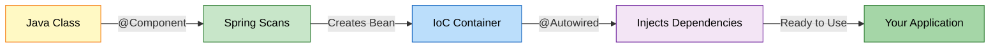


### 📊 Example: Our Project

**Reference:** [AppConfig.java](src/main/java/org/example/services/AppConfig.java)

**Annotation Configuration:**
```java
@Configuration
@ComponentScan(basePackages = "org.example.services")
public class AppConfig {
    // Spring automatically finds @Component classes
}
```

**Java Code:**
```java
// Create Spring container
ApplicationContext context = new AnnotationConfigApplicationContext(AppConfig.class);

// Get bean
MessageService service = context.getBean(MessageService.class);

// Use the bean
service.sendMessage();
```

**What Happens:**
1. ✅ Spring scans "org.example.services" package
2. ✅ Finds classes with @Component annotation
3. ✅ Creates beans automatically
4. ✅ Injects dependencies via @Autowired or constructor
5. ✅ Beans are ready to use

---

## 2. SPRING CORE ARCHITECTURE

<div align="center">

</div>

### 📌 Spring Framework Hierarchy

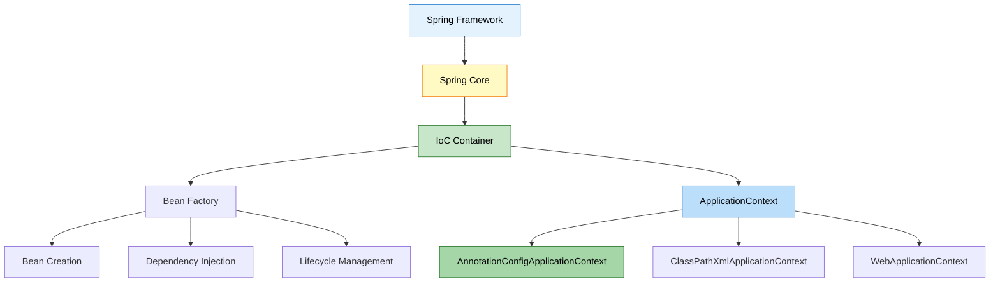

### 🎯 Configuration Evolution

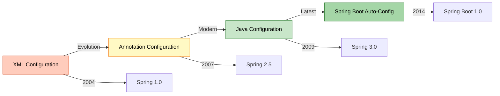

---

## 3. APPLICATIONCONTEXT DEEP DIVE

<div align="center">

</div>

### 📌 What is ApplicationContext?

**ApplicationContext** is Spring's advanced IoC container that manages the complete lifecycle of beans.

**Think of it as:**
- A **smart factory** that creates objects
- A **warehouse** that stores objects
- A **manager** that handles dependencies
- A **coordinator** that manages lifecycle

### 🔍 ApplicationContext Hierarchy

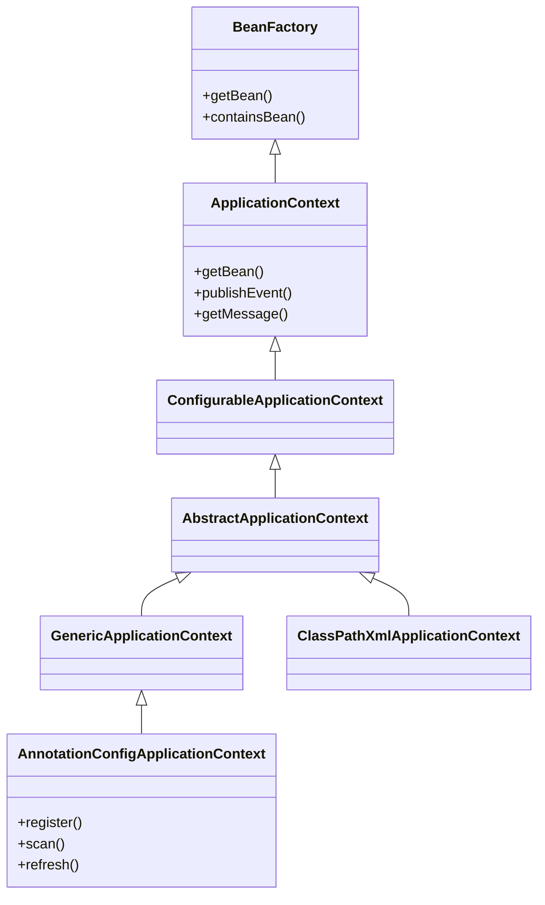

### 📊 ApplicationContext Features

| Feature | BeanFactory | ApplicationContext |
|:--------|:-----------|:------------------|
| **Bean Instantiation** | Lazy | Eager |
| **Event Publication** | ❌ No | ✅ Yes |
| **Internationalization** | ❌ No | ✅ Yes |
| **AOP Integration** | ❌ Limited | ✅ Full |
| **Bean Post Processors** | Manual | Automatic |
| **Environment Abstraction** | ❌ No | ✅ Yes |
| **Resource Loading** | ❌ No | ✅ Yes |
| **Annotation Support** | ❌ No | ✅ Yes |

---

## 4. ANNOTATIONCONFIGAPPLICATIONCONTEXT

<div align="center">

</div>

### 📌 What is AnnotationConfigApplicationContext?

**AnnotationConfigApplicationContext** is a standalone application context that accepts **annotated classes** as input.

**Reference:** [App.java:16](src/main/java/org/example/App.java#L16)

```java
ApplicationContext context = new AnnotationConfigApplicationContext(AppConfig.class);
```

### 🎯 Why Use `.class`?

**Question:** Why `AppConfig.class` and not just `AppConfig`?

**Answer:**

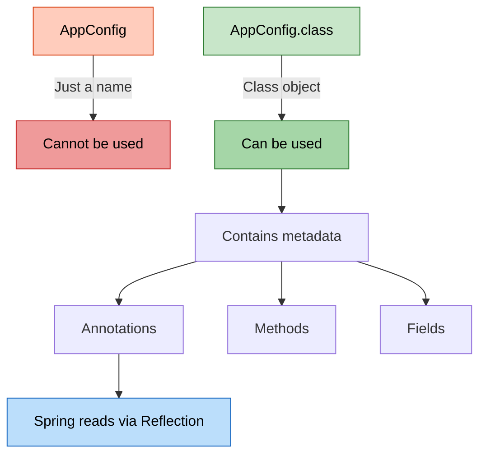

**Technical Explanation:**

1. **`AppConfig`** = Class name (just text)
2. **`AppConfig.class`** = Class object (java.lang.Class instance)
3. **Spring needs Class object** to use Java Reflection API
4. **Reflection** allows Spring to:
   - Read annotations
   - Inspect methods
   - Create instances
   - Inject dependencies

**Example:**
```java
// ❌ WRONG - Cannot pass class name as string
ApplicationContext context = new AnnotationConfigApplicationContext("AppConfig");

// ✅ CORRECT - Pass Class object
ApplicationContext context = new AnnotationConfigApplicationContext(AppConfig.class);

// What Spring does internally:
Class<?> configClass = AppConfig.class;
Configuration annotation = configClass.getAnnotation(Configuration.class);
ComponentScan scanAnnotation = configClass.getAnnotation(ComponentScan.class);
// ... reads all annotations and creates beans
```

### 🔍 Internal Working

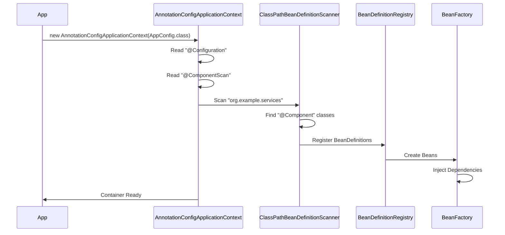

### 📊 Creation Methods

**Method 1: Constructor with Config Class** ✅ (Our Project)
```java
ApplicationContext context = new AnnotationConfigApplicationContext(AppConfig.class);
```

**Method 2: Constructor with Multiple Classes**
```java
ApplicationContext context = new AnnotationConfigApplicationContext(
    AppConfig.class, 
    DatabaseConfig.class, 
    SecurityConfig.class
);
```

**Method 3: Constructor with Package Scanning**
```java
ApplicationContext context = new AnnotationConfigApplicationContext();
context.scan("org.example.services");
context.refresh();
```

**Method 4: Programmatic Registration**
```java
AnnotationConfigApplicationContext context = new AnnotationConfigApplicationContext();
context.register(AppConfig.class);
context.register(EmailService.class);
context.refresh();
```

---

## 5. CORE SPRING ANNOTATIONS

<div align="center">

</div>

### 📌 Annotation Categories

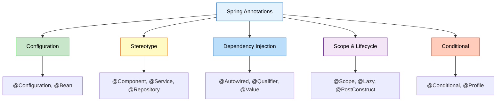

---

### 1️⃣ @Configuration

**Purpose:** Indicates that a class declares one or more @Bean methods and may be processed by Spring container.

**Reference:** [AppConfig.java:8](src/main/java/org/example/services/AppConfig.java#L8)

```java
@Configuration
public class AppConfig {
    // Configuration class
}
```

**Internal Working:**

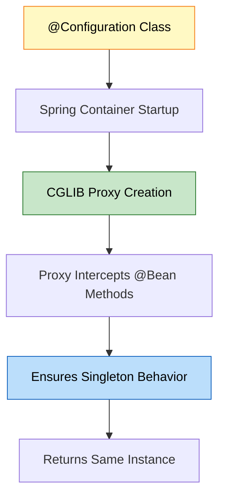

**What Spring Does:**
1. **Detects @Configuration** during component scanning
2. **Creates CGLIB proxy** of the class
3. **Intercepts @Bean method calls** to ensure singleton
4. **Registers bean definitions** in container

**Example:**
```java
@Configuration
public class AppConfig {
    
    @Bean
    public EmailService emailService() {
        return new EmailService();
    }
    
    @Bean
    public MessageService messageService() {
        // Calling emailService() returns SAME instance (singleton)
        return new MessageService(emailService());
    }
}
```

**Why CGLIB Proxy?**
```java
// Without proxy:
EmailService e1 = emailService();  // New instance
EmailService e2 = emailService();  // New instance (WRONG!)

// With CGLIB proxy:
EmailService e1 = emailService();  // New instance
EmailService e2 = emailService();  // Same instance (CORRECT!)
```

---

### 2️⃣ @ComponentScan

**Purpose:** Tells Spring where to look for @Component annotated classes.

**Reference:** [AppConfig.java:10](src/main/java/org/example/services/AppConfig.java#L10)

```java
@ComponentScan(basePackages = "org.example.services")
```

**Internal Working:**

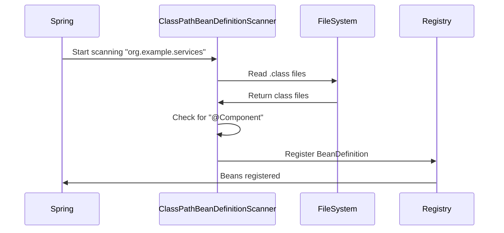

**Scanning Process:**
1. **Reads basePackages** attribute
2. **Scans classpath** for .class files
3. **Checks each class** for stereotype annotations
4. **Creates BeanDefinition** for each component
5. **Registers** in BeanDefinitionRegistry

**Advanced Options:**
```java
@ComponentScan(
    basePackages = "org.example",
    includeFilters = @Filter(type = FilterType.ANNOTATION, classes = Service.class),
    excludeFilters = @Filter(type = FilterType.REGEX, pattern = ".*Test.*")
)
```

---

### 3️⃣ @Component

**Purpose:** Marks a class as a Spring-managed component (bean).

**Reference:** [EmailService.java:7](src/main/java/org/example/services/EmailService.java#L7)

```java
@Component
public class EmailService {
    public void send() {
        System.out.println("Email sent!");
    }
}
```

**Internal Working:**

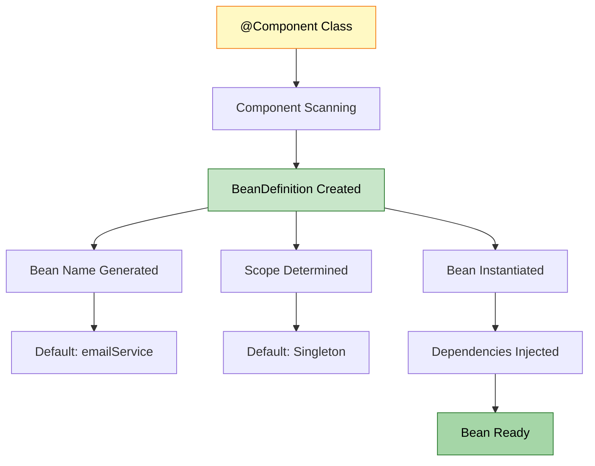

**Bean Naming:**
```java
@Component  // Bean name: "emailService" (lowercase first letter)
public class EmailService { }

@Component("myEmail")  // Bean name: "myEmail" (custom)
public class EmailService { }
```

**What Spring Does:**
1. **Scans** for @Component during startup
2. **Creates BeanDefinition** with metadata
3. **Generates bean name** (default: class name with lowercase first letter)
4. **Instantiates** the class
5. **Injects dependencies**
6. **Stores** in ApplicationContext

---

### 4️⃣ @Service

**Purpose:** Specialization of @Component for service layer classes.

```java
@Service
public class UserService {
    // Business logic
}
```

**Internal Working:**
- **Functionally identical** to @Component
- **Semantic difference** - indicates service layer
- **Future enhancements** - Spring may add service-specific features
- **Better readability** - clear architectural role

**When to Use:**
- Business logic classes
- Service layer components
- Transaction management
- Complex operations

---

### 5️⃣ @Repository

**Purpose:** Specialization of @Component for data access layer classes.

```java
@Repository
public class UserRepository {
    // Database operations
}
```

**Internal Working:**
- **Extends @Component** functionality
- **Exception Translation** - converts database exceptions to Spring's DataAccessException
- **Persistence layer** marker
- **AOP pointcut** for transaction management

**Special Feature:**
```java
@Repository
public class UserRepository {
    public User findById(int id) {
        // SQLException thrown
    }
}

// Spring automatically converts SQLException to DataAccessException
```

---

### 6️⃣ @Controller

**Purpose:** Specialization of @Component for presentation layer (MVC controllers).

```java
@Controller
public class UserController {
    @RequestMapping("/users")
    public String getUsers() {
        return "users";
    }
}
```

**Internal Working:**
- **Web layer** marker
- **Request mapping** support
- **View resolution** integration
- **Model binding** capabilities

---

### 📊 Stereotype Annotations Comparison

| Annotation | Layer | Special Feature | Use Case |
|:-----------|:------|:---------------|:---------|
| **@Component** | Generic | None | Generic beans |
| **@Service** | Business | None (semantic) | Business logic |
| **@Repository** | Data Access | Exception translation | Database operations |
| **@Controller** | Presentation | Request mapping | Web controllers |
| **@RestController** | Presentation | @ResponseBody | REST APIs |

**Hierarchy:**

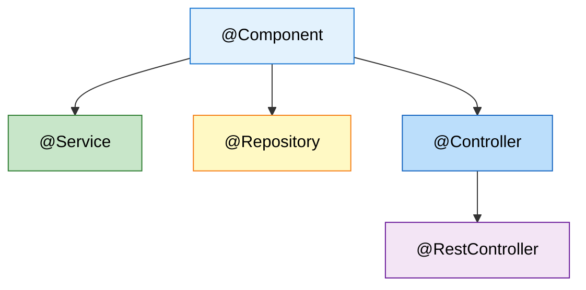

---

### 7️⃣ @Bean

**Purpose:** Declares a method that returns a bean to be managed by Spring.

```java
@Configuration
public class AppConfig {
    
    @Bean
    public EmailService emailService() {
        return new EmailService();
    }
    
    @Bean(name = "myEmail")
    public EmailService customNamedBean() {
        return new EmailService();
    }
    
    @Bean(initMethod = "init", destroyMethod = "cleanup")
    public DataSource dataSource() {
        return new DataSource();
    }
}
```

**Internal Working:**

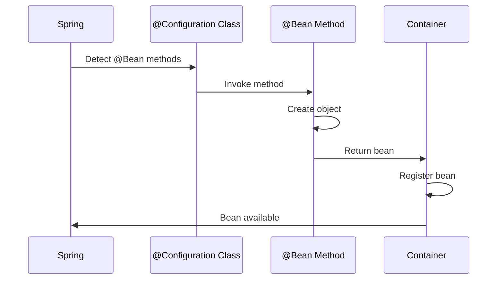

**When to Use:**
- Third-party classes (cannot add @Component)
- Complex initialization logic
- Conditional bean creation
- Multiple instances of same type

**Example:**
```java
@Configuration
public class DatabaseConfig {
    
    @Bean
    public DataSource dataSource() {
        HikariDataSource ds = new HikariDataSource();
        ds.setJdbcUrl("jdbc:mysql://localhost:3306/mydb");
        ds.setUsername("root");
        ds.setPassword("password");
        return ds;  // Cannot add @Component to HikariDataSource
    }
}
```

---

## 6. DEPENDENCY INJECTION ANNOTATIONS

<div align="center">

</div>

### 📌 Dependency Injection Types

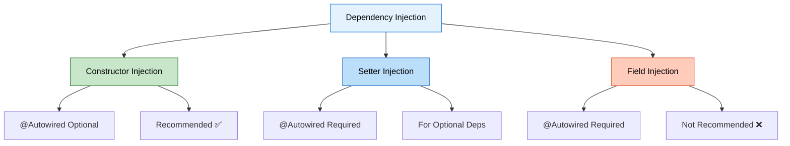

---

### 1️⃣ @Autowired

**Purpose:** Marks a constructor, field, setter method, or config method as to be autowired by Spring's dependency injection.

**Reference:** [SetterInjectionService.java:15](src/main/java/org/example/services/SetterInjectionService.java#L15)

#### Constructor Injection ✅ (Recommended)

**Reference:** [MessageService.java:16-20](src/main/java/org/example/services/MessageService.java#L16)

```java
@Component
public class MessageService {
    private final EmailService emailService;
    private final SmsService smsService;
    
    // @Autowired is OPTIONAL for single constructor (Spring 4.3+)
    public MessageService(EmailService emailService, SmsService smsService) {
        this.emailService = emailService;
        this.smsService = smsService;
    }
}
```

**Internal Working:**

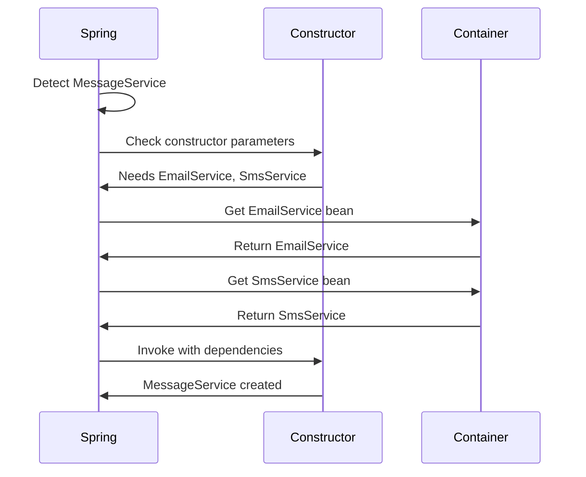

**Why No @Autowired Needed?**
- **Spring 4.3+** automatically autowires single constructor
- **Implicit autowiring** for cleaner code
- **Multiple constructors** require @Autowired on one

**Example:**
```java
@Component
public class UserService {
    private final UserRepository repository;
    
    // No @Autowired needed - single constructor
    public UserService(UserRepository repository) {
        this.repository = repository;
    }
}

@Component
public class OrderService {
    private final OrderRepository repository;
    
    // Default constructor
    public OrderService() {
        this.repository = null;
    }
    
    // @Autowired required - multiple constructors
    @Autowired
    public OrderService(OrderRepository repository) {
        this.repository = repository;
    }
}
```

**Pros:**
- ✅ **Immutable** (final fields)
- ✅ **Required dependencies** guaranteed
- ✅ **Easy to test** (pass mocks in constructor)
- ✅ **Null-safe**
- ✅ **No reflection** needed for testing

---

#### Setter Injection

**Reference:** [SetterInjectionService.java:14-18](src/main/java/org/example/services/SetterInjectionService.java#L14)

```java
@Component
public class SetterInjectionService {
    private EmailService emailService;
    
    @Autowired  // Required for setter injection
    public void setEmailService(EmailService emailService) {
        this.emailService = emailService;
        System.out.println("Setter Injection - EmailService injected");
    }
}
```

**Internal Working:**

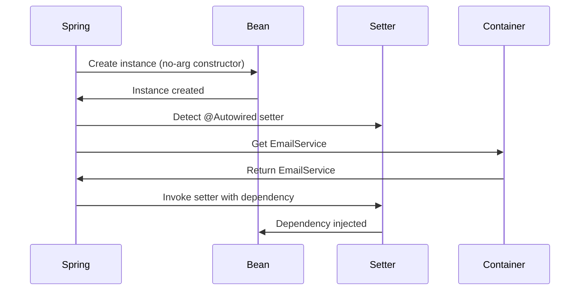

**When Spring Calls Setter:**
1. **After** bean instantiation
2. **Before** initialization callbacks (@PostConstruct)
3. **During** dependency injection phase

**Pros:**
- ✅ **Optional dependencies** (can be null)
- ✅ **Can change** at runtime
- ✅ **Circular dependencies** easier to resolve

**Cons:**
- ❌ **Mutable** (not final)
- ❌ **Can be null** (NullPointerException risk)
- ❌ **Requires @Autowired** annotation

---

#### Field Injection ❌ (Not Recommended)

**Reference:** [FieldInjectionService.java:9-10](src/main/java/org/example/services/FieldInjectionService.java#L9)

```java
@Component
public class FieldInjectionService {
    @Autowired
    private EmailService emailService;
    
    public void sendMessage() {
        emailService.send();
    }
}
```

**Internal Working:**

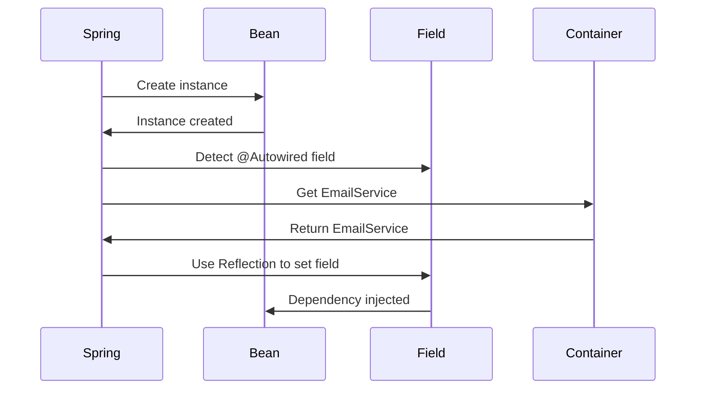

**Why Not Recommended?**
- ❌ **Breaks encapsulation** (private field accessed via reflection)
- ❌ **Hard to test** (cannot inject mocks easily)
- ❌ **Cannot be final** (immutability lost)
- ❌ **Hidden dependencies** (not visible in constructor)
- ❌ **Reflection overhead** (slower)

**Testing Difficulty:**
```java
// Hard to test
@Test
public void testFieldInjection() {
    FieldInjectionService service = new FieldInjectionService();
    // How to inject mock? Need reflection!
    
    EmailService mock = Mockito.mock(EmailService.class);
    // Must use reflection to set private field
    ReflectionTestUtils.setField(service, "emailService", mock);
}

// Easy to test with constructor injection
@Test
public void testConstructorInjection() {
    EmailService mock = Mockito.mock(EmailService.class);
    MessageService service = new MessageService(mock, null);
    // Clean and simple!
}
```

---

### 📊 Injection Types Comparison

| Aspect | Constructor | Setter | Field |
|:-------|:-----------|:-------|:------|
| **Immutability** | ✅ Yes (final) | ❌ No | ❌ No |
| **Null Safety** | ✅ Yes | ❌ No | ❌ No |
| **Testability** | ✅ Excellent | ✅ Good | ❌ Poor |
| **@Autowired** | Optional (single) | Required | Required |
| **Circular Deps** | ❌ Difficult | ✅ Easy | ✅ Easy |
| **Encapsulation** | ✅ Maintained | ✅ Maintained | ❌ Broken |
| **IDE Support** | ✅ Excellent | ✅ Good | ⚠️ Limited |
| **Recommendation** | ✅ **Use This** | ⚠️ Optional deps | ❌ Avoid |

---

### 2️⃣ @Qualifier

**Purpose:** Specifies which bean to inject when multiple candidates exist.

```java
@Component("emailNotifier")
public class EmailNotifier implements Notifier { }

@Component("smsNotifier")
public class SmsNotifier implements Notifier { }

@Component
public class NotificationService {
    private final Notifier notifier;
    
    @Autowired
    public NotificationService(@Qualifier("emailNotifier") Notifier notifier) {
        this.notifier = notifier;
    }
}
```

**Internal Working:**

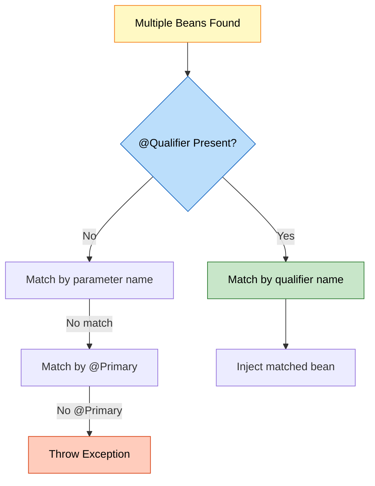

**Resolution Order:**
1. **@Qualifier** name match
2. **Parameter name** match
3. **@Primary** bean
4. **Exception** if ambiguous

---

### 3️⃣ @Primary

**Purpose:** Indicates that a bean should be given preference when multiple candidates are qualified.

```java
@Component
@Primary  // This will be injected by default
public class EmailNotifier implements Notifier { }

@Component
public class SmsNotifier implements Notifier { }

@Component
public class NotificationService {
    private final Notifier notifier;
    
    // EmailNotifier injected (marked as @Primary)
    public NotificationService(Notifier notifier) {
        this.notifier = notifier;
    }
}
```

**When to Use:**
- Default implementation
- Most commonly used bean
- Fallback option

---

### 4️⃣ @Value

**Purpose:** Injects values from properties files or expressions.

```java
@Component
public class DatabaseConfig {
    
    @Value("${db.url}")
    private String url;
    
    @Value("${db.username}")
    private String username;
    
    @Value("${db.password}")
    private String password;
    
    @Value("#{systemProperties['user.home']}")
    private String userHome;
    
    @Value("#{10 * 2}")
    private int calculatedValue;
}
```

**application.properties:**
```properties
db.url=jdbc:mysql://localhost:3306/mydb
db.username=root
db.password=secret
```

**SpEL (Spring Expression Language):**
```java
@Value("#{T(java.lang.Math).random() * 100}")
private double randomNumber;

@Value("#{someBean.someProperty}")
private String propertyFromBean;

@Value("#{someBean.someMethod()}")
private String methodResult;
```

---

### 5️⃣ @Required (Deprecated)

**Purpose:** Marks a setter method as required (deprecated in Spring 5.1).

```java
@Component
public class UserService {
    private UserRepository repository;
    
    @Required  // Deprecated - use constructor injection instead
    public void setRepository(UserRepository repository) {
        this.repository = repository;
    }
}
```

**Modern Alternative:**
```java
@Component
public class UserService {
    private final UserRepository repository;
    
    // Constructor injection ensures required dependency
    public UserService(UserRepository repository) {
        this.repository = repository;
    }
}
```

---

### 6️⃣ @Lazy

**Purpose:** Indicates that a bean should be lazily initialized.

```java
@Component
@Lazy  // Created only when first requested
public class HeavyService {
    public HeavyService() {
        System.out.println("HeavyService created");
        // Expensive initialization
    }
}

@Component
public class UserService {
    private final HeavyService heavyService;
    
    @Autowired
    public UserService(@Lazy HeavyService heavyService) {
        this.heavyService = heavyService;  // Proxy injected
        System.out.println("UserService created");
    }
    
    public void useHeavyService() {
        heavyService.doSomething();  // NOW HeavyService is created
    }
}
```

**Internal Working:**

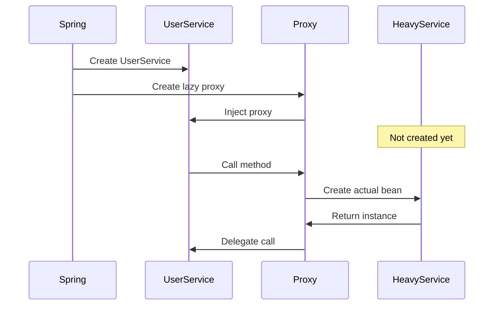

**When to Use:**
- Expensive initialization
- Rarely used beans
- Circular dependency resolution
- Conditional usage

---

### 7️⃣ @DependsOn

**Purpose:** Specifies that a bean depends on other beans being initialized first.

```java
@Component
@DependsOn("databaseInitializer")
public class UserService {
    // Will be created AFTER databaseInitializer
}

@Component("databaseInitializer")
public class DatabaseInitializer {
    @PostConstruct
    public void init() {
        System.out.println("Database initialized");
    }
}
```

**Multiple Dependencies:**
```java
@Component
@DependsOn({"cacheManager", "databaseInitializer", "securityConfig"})
public class ApplicationService {
    // Created after all dependencies
}
```

---

### 8️⃣ @Inject (JSR-330)

**Purpose:** Standard Java dependency injection annotation (alternative to @Autowired).

```java
import javax.inject.Inject;
import javax.inject.Named;

@Named  // Equivalent to @Component
public class UserService {
    private final UserRepository repository;
    
    @Inject  // Equivalent to @Autowired
    public UserService(UserRepository repository) {
        this.repository = repository;
    }
}
```

**@Autowired vs @Inject:**

| Feature | @Autowired | @Inject |
|:--------|:-----------|:--------|
| **Source** | Spring | JSR-330 (Java standard) |
| **Required** | Has `required` attribute | No `required` attribute |
| **Portability** | Spring only | Works with any JSR-330 container |
| **Qualifier** | @Qualifier | @Named |

---

## 7. BEAN SCOPES & LIFECYCLE

<div align="center">

</div>

### 📌 Bean Scopes

**Reference:** [BeanScopeDemo.java](src/main/java/org/example/bean_scope/BeanScopeDemo.java)

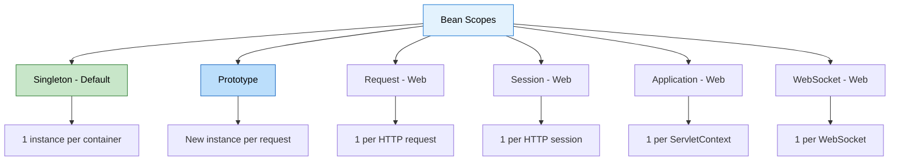

---

### 1️⃣ @Scope - Singleton (Default)

**Reference:** [SingletonBean.java](src/main/java/org/example/bean_scope/SingletonBean.java)

```java
@Component  // Default scope is singleton
public class SingletonBean {
    public SingletonBean() {
        System.out.println("SingletonBean created");
    }
}
```

**Explicit Declaration:**
```java
@Component
@Scope("singleton")  // or @Scope(ConfigurableBeanFactory.SCOPE_SINGLETON)
public class SingletonBean { }
```

**Internal Working:**

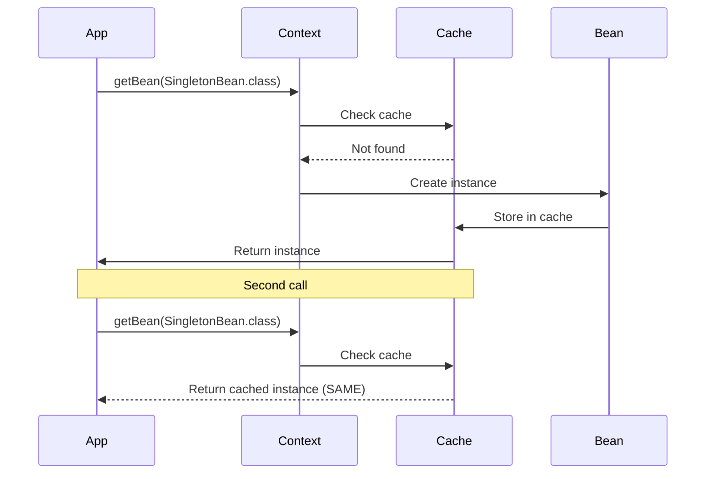

**Behavior:**
```java
ApplicationContext context = new AnnotationConfigApplicationContext(BeanScopeConfig.class);

SingletonBean s1 = context.getBean(SingletonBean.class);
SingletonBean s2 = context.getBean(SingletonBean.class);

System.out.println(s1 == s2);  // true - SAME instance
```

**Output:**
```
SingletonBean created
Same Instance? true
```

**Characteristics:**
- ✅ Created at container startup (eager)
- ✅ One instance per container
- ✅ Shared across application
- ✅ Thread-safe if stateless
- ✅ Memory efficient

---

### 2️⃣ @Scope - Prototype

**Reference:** [PrototypeBean.java](src/main/java/org/example/bean_scope/PrototypeBean.java)

```java
@Component
@Scope("prototype")  // or @Scope(ConfigurableBeanFactory.SCOPE_PROTOTYPE)
public class PrototypeBean {
    public PrototypeBean() {
        System.out.println("PrototypeBean created");
    }
}
```

**Internal Working:**

```mermaid
sequenceDiagram
    participant App
    participant Context
    participant Bean
    
    App->>Context: getBean(PrototypeBean.class)
    Context->>Bean: Create NEW instance
    Bean->>App: Return instance
    
    Note over App,Bean: Second call
    
    App->>Context: getBean(PrototypeBean.class)
    Context->>Bean: Create NEW instance (DIFFERENT)
    Bean->>App: Return new instance
```

**Behavior:**
```java
ApplicationContext context = new AnnotationConfigApplicationContext(BeanScopeConfig.class);

PrototypeBean p1 = context.getBean(PrototypeBean.class);
PrototypeBean p2 = context.getBean(PrototypeBean.class);

System.out.println(p1 == p2);  // false - DIFFERENT instances
```

**Output:**
```
PrototypeBean created
PrototypeBean created
Same Instance? false
```

**Characteristics:**
- ✅ Created on demand (lazy)
- ✅ New instance per request
- ✅ Not cached
- ❌ Spring doesn't manage destruction
- ⚠️ Higher memory usage

---

### 3️⃣ Web Scopes

**Request Scope:**
```java
@Component
@Scope(value = WebApplicationContext.SCOPE_REQUEST, proxyMode = ScopedProxyMode.TARGET_CLASS)
public class LoginForm {
    // New instance per HTTP request
}
```

**Session Scope:**
```java
@Component
@Scope(value = WebApplicationContext.SCOPE_SESSION, proxyMode = ScopedProxyMode.TARGET_CLASS)
public class UserPreferences {
    // New instance per HTTP session
}
```

**Application Scope:**
```java
@Component
@Scope(value = WebApplicationContext.SCOPE_APPLICATION, proxyMode = ScopedProxyMode.TARGET_CLASS)
public class AppConfig {
    // One instance per ServletContext
}
```

**Why proxyMode?**
- Singleton beans cannot directly inject prototype/request/session beans
- Proxy allows lazy resolution of actual bean

---

### 📊 Scope Comparison

| Scope | Instances | Lifecycle | Use Case | Web Only |
|:------|:----------|:----------|:---------|:---------|
| **Singleton** | 1 per container | Container lifetime | Stateless services | ❌ No |
| **Prototype** | New per request | Until GC | Stateful objects | ❌ No |
| **Request** | 1 per HTTP request | Request lifetime | Form data | ✅ Yes |
| **Session** | 1 per HTTP session | Session lifetime | User data | ✅ Yes |
| **Application** | 1 per ServletContext | App lifetime | App config | ✅ Yes |
| **WebSocket** | 1 per WebSocket | WebSocket lifetime | Chat sessions | ✅ Yes |

---

### 🔄 Bean Lifecycle Annotations

```mermaid
stateDiagram-v2
    [*] --> Instantiation: Container starts
    Instantiation --> DependencyInjection: Bean created
    DependencyInjection --> PostConstruct: Dependencies injected
    PostConstruct --> Ready: "@PostConstruct called"
    Ready --> PreDestroy: Container shutdown
    PreDestroy --> [*]: "@PreDestroy called"
```

---

### 1️⃣ @PostConstruct

**Purpose:** Method executed after dependency injection is complete.

```java
import javax.annotation.PostConstruct;

@Component
public class DatabaseService {
    
    @Autowired
    private DataSource dataSource;
    
    @PostConstruct
    public void init() {
        System.out.println("Initializing database connection...");
        // Open connections, load cache, etc.
    }
}
```

**Execution Order:**
1. Constructor called
2. Dependencies injected
3. **@PostConstruct** method called
4. Bean ready to use

**Use Cases:**
- Initialize resources
- Load configuration
- Validate dependencies
- Start background tasks

---

### 2️⃣ @PreDestroy

**Purpose:** Method executed before bean is destroyed.

```java
import javax.annotation.PreDestroy;

@Component
public class DatabaseService {
    
    @PreDestroy
    public void cleanup() {
        System.out.println("Closing database connections...");
        // Close connections, save state, etc.
    }
}
```

**When Called:**
- Container shutdown
- Application stop
- Context close

**Use Cases:**
- Close connections
- Release resources
- Save state
- Stop background tasks

**⚠️ Important:** @PreDestroy is NOT called for prototype beans!

---

### 3️⃣ Complete Lifecycle Example

```java
@Component
@Scope("singleton")
public class LifecycleBean {
    
    @Autowired
    private EmailService emailService;
    
    // 1. Constructor
    public LifecycleBean() {
        System.out.println("1. Constructor called");
    }
    
    // 2. Setter injection (if any)
    @Autowired
    public void setSomeService(SomeService service) {
        System.out.println("2. Setter injection");
    }
    
    // 3. Post-construct
    @PostConstruct
    public void init() {
        System.out.println("3. @PostConstruct - Bean initialized");
    }
    
    // 4. Bean in use
    public void doSomething() {
        System.out.println("4. Bean in use");
    }
    
    // 5. Pre-destroy
    @PreDestroy
    public void cleanup() {
        System.out.println("5. @PreDestroy - Bean being destroyed");
    }
}
```

**Output:**
```
1. Constructor called
2. Setter injection
3. @PostConstruct - Bean initialized
4. Bean in use
5. @PreDestroy - Bean being destroyed
```

---

### 4️⃣ InitializingBean & DisposableBean (Alternative)

**Interface-based approach:**

```java
import org.springframework.beans.factory.InitializingBean;
import org.springframework.beans.factory.DisposableBean;

@Component
public class DatabaseService implements InitializingBean, DisposableBean {
    
    @Override
    public void afterPropertiesSet() throws Exception {
        System.out.println("InitializingBean: afterPropertiesSet");
    }
    
    @Override
    public void destroy() throws Exception {
        System.out.println("DisposableBean: destroy");
    }
}
```

**Comparison:**

| Method | Pros | Cons |
|:-------|:-----|:-----|
| **@PostConstruct/@PreDestroy** | Standard (JSR-250), no Spring coupling | Requires annotation support |
| **InitializingBean/DisposableBean** | Type-safe, IDE support | Spring coupling |
| **@Bean(initMethod/destroyMethod)** | Works with third-party classes | Only for @Bean methods |

---

### 5️⃣ @Bean Lifecycle Methods

```java
@Configuration
public class AppConfig {
    
    @Bean(initMethod = "init", destroyMethod = "cleanup")
    public DataSource dataSource() {
        return new HikariDataSource();
    }
}

public class HikariDataSource {
    public void init() {
        System.out.println("DataSource initialized");
    }
    
    public void cleanup() {
        System.out.println("DataSource closed");
    }
}
```

---

## 8. COMPONENT SCANNING

<div align="center">

</div>

### 📌 How Component Scanning Works

```mermaid
graph TD
    A["@ComponentScan"] --> B[Scan Base Packages]
    B --> C[Read .class Files]
    C --> D{Has Stereotype?}
    D -->|Yes| E[Create BeanDefinition]
    D -->|No| F[Skip]
    E --> G[Register in Context]
    G --> H[Instantiate Bean]
    H --> I[Inject Dependencies]
    I --> J[Bean Ready]
    
    style A fill:#fff9c4,stroke:#f57f17,color:#000
    style D fill:#bbdefb,stroke:#1565c0,color:#000
    style E fill:#c8e6c9,stroke:#2e7d32,color:#000
    style J fill:#a5d6a7,stroke:#2e7d32,color:#000
```

### 🔍 @ComponentScan Attributes

**Basic Usage:**
```java
@Configuration
@ComponentScan(basePackages = "org.example.services")
public class AppConfig { }
```

**Multiple Packages:**
```java
@ComponentScan(basePackages = {"org.example.services", "org.example.repositories"})
```

**Type-Safe Package Scanning:**
```java
@ComponentScan(basePackageClasses = {EmailService.class, UserRepository.class})
// Scans packages containing these classes
```

**Include Filters:**
```java
@ComponentScan(
    basePackages = "org.example",
    includeFilters = @Filter(
        type = FilterType.ANNOTATION,
        classes = Service.class
    )
)
```

**Exclude Filters:**
```java
@ComponentScan(
    basePackages = "org.example",
    excludeFilters = @Filter(
        type = FilterType.REGEX,
        pattern = ".*Test.*"
    )
)
```

**Filter Types:**

| FilterType | Description | Example |
|:-----------|:------------|:--------|
| **ANNOTATION** | By annotation | `@Service.class` |
| **ASSIGNABLE_TYPE** | By class type | `UserService.class` |
| **ASPECTJ** | AspectJ pattern | `org.example..*Service+` |
| **REGEX** | Regular expression | `.*Service` |
| **CUSTOM** | Custom filter | Implement `TypeFilter` |

---

### 📊 Component Scanning Strategies

**Strategy 1: Single Package**
```java
@ComponentScan("org.example")  // Scans org.example and sub-packages
```

**Strategy 2: Multiple Packages**
```java
@ComponentScan({"org.example.services", "org.example.repositories"})
```

**Strategy 3: Exclude Test Classes**
```java
@ComponentScan(
    basePackages = "org.example",
    excludeFilters = @Filter(
        type = FilterType.REGEX,
        pattern = ".*Test.*"
    )
)
```

**Strategy 4: Include Only Specific Annotations**
```java
@ComponentScan(
    basePackages = "org.example",
    useDefaultFilters = false,  // Disable default filters
    includeFilters = @Filter(
        type = FilterType.ANNOTATION,
        classes = {Service.class, Repository.class}
    )
)
```

---

## 9. ADVANCED ANNOTATIONS

### 1️⃣ @Profile

**Purpose:** Conditionally register beans based on active profiles.

```java
@Configuration
@Profile("development")
public class DevConfig {
    @Bean
    public DataSource dataSource() {
        return new H2DataSource();  // In-memory database
    }
}

@Configuration
@Profile("production")
public class ProdConfig {
    @Bean
    public DataSource dataSource() {
        return new MySQLDataSource();  // Production database
    }
}
```

**Activating Profiles:**
```java
// Programmatically
System.setProperty("spring.profiles.active", "development");

// Via JVM argument
-Dspring.profiles.active=development

// Via environment variable
export SPRING_PROFILES_ACTIVE=development
```

**Multiple Profiles:**
```java
@Profile({"development", "test"})  // Active in dev OR test
```

**NOT Profile:**
```java
@Profile("!production")  // Active when NOT production
```

---

### 2️⃣ @Conditional

**Purpose:** Conditionally register beans based on custom conditions.

```java
@Configuration
public class AppConfig {
    
    @Bean
    @Conditional(WindowsCondition.class)
    public FileSystem windowsFileSystem() {
        return new WindowsFileSystem();
    }
    
    @Bean
    @Conditional(LinuxCondition.class)
    public FileSystem linuxFileSystem() {
        return new LinuxFileSystem();
    }
}

public class WindowsCondition implements Condition {
    @Override
    public boolean matches(ConditionContext context, AnnotatedTypeMetadata metadata) {
        return System.getProperty("os.name").toLowerCase().contains("windows");
    }
}
```

**Built-in Conditional Annotations:**

| Annotation | Condition |
|:-----------|:----------|
| **@ConditionalOnClass** | Class present in classpath |
| **@ConditionalOnMissingClass** | Class not in classpath |
| **@ConditionalOnBean** | Bean exists |
| **@ConditionalOnMissingBean** | Bean doesn't exist |
| **@ConditionalOnProperty** | Property has value |
| **@ConditionalOnResource** | Resource exists |
| **@ConditionalOnWebApplication** | Web application |

**Example:**
```java
@Bean
@ConditionalOnProperty(name = "feature.email.enabled", havingValue = "true")
public EmailService emailService() {
    return new EmailService();
}
```

---

### 3️⃣ @PropertySource

**Purpose:** Load properties from external files.

```java
@Configuration
@PropertySource("classpath:application.properties")
public class AppConfig {
    
    @Value("${app.name}")
    private String appName;
    
    @Value("${app.version}")
    private String appVersion;
}
```

**Multiple Property Sources:**
```java
@PropertySources({
    @PropertySource("classpath:application.properties"),
    @PropertySource("classpath:database.properties")
})
```

**With Placeholders:**
```java
@PropertySource("classpath:config-${env}.properties")
```

---

### 4️⃣ @Import

**Purpose:** Import additional configuration classes.

```java
@Configuration
@Import({DatabaseConfig.class, SecurityConfig.class})
public class AppConfig {
    // Main configuration
}
```

**Import Selector:**
```java
@Configuration
@Import(MyImportSelector.class)
public class AppConfig { }

public class MyImportSelector implements ImportSelector {
    @Override
    public String[] selectImports(AnnotationMetadata metadata) {
        return new String[]{
            "org.example.DatabaseConfig",
            "org.example.SecurityConfig"
        };
    }
}
```

---

### 5️⃣ @Order

**Purpose:** Define bean initialization order.

```java
@Component
@Order(1)  // Initialized first
public class FirstService { }

@Component
@Order(2)  // Initialized second
public class SecondService { }

@Component
@Order(3)  // Initialized third
public class ThirdService { }
```

**Lower values have higher priority.**

---

### 6️⃣ @EventListener

**Purpose:** Listen to application events.

```java
@Component
public class ApplicationEventListener {
    
    @EventListener
    public void handleContextRefresh(ContextRefreshedEvent event) {
        System.out.println("Context refreshed!");
    }
    
    @EventListener
    public void handleContextClosed(ContextClosedEvent event) {
        System.out.println("Context closed!");
    }
    
    @EventListener
    public void handleCustomEvent(CustomEvent event) {
        System.out.println("Custom event: " + event.getMessage());
    }
}
```

**Publishing Events:**
```java
@Component
public class EventPublisher {
    
    @Autowired
    private ApplicationEventPublisher publisher;
    
    public void publishEvent() {
        publisher.publishEvent(new CustomEvent("Hello!"));
    }
}
```

---

### 7️⃣ @Async

**Purpose:** Execute methods asynchronously.

```java
@Configuration
@EnableAsync
public class AppConfig { }

@Service
public class EmailService {
    
    @Async
    public void sendEmail(String to, String message) {
        // Runs in separate thread
        System.out.println("Sending email to: " + to);
    }
    
    @Async
    public CompletableFuture<String> sendEmailAsync(String to) {
        // Returns immediately
        return CompletableFuture.completedFuture("Email sent");
    }
}
```

---

### 8️⃣ @Scheduled

**Purpose:** Schedule method execution.

```java
@Configuration
@EnableScheduling
public class AppConfig { }

@Component
public class ScheduledTasks {
    
    @Scheduled(fixedRate = 5000)  // Every 5 seconds
    public void reportStatus() {
        System.out.println("Status: OK");
    }
    
    @Scheduled(cron = "0 0 * * * *")  // Every hour
    public void hourlyTask() {
        System.out.println("Hourly task executed");
    }
    
    @Scheduled(fixedDelay = 10000, initialDelay = 5000)
    public void delayedTask() {
        System.out.println("Delayed task");
    }
}
```

---

### 9️⃣ @Cacheable

**Purpose:** Cache method results.

```java
@Configuration
@EnableCaching
public class AppConfig { }

@Service
public class UserService {
    
    @Cacheable("users")
    public User findById(int id) {
        // Expensive database query
        return userRepository.findById(id);
    }
    
    @CacheEvict(value = "users", key = "#id")
    public void deleteUser(int id) {
        userRepository.delete(id);
    }
    
    @CachePut(value = "users", key = "#user.id")
    public User updateUser(User user) {
        return userRepository.save(user);
    }
}
```

---

### 🔟 @Transactional

**Purpose:** Manage database transactions.

```java
@Configuration
@EnableTransactionManagement
public class AppConfig { }

@Service
public class UserService {
    
    @Transactional
    public void createUser(User user) {
        userRepository.save(user);
        // If exception occurs, transaction rolls back
    }
    
    @Transactional(readOnly = true)
    public User findById(int id) {
        return userRepository.findById(id);
    }
    
    @Transactional(
        propagation = Propagation.REQUIRES_NEW,
        isolation = Isolation.SERIALIZABLE,
        timeout = 30,
        rollbackFor = Exception.class
    )
    public void complexTransaction() {
        // Complex transaction logic
    }
}
```

---

## 10. INTERNAL WORKING MECHANISM

<div align="center">

</div>

### 📌 Complete Execution Flow

```mermaid
sequenceDiagram
    participant Main as App.main()
    participant Context as AnnotationConfigApplicationContext
    participant Scanner as ClassPathBeanDefinitionScanner
    participant Registry as BeanDefinitionRegistry
    participant Processor as BeanPostProcessor
    participant Factory as BeanFactory
    participant Bean as Beans
    
    Main->>Context: new AnnotationConfigApplicationContext(AppConfig.class)
    Context->>Context: Read "@Configuration"
    Context->>Context: Read "@ComponentScan"
    Context->>Scanner: scan("org.example.services")
    
    Scanner->>Scanner: Find .class files
    Scanner->>Scanner: Check for "@Component"
    Scanner->>Registry: Register BeanDefinitions
    
    Registry->>Factory: Process BeanDefinitions
    Factory->>Bean: Instantiate EmailService
    Factory->>Bean: Instantiate SmsService
    Factory->>Bean: Instantiate MessageService
    
    Factory->>Factory: Resolve dependencies
    Factory->>Bean: Inject EmailService into MessageService
    Factory->>Bean: Inject SmsService into MessageService
    
    Factory->>Processor: Apply BeanPostProcessors
    Processor->>Bean: postProcessBeforeInitialization
    Bean->>Bean: @PostConstruct methods
    Processor->>Bean: postProcessAfterInitialization
    
    Context->>Main: Container ready
    Main->>Context: getBean(MessageService.class)
    Context->>Main: Return MessageService
    Main->>Bean: Use beans
    Main->>Context: close()
    Context->>Bean: @PreDestroy methods
```

### 🔍 Step-by-Step Breakdown

#### Step 1: Container Creation

```java
ApplicationContext context = new AnnotationConfigApplicationContext(AppConfig.class);
```

**What Happens:**
1. **Create AnnotationConfigApplicationContext** instance
2. **Register AppConfig.class** as configuration
3. **Read @Configuration** annotation
4. **Read @ComponentScan** annotation
5. **Trigger refresh()** method

---

#### Step 2: Component Scanning

```java
@ComponentScan(basePackages = "org.example.services")
```

**What Happens:**
1. **ClassPathBeanDefinitionScanner** created
2. **Scans** "org.example.services" package
3. **Reads** all .class files in package
4. **Checks** for stereotype annotations (@Component, @Service, etc.)
5. **Creates BeanDefinition** for each component
6. **Registers** BeanDefinitions in registry

**Internal Process:**
```
org.example.services/
├── EmailService.class      → @Component found → Register
├── SmsService.class        → @Component found → Register
├── MessageService.class    → @Component found → Register
├── AppConfig.class         → @Configuration found → Register
└── SomeOtherClass.class    → No annotation → Skip
```

---

#### Step 3: Bean Definition Processing

**BeanDefinition Contains:**
- Bean class name
- Bean scope (singleton/prototype)
- Constructor arguments
- Property values
- Initialization method
- Destruction method
- Dependencies

**Example BeanDefinition:**
```
BeanDefinition for MessageService:
- Class: org.example.services.MessageService
- Scope: singleton
- Constructor args: [EmailService, SmsService]
- Lazy: false
- Primary: false
```

---

#### Step 4: Dependency Resolution

```mermaid
graph TD
    A[MessageService] -->|depends on| B[EmailService]
    A -->|depends on| C[SmsService]
    
    D[Spring Container] --> E{Resolve Dependencies}
    E -->|1| F[Create EmailService]
    E -->|2| G[Create SmsService]
    E -->|3| H[Create MessageService]
    
    F --> H
    G --> H
    
    style A fill:#bbdefb,stroke:#1565c0,color:#000
    style B fill:#c8e6c9,stroke:#2e7d32,color:#000
    style C fill:#c8e6c9,stroke:#2e7d32,color:#000
    style H fill:#a5d6a7,stroke:#2e7d32,color:#000
```

**Resolution Order:**
1. **Analyze dependencies** of each bean
2. **Build dependency graph**
3. **Topological sort** (dependencies first)
4. **Create beans** in order

**For MessageService:**
```
MessageService needs:
  - EmailService (no dependencies) → Create first
  - SmsService (no dependencies) → Create first
  
Creation order:
  1. EmailService
  2. SmsService
  3. MessageService (inject EmailService, SmsService)
```

---

#### Step 5: Bean Instantiation

**For Constructor Injection:**
```java
@Component
public class MessageService {
    private final EmailService emailService;
    private final SmsService smsService;
    
    public MessageService(EmailService emailService, SmsService smsService) {
        this.emailService = emailService;
        this.smsService = smsService;
    }
}
```

**What Spring Does:**
1. **Find constructor** (single constructor = auto-detected)
2. **Resolve parameters** (EmailService, SmsService)
3. **Get beans** from container
4. **Invoke constructor** with parameters
5. **Store instance** in container

**Equivalent Code:**
```java
EmailService emailService = container.getBean(EmailService.class);
SmsService smsService = container.getBean(SmsService.class);
MessageService messageService = new MessageService(emailService, smsService);
container.registerBean("messageService", messageService);
```

---

#### Step 6: BeanPostProcessor Execution

```mermaid
graph LR
    A[Bean Created] --> B[postProcessBeforeInitialization]
    B --> C["@PostConstruct"]
    C --> D[InitializingBean.afterPropertiesSet]
    D --> E[Custom init-method]
    E --> F[postProcessAfterInitialization]
    F --> G[Bean Ready]
    
    style A fill:#fff9c4,stroke:#f57f17,color:#000
    style C fill:#c8e6c9,stroke:#2e7d32,color:#000
    style G fill:#a5d6a7,stroke:#2e7d32,color:#000
```

**BeanPostProcessor Interface:**
```java
public interface BeanPostProcessor {
    Object postProcessBeforeInitialization(Object bean, String beanName);
    Object postProcessAfterInitialization(Object bean, String beanName);
}
```

**What It Does:**
- **Before initialization:** Modify bean before @PostConstruct
- **After initialization:** Wrap bean in proxy (AOP, transactions)

**Example:**
```java
@Component
public class LoggingBeanPostProcessor implements BeanPostProcessor {
    
    @Override
    public Object postProcessBeforeInitialization(Object bean, String beanName) {
        System.out.println("Before init: " + beanName);
        return bean;
    }
    
    @Override
    public Object postProcessAfterInitialization(Object bean, String beanName) {
        System.out.println("After init: " + beanName);
        return bean;  // Or return proxy
    }
}
```

---

#### Step 7: Bean Ready to Use

```java
MessageService messageService = context.getBean(MessageService.class);
messageService.sendMessage();
```

**What Happens:**
1. **Lookup bean** in container by type
2. **Return cached instance** (singleton)
3. **Use bean** in application

---

#### Step 8: Container Shutdown

```java
((AnnotationConfigApplicationContext) context).close();
```

**What Happens:**
1. **Publish ContextClosedEvent**
2. **Call @PreDestroy** methods
3. **Call DisposableBean.destroy()**
4. **Call custom destroy-method**
5. **Release resources**
6. **Clear bean cache**

---

### 🎯 Reflection & Proxy Mechanisms

**How Spring Uses Reflection:**

```java
// Spring internally does something like this:
Class<?> clazz = Class.forName("org.example.services.EmailService");
Constructor<?> constructor = clazz.getConstructor();
Object instance = constructor.newInstance();

// For @Autowired fields:
Field field = clazz.getDeclaredField("emailService");
field.setAccessible(true);
field.set(instance, emailServiceBean);

// For @PostConstruct:
Method method = clazz.getMethod("init");
method.invoke(instance);
```

**CGLIB Proxy for @Configuration:**

```java
@Configuration
public class AppConfig {
    @Bean
    public EmailService emailService() {
        return new EmailService();
    }
    
    @Bean
    public MessageService messageService() {
        return new MessageService(emailService());  // Proxy intercepts this
    }
}

// Without proxy:
EmailService e1 = emailService();  // New instance
EmailService e2 = emailService();  // New instance (WRONG!)

// With CGLIB proxy:
EmailService e1 = emailService();  // New instance
EmailService e2 = emailService();  // Same instance from cache (CORRECT!)
```

---

### 📊 Performance Considerations

**Container Startup Time:**

| Beans | Startup Time | Memory |
|:------|:------------|:-------|
| 10 | ~100ms | ~10MB |
| 100 | ~500ms | ~50MB |
| 1000 | ~2s | ~200MB |
| 10000 | ~20s | ~1GB |

**Optimization Tips:**
- Use **@Lazy** for rarely used beans
- Avoid **circular dependencies**
- Use **@ComponentScan** wisely (don't scan entire classpath)
- Use **@Conditional** to skip unnecessary beans
- Consider **lazy initialization** for large applications

---

## 11. PROJECT STRUCTURE & IMPLEMENTATION

<div align="center">

</div>

### 📁 Project Structure

```
AnnotationBased/
├── src/
│   ├── main/
│   │   └── java/
│   │       └── org/
│   │           └── example/
│   │               ├── App.java                           # Main application
│   │               ├── services/
│   │               │   ├── AppConfig.java                 # Configuration class
│   │               │   ├── EmailService.java              # Email service
│   │               │   ├── SmsService.java                # SMS service
│   │               │   ├── MessageService.java            # Message service
│   │               │   ├── ConstructorInjectionService.java
│   │               │   ├── SetterInjectionService.java
│   │               │   ├── FieldInjectionService.java
│   │               │   └── NotificationService.java
│   │               └── bean_scope/
│   │                   ├── BeanScopeConfig.java           # Scope configuration
│   │                   ├── BeanScopeDemo.java             # Scope demonstration
│   │                   ├── SingletonBean.java             # Singleton example
│   │                   └── PrototypeBean.java             # Prototype example
│   └── test/
│       └── java/
│           └── org/
│               └── example/
│                   └── AppTest.java
├── pom.xml                                                # Maven configuration
└── README.md
```

### 🔍 Key Components

**1. Configuration Class:**
```java
@Configuration
@ComponentScan(basePackages = "org.example.services")
public class AppConfig { }
```

**2. Service Classes:**
- EmailService - Sends emails
- SmsService - Sends SMS
- MessageService - Uses both services
- NotificationService - Demonstrates multiple methods

**3. Injection Examples:**
- ConstructorInjectionService - Constructor injection
- SetterInjectionService - Setter injection
- FieldInjectionService - Field injection

**4. Scope Examples:**
- SingletonBean - Singleton scope
- PrototypeBean - Prototype scope

---

## 12. REAL-WORLD EXAMPLES

<div align="center">

</div>

### 🌐 Example 1: E-Commerce Application

```java
// Configuration
@Configuration
@ComponentScan("com.ecommerce")
@EnableTransactionManagement
public class ECommerceConfig { }

// Repository Layer
@Repository
public class ProductRepository {
    public Product findById(int id) {
        // Database query
    }
}

// Service Layer
@Service
@Transactional
public class OrderService {
    private final ProductRepository productRepository;
    private final PaymentService paymentService;
    private final EmailService emailService;
    
    @Autowired
    public OrderService(ProductRepository productRepository,
                       PaymentService paymentService,
                       EmailService emailService) {
        this.productRepository = productRepository;
        this.paymentService = paymentService;
        this.emailService = emailService;
    }
    
    public Order createOrder(OrderRequest request) {
        Product product = productRepository.findById(request.getProductId());
        Payment payment = paymentService.processPayment(request.getPayment());
        Order order = new Order(product, payment);
        emailService.sendOrderConfirmation(order);
        return order;
    }
}

// Controller Layer
@RestController
@RequestMapping("/api/orders")
public class OrderController {
    private final OrderService orderService;
    
    @Autowired
    public OrderController(OrderService orderService) {
        this.orderService = orderService;
    }
    
    @PostMapping
    public ResponseEntity<Order> createOrder(@RequestBody OrderRequest request) {
        Order order = orderService.createOrder(request);
        return ResponseEntity.ok(order);
    }
}
```

---

### 🏦 Example 2: Banking Application

```java
// Configuration with Profiles
@Configuration
@ComponentScan("com.bank")
public class BankConfig { }

@Configuration
@Profile("development")
public class DevDatabaseConfig {
    @Bean
    public DataSource dataSource() {
        return new H2DataSource();  // In-memory
    }
}

@Configuration
@Profile("production")
public class ProdDatabaseConfig {
    @Bean
    public DataSource dataSource() {
        return new OracleDataSource();  // Production DB
    }
}

// Service with Caching
@Service
public class AccountService {
    private final AccountRepository accountRepository;
    
    @Autowired
    public AccountService(AccountRepository accountRepository) {
        this.accountRepository = accountRepository;
    }
    
    @Cacheable("accounts")
    public Account getAccount(String accountNumber) {
        return accountRepository.findByAccountNumber(accountNumber);
    }
    
    @Transactional
    public void transfer(String from, String to, BigDecimal amount) {
        Account fromAccount = getAccount(from);
        Account toAccount = getAccount(to);
        
        fromAccount.debit(amount);
        toAccount.credit(amount);
        
        accountRepository.save(fromAccount);
        accountRepository.save(toAccount);
    }
}
```

---

### 📧 Example 3: Email Marketing System

```java
// Configuration
@Configuration
@ComponentScan("com.marketing")
@EnableAsync
@EnableScheduling
public class MarketingConfig { }

// Email Service with Async
@Service
public class EmailMarketingService {
    private final EmailSender emailSender;
    private final TemplateEngine templateEngine;
    
    @Autowired
    public EmailMarketingService(EmailSender emailSender,
                                TemplateEngine templateEngine) {
        this.emailSender = emailSender;
        this.templateEngine = templateEngine;
    }
    
    @Async
    public CompletableFuture<Void> sendCampaign(Campaign campaign) {
        List<User> users = campaign.getUsers();
        String template = templateEngine.render(campaign.getTemplate());
        
        users.forEach(user -> {
            String personalizedEmail = template.replace("{{name}}", user.getName());
            emailSender.send(user.getEmail(), personalizedEmail);
        });
        
        return CompletableFuture.completedFuture(null);
    }
}

// Scheduled Tasks
@Component
public class CampaignScheduler {
    private final EmailMarketingService marketingService;
    
    @Autowired
    public CampaignScheduler(EmailMarketingService marketingService) {
        this.marketingService = marketingService;
    }
    
    @Scheduled(cron = "0 0 9 * * MON")  // Every Monday at 9 AM
    public void sendWeeklyNewsletter() {
        Campaign campaign = new Campaign("Weekly Newsletter");
        marketingService.sendCampaign(campaign);
    }
}
```

---

### 🎮 Example 4: Gaming Platform

```java
// Configuration
@Configuration
@ComponentScan("com.gaming")
public class GamingConfig { }

// Player Service with Scope
@Service
public class PlayerService {
    private final PlayerRepository playerRepository;
    private final LeaderboardService leaderboardService;
    
    @Autowired
    public PlayerService(PlayerRepository playerRepository,
                        LeaderboardService leaderboardService) {
        this.playerRepository = playerRepository;
        this.leaderboardService = leaderboardService;
    }
    
    @Transactional
    public void updateScore(int playerId, int score) {
        Player player = playerRepository.findById(playerId);
        player.addScore(score);
        playerRepository.save(player);
        leaderboardService.updateLeaderboard(player);
    }
}

// Game Session (Prototype Scope)
@Component
@Scope("prototype")
public class GameSession {
    private final String sessionId;
    private final List<Player> players;
    
    public GameSession() {
        this.sessionId = UUID.randomUUID().toString();
        this.players = new ArrayList<>();
        System.out.println("New game session created: " + sessionId);
    }
    
    public void addPlayer(Player player) {
        players.add(player);
    }
}

// Game Service
@Service
public class GameService {
    private final ApplicationContext context;
    
    @Autowired
    public GameService(ApplicationContext context) {
        this.context = context;
    }
    
    public GameSession createNewGame() {
        // Get new prototype instance
        return context.getBean(GameSession.class);
    }
}
```

---

### 🏥 Example 5: Hospital Management System

```java
// Configuration
@Configuration
@ComponentScan("com.hospital")
@EnableTransactionManagement
public class HospitalConfig { }

// Appointment Service
@Service
public class AppointmentService {
    private final PatientRepository patientRepository;
    private final DoctorRepository doctorRepository;
    private final NotificationService notificationService;
    
    @Autowired
    public AppointmentService(PatientRepository patientRepository,
                             DoctorRepository doctorRepository,
                             NotificationService notificationService) {
        this.patientRepository = patientRepository;
        this.doctorRepository = doctorRepository;
        this.notificationService = notificationService;
    }
    
    @Transactional
    public Appointment bookAppointment(AppointmentRequest request) {
        Patient patient = patientRepository.findById(request.getPatientId());
        Doctor doctor = doctorRepository.findById(request.getDoctorId());
        
        Appointment appointment = new Appointment(patient, doctor, request.getDateTime());
        
        // Send notifications
        notificationService.notifyPatient(patient, appointment);
        notificationService.notifyDoctor(doctor, appointment);
        
        return appointment;
    }
}

// Event Listener
@Component
public class AppointmentEventListener {
    
    @EventListener
    public void handleAppointmentCreated(AppointmentCreatedEvent event) {
        System.out.println("Appointment created: " + event.getAppointment());
        // Send SMS, update calendar, etc.
    }
    
    @EventListener
    public void handleAppointmentCancelled(AppointmentCancelledEvent event) {
        System.out.println("Appointment cancelled: " + event.getAppointment());
        // Refund, notify, etc.
    }
}
```

---

## 13. BEST PRACTICES

<div align="center">

</div>

### 🎯 Dependency Injection Best Practices

#### 1. Always Use Constructor Injection for Required Dependencies

**✅ Good:**
```java
@Component
public class UserService {
    private final UserRepository repository;
    
    public UserService(UserRepository repository) {
        this.repository = repository;
    }
}
```

**❌ Bad:**
```java
@Component
public class UserService {
    @Autowired
    private UserRepository repository;  // Field injection
}
```

**Why?**
- Immutability (final fields)
- Testability (easy to mock)
- Null safety
- Clear dependencies

---

#### 2. Use @Qualifier for Multiple Implementations

**✅ Good:**
```java
@Component("emailNotifier")
public class EmailNotifier implements Notifier { }

@Component("smsNotifier")
public class SmsNotifier implements Notifier { }

@Service
public class NotificationService {
    private final Notifier notifier;
    
    public NotificationService(@Qualifier("emailNotifier") Notifier notifier) {
        this.notifier = notifier;
    }
}
```

---

#### 3. Avoid Circular Dependencies

**❌ Bad:**
```java
@Component
public class A {
    @Autowired
    private B b;  // A depends on B
}

@Component
public class B {
    @Autowired
    private A a;  // B depends on A (Circular!)
}
```

**✅ Good:**
```java
@Component
public class CommonService { }

@Component
public class A {
    @Autowired
    private CommonService service;
}

@Component
public class B {
    @Autowired
    private CommonService service;
}
```

---

#### 4. Use Appropriate Scopes

**✅ Good:**
```java
@Service  // Singleton by default - stateless
public class UserService { }

@Component
@Scope("prototype")  // Prototype - stateful
public class ShoppingCart { }
```

---

#### 5. Keep Configuration Classes Organized

**✅ Good:**
```java
@Configuration
@ComponentScan("com.example")
public class AppConfig { }

@Configuration
public class DatabaseConfig { }

@Configuration
public class SecurityConfig { }
```

---

### 📊 Performance Best Practices

#### 1. Use @Lazy for Heavy Beans

```java
@Component
@Lazy
public class HeavyService {
    // Expensive initialization
}
```

#### 2. Optimize Component Scanning

```java
// ❌ Bad - Scans entire classpath
@ComponentScan("com")

// ✅ Good - Specific packages
@ComponentScan({"com.example.services", "com.example.repositories"})
```

#### 3. Use @Conditional Wisely

```java
@Bean
@ConditionalOnProperty(name = "feature.enabled", havingValue = "true")
public FeatureService featureService() {
    return new FeatureService();
}
```

---

### 🔒 Security Best Practices

#### 1. Don't Hardcode Sensitive Data

**❌ Bad:**
```java
@Value("mySecretPassword123")
private String password;
```

**✅ Good:**
```java
@Value("${db.password}")
private String password;
```

#### 2. Use Profiles for Environment-Specific Config

```java
@Configuration
@Profile("production")
public class ProdConfig {
    @Bean
    public DataSource dataSource() {
        // Production database
    }
}
```

---

### 📝 Code Organization Best Practices

#### 1. Follow Package Structure

```
com.example/
├── config/          # Configuration classes
├── controller/      # REST controllers
├── service/         # Business logic
├── repository/      # Data access
├── model/           # Domain models
└── util/            # Utilities
```

#### 2. Use Meaningful Bean Names

```java
@Component("userAuthenticationService")
public class UserAuthenticationService { }
```

#### 3. Document Complex Configurations

```java
/**
 * Database configuration for production environment.
 * Uses connection pooling with HikariCP.
 * Max pool size: 20 connections
 */
@Configuration
@Profile("production")
public class DatabaseConfig { }
```

---

## 14. TOP INTERVIEW QUESTIONS

<div align="center">

</div>

### Q1: What is the difference between @Component, @Service, @Repository, and @Controller?

**Answer:**

All are specializations of @Component for different layers:

| Annotation | Layer | Special Feature |
|:-----------|:------|:---------------|
| **@Component** | Generic | None |
| **@Service** | Business | None (semantic) |
| **@Repository** | Data Access | Exception translation |
| **@Controller** | Presentation | Request mapping |

**Example:**
```java
@Component  // Generic bean
public class UtilityClass { }

@Service  // Business logic
public class UserService { }

@Repository  // Data access - converts SQLException to DataAccessException
public class UserRepository { }

@Controller  // Web controller
public class UserController { }
```

**Key Point:** @Repository has special exception translation feature that converts database exceptions to Spring's DataAccessException hierarchy.

---

### Q2: Why is constructor injection preferred over field injection?

**Answer:**

**Constructor Injection Advantages:**
1. **Immutability** - Can use final fields
2. **Testability** - Easy to inject mocks
3. **Null Safety** - Dependencies guaranteed at construction
4. **No Reflection** - Direct instantiation
5. **Clear Dependencies** - Visible in constructor signature

**Example:**
```java
// ✅ Constructor Injection
@Component
public class UserService {
    private final UserRepository repository;
    
    public UserService(UserRepository repository) {
        this.repository = repository;
    }
}

// Testing is easy
@Test
public void test() {
    UserRepository mock = Mockito.mock(UserRepository.class);
    UserService service = new UserService(mock);  // Simple!
}

// ❌ Field Injection
@Component
public class UserService {
    @Autowired
    private UserRepository repository;
}

// Testing requires reflection
@Test
public void test() {
    UserService service = new UserService();
    UserRepository mock = Mockito.mock(UserRepository.class);
    ReflectionTestUtils.setField(service, "repository", mock);  // Complex!
}
```

---

### Q3: What happens if Spring finds multiple beans of the same type?

**Answer:**

Spring throws **NoUniqueBeanDefinitionException**.

**Solutions:**

**1. Use @Primary:**
```java
@Component
@Primary  // This will be injected by default
public class EmailNotifier implements Notifier { }

@Component
public class SmsNotifier implements Notifier { }
```

**2. Use @Qualifier:**
```java
@Component
public class NotificationService {
    private final Notifier notifier;
    
    public NotificationService(@Qualifier("emailNotifier") Notifier notifier) {
        this.notifier = notifier;
    }
}
```

**3. Use parameter name matching:**
```java
@Component
public class NotificationService {
    private final Notifier notifier;
    
    // Spring matches parameter name "emailNotifier" with bean name
    public NotificationService(Notifier emailNotifier) {
        this.notifier = emailNotifier;
    }
}
```

**Resolution Order:**
1. @Qualifier match
2. Parameter name match
3. @Primary bean
4. Exception if still ambiguous

---

### Q4: Explain the difference between @Configuration and @Component

**Answer:**

| Aspect | @Configuration | @Component |
|:-------|:--------------|:-----------|
| **Purpose** | Configuration class | Regular bean |
| **@Bean methods** | ✅ Supported | ❌ Not supported |
| **CGLIB Proxy** | ✅ Yes | ❌ No |
| **Singleton enforcement** | ✅ Yes | ❌ No |

**Key Difference - CGLIB Proxy:**

```java
@Configuration
public class AppConfig {
    @Bean
    public EmailService emailService() {
        return new EmailService();
    }
    
    @Bean
    public MessageService messageService() {
        // Calling emailService() returns SAME instance (proxied)
        return new MessageService(emailService());
    }
}

@Component
public class AppConfig {
    @Bean
    public EmailService emailService() {
        return new EmailService();
    }
    
    @Bean
    public MessageService messageService() {
        // Calling emailService() returns NEW instance (not proxied)
        return new MessageService(emailService());
    }
}
```

**Why CGLIB Proxy?**
- Ensures singleton behavior for @Bean methods
- Intercepts method calls to return cached instances
- Without proxy, each call creates new instance

---

### Q5: What is the purpose of @ComponentScan and how does it work internally?

**Answer:**

**Purpose:** Tells Spring where to look for @Component annotated classes.

**Internal Working:**
1. **ClassPathBeanDefinitionScanner** created
2. **Scans** specified packages
3. **Reads** .class files
4. **Checks** for stereotype annotations
5. **Creates** BeanDefinition for each component
6. **Registers** in BeanDefinitionRegistry

**Example:**
```java
@Configuration
@ComponentScan(basePackages = "com.example.services")
public class AppConfig { }
```

**Advanced Options:**
```java
@ComponentScan(
    basePackages = "com.example",
    includeFilters = @Filter(type = FilterType.ANNOTATION, classes = Service.class),
    excludeFilters = @Filter(type = FilterType.REGEX, pattern = ".*Test.*"),
    useDefaultFilters = false
)
```

**Performance Tip:** Scan specific packages, not entire classpath!

---

### Q6: Explain the bean lifecycle in Spring with annotations

**Answer:**

**Lifecycle Phases:**

```mermaid
graph LR
    A[Instantiation] --> B[Dependency Injection]
    B --> C[BeanPostProcessor.before]
    C --> D["@PostConstruct"]
    D --> E[InitializingBean.afterPropertiesSet]
    E --> F[BeanPostProcessor.after]
    F --> G[Bean Ready]
    G --> H["@PreDestroy"]
    H --> I[DisposableBean.destroy]
    
    style A fill:#fff9c4,stroke:#f57f17,color:#000
    style D fill:#c8e6c9,stroke:#2e7d32,color:#000
    style G fill:#a5d6a7,stroke:#2e7d32,color:#000
    style H fill:#ffccbc,stroke:#d84315,color:#000
```

**Example:**
```java
@Component
public class LifecycleBean {
    
    @Autowired
    private EmailService emailService;
    
    // 1. Constructor
    public LifecycleBean() {
        System.out.println("1. Constructor");
    }
    
    // 2. Dependency injection happens here
    
    // 3. Post-construct
    @PostConstruct
    public void init() {
        System.out.println("3. @PostConstruct");
    }
    
    // 4. Bean ready to use
    
    // 5. Pre-destroy
    @PreDestroy
    public void cleanup() {
        System.out.println("5. @PreDestroy");
    }
}
```

---

### Q7: What is the difference between singleton and prototype scope?

**Answer:**

| Aspect | Singleton | Prototype |
|:-------|:----------|:----------|
| **Instances** | 1 per container | New per request |
| **Creation** | At startup | On demand |
| **Caching** | ✅ Yes | ❌ No |
| **@PreDestroy** | ✅ Called | ❌ NOT called |
| **Thread Safety** | Must be stateless | Can be stateful |

**Example:**
```java
@Component  // Singleton by default
public class SingletonBean {
    public SingletonBean() {
        System.out.println("Singleton created");
    }
}

@Component
@Scope("prototype")
public class PrototypeBean {
    public PrototypeBean() {
        System.out.println("Prototype created");
    }
}

// Usage
SingletonBean s1 = context.getBean(SingletonBean.class);
SingletonBean s2 = context.getBean(SingletonBean.class);
System.out.println(s1 == s2);  // true

PrototypeBean p1 = context.getBean(PrototypeBean.class);
PrototypeBean p2 = context.getBean(PrototypeBean.class);
System.out.println(p1 == p2);  // false
```

**Output:**
```
Singleton created
true
Prototype created
Prototype created
false
```

---

### Q8: How does @Autowired work internally?

**Answer:**

**Internal Process:**

1. **AutowiredAnnotationBeanPostProcessor** detects @Autowired
2. **Finds injection points** (constructor, field, setter)
3. **Resolves dependencies** by type
4. **Injects** using reflection (for fields/setters) or constructor

**For Constructor:**
```java
@Component
public class UserService {
    private final UserRepository repository;
    
    @Autowired  // Optional for single constructor
    public UserService(UserRepository repository) {
        this.repository = repository;
    }
}

// Spring does:
UserRepository repo = context.getBean(UserRepository.class);
UserService service = new UserService(repo);
```

**For Field:**
```java
@Component
public class UserService {
    @Autowired
    private UserRepository repository;
}

// Spring does:
UserService service = new UserService();
Field field = UserService.class.getDeclaredField("repository");
field.setAccessible(true);
UserRepository repo = context.getBean(UserRepository.class);
field.set(service, repo);
```

**Resolution Strategy:**
1. **By type** - Find bean of matching type
2. **By qualifier** - If @Qualifier present
3. **By name** - Match parameter/field name
4. **By @Primary** - If multiple candidates

---

### Q9: What is the purpose of @Lazy annotation?

**Answer:**

**Purpose:** Delays bean initialization until first use.

**Without @Lazy:**
```java
@Component
public class HeavyService {
    public HeavyService() {
        System.out.println("HeavyService created at startup");
        // Expensive initialization (5 seconds)
    }
}

// Created immediately when container starts
```

**With @Lazy:**
```java
@Component
@Lazy
public class HeavyService {
    public HeavyService() {
        System.out.println("HeavyService created on first use");
    }
}

// Created only when first requested
```

**Lazy Injection:**
```java
@Component
public class UserService {
    private final HeavyService heavyService;
    
    @Autowired
    public UserService(@Lazy HeavyService heavyService) {
        this.heavyService = heavyService;  // Proxy injected
        System.out.println("UserService created");
    }
    
    public void useHeavy() {
        heavyService.doSomething();  // NOW HeavyService is created
    }
}
```

**When to Use:**
- Expensive initialization
- Rarely used beans
- Circular dependency resolution
- Faster application startup

---

### Q10: Explain circular dependency and how to resolve it

**Answer:**

**Circular Dependency:** When two beans depend on each other.

**Problem:**
```java
@Component
public class A {
    @Autowired
    private B b;  // A needs B
}

@Component
public class B {
    @Autowired
    private A a;  // B needs A (Circular!)
}
```

**Spring's Behavior:**
- **Constructor injection:** Throws BeanCurrentlyInCreationException
- **Setter/Field injection:** Works (Spring uses early bean reference)

**Solutions:**

**1. Redesign (Best):**
```java
@Component
public class CommonService { }

@Component
public class A {
    @Autowired
    private CommonService service;
}

@Component
public class B {
    @Autowired
    private CommonService service;
}
```

**2. Use @Lazy:**
```java
@Component
public class A {
    private final B b;
    
    @Autowired
    public A(@Lazy B b) {  // Inject proxy
        this.b = b;
    }
}

@Component
public class B {
    private final A a;
    
    @Autowired
    public B(A a) {
        this.a = a;
    }
}
```

**3. Use Setter Injection:**
```java
@Component
public class A {
    private B b;
    
    @Autowired
    public void setB(B b) {
        this.b = b;
    }
}

@Component
public class B {
    private A a;
    
    @Autowired
    public void setA(A a) {
        this.a = a;
    }
}
```

---

### Q11: What is the difference between @Autowired and @Inject?

**Answer:**

| Feature | @Autowired | @Inject |
|:--------|:-----------|:--------|
| **Source** | Spring | JSR-330 (Java standard) |
| **Required** | Has `required` attribute | No `required` attribute |
| **Portability** | Spring only | Any JSR-330 container |
| **Qualifier** | @Qualifier | @Named |

**Example:**
```java
// @Autowired (Spring)
@Component
public class UserService {
    @Autowired(required = false)
    private EmailService emailService;
}

// @Inject (JSR-330)
import javax.inject.Inject;
import javax.inject.Named;

@Named
public class UserService {
    @Inject
    private EmailService emailService;
}
```

**Recommendation:** Use @Inject for portability, @Autowired for Spring-specific features.

---

### Q12: How does Spring resolve ambiguity when multiple beans of same type exist?

**Answer:**

**Resolution Order:**

1. **@Qualifier** match
2. **Parameter name** match
3. **@Primary** bean
4. **Exception** if still ambiguous

**Example:**
```java
@Component("emailNotifier")
public class EmailNotifier implements Notifier { }

@Component("smsNotifier")
@Primary
public class SmsNotifier implements Notifier { }

@Component
public class NotificationService {
    private final Notifier notifier;
    
    // 1. @Qualifier - Highest priority
    public NotificationService(@Qualifier("emailNotifier") Notifier notifier) {
        this.notifier = notifier;  // EmailNotifier injected
    }
    
    // 2. Parameter name matching
    public NotificationService(Notifier emailNotifier) {
        this.notifier = emailNotifier;  // EmailNotifier injected
    }
    
    // 3. @Primary
    public NotificationService(Notifier notifier) {
        this.notifier = notifier;  // SmsNotifier injected (@Primary)
    }
    
    // 4. Exception
    // If no @Qualifier, no name match, no @Primary
    // → NoUniqueBeanDefinitionException
}
```

---

### Q13: What is the purpose of @PostConstruct and @PreDestroy?

**Answer:**

**@PostConstruct:** Executed after dependency injection is complete.

**@PreDestroy:** Executed before bean is destroyed.

**Example:**
```java
@Component
public class DatabaseService {
    
    @Autowired
    private DataSource dataSource;
    
    private Connection connection;
    
    @PostConstruct
    public void init() {
        System.out.println("Opening database connection...");
        connection = dataSource.getConnection();
    }
    
    @PreDestroy
    public void cleanup() {
        System.out.println("Closing database connection...");
        if (connection != null) {
            connection.close();
        }
    }
}
```

**Execution Order:**
```
1. Constructor called
2. Dependencies injected (@Autowired)
3. @PostConstruct called
4. Bean ready to use
5. Container shutdown
6. @PreDestroy called
```

**⚠️ Important:** @PreDestroy is NOT called for prototype beans!

---

### Q14: Explain the concept of BeanPostProcessor

**Answer:**

**BeanPostProcessor** allows custom modification of beans before and after initialization.

**Interface:**
```java
public interface BeanPostProcessor {
    Object postProcessBeforeInitialization(Object bean, String beanName);
    Object postProcessAfterInitialization(Object bean, String beanName);
}
```

**Example:**
```java
@Component
public class LoggingBeanPostProcessor implements BeanPostProcessor {
    
    @Override
    public Object postProcessBeforeInitialization(Object bean, String beanName) {
        System.out.println("Before init: " + beanName);
        return bean;
    }
    
    @Override
    public Object postProcessAfterInitialization(Object bean, String beanName) {
        System.out.println("After init: " + beanName);
        // Can return proxy here (AOP, transactions)
        return bean;
    }
}
```

**Use Cases:**
- **AOP proxies** - Wrap beans in proxies
- **Transaction management** - Add transactional behavior
- **Logging** - Add logging to beans
- **Validation** - Validate bean configuration
- **Custom initialization** - Custom setup logic

**Execution Flow:**
```
Bean created
  ↓
postProcessBeforeInitialization
  ↓
@PostConstruct
  ↓
InitializingBean.afterPropertiesSet
  ↓
postProcessAfterInitialization
  ↓
Bean ready
```

---

### Q15: What is the difference between @Component and @Bean?

**Answer:**

| Aspect | @Component | @Bean |
|:-------|:-----------|:------|
| **Level** | Class level | Method level |
| **Auto-detection** | ✅ Yes (component scanning) | ❌ No |
| **Configuration** | On the class itself | In @Configuration class |
| **Use Case** | Your own classes | Third-party classes |
| **Customization** | Limited | Full control |

**@Component:**
```java
@Component
public class EmailService {
    // Spring auto-detects and creates bean
}
```

**@Bean:**
```java
@Configuration
public class AppConfig {
    
    @Bean
    public DataSource dataSource() {
        HikariDataSource ds = new HikariDataSource();
        ds.setJdbcUrl("jdbc:mysql://localhost:3306/mydb");
        ds.setUsername("root");
        ds.setPassword("password");
        return ds;  // Cannot add @Component to HikariDataSource
    }
}
```

**When to Use:**
- **@Component:** Your own classes that you control
- **@Bean:** Third-party classes, complex initialization, conditional creation

---

<div align="center">

## 🎓 End of Spring Annotation-Based Configuration Guide

<br>

<br>

**Created with dedication by Avinash Dhanuka**

<br>

[](https://github.com/Avinash-706)
[](mailto:avunashdhanuka@gmail.com)

<br>

---

**Happy Learning! 🚀**

*"Annotate Once, Configure Everywhere!"* - Avinash Dhanuka

<br>


---

</div>
