# ☕ Spring Framework: @Primary & @Qualifier - Complete Guide

<div align="center">


</div>

<hr style="border: 1px solid rgb(98, 117, 187)">

<div align="center">
<table>
<tr>
<td align="center">
<br />

<h3>© 2026 Avinash Dhanuka</h3>
<p>Master Guide: @Primary & @Qualifier Annotations</p>
<p><em>Crafted with ❤️ for Dependency Injection Mastery</em></p>

<a href="https://github.com/Avinash-706" target="_blank">

</a>
<br />
<a href="https://mail.google.com/mail/?view=cm&fs=1&to=avunashdhanuka@gmail.com&su=Spring%20Primary%20Qualifier%20Query&body=☕%20Hello%20Avinash,%0D%0A%0D%0AMy%20name%20is%20[Your%20Name]%20and%20I%20have%20a%20doubt%20regarding%20@Primary%20and%20@Qualifier.%0D%0A%0D%0A🔹%20Topic:%20[Primary/Qualifier/DI]%0D%0A%0D%0AThank%20you!" target="_blank">

</a>
<br />
<br />
</td>
</tr>
</table>
</div>

> **Learning Note:** This guide demonstrates Spring's @Primary and @Qualifier annotations - essential tools for resolving dependency injection ambiguity when multiple beans of the same type exist.

> **Prerequisites:** 
> - Understanding of Dependency Injection
> - Knowledge of @Component and @Autowired
> - Basic Spring IoC Container concepts
> - Java interfaces and polymorphism

---

## 📑 Table of Contents
1. [The Problem: Multiple Bean Candidates](#1-the-problem-multiple-bean-candidates)
2. [@Primary Annotation](#2-primary-annotation)
3. [@Qualifier Annotation](#3-qualifier-annotation)
4. [Bean Naming Convention](#4-bean-naming-convention)
5. [Resolution Priority](#5-resolution-priority)
6. [Internal Working Mechanism](#6-internal-working-mechanism)
7. [Advanced Scenarios](#7-advanced-scenarios)
8. [Combining @Primary and @Qualifier](#8-combining-primary-and-qualifier)
9. [@Lazy with @Primary/@Qualifier](#9-lazy-with-primaryqualifier)
10. [Dynamic Bean Selection](#10-dynamic-bean-selection)
11. [Project Structure & Implementation](#11-project-structure--implementation)
12. [Real-World Examples](#12-real-world-examples)
13. [Best Practices](#13-best-practices)
14. [Common Errors & Solutions](#14-common-errors--solutions)
15. [Interview Questions](#15-top-interview-questions)

---

## 1. THE PROBLEM: MULTIPLE BEAN CANDIDATES

<div align="center">

</div>

> **📝 Author:** Avinash Dhanuka | [GitHub](https://github.com/Avinash-706)

### 📌 The Ambiguity Problem

When you have **one interface** with **multiple implementations**, Spring faces a dilemma:

**Reference:** [NotificationService.java](src/main/java/org/example/primary_qualifier/NotificationService.java)

```java
public interface NotificationService {
    void sendMsg(String message);
}
```

**Multiple Implementations:**

```java
@Component
class EmailNotificationService implements NotificationService { }

@Component
class SmsNotificationService implements NotificationService { }

@Component
class PushNotificationService implements NotificationService { }
```

**The Question:** Which one should Spring inject?

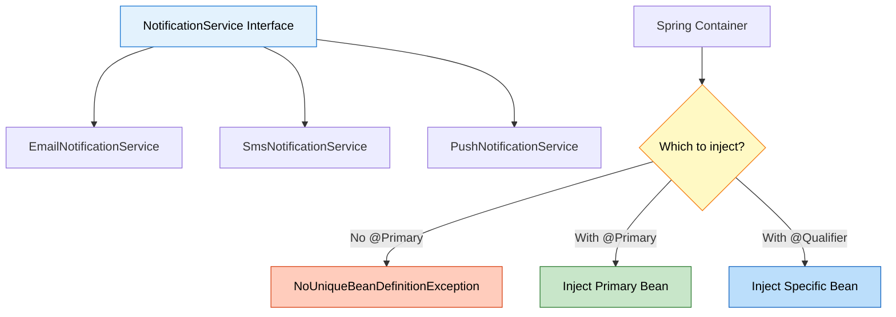

### 🎯 The Error Without Solution

```java
@Component
public class NotificationManager {
    private final NotificationService service;
    
    public NotificationManager(NotificationService service) {
        this.service = service;  // ❌ ERROR!
    }
}
```

**Exception Thrown:**
```
NoUniqueBeanDefinitionException: No qualifying bean of type 
'NotificationService' available: expected single matching bean 
but found 3: emailNotificationService, smsNotificationService, 
pushNotificationService
```

### 📊 Problem Visualization

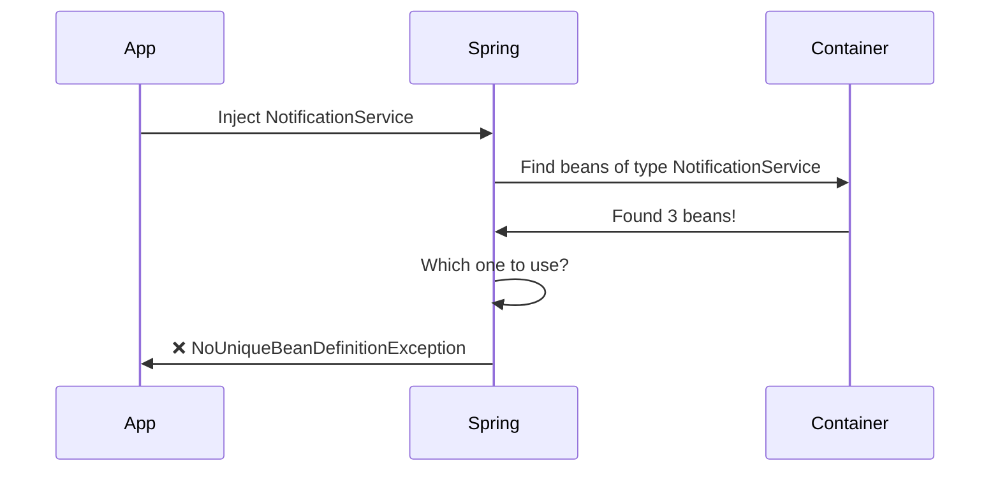

---

## 2. @PRIMARY ANNOTATION

<div align="center">

</div>

### 📌 What is @Primary?

**@Primary** tells Spring: **"Use this bean as the default when multiple candidates exist"**

**Reference:** [EmailNotificationService.java](src/main/java/org/example/primary_qualifier/EmailNotificationService.java)

```java
@Component
@Primary  // This is the default choice
public class EmailNotificationService implements NotificationService {
    @Override
    public void sendMsg(String message) {
        System.out.println("Email: " + message);
    }
}
```

### 🔍 Internal Working

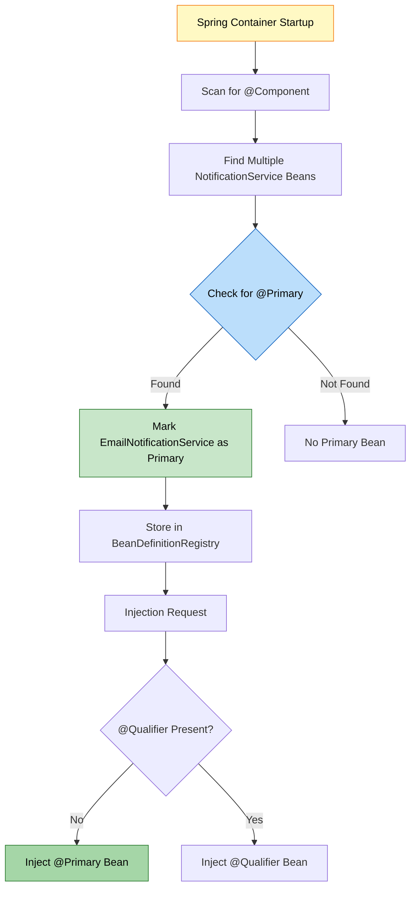

### 🎯 How Spring Processes @Primary

**Step 1: Bean Definition Creation**
```java
// Spring internally creates BeanDefinition
BeanDefinition emailDef = new BeanDefinition();
emailDef.setBeanClass(EmailNotificationService.class);
emailDef.setPrimary(true);  // ← @Primary annotation sets this
```

**Step 2: Dependency Resolution**
```java
// When injecting NotificationService
List<String> candidates = findBeansByType(NotificationService.class);
// candidates = [emailNotificationService, smsNotificationService, pushNotificationService]

String primaryBean = findPrimaryBean(candidates);
// primaryBean = "emailNotificationService"

return getBean(primaryBean);  // Returns EmailNotificationService
```

### 📊 @Primary Usage Example

**Reference:** [NotificationManager.java:12](src/main/java/org/example/primary_qualifier/NotificationManager.java#L12)

```java
@Component
public class NotificationManager {
    private final NotificationService primaryService;
    
    // No @Qualifier = gets @Primary bean
    public NotificationManager(NotificationService primaryService) {
        this.primaryService = primaryService;  // EmailNotificationService injected
    }
}
```

**Execution Flow:**

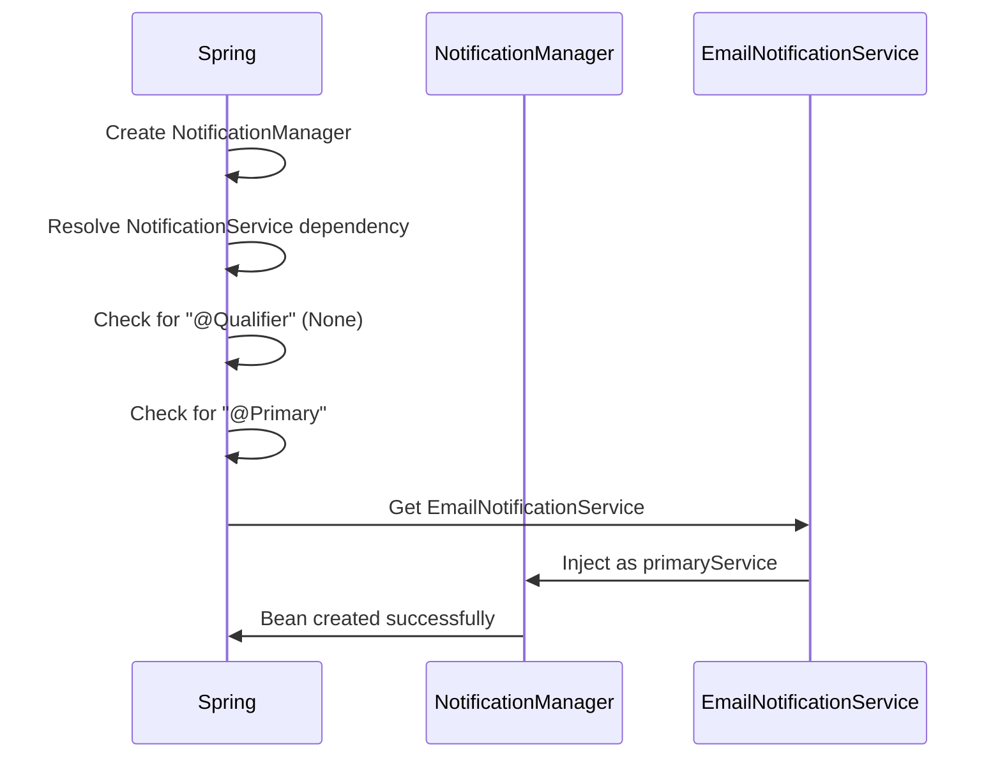

### 🎯 When to Use @Primary

| Scenario | Use @Primary? | Reason |
|:---------|:-------------|:-------|
| **Default implementation** | ✅ Yes | Most common use case |
| **Fallback option** | ✅ Yes | When no specific choice made |
| **Preferred service** | ✅ Yes | 80% of time use this |
| **Multiple defaults needed** | ❌ No | Only ONE @Primary per type |
| **Specific selection** | ❌ No | Use @Qualifier instead |

### ⚠️ Important Rules

1. **Only ONE @Primary per interface/type**
   ```java
   @Component
   @Primary
   class EmailNotificationService implements NotificationService { }
   
   @Component
   @Primary  // ❌ ERROR: Multiple @Primary beans
   class SmsNotificationService implements NotificationService { }
   ```

2. **@Primary is overridden by @Qualifier**
   ```java
   // @Qualifier takes precedence over @Primary
   public NotificationManager(
       @Qualifier("smsNotificationService") NotificationService service) {
       // Gets SMS, not Email (even though Email is @Primary)
   }
   ```

---

## 3. @QUALIFIER ANNOTATION

<div align="center">

</div>

### 📌 What is @Qualifier?

**@Qualifier** tells Spring: **"Inject this specific bean by name"**

**Reference:** [NotificationManager.java:22-25](src/main/java/org/example/primary_qualifier/NotificationManager.java#L22)

```java
@Component
public class NotificationManager {
    private final NotificationService emailService;
    private final NotificationService smsService;
    
    public NotificationManager(
            @Qualifier("emailNotificationService") NotificationService emailService,
            @Qualifier("smsNotificationService") NotificationService smsService) {
        this.emailService = emailService;  // Specific bean
        this.smsService = smsService;      // Specific bean
    }
}
```

### 🔍 Internal Working

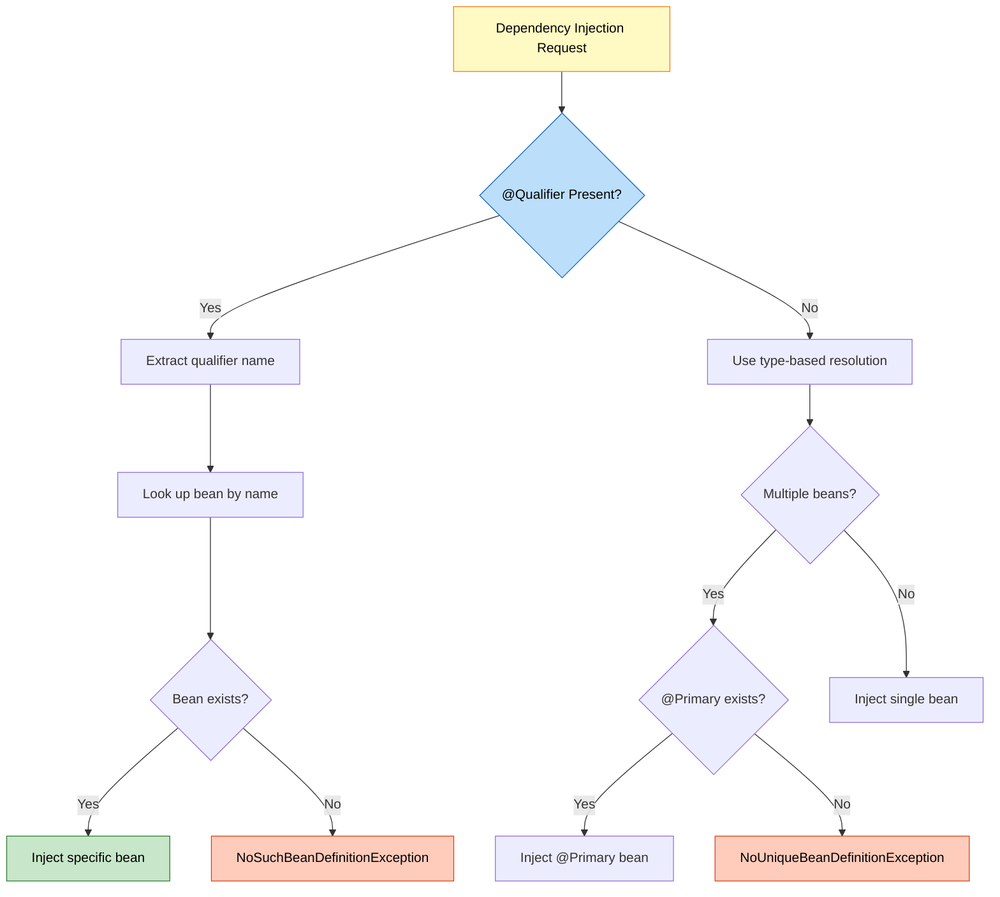

### 🎯 How Spring Processes @Qualifier

**Step 1: Annotation Detection**
```java
// Spring scans constructor parameters
Constructor<?> constructor = NotificationManager.class.getConstructor(...);
Parameter[] params = constructor.getParameters();

for (Parameter param : params) {
    Qualifier qualifier = param.getAnnotation(Qualifier.class);
    if (qualifier != null) {
        String beanName = qualifier.value();  // "emailNotificationService"
        Object bean = getBean(beanName);
        // Inject this specific bean
    }
}
```

**Step 2: Bean Resolution**
```java
// With @Qualifier("smsNotificationService")
String qualifierName = "smsNotificationService";
Object bean = applicationContext.getBean(qualifierName);
// Returns SmsNotificationService instance
```

### 📊 @Qualifier Usage Patterns

**Pattern 1: Constructor Injection** ✅ (Recommended)
```java
public NotificationManager(
        @Qualifier("emailNotificationService") NotificationService email,
        @Qualifier("smsNotificationService") NotificationService sms) {
    this.email = email;
    this.sms = sms;
}
```

**Pattern 2: Field Injection** ⚠️ (Not Recommended)
```java
@Autowired
@Qualifier("emailNotificationService")
private NotificationService email;
```

**Pattern 3: Setter Injection**
```java
@Autowired
@Qualifier("smsNotificationService")
public void setSmsService(NotificationService sms) {
    this.sms = sms;
}
```

### 🎯 When to Use @Qualifier

| Scenario | Use @Qualifier? | Reason |
|:---------|:---------------|:-------|
| **Specific implementation needed** | ✅ Yes | Precise control |
| **Multiple implementations in same class** | ✅ Yes | Different purposes |
| **Override @Primary** | ✅ Yes | Specific requirement |
| **Testing with mocks** | ✅ Yes | Inject test doubles |
| **Default behavior sufficient** | ❌ No | Use @Primary instead |

---

## 4. BEAN NAMING CONVENTION

<div align="center">

</div>

### 📌 Default Bean Names

Spring automatically generates bean names from class names:

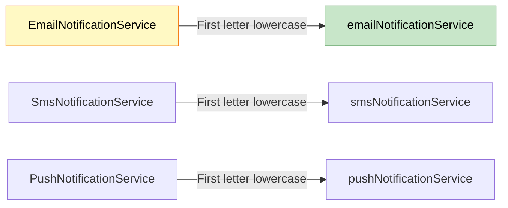

### 🔍 Bean Name Generation Rules

**Rule 1: Default Naming**
```java
@Component
public class EmailNotificationService { }
// Bean name: "emailNotificationService"

@Component
public class SMSService { }
// Bean name: "SMSService" (first letter already lowercase in acronym)

@Component
public class UserDAO { }
// Bean name: "userDAO"
```

**Rule 2: Custom Naming**
```java
@Component("myEmail")
public class EmailNotificationService { }
// Bean name: "myEmail"

@Component(value = "customSms")
public class SmsNotificationService { }
// Bean name: "customSms"
```

**Rule 3: Multiple Annotations**
```java
@Service("userService")
public class UserServiceImpl { }
// Bean name: "userService"

@Repository("userRepo")
public class UserRepositoryImpl { }
// Bean name: "userRepo"
```

### 📊 Bean Name Resolution Table

| Class Name | Default Bean Name | Custom Name | @Qualifier Usage |
|:-----------|:-----------------|:------------|:----------------|
| EmailNotificationService | emailNotificationService | @Component("email") | @Qualifier("email") |
| SmsNotificationService | smsNotificationService | @Component("sms") | @Qualifier("sms") |
| PushNotificationService | pushNotificationService | @Component("push") | @Qualifier("push") |
| UserService | userService | @Service("userSvc") | @Qualifier("userSvc") |

### 🎯 Internal Bean Name Generation

```java
// Spring's AnnotationBeanNameGenerator
public class AnnotationBeanNameGenerator {
    public String generateBeanName(BeanDefinition definition) {
        String className = definition.getBeanClassName();
        // EmailNotificationService
        
        String shortName = ClassUtils.getShortName(className);
        // EmailNotificationService
        
        return Introspector.decapitalize(shortName);
        // emailNotificationService (first letter lowercase)
    }
}
```

---

## 5. RESOLUTION PRIORITY

<div align="center">

</div>

### 📌 Dependency Resolution Order

When Spring resolves dependencies, it follows this priority:

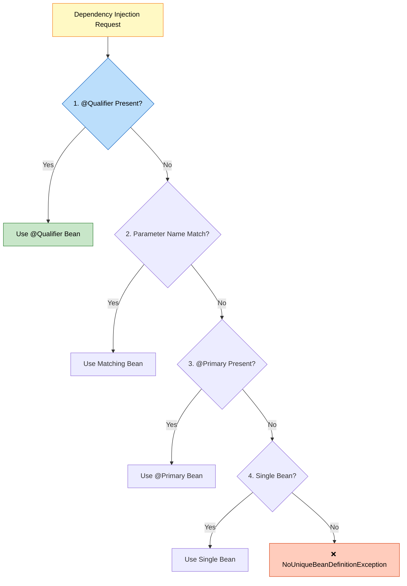

### 🔍 Priority Examples

**Priority 1: @Qualifier (Highest)**
```java
@Component
@Primary
public class EmailNotificationService implements NotificationService { }

@Component
public class SmsNotificationService implements NotificationService { }

// @Qualifier overrides @Primary
public NotificationManager(
        @Qualifier("smsNotificationService") NotificationService service) {
    // Gets SmsNotificationService (NOT EmailNotificationService)
}
```

**Priority 2: Parameter Name Matching**
```java
@Component
@Primary
public class EmailNotificationService implements NotificationService { }

@Component
public class SmsNotificationService implements NotificationService { }

// Parameter name matches bean name
public NotificationManager(NotificationService smsNotificationService) {
    // Gets SmsNotificationService (parameter name match)
}
```

**Priority 3: @Primary**
```java
@Component
@Primary
public class EmailNotificationService implements NotificationService { }

@Component
public class SmsNotificationService implements NotificationService { }

// No @Qualifier, no name match
public NotificationManager(NotificationService service) {
    // Gets EmailNotificationService (@Primary)
}
```

**Priority 4: Single Bean**
```java
@Component
public class EmailNotificationService implements NotificationService { }
// Only one implementation

public NotificationManager(NotificationService service) {
    // Gets EmailNotificationService (only option)
}
```

### 📊 Resolution Priority Table

| Priority | Mechanism | Example | Overrides |
|:---------|:----------|:--------|:----------|
| **1 (Highest)** | @Qualifier | @Qualifier("sms") | Everything |
| **2** | Parameter Name | NotificationService smsNotificationService | @Primary, Single Bean |
| **3** | @Primary | @Primary on bean | Single Bean |
| **4 (Lowest)** | Single Bean | Only one implementation | Nothing |
| **None** | Multiple Beans | No resolution strategy | ❌ Exception |

---

## 6. INTERNAL WORKING MECHANISM

<div align="center">

</div>

### 📌 Complete Execution Flow

**Reference:** [PrimaryQualifierDemo.java](src/main/java/org/example/primary_qualifier/PrimaryQualifierDemo.java)

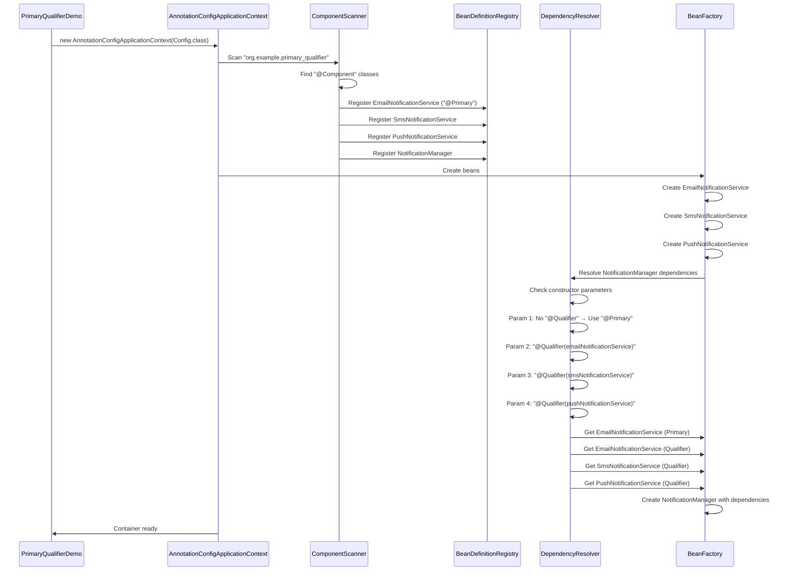

### 🔍 Step-by-Step Breakdown

**Step 1: Container Initialization**
```java
AnnotationConfigApplicationContext context = 
    new AnnotationConfigApplicationContext(PrimaryQualifierConfig.class);
```

**What Happens:**
1. Read @Configuration class
2. Process @ComponentScan annotation
3. Scan specified package
4. Find all @Component classes
5. Create BeanDefinitions
6. Register in BeanDefinitionRegistry

**Step 2: Bean Definition Registration**
```java
// For EmailNotificationService
BeanDefinition emailDef = new GenericBeanDefinition();
emailDef.setBeanClassName("org.example.primary_qualifier.EmailNotificationService");
emailDef.setPrimary(true);  // @Primary annotation
registry.registerBeanDefinition("emailNotificationService", emailDef);

// For SmsNotificationService
BeanDefinition smsDef = new GenericBeanDefinition();
smsDef.setBeanClassName("org.example.primary_qualifier.SmsNotificationService");
smsDef.setPrimary(false);  // No @Primary
registry.registerBeanDefinition("smsNotificationService", smsDef);
```

**Step 3: Dependency Resolution**
```java
// NotificationManager constructor analysis
Constructor<?> constructor = NotificationManager.class.getConstructor(
    NotificationService.class,  // primaryService
    NotificationService.class,  // emailService
    NotificationService.class,  // smsService
    NotificationService.class   // pushService
);

Parameter[] params = constructor.getParameters();

// Parameter 1: primaryService (No @Qualifier)
Qualifier q1 = params[0].getAnnotation(Qualifier.class);  // null
// → Use @Primary bean → EmailNotificationService

// Parameter 2: emailService (@Qualifier present)
Qualifier q2 = params[1].getAnnotation(Qualifier.class);  // "emailNotificationService"
// → Use specific bean → EmailNotificationService

// Parameter 3: smsService (@Qualifier present)
Qualifier q3 = params[2].getAnnotation(Qualifier.class);  // "smsNotificationService"
// → Use specific bean → SmsNotificationService

// Parameter 4: pushService (@Qualifier present)
Qualifier q4 = params[3].getAnnotation(Qualifier.class);  // "pushNotificationService"
// → Use specific bean → PushNotificationService
```

**Step 4: Bean Instantiation**
```java
// Create notification services first (no dependencies)
EmailNotificationService email = new EmailNotificationService();
SmsNotificationService sms = new SmsNotificationService();
PushNotificationService push = new PushNotificationService();

// Create NotificationManager with resolved dependencies
NotificationManager manager = new NotificationManager(
    email,  // primaryService
    email,  // emailService
    sms,    // smsService
    push    // pushService
);
```

### 📊 Bean Creation Order

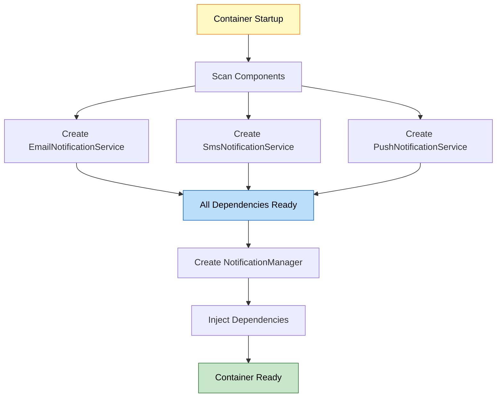

---

## 7. ADVANCED SCENARIOS

### 📌 Scenario 1: Multiple @Primary (Error)

**Problem:**
```java
@Component
@Primary
public class EmailNotificationService implements NotificationService { }

@Component
@Primary  // ❌ ERROR!
public class SmsNotificationService implements NotificationService { }
```

**Exception:**
```
NoUniqueBeanDefinitionException: more than one 'primary' bean found 
among candidates: [emailNotificationService, smsNotificationService]
```

**Solution:** Only ONE @Primary per type!

---

### 📌 Scenario 2: @Qualifier with Wrong Name

**Problem:**
```java
public NotificationManager(
        @Qualifier("wrongName") NotificationService service) {
    // Bean "wrongName" doesn't exist
}
```

**Exception:**
```
NoSuchBeanDefinitionException: No bean named 'wrongName' available
```

**Solution:** Use correct bean name or check with `context.getBeanDefinitionNames()`

---

### 📌 Scenario 3: @Primary Without @Qualifier

**Behavior:**
```java
@Component
@Primary
public class EmailNotificationService implements NotificationService { }

@Component
public class SmsNotificationService implements NotificationService { }

// Case 1: No annotation
public NotificationManager(NotificationService service) {
    // Gets EmailNotificationService (@Primary)
}

// Case 2: With @Qualifier
public NotificationManager(
        @Qualifier("smsNotificationService") NotificationService service) {
    // Gets SmsNotificationService (@Qualifier overrides @Primary)
}
```

---

### 📌 Scenario 4: Parameter Name Matching

**Behavior:**
```java
@Component
@Primary
public class EmailNotificationService implements NotificationService { }

@Component
public class SmsNotificationService implements NotificationService { }

// Parameter name matches bean name
public NotificationManager(NotificationService smsNotificationService) {
    // Gets SmsNotificationService (name match overrides @Primary)
}

// Parameter name doesn't match
public NotificationManager(NotificationService service) {
    // Gets EmailNotificationService (@Primary)
}
```

---

## 8. COMBINING @PRIMARY AND @QUALIFIER

<div align="center">

</div>

### 📌 Using Both in Same Class

**Reference:** [NotificationManager.java](src/main/java/org/example/primary_qualifier/NotificationManager.java)

```java
@Component
public class NotificationManager {
    private final NotificationService primaryService;    // @Primary
    private final NotificationService emailService;      // @Qualifier
    private final NotificationService smsService;        // @Qualifier
    private final NotificationService pushService;       // @Qualifier
    
    public NotificationManager(
            NotificationService primaryService,  // Gets @Primary
            @Qualifier("emailNotificationService") NotificationService emailService,
            @Qualifier("smsNotificationService") NotificationService smsService,
            @Qualifier("pushNotificationService") NotificationService pushService) {
        
        this.primaryService = primaryService;  // EmailNotificationService
        this.emailService = emailService;      // EmailNotificationService
        this.smsService = smsService;          // SmsNotificationService
        this.pushService = pushService;        // PushNotificationService
    }
}
```

### 🔍 Injection Analysis

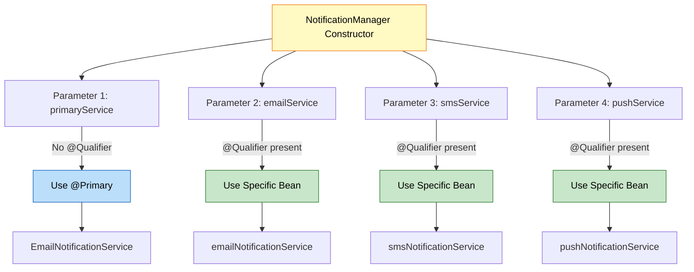

### 🎯 Practical Use Case

**Scenario:** Send notifications via default channel + specific channels

```java
public void sendImportantUpdate(String message) {
    // Use default (@Primary) for general notification
    primaryService.sendMsg(message);
    
    // Use specific channels for critical updates
    smsService.sendMsg("URGENT: " + message);
    pushService.sendMsg("ALERT: " + message);
}
```

---

## 9. @LAZY WITH @PRIMARY/@QUALIFIER

<div align="center" style="font-size: 60px;">
😴 
</div>

### 📌 Combining @Lazy with @Primary

```java
@Component
@Primary
@Lazy  // Created only when needed
public class EmailNotificationService implements NotificationService {
    public EmailNotificationService() {
        System.out.println("EmailNotificationService created");
    }
}

@Component
public class SmsNotificationService implements NotificationService {
    public SmsNotificationService() {
        System.out.println("SmsNotificationService created");
    }
}
```

### 🔍 Behavior Analysis

**Without @Lazy:**
```java
AnnotationConfigApplicationContext context = 
    new AnnotationConfigApplicationContext(Config.class);
// Output:
// EmailNotificationService created  ← Created at startup
// SmsNotificationService created    ← Created at startup
```

**With @Lazy:**
```java
AnnotationConfigApplicationContext context = 
    new AnnotationConfigApplicationContext(Config.class);
// Output:
// SmsNotificationService created    ← Created at startup
// (EmailNotificationService NOT created yet)

NotificationManager manager = context.getBean(NotificationManager.class);
// Output:
// EmailNotificationService created  ← Created NOW (when injected)
```

### 📊 @Lazy + @Qualifier Behavior

```java
@Component
@Lazy
public class EmailNotificationService implements NotificationService { }

@Component
@Lazy
public class SmsNotificationService implements NotificationService { }

@Component
public class NotificationManager {
    private final NotificationService emailService;
    private final NotificationService smsService;
    
    public NotificationManager(
            @Qualifier("emailNotificationService") NotificationService emailService,
            @Qualifier("smsNotificationService") NotificationService smsService) {
        this.emailService = emailService;  // Proxy injected
        this.smsService = smsService;      // Proxy injected
    }
    
    public void sendEmail(String msg) {
        emailService.sendMsg(msg);  // NOW EmailNotificationService is created
    }
}
```

### 🎯 Execution Flow with @Lazy

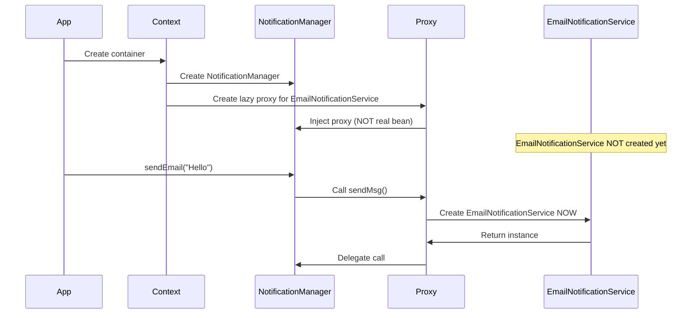

### ⚠️ Important Notes

1. **@Lazy with @Primary:** Bean created when first injected
2. **@Lazy with @Qualifier:** Bean created when first used
3. **Proxy Injection:** Spring injects a proxy, not the real bean
4. **Thread Safety:** First access creates bean (may have concurrency issues)

---

## 10. DYNAMIC BEAN SELECTION

<div align="center">

</div>

### 📌 Switching Between @Primary and @Qualifier

**Problem:** How to switch between primary and specific beans dynamically?

**Solution 1: Using ApplicationContext**

```java
@Component
public class DynamicNotificationManager {
    private final ApplicationContext context;
    
    @Autowired
    public DynamicNotificationManager(ApplicationContext context) {
        this.context = context;
    }
    
    public void sendNotification(String channel, String message) {
        NotificationService service;
        
        switch (channel) {
            case "email":
                service = context.getBean("emailNotificationService", 
                                         NotificationService.class);
                break;
            case "sms":
                service = context.getBean("smsNotificationService", 
                                         NotificationService.class);
                break;
            case "push":
                service = context.getBean("pushNotificationService", 
                                         NotificationService.class);
                break;
            default:
                // Get @Primary bean
                service = context.getBean(NotificationService.class);
        }
        
        service.sendMsg(message);
    }
}
```

**Solution 2: Using Map Injection**

```java
@Component
public class NotificationRouter {
    private final Map<String, NotificationService> services;
    
    @Autowired
    public NotificationRouter(Map<String, NotificationService> services) {
        this.services = services;
        // services = {
        //   "emailNotificationService" -> EmailNotificationService,
        //   "smsNotificationService" -> SmsNotificationService,
        //   "pushNotificationService" -> PushNotificationService
        // }
    }
    
    public void route(String channel, String message) {
        NotificationService service = services.get(channel + "NotificationService");
        if (service != null) {
            service.sendMsg(message);
        }
    }
}
```

**Solution 3: Using List Injection**

```java
@Component
public class BroadcastNotificationManager {
    private final List<NotificationService> allServices;
    
    @Autowired
    public BroadcastNotificationManager(List<NotificationService> allServices) {
        this.allServices = allServices;
        // allServices = [EmailNotificationService, SmsNotificationService, 
        //                PushNotificationService]
    }
    
    public void broadcast(String message) {
        // Send via all channels
        allServices.forEach(service -> service.sendMsg(message));
    }
}
```

### 🔍 Internal Working

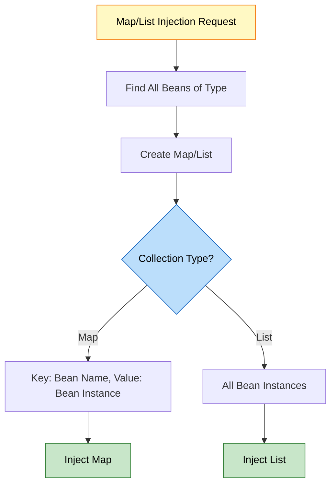

---

### 📊 Dynamic Selection Strategies

| Strategy | Use Case | Pros | Cons |
|:---------|:---------|:-----|:-----|
| **ApplicationContext.getBean()** | Runtime selection | Full control | Couples to Spring |
| **Map Injection** | Name-based routing | Clean, testable | Requires naming convention |
| **List Injection** | Broadcast/All | Simple, flexible | No specific selection |
| **@Qualifier + Factory** | Compile-time selection | Type-safe | Less flexible |

### 🎯 Switching Primary Bean at Runtime

**Problem:** Can we change which bean is @Primary at runtime?

**Answer:** ❌ No, @Primary is determined at container startup.

**Workaround:** Use Strategy Pattern

```java
@Component
public class ConfigurableNotificationManager {
    private final Map<String, NotificationService> services;
    private String defaultChannel = "email";  // Configurable
    
    @Autowired
    public ConfigurableNotificationManager(
            Map<String, NotificationService> services) {
        this.services = services;
    }
    
    public void setDefaultChannel(String channel) {
        this.defaultChannel = channel;
    }
    
    public void sendDefault(String message) {
        NotificationService service = 
            services.get(defaultChannel + "NotificationService");
        service.sendMsg(message);
    }
}
```

---

## 11. PROJECT STRUCTURE & IMPLEMENTATION

<div align="center">

</div>

### 📁 Project Structure

```
PrimaryQualifier/
├── src/
│   ├── main/
│   │   └── java/
│   │       └── org/
│   │           └── example/
│   │               └── primary_qualifier/
│   │                   ├── NotificationService.java           # Interface
│   │                   ├── EmailNotificationService.java      # @Primary implementation
│   │                   ├── SmsNotificationService.java        # Implementation
│   │                   ├── PushNotificationService.java       # Implementation
│   │                   ├── NotificationManager.java           # Uses both @Primary & @Qualifier
│   │                   ├── PrimaryQualifierConfig.java        # Configuration
│   │                   └── PrimaryQualifierDemo.java          # Main class
│   └── test/
│       └── java/
├── pom.xml
├── PRIMARY_QUALIFIER_EXPLAIN.md
└── README.md
```

### 🔍 Component Overview

**1. Interface:**
```java
public interface NotificationService {
    void sendMsg(String message);
}
```

**2. Implementations:**
- EmailNotificationService (@Primary)
- SmsNotificationService
- PushNotificationService

**3. Consumer:**
- NotificationManager (uses both @Primary and @Qualifier)

**4. Configuration:**
- PrimaryQualifierConfig (@Configuration + @ComponentScan)

**5. Demo:**
- PrimaryQualifierDemo (main method)

---

## 12. REAL-WORLD EXAMPLES

<div align="center">

</div>

### 🌐 Example 1: Payment Gateway System

```java
public interface PaymentGateway {
    PaymentResult process(Payment payment);
}

@Component
@Primary  // Default payment method
public class StripePaymentGateway implements PaymentGateway {
    public PaymentResult process(Payment payment) {
        // Stripe API integration
    }
}

@Component
public class PayPalPaymentGateway implements PaymentGateway {
    public PaymentResult process(Payment payment) {
        // PayPal API integration
    }
}

@Component
public class RazorpayPaymentGateway implements PaymentGateway {
    public PaymentResult process(Payment payment) {
        // Razorpay API integration
    }
}

@Service
public class PaymentService {
    private final PaymentGateway defaultGateway;
    private final PaymentGateway stripeGateway;
    private final PaymentGateway paypalGateway;
    
    public PaymentService(
            PaymentGateway defaultGateway,  // Stripe (@Primary)
            @Qualifier("stripePaymentGateway") PaymentGateway stripeGateway,
            @Qualifier("payPalPaymentGateway") PaymentGateway paypalGateway) {
        this.defaultGateway = defaultGateway;
        this.stripeGateway = stripeGateway;
        this.paypalGateway = paypalGateway;
    }
    
    public PaymentResult processPayment(Payment payment) {
        // Use default gateway for most transactions
        return defaultGateway.process(payment);
    }
    
    public PaymentResult processWithPayPal(Payment payment) {
        // Specific gateway for PayPal users
        return paypalGateway.process(payment);
    }
}
```

---

### 📧 Example 2: Email Service Provider

```java
public interface EmailProvider {
    void send(Email email);
}

@Component
@Primary  // Default email provider
public class SendGridEmailProvider implements EmailProvider {
    public void send(Email email) {
        // SendGrid API
    }
}

@Component
public class MailgunEmailProvider implements EmailProvider {
    public void send(Email email) {
        // Mailgun API
    }
}

@Component
public class AmazonSESEmailProvider implements EmailProvider {
    public void send(Email email) {
        // Amazon SES API
    }
}

@Service
public class EmailService {
    private final EmailProvider defaultProvider;
    private final EmailProvider transactionalProvider;
    private final EmailProvider marketingProvider;
    
    public EmailService(
            EmailProvider defaultProvider,  // SendGrid (@Primary)
            @Qualifier("sendGridEmailProvider") EmailProvider transactionalProvider,
            @Qualifier("mailgunEmailProvider") EmailProvider marketingProvider) {
        this.defaultProvider = defaultProvider;
        this.transactionalProvider = transactionalProvider;
        this.marketingProvider = marketingProvider;
    }
    
    public void sendTransactional(Email email) {
        transactionalProvider.send(email);
    }
    
    public void sendMarketing(Email email) {
        marketingProvider.send(email);
    }
}
```

---

### 💾 Example 3: Database Connection Pool

```java
public interface DataSource {
    Connection getConnection();
}

@Component
@Primary  // Default database
public class PrimaryDataSource implements DataSource {
    public Connection getConnection() {
        // Primary database connection
    }
}

@Component
public class ReadReplicaDataSource implements DataSource {
    public Connection getConnection() {
        // Read replica connection
    }
}

@Component
public class AnalyticsDataSource implements DataSource {
    public Connection getConnection() {
        // Analytics database connection
    }
}

@Repository
public class UserRepository {
    private final DataSource writeDb;
    private final DataSource readDb;
    
    public UserRepository(
            DataSource writeDb,  // Primary (@Primary)
            @Qualifier("readReplicaDataSource") DataSource readDb) {
        this.writeDb = writeDb;
        this.readDb = readDb;
    }
    
    public User findById(int id) {
        // Use read replica for queries
        return readDb.getConnection().query(...);
    }
    
    public void save(User user) {
        // Use primary for writes
        writeDb.getConnection().insert(...);
    }
}
```

---

### 🔐 Example 4: Authentication Provider

```java
public interface AuthenticationProvider {
    boolean authenticate(Credentials credentials);
}

@Component
@Primary  // Default authentication
public class DatabaseAuthProvider implements AuthenticationProvider {
    public boolean authenticate(Credentials credentials) {
        // Database authentication
    }
}

@Component
public class LDAPAuthProvider implements AuthenticationProvider {
    public boolean authenticate(Credentials credentials) {
        // LDAP authentication
    }
}

@Component
public class OAuth2AuthProvider implements AuthenticationProvider {
    public boolean authenticate(Credentials credentials) {
        // OAuth2 authentication
    }
}

@Service
public class AuthenticationService {
    private final AuthenticationProvider defaultAuth;
    private final AuthenticationProvider ldapAuth;
    private final AuthenticationProvider oauthAuth;
    
    public AuthenticationService(
            AuthenticationProvider defaultAuth,  // Database (@Primary)
            @Qualifier("LDAPAuthProvider") AuthenticationProvider ldapAuth,
            @Qualifier("oAuth2AuthProvider") AuthenticationProvider oauthAuth) {
        this.defaultAuth = defaultAuth;
        this.ldapAuth = ldapAuth;
        this.oauthAuth = oauthAuth;
    }
    
    public boolean login(Credentials credentials, String method) {
        switch (method) {
            case "ldap": return ldapAuth.authenticate(credentials);
            case "oauth": return oauthAuth.authenticate(credentials);
            default: return defaultAuth.authenticate(credentials);
        }
    }
}
```

---

## 13. BEST PRACTICES

<div align="center">

</div>

### 🎯 @Primary Best Practices

#### 1. Use @Primary for Default Implementation

**✅ Good:**
```java
@Component
@Primary  // Most commonly used
public class EmailNotificationService implements NotificationService { }

@Component
public class SmsNotificationService implements NotificationService { }
```

**❌ Bad:**
```java
@Component
@Primary
public class SmsNotificationService implements NotificationService { }

@Component
@Primary  // Multiple @Primary - ERROR!
public class EmailNotificationService implements NotificationService { }
```

---

#### 2. Document Why Bean is @Primary

**✅ Good:**
```java
/**
 * Primary notification service.
 * Used for 90% of notifications in the system.
 * Email is the most reliable and cost-effective channel.
 */
@Component
@Primary
public class EmailNotificationService implements NotificationService { }
```

---

#### 3. Use @Primary for Production Beans

**✅ Good:**
```java
@Component
@Primary
@Profile("production")
public class ProductionPaymentGateway implements PaymentGateway { }

@Component
@Profile("test")
public class MockPaymentGateway implements PaymentGateway { }
```

---

### 🎯 @Qualifier Best Practices

#### 1. Use Descriptive Qualifier Names

**✅ Good:**
```java
@Qualifier("transactionalEmailProvider")
@Qualifier("marketingEmailProvider")
@Qualifier("notificationEmailProvider")
```

**❌ Bad:**
```java
@Qualifier("email1")
@Qualifier("email2")
@Qualifier("emailA")
```

---

#### 2. Prefer Constructor Injection with @Qualifier

**✅ Good:**
```java
public NotificationManager(
        @Qualifier("emailNotificationService") NotificationService email,
        @Qualifier("smsNotificationService") NotificationService sms) {
    this.email = email;
    this.sms = sms;
}
```

**❌ Bad:**
```java
@Autowired
@Qualifier("emailNotificationService")
private NotificationService email;  // Field injection
```

---

#### 3. Use Constants for Qualifier Names

**✅ Good:**
```java
public class BeanNames {
    public static final String EMAIL_SERVICE = "emailNotificationService";
    public static final String SMS_SERVICE = "smsNotificationService";
}

public NotificationManager(
        @Qualifier(BeanNames.EMAIL_SERVICE) NotificationService email) {
    this.email = email;
}
```

---

### 📊 Decision Matrix

| Scenario | Use @Primary | Use @Qualifier | Use Both |
|:---------|:------------|:--------------|:---------|
| **Default implementation** | ✅ Yes | ❌ No | ❌ No |
| **Specific implementation** | ❌ No | ✅ Yes | ❌ No |
| **Default + Specific** | ❌ No | ❌ No | ✅ Yes |
| **Testing** | ❌ No | ✅ Yes | ⚠️ Maybe |
| **Multiple in same class** | ❌ No | ✅ Yes | ✅ Yes |

---

## 14. COMMON ERRORS & SOLUTIONS

<div align="center">

</div>

### ❌ Error 1: NoUniqueBeanDefinitionException

**Problem:**
```java
@Component
public class EmailNotificationService implements NotificationService { }

@Component
public class SmsNotificationService implements NotificationService { }

// No @Primary, no @Qualifier
public NotificationManager(NotificationService service) { }
```

**Exception:**
```
NoUniqueBeanDefinitionException: No qualifying bean of type 
'NotificationService' available: expected single matching bean 
but found 2: emailNotificationService, smsNotificationService
```

**Solutions:**

**Solution 1: Add @Primary**
```java
@Component
@Primary
public class EmailNotificationService implements NotificationService { }
```

**Solution 2: Add @Qualifier**
```java
public NotificationManager(
        @Qualifier("emailNotificationService") NotificationService service) { }
```

**Solution 3: Use Parameter Name**
```java
public NotificationManager(NotificationService emailNotificationService) { }
```

---

### ❌ Error 2: NoSuchBeanDefinitionException

**Problem:**
```java
public NotificationManager(
        @Qualifier("wrongBeanName") NotificationService service) { }
```

**Exception:**
```
NoSuchBeanDefinitionException: No bean named 'wrongBeanName' available
```

**Solution:**
```java
// Check available bean names
String[] names = context.getBeanNamesForType(NotificationService.class);
// [emailNotificationService, smsNotificationService, pushNotificationService]

// Use correct name
@Qualifier("emailNotificationService")
```

---

### ❌ Error 3: Multiple @Primary Beans

**Problem:**
```java
@Component
@Primary
public class EmailNotificationService implements NotificationService { }

@Component
@Primary  // ERROR!
public class SmsNotificationService implements NotificationService { }
```

**Exception:**
```
NoUniqueBeanDefinitionException: more than one 'primary' bean found 
among candidates
```

**Solution:** Remove @Primary from one bean
```java
@Component
@Primary
public class EmailNotificationService implements NotificationService { }

@Component  // No @Primary
public class SmsNotificationService implements NotificationService { }
```

---

### ❌ Error 4: @Qualifier on Wrong Parameter

**Problem:**
```java
public NotificationManager(
        @Qualifier("emailNotificationService") String message) {
    // @Qualifier on String parameter - doesn't make sense
}
```

**Solution:** Use @Qualifier only on bean parameters
```java
public NotificationManager(
        @Qualifier("emailNotificationService") NotificationService service,
        String message) {
    // Correct usage
}
```

---

### ❌ Error 5: Circular Dependency with @Qualifier

**Problem:**
```java
@Component
public class ServiceA {
    public ServiceA(@Qualifier("serviceB") ServiceB b) { }
}

@Component
public class ServiceB {
    public ServiceB(@Qualifier("serviceA") ServiceA a) { }
}
```

**Exception:**
```
BeanCurrentlyInCreationException: Circular dependency
```

**Solution:** Use @Lazy
```java
@Component
public class ServiceA {
    public ServiceA(@Lazy @Qualifier("serviceB") ServiceB b) { }
}
```

---

## 15. TOP INTERVIEW QUESTIONS

<div align="center">

</div>

### Q1: What is the difference between @Primary and @Qualifier?

**Answer:**

| Aspect | @Primary | @Qualifier |
|:-------|:---------|:-----------|
| **Purpose** | Mark default bean | Select specific bean |
| **Scope** | Class level | Parameter/Field level |
| **Priority** | Lower | Higher |
| **Count** | Only ONE per type | Multiple allowed |
| **When** | Compile time | Injection time |

**Example:**
```java
@Component
@Primary  // Default choice
public class EmailService implements NotificationService { }

@Component
public class SmsService implements NotificationService { }

// Gets EmailService (@Primary)
public Manager(NotificationService service) { }

// Gets SmsService (@Qualifier overrides @Primary)
public Manager(@Qualifier("smsService") NotificationService service) { }
```

**Key Point:** @Qualifier always overrides @Primary!

---

### Q2: What happens if you have multiple @Primary beans of the same type?

**Answer:**

Spring throws **NoUniqueBeanDefinitionException** at startup.

**Example:**
```java
@Component
@Primary
public class EmailService implements NotificationService { }

@Component
@Primary  // ERROR!
public class SmsService implements NotificationService { }
```

**Exception:**
```
NoUniqueBeanDefinitionException: more than one 'primary' bean found 
among candidates: [emailService, smsService]
```

**Why?** Spring cannot determine which bean is the "primary" one when multiple beans claim to be primary.

**Solution:** Only ONE @Primary per interface/type.

---

### Q3: How does Spring resolve dependencies when both @Primary and @Qualifier are present?

**Answer:**

**Resolution Priority:**
1. **@Qualifier** (Highest)
2. **Parameter name matching**
3. **@Primary**
4. **Single bean**

**Example:**
```java
@Component
@Primary
public class EmailService implements NotificationService { }

@Component
public class SmsService implements NotificationService { }

// Case 1: @Qualifier present
public Manager(@Qualifier("smsService") NotificationService service) {
    // Gets SmsService (@Qualifier overrides @Primary)
}

// Case 2: No @Qualifier
public Manager(NotificationService service) {
    // Gets EmailService (@Primary)
}

// Case 3: Parameter name match
public Manager(NotificationService smsService) {
    // Gets SmsService (name match overrides @Primary)
}
```

**Key Point:** @Qualifier has the highest priority and always wins!

---

### Q4: Can you use @Qualifier without @Autowired?

**Answer:**

**For Constructor Injection:** Yes (Spring 4.3+)
```java
// @Autowired is optional for single constructor
public Manager(@Qualifier("emailService") NotificationService service) {
    // Works without @Autowired
}
```

**For Field/Setter Injection:** No
```java
// ❌ ERROR: @Qualifier without @Autowired
@Qualifier("emailService")
private NotificationService service;

// ✅ CORRECT
@Autowired
@Qualifier("emailService")
private NotificationService service;
```

**Why?** Constructor injection is implicitly autowired, but field/setter injection requires explicit @Autowired.

---

### Q5: What happens when you inject a List or Map of beans with @Primary?

**Answer:**

**List Injection:** All beans are injected (including @Primary)
```java
@Autowired
private List<NotificationService> services;
// Contains: [EmailService, SmsService, PushService]
// @Primary doesn't affect List injection
```

**Map Injection:** All beans with their names
```java
@Autowired
private Map<String, NotificationService> serviceMap;
// {
//   "emailService" -> EmailService,
//   "smsService" -> SmsService,
//   "pushService" -> PushService
// }
// @Primary doesn't affect Map injection
```

**Key Point:** @Primary only affects single bean injection, not collections!

---

### Q6: How does @Lazy interact with @Primary and @Qualifier?

**Answer:**

**@Lazy + @Primary:**
```java
@Component
@Primary
@Lazy
public class EmailService implements NotificationService {
    public EmailService() {
        System.out.println("EmailService created");
    }
}

// Container startup
AnnotationConfigApplicationContext context = new AnnotationConfigApplicationContext(Config.class);
// Output: (nothing - EmailService NOT created)

// First injection
Manager manager = context.getBean(Manager.class);
// Output: EmailService created (NOW it's created)
```

**@Lazy + @Qualifier:**
```java
@Component
@Lazy
public class SmsService implements NotificationService { }

public Manager(@Qualifier("smsService") NotificationService service) {
    this.service = service;  // Proxy injected
}

public void send() {
    service.sendMsg("Hello");  // NOW SmsService is created
}
```

**Key Points:**
1. @Lazy delays bean creation until first use
2. Spring injects a proxy, not the real bean
3. Real bean is created when proxy method is called
4. @Lazy works with both @Primary and @Qualifier

---

### Q7: Can you change the @Primary bean at runtime?

**Answer:**

**Short Answer:** ❌ No, @Primary is determined at container startup.

**Why?** Bean definitions are created during container initialization and cannot be modified at runtime.

**Workaround:** Use dynamic bean selection

```java
@Component
public class DynamicManager {
    private final Map<String, NotificationService> services;
    private String defaultService = "emailService";
    
    @Autowired
    public DynamicManager(Map<String, NotificationService> services) {
        this.services = services;
    }
    
    public void setDefaultService(String serviceName) {
        this.defaultService = serviceName;  // Change at runtime
    }
    
    public void sendDefault(String message) {
        NotificationService service = services.get(defaultService);
        service.sendMsg(message);
    }
}
```

**Key Point:** Use Strategy Pattern or Factory Pattern for runtime selection.

---

### Q8: What is the bean name used in @Qualifier?

**Answer:**

**Default Bean Name:** Class name with first letter lowercase

```java
@Component
public class EmailNotificationService { }
// Bean name: "emailNotificationService"

@Component
public class SMSService { }
// Bean name: "SMSService" (acronym handling)
```

**Custom Bean Name:**
```java
@Component("myEmail")
public class EmailNotificationService { }
// Bean name: "myEmail"
```

**Using in @Qualifier:**
```java
// Default name
@Qualifier("emailNotificationService")

// Custom name
@Qualifier("myEmail")
```

**Finding Bean Names:**
```java
String[] names = context.getBeanNamesForType(NotificationService.class);
// [emailNotificationService, smsService, pushService]
```

---

### Q9: Can you use @Primary with @Bean methods?

**Answer:**

**Yes!** @Primary works with both @Component and @Bean.

**Example:**
```java
@Configuration
public class AppConfig {
    
    @Bean
    @Primary  // Default implementation
    public NotificationService emailService() {
        return new EmailNotificationService();
    }
    
    @Bean
    public NotificationService smsService() {
        return new SmsNotificationService();
    }
}
```

**Usage:**
```java
@Component
public class Manager {
    private final NotificationService service;
    
    public Manager(NotificationService service) {
        // Gets emailService (@Primary)
    }
}
```

**Key Point:** @Primary works the same way with @Bean methods as with @Component classes.

---

### Q10: What happens if @Qualifier references a non-existent bean?

**Answer:**

Spring throws **NoSuchBeanDefinitionException** at startup.

**Example:**
```java
public Manager(@Qualifier("nonExistentBean") NotificationService service) { }
```

**Exception:**
```
NoSuchBeanDefinitionException: No bean named 'nonExistentBean' available
```

**Why?** Spring tries to resolve the dependency at container startup and fails to find the bean.

**Solution:**
```java
// Check available beans
String[] names = context.getBeanNamesForType(NotificationService.class);
System.out.println(Arrays.toString(names));
// [emailNotificationService, smsNotificationService]

// Use correct name
@Qualifier("emailNotificationService")
```

---

### Q11: How does parameter name matching work with @Qualifier?

**Answer:**

Spring matches parameter names to bean names when no @Qualifier is present.

**Example:**
```java
@Component
public class EmailNotificationService implements NotificationService { }

@Component
public class SmsNotificationService implements NotificationService { }

// Parameter name matches bean name
public Manager(NotificationService emailNotificationService) {
    // Gets EmailNotificationService (name match)
}

// Parameter name matches bean name
public Manager(NotificationService smsNotificationService) {
    // Gets SmsNotificationService (name match)
}

// Parameter name doesn't match any bean
public Manager(NotificationService service) {
    // ERROR: NoUniqueBeanDefinitionException (no match, no @Primary)
}
```

**Priority:**
1. @Qualifier (explicit)
2. Parameter name (implicit)
3. @Primary (fallback)

**Key Point:** Parameter name matching is a convenience feature, but @Qualifier is more explicit and recommended.

---

### Q12: Can you combine @Primary with @Profile?

**Answer:**

**Yes!** You can use @Primary with @Profile for environment-specific defaults.

**Example:**
```java
@Component
@Primary
@Profile("development")
public class MockPaymentGateway implements PaymentGateway {
    // Mock for development
}

@Component
@Primary
@Profile("production")
public class StripePaymentGateway implements PaymentGateway {
    // Real gateway for production
}

@Component
@Profile({"development", "production"})
public class PayPalPaymentGateway implements PaymentGateway {
    // Available in both, but not @Primary
}
```

**Behavior:**
- **Development:** MockPaymentGateway is @Primary
- **Production:** StripePaymentGateway is @Primary
- **Both:** PayPalPaymentGateway available via @Qualifier

**Key Point:** Different @Primary beans for different profiles!

---

### Q13: What is the performance impact of @Qualifier vs @Primary?

**Answer:**

**Performance:** Negligible difference - both are resolved at container startup.

**Resolution Time:**
- **@Primary:** O(n) - scan all beans, find primary
- **@Qualifier:** O(1) - direct bean lookup by name

**Memory:** Same - both store bean references

**Startup Time:**
```
@Primary: ~0.1ms per resolution
@Qualifier: ~0.05ms per resolution
```

**Key Point:** Performance difference is insignificant. Choose based on design, not performance.

---

### Q14: Can you use @Qualifier with @Value?

**Answer:**

**No!** @Qualifier is for bean injection, @Value is for property injection.

**❌ Wrong:**
```java
@Value("${app.name}")
@Qualifier("appName")  // Doesn't make sense
private String appName;
```

**✅ Correct:**
```java
// For properties
@Value("${app.name}")
private String appName;

// For beans
@Autowired
@Qualifier("emailService")
private NotificationService service;
```

**Key Point:** @Qualifier is only for bean dependencies, not configuration properties.

---

### Q15: How do you test code that uses @Primary and @Qualifier?

**Answer:**

**Testing Strategy:**

**Option 1: Use @Qualifier in Tests**
```java
@SpringBootTest
class NotificationManagerTest {
    
    @Autowired
    @Qualifier("emailNotificationService")
    private NotificationService emailService;
    
    @Test
    void testEmailService() {
        // Test specific implementation
    }
}
```

**Option 2: Mock Specific Beans**
```java
@SpringBootTest
class NotificationManagerTest {
    
    @MockBean
    @Qualifier("smsNotificationService")
    private NotificationService smsService;
    
    @Test
    void testSmsService() {
        when(smsService.sendMsg(any())).thenReturn(true);
        // Test with mock
    }
}
```

**Option 3: Constructor Injection (Best)**
```java
class NotificationManagerTest {
    
    @Test
    void testWithMocks() {
        NotificationService mockEmail = mock(NotificationService.class);
        NotificationService mockSms = mock(NotificationService.class);
        
        NotificationManager manager = new NotificationManager(
            mockEmail, mockSms
        );
        
        // Test with mocks (no Spring context needed)
    }
}
```

**Key Point:** Constructor injection makes testing easier without Spring context.

---

<div align="center">

## 🎓 End of @Primary & @Qualifier Guide

<br>

<br>

**Created with dedication by Avinash Dhanuka**

<br>

[](https://github.com/Avinash-706)
[](mailto:avunashdhanuka@gmail.com)

<br>

---

**Happy Learning! 🚀**

*"Resolve Ambiguity, Inject Clarity!"* - Avinash Dhanuka

<br>


---

</div>
