# ☕ Spring Framework: Complete Configuration Guide - Day 09

<div align="center">


</div>

<hr style="border: 1px solid rgb(98, 117, 187)">

<div align="center">
<table>
<tr>
<td align="center">
<br />

<h3>© 2026 Avinash Dhanuka</h3>
<p>Complete Spring Configuration Mastery</p>
<p><em>From XML to Annotations - The Complete Journey</em></p>

<a href="https://github.com/Avinash-706" target="_blank">

</a>
<br />
<a href="https://mail.google.com/mail/?view=cm&fs=1&to=avunashdhanuka@gmail.com&su=Spring%20Configuration%20Query&body=☕%20Hello%20Avinash,%0D%0A%0D%0AMy%20name%20is%20[Your%20Name]%20and%20I%20have%20a%20doubt%20regarding%20Spring%20Configuration.%0D%0A%0D%0A🔹%20Topic:%20[XML/Annotations/DI]%0D%0A%0D%0AThank%20you!" target="_blank">

</a>
<br />
<br />
</td>
</tr>
</table>
</div>

> **Learning Path:** This repository contains three comprehensive projects demonstrating Spring Framework configuration approaches - from traditional XML to modern Annotation-based configuration, including advanced dependency injection patterns.

---

## 📑 Table of Contents

1. [Overview](#overview)
2. [Projects Summary](#projects-summary)
3. [Configuration Evolution](#configuration-evolution)
4. [Project 1: XML-Based Configuration](#project-1-xml-based-configuration)
5. [Project 2: Annotation-Based Configuration](#project-2-annotation-based-configuration)
6. [Project 3: @Primary & @Qualifier](#project-3-primary--qualifier)
7. [Key Concepts Learned](#key-concepts-learned)
8. [Configuration Comparison](#configuration-comparison)
9. [When to Use What](#when-to-use-what)
10. [Learning Path](#learning-path)
11. [Quick Reference](#quick-reference)
12. [Running the Projects](#running-the-projects)

---

## OVERVIEW

<div align="center">

</div>

This repository demonstrates the complete evolution of Spring Framework configuration approaches, from traditional XML-based configuration to modern annotation-based configuration. Each project builds upon the previous one, introducing new concepts and best practices.

### 🎯 Learning Objectives

- ✅ Understand Spring IoC Container and Dependency Injection
- ✅ Master XML-based configuration (legacy approach)
- ✅ Master Annotation-based configuration (modern approach)
- ✅ Learn dependency resolution with @Primary and @Qualifier
- ✅ Understand bean scopes and lifecycle
- ✅ Apply best practices for Spring configuration

### 📊 Repository Structure

```
day09/
├── XML_BasedConfiguration/          # Project 1: Traditional XML approach
│   ├── src/
│   │   └── main/
│   │       ├── java/
│   │       │   └── org/example/
│   │       │       ├── services/
│   │       │       │   ├── EmailService.java
│   │       │       │   ├── MessageService.java
│   │       │       │   └── NotificationService.java
│   │       │       └── App.java
│   │       └── resources/
│   │           └── bean.xml         # XML configuration file
│   ├── pom.xml
│   └── README.md                    # Detailed documentation
│
├── AnnotationBased/                 # Project 2: Modern annotation approach
│   ├── src/
│   │   └── main/
│   │       ├── java/
│   │       │   └── org/example/
│   │       │       ├── services/
│   │       │       │   ├── AppConfig.java
│   │       │       │   ├── EmailService.java
│   │       │       │   ├── MessageService.java
│   │       │       │   └── SetterInjectionService.java
│   │       │       ├── bean_scope/
│   │       │       │   ├── BeanScopeConfig.java
│   │       │       │   ├── SingletonBean.java
│   │       │       │   └── PrototypeBean.java
│   │       │       └── App.java
│   │       └── resources/
│   ├── pom.xml
│   ├── EXPLAIN.md
│   └── README.md                    # Detailed documentation
│
├── PrimaryQualifier/                # Project 3: Advanced DI patterns
│   ├── src/
│   │   └── main/
│   │       └── java/
│   │           └── org/example/
│   │               └── primary_qualifier/
│   │                   ├── NotificationService.java
│   │                   ├── EmailNotificationService.java
│   │                   ├── SmsNotificationService.java
│   │                   ├── PushNotificationService.java
│   │                   ├── NotificationManager.java
│   │                   ├── PrimaryQualifierConfig.java
│   │                   └── PrimaryQualifierDemo.java
│   ├── pom.xml
│   ├── PRIMARY_QUALIFIER_EXPLAIN.md
│   └── README.md                    # Detailed documentation
│
├── favicon.png                      # Project logo
└── README.md                        # This file
```

---

## PROJECTS SUMMARY

<div align="center">

</div>

> **📝 Organized Learning by:** Avinash Dhanuka | © 2026

### 📦 Project Overview Table

| Project | Configuration Type | Key Concepts | Complexity | Status |
|:--------|:------------------|:-------------|:-----------|:-------|
| **XML_BasedConfiguration** | XML | Bean definition, DI, Scopes | ⭐⭐ Basic | ✅ Complete |
| **AnnotationBased** | Annotations | @Component, @Autowired, @Configuration | ⭐⭐⭐ Intermediate | ✅ Complete |
| **PrimaryQualifier** | Annotations | @Primary, @Qualifier, Ambiguity resolution | ⭐⭐⭐⭐ Advanced | ✅ Complete |

### 🎯 Configuration Relationships

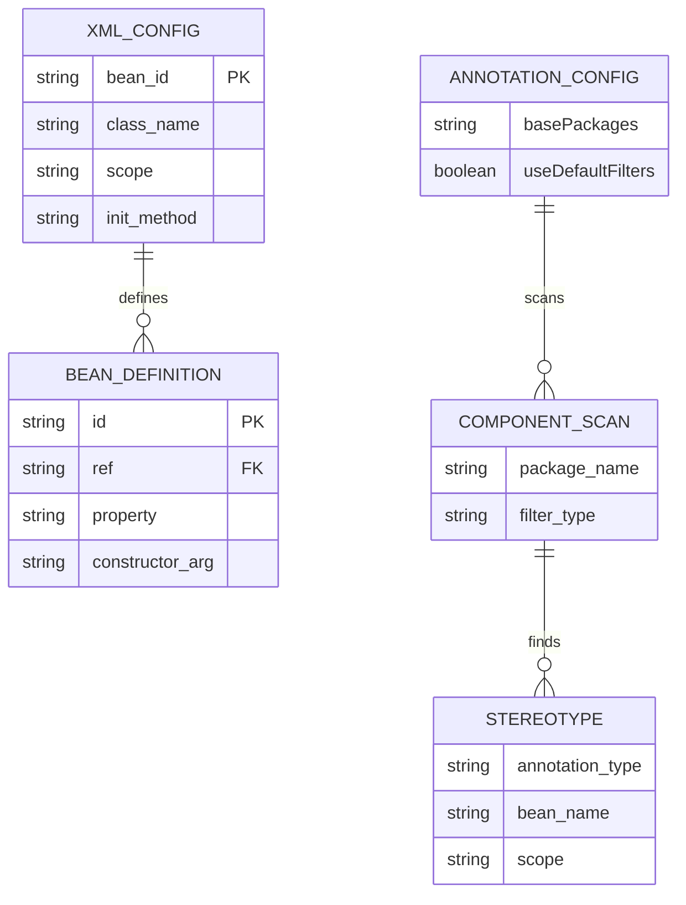

---

## CONFIGURATION EVOLUTION

<div align="center">

</div>

### 📈 Spring Configuration Timeline

```mermaid
graph LR
    A[Spring 1.0<br/>2004] -->|XML Only| B[Spring 2.5<br/>2007]
    B -->|"@Component"| C[Spring 3.0<br/>2009]
    C -->|Java Config| D[Spring 4.0<br/>2013]
    D -->|"@Primary/@Qualifier"| E[Spring 5.0<br/>2017]
    E -->|Reactive| F[Spring 6.0<br/>2022]
    F -->|Modern| G[Spring 7.0<br/>2024]
    
    style A fill:#ffccbc,stroke:#d84315,color:#000
    style B fill:#fff9c4,stroke:#f57f17,color:#000
    style C fill:#c8e6c9,stroke:#2e7d32,color:#000
    style D fill:#bbdefb,stroke:#1565c0,color:#000
    style E fill:#f3e5f5,stroke:#6a1b9a,color:#000
    style F fill:#e1bee7,stroke:#7b1fa2,color:#000
    style G fill:#a5d6a7,stroke:#2e7d32,color:#000
```

### 🔄 Configuration Approaches

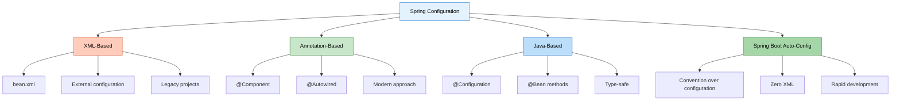

---

## PROJECT 1: XML-BASED CONFIGURATION

<div align="center">

</div>

> **📝 Traditional Approach by:** Avinash Dhanuka | © 2026

### 📌 Overview

Traditional Spring configuration using XML files. This approach was the standard before Spring 2.5 and is still used in legacy applications.

**📂 Location:** [`XML_BasedConfiguration/`](XML_BasedConfiguration/)

**📖 Full Documentation:** [XML_BasedConfiguration/README.md](XML_BasedConfiguration/README.md)

### 🎯 Key Concepts

- **Bean Definition in XML**
- **Constructor Injection**
- **Setter Injection**
- **Bean Scopes** (Singleton, Prototype)
- **Lifecycle Callbacks**
- **ApplicationContext**

### 📊 XML Configuration Structure

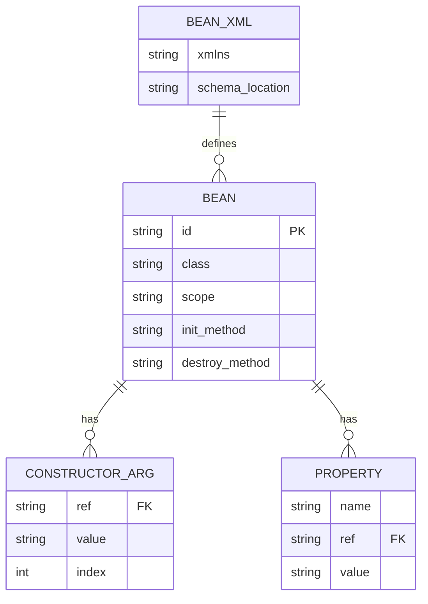

### 📝 Configuration Example

**File:** [`XML_BasedConfiguration/src/main/resources/bean.xml`](XML_BasedConfiguration/src/main/resources/bean.xml)

```xml
<beans>
    <!-- Bean Definition -->
    <bean id="emailService" class="org.example.services.EmailService"/>
    
    <!-- Constructor Injection -->
    <bean id="messageService" class="org.example.services.MessageService">
        <constructor-arg ref="emailService"/>
    </bean>
    
    <!-- Setter Injection -->
    <bean id="notificationService" class="org.example.services.NotificationService">
        <property name="emailService" ref="emailService"/>
    </bean>
    
    <!-- Bean Scopes -->
    <bean id="singletonBean" class="..." scope="singleton"/>
    <bean id="prototypeBean" class="..." scope="prototype"/>
</beans>
```

### 🔍 What You'll Learn

1. **XML Bean Configuration**
   - How to define beans in XML
   - Bean naming and referencing
   - External configuration management

2. **Dependency Injection**
   - Constructor-based injection
   - Setter-based injection
   - When to use each approach

3. **Bean Scopes**
   - Singleton scope (default)
   - Prototype scope
   - Scope behavior and lifecycle

4. **ApplicationContext**
   - ClassPathXmlApplicationContext
   - Loading XML configuration
   - Bean retrieval and usage

### 📊 Pros & Cons

| Pros ✅ | Cons ❌ |
|:--------|:--------|
| Clear separation of config and code | Verbose and repetitive |
| Easy to modify without recompilation | No compile-time checking |
| Good for external configuration | Difficult to refactor |
| Works with any Java class | IDE support limited |

### 🎓 Key Takeaways

- XML configuration provides **external configuration**
- Suitable for **legacy applications**
- Good for **third-party library integration**
- **Not recommended** for new projects

---

## PROJECT 2: ANNOTATION-BASED CONFIGURATION

<div align="center">

</div>

> **📝 Modern Approach by:** Avinash Dhanuka | © 2026

### 📌 Overview

Modern Spring configuration using Java annotations. This is the **recommended approach** for new Spring applications.

**📂 Location:** [`AnnotationBased/`](AnnotationBased/)

**📖 Full Documentation:** [AnnotationBased/README.md](AnnotationBased/README.md)

**📄 Simple Explanation:** [AnnotationBased/EXPLAIN.md](AnnotationBased/EXPLAIN.md)

### 🎯 Key Concepts

- **@Configuration & @ComponentScan**
- **Stereotype Annotations** (@Component, @Service, @Repository)
- **@Autowired** (Constructor, Setter, Field injection)
- **@Bean Methods**
- **Bean Lifecycle** (@PostConstruct, @PreDestroy)
- **Advanced Annotations** (@Lazy, @DependsOn, @Profile)

### 📊 Annotation Configuration Structure

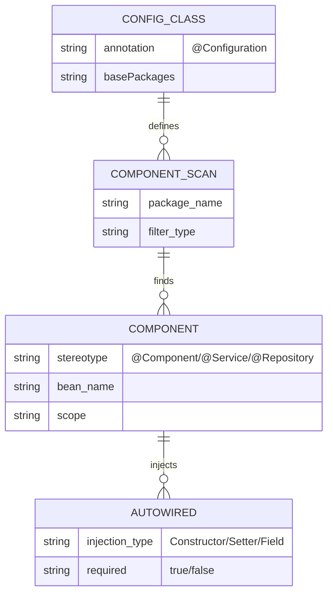

### 📝 Configuration Example

**File:** [`AnnotationBased/src/main/java/org/example/services/AppConfig.java`](AnnotationBased/src/main/java/org/example/services/AppConfig.java)

```java
@Configuration
@ComponentScan(basePackages = "org.example.services")
public class AppConfig {
    // Spring automatically finds @Component classes
}
```

**Service Class:**

```java
@Component
public class EmailService {
    public void send(String message) {
        System.out.println("Email: " + message);
    }
}

@Component
public class MessageService {
    private final EmailService emailService;
    
    // Constructor injection (no @Autowired needed for single constructor)
    public MessageService(EmailService emailService) {
        this.emailService = emailService;
    }
}
```

### 🔍 What You'll Learn

1. **Configuration Annotations**
   - @Configuration for config classes
   - @ComponentScan for package scanning
   - AnnotationConfigApplicationContext

2. **Stereotype Annotations**
   - @Component (generic)
   - @Service (business layer)
   - @Repository (data layer)
   - @Controller (presentation layer)

3. **Dependency Injection**
   - Constructor injection (recommended)
   - Setter injection
   - Field injection (not recommended)
   - @Autowired behavior

4. **Bean Lifecycle**
   - @PostConstruct for initialization
   - @PreDestroy for cleanup
   - InitializingBean & DisposableBean interfaces

5. **Advanced Features**
   - @Lazy for lazy initialization
   - @DependsOn for bean ordering
   - @Profile for environment-specific beans
   - @Conditional for conditional bean creation

### 📊 Pros & Cons

| Pros ✅ | Cons ❌ |
|:--------|:--------|
| Type-safe configuration | Configuration in code |
| Compile-time checking | Requires recompilation |
| Better IDE support | Learning curve for annotations |
| Less verbose | Tight coupling to Spring |
| Refactoring-friendly | Harder to externalize |

### 🎓 Key Takeaways

- Annotation-based config is **modern and recommended**
- **Constructor injection** is the best practice
- Use **@Component** for auto-detection
- **@Configuration** classes for complex setup
- Provides **type safety** and **IDE support**

---

## PROJECT 3: @PRIMARY & @QUALIFIER

<div align="center">

</div>

> **📝 Advanced DI Patterns by:** Avinash Dhanuka | © 2026

### 📌 Overview

Advanced dependency injection patterns for resolving ambiguity when multiple beans of the same type exist.

**📂 Location:** [`PrimaryQualifier/`](PrimaryQualifier/)

**📖 Full Documentation:** [PrimaryQualifier/README.md](PrimaryQualifier/README.md)

**📄 Simple Explanation:** [PrimaryQualifier/PRIMARY_QUALIFIER_EXPLAIN.md](PrimaryQualifier/PRIMARY_QUALIFIER_EXPLAIN.md)

### 🎯 Key Concepts

- **The Ambiguity Problem**
- **@Primary** for default bean selection
- **@Qualifier** for specific bean selection
- **Bean Naming Convention**
- **Resolution Priority**
- **Dynamic Bean Selection**

### 📊 Primary & Qualifier Structure

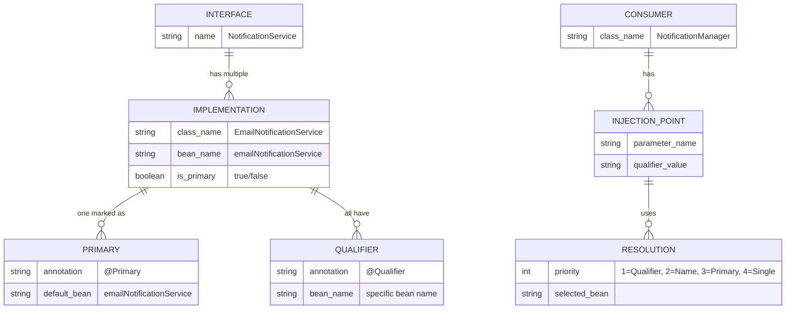

### 📝 Configuration Example

**Interface:**

```java
public interface NotificationService {
    void sendMsg(String message);
}
```

**Implementations:**

```java
@Component
@Primary  // Default choice
public class EmailNotificationService implements NotificationService {
    public void sendMsg(String message) {
        System.out.println("Email: " + message);
    }
}

@Component
public class SmsNotificationService implements NotificationService {
    public void sendMsg(String message) {
        System.out.println("SMS: " + message);
    }
}

@Component
public class PushNotificationService implements NotificationService {
    public void sendMsg(String message) {
        System.out.println("Push: " + message);
    }
}
```

**Usage:**

```java
@Component
public class NotificationManager {
    private final NotificationService primaryService;
    private final NotificationService emailService;
    private final NotificationService smsService;
    
    public NotificationManager(
            NotificationService primaryService,  // Gets @Primary (Email)
            @Qualifier("emailNotificationService") NotificationService emailService,
            @Qualifier("smsNotificationService") NotificationService smsService) {
        this.primaryService = primaryService;
        this.emailService = emailService;
        this.smsService = smsService;
    }
}
```

### 🔍 What You'll Learn

1. **The Problem**
   - NoUniqueBeanDefinitionException
   - Multiple bean candidates
   - Ambiguity resolution

2. **@Primary Annotation**
   - Marking default bean
   - When to use @Primary
   - Only ONE @Primary per type

3. **@Qualifier Annotation**
   - Selecting specific beans
   - Bean naming convention
   - Using with constructor injection

4. **Resolution Priority**
   - @Qualifier (highest)
   - Parameter name matching
   - @Primary (fallback)
   - Single bean (last resort)

5. **Advanced Scenarios**
   - Combining @Primary and @Qualifier
   - @Lazy with @Primary/@Qualifier
   - Dynamic bean selection
   - Map/List injection

### 📊 Resolution Priority

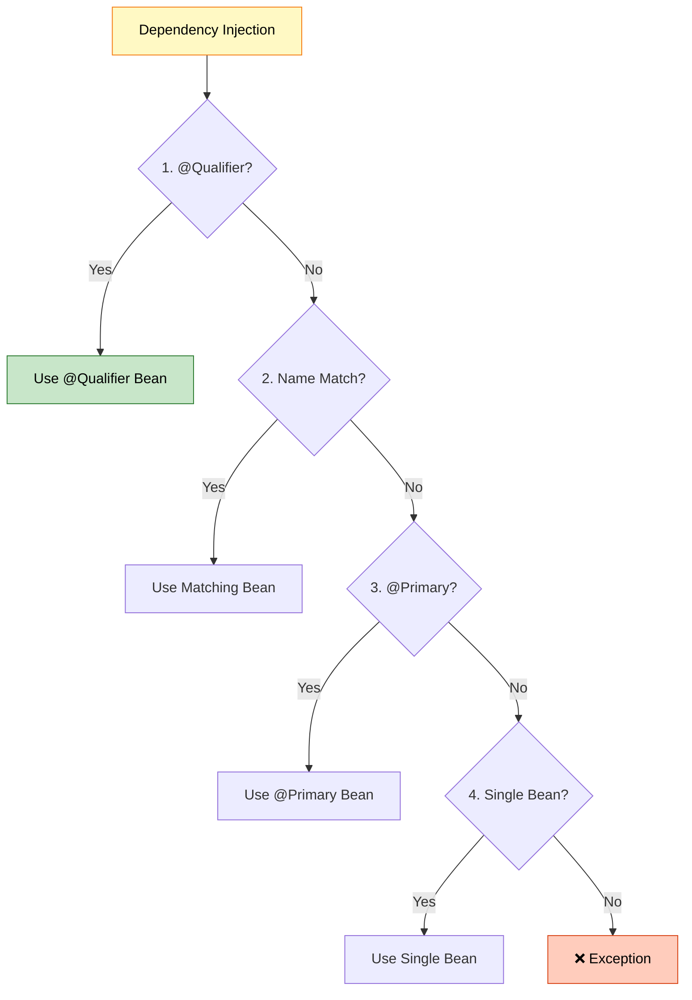

### 🎓 Key Takeaways

- Use **@Primary** for default implementation
- Use **@Qualifier** for specific selection
- **@Qualifier overrides @Primary**
- Only **ONE @Primary** per type allowed
- Bean names are **class name with lowercase first letter**

---

## KEY CONCEPTS LEARNED

<div align="center">

</div>

> **📝 Complete Learning Journey by:** Avinash Dhanuka | © 2026

### 🧠 Day 09 Complete Learning Mindmap

```mermaid
mindmap
  root((Day 09: Spring Configuration))
    XML-Based Configuration
      Bean Definition
        bean id and class
        scope attribute
        init and destroy methods
      Dependency Injection
        Constructor Injection
          constructor-arg tag
          ref attribute
          index attribute
        Setter Injection
          property tag
          name attribute
          ref or value
      Bean Scopes
        Singleton default
        Prototype on demand
        Request web only
        Session web only
      ApplicationContext
        ClassPathXmlApplicationContext
        Load XML files
        getBean method
      Pros and Cons
        External configuration
        No compile-time checking
        Verbose XML
        Legacy approach
    Annotation-Based Configuration
      Configuration Annotations
        "@Configuration" class
        "@ComponentScan" packages
        AnnotationConfigApplicationContext
      Stereotype Annotations
        "@Component" generic
        "@Service" business layer
        "@Repository" data layer
        "@Controller" web layer
      Dependency Injection
        Constructor Injection
          Recommended approach
          Immutable final fields
          No "@Autowired" for single constructor
        Setter Injection
          Optional dependencies
          Mutable fields
          Requires "@Autowired"
        Field Injection
          Not recommended
          Hard to test
          Uses reflection
      Bean Lifecycle
        "@PostConstruct" initialization
        "@PreDestroy" cleanup
        InitializingBean interface
        DisposableBean interface
      Advanced Annotations
        "@Lazy" lazy initialization
        "@DependsOn" bean ordering
        "@Profile" environment-specific
        "@Conditional" conditional beans
        "@Value" property injection
      Pros and Cons
        Type-safe configuration
        Compile-time checking
        Better IDE support
        Modern recommended
    Primary and Qualifier
      The Problem
        Multiple bean candidates
        NoUniqueBeanDefinitionException
        Ambiguity resolution needed
      "@Primary" Annotation
        Default bean selection
        Only ONE per type
        Fallback behavior
        Most common implementation
      "@Qualifier" Annotation
        Specific bean selection
        Bean name matching
        Multiple allowed
        Overrides "@Primary"
      Bean Naming
        Default lowercase first letter
        Custom names with value
        EmailNotificationService becomes emailNotificationService
      Resolution Priority
        1 "@Qualifier" highest
        2 Parameter name match
        3 "@Primary" fallback
        4 Single bean last resort
        Exception if ambiguous
      Advanced Patterns
        Combining "@Primary" and "@Qualifier"
        "@Lazy" with "@Primary"/"@Qualifier"
        Dynamic bean selection
        Map and List injection
    Core Spring Concepts
      Inversion of Control
        Framework controls objects
        Not application
        Dependency management
      Dependency Injection
        Dependencies provided
        Not created by object
        Constructor preferred
      Bean Scopes
        Singleton one per container
        Prototype new per request
        Request web per HTTP request
        Session web per HTTP session
      Bean Lifecycle
        Instantiation
        Dependency Injection
        "@PostConstruct"
        Bean Ready
        "@PreDestroy"
        Destroyed
    Best Practices
      Configuration Choice
        Use Annotations for new projects
        Keep XML for legacy
        Type safety important
      Injection Type
        Constructor injection recommended
        Immutable final fields
        Easy to test
        Avoid field injection
      Bean Management
        Singleton for stateless
        Prototype for stateful
        Lazy for expensive beans
      Ambiguity Resolution
        "@Primary" for defaults
        "@Qualifier" for specific
        Clear naming conventions
      Code Organization
        Separate config classes
        Package by feature
        Meaningful bean names
```

### 🎯 Core Spring Concepts

#### 1. Inversion of Control (IoC)

**Definition:** Framework controls object creation and lifecycle, not the application.

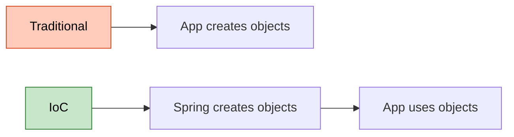

#### 2. Dependency Injection (DI)

**Definition:** Dependencies are provided to objects rather than objects creating them.

**Types:**
- **Constructor Injection** ✅ (Recommended)
- **Setter Injection** ⚠️ (Optional dependencies)
- **Field Injection** ❌ (Not recommended)

#### 3. Bean Scopes

| Scope | Instances | Lifecycle | Use Case |
|:------|:----------|:----------|:---------|
| **Singleton** | 1 per container | Container lifetime | Stateless services |
| **Prototype** | New per request | Until GC | Stateful objects |
| **Request** | 1 per HTTP request | Request lifetime | Web - Form data |
| **Session** | 1 per HTTP session | Session lifetime | Web - User data |

#### 4. Bean Lifecycle

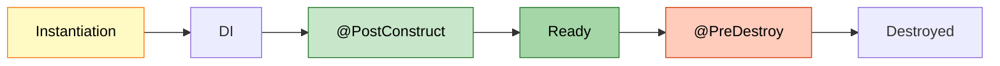

---

## WHAT I LEARNED

<div align="center">

</div>

> **📝 Personal Learning Journey by:** Avinash Dhanuka | © 2026

### 🎓 Key Takeaways from Day 09

1. **Configuration Evolution Matters**
   - XML was the original approach (Spring 1.0 - 2004)
   - Annotations introduced in Spring 2.5 (2007)
   - Modern applications prefer annotation-based
   - Each approach has its place and purpose

2. **Dependency Injection Best Practices**
   - Constructor injection is the gold standard
   - Provides immutability with final fields
   - Makes testing easier (no reflection needed)
   - Setter injection for optional dependencies only
   - Avoid field injection (hard to test, breaks encapsulation)

3. **Bean Scopes Impact Performance**
   - Singleton (default) - one instance per container
   - Prototype - new instance per request
   - Choose based on statefulness
   - Singleton for stateless services
   - Prototype for stateful objects

4. **Ambiguity Resolution is Critical**
   - Multiple beans of same type cause NoUniqueBeanDefinitionException
   - @Primary marks the default choice
   - @Qualifier selects specific beans
   - Resolution priority: @Qualifier > Name Match > @Primary > Single Bean

5. **Lifecycle Management is Powerful**
   - @PostConstruct for initialization after DI
   - @PreDestroy for cleanup before destruction
   - Proper resource management prevents leaks
   - Use for database connections, file handles, etc.

6. **Type Safety is a Game Changer**
   - Annotation-based config provides compile-time checking
   - IDE support for refactoring
   - Catch errors before runtime
   - XML has no type safety

7. **Bean Naming Conventions**
   - Default: class name with lowercase first letter
   - EmailService → emailService
   - Custom names with @Component("customName")
   - Important for @Qualifier usage

8. **Configuration Flexibility**
   - @Profile for environment-specific beans
   - @Conditional for conditional bean creation
   - @Lazy for performance optimization
   - @DependsOn for bean ordering

### 💡 Real-World Applications

**E-Commerce Platform:**
- Use @Primary for default payment gateway (Stripe)
- Use @Qualifier for specific gateways (PayPal, Razorpay)
- Singleton for services, Prototype for shopping carts

**Notification System:**
- @Primary for email notifications (most common)
- @Qualifier for SMS, Push notifications
- Dynamic selection based on user preferences

**Multi-Database Application:**
- @Primary for main database
- @Qualifier for read replicas, analytics DB
- @Profile for dev/test/prod environments

### 🚀 Skills Acquired

✅ **XML Configuration Mastery**
- Bean definition and wiring
- Constructor and setter injection
- Scope management
- Lifecycle callbacks

✅ **Annotation Configuration Expertise**
- @Configuration and @ComponentScan
- Stereotype annotations usage
- @Autowired best practices
- Bean lifecycle management

✅ **Advanced DI Patterns**
- @Primary for defaults
- @Qualifier for specifics
- Resolution priority understanding
- Dynamic bean selection

✅ **Spring IoC Container Understanding**
- ApplicationContext vs BeanFactory
- Bean creation and lifecycle
- Dependency resolution
- Scope management

---

## CONFIGURATION COMPARISON

<div align="center">

</div>

### 📊 XML vs Annotation Configuration

| Aspect | XML Configuration | Annotation Configuration |
|:-------|:-----------------|:------------------------|
| **Configuration Location** | External XML file | In Java code |
| **Type Safety** | ❌ No | ✅ Yes |
| **Compile-time Checking** | ❌ No | ✅ Yes |
| **IDE Support** | ⚠️ Limited | ✅ Excellent |
| **Refactoring** | ❌ Difficult | ✅ Easy |
| **Verbosity** | ❌ High | ✅ Low |
| **Learning Curve** | ⚠️ Moderate | ⚠️ Moderate |
| **Flexibility** | ✅ High | ⚠️ Moderate |
| **Externalization** | ✅ Easy | ❌ Difficult |
| **Recompilation** | ✅ Not needed | ❌ Required |
| **Best For** | Legacy apps | New projects |
| **Recommendation** | ⚠️ Legacy only | ✅ Recommended |

### 🔄 Same Feature, Different Approach

#### Bean Definition

**XML:**
```xml
<bean id="emailService" class="org.example.EmailService"/>
```

**Annotation:**
```java
@Component
public class EmailService { }
```

#### Constructor Injection

**XML:**
```xml
<bean id="messageService" class="org.example.MessageService">
    <constructor-arg ref="emailService"/>
</bean>
```

**Annotation:**
```java
@Component
public class MessageService {
    public MessageService(EmailService emailService) {
        // Automatically injected
    }
}
```

#### Bean Scope

**XML:**
```xml
<bean id="prototypeBean" class="..." scope="prototype"/>
```

**Annotation:**
```java
@Component
@Scope("prototype")
public class PrototypeBean { }
```

---

## WHEN TO USE WHAT

<div align="center">

</div>

### 🎯 Decision Matrix

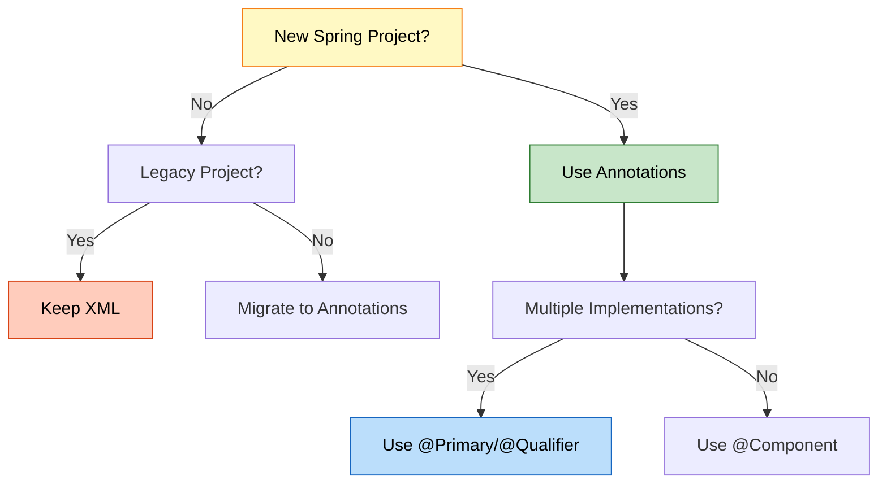

### 📋 Use Case Guidelines

#### Use XML Configuration When:
- ✅ Working with **legacy applications**
- ✅ Need **external configuration** without recompilation
- ✅ Integrating **third-party libraries** without source code
- ✅ Team prefers **separation** of config and code

#### Use Annotation Configuration When:
- ✅ Starting a **new project**
- ✅ Want **type safety** and compile-time checking
- ✅ Need **better IDE support** and refactoring
- ✅ Prefer **less verbose** configuration
- ✅ Following **modern Spring practices**

#### Use @Primary When:
- ✅ Have a **default/preferred** implementation
- ✅ One implementation used **80% of the time**
- ✅ Want **fallback behavior**

#### Use @Qualifier When:
- ✅ Need **specific** implementation
- ✅ Using **multiple implementations** in same class
- ✅ Want to **override @Primary** choice
- ✅ Need **explicit control**

---

## LEARNING PATH

<div align="center">

</div>

### 🎓 Recommended Study Order

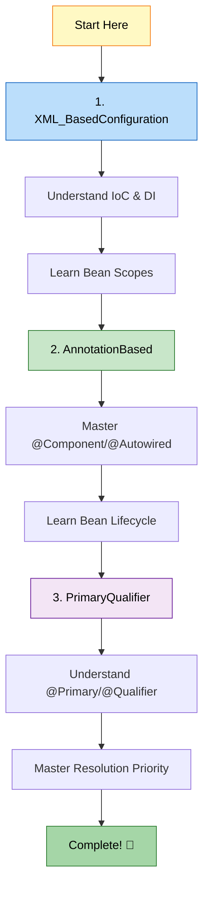

### 📚 Step-by-Step Guide

#### Step 1: XML-Based Configuration (2-3 hours)
1. Read [XML_BasedConfiguration/README.md](XML_BasedConfiguration/README.md)
2. Understand bean definition in XML
3. Practice constructor and setter injection
4. Experiment with bean scopes
5. Run the project and observe behavior

**Key Files to Study:**
- [`XML_BasedConfiguration/src/main/resources/bean.xml`](XML_BasedConfiguration/src/main/resources/bean.xml)
- [`XML_BasedConfiguration/src/main/java/org/example/App.java`](XML_BasedConfiguration/src/main/java/org/example/App.java)

#### Step 2: Annotation-Based Configuration (4-5 hours)
1. Read [AnnotationBased/README.md](AnnotationBased/README.md)
2. Understand @Configuration and @ComponentScan
3. Learn stereotype annotations
4. Master @Autowired and dependency injection
5. Study bean lifecycle annotations
6. Explore advanced annotations

**Key Files to Study:**
- [`AnnotationBased/src/main/java/org/example/services/AppConfig.java`](AnnotationBased/src/main/java/org/example/services/AppConfig.java)
- [`AnnotationBased/src/main/java/org/example/services/MessageService.java`](AnnotationBased/src/main/java/org/example/services/MessageService.java)
- [`AnnotationBased/src/main/java/org/example/bean_scope/BeanScopeDemo.java`](AnnotationBased/src/main/java/org/example/bean_scope/BeanScopeDemo.java)

#### Step 3: @Primary & @Qualifier (2-3 hours)
1. Read [PrimaryQualifier/PRIMARY_QUALIFIER_EXPLAIN.md](PrimaryQualifier/PRIMARY_QUALIFIER_EXPLAIN.md) (Simple)
2. Read [PrimaryQualifier/README.md](PrimaryQualifier/README.md) (Detailed)
3. Understand the ambiguity problem
4. Learn @Primary for default selection
5. Master @Qualifier for specific selection
6. Study resolution priority

**Key Files to Study:**
- [`PrimaryQualifier/src/main/java/org/example/primary_qualifier/NotificationManager.java`](PrimaryQualifier/src/main/java/org/example/primary_qualifier/NotificationManager.java)
- [`PrimaryQualifier/src/main/java/org/example/primary_qualifier/EmailNotificationService.java`](PrimaryQualifier/src/main/java/org/example/primary_qualifier/EmailNotificationService.java)

---

## QUICK REFERENCE

<div align="center">

</div>

### 📖 Essential Annotations

| Annotation | Purpose | Example |
|:-----------|:--------|:--------|
| **@Configuration** | Mark configuration class | `@Configuration public class AppConfig` |
| **@ComponentScan** | Scan for components | `@ComponentScan("org.example")` |
| **@Component** | Generic component | `@Component public class MyService` |
| **@Service** | Business layer | `@Service public class UserService` |
| **@Repository** | Data layer | `@Repository public class UserRepo` |
| **@Controller** | Presentation layer | `@Controller public class UserController` |
| **@Autowired** | Inject dependency | `@Autowired private UserService service` |
| **@Qualifier** | Specify bean | `@Qualifier("emailService")` |
| **@Primary** | Default bean | `@Primary @Component` |
| **@Scope** | Bean scope | `@Scope("prototype")` |
| **@Lazy** | Lazy initialization | `@Lazy @Component` |
| **@PostConstruct** | After DI | `@PostConstruct public void init()` |
| **@PreDestroy** | Before destroy | `@PreDestroy public void cleanup()` |
| **@Bean** | Bean method | `@Bean public DataSource ds()` |
| **@Value** | Inject value | `@Value("${app.name}")` |

### 🔧 Common Patterns

#### Pattern 1: Simple Service
```java
@Service
public class UserService {
    private final UserRepository repository;
    
    public UserService(UserRepository repository) {
        this.repository = repository;
    }
}
```

#### Pattern 2: Multiple Implementations
```java
@Component
@Primary
public class EmailNotifier implements Notifier { }

@Component
public class SmsNotifier implements Notifier { }

@Service
public class NotificationService {
    public NotificationService(
            Notifier defaultNotifier,  // Gets @Primary
            @Qualifier("smsNotifier") Notifier smsNotifier) {
    }
}
```

#### Pattern 3: Lifecycle Management
```java
@Component
public class DatabaseService {
    @PostConstruct
    public void init() {
        // Initialize connection
    }
    
    @PreDestroy
    public void cleanup() {
        // Close connection
    }
}
```

---

## RUNNING THE PROJECTS


### 🚀 Prerequisites

- **Java 21** or higher
- **Maven 3.6+**
- **IDE** (IntelliJ IDEA, Eclipse, or VS Code)

### 📦 Running Each Project

#### Project 1: XML_BasedConfiguration

```bash
cd XML_BasedConfiguration
mvn clean compile
mvn exec:java -Dexec.mainClass="org.example.App"
```

**Expected Output:**
```
=== Spring Container Created ===
Constructor Injection - MessageService created
Setter Injection - NotificationService created
Message sent via Email
Notification sent via Email
=== Spring Container Closed ===
```

#### Project 2: AnnotationBased

```bash
cd AnnotationBased
mvn clean compile
mvn exec:java -Dexec.mainClass="org.example.App"
```

**Expected Output:**
```
=== Spring Container Created ===
EmailService created
MessageService created with EmailService
Message: Hello from Annotation-Based Configuration!
=== Spring Container Closed ===
```

#### Project 3: PrimaryQualifier

```bash
cd PrimaryQualifier
mvn clean compile
mvn exec:java -Dexec.mainClass="org.example.primary_qualifier.PrimaryQualifierDemo"
```

**Expected Output:**
```
=== Spring Container Created ===
NotificationManager created with all notification services

--- Using @Primary (Default Service) ---
Email: Welcome to Spring!

--- Using @Qualifier (All Services) ---
Email: Important Update!
SMS: Important Update!
Push Notification: Important Update!

=== Spring Container Closed ===
```

### 🔧 Using IDE

1. **Import Project:** File → Open → Select project folder
2. **Maven Sync:** Right-click on `pom.xml` → Maven → Reload Project
3. **Run:** Right-click on main class → Run

---

## 📚 ADDITIONAL RESOURCES

<div align="center">

</div>

### 📖 Documentation References

- **Spring Framework Documentation:** [https://docs.spring.io/spring-framework/docs/current/reference/html/](https://docs.spring.io/spring-framework/docs/current/reference/html/)
- **Spring IoC Container:** [https://docs.spring.io/spring-framework/docs/current/reference/html/core.html#beans](https://docs.spring.io/spring-framework/docs/current/reference/html/core.html#beans)
- **Dependency Injection:** [https://docs.spring.io/spring-framework/docs/current/reference/html/core.html#beans-dependencies](https://docs.spring.io/spring-framework/docs/current/reference/html/core.html#beans-dependencies)

### 🎯 Project-Specific Documentation

| Project | Simple Guide | Detailed Guide | Key Files |
|:--------|:------------|:--------------|:----------|
| **XML_BasedConfiguration** | - | [README.md](XML_BasedConfiguration/README.md) | [bean.xml](XML_BasedConfiguration/src/main/resources/bean.xml), [App.java](XML_BasedConfiguration/src/main/java/org/example/App.java) |
| **AnnotationBased** | [EXPLAIN.md](AnnotationBased/EXPLAIN.md) | [README.md](AnnotationBased/README.md) | [AppConfig.java](AnnotationBased/src/main/java/org/example/services/AppConfig.java), [MessageService.java](AnnotationBased/src/main/java/org/example/services/MessageService.java) |
| **PrimaryQualifier** | [PRIMARY_QUALIFIER_EXPLAIN.md](PrimaryQualifier/PRIMARY_QUALIFIER_EXPLAIN.md) | [README.md](PrimaryQualifier/README.md) | [NotificationManager.java](PrimaryQualifier/src/main/java/org/example/primary_qualifier/NotificationManager.java), [EmailNotificationService.java](PrimaryQualifier/src/main/java/org/example/primary_qualifier/EmailNotificationService.java) |

### 📖 Quick Navigation

**Want to understand XML configuration?**
→ Start with [XML_BasedConfiguration/README.md](XML_BasedConfiguration/README.md)

**Want to learn modern annotations?**
→ Start with [AnnotationBased/EXPLAIN.md](AnnotationBased/EXPLAIN.md) (simple)
→ Then read [AnnotationBased/README.md](AnnotationBased/README.md) (detailed)

**Want to master @Primary and @Qualifier?**
→ Start with [PrimaryQualifier/PRIMARY_QUALIFIER_EXPLAIN.md](PrimaryQualifier/PRIMARY_QUALIFIER_EXPLAIN.md) (simple)
→ Then read [PrimaryQualifier/README.md](PrimaryQualifier/README.md) (detailed)

---

## 🎯 KEY TAKEAWAYS

<div align="center">

</div>

### ✅ What We Learned

1. **Spring IoC Container**
   - Manages object lifecycle
   - Handles dependency injection
   - Provides configuration flexibility

2. **Configuration Approaches**
   - XML: External, flexible, legacy
   - Annotations: Modern, type-safe, recommended

3. **Dependency Injection**
   - Constructor injection (best practice)
   - Setter injection (optional dependencies)
   - Field injection (avoid)

4. **Bean Management**
   - Scopes: Singleton, Prototype
   - Lifecycle: @PostConstruct, @PreDestroy
   - Naming conventions

5. **Ambiguity Resolution**
   - @Primary for defaults
   - @Qualifier for specific selection
   - Resolution priority order

### 🎓 Best Practices Summary

| Practice | Recommendation | Reason |
|:---------|:--------------|:-------|
| **Configuration** | Use Annotations | Modern, type-safe |
| **Injection Type** | Constructor | Immutable, testable |
| **Bean Scope** | Singleton (default) | Memory efficient |
| **Multiple Beans** | @Primary + @Qualifier | Clear intent |
| **Lifecycle** | @PostConstruct/@PreDestroy | Standard, clean |
| **Field Injection** | Avoid | Hard to test |

---

## 🤝 CONTRIBUTING

Found an issue or want to improve the documentation? Feel free to reach out!

<div align="center">

[](https://github.com/Avinash-706)
[](mailto:avunashdhanuka@gmail.com)

</div>

---

<div align="center">

## 🎓 End of Spring Configuration Guide

<br>

<br>

**Created with dedication by Avinash Dhanuka**

<br>

---

**Happy Learning! 🚀**

*"Master the fundamentals, embrace the modern!"* - Avinash Dhanuka

<br>


---

### 📊 Project Statistics

| Metric | Value |
|:-------|:------|
| **Total Projects** | 3 |
| **Configuration Types** | 2 (XML, Annotations) |
| **Key Annotations Covered** | 15+ |
| **Code Examples** | 50+ |
| **Mermaid Diagrams** | 10+ |
| **Documentation Pages** | 3 comprehensive READMEs |

---

**© 2026 Avinash Dhanuka | All Rights Reserved**

</div>
