# ☕ Spring Framework: XML-Based Configuration Deep Dive

<div align="center">


</div>

<hr style="border: 1px solid rgb(98, 117, 187)">

<div align="center">
<table>
<tr>
<td align="center">
<br />

<h3>© 2026 Avinash Dhanuka</h3>
<p>Master Guide: Spring XML-Based Configuration</p>
<p><em>Crafted with ❤️ for Understanding Spring IoC Container</em></p>

<a href="https://github.com/Avinash-706" target="_blank">

</a>
<br />
<a href="https://mail.google.com/mail/?view=cm&fs=1&to=avunashdhanuka@gmail.com&su=Spring%20XML%20Configuration%20Query&body=☕%20Hello%20Avinash,%0D%0A%0D%0AMy%20name%20is%20[Your%20Name]%20and%20I%20have%20a%20doubt%20regarding%20Spring%20XML%20Configuration.%0D%0A%0D%0A🔹%20Topic:%20[XML/IoC/Bean%20Scopes]%0D%0A%0D%0AThank%20you!" target="_blank">

</a>
<br />
<br />
</td>
</tr>
</table>
</div>

> **Learning Note:** This guide demonstrates Spring's XML-Based Configuration approach, which was the traditional way of configuring Spring applications before annotations became popular. Understanding XML configuration helps you appreciate modern annotation-based approaches and maintain legacy Spring applications.

> **Prerequisites:** 
> - Understanding of Dependency Injection concepts
> - Basic knowledge of XML syntax
> - Java OOP fundamentals
> - Maven basics

---

## 📑 Table of Contents
1. [What is XML-Based Configuration?](#1-what-is-xml-based-configuration)
2. [Spring Core Architecture](#2-spring-core-architecture)
3. [Spring IoC Containers](#3-spring-ioc-containers)
4. [Configuration Types in Spring](#4-configuration-types-in-spring)
5. [Dependency Injection Types](#5-dependency-injection-types)
6. [Bean Scopes](#6-bean-scopes)
7. [Bean Lifecycle](#7-bean-lifecycle)
8. [Scope Combinations Deep Dive](#8-scope-combinations-deep-dive)
9. [Project Structure & Implementation](#9-project-structure--implementation)
10. [Internal Working Mechanism](#10-internal-working-mechanism)
11. [Real-World Examples](#11-real-world-examples)
12. [Best Practices](#12-best-practices)
13. [Interview Questions](#13-top-interview-questions)

---

## 1. WHAT IS XML-BASED CONFIGURATION?

<div align="center">

</div>

> **📝 Author:** Avinash Dhanuka | [GitHub](https://github.com/Avinash-706)

### 📌 Definition

**XML-Based Configuration** is Spring's traditional approach where bean definitions, dependencies, and configurations are declared in XML files. The Spring IoC container reads these XML files and creates/manages beans accordingly.

**Simple Analogy:**
- **XML Configuration:** Like a recipe book that tells Spring how to cook (create) your beans
- **Spring Container:** The chef who reads the recipe and prepares the dishes (beans)
- **Your Application:** The restaurant that serves the prepared dishes to customers

### 🎯 Core Concept

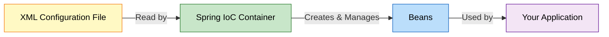


### 📊 Example: Our Project

**Reference:** [bean.xml](src/main/resources/bean.xml)

**XML Configuration:**
```xml
<?xml version="1.0" encoding="UTF-8"?>
<beans xmlns="http://www.springframework.org/schema/beans"
       xmlns:xsi="http://www.w3.org/2001/XMLSchema-instance"
       xsi:schemaLocation="
       http://www.springframework.org/schema/beans 
       https://www.springframework.org/schema/beans/spring-beans.xsd">

    <!-- Define MessageService bean with setter injection -->
    <bean id="msgSrv" class="org.example.services.MessageService">
        <property ref="emlSrv" name="EmailService"/>
    </bean>
    
    <!-- Define EmailService bean with prototype scope -->
    <bean id="emlSrv" 
          scope="prototype" 
          init-method="init" 
          destroy-method="destroy" 
          class="org.example.services.EmailService"/>
</beans>
```

**Java Code:**
```java
// Load XML configuration
ApplicationContext context = new ClassPathXmlApplicationContext("bean.xml");

// Get bean from container
MessageService messageService = context.getBean(MessageService.class);

// Use the bean
messageService.sendMessage();
```

**What Happens:**
1. ✅ Spring reads `bean.xml`
2. ✅ Creates `EmailService` bean (prototype scope)
3. ✅ Creates `MessageService` bean
4. ✅ Injects `EmailService` into `MessageService` via setter
5. ✅ Calls `init()` method on `EmailService`
6. ✅ Beans are ready to use

---

## 2. SPRING CORE ARCHITECTURE

<div align="center">

</div>

### 📌 Spring Framework Hierarchy

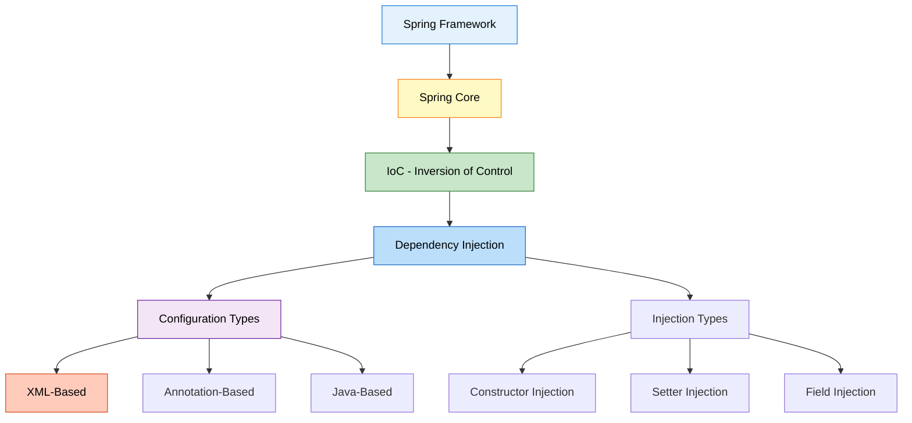


### 🎯 IoC (Inversion of Control)

**Definition:** A design principle where the control of object creation and lifecycle management is transferred from the application to a framework (Spring Container).

**Traditional Approach (No IoC):**
```java
public class MessageService {
    private EmailService emailService = new EmailService();  // We control creation
}
```

**IoC Approach (Spring):**
```xml
<!-- Spring controls creation -->
<bean id="msgSrv" class="org.example.services.MessageService">
    <property ref="emlSrv" name="EmailService"/>
</bean>
<bean id="emlSrv" class="org.example.services.EmailService"/>
```

**Control Inverted:**
- **Before:** Application creates objects
- **After:** Spring Container creates objects
- **Benefit:** Loose coupling, easier testing, centralized management

---

## 3. SPRING IOC CONTAINERS

<div align="center">

</div>

### 📌 Container Hierarchy

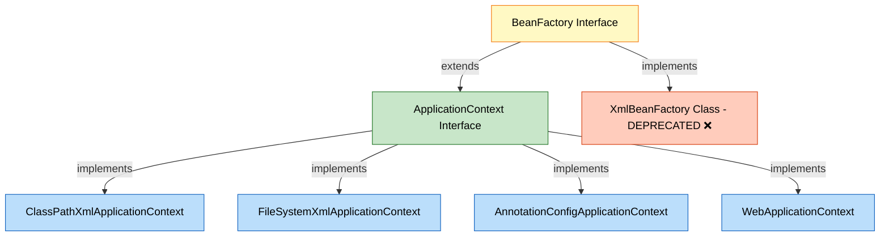

### 1️⃣ BeanFactory (Basic Container)

**Definition:** The root interface for accessing Spring bean container. Provides basic functionality for managing beans.

**Features:**
- Lazy initialization (beans created on demand)
- Basic dependency injection
- Lightweight

**Example:**
```java
// BeanFactory - Basic container (rarely used directly)
BeanFactory factory = new XmlBeanFactory(new ClassPathResource("bean.xml"));
MessageService service = (MessageService) factory.getBean("msgSrv");
```

**⚠️ Note:** `XmlBeanFactory` is deprecated since Spring 3.1. Use `ApplicationContext` instead.

---

### 2️⃣ ApplicationContext (Advanced Container)

**Definition:** Advanced Spring container that extends BeanFactory with additional enterprise features.

**Features:**
- ✅ Eager initialization (beans created at startup)
- ✅ Event publication
- ✅ Internationalization (i18n)
- ✅ AOP integration
- ✅ Application layer-specific contexts (Web)

#### Types of ApplicationContext

**a) ClassPathXmlApplicationContext** ✅ (Used in our project)

**Reference:** [App.java:17](src/main/java/org/example/App.java#L17)

```java
// Loads XML from classpath (src/main/resources)
ApplicationContext context = new ClassPathXmlApplicationContext("bean.xml");
```

**Use Case:**
- XML file is in `src/main/resources` or classpath
- Most common approach
- Works in any environment

**Example:**
```
Project Structure:
src/
  main/
    resources/
      bean.xml  ← ClassPathXmlApplicationContext looks here
```

---

**b) FileSystemXmlApplicationContext**

```java
// Loads XML from file system path
ApplicationContext context = new FileSystemXmlApplicationContext(
    "C:/projects/spring/config/bean.xml"
);
```

**Use Case:**
- XML file is outside the project
- Absolute or relative file path
- External configuration

**Example:**
```
File System:
C:/
  projects/
    spring/
      config/
        bean.xml  ← FileSystemXmlApplicationContext looks here
```

---

**c) AnnotationConfigApplicationContext**

```java
// Loads Java-based configuration
ApplicationContext context = new AnnotationConfigApplicationContext(AppConfig.class);
```

**Use Case:**
- Java-based configuration (no XML)
- Modern Spring applications
- Type-safe configuration

**Example:**
```java
@Configuration
public class AppConfig {
    @Bean
    public MessageService messageService() {
        return new MessageService(emailService());
    }
    
    @Bean
    public EmailService emailService() {
        return new EmailService();
    }
}
```

---

**d) WebApplicationContext**

```java
// Used in Spring MVC web applications
WebApplicationContext context = 
    WebApplicationContextUtils.getWebApplicationContext(servletContext);
```

**Use Case:**
- Spring MVC applications
- Web-aware features
- Servlet context integration

---

### 📊 BeanFactory vs ApplicationContext

| Feature | BeanFactory | ApplicationContext |
|:--------|:-----------|:------------------|
| **Initialization** | Lazy (on-demand) | Eager (at startup) |
| **Memory** | Lightweight | Heavier |
| **Event Publication** | ❌ No | ✅ Yes |
| **Internationalization** | ❌ No | ✅ Yes |
| **AOP** | ❌ Limited | ✅ Full support |
| **Bean Post Processors** | Manual registration | Automatic |
| **Use Case** | Resource-constrained | Enterprise applications |
| **Recommendation** | ❌ Rarely used | ✅ **Recommended** |

**Visual Comparison:**

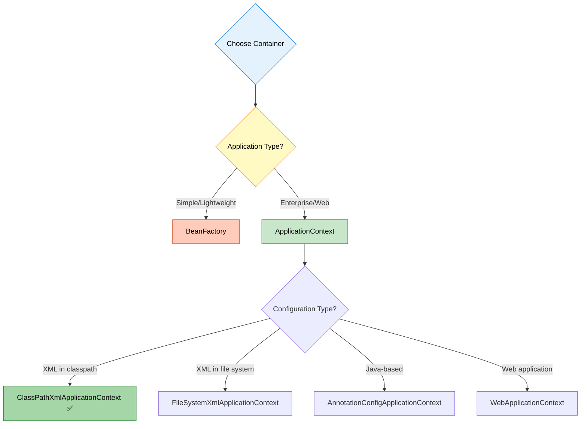

---

## 4. CONFIGURATION TYPES IN SPRING

<div align="center">

</div>

### 📌 Three Ways to Configure Spring

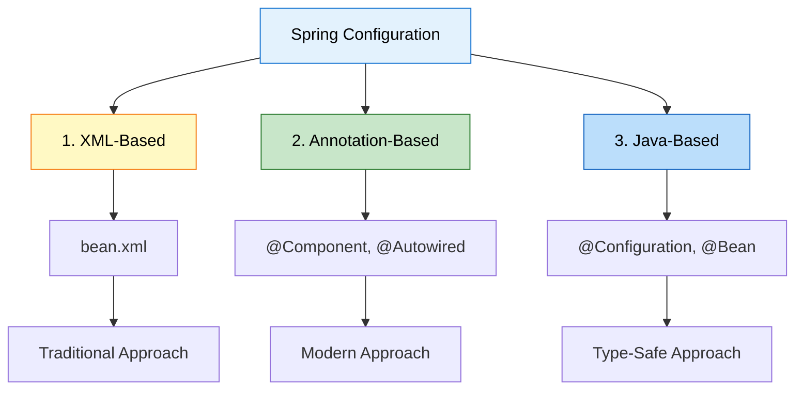

### 1️⃣ XML-Based Configuration ✅ (Our Project)

**Definition:** Bean definitions in XML files.

**Reference:** [bean.xml](src/main/resources/bean.xml)

**Example:**
```xml
<beans xmlns="http://www.springframework.org/schema/beans"
       xmlns:xsi="http://www.w3.org/2001/XMLSchema-instance"
       xsi:schemaLocation="
       http://www.springframework.org/schema/beans 
       https://www.springframework.org/schema/beans/spring-beans.xsd">

    <!-- Bean definition -->
    <bean id="msgSrv" class="org.example.services.MessageService">
        <property ref="emlSrv" name="EmailService"/>
    </bean>
    
    <bean id="emlSrv" class="org.example.services.EmailService"/>
</beans>
```

**Pros:**
- ✅ Clear separation of configuration and code
- ✅ Easy to modify without recompiling
- ✅ Good for legacy applications
- ✅ Centralized configuration

**Cons:**
- ❌ Verbose (lots of XML)
- ❌ No compile-time checking
- ❌ Harder to refactor
- ❌ Runtime errors if misconfigured

---

### 2️⃣ Annotation-Based Configuration

**Definition:** Bean definitions using annotations in Java classes.

**Example:**
```java
@Component
public class EmailService {
    public void sendMail() {
        System.out.println("Sending email...");
    }
}

@Component
public class MessageService {
    @Autowired
    private EmailService emailService;
    
    public void sendMessage() {
        emailService.sendMail();
    }
}
```

**Configuration:**
```xml
<!-- Enable component scanning -->
<context:component-scan base-package="org.example.services"/>
```

**Pros:**
- ✅ Less verbose than XML
- ✅ Configuration close to code
- ✅ Faster development
- ✅ Modern approach

**Cons:**
- ❌ Configuration scattered across classes
- ❌ Requires recompilation for changes
- ❌ Harder to see overall configuration

---

### 3️⃣ Java-Based Configuration

**Definition:** Bean definitions using Java classes with @Configuration.

**Example:**
```java
@Configuration
public class AppConfig {
    
    @Bean
    public EmailService emailService() {
        return new EmailService();
    }
    
    @Bean
    public MessageService messageService() {
        MessageService service = new MessageService();
        service.setEmailService(emailService());
        return service;
    }
}
```

**Usage:**
```java
ApplicationContext context = 
    new AnnotationConfigApplicationContext(AppConfig.class);
MessageService service = context.getBean(MessageService.class);
```

**Pros:**
- ✅ Type-safe (compile-time checking)
- ✅ Refactoring-friendly
- ✅ Full Java power (conditionals, loops)
- ✅ No XML needed

**Cons:**
- ❌ Configuration mixed with code
- ❌ Requires recompilation

---

### 📊 Configuration Comparison

| Aspect | XML-Based | Annotation-Based | Java-Based |
|:-------|:----------|:----------------|:-----------|
| **Syntax** | XML | Annotations | Java |
| **Verbosity** | High | Low | Medium |
| **Type Safety** | ❌ No | ⚠️ Partial | ✅ Yes |
| **Refactoring** | Hard | Easy | Easy |
| **Centralized** | ✅ Yes | ❌ No | ✅ Yes |
| **Compile Check** | ❌ No | ⚠️ Partial | ✅ Yes |
| **Learning Curve** | Easy | Medium | Medium |
| **Use Case** | Legacy apps | Modern apps | Enterprise apps |

---

## 5. DEPENDENCY INJECTION TYPES

<div align="center">

</div>

### 📌 Three Types of Dependency Injection

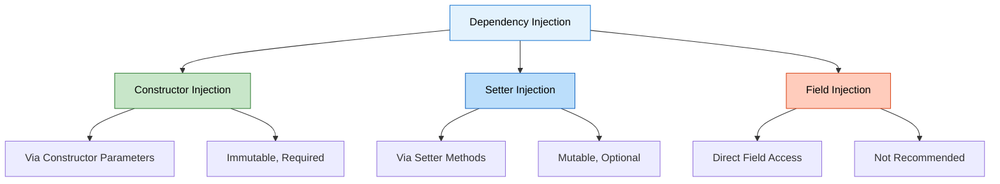

### 1️⃣ Constructor Injection

**Definition:** Dependencies injected through constructor parameters.

**XML Configuration:**
```xml
<!-- Constructor injection -->
<bean id="msgSrv" class="org.example.services.MessageService">
    <constructor-arg ref="emlSrv"/>
</bean>

<bean id="emlSrv" class="org.example.services.EmailService"/>
```

**Java Code:**
```java
public class MessageService {
    private final EmailService emailService;  // Can be final
    
    public MessageService(EmailService emailService) {
        System.out.println("Constructor called");
        this.emailService = emailService;
    }
}
```

**Pros:**
- ✅ Immutable (final fields)
- ✅ Required dependencies guaranteed
- ✅ Null-safe
- ✅ Easy to test
- ✅ **Recommended by Spring**

**Cons:**
- ❌ Verbose for many dependencies
- ❌ Cannot change at runtime

**When to Use:**
- ✅ Required dependencies
- ✅ Immutable objects
- ✅ Production code

---

### 2️⃣ Setter Injection ✅ (Used in our project)

**Definition:** Dependencies injected through setter methods.

**Reference:** [bean.xml:29-31](src/main/resources/bean.xml#L29) | [MessageService.java:17-20](src/main/java/org/example/services/MessageService.java#L17)

**XML Configuration:**
```xml
<!-- Setter injection -->
<bean id="msgSrv" class="org.example.services.MessageService">
    <property ref="emlSrv" name="EmailService"/>
</bean>

<bean id="emlSrv" class="org.example.services.EmailService"/>
```

**Java Code:**
```java
public class MessageService {
    private EmailService emailService;  // Not final
    
    public void setEmailService(EmailService emailService) {
        System.out.println("-- Setter called --");
        this.emailService = emailService;
    }
}
```

**Pros:**
- ✅ Optional dependencies
- ✅ Can change at runtime
- ✅ Flexible
- ✅ Good for optional features

**Cons:**
- ❌ Can be null (NullPointerException risk)
- ❌ Mutable
- ❌ Object can be in invalid state

**When to Use:**
- ✅ Optional dependencies
- ✅ Dependencies that might change
- ✅ Circular dependencies (rare)

---

### 3️⃣ Field Injection

**Definition:** Dependencies injected directly into fields (annotation-based only).

**Example:**
```java
@Component
public class MessageService {
    @Autowired
    private EmailService emailService;  // Direct injection
}
```

**XML Equivalent:** Not possible (XML doesn't support field injection)

**Pros:**
- ✅ Less boilerplate
- ✅ Quick for prototypes

**Cons:**
- ❌ Breaks encapsulation
- ❌ Hard to test
- ❌ Cannot be final
- ❌ **Not recommended**

**When to Use:**
- ⚠️ Only for quick prototypes
- ❌ Not for production

---

### 📊 Injection Type Comparison

| Aspect | Constructor | Setter | Field |
|:-------|:-----------|:-------|:------|
| **Immutability** | ✅ Yes (final) | ❌ No | ❌ No |
| **Null Safety** | ✅ Yes | ❌ No | ❌ No |
| **Optional Deps** | ❌ No | ✅ Yes | ✅ Yes |
| **Testability** | ✅ Excellent | ✅ Good | ❌ Poor |
| **XML Support** | ✅ Yes | ✅ Yes | ❌ No |
| **Recommendation** | ✅ **Best** | ⚠️ Optional | ❌ Avoid |

---

## 6. BEAN SCOPES

<div align="center">

</div>

### 📌 What is Bean Scope?

**Definition:** Bean scope defines the lifecycle and visibility of a bean in the Spring container.

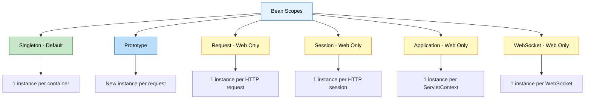

### 1️⃣ Singleton Scope (Default) ✅

**Definition:** Only ONE instance of the bean is created per Spring container.

**Reference:** [bean.xml:29](src/main/resources/bean.xml#L29)

**XML Configuration:**
```xml
<!-- Singleton (default - no need to specify) -->
<bean id="msgSrv" class="org.example.services.MessageService">
    <property ref="emlSrv" name="EmailService"/>
</bean>

<!-- Explicit singleton -->
<bean id="msgSrv" scope="singleton" class="org.example.services.MessageService">
    <property ref="emlSrv" name="EmailService"/>
</bean>
```

**Behavior:**
```java
MessageService service1 = context.getBean(MessageService.class);
MessageService service2 = context.getBean(MessageService.class);
MessageService service3 = context.getBean(MessageService.class);

System.out.println(service1);  // org.example.services.MessageService@1a2b3c
System.out.println(service2);  // org.example.services.MessageService@1a2b3c (SAME)
System.out.println(service3);  // org.example.services.MessageService@1a2b3c (SAME)

System.out.println(service1 == service2);  // true
System.out.println(service2 == service3);  // true
```

**Characteristics:**
- ✅ Created at container startup (eager initialization)
- ✅ Shared across entire application
- ✅ Thread-safe if stateless
- ✅ Memory efficient

**Use Cases:**
- Stateless services
- DAOs (Data Access Objects)
- Controllers
- Utility classes

**Real-World Example:**
```java
// Database connection pool - shared across application
@Bean
@Scope("singleton")
public DataSource dataSource() {
    return new HikariDataSource();  // One pool for all
}
```

---

### 2️⃣ Prototype Scope ✅ (Used in our project)

**Definition:** NEW instance created every time the bean is requested.

**Reference:** [bean.xml:31](src/main/resources/bean.xml#L31)

**XML Configuration:**
```xml
<!-- Prototype scope -->
<bean id="emlSrv" scope="prototype" class="org.example.services.EmailService"/>
```

**Behavior:**
```java
EmailService email1 = context.getBean(EmailService.class);
EmailService email2 = context.getBean(EmailService.class);
EmailService email3 = context.getBean(EmailService.class);

System.out.println(email1);  // org.example.services.EmailService@1a2b3c
System.out.println(email2);  // org.example.services.EmailService@4d5e6f (DIFFERENT)
System.out.println(email3);  // org.example.services.EmailService@7g8h9i (DIFFERENT)

System.out.println(email1 == email2);  // false
System.out.println(email2 == email3);  // false
```

**Characteristics:**
- ✅ Created on demand (lazy initialization)
- ✅ New instance per request
- ✅ Not shared
- ❌ Spring doesn't manage destruction

**Use Cases:**
- Stateful objects
- Objects with mutable state
- Short-lived objects
- Objects that need isolation

**Real-World Example:**
```java
// Shopping cart - each user needs their own
@Bean
@Scope("prototype")
public ShoppingCart shoppingCart() {
    return new ShoppingCart();  // New cart per user
}
```

---

### 3️⃣ Request Scope (Web Applications Only)

**Definition:** One instance per HTTP request.

**XML Configuration:**
```xml
<bean id="loginAction" scope="request" class="com.example.LoginAction"/>
```

**Use Case:**
```java
// Login form data - unique per HTTP request
@Bean
@Scope("request")
public LoginForm loginForm() {
    return new LoginForm();
}
```

**Lifecycle:**
- Created when HTTP request starts
- Destroyed when HTTP request completes

---

### 4️⃣ Session Scope (Web Applications Only)

**Definition:** One instance per HTTP session.

**XML Configuration:**
```xml
<bean id="userPreferences" scope="session" class="com.example.UserPreferences"/>
```

**Use Case:**
```java
// User preferences - persist across requests in same session
@Bean
@Scope("session")
public UserPreferences userPreferences() {
    return new UserPreferences();
}
```

**Lifecycle:**
- Created when HTTP session starts
- Destroyed when HTTP session expires

---

### 5️⃣ Application Scope (Web Applications Only)

**Definition:** One instance per ServletContext (entire web application).

**XML Configuration:**
```xml
<bean id="appConfig" scope="application" class="com.example.AppConfig"/>
```

**Use Case:**
```java
// Application-wide configuration
@Bean
@Scope("application")
public AppConfig appConfig() {
    return new AppConfig();
}
```

---

### 6️⃣ WebSocket Scope (Web Applications Only)

**Definition:** One instance per WebSocket session.

**XML Configuration:**
```xml
<bean id="chatSession" scope="websocket" class="com.example.ChatSession"/>
```

**Use Case:**
```java
// WebSocket chat session
@Bean
@Scope("websocket")
public ChatSession chatSession() {
    return new ChatSession();
}
```

---

### 📊 Bean Scope Comparison

| Scope | Instances | Lifecycle | Use Case | Web Only |
|:------|:----------|:----------|:---------|:---------|
| **Singleton** | 1 per container | Container lifetime | Stateless services | ❌ No |
| **Prototype** | New per request | Until garbage collected | Stateful objects | ❌ No |
| **Request** | 1 per HTTP request | Request lifetime | Form data | ✅ Yes |
| **Session** | 1 per HTTP session | Session lifetime | User data | ✅ Yes |
| **Application** | 1 per ServletContext | Application lifetime | App config | ✅ Yes |
| **WebSocket** | 1 per WebSocket | WebSocket lifetime | Chat sessions | ✅ Yes |

---

## 7. BEAN LIFECYCLE

<div align="center">

</div>

### 📌 Bean Lifecycle Phases

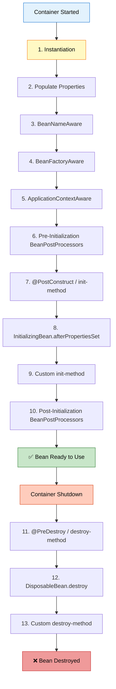

### 🔄 Lifecycle Phases Explained

#### Phase 1: Instantiation
```java
public EmailService() {
    System.out.println("Email constructor called");
}
```
- Bean object is created
- Constructor is called
- Memory allocated

---

#### Phase 2: Populate Properties (Dependency Injection)
```xml
<bean id="msgSrv" class="org.example.services.MessageService">
    <property ref="emlSrv" name="EmailService"/>  <!-- Injected here -->
</bean>
```
- Dependencies are injected
- Setter methods called (for setter injection)
- Fields populated

---

#### Phase 3-6: Aware Interfaces (Optional)
```java
public class EmailService implements BeanNameAware, ApplicationContextAware {
    @Override
    public void setBeanName(String name) {
        System.out.println("Bean name: " + name);
    }
    
    @Override
    public void setApplicationContext(ApplicationContext context) {
        System.out.println("ApplicationContext set");
    }
}
```
- Bean gets access to Spring infrastructure
- Rarely used in practice

---

#### Phase 7: Initialization (init-method) ✅ (Used in our project)

**Reference:** [bean.xml:31](src/main/resources/bean.xml#L31) | [EmailService.java:19-21](src/main/java/org/example/services/EmailService.java#L19)

**XML Configuration:**
```xml
<bean id="emlSrv" 
      scope="prototype" 
      init-method="init"  <!-- Custom initialization -->
      class="org.example.services.EmailService"/>
```

**Java Code:**
```java
public class EmailService {
    public void init() {
        System.out.println("Init Method Called");
        // Initialize resources, connections, etc.
    }
}
```

**When Called:**
- After dependencies are injected
- Before bean is ready to use
- For singleton: at container startup
- For prototype: when bean is requested

**Use Cases:**
- Open database connections
- Load configuration
- Initialize caches
- Validate dependencies

---

#### Phase 8: Bean Ready to Use
```java
EmailService emailService = context.getBean(EmailService.class);
emailService.sendMail();  // Bean is fully initialized and ready
```

---

#### Phase 9: Destruction (destroy-method) ✅ (Used in our project)

**Reference:** [bean.xml:31](src/main/resources/bean.xml#L31) | [EmailService.java:22-24](src/main/java/org/example/services/EmailService.java#L22)

**XML Configuration:**
```xml
<bean id="emlSrv" 
      scope="prototype" 
      init-method="init" 
      destroy-method="destroy"  <!-- Custom destruction -->
      class="org.example.services.EmailService"/>
```

**Java Code:**
```java
public class EmailService {
    public void destroy() {
        System.out.println("Destroy Method Called");
        // Clean up resources, close connections, etc.
    }
}
```

**When Called:**
- When container is closed
- For singleton: automatically called
- For prototype: **NOT called** (Spring doesn't manage destruction)

**Use Cases:**
- Close database connections
- Release file handles
- Clean up caches
- Save state

---

### 🎯 Lifecycle Methods in XML

**Three Ways to Define Lifecycle Methods:**

**1. XML init-method and destroy-method (Our approach):**
```xml
<bean id="emlSrv" 
      init-method="init" 
      destroy-method="destroy" 
      class="org.example.services.EmailService"/>
```

**2. Implement InitializingBean and DisposableBean:**
```java
public class EmailService implements InitializingBean, DisposableBean {
    @Override
    public void afterPropertiesSet() throws Exception {
        System.out.println("InitializingBean: afterPropertiesSet");
    }
    
    @Override
    public void destroy() throws Exception {
        System.out.println("DisposableBean: destroy");
    }
}
```

**3. JSR-250 Annotations (requires annotation support):**
```java
public class EmailService {
    @PostConstruct
    public void init() {
        System.out.println("@PostConstruct: init");
    }
    
    @PreDestroy
    public void cleanup() {
        System.out.println("@PreDestroy: cleanup");
    }
}
```

---

### ⚠️ Important: Scope and Lifecycle

**Singleton Scope:**
```xml
<bean id="emlSrv" scope="singleton" init-method="init" destroy-method="destroy" 
      class="org.example.services.EmailService"/>
```

**Behavior:**
```java
ApplicationContext context = new ClassPathXmlApplicationContext("bean.xml");
// Output: Email constructor called
// Output: Init Method Called

context.close();
// Output: Destroy Method Called  ✅ Automatically called
```

---

**Prototype Scope:** ✅ (Our project)
```xml
<bean id="emlSrv" scope="prototype" init-method="init" destroy-method="destroy" 
      class="org.example.services.EmailService"/>
```

**Behavior:**
```java
ApplicationContext context = new ClassPathXmlApplicationContext("bean.xml");
// No output yet (lazy initialization)

EmailService email = context.getBean(EmailService.class);
// Output: Email constructor called
// Output: Init Method Called

context.close();
// NO OUTPUT  ❌ Destroy NOT called for prototype beans
```

**Why?**
- Spring creates prototype beans on demand
- Spring hands over the bean to you
- You are responsible for cleanup
- Spring doesn't track prototype beans after creation

**Solution for Prototype Cleanup:**
```java
// Manual cleanup
EmailService email = context.getBean(EmailService.class);
// Use the bean
email.destroy();  // Call manually
```

---

### 📊 Lifecycle Comparison

| Aspect | Singleton | Prototype |
|:-------|:----------|:----------|
| **Creation** | At startup | On demand |
| **init-method** | ✅ Called | ✅ Called |
| **destroy-method** | ✅ Called automatically | ❌ NOT called |
| **Cleanup** | Automatic | Manual |
| **Spring Management** | Full lifecycle | Creation only |

---

## 8. SCOPE COMBINATIONS DEEP DIVE

> **📝 Understanding Scope Interactions by:** Avinash Dhanuka

### 📌 Four Possible Combinations

When we have two beans (MessageService and EmailService), there are 4 possible scope combinations:

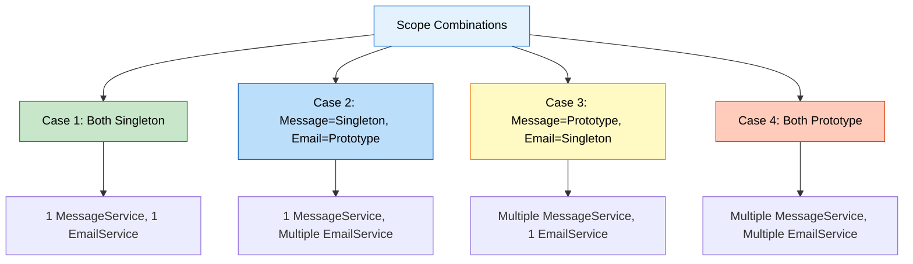

---

### 🔍 Case 1: Both Singleton

**XML Configuration:**
```xml
<bean id="msgSrv" scope="singleton" class="org.example.services.MessageService">
    <property ref="emlSrv" name="EmailService"/>
</bean>
<bean id="emlSrv" scope="singleton" class="org.example.services.EmailService"/>
```

#### Setter Injection Flow

**Step-by-Step Execution:**

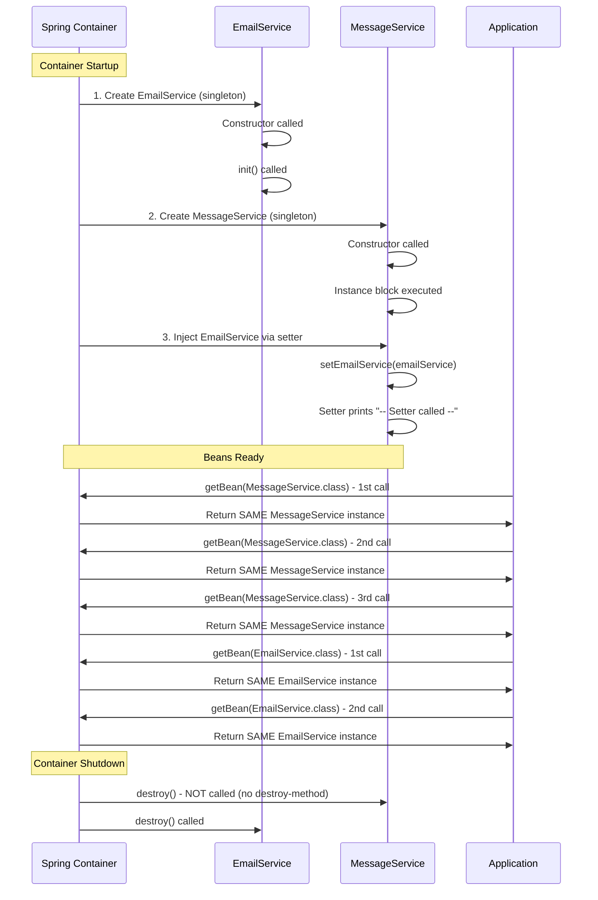

**Output:**
```
Email constructor called
Init Method Called
-- Starting Message Service --
-- Setter called --

Message is Sent !!
Send Through Mail !!
-- Exiting Mail Service --
-- Exiting Message Service --

--- Checking for Bean Scope ---
-- PROTOTYPE --
org.example.services.MessageService@1a2b3c4d
org.example.services.MessageService@1a2b3c4d  ← SAME
org.example.services.MessageService@1a2b3c4d  ← SAME

-- PROTOTYPE --
org.example.services.EmailService@5e6f7g8h
org.example.services.EmailService@5e6f7g8h  ← SAME
org.example.services.EmailService@5e6f7g8h  ← SAME

Destroy Method Called
```

**Key Points:**
- ✅ EmailService created once at startup
- ✅ MessageService created once at startup
- ✅ Setter called once during initialization
- ✅ All getBean() calls return same instances
- ✅ destroy() called on container close

---

#### Constructor Injection Flow

**XML Configuration:**
```xml
<bean id="msgSrv" scope="singleton" class="org.example.services.MessageService">
    <constructor-arg ref="emlSrv"/>
</bean>
<bean id="emlSrv" scope="singleton" class="org.example.services.EmailService"/>
```

**Java Code:**
```java
public class MessageService {
    private final EmailService emailService;
    
    public MessageService(EmailService emailService) {
        System.out.println("-- Constructor called --");
        this.emailService = emailService;
    }
}
```

**Output:**
```
Email constructor called
Init Method Called
-- Constructor called --

Message is Sent !!
Send Through Mail !!
-- Exiting Mail Service --

--- Checking for Bean Scope ---
org.example.services.MessageService@1a2b3c4d
org.example.services.MessageService@1a2b3c4d  ← SAME
org.example.services.MessageService@1a2b3c4d  ← SAME

org.example.services.EmailService@5e6f7g8h
org.example.services.EmailService@5e6f7g8h  ← SAME
org.example.services.EmailService@5e6f7g8h  ← SAME

Destroy Method Called
```

**Difference from Setter:**
- Constructor called instead of setter
- Dependency injected during object creation
- More concise output

---

### 🔍 Case 2: MessageService=Singleton, EmailService=Prototype ✅ (Our Project)

**Reference:** [bean.xml:29-31](src/main/resources/bean.xml#L29)

**XML Configuration:**
```xml
<bean id="msgSrv" scope="singleton" class="org.example.services.MessageService">
    <property ref="emlSrv" name="EmailService"/>
</bean>
<bean id="emlSrv" scope="prototype" init-method="init" destroy-method="destroy" 
      class="org.example.services.EmailService"/>
```

#### Setter Injection Flow

**Step-by-Step Execution:**

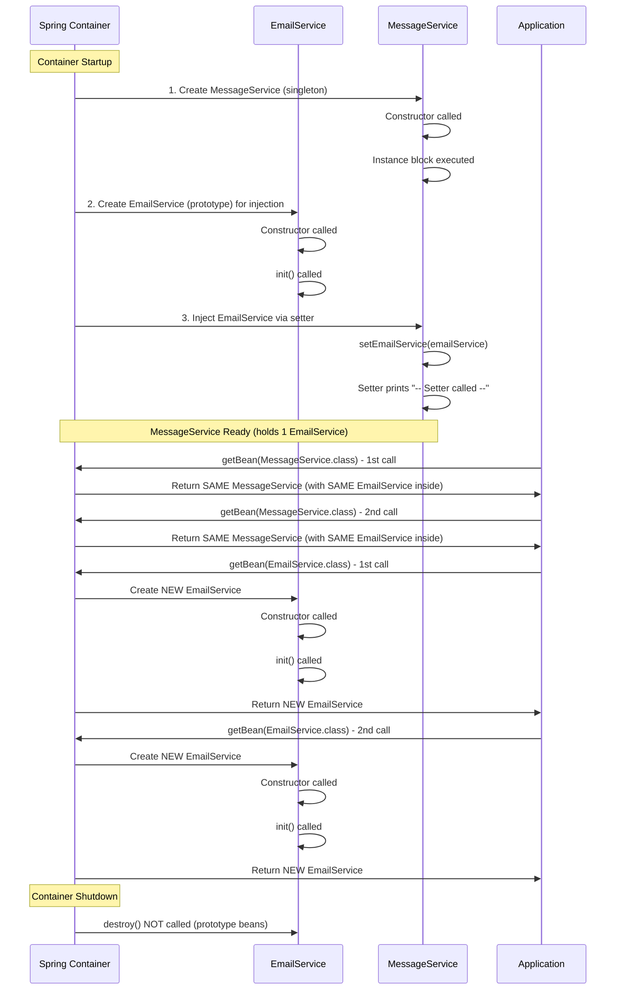

**Output:**
```
-- Starting Message Service --
Email constructor called
Init Method Called
-- Setter called --

Message is Sent !!
Send Through Mail !!
-- Exiting Mail Service --
-- Exiting Message Service --

--- Checking for Bean Scope ---
-- PROTOTYPE --
org.example.services.MessageService@1a2b3c4d
org.example.services.MessageService@1a2b3c4d  ← SAME MessageService
org.example.services.MessageService@1a2b3c4d  ← SAME MessageService

-- PROTOTYPE --
Email constructor called
Init Method Called
org.example.services.EmailService@5e6f7g8h

Email constructor called
Init Method Called
org.example.services.EmailService@9i0j1k2l  ← DIFFERENT EmailService

Email constructor called
Init Method Called
org.example.services.EmailService@3m4n5o6p  ← DIFFERENT EmailService

(No destroy output - prototype beans not destroyed)
```

**Key Points:**
- ✅ MessageService created once (singleton)
- ✅ First EmailService created for injection into MessageService
- ✅ MessageService always uses the SAME EmailService instance
- ✅ Each getBean(EmailService.class) creates NEW EmailService
- ❌ destroy() NOT called (prototype beans)

**Important Observation:**
```java
MessageService msg = context.getBean(MessageService.class);
msg.sendMessage();  // Uses EmailService@5e6f7g8h (injected at startup)

EmailService email1 = context.getBean(EmailService.class);  // Creates EmailService@9i0j1k2l
EmailService email2 = context.getBean(EmailService.class);  // Creates EmailService@3m4n5o6p

// MessageService still uses EmailService@5e6f7g8h (cannot change)
```

**Problem:** MessageService is "stuck" with the first EmailService instance. Even though EmailService is prototype, MessageService always uses the same one.

**Solution:** Use method injection or lookup method (advanced topic).

---

#### Constructor Injection Flow

**XML Configuration:**
```xml
<bean id="msgSrv" scope="singleton" class="org.example.services.MessageService">
    <constructor-arg ref="emlSrv"/>
</bean>
<bean id="emlSrv" scope="prototype" init-method="init" destroy-method="destroy" 
      class="org.example.services.EmailService"/>
```

**Output:**
```
Email constructor called
Init Method Called
-- Constructor called --

Message is Sent !!
Send Through Mail !!
-- Exiting Mail Service --

--- Checking for Bean Scope ---
org.example.services.MessageService@1a2b3c4d
org.example.services.MessageService@1a2b3c4d  ← SAME
org.example.services.MessageService@1a2b3c4d  ← SAME

Email constructor called
Init Method Called
org.example.services.EmailService@5e6f7g8h

Email constructor called
Init Method Called
org.example.services.EmailService@9i0j1k2l  ← DIFFERENT

Email constructor called
Init Method Called
org.example.services.EmailService@3m4n5o6p  ← DIFFERENT

(No destroy output)
```

**Same behavior as setter injection.**

---

### 🔍 Case 3: MessageService=Prototype, EmailService=Singleton

**XML Configuration:**
```xml
<bean id="msgSrv" scope="prototype" class="org.example.services.MessageService">
    <property ref="emlSrv" name="EmailService"/>
</bean>
<bean id="emlSrv" scope="singleton" init-method="init" destroy-method="destroy" 
      class="org.example.services.EmailService"/>
```

#### Setter Injection Flow

**Step-by-Step Execution:**

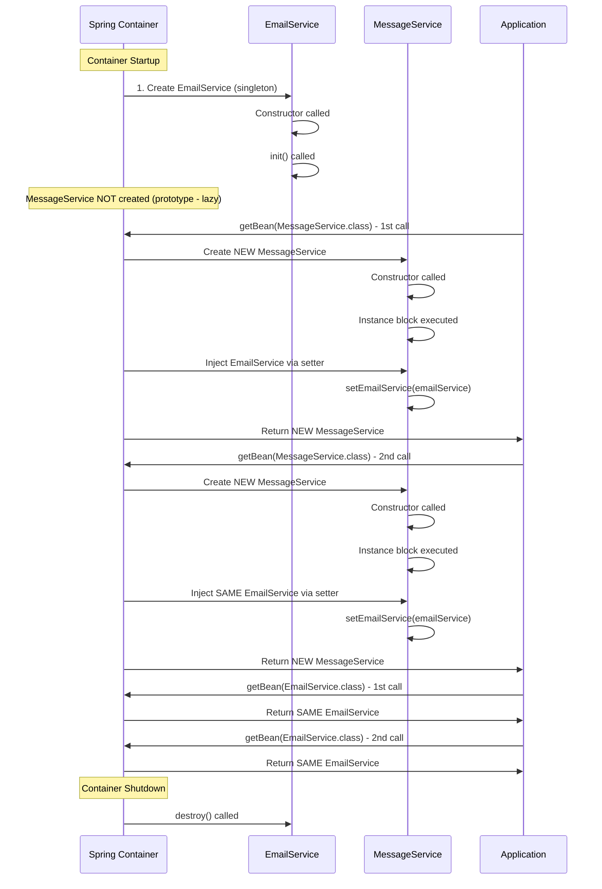

**Output:**
```
Email constructor called
Init Method Called

-- Starting Message Service --
-- Setter called --
Message is Sent !!
Send Through Mail !!
-- Exiting Mail Service --
-- Exiting Message Service --

--- Checking for Bean Scope ---
-- PROTOTYPE --
-- Starting Message Service --
-- Setter called --
org.example.services.MessageService@1a2b3c4d

-- Starting Message Service --
-- Setter called --
org.example.services.MessageService@5e6f7g8h  ← DIFFERENT MessageService

-- Starting Message Service --
-- Setter called --
org.example.services.MessageService@9i0j1k2l  ← DIFFERENT MessageService

-- PROTOTYPE --
org.example.services.EmailService@3m4n5o6p
org.example.services.EmailService@3m4n5o6p  ← SAME EmailService
org.example.services.EmailService@3m4n5o6p  ← SAME EmailService

Destroy Method Called
```

**Key Points:**
- ✅ EmailService created once at startup (singleton)
- ✅ MessageService created on each getBean() call (prototype)
- ✅ Each MessageService gets the SAME EmailService injected
- ✅ Setter called for each new MessageService
- ✅ destroy() called on EmailService (singleton)

**Observation:**
```java
MessageService msg1 = context.getBean(MessageService.class);  // New MessageService
MessageService msg2 = context.getBean(MessageService.class);  // New MessageService
MessageService msg3 = context.getBean(MessageService.class);  // New MessageService

// All three MessageService instances share the SAME EmailService
```

**Use Case:** Multiple message processors sharing a single email sender.

---

#### Constructor Injection Flow

**XML Configuration:**
```xml
<bean id="msgSrv" scope="prototype" class="org.example.services.MessageService">
    <constructor-arg ref="emlSrv"/>
</bean>
<bean id="emlSrv" scope="singleton" init-method="init" destroy-method="destroy" 
      class="org.example.services.EmailService"/>
```

**Output:**
```
Email constructor called
Init Method Called

-- Constructor called --
Message is Sent !!
Send Through Mail !!
-- Exiting Mail Service --

--- Checking for Bean Scope ---
-- Constructor called --
org.example.services.MessageService@1a2b3c4d

-- Constructor called --
org.example.services.MessageService@5e6f7g8h  ← DIFFERENT

-- Constructor called --
org.example.services.MessageService@9i0j1k2l  ← DIFFERENT

org.example.services.EmailService@3m4n5o6p
org.example.services.EmailService@3m4n5o6p  ← SAME
org.example.services.EmailService@3m4n5o6p  ← SAME

Destroy Method Called
```

**Same behavior, but constructor called instead of setter.**

---

### 🔍 Case 4: Both Prototype

**XML Configuration:**
```xml
<bean id="msgSrv" scope="prototype" class="org.example.services.MessageService">
    <property ref="emlSrv" name="EmailService"/>
</bean>
<bean id="emlSrv" scope="prototype" init-method="init" destroy-method="destroy" 
      class="org.example.services.EmailService"/>
```

#### Setter Injection Flow

**Step-by-Step Execution:**

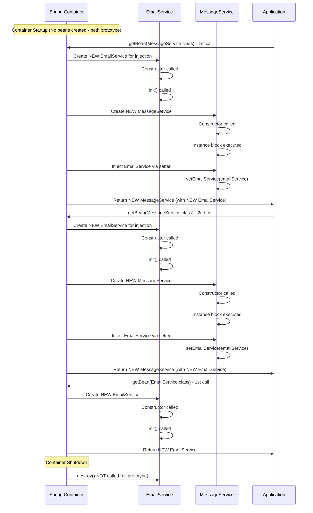

**Output:**
```
-- Starting Message Service --
Email constructor called
Init Method Called
-- Setter called --

Message is Sent !!
Send Through Mail !!
-- Exiting Mail Service --
-- Exiting Message Service --

--- Checking for Bean Scope ---
-- PROTOTYPE --
-- Starting Message Service --
Email constructor called
Init Method Called
-- Setter called --
org.example.services.MessageService@1a2b3c4d

-- Starting Message Service --
Email constructor called
Init Method Called
-- Setter called --
org.example.services.MessageService@5e6f7g8h  ← DIFFERENT MessageService

-- Starting Message Service --
Email constructor called
Init Method Called
-- Setter called --
org.example.services.MessageService@9i0j1k2l  ← DIFFERENT MessageService

-- PROTOTYPE --
Email constructor called
Init Method Called
org.example.services.EmailService@3m4n5o6p

Email constructor called
Init Method Called
org.example.services.EmailService@7q8r9s0t  ← DIFFERENT EmailService

Email constructor called
Init Method Called
org.example.services.EmailService@1u2v3w4x  ← DIFFERENT EmailService

(No destroy output - all prototype)
```

**Key Points:**
- ✅ No beans created at startup (both prototype)
- ✅ Each getBean(MessageService) creates NEW MessageService
- ✅ Each MessageService gets NEW EmailService injected
- ✅ Each getBean(EmailService) creates NEW EmailService
- ❌ destroy() NOT called (all prototype)

**Observation:**
```java
MessageService msg1 = context.getBean(MessageService.class);  
// Creates: MessageService@1a2b3c4d with EmailService@aaa

MessageService msg2 = context.getBean(MessageService.class);  
// Creates: MessageService@5e6f7g8h with EmailService@bbb

EmailService email1 = context.getBean(EmailService.class);  
// Creates: EmailService@3m4n5o6p (independent)

// Total EmailService instances created: 5
// (2 for MessageService injection + 3 direct getBean calls)
```

**Use Case:** Completely isolated instances, no sharing.

---

#### Constructor Injection Flow

**XML Configuration:**
```xml
<bean id="msgSrv" scope="prototype" class="org.example.services.MessageService">
    <constructor-arg ref="emlSrv"/>
</bean>
<bean id="emlSrv" scope="prototype" init-method="init" destroy-method="destroy" 
      class="org.example.services.EmailService"/>
```

**Output:**
```
Email constructor called
Init Method Called
-- Constructor called --

Message is Sent !!
Send Through Mail !!
-- Exiting Mail Service --

--- Checking for Bean Scope ---
Email constructor called
Init Method Called
-- Constructor called --
org.example.services.MessageService@1a2b3c4d

Email constructor called
Init Method Called
-- Constructor called --
org.example.services.MessageService@5e6f7g8h  ← DIFFERENT

Email constructor called
Init Method Called
-- Constructor called --
org.example.services.MessageService@9i0j1k2l  ← DIFFERENT

Email constructor called
Init Method Called
org.example.services.EmailService@3m4n5o6p

Email constructor called
Init Method Called
org.example.services.EmailService@7q8r9s0t  ← DIFFERENT

Email constructor called
Init Method Called
org.example.services.EmailService@1u2v3w4x  ← DIFFERENT

(No destroy output)
```

**Same behavior, constructor called instead of setter.**

---

### 📊 Scope Combinations Summary

| Case | MessageService | EmailService | MessageService Instances | EmailService Instances | destroy() Called |
|:-----|:--------------|:-------------|:------------------------|:----------------------|:----------------|
| **1** | Singleton | Singleton | 1 | 1 | ✅ Yes (both) |
| **2** | Singleton | Prototype | 1 | 1 (in MessageService) + N (direct calls) | ❌ No |
| **3** | Prototype | Singleton | N | 1 (shared) | ✅ Yes (EmailService) |
| **4** | Prototype | Prototype | N | N (each MessageService gets new) + M (direct calls) | ❌ No |

**Visual Summary:**

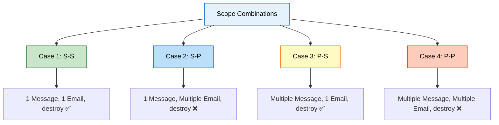

---

## 9. PROJECT STRUCTURE & IMPLEMENTATION

<div align="center">

</div>

### 📁 Project Structure

```
XML_BasedConfiguration/
├── src/
│   ├── main/
│   │   ├── java/
│   │   │   └── org/
│   │   │       └── example/
│   │   │           ├── App.java                    # Main class
│   │   │           └── services/
│   │   │               ├── MessageService.java     # Dependent bean
│   │   │               └── EmailService.java       # Dependency bean
│   │   └── resources/
│   │       └── bean.xml                            # Spring configuration
│   └── test/
│       └── java/
│           └── org/
│               └── example/
│                   └── AppTest.java
├── pom.xml                                         # Maven configuration
└── README.md
```

---

### 🔍 Code Implementation

#### 1️⃣ EmailService (Dependency)

**Reference:** [EmailService.java](src/main/java/org/example/services/EmailService.java)

```java
package org.example.services;

public class EmailService {
    
    public EmailService() {
        System.out.println("Email constructor called");
    }
    
    public void init() {
        System.out.println("Init Method Called");
    }
    
    public void destroy() {
        System.out.println("Destroy Method Called");
    }
    
    public void sendMail() {
        System.out.println("Send Through Mail !!");
        System.out.println("-- Exiting Mail Service --");
    }
}
```

**Key Points:**
- Simple POJO (Plain Old Java Object)
- No Spring annotations
- Lifecycle methods: init() and destroy()
- Business method: sendMail()

---

#### 2️⃣ MessageService (Dependent Bean)

**Reference:** [MessageService.java](src/main/java/org/example/services/MessageService.java)

```java
package org.example.services;

public class MessageService {
    private EmailService emailService;
    
    {
        System.out.println("-- Starting Message Service --");
    }
    
    // Setter injection
    public void setEmailService(EmailService emailService) {
        System.out.println("-- Setter called --");
        this.emailService = emailService;
    }
    
    public void sendMessage() {
        System.out.println("Message is Sent !!");
        emailService.sendMail();
        System.out.println("-- Exiting Message Service --");
    }
}
```

**Key Points:**
- Depends on EmailService
- Instance initialization block for logging
- Setter method for dependency injection
- Business method delegates to EmailService

---

#### 3️⃣ Spring XML Configuration

**Reference:** [bean.xml](src/main/resources/bean.xml)

```xml
<?xml version="1.0" encoding="UTF-8"?>
<beans xmlns="http://www.springframework.org/schema/beans"
       xmlns:xsi="http://www.w3.org/2001/XMLSchema-instance"
       xsi:schemaLocation="
       http://www.springframework.org/schema/beans 
       https://www.springframework.org/schema/beans/spring-beans.xsd">

    <!-- MessageService bean with setter injection -->
    <bean id="msgSrv" class="org.example.services.MessageService">
        <property ref="emlSrv" name="EmailService"/>
    </bean>
    
    <!-- EmailService bean with prototype scope and lifecycle methods -->
    <bean id="emlSrv" 
          scope="prototype" 
          init-method="init" 
          destroy-method="destroy" 
          class="org.example.services.EmailService"/>
</beans>
```

**XML Elements Explained:**

**`<beans>`:** Root element
- Defines Spring bean container
- Contains all bean definitions

**`<bean>`:** Bean definition
- `id`: Unique identifier for the bean
- `class`: Fully qualified class name
- `scope`: Bean scope (singleton/prototype)
- `init-method`: Method to call after initialization
- `destroy-method`: Method to call before destruction

**`<property>`:** Setter injection
- `name`: Property name (setter method without "set")
- `ref`: Reference to another bean

---

#### 4️⃣ Main Application

**Reference:** [App.java](src/main/java/org/example/App.java)

```java
package org.example;

import org.example.services.EmailService;
import org.example.services.MessageService;
import org.springframework.context.ApplicationContext;
import org.springframework.context.support.ClassPathXmlApplicationContext;

public class App {
    public static void main(String[] args) {
        // Load Spring configuration
        ApplicationContext context = 
            new ClassPathXmlApplicationContext("bean.xml");
        
        // Get MessageService bean
        MessageService messageService = context.getBean(MessageService.class);
        messageService.sendMessage();
        
        // Test bean scopes
        System.out.println("\n--- Checking for Bean Scope ---");
        System.out.println("-- PROTOTYPE --");
        
        MessageService messageService02 = context.getBean(MessageService.class);
        MessageService messageService03 = context.getBean(MessageService.class);
        System.out.println(messageService);
        System.out.println(messageService02);
        System.out.println(messageService03);
        
        System.out.println("\n-- PROTOTYPE --");
        EmailService emailService = context.getBean(EmailService.class);
        EmailService emailService02 = context.getBean(EmailService.class);
        EmailService emailService03 = context.getBean(EmailService.class);
        System.out.println(emailService);
        System.out.println(emailService02);
        System.out.println(emailService03);
        
        // Close container
        ((ClassPathXmlApplicationContext)context).close();
    }
}
```

**Execution Flow:**
1. Load XML configuration
2. Spring creates beans based on configuration
3. Get MessageService bean
4. Call business method
5. Test bean scopes
6. Close container (triggers destroy methods)

---

#### 5️⃣ Maven Configuration

**Reference:** [pom.xml](pom.xml)

```xml
<dependencies>
    <!-- Spring Context -->
    <dependency>
        <groupId>org.springframework</groupId>
        <artifactId>spring-context</artifactId>
        <version>7.0.3</version>
    </dependency>
</dependencies>
```

**Key Dependency:**
- `spring-context`: Core Spring IoC container

---

## 10. INTERNAL WORKING MECHANISM

<div align="center">

</div>

### 📌 How Spring Container Works

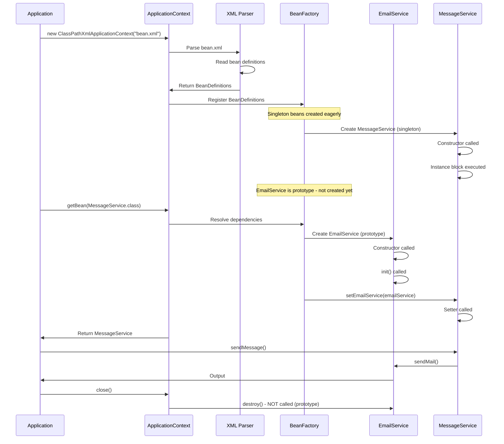

### 🔍 Step-by-Step Internal Process

#### Step 1: Container Initialization

```java
ApplicationContext context = new ClassPathXmlApplicationContext("bean.xml");
```

**What Happens:**
1. **Locate XML file:** Spring looks for `bean.xml` in classpath
2. **Parse XML:** DOM/SAX parser reads XML structure
3. **Create BeanDefinitions:** Each `<bean>` becomes a BeanDefinition object
4. **Register BeanDefinitions:** Stored in BeanFactory registry

**Memory State:**
```
BeanFactory Registry:
  msgSrv -> BeanDefinition {
    class: MessageService
    scope: singleton
    properties: [EmailService -> ref(emlSrv)]
  }
  
  emlSrv -> BeanDefinition {
    class: EmailService
    scope: prototype
    init-method: init
    destroy-method: destroy
  }
```

---

#### Step 2: Singleton Bean Creation

**For Singleton Beans (Eager Initialization):**

```java
// Spring automatically creates singleton beans
```

**Process:**
1. **Instantiate:** Call constructor
2. **Populate Properties:** Inject dependencies
3. **Initialize:** Call init-method
4. **Store:** Cache in singleton registry

**For MessageService:**
```
1. new MessageService()  // Constructor
2. Instance block executed
3. Dependencies not yet injected (EmailService is prototype)
4. Stored in singleton cache
```

---

#### Step 3: Dependency Resolution

```java
MessageService messageService = context.getBean(MessageService.class);
```

**Process:**
1. **Check Cache:** Is MessageService already created? Yes (singleton)
2. **Resolve Dependencies:** Does it need EmailService? Yes
3. **Create Dependency:** EmailService is prototype, create new instance
4. **Inject Dependency:** Call setEmailService()
5. **Return Bean:** MessageService is ready

**Detailed Flow:**
```
getBean(MessageService.class)
  ├─> Check singleton cache
  │   └─> Found: MessageService@1a2b3c4d
  ├─> Check dependencies
  │   └─> Needs: EmailService
  ├─> Create EmailService (prototype)
  │   ├─> new EmailService()
  │   └─> init() called
  ├─> Inject via setter
  │   └─> messageService.setEmailService(emailService)
  └─> Return MessageService@1a2b3c4d
```

---

#### Step 4: Prototype Bean Creation

```java
EmailService email1 = context.getBean(EmailService.class);
EmailService email2 = context.getBean(EmailService.class);
```

**Process:**
1. **No Cache Check:** Prototype beans are never cached
2. **Create New Instance:** Every time
3. **Initialize:** Call init-method
4. **Return:** New instance
5. **No Tracking:** Spring doesn't track prototype beans

**Flow:**
```
getBean(EmailService.class) - Call 1
  ├─> Prototype scope detected
  ├─> Create new instance
  │   ├─> new EmailService()
  │   └─> init() called
  └─> Return EmailService@5e6f7g8h

getBean(EmailService.class) - Call 2
  ├─> Prototype scope detected
  ├─> Create new instance
  │   ├─> new EmailService()
  │   └─> init() called
  └─> Return EmailService@9i0j1k2l  (DIFFERENT)
```

---

#### Step 5: Container Shutdown

```java
((ClassPathXmlApplicationContext)context).close();
```

**Process:**
1. **Publish Shutdown Event:** Notify listeners
2. **Destroy Singleton Beans:** Call destroy-method
3. **Skip Prototype Beans:** Not tracked, not destroyed
4. **Release Resources:** Close container

**Flow:**
```
context.close()
  ├─> Publish ContextClosedEvent
  ├─> Get all singleton beans
  ├─> For each singleton:
  │   ├─> Call @PreDestroy methods
  │   ├─> Call DisposableBean.destroy()
  │   └─> Call custom destroy-method
  ├─> Prototype beans: IGNORED
  └─> Close container
```

**Why Prototype Beans Not Destroyed:**
- Spring creates them on demand
- Spring hands them over to you
- You are responsible for cleanup
- Spring doesn't track them after creation

---

### 🧠 Memory Management

**Singleton Beans:**
```
Heap:
  Spring Container {
    Singleton Cache {
      msgSrv -> MessageService@1a2b3c4d {
        emailService -> EmailService@5e6f7g8h
      }
    }
  }
```

**Prototype Beans:**
```
Heap:
  EmailService@9i0j1k2l  (created by getBean call 1)
  EmailService@3m4n5o6p  (created by getBean call 2)
  EmailService@7q8r9s0t  (created by getBean call 3)
  
  (No references in Spring container)
```

---

### 🎯 Bean Creation Order

**Dependency Graph:**
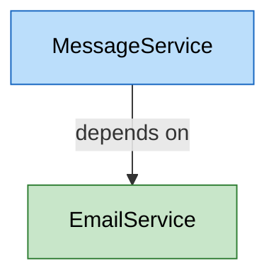

**Creation Order:**
1. **EmailService** (dependency) - Created first when needed
2. **MessageService** (dependent) - Created after dependency

**Why This Order:**
- Spring resolves dependencies recursively
- Dependencies must exist before dependent beans
- Circular dependencies cause errors

---

## 11. REAL-WORLD EXAMPLES

<div align="center">

</div>

### 🌐 Example 1: E-Commerce Application

**Scenario:** Online shopping platform with order processing.

**XML Configuration:**
```xml
<?xml version="1.0" encoding="UTF-8"?>
<beans xmlns="http://www.springframework.org/schema/beans"
       xmlns:xsi="http://www.w3.org/2001/XMLSchema-instance"
       xsi:schemaLocation="
       http://www.springframework.org/schema/beans 
       https://www.springframework.org/schema/beans/spring-beans.xsd">

    <!-- Database Connection Pool (Singleton) -->
    <bean id="dataSource" class="com.example.HikariDataSource" 
          init-method="initialize" 
          destroy-method="close">
        <property name="url" value="jdbc:mysql://localhost:3306/ecommerce"/>
        <property name="username" value="root"/>
        <property name="password" value="password"/>
    </bean>
    
    <!-- Product Repository (Singleton) -->
    <bean id="productRepository" class="com.example.ProductRepository">
        <property name="dataSource" ref="dataSource"/>
    </bean>
    
    <!-- Order Service (Singleton) -->
    <bean id="orderService" class="com.example.OrderService">
        <property name="productRepository" ref="productRepository"/>
        <property name="paymentGateway" ref="paymentGateway"/>
    </bean>
    
    <!-- Payment Gateway (Singleton) -->
    <bean id="paymentGateway" class="com.example.PaymentGateway">
        <property name="apiKey" value="sk_test_123456"/>
    </bean>
    
    <!-- Shopping Cart (Prototype - one per user) -->
    <bean id="shoppingCart" scope="prototype" class="com.example.ShoppingCart"/>
    
    <!-- Order (Prototype - one per order) -->
    <bean id="order" scope="prototype" class="com.example.Order">
        <property name="orderService" ref="orderService"/>
    </bean>
</beans>
```

**Why These Scopes:**
- **DataSource (Singleton):** One connection pool for entire application
- **Repositories (Singleton):** Stateless, can be shared
- **Services (Singleton):** Stateless business logic
- **ShoppingCart (Prototype):** Each user needs their own cart
- **Order (Prototype):** Each order is unique

---

### 🏦 Example 2: Banking Application

**Scenario:** Bank system with account management.

**XML Configuration:**
```xml
<beans>
    <!-- Database Connection (Singleton) -->
    <bean id="dbConnection" class="com.bank.DatabaseConnection" 
          scope="singleton"
          init-method="connect" 
          destroy-method="disconnect">
        <property name="url" value="jdbc:oracle:thin:@localhost:1521:BANK"/>
    </bean>
    
    <!-- Account Repository (Singleton) -->
    <bean id="accountRepository" class="com.bank.AccountRepository">
        <constructor-arg ref="dbConnection"/>
    </bean>
    
    <!-- Transaction Manager (Singleton) -->
    <bean id="transactionManager" class="com.bank.TransactionManager">
        <property name="accountRepository" ref="accountRepository"/>
    </bean>
    
    <!-- Account Service (Singleton) -->
    <bean id="accountService" class="com.bank.AccountService">
        <constructor-arg ref="accountRepository"/>
        <constructor-arg ref="transactionManager"/>
    </bean>
    
    <!-- Transaction (Prototype - one per transaction) -->
    <bean id="transaction" scope="prototype" class="com.bank.Transaction">
        <property name="transactionManager" ref="transactionManager"/>
    </bean>
    
    <!-- Account Statement (Prototype - generated per request) -->
    <bean id="accountStatement" scope="prototype" 
          class="com.bank.AccountStatement">
        <property name="accountService" ref="accountService"/>
    </bean>
</beans>
```

**Usage:**
```java
// Get singleton services
AccountService accountService = context.getBean(AccountService.class);

// Create new transaction (prototype)
Transaction transaction1 = context.getBean(Transaction.class);
transaction1.setAmount(1000.00);
transaction1.setType("DEPOSIT");

Transaction transaction2 = context.getBean(Transaction.class);
transaction2.setAmount(500.00);
transaction2.setType("WITHDRAWAL");

// Each transaction is independent
```

---

### 📧 Example 3: Email Marketing System

**Scenario:** Bulk email sender with templates.

**XML Configuration:**
```xml
<beans>
    <!-- SMTP Configuration (Singleton) -->
    <bean id="smtpConfig" class="com.email.SMTPConfig">
        <property name="host" value="smtp.gmail.com"/>
        <property name="port" value="587"/>
        <property name="username" value="marketing@company.com"/>
        <property name="password" value="secret"/>
    </bean>
    
    <!-- Email Sender (Singleton) -->
    <bean id="emailSender" class="com.email.EmailSender" 
          init-method="connect" 
          destroy-method="disconnect">
        <constructor-arg ref="smtpConfig"/>
    </bean>
    
    <!-- Template Engine (Singleton) -->
    <bean id="templateEngine" class="com.email.TemplateEngine">
        <property name="templatePath" value="/templates/"/>
    </bean>
    
    <!-- Campaign Service (Singleton) -->
    <bean id="campaignService" class="com.email.CampaignService">
        <property name="emailSender" ref="emailSender"/>
        <property name="templateEngine" ref="templateEngine"/>
    </bean>
    
    <!-- Email Message (Prototype - one per email) -->
    <bean id="emailMessage" scope="prototype" class="com.email.EmailMessage">
        <property name="templateEngine" ref="templateEngine"/>
    </bean>
    
    <!-- Campaign (Prototype - one per campaign) -->
    <bean id="campaign" scope="prototype" class="com.email.Campaign">
        <property name="campaignService" ref="campaignService"/>
    </bean>
</beans>
```

**Usage:**
```java
CampaignService campaignService = context.getBean(CampaignService.class);

// Create campaign (prototype)
Campaign campaign = context.getBean(Campaign.class);
campaign.setName("Black Friday Sale");

// Create emails (prototype)
for (User user : users) {
    EmailMessage email = context.getBean(EmailMessage.class);
    email.setRecipient(user.getEmail());
    email.setTemplate("black-friday.html");
    email.setData(user);
    campaign.addEmail(email);
}

campaignService.send(campaign);
```

---

### 🎮 Example 4: Gaming Platform

**Scenario:** Multiplayer game server.

**XML Configuration:**
```xml
<beans>
    <!-- Game Server (Singleton) -->
    <bean id="gameServer" class="com.game.GameServer" 
          init-method="start" 
          destroy-method="stop">
        <property name="port" value="8080"/>
        <property name="maxPlayers" value="1000"/>
    </bean>
    
    <!-- Player Repository (Singleton) -->
    <bean id="playerRepository" class="com.game.PlayerRepository">
        <constructor-arg ref="dataSource"/>
    </bean>
    
    <!-- Leaderboard (Singleton) -->
    <bean id="leaderboard" class="com.game.Leaderboard">
        <property name="playerRepository" ref="playerRepository"/>
    </bean>
    
    <!-- Player Session (Prototype - one per player) -->
    <bean id="playerSession" scope="prototype" class="com.game.PlayerSession">
        <property name="gameServer" ref="gameServer"/>
    </bean>
    
    <!-- Game Match (Prototype - one per match) -->
    <bean id="gameMatch" scope="prototype" class="com.game.GameMatch">
        <property name="leaderboard" ref="leaderboard"/>
    </bean>
    
    <!-- Player Inventory (Prototype - one per player) -->
    <bean id="playerInventory" scope="prototype" class="com.game.PlayerInventory"/>
</beans>
```

---

### 🏥 Example 5: Hospital Management System

**Scenario:** Patient management and appointment scheduling.

**XML Configuration:**
```xml
<beans>
    <!-- Database (Singleton) -->
    <bean id="hospitalDB" class="com.hospital.HospitalDatabase" 
          init-method="initialize" 
          destroy-method="cleanup">
        <property name="url" value="jdbc:postgresql://localhost:5432/hospital"/>
    </bean>
    
    <!-- Patient Repository (Singleton) -->
    <bean id="patientRepository" class="com.hospital.PatientRepository">
        <constructor-arg ref="hospitalDB"/>
    </bean>
    
    <!-- Doctor Repository (Singleton) -->
    <bean id="doctorRepository" class="com.hospital.DoctorRepository">
        <constructor-arg ref="hospitalDB"/>
    </bean>
    
    <!-- Appointment Service (Singleton) -->
    <bean id="appointmentService" class="com.hospital.AppointmentService">
        <property name="patientRepository" ref="patientRepository"/>
        <property name="doctorRepository" ref="doctorRepository"/>
    </bean>
    
    <!-- Patient Record (Prototype - one per patient visit) -->
    <bean id="patientRecord" scope="prototype" class="com.hospital.PatientRecord">
        <property name="patientRepository" ref="patientRepository"/>
    </bean>
    
    <!-- Prescription (Prototype - one per prescription) -->
    <bean id="prescription" scope="prototype" class="com.hospital.Prescription">
        <property name="patientRecord" ref="patientRecord"/>
    </bean>
    
    <!-- Appointment (Prototype - one per appointment) -->
    <bean id="appointment" scope="prototype" class="com.hospital.Appointment">
        <property name="appointmentService" ref="appointmentService"/>
    </bean>
</beans>
```

---

### 📊 Scope Selection Guidelines

| Component Type | Recommended Scope | Reason |
|:--------------|:-----------------|:-------|
| **Database Connections** | Singleton | Expensive to create, shared resource |
| **Repositories/DAOs** | Singleton | Stateless, thread-safe |
| **Services** | Singleton | Stateless business logic |
| **Controllers** | Singleton | Stateless request handlers |
| **Utilities** | Singleton | Stateless helper classes |
| **User Sessions** | Prototype | User-specific state |
| **Shopping Carts** | Prototype | User-specific data |
| **Transactions** | Prototype | Unique per operation |
| **Reports** | Prototype | Generated per request |
| **Form Data** | Prototype | Request-specific |

---

## 12. BEST PRACTICES

<div align="center">

</div>

### 🎯 XML Configuration Best Practices

#### 1. Use Meaningful Bean IDs

**✅ Good:**
```xml
<bean id="userService" class="com.example.UserService"/>
<bean id="emailNotificationService" class="com.example.EmailNotificationService"/>
```

**❌ Bad:**
```xml
<bean id="us" class="com.example.UserService"/>
<bean id="bean1" class="com.example.EmailNotificationService"/>
```

---

#### 2. Organize Beans Logically

**✅ Good:**
```xml
<beans>
    <!-- Data Access Layer -->
    <bean id="dataSource" class="..."/>
    <bean id="userRepository" class="..."/>
    <bean id="orderRepository" class="..."/>
    
    <!-- Service Layer -->
    <bean id="userService" class="..."/>
    <bean id="orderService" class="..."/>
    
    <!-- Presentation Layer -->
    <bean id="userController" class="..."/>
</beans>
```

---

#### 3. Use Constructor Injection for Required Dependencies

**✅ Good:**
```xml
<bean id="orderService" class="com.example.OrderService">
    <constructor-arg ref="orderRepository"/>
    <constructor-arg ref="paymentGateway"/>
</bean>
```

**❌ Bad (for required dependencies):**
```xml
<bean id="orderService" class="com.example.OrderService">
    <property name="orderRepository" ref="orderRepository"/>
    <property name="paymentGateway" ref="paymentGateway"/>
</bean>
```

---

#### 4. Externalize Configuration

**✅ Good:**
```xml
<!-- Load properties file -->
<context:property-placeholder location="classpath:application.properties"/>

<bean id="dataSource" class="com.example.DataSource">
    <property name="url" value="${db.url}"/>
    <property name="username" value="${db.username}"/>
    <property name="password" value="${db.password}"/>
</bean>
```

**application.properties:**
```properties
db.url=jdbc:mysql://localhost:3306/mydb
db.username=root
db.password=secret
```

---

#### 5. Use Appropriate Scopes

**✅ Good:**
```xml
<!-- Stateless service - singleton -->
<bean id="userService" scope="singleton" class="com.example.UserService"/>

<!-- User-specific data - prototype -->
<bean id="shoppingCart" scope="prototype" class="com.example.ShoppingCart"/>
```

**❌ Bad:**
```xml
<!-- Stateful data as singleton - WRONG! -->
<bean id="shoppingCart" scope="singleton" class="com.example.ShoppingCart"/>
```

---

#### 6. Always Define Lifecycle Methods

**✅ Good:**
```xml
<bean id="dataSource" 
      class="com.example.DataSource"
      init-method="connect"
      destroy-method="disconnect"/>
```

**Why:**
- Proper resource initialization
- Clean resource cleanup
- Prevents resource leaks

---

#### 7. Split Large Configuration Files

**✅ Good:**
```xml
<!-- applicationContext.xml -->
<beans>
    <import resource="data-access-config.xml"/>
    <import resource="service-config.xml"/>
    <import resource="web-config.xml"/>
</beans>
```

**Benefits:**
- Better organization
- Easier maintenance
- Team collaboration

---

#### 8. Use Profiles for Environment-Specific Configuration

**✅ Good:**
```xml
<beans profile="development">
    <bean id="dataSource" class="com.example.H2DataSource"/>
</beans>

<beans profile="production">
    <bean id="dataSource" class="com.example.MySQLDataSource"/>
</beans>
```

**Activation:**
```java
System.setProperty("spring.profiles.active", "development");
```

---

#### 9. Document Complex Configurations

**✅ Good:**
```xml
<beans>
    <!-- 
        User Service Configuration
        Dependencies: UserRepository, EmailService
        Scope: Singleton (stateless)
        Note: Requires database connection
    -->
    <bean id="userService" class="com.example.UserService">
        <constructor-arg ref="userRepository"/>
        <property name="emailService" ref="emailService"/>
    </bean>
</beans>
```

---

#### 10. Avoid Circular Dependencies

**❌ Bad:**
```xml
<bean id="beanA" class="com.example.BeanA">
    <property name="beanB" ref="beanB"/>
</bean>

<bean id="beanB" class="com.example.BeanB">
    <property name="beanA" ref="beanA"/>  <!-- Circular! -->
</bean>
```

**✅ Good:**
```xml
<!-- Extract common functionality to a third bean -->
<bean id="commonService" class="com.example.CommonService"/>

<bean id="beanA" class="com.example.BeanA">
    <property name="commonService" ref="commonService"/>
</bean>

<bean id="beanB" class="com.example.BeanB">
    <property name="commonService" ref="commonService"/>
</bean>
```

---

### 🔒 Security Best Practices

#### 1. Don't Hardcode Sensitive Data

**❌ Bad:**
```xml
<bean id="dataSource" class="com.example.DataSource">
    <property name="password" value="mySecretPassword123"/>
</bean>
```

**✅ Good:**
```xml
<bean id="dataSource" class="com.example.DataSource">
    <property name="password" value="${db.password}"/>
</bean>
```

**Use environment variables or encrypted properties.**

---

#### 2. Validate Bean Properties

**✅ Good:**
```java
public class DataSource {
    private String url;
    
    public void setUrl(String url) {
        if (url == null || url.isEmpty()) {
            throw new IllegalArgumentException("URL cannot be null or empty");
        }
        this.url = url;
    }
    
    public void init() {
        // Validate all required properties
        if (url == null) {
            throw new IllegalStateException("DataSource not properly configured");
        }
    }
}
```

---

### 🚀 Performance Best Practices

#### 1. Use Lazy Initialization for Heavy Beans

**✅ Good:**
```xml
<bean id="heavyService" 
      class="com.example.HeavyService"
      lazy-init="true"/>
```

**When to Use:**
- Expensive initialization
- Rarely used beans
- Optional features

---

#### 2. Prefer Singleton for Stateless Beans

**✅ Good:**
```xml
<!-- Stateless service - singleton (default) -->
<bean id="calculatorService" class="com.example.CalculatorService"/>
```

**Benefits:**
- Memory efficient
- Better performance
- Thread-safe if stateless

---

#### 3. Use Prototype Only When Necessary

**⚠️ Caution:**
```xml
<!-- Only use prototype for stateful beans -->
<bean id="userSession" scope="prototype" class="com.example.UserSession"/>
```

**Why:**
- Prototype beans are more expensive
- Created on every request
- Not cached

---

### 📝 Maintenance Best Practices

#### 1. Keep XML Files Small

**Guideline:** Max 200-300 lines per file

**Solution:** Split into multiple files
```xml
<import resource="data-config.xml"/>
<import resource="service-config.xml"/>
```

---

#### 2. Use Consistent Naming Conventions

**✅ Good:**
```xml
<bean id="userService" class="com.example.service.UserService"/>
<bean id="userRepository" class="com.example.repository.UserRepository"/>
<bean id="userController" class="com.example.controller.UserController"/>
```

**Pattern:** `{entity}{layer}`

---

#### 3. Version Control Your Configuration

**✅ Good:**
```xml
<!-- 
    Version: 2.0
    Last Modified: 2026-02-23
    Author: Avinash Dhanuka
    Changes: Added email notification service
-->
<beans>
    ...
</beans>
```

---

### 🎓 Migration Best Practices

#### When to Use XML Configuration

**✅ Use XML When:**
- Maintaining legacy applications
- Need external configuration
- Non-Java configuration required
- Team prefers XML

**❌ Avoid XML When:**
- Starting new projects (use annotations)
- Need type safety
- Want refactoring support
- Modern Spring Boot application

---

### 📊 Best Practices Summary

| Practice | Benefit | Priority |
|:---------|:--------|:---------|
| Meaningful bean IDs | Readability | High |
| Constructor injection | Immutability | High |
| Externalize config | Security | High |
| Appropriate scopes | Performance | High |
| Lifecycle methods | Resource management | High |
| Split large files | Maintainability | Medium |
| Use profiles | Flexibility | Medium |
| Document complex beans | Understanding | Medium |
| Avoid circular deps | Stability | High |
| Lazy initialization | Performance | Low |

---

## 13. TOP INTERVIEW QUESTIONS

<div align="center">

</div>

> **📝 Interview Preparation by:** Avinash Dhanuka

### Q1: What is XML-based configuration in Spring?

**Answer:**

XML-based configuration is Spring's traditional approach where bean definitions and their dependencies are declared in XML files. The Spring IoC container reads these XML files and creates/manages beans accordingly.

**Example:**
```xml
<bean id="userService" class="com.example.UserService">
    <property name="userRepository" ref="userRepository"/>
</bean>
```

**Key Points:**
- Externalized configuration
- No code changes needed for configuration updates
- Clear separation of concerns
- Good for legacy applications

---

### Q2: What is the difference between BeanFactory and ApplicationContext?

**Answer:**

| Feature | BeanFactory | ApplicationContext |
|:--------|:-----------|:------------------|
| **Initialization** | Lazy | Eager |
| **Event Publication** | ❌ No | ✅ Yes |
| **Internationalization** | ❌ No | ✅ Yes |
| **AOP** | ❌ Limited | ✅ Full |
| **Bean Post Processors** | Manual | Automatic |
| **Use Case** | Resource-constrained | Enterprise apps |

**Example:**
```java
// BeanFactory (basic)
BeanFactory factory = new XmlBeanFactory(new ClassPathResource("bean.xml"));

// ApplicationContext (advanced) - RECOMMENDED
ApplicationContext context = new ClassPathXmlApplicationContext("bean.xml");
```

**Recommendation:** Always use ApplicationContext in production.

---

### Q3: Explain bean scopes in Spring

**Answer:**

Bean scope defines the lifecycle and visibility of a bean.

**Main Scopes:**

**1. Singleton (Default):**
- One instance per container
- Shared across application
- Created at startup

```xml
<bean id="userService" scope="singleton" class="com.example.UserService"/>
```

**2. Prototype:**
- New instance per request
- Not shared
- Created on demand

```xml
<bean id="shoppingCart" scope="prototype" class="com.example.ShoppingCart"/>
```

**Web Scopes:**
- **Request:** One per HTTP request
- **Session:** One per HTTP session
- **Application:** One per ServletContext
- **WebSocket:** One per WebSocket

**When to Use:**
- Singleton: Stateless services, repositories
- Prototype: Stateful objects, user-specific data

---

### Q4: What is the bean lifecycle in Spring?

**Answer:**

**Lifecycle Phases:**

```mermaid
graph LR
    A[Instantiation] --> B[Populate Properties]
    B --> C[BeanNameAware]
    C --> D[BeanFactoryAware]
    D --> E[ApplicationContextAware]
    E --> F[Pre-Init BeanPostProcessors]
    F --> G[init-method]
    G --> H[Post-Init BeanPostProcessors]
    H --> I[Bean Ready]
    I --> J[destroy-method]
    
    style A fill:#fff9c4,stroke:#f57f17,color:#000
    style I fill:#c8e6c9,stroke:#2e7d32,color:#000
    style J fill:#ffccbc,stroke:#d84315,color:#000
```

**Example:**
```xml
<bean id="dataSource" 
      class="com.example.DataSource"
      init-method="connect"
      destroy-method="disconnect"/>
```

```java
public class DataSource {
    public void connect() {
        System.out.println("Connecting to database...");
    }
    
    public void disconnect() {
        System.out.println("Disconnecting from database...");
    }
}
```

**Important:** destroy-method is NOT called for prototype beans.

---

### Q5: What happens when a singleton bean depends on a prototype bean?

**Answer:**

**Problem:** Singleton bean gets only ONE instance of the prototype bean (at initialization).

**Example:**
```xml
<bean id="messageService" scope="singleton" class="com.example.MessageService">
    <property name="emailService" ref="emailService"/>
</bean>

<bean id="emailService" scope="prototype" class="com.example.EmailService"/>
```

**What Happens:**
```java
MessageService msg = context.getBean(MessageService.class);
// MessageService gets EmailService@123 (created once)

msg.sendMessage();  // Uses EmailService@123
msg.sendMessage();  // Uses EmailService@123 (SAME instance)
```

**Solutions:**

**1. Method Injection (Lookup Method):**
```xml
<bean id="messageService" class="com.example.MessageService">
    <lookup-method name="getEmailService" bean="emailService"/>
</bean>
```

**2. ApplicationContextAware:**
```java
public class MessageService implements ApplicationContextAware {
    private ApplicationContext context;
    
    public void setApplicationContext(ApplicationContext context) {
        this.context = context;
    }
    
    public void sendMessage() {
        EmailService email = context.getBean(EmailService.class);  // New instance
        email.sendMail();
    }
}
```

**3. ObjectFactory:**
```java
public class MessageService {
    @Autowired
    private ObjectFactory<EmailService> emailServiceFactory;
    
    public void sendMessage() {
        EmailService email = emailServiceFactory.getObject();  // New instance
        email.sendMail();
    }
}
```

---

### Q6: How do you inject dependencies in XML configuration?

**Answer:**

**Three Ways:**

**1. Constructor Injection:**
```xml
<bean id="userService" class="com.example.UserService">
    <constructor-arg ref="userRepository"/>
    <constructor-arg value="admin"/>
</bean>
```

```java
public class UserService {
    private UserRepository userRepository;
    private String role;
    
    public UserService(UserRepository userRepository, String role) {
        this.userRepository = userRepository;
        this.role = role;
    }
}
```

**2. Setter Injection:**
```xml
<bean id="userService" class="com.example.UserService">
    <property name="userRepository" ref="userRepository"/>
    <property name="role" value="admin"/>
</bean>
```

```java
public class UserService {
    private UserRepository userRepository;
    private String role;
    
    public void setUserRepository(UserRepository userRepository) {
        this.userRepository = userRepository;
    }
    
    public void setRole(String role) {
        this.role = role;
    }
}
```

**3. Field Injection (Not possible in pure XML):**
- Requires annotations (@Autowired)

**Recommendation:** Use constructor injection for required dependencies.

---

### Q7: What is the difference between ref and value in XML?

**Answer:**

**`ref`:** Reference to another bean

```xml
<bean id="userService" class="com.example.UserService">
    <property name="userRepository" ref="userRepository"/>  <!-- Bean reference -->
</bean>

<bean id="userRepository" class="com.example.UserRepository"/>
```

**`value`:** Literal value (String, int, boolean, etc.)

```xml
<bean id="dataSource" class="com.example.DataSource">
    <property name="url" value="jdbc:mysql://localhost:3306/mydb"/>
    <property name="port" value="3306"/>
    <property name="autoCommit" value="true"/>
</bean>
```

**Summary:**
- `ref`: For bean dependencies
- `value`: For primitive values and strings

---

### Q8: How do you handle circular dependencies in Spring?

**Answer:**

**Circular Dependency:** When two beans depend on each other.

**Example:**
```xml
<bean id="beanA" class="com.example.BeanA">
    <property name="beanB" ref="beanB"/>
</bean>

<bean id="beanB" class="com.example.BeanB">
    <property name="beanA" ref="beanA"/>  <!-- Circular! -->
</bean>
```

**Problem:** Spring cannot determine which bean to create first.

**Solutions:**

**1. Redesign (Best Solution):**
```xml
<!-- Extract common functionality -->
<bean id="commonService" class="com.example.CommonService"/>

<bean id="beanA" class="com.example.BeanA">
    <property name="commonService" ref="commonService"/>
</bean>

<bean id="beanB" class="com.example.BeanB">
    <property name="commonService" ref="commonService"/>
</bean>
```

**2. Use Setter Injection (Not Constructor):**
```xml
<!-- Setter injection allows circular dependencies -->
<bean id="beanA" class="com.example.BeanA">
    <property name="beanB" ref="beanB"/>
</bean>

<bean id="beanB" class="com.example.BeanB">
    <property name="beanA" ref="beanA"/>
</bean>
```

**Why Setter Works:**
- Spring creates both beans first
- Then injects dependencies via setters

**3. Use @Lazy:**
```java
@Component
public class BeanA {
    @Autowired
    @Lazy
    private BeanB beanB;
}
```

---

### Q9: What is lazy initialization in Spring?

**Answer:**

**Lazy Initialization:** Bean is created only when first requested, not at container startup.

**Default (Eager):**
```xml
<bean id="heavyService" class="com.example.HeavyService"/>
<!-- Created at container startup -->
```

**Lazy:**
```xml
<bean id="heavyService" class="com.example.HeavyService" lazy-init="true"/>
<!-- Created when first requested -->
```

**Global Lazy:**
```xml
<beans default-lazy-init="true">
    <!-- All beans are lazy -->
    <bean id="service1" class="com.example.Service1"/>
    <bean id="service2" class="com.example.Service2"/>
</beans>
```

**Pros:**
- Faster application startup
- Saves memory for unused beans

**Cons:**
- Slower first request
- Errors appear later (not at startup)

**When to Use:**
- Heavy initialization
- Rarely used beans
- Optional features

---

### Q10: How do you externalize configuration in Spring XML?

**Answer:**

**Using Property Placeholder:**

**1. Create properties file:**
```properties
# application.properties
db.url=jdbc:mysql://localhost:3306/mydb
db.username=root
db.password=secret
db.maxConnections=100
```

**2. Load in XML:**
```xml
<beans>
    <!-- Load properties file -->
    <context:property-placeholder location="classpath:application.properties"/>
    
    <!-- Use properties -->
    <bean id="dataSource" class="com.example.DataSource">
        <property name="url" value="${db.url}"/>
        <property name="username" value="${db.username}"/>
        <property name="password" value="${db.password}"/>
        <property name="maxConnections" value="${db.maxConnections}"/>
    </bean>
</beans>
```

**Benefits:**
- Externalized configuration
- Environment-specific values
- Security (passwords not in XML)
- Easy to change without recompiling

**Multiple Files:**
```xml
<context:property-placeholder 
    location="classpath:application.properties,classpath:database.properties"/>
```

---

### Q11: What is the difference between ClassPathXmlApplicationContext and FileSystemXmlApplicationContext?

**Answer:**

**ClassPathXmlApplicationContext:**
- Loads XML from classpath
- Looks in `src/main/resources`
- Relative to classpath root

```java
ApplicationContext context = 
    new ClassPathXmlApplicationContext("bean.xml");
// Looks for: src/main/resources/bean.xml
```

**FileSystemXmlApplicationContext:**
- Loads XML from file system
- Absolute or relative file path
- Relative to current working directory

```java
ApplicationContext context = 
    new FileSystemXmlApplicationContext("C:/config/bean.xml");
// Looks for: C:/config/bean.xml
```

**Comparison:**

| Aspect | ClassPathXml | FileSystemXml |
|:-------|:------------|:--------------|
| **Location** | Classpath | File system |
| **Path** | Relative to classpath | Absolute or relative |
| **Packaging** | Inside JAR/WAR | External file |
| **Use Case** | Application config | External config |
| **Portability** | ✅ High | ⚠️ Lower |

**Recommendation:** Use ClassPathXmlApplicationContext for most cases.

---

### Q12: How do you inject collections in Spring XML?

**Answer:**

**List:**
```xml
<bean id="userService" class="com.example.UserService">
    <property name="roles">
        <list>
            <value>ADMIN</value>
            <value>USER</value>
            <value>GUEST</value>
        </list>
    </property>
</bean>
```

**Set:**
```xml
<bean id="userService" class="com.example.UserService">
    <property name="permissions">
        <set>
            <value>READ</value>
            <value>WRITE</value>
            <value>DELETE</value>
        </set>
    </property>
</bean>
```

**Map:**
```xml
<bean id="config" class="com.example.Config">
    <property name="settings">
        <map>
            <entry key="timeout" value="30"/>
            <entry key="retries" value="3"/>
            <entry key="debug" value="true"/>
        </map>
    </property>
</bean>
```

**Properties:**
```xml
<bean id="config" class="com.example.Config">
    <property name="properties">
        <props>
            <prop key="url">http://example.com</prop>
            <prop key="port">8080</prop>
        </props>
    </property>
</bean>
```

**Bean References in Collections:**
```xml
<bean id="orderService" class="com.example.OrderService">
    <property name="paymentGateways">
        <list>
            <ref bean="paypal"/>
            <ref bean="stripe"/>
            <ref bean="razorpay"/>
        </list>
    </property>
</bean>
```

---

### Q13: What are the advantages and disadvantages of XML configuration?

**Answer:**

**Advantages:**

1. ✅ **Externalized Configuration:** No code changes needed
2. ✅ **Clear Separation:** Configuration separate from code
3. ✅ **Centralized:** All beans in one place
4. ✅ **No Recompilation:** Change XML without recompiling
5. ✅ **Legacy Support:** Good for maintaining old applications
6. ✅ **Non-Java Config:** Can be edited by non-developers

**Disadvantages:**

1. ❌ **Verbose:** Lots of XML boilerplate
2. ❌ **No Type Safety:** Errors at runtime, not compile-time
3. ❌ **Hard to Refactor:** IDEs don't refactor XML well
4. ❌ **No IDE Support:** Limited autocomplete and validation
5. ❌ **Maintenance:** Large XML files are hard to manage
6. ❌ **Modern Alternative:** Annotations are preferred now

**When to Use XML:**
- Legacy applications
- External configuration required
- Team prefers XML
- Non-Java configuration

**When to Avoid XML:**
- New projects (use annotations)
- Need type safety
- Want refactoring support
- Modern Spring Boot apps

---

### Q14: How does Spring resolve bean dependencies?

**Answer:**

**Dependency Resolution Process:**

**1. Parse Configuration:**
```xml
<bean id="orderService" class="com.example.OrderService">
    <property name="orderRepository" ref="orderRepository"/>
</bean>

<bean id="orderRepository" class="com.example.OrderRepository">
    <property name="dataSource" ref="dataSource"/>
</bean>

<bean id="dataSource" class="com.example.DataSource"/>
```

**2. Build Dependency Graph:**
```
OrderService
    └─> OrderRepository
            └─> DataSource
```

**3. Create Beans in Order:**
```
1. Create DataSource (no dependencies)
2. Create OrderRepository (inject DataSource)
3. Create OrderService (inject OrderRepository)
```

**4. Handle Circular Dependencies:**
- Use setter injection
- Create beans first, inject later

**Algorithm:**
1. Identify all bean definitions
2. Build dependency graph
3. Topological sort (dependencies first)
4. Create beans in order
5. Inject dependencies
6. Call init methods

---

### Q15: What is the difference between singleton and prototype scope in terms of lifecycle?

**Answer:**

**Singleton Lifecycle:**

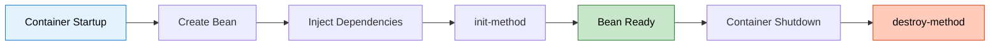

**Prototype Lifecycle:**

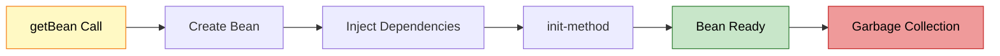

**Key Differences:**

| Aspect | Singleton | Prototype |
|:-------|:----------|:----------|
| **Creation** | At startup | On demand |
| **init-method** | ✅ Called | ✅ Called |
| **destroy-method** | ✅ Called | ❌ NOT called |
| **Cleanup** | Automatic | Manual |
| **Tracking** | Tracked by Spring | Not tracked |

**Example:**
```xml
<bean id="singleton" scope="singleton" 
      init-method="init" destroy-method="destroy" 
      class="com.example.SingletonBean"/>

<bean id="prototype" scope="prototype" 
      init-method="init" destroy-method="destroy" 
      class="com.example.PrototypeBean"/>
```

**Output:**
```
// Container startup
SingletonBean: init() called

// Container shutdown
SingletonBean: destroy() called

// Prototype beans
PrototypeBean: init() called (when getBean is called)
PrototypeBean: destroy() NOT called (even on container shutdown)
```

**Why Prototype destroy() Not Called:**
- Spring creates prototype beans on demand
- Spring hands them over to you
- You are responsible for cleanup
- Spring doesn't track them after creation

---

<div align="center">

<table>
<tr align="center">

## 🎓 End of Spring XML Configuration Guide

<td align="center">

<br>

<br>

**Created with dedication by Avinash Dhanuka**

<br>

[](https://github.com/Avinash-706)
[](mailto:avunashdhanuka@gmail.com)

<br>

---

**Happy Learning! 🚀**

*"Configure Once, Run Anywhere!"* - Avinash Dhanuka

<br>


---

</td>
</tr>
</table>
</div>
