# ☕ Spring Framework: Bean Lifecycle Management - Complete Guide

<div align="center">


</div>

<hr style="border: 1px solid rgb(98, 117, 187)">

<div align="center">
<table>
<tr>
<td align="center">
<br />

<h3>© 2026 Avinash Dhanuka</h3>
<p>Master Guide: Spring Bean Lifecycle Management</p>
<p><em>Crafted with ❤️ for Understanding Bean Birth to Death</em></p>

<a href="https://github.com/Avinash-706" target="_blank">

</a>
<br />
<a href="https://mail.google.com/mail/?view=cm&fs=1&to=avunashdhanuka@gmail.com&su=Spring%20Bean%20Lifecycle%20Query&body=☕%20Hello%20Avinash,%0D%0A%0D%0AMy%20name%20is%20[Your%20Name]%20and%20I%20have%20a%20doubt%20regarding%20Spring%20Bean%20Lifecycle.%0D%0A%0D%0A🔹%20Topic:%20[Lifecycle/PostConstruct/PreDestroy]%0D%0A%0D%0AThank%20you!" target="_blank">

</a>
<br />
<br />
</td>
</tr>
</table>
</div>

> **Learning Note:** This guide demonstrates Spring Bean Lifecycle management using @PostConstruct and @PreDestroy annotations. Understanding the bean lifecycle is crucial for proper resource management, initialization, and cleanup in Spring applications.

> **Prerequisites:** 
> - Understanding of Spring IoC Container
> - Knowledge of Dependency Injection
> - Basic Spring annotations (@Component, @Configuration)
> - Java OOP fundamentals

---

## 📑 Table of Contents
1. [What is Bean Lifecycle?](#1-what-is-bean-lifecycle)
2. [Why Bean Lifecycle Matters](#2-why-bean-lifecycle-matters)
3. [Complete Bean Lifecycle Phases](#3-complete-bean-lifecycle-phases)
4. [@PostConstruct Annotation](#4-postconstruct-annotation)
5. [@PreDestroy Annotation](#5-predestroy-annotation)
6. [Lifecycle Callback Methods](#6-lifecycle-callback-methods)
7. [Internal Working Mechanism](#7-internal-working-mechanism)
8. [Lifecycle with Different Scopes](#8-lifecycle-with-different-scopes)
9. [Project Structure & Implementation](#9-project-structure--implementation)
10. [Execution Flow Analysis](#10-execution-flow-analysis)
11. [Real-World Examples](#11-real-world-examples)
12. [Best Practices](#12-best-practices)
13. [Common Pitfalls](#13-common-pitfalls)
14. [Interview Questions](#14-top-interview-questions)

---

## 1. WHAT IS BEAN LIFECYCLE?

<div align="center">

</div>

> **📝 Author:** Avinash Dhanuka | [GitHub](https://github.com/Avinash-706)

### 📌 Definition

**Bean Lifecycle** refers to the complete journey of a Spring bean from its creation (instantiation) to its destruction. Spring IoC container manages this entire lifecycle, providing hooks at various stages for custom initialization and cleanup logic.

**Simple Analogy:**
- **Birth:** Bean is created (constructor called)
- **Childhood:** Dependencies are injected
- **Adulthood:** Bean is initialized and ready to use (@PostConstruct)
- **Working Life:** Bean serves requests
- **Retirement:** Bean is about to be destroyed (@PreDestroy)
- **Death:** Bean is removed from memory

### 🎯 Core Concept

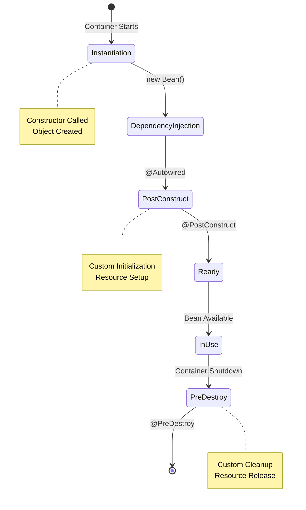


### 📊 Lifecycle Overview

**Reference:** [dbConnection.java](src/main/java/org/example/lifecycle/dbConnection.java)

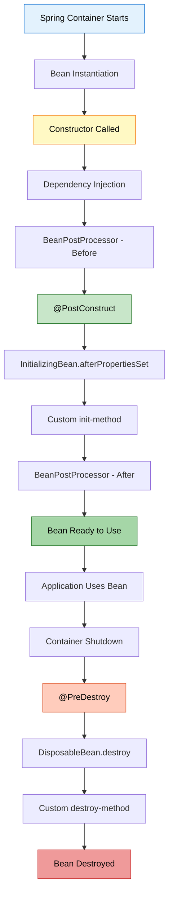

### 🔍 Our Project Example

**Database Connection Bean:**
```java
@Component
public class dbConnection {
    // 1. Constructor
    public dbConnection() {
        System.out.println("DB Constructor is called !!");
    }
    
    // 2. Initialization
    @PostConstruct
    public void init() {
        System.out.println("Init Method is called !!");
    }
    
    // 3. Business Method
    public void executeQuery() {
        System.out.println("Query is being Executed !!");
    }
    
    // 4. Cleanup
    @PreDestroy
    public void destroy() {
        System.out.println("Destroy method called");
    }
}
```

**Execution Output:**
```
--- Container Starting ---
DB Constructor is called !!
Init Method is called !!

-- Using Bean --
Operation Successfully : Query is being Executed !!
SELECT * FROM students

--- Container Closing ---
Destroy method called : before Object Destruction
```

---

## 2. WHY BEAN LIFECYCLE MATTERS

<div align="center">

</div>

### 🎯 Critical Importance

Understanding and managing bean lifecycle is essential for:

#### 1️⃣ Resource Management

**Problem Without Lifecycle Management:**
```java
public class DatabaseConnection {
    private Connection connection;
    
    public DatabaseConnection() {
        // Connection opened but never closed!
        connection = DriverManager.getConnection(url);
    }
    // ❌ Memory leak! Connection never closed
}
```

**Solution With Lifecycle Management:**
```java
@Component
public class DatabaseConnection {
    private Connection connection;
    
    @PostConstruct
    public void init() {
        connection = DriverManager.getConnection(url);
    }
    
    @PreDestroy
    public void cleanup() {
        if (connection != null) {
            connection.close(); // ✅ Properly closed
        }
    }
}
```

#### 2️⃣ Initialization Logic

**Use Cases:**
- Opening database connections
- Loading configuration files
- Establishing network connections
- Initializing caches
- Validating dependencies

#### 3️⃣ Cleanup Operations

**Use Cases:**
- Closing database connections
- Releasing file handles
- Shutting down thread pools
- Saving application state
- Flushing buffers

### 📊 Impact Comparison

| Without Lifecycle Management | With Lifecycle Management |
|:----------------------------|:-------------------------|
| ❌ Resource leaks | ✅ Proper cleanup |
| ❌ Manual initialization | ✅ Automatic initialization |
| ❌ Inconsistent state | ✅ Guaranteed initialization |
| ❌ Memory leaks | ✅ Memory efficient |
| ❌ Connection pool exhaustion | ✅ Connections released |
| ❌ File handle leaks | ✅ Files properly closed |

### 🔥 Real-World Consequences

**Without Proper Lifecycle Management:**

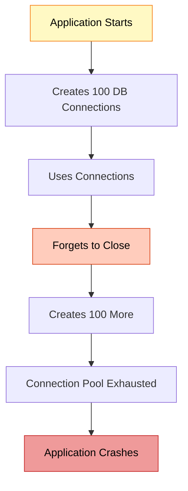

**With Proper Lifecycle Management:**

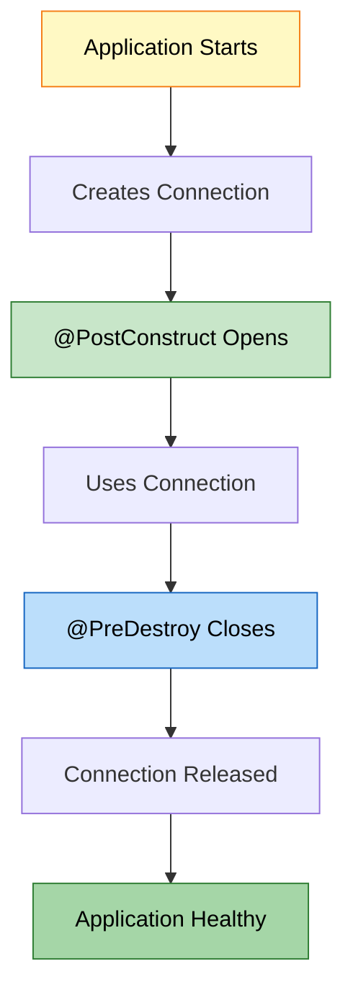

---

## 3. COMPLETE BEAN LIFECYCLE PHASES

<div align="center">


</div>

### 📌 The 13 Lifecycle Phases

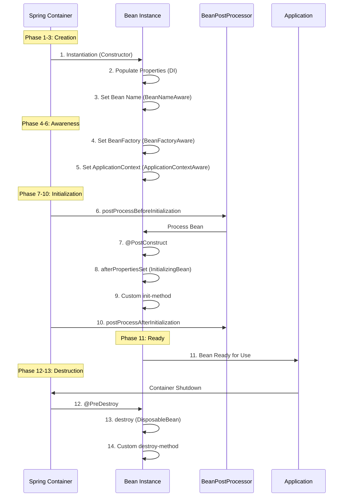

### 🔍 Phase-by-Phase Breakdown

#### Phase 1: Instantiation

**What Happens:**
- Spring creates bean instance using constructor
- Memory allocated for object
- Constructor code executes

**Example:**
```java
@Component
public class dbConnection {
    public dbConnection() {
        System.out.println("Constructor called");
        // Object created, but NOT ready to use
    }
}
```

**Internal Process:**
```java
// Spring internally does:
Class<?> clazz = dbConnection.class;
Constructor<?> constructor = clazz.getConstructor();
Object instance = constructor.newInstance();
```

#### Phase 2: Dependency Injection

**What Happens:**
- Spring injects all dependencies
- @Autowired fields/setters/constructors processed
- Properties populated

**Example:**
```java
@Component
public class UserService {
    @Autowired
    private UserRepository repository; // Injected here
    
    public UserService() {
        // repository is NULL here!
    }
}
```

**Why This Matters:**
```java
@Component
public class UserService {
    @Autowired
    private UserRepository repository;
    
    public UserService() {
        // ❌ WRONG: repository is null
        repository.findAll(); // NullPointerException!
    }
    
    @PostConstruct
    public void init() {
        // ✅ CORRECT: repository is injected
        repository.findAll(); // Works!
    }
}
```


#### Phase 3-5: Aware Interfaces (Optional)

**What Happens:**
- Bean gets access to Spring infrastructure
- Rarely used in practice

**Available Aware Interfaces:**

| Interface | Method | Purpose |
|:----------|:-------|:--------|
| **BeanNameAware** | setBeanName(String) | Get bean name |
| **BeanFactoryAware** | setBeanFactory(BeanFactory) | Access BeanFactory |
| **ApplicationContextAware** | setApplicationContext(ApplicationContext) | Access ApplicationContext |
| **ResourceLoaderAware** | setResourceLoader(ResourceLoader) | Load resources |
| **MessageSourceAware** | setMessageSource(MessageSource) | i18n support |

**Example:**
```java
@Component
public class MyBean implements ApplicationContextAware {
    private ApplicationContext context;
    
    @Override
    public void setApplicationContext(ApplicationContext context) {
        this.context = context;
        System.out.println("ApplicationContext injected");
    }
}
```

#### Phase 6: BeanPostProcessor - Before Initialization

**What Happens:**
- Custom processing before initialization
- Can modify bean or return proxy
- Applied to ALL beans

**Example:**
```java
@Component
public class LoggingBeanPostProcessor implements BeanPostProcessor {
    @Override
    public Object postProcessBeforeInitialization(Object bean, String name) {
        System.out.println("Before init: " + name);
        return bean;
    }
}
```

#### Phase 7: @PostConstruct ✅ (Our Project Uses This)

**What Happens:**
- Custom initialization logic
- Called after dependency injection
- JSR-250 standard annotation

**Reference:** [dbConnection.java:14-17](src/main/java/org/example/lifecycle/dbConnection.java#L14)

**Example:**
```java
@Component
public class dbConnection {
    @PostConstruct
    public void init() {
        System.out.println("Init Method is called !!");
        // Open connections, load config, etc.
    }
}
```

**Why Use @PostConstruct:**
- Dependencies are guaranteed to be injected
- Standard Java annotation (JSR-250)
- Clean and simple
- No Spring coupling

#### Phase 8: InitializingBean Interface (Alternative)

**What Happens:**
- Spring-specific initialization
- Called after @PostConstruct

**Example:**
```java
@Component
public class MyBean implements InitializingBean {
    @Override
    public void afterPropertiesSet() throws Exception {
        System.out.println("InitializingBean: afterPropertiesSet");
    }
}
```

**Comparison:**

| Method | Pros | Cons |
|:-------|:-----|:-----|
| **@PostConstruct** | Standard, no Spring coupling | Requires annotation support |
| **InitializingBean** | Type-safe, IDE support | Spring coupling |
| **init-method (XML)** | Works with any class | Only for XML config |

#### Phase 9: Custom init-method (XML/Java Config)

**What Happens:**
- Custom initialization via configuration

**XML Example:**
```xml
<bean id="myBean" class="..." init-method="customInit"/>
```

**Java Config Example:**
```java
@Bean(initMethod = "customInit")
public MyBean myBean() {
    return new MyBean();
}
```

#### Phase 10: BeanPostProcessor - After Initialization

**What Happens:**
- Final processing after initialization
- Often used for AOP proxies

**Example:**
```java
@Component
public class ProxyBeanPostProcessor implements BeanPostProcessor {
    @Override
    public Object postProcessAfterInitialization(Object bean, String name) {
        // Can return proxy here
        return bean;
    }
}
```

#### Phase 11: Bean Ready to Use

**What Happens:**
- Bean is fully initialized
- Ready to serve requests
- Application can use it

**Example:**
```java
dbConnection db = context.getBean(dbConnection.class);
db.executeQuery(); // ✅ Safe to use
```

#### Phase 12: @PreDestroy ✅ (Our Project Uses This)

**What Happens:**
- Cleanup before destruction
- Called when container shuts down
- JSR-250 standard annotation

**Reference:** [dbConnection.java:23-26](src/main/java/org/example/lifecycle/dbConnection.java#L23)

**Example:**
```java
@Component
public class dbConnection {
    @PreDestroy
    public void destroy() {
        System.out.println("Destroy method called");
        // Close connections, save state, etc.
    }
}
```

#### Phase 13: DisposableBean Interface (Alternative)

**What Happens:**
- Spring-specific cleanup
- Called after @PreDestroy

**Example:**
```java
@Component
public class MyBean implements DisposableBean {
    @Override
    public void destroy() throws Exception {
        System.out.println("DisposableBean: destroy");
    }
}
```

#### Phase 14: Custom destroy-method

**What Happens:**
- Custom cleanup via configuration

**XML Example:**
```xml
<bean id="myBean" class="..." destroy-method="customCleanup"/>
```

**Java Config Example:**
```java
@Bean(destroyMethod = "customCleanup")
public MyBean myBean() {
    return new MyBean();
}
```

### 📊 Lifecycle Methods Execution Order


**Complete Example:**
```java
@Component
public class CompleteLifecycleBean implements InitializingBean, DisposableBean {
    
    // Phase 1
    public CompleteLifecycleBean() {
        System.out.println("1. Constructor");
    }
    
    // Phase 7
    @PostConstruct
    public void postConstruct() {
        System.out.println("2. @PostConstruct");
    }
    
    // Phase 8
    @Override
    public void afterPropertiesSet() {
        System.out.println("3. InitializingBean.afterPropertiesSet");
    }
    
    // Phase 9 (if configured)
    public void customInit() {
        System.out.println("4. Custom init-method");
    }
    
    // Phase 12
    @PreDestroy
    public void preDestroy() {
        System.out.println("5. @PreDestroy");
    }
    
    // Phase 13
    @Override
    public void destroy() {
        System.out.println("6. DisposableBean.destroy");
    }
    
    // Phase 14 (if configured)
    public void customDestroy() {
        System.out.println("7. Custom destroy-method");
    }
}
```

**Output:**
```
1. Constructor
2. @PostConstruct
3. InitializingBean.afterPropertiesSet
4. Custom init-method
5. @PreDestroy
6. DisposableBean.destroy
7. Custom destroy-method
```

---

## 4. @POSTCONSTRUCT ANNOTATION


### 📌 What is @PostConstruct?

**@PostConstruct** is a JSR-250 annotation that marks a method to be executed after dependency injection is complete. It's the **recommended way** to perform initialization logic.

**Package:** `jakarta.annotation.PostConstruct` (formerly `javax.annotation.PostConstruct`)

**Reference:** [dbConnection.java:14-17](src/main/java/org/example/lifecycle/dbConnection.java#L14)

### 🎯 Why @PostConstruct Exists

**Problem: Constructor Limitations**

```java
@Component
public class UserService {
    @Autowired
    private UserRepository repository;
    
    public UserService() {
        // ❌ PROBLEM: repository is NULL here!
        List<User> users = repository.findAll(); // NullPointerException!
    }
}
```

**Solution: @PostConstruct**

```java
@Component
public class UserService {
    @Autowired
    private UserRepository repository;
    
    public UserService() {
        System.out.println("Constructor: repository is " + repository);
        // Output: Constructor: repository is null
    }
    
    @PostConstruct
    public void init() {
        System.out.println("PostConstruct: repository is " + repository);
        // Output: PostConstruct: repository is UserRepository@123
        
        // ✅ SAFE: Dependencies are injected
        List<User> users = repository.findAll();
    }
}
```

### 🔍 Internal Working

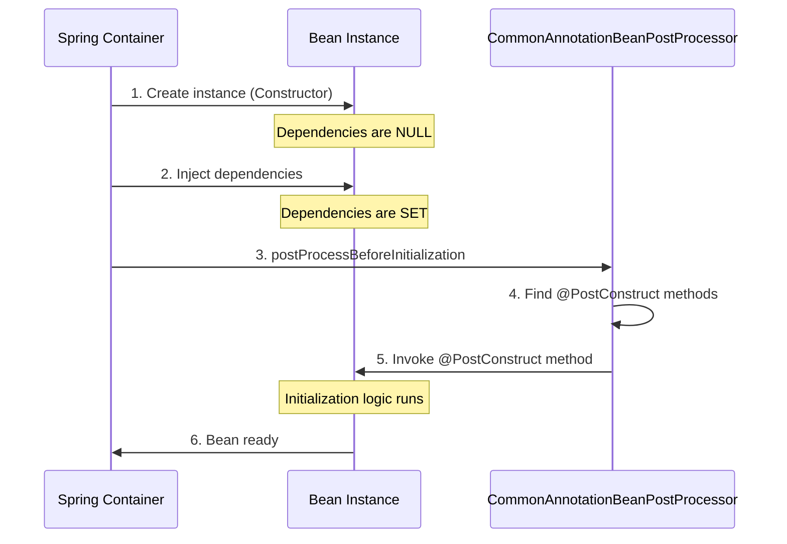

**How Spring Finds @PostConstruct:**

```java
// Spring internally does:
Method[] methods = bean.getClass().getDeclaredMethods();
for (Method method : methods) {
    if (method.isAnnotationPresent(PostConstruct.class)) {
        method.setAccessible(true);
        method.invoke(bean); // Call the method
    }
}
```


### 📊 @PostConstruct Rules

| Rule | Description | Example |
|:-----|:-----------|:--------|
| **Method Signature** | Must be `void` return type | `public void init()` |
| **Parameters** | Must have no parameters | ❌ `init(String param)` |
| **Access Modifier** | Can be any (public, private, protected) | `private void init()` |
| **Static** | Must NOT be static | ❌ `static void init()` |
| **Exceptions** | Can throw checked exceptions | `void init() throws Exception` |
| **Multiple Methods** | Can have multiple @PostConstruct | ✅ Allowed |
| **Inheritance** | Inherited methods are called | Parent → Child order |

### 🎯 Common Use Cases

#### 1️⃣ Database Connection Initialization

**Reference:** [dbConnection.java:14-17](src/main/java/org/example/lifecycle/dbConnection.java#L14)

```java
@Component
public class dbConnection {
    private Connection connection;
    
    @PostConstruct
    public void init() {
        System.out.println("Opening database connection...");
        connection = DriverManager.getConnection(url, user, password);
    }
}
```

#### 2️⃣ Loading Configuration

```java
@Component
public class ConfigLoader {
    private Properties config;
    
    @PostConstruct
    public void loadConfig() {
        config = new Properties();
        config.load(new FileInputStream("app.properties"));
        System.out.println("Configuration loaded");
    }
}
```

#### 3️⃣ Cache Initialization

```java
@Component
public class CacheManager {
    private Map<String, Object> cache;
    
    @PostConstruct
    public void initCache() {
        cache = new ConcurrentHashMap<>();
        // Pre-load frequently used data
        cache.put("config", loadConfig());
        System.out.println("Cache initialized");
    }
}
```

#### 4️⃣ Validating Dependencies

```java
@Component
public class PaymentService {
    @Autowired
    private PaymentGateway gateway;
    
    @Autowired
    private EmailService emailService;
    
    @PostConstruct
    public void validate() {
        if (gateway == null) {
            throw new IllegalStateException("PaymentGateway not configured");
        }
        if (emailService == null) {
            throw new IllegalStateException("EmailService not configured");
        }
        System.out.println("All dependencies validated");
    }
}
```

#### 5️⃣ Starting Background Tasks

```java
@Component
public class ScheduledTaskManager {
    private ScheduledExecutorService executor;
    
    @PostConstruct
    public void startTasks() {
        executor = Executors.newScheduledThreadPool(5);
        executor.scheduleAtFixedRate(() -> {
            System.out.println("Background task running");
        }, 0, 1, TimeUnit.MINUTES);
    }
}
```

### ⚠️ Common Mistakes

#### Mistake 1: Using Constructor Instead

```java
@Component
public class UserService {
    @Autowired
    private UserRepository repository;
    
    // ❌ WRONG: Dependencies not injected yet
    public UserService() {
        repository.findAll(); // NullPointerException!
    }
    
    // ✅ CORRECT: Dependencies are injected
    @PostConstruct
    public void init() {
        repository.findAll(); // Works!
    }
}
```

#### Mistake 2: Multiple @PostConstruct with Order Dependency

```java
@Component
public class MyBean {
    @PostConstruct
    public void init1() {
        System.out.println("Init 1");
    }
    
    @PostConstruct
    public void init2() {
        System.out.println("Init 2");
    }
    
    // ⚠️ WARNING: Order is NOT guaranteed!
    // Output could be: Init 1, Init 2 OR Init 2, Init 1
}
```

**Solution:**
```java
@Component
public class MyBean {
    @PostConstruct
    public void init() {
        init1();
        init2();
    }
    
    private void init1() {
        System.out.println("Init 1");
    }
    
    private void init2() {
        System.out.println("Init 2");
    }
}
```

#### Mistake 3: Returning Value

```java
@Component
public class MyBean {
    // ❌ WRONG: @PostConstruct must return void
    @PostConstruct
    public String init() {
        return "initialized";
    }
}
```

#### Mistake 4: Static Method

```java
@Component
public class MyBean {
    // ❌ WRONG: @PostConstruct cannot be static
    @PostConstruct
    public static void init() {
        System.out.println("Init");
    }
}
```

### 🔥 Advanced: @PostConstruct with Inheritance

```java
public class ParentBean {
    @PostConstruct
    public void parentInit() {
        System.out.println("1. Parent @PostConstruct");
    }
}

@Component
public class ChildBean extends ParentBean {
    @PostConstruct
    public void childInit() {
        System.out.println("2. Child @PostConstruct");
    }
}
```

**Output:**
```
1. Parent @PostConstruct
2. Child @PostConstruct
```

**Execution Order:**
1. Parent class @PostConstruct methods
2. Child class @PostConstruct methods

---

## 5. @PREDESTROY ANNOTATION

<div align="center">

</div>

### 📌 What is @PreDestroy?

**@PreDestroy** is a JSR-250 annotation that marks a method to be executed before the bean is destroyed. It's the **recommended way** to perform cleanup logic.

**Package:** `jakarta.annotation.PreDestroy` (formerly `javax.annotation.PreDestroy`)

**Reference:** [dbConnection.java:23-26](src/main/java/org/example/lifecycle/dbConnection.java#L23)

### 🎯 Why @PreDestroy Exists

**Problem: Resource Leaks**

```java
@Component
public class FileProcessor {
    private FileWriter writer;
    
    @PostConstruct
    public void init() throws IOException {
        writer = new FileWriter("output.txt");
    }
    
    // ❌ PROBLEM: File never closed!
    // Resource leak when application shuts down
}
```

**Solution: @PreDestroy**

```java
@Component
public class FileProcessor {
    private FileWriter writer;
    
    @PostConstruct
    public void init() throws IOException {
        writer = new FileWriter("output.txt");
    }
    
    @PreDestroy
    public void cleanup() throws IOException {
        if (writer != null) {
            writer.close(); // ✅ Properly closed
            System.out.println("File closed");
        }
    }
}
```

### 🔍 Internal Working

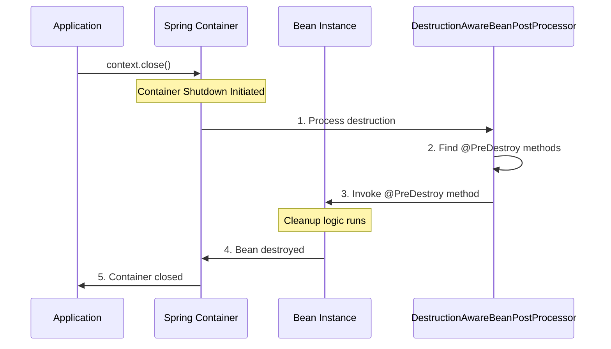

**How Spring Finds @PreDestroy:**

```java
// Spring internally does:
Method[] methods = bean.getClass().getDeclaredMethods();
for (Method method : methods) {
    if (method.isAnnotationPresent(PreDestroy.class)) {
        method.setAccessible(true);
        method.invoke(bean); // Call the method
    }
}
```

### 📊 @PreDestroy Rules

| Rule | Description | Example |
|:-----|:-----------|:--------|
| **Method Signature** | Must be `void` return type | `public void cleanup()` |
| **Parameters** | Must have no parameters | ❌ `cleanup(String param)` |
| **Access Modifier** | Can be any | `private void cleanup()` |
| **Static** | Must NOT be static | ❌ `static void cleanup()` |
| **Exceptions** | Can throw checked exceptions | `void cleanup() throws Exception` |
| **Multiple Methods** | Can have multiple @PreDestroy | ✅ Allowed |
| **Inheritance** | Inherited methods are called | Child → Parent order |

### 🎯 Common Use Cases

#### 1️⃣ Closing Database Connections

**Reference:** [dbConnection.java:23-26](src/main/java/org/example/lifecycle/dbConnection.java#L23)

```java
@Component
public class dbConnection {
    private Connection connection;
    
    @PostConstruct
    public void init() {
        connection = DriverManager.getConnection(url);
    }
    
    @PreDestroy
    public void destroy() {
        if (connection != null) {
            connection.close();
            System.out.println("Database connection closed");
        }
    }
}
```

#### 2️⃣ Releasing File Handles

```java
@Component
public class LogWriter {
    private BufferedWriter writer;
    
    @PostConstruct
    public void init() throws IOException {
        writer = new BufferedWriter(new FileWriter("app.log"));
    }
    
    @PreDestroy
    public void cleanup() throws IOException {
        if (writer != null) {
            writer.flush();
            writer.close();
            System.out.println("Log file closed");
        }
    }
}
```

#### 3️⃣ Shutting Down Thread Pools

```java
@Component
public class TaskExecutor {
    private ExecutorService executor;
    
    @PostConstruct
    public void init() {
        executor = Executors.newFixedThreadPool(10);
    }
    
    @PreDestroy
    public void shutdown() {
        if (executor != null) {
            executor.shutdown();
            try {
                if (!executor.awaitTermination(60, TimeUnit.SECONDS)) {
                    executor.shutdownNow();
                }
            } catch (InterruptedException e) {
                executor.shutdownNow();
            }
            System.out.println("Thread pool shut down");
        }
    }
}
```

#### 4️⃣ Saving Application State

```java
@Component
public class StateManager {
    private Map<String, Object> state;
    
    @PreDestroy
    public void saveState() throws IOException {
        ObjectOutputStream oos = new ObjectOutputStream(
            new FileOutputStream("state.dat")
        );
        oos.writeObject(state);
        oos.close();
        System.out.println("Application state saved");
    }
}
```

#### 5️⃣ Closing Network Connections

```java
@Component
public class WebSocketClient {
    private WebSocket socket;
    
    @PostConstruct
    public void connect() {
        socket = new WebSocket("ws://example.com");
        socket.connect();
    }
    
    @PreDestroy
    public void disconnect() {
        if (socket != null && socket.isOpen()) {
            socket.close();
            System.out.println("WebSocket closed");
        }
    }
}
```


### ⚠️ Critical: @PreDestroy and Prototype Beans

**IMPORTANT:** @PreDestroy is **NOT called** for prototype-scoped beans!

```java
@Component
@Scope("prototype")
public class PrototypeBean {
    @PostConstruct
    public void init() {
        System.out.println("Init called"); // ✅ Called
    }
    
    @PreDestroy
    public void cleanup() {
        System.out.println("Cleanup called"); // ❌ NEVER called!
    }
}
```

**Why?**
- Spring creates prototype beans on demand
- Spring hands them over to you
- Spring doesn't track them after creation
- You are responsible for cleanup

**Solution for Prototype Cleanup:**

```java
@Component
@Scope("prototype")
public class PrototypeBean implements DisposableBean {
    @Override
    public void destroy() {
        // Manual cleanup
    }
}

// Manual cleanup
PrototypeBean bean = context.getBean(PrototypeBean.class);
// Use bean
((DisposableBean) bean).destroy(); // Call manually
```

### 🔥 Advanced: @PreDestroy with Inheritance

```java
public class ParentBean {
    @PreDestroy
    public void parentCleanup() {
        System.out.println("2. Parent @PreDestroy");
    }
}

@Component
public class ChildBean extends ParentBean {
    @PreDestroy
    public void childCleanup() {
        System.out.println("1. Child @PreDestroy");
    }
}
```

**Output:**
```
1. Child @PreDestroy
2. Parent @PreDestroy
```

**Execution Order:**
1. Child class @PreDestroy methods
2. Parent class @PreDestroy methods

**Note:** Opposite order of @PostConstruct!

---

## 6. LIFECYCLE CALLBACK METHODS

<div align="center">

</div>

### 📌 Three Ways to Define Lifecycle Callbacks

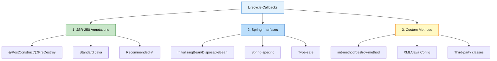

### 📊 Comparison Table

| Method | Pros | Cons | Use When |
|:-------|:-----|:-----|:---------|
| **@PostConstruct/@PreDestroy** | Standard, no Spring coupling, clean | Requires annotation support | ✅ Always (recommended) |
| **InitializingBean/DisposableBean** | Type-safe, IDE support | Spring coupling | Legacy code |
| **init-method/destroy-method** | Works with any class | Only for XML/Java config | Third-party classes |

### 1️⃣ JSR-250 Annotations (Recommended)

**Example:**
```java
@Component
public class MyBean {
    @PostConstruct
    public void init() {
        System.out.println("Initialization");
    }
    
    @PreDestroy
    public void cleanup() {
        System.out.println("Cleanup");
    }
}
```

**Pros:**
- ✅ Standard Java (JSR-250)
- ✅ No Spring coupling
- ✅ Clean and simple
- ✅ Works with any DI framework

**Cons:**
- ❌ Requires annotation support

### 2️⃣ Spring Interfaces

**Example:**
```java
@Component
public class MyBean implements InitializingBean, DisposableBean {
    @Override
    public void afterPropertiesSet() throws Exception {
        System.out.println("InitializingBean: afterPropertiesSet");
    }
    
    @Override
    public void destroy() throws Exception {
        System.out.println("DisposableBean: destroy");
    }
}
```

**Pros:**
- ✅ Type-safe
- ✅ IDE support
- ✅ Can throw checked exceptions

**Cons:**
- ❌ Spring coupling
- ❌ Less flexible

### 3️⃣ Custom Methods (XML/Java Config)

**XML Configuration:**
```xml
<bean id="myBean" 
      class="com.example.MyBean"
      init-method="customInit"
      destroy-method="customCleanup"/>
```

**Java Configuration:**
```java
@Configuration
public class AppConfig {
    @Bean(initMethod = "customInit", destroyMethod = "customCleanup")
    public MyBean myBean() {
        return new MyBean();
    }
}
```

**Bean Class:**
```java
public class MyBean {
    public void customInit() {
        System.out.println("Custom init");
    }
    
    public void customCleanup() {
        System.out.println("Custom cleanup");
    }
}
```

**Pros:**
- ✅ Works with third-party classes
- ✅ 
No Spring coupling
- ✅ Method name flexibility

**Cons:**
- ❌ Only for XML/Java config
- ❌ Not visible in class

### 🔥 All Three Combined

```java
@Component
public class CompleteLifecycleBean implements InitializingBean, DisposableBean {
    
    // 1. @PostConstruct
    @PostConstruct
    public void postConstruct() {
        System.out.println("1. @PostConstruct");
    }
    
    // 2. InitializingBean
    @Override
    public void afterPropertiesSet() {
        System.out.println("2. InitializingBean.afterPropertiesSet");
    }
    
    // 3. Custom init-method (if configured)
    public void customInit() {
        System.out.println("3. Custom init-method");
    }
    
    // 4. @PreDestroy
    @PreDestroy
    public void preDestroy() {
        System.out.println("4. @PreDestroy");
    }
    
    // 5. DisposableBean
    @Override
    public void destroy() {
        System.out.println("5. DisposableBean.destroy");
    }
    
    // 6. Custom destroy-method (if configured)
    public void customDestroy() {
        System.out.println("6. Custom destroy-method");
    }
}
```

**Configuration:**
```java
@Bean(initMethod = "customInit", destroyMethod = "customDestroy")
public CompleteLifecycleBean bean() {
    return new CompleteLifecycleBean();
}
```

**Output:**
```
1. @PostConstruct
2. InitializingBean.afterPropertiesSet
3. Custom init-method
4. @PreDestroy
5. DisposableBean.destroy
6. Custom destroy-method
```

---

## 7. INTERNAL WORKING MECHANISM

<div align="center">

</div>

### 📌 How Spring Manages Bean Lifecycle

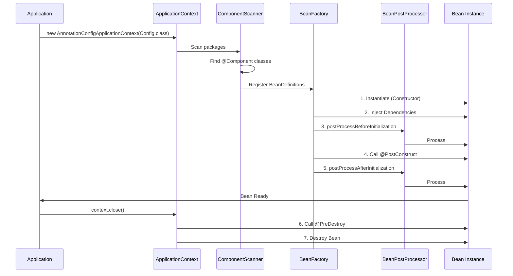

### 🔍 Step-by-Step Internal Process

#### Step 1: Component Scanning

**What Happens:**
```java
// Spring internally does:
ClassPathBeanDefinitionScanner scanner = new ClassPathBeanDefinitionScanner(registry);
scanner.scan("org.example.lifecycle");

// For each .class file:
Class<?> clazz = Class.forName("org.example.lifecycle.dbConnection");
if (clazz.isAnnotationPresent(Component.class)) {
    BeanDefinition bd = new GenericBeanDefinition();
    bd.setBeanClass(clazz);
    registry.registerBeanDefinition("dbConnection", bd);
}
```

**Reference:** [lifeCycleConfig.java:9](src/main/java/org/example/lifecycle/lifeCycleConfig.java#L9)

#### Step 2: Bean Instantiation

**What Happens:**
```java
// Spring internally does:
Class<?> clazz = dbConnection.class;
Constructor<?> constructor = clazz.getConstructor();
Object instance = constructor.newInstance();
// Output: "DB Constructor is called !!"
```

**Reference:** [dbConnection.java:10-12](src/main/java/org/example/lifecycle/dbConnection.java#L10)

#### Step 3: Dependency Injection

**What Happens:**
```java
// Spring internally does:
Field[] fields = instance.getClass().getDeclaredFields();
for (Field field : fields) {
    if (field.isAnnotationPresent(Autowired.class)) {
        Object dependency = getBean(field.getType());
        field.setAccessible(true);
        field.set(instance, dependency);
    }
}
```

#### Step 4: BeanPostProcessor - Before Initialization

**What Happens:**
```java
// Spring internally does:
for (BeanPostProcessor processor : beanPostProcessors) {
    instance = processor.postProcessBeforeInitialization(instance, beanName);
}
```

**CommonAnnotationBeanPostProcessor** handles @PostConstruct:
```java
public Object postProcessBeforeInitialization(Object bean, String beanName) {
    Method[] methods = bean.getClass().getDeclaredMethods();
    for (Method method : methods) {
        if (method.isAnnotationPresent(PostConstruct.class)) {
            method.setAccessible(true);
            method.invoke(bean);
        }
    }
    return bean;
}
```

#### Step 5: @PostConstruct Invocation

**What Happens:**
```java
// Spring finds and calls @PostConstruct method
Method initMethod = dbConnection.class.getDeclaredMethod("init");
initMethod.invoke(instance);
// Output: "Init Method is called !!"
```

**Reference:** [dbConnection.java:14-17](src/main/java/org/example/lifecycle/dbConnection.java#L14)

#### Step 6: Bean Ready to Use

**What Happens:**
```java
// Bean is stored in ApplicationContext
singletonObjects.put("dbConnection", instance);

// Application can now use it
dbConnection bean = context.getBean(dbConnection.class);
bean.executeQuery();
```

**Reference:** [App.java:17-18](src/main/java/org/example/lifecycle/App.java#L17)

#### Step 7: Container Shutdown

**What Happens:**
```java
// Application calls close
context.close();

// Spring triggers shutdown hooks
Runtime.getRuntime().addShutdownHook(new Thread(() -> {
    destroyBeans();
}));
```

**Reference:** [App.java:21](src/main/java/org/example/lifecycle/App.java#L21)

#### Step 8: @PreDestroy Invocation

**What Happens:**
```java
// Spring finds and calls @PreDestroy method
Method destroyMethod = dbConnection.class.getDeclaredMethod("destroy");
destroyMethod.invoke(instance);
// Output: "Destroy method called : before Object Destruction"
```

**Reference:** [dbConnection.java:23-26](src/main/java/org/example/lifecycle/dbConnection.java#L23)

### 🔥 Reflection Mechanism

**How Spring Uses Reflection:**

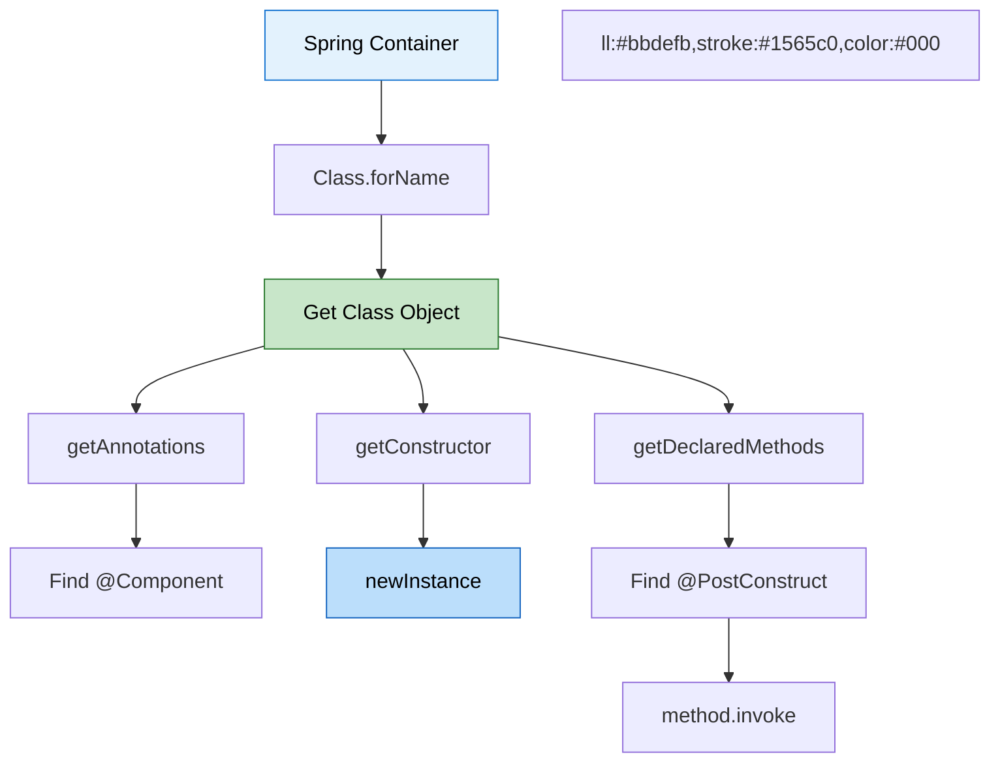

**Complete Reflection Example:**

```java
// 1. Load class
Class<?> clazz = Class.forName("org.example.lifecycle.dbConnection");

// 2. Check for @Component
if (clazz.isAnnotationPresent(Component.class)) {
    // 3. Create instance
    Constructor<?> constructor = clazz.getConstructor();
    Object instance = constructor.newInstance();
    
    // 4. Find @PostConstruct methods
    for (Method method : clazz.getDeclaredMethods()) {
        if (method.isAnnotationPresent(PostConstruct.class)) {
            method.setAccessible(true);
            method.invoke(instance);
        }
    }
}
```

---

## 8. LIFECYCLE WITH DIFFERENT SCOPES

<div align="center">
  
</div>

### 📌 Bean Scopes Overview

| Scope | Lifecycle | @PostConstruct | @PreDestroy | Use Case |
|:------|:----------|:---------------|:------------|:---------|
| **Singleton** | One per container | ✅ Called | ✅ Called | Default, shared state |
| **Prototype** | New per request | ✅ Called | ❌ NOT called | Stateful beans |
| **Request** | One per HTTP request | ✅ Called | ✅ Called | Web apps |
| **Session** | One per HTTP session | ✅ Called | ✅ Called | User sessions |
| **Application** | One per ServletContext | ✅ Called | ✅ Called | Web apps |

### 🎯 Singleton Scope (Default)

**Reference:** [dbConnection.java](src/main/java/org/example/lifecycle/dbConnection.java)

```java
@Component // Default scope is singleton
public class dbConnection {
    @PostConstruct
    public void init() {
        System.out.println("Init called");
    }
    
    @PreDestroy
    public void destroy() {
        System.out.println("Destroy called");
    }
}
```

**Behavior:**
- One instance per Spring container
- @PostConstruct called once
- @PreDestroy called on shutdown
- Shared across all requests

**Output:**
```
Init called
... application runs ...
Destroy called
```

### 🎯 Prototype Scope

```java
@Component
@Scope("prototype")
public class PrototypeBean {
    @PostConstruct
    public void init() {
        System.out.println("Init called");
    }
    
    @PreDestroy
    public void destroy() {
        System.out.println("Destroy called"); // ❌ NEVER called!
    }
}
```

**Behavior:**
- New instance per getBean() call
- @PostConstruct called for each instance
- @PreDestroy **NOT called** (Spring doesn't track)
- Client responsible for cleanup

**Output:**
```
Bean 1: Init called
Bean 2: Init called
Bean 3: Init called
... application shuts down ...
(No destroy calls!)
```

**Why @PreDestroy Not Called:**
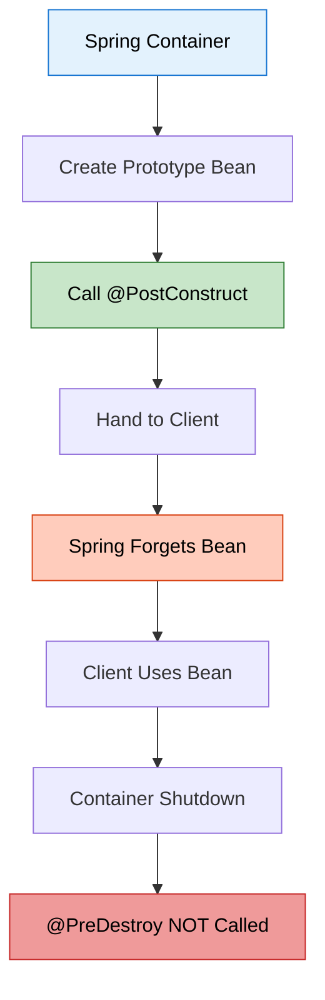

---

## 9. PROJECT STRUCTURE & IMPLEMENTATION

<div align="center">

</div>

### 📁 Complete Project Structure

```
BeanLifeCycle/
├── src/
│   └── main/
│       └── java/
│           └── org/
│               └── example/
│                   └── lifecycle/
│                       ├── App.java                 # Main application
│                       ├── lifeCycleConfig.java     # Configuration
│                       └── dbConnection.java        # Bean with lifecycle
├── pom.xml                                          # Maven dependencies
└── README.md                                        # This file
```

### 📄 File-by-File Implementation

#### 1️⃣ pom.xml - Maven Configuration

**Purpose:** Define project dependencies and build configuration

```xml
<?xml version="1.0" encoding="UTF-8"?>
<project xmlns="http://maven.apache.org/POM/4.0.0"
         xmlns:xsi="http://www.w3.org/2001/XMLSchema-instance"
         xsi:schemaLocation="http://maven.apache.org/POM/4.0.0 
         http://maven.apache.org/xsd/maven-4.0.0.xsd">
    <modelVersion>4.0.0</modelVersion>

    <groupId>org.example</groupId>
    <artifactId>BeanLifeCycle</artifactId>
    <version>1.0-SNAPSHOT</version>

    <properties>
        <maven.compiler.source>21</maven.compiler.source>
        <maven.compiler.target>21</maven.compiler.target>
        <project.build.sourceEncoding>UTF-8</project.build.sourceEncoding>
    </properties>

    <dependencies>
        <!-- Spring Context -->
        <dependency>
            <groupId>org.springframework</groupId>
            <artifactId>spring-context</artifactId>
            <version>7.0.3</version>
        </dependency>
    </dependencies>
</project>
```

#### 2️⃣ lifeCycleConfig.java - Spring Configuration

**Reference:** [lifeCycleConfig.java](src/main/java/org/example/lifecycle/lifeCycleConfig.java)

```java
package org.example.lifecycle;

import org.springframework.context.annotation.ComponentScan;
import org.springframework.context.annotation.Configuration;

@Configuration
@ComponentScan(basePackages = "org.example.lifecycle")
public class lifeCycleConfig {
    // Configuration class for component scanning
}
```

**Explanation:**
- `@Configuration`: Marks this as a configuration class
- `@ComponentScan`: Tells Spring to scan for @Component classes
- `basePackages`: Specifies package to scan

#### 3️⃣ dbConnection.java - Bean with Lifecycle

**Reference:** [dbConnection.java](src/main/java/org/example/lifecycle/dbConnection.java)

```java
package org.example.lifecycle;

import jakarta.annotation.PostConstruct;
import jakarta.annotation.PreDestroy;
import org.springframework.stereotype.Component;

@Component
public class dbConnection {

    public dbConnection() {
        System.out.println("DB Constructor is called !!");
    }

    @PostConstruct
    public void init() {
        System.out.println("Init Method is called !!");
    }

    public void executeQuery() {
        System.out.println("Query is being Executed !!");
    }

    @PreDestroy
    public void destroy() {
        System.out.println("Destroy method called : before Object Destruction");
    }
}
```

**Explanation:**
- `@Component`: Marks class as Spring-managed bean
- `Constructor`: Called when bean is instantiated
- `@PostConstruct`: Called after dependencies injected
- `executeQuery()`: Business method
- `@PreDestroy`: Called before bean destruction

#### 4️⃣ App.java - Main Application

**Reference:** [App.java](src/main/java/org/example/lifecycle/App.java)

```java
package org.example.lifecycle;

import org.springframework.context.annotation.AnnotationConfigApplicationContext;

public class App {
    public static void main(String[] args) {
        System.out.println("--- Container Starting ---");
        
        AnnotationConfigApplicationContext context = 
            new AnnotationConfigApplicationContext(lifeCycleConfig.class);
        
        System.out.println("\n-- Using Bean --");
        dbConnection db = context.getBean(dbConnection.class);
        System.out.print("Operation Successfully : ");
        db.executeQuery();
        System.out.println("SELECT * FROM students");
        
        System.out.println("\n--- Container Closing ---");
        context.close();
    }
}
```

**Explanation:**
- Creates Spring ApplicationContext
- Retrieves bean from container
- Uses bean's business method
- Closes container (triggers @PreDestroy)

---

## 10. EXECUTION FLOW ANALYSIS

<div align="center">

</div>

### 📊 Complete Execution Flow

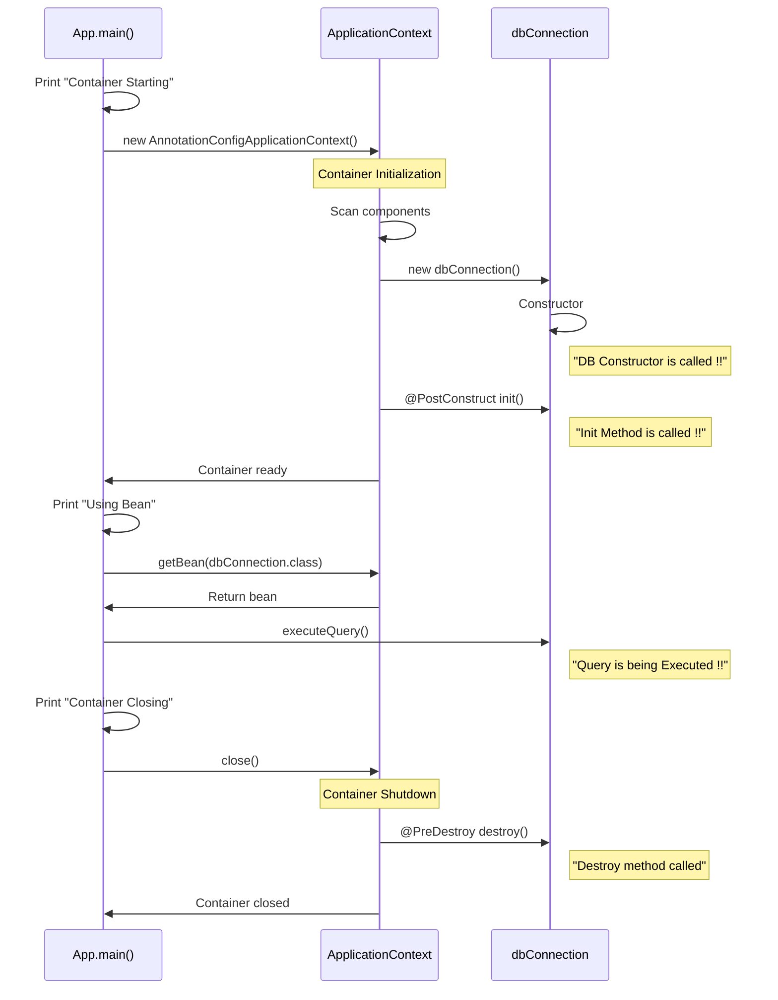

### 🖥️ Console Output

```
--- Container Starting ---
DB Constructor is called !!
Init Method is called !!

-- Using Bean --
Operation Successfully : Query is being Executed !!
SELECT * FROM students

--- Container Closing ---
Destroy method called : before Object Destruction
```

### 🔍 Step-by-Step Breakdown

**Step 1: Container Starting**
```java
System.out.println("--- Container Starting ---");
```
Output: `--- Container Starting ---`

**Step 2: Create ApplicationContext**
```java
AnnotationConfigApplicationContext context = 
    new AnnotationConfigApplicationContext(lifeCycleConfig.class);
```
- Spring scans `org.example.lifecycle` package
- Finds `dbConnection` class with @Component
- Creates BeanDefinition

**Step 3: Bean Instantiation**
```java
public dbConnection() {
    System.out.println("DB Constructor is called !!");
}
```
Output: `DB Constructor is called !!`

**Step 4: @PostConstruct Initialization**
```java
@PostConstruct
public void init() {
    System.out.println("Init Method is called !!");
}
```
Output: `Init Method is called !!`

**Step 5: Bean Ready - Application Uses It**
```java
System.out.println("\n-- Using Bean --");
dbConnection db = context.getBean(dbConnection.class);
db.executeQuery();
```
Output:
```
-- Using Bean --
Operation Successfully : Query is being Executed !!
SELECT * FROM students
```

**Step 6: Container Shutdown**
```java
System.out.println("\n--- Container Closing ---");
context.close();
```
Output: `--- Container Closing ---`

**Step 7: @PreDestroy Cleanup**
```java
@PreDestroy
public void destroy() {
    System.out.println("Destroy method called : before Object Destruction");
}
```
Output: `Destroy method called : before Object Destruction`

---

## 11. REAL-WORLD EXAMPLES

<div align="center">

</div>

### 🎯 Example 1: Database Connection Pool

```java
@Component
public class DatabaseConnectionPool {
    private HikariDataSource dataSource;
    
    @PostConstruct
    public void initializePool() {
        HikariConfig config = new HikariConfig();
        config.setJdbcUrl("jdbc:mysql://localhost:3306/mydb");
        config.setUsername("root");
        config.setPassword("password");
        config.setMaximumPoolSize(10);
        
        dataSource = new HikariDataSource(config);
        System.out.println("Connection pool initialized with 10 connections");
    }
    
    public Connection getConnection() throws SQLException {
        return dataSource.getConnection();
    }
    
    @PreDestroy
    public void closePool() {
        if (dataSource != null && !dataSource.isClosed()) {
            dataSource.close();
            System.out.println("Connection pool closed, all connections released");
        }
    }
}
```

**Benefits:**
- Pool initialized once at startup
- Connections reused efficiently
- Proper cleanup on shutdown
- No connection leaks

### 🎯 Example 2: Cache Manager

```java
@Component
public class CacheManager {
    private Map<String, Object> cache;
    private ScheduledExecutorService scheduler;
    
    @PostConstruct
    public void initializeCache() {
        cache = new ConcurrentHashMap<>();
        
        // Pre-load frequently accessed data
        cache.put("config", loadConfiguration());
        cache.put("users", loadActiveUsers());
        
        // Schedule cache refresh every 5 minutes
        scheduler = Executors.newScheduledThreadPool(1);
        scheduler.scheduleAtFixedRate(
            this::refreshCache, 
            5, 5, TimeUnit.MINUTES
        );
        
        System.out.println("Cache initialized and refresh scheduled");
    }
    
    private void refreshCache() {
        System.out.println("Refreshing cache...");
        cache.put("config", loadConfiguration());
    }
    
    @PreDestroy
    public void cleanup() {
        if (scheduler != null) {
            scheduler.shutdown();
            try {
                if (!scheduler.awaitTermination(60, TimeUnit.SECONDS)) {
                    scheduler.shutdownNow();
                }
            } catch (InterruptedException e) {
                scheduler.shutdownNow();
            }
        }
        cache.clear();
        System.out.println("Cache cleared and scheduler stopped");
    }
}
```

### 🎯 Example 3: File Upload Service

```java
@Component
public class FileUploadService {
    private Path uploadDirectory;
    private ExecutorService uploadExecutor;
    
    @PostConstruct
    public void initialize() throws IOException {
        // Create upload directory
        uploadDirectory = Paths.get("uploads");
        if (!Files.exists(uploadDirectory)) {
            Files.createDirectories(uploadDirectory);
        }
        
        // Initialize thread pool for async uploads
        uploadExecutor = Executors.newFixedThreadPool(5);
        
        System.out.println("Upload service initialized: " + uploadDirectory);
    }
    
    public void uploadFile(MultipartFile file) {
        uploadExecutor.submit(() -> {
            try {
                Path targetPath = uploadDirectory.resolve(file.getOriginalFilename());
                Files.copy(file.getInputStream(), targetPath);
                System.out.println("File uploaded: " + file.getOriginalFilename());
            } catch (IOException e) {
                e.printStackTrace();
            }
        });
    }
    
    @PreDestroy
    public void cleanup() {
        if (uploadExecutor != null) {
            uploadExecutor.shutdown();
            try {
                if (!uploadExecutor.awaitTermination(30, TimeUnit.SECONDS)) {
                    uploadExecutor.shutdownNow();
                }
            } catch (InterruptedException e) {
                uploadExecutor.shutdownNow();
            }
        }
        System.out.println("Upload service shut down, pending uploads completed");
    }
}
```

### 🎯 Example 4: Email Service with SMTP Connection

```java
@Component
public class EmailService {
    private Session mailSession;
    private Transport transport;
    
    @Value("${mail.smtp.host}")
    private String smtpHost;
    
    @Value("${mail.smtp.port}")
    private int smtpPort;
    
    @PostConstruct
    public void connectToSMTP() throws MessagingException {
        Properties props = new Properties();
        props.put("mail.smtp.host", smtpHost);
        props.put("mail.smtp.port", smtpPort);
        props.put("mail.smtp.auth", "true");
        
        mailSession = Session.getInstance(props);
        transport = mailSession.getTransport("smtp");
        transport.connect();
        
        System.out.println("Connected to SMTP server: " + smtpHost);
    }
    
    public void sendEmail(String to, String subject, String body) throws MessagingException {
        MimeMessage message = new MimeMessage(mailSession);
        message.setRecipient(Message.RecipientType.TO, new InternetAddress(to));
        message.setSubject(subject);
        message.setText(body);
        
        transport.sendMessage(message, message.getAllRecipients());
    }
    
    @PreDestroy
    public void disconnectFromSMTP() throws MessagingException {
        if (transport != null && transport.isConnected()) {
            transport.close();
            System.out.println("Disconnected from SMTP server");
        }
    }
}
```

### 🎯 Example 5: Metrics Collector

```java
@Component
public class MetricsCollector {
    private Map<String, AtomicLong> metrics;
    private ScheduledExecutorService reporter;
    
    @PostConstruct
    public void startCollecting() {
        metrics = new ConcurrentHashMap<>();
        
        // Initialize common metrics
        metrics.put("requests", new AtomicLong(0));
        metrics.put("errors", new AtomicLong(0));
        metrics.put("latency", new AtomicLong(0));
        
        // Schedule metrics reporting every minute
        reporter = Executors.newScheduledThreadPool(1);
        reporter.scheduleAtFixedRate(
            this::reportMetrics,
            1, 1, TimeUnit.MINUTES
        );
        
        System.out.println("Metrics collection started");
    }
    
    public void incrementMetric(String name) {
        metrics.computeIfAbsent(name, k -> new AtomicLong(0)).incrementAndGet();
    }
    
    private void reportMetrics() {
        System.out.println("=== Metrics Report ===");
        metrics.forEach((name, value) -> 
            System.out.println(name + ": " + value.get())
        );
    }
    
    @PreDestroy
    public void stopCollecting() {
        // Final report before shutdown
        reportMetrics();
        
        if (reporter != null) {
            reporter.shutdown();
        }
        
        System.out.println("Metrics collection stopped");
    }
}
```

---

## 12. BEST PRACTICES

<div align="center">
  
</div>

### ✅ DO's

#### 1. Use @PostConstruct for Initialization

```java
@Component
public class MyService {
    @Autowired
    private Repository repository;
    
    // ✅ GOOD: Use @PostConstruct
    @PostConstruct
    public void init() {
        // Dependencies are guaranteed to be injected
        repository.loadData();
    }
}
```

#### 2. Always Clean Up Resources

```java
@Component
public class ResourceManager {
    private Connection connection;
    
    @PostConstruct
    public void open() {
        connection = openConnection();
    }
    
    // ✅ GOOD: Always clean up
    @PreDestroy
    public void close() {
        if (connection != null) {
            connection.close();
        }
    }
}
```

#### 3. Handle Exceptions Properly

```java
@Component
public class DatabaseService {
    @PostConstruct
    public void init() {
        try {
            // Initialization logic
            connectToDatabase();
        } catch (Exception e) {
            // ✅ GOOD: Log and handle
            System.err.println("Failed to initialize: " + e.getMessage());
            throw new RuntimeException("Initialization failed", e);
        }
    }
}
```

#### 4. Keep Lifecycle Methods Simple

```java
@Component
public class MyBean {
    // ✅ GOOD: Simple and focused
    @PostConstruct
    public void init() {
        loadConfiguration();
        validateDependencies();
        initializeCache();
    }
    
    private void loadConfiguration() { /* ... */ }
    private void validateDependencies() { /* ... */ }
    private void initializeCache() { /* ... */ }
}
```

#### 5. Use Meaningful Method Names

```java
@Component
public class ConnectionPool {
    // ✅ GOOD: Clear method names
    @PostConstruct
    public void initializeConnectionPool() { }
    
    @PreDestroy
    public void closeAllConnections() { }
}
```

### ❌ DON'Ts

#### 1. Don't Use Constructor for Dependency-Dependent Logic

```java
@Component
public class UserService {
    @Autowired
    private UserRepository repository;
    
    // ❌ BAD: Dependencies not injected yet
    public UserService() {
        repository.findAll(); // NullPointerException!
    }
}
```

#### 2. Don't Forget Null Checks in @PreDestroy

```java
@Component
public class FileService {
    private FileWriter writer;
    
    @PreDestroy
    public void cleanup() {
        // ❌ BAD: No null check
        writer.close(); // NullPointerException if init failed!
        
        // ✅ GOOD: Always check
        if (writer != null) {
            writer.close();
        }
    }
}
```

#### 3. Don't Rely on @PreDestroy for Prototype Beans

```java
@Component
@Scope("prototype")
public class PrototypeBean {
    // ❌ BAD: This will never be called!
    @PreDestroy
    public void cleanup() {
        System.out.println("Never executed");
    }
}
```

#### 4. Don't Make Lifecycle Methods Static

```java
@Component
public class MyBean {
    // ❌ BAD: Cannot be static
    @PostConstruct
    public static void init() { }
}
```

#### 5. Don't Return Values from Lifecycle Methods

```java
@Component
public class MyBean {
    // ❌ BAD: Must return void
    @PostConstruct
    public String init() {
        return "initialized";
    }
}
```

### 🎯 Performance Tips

#### 1. Lazy Initialization for Heavy Resources

```java
@Component
public class HeavyService {
    private ExpensiveResource resource;
    
    // Don't initialize in @PostConstruct if not always needed
    public ExpensiveResource getResource() {
        if (resource == null) {
            resource = new ExpensiveResource();
        }
        return resource;
    }
}
```

#### 2. Async Initialization for Non-Critical Resources

```java
@Component
public class CacheService {
    @Autowired
    private ApplicationEventPublisher eventPublisher;
    
    @PostConstruct
    public void init() {
        // Critical initialization
        initializeCache();
        
        // Non-critical async initialization
        CompletableFuture.runAsync(this::preloadData);
    }
}
```

#### 3. Batch Operations in Lifecycle Methods

```java
@Component
public class DataLoader {
    @PostConstruct
    public void loadData() {
        // ✅ GOOD: Batch load
        List<Data> allData = repository.findAll();
        cache.putAll(allData);
        
        // ❌ BAD: Individual loads
        // for (Data d : allData) {
        //     cache.put(d.getId(), d);
        // }
    }
}
```

---

## 13. COMMON PITFALLS

<div align="center">
  
</div>

### ⚠️ Pitfall 1: Using Dependencies in Constructor

**Problem:**
```java
@Component
public class UserService {
    @Autowired
    private UserRepository repository;
    
    public UserService() {
        // ❌ repository is NULL here!
        List<User> users = repository.findAll();
    }
}
```

**Solution:**
```java
@Component
public class UserService {
    @Autowired
    private UserRepository repository;
    
    @PostConstruct
    public void init() {
        // ✅ repository is injected
        List<User> users = repository.findAll();
    }
}
```

### ⚠️ Pitfall 2: Forgetting to Close Resources

**Problem:**
```java
@Component
public class FileProcessor {
    private FileWriter writer;
    
    @PostConstruct
    public void init() throws IOException {
        writer = new FileWriter("output.txt");
    }
    
    // ❌ No @PreDestroy - resource leak!
}
```

**Solution:**
```java
@Component
public class FileProcessor {
    private FileWriter writer;
    
    @PostConstruct
    public void init() throws IOException {
        writer = new FileWriter("output.txt");
    }
    
    @PreDestroy
    public void cleanup() throws IOException {
        if (writer != null) {
            writer.close();
        }
    }
}
```

### ⚠️ Pitfall 3: Expecting @PreDestroy on Prototype Beans

**Problem:**
```java
@Component
@Scope("prototype")
public class PrototypeBean {
    @PreDestroy
    public void cleanup() {
        // ❌ This will NEVER be called!
        System.out.println("Cleanup");
    }
}
```

**Solution:**
```java
@Component
@Scope("prototype")
public class PrototypeBean implements DisposableBean {
    @Override
    public void destroy() {
        cleanup();
    }
    
    private void cleanup() {
        System.out.println("Cleanup");
    }
}

// Manual cleanup required
PrototypeBean bean = context.getBean(PrototypeBean.class);
// Use bean
((DisposableBean) bean).destroy(); // Call manually
```

### ⚠️ Pitfall 4: Circular Dependencies with @PostConstruct

**Problem:**
```java
@Component
public class ServiceA {
    @Autowired
    private ServiceB serviceB;
    
    @PostConstruct
    public void init() {
        serviceB.doSomething(); // May fail with circular dependency
    }
}

@Component
public class ServiceB {
    @Autowired
    private ServiceA serviceA;
    
    @PostConstruct
    public void init() {
        serviceA.doSomething(); // Circular dependency!
    }
}
```

**Solution:**
```java
@Component
public class ServiceA {
    @Autowired
    @Lazy
    private ServiceB serviceB;
    
    @PostConstruct
    public void init() {
        // Use @Lazy to break circular dependency
    }
}
```

### ⚠️ Pitfall 5: Long-Running Operations in Lifecycle Methods

**Problem:**
```java
@Component
public class DataLoader {
    @PostConstruct
    public void loadData() {
        // ❌ Blocks application startup!
        for (int i = 0; i < 1000000; i++) {
            processData(i);
        }
    }
}
```

**Solution:**
```java
@Component
public class DataLoader {
    @PostConstruct
    public void init() {
        // ✅ Async loading
        CompletableFuture.runAsync(this::loadData);
    }
    
    private void loadData() {
        for (int i = 0; i < 1000000; i++) {
            processData(i);
        }
    }
}
```

---

## 14. TOP INTERVIEW QUESTIONS

<div align="center">

</div>

### 📝 Basic Questions

**Q1: What is Bean Lifecycle in Spring?**

**Answer:** Bean lifecycle refers to the complete journey of a Spring bean from creation to destruction. It includes instantiation, dependency injection, initialization (@PostConstruct), usage, and cleanup (@PreDestroy). Spring IoC container manages this entire lifecycle.

**Q2: What is the difference between @PostConstruct and Constructor?**

**Answer:**
- Constructor is called during object instantiation, before dependency injection
- @PostConstruct is called after dependency injection is complete
- In constructor, @Autowired fields are NULL
- In @PostConstruct, all dependencies are guaranteed to be injected

**Q3: What are the lifecycle callback methods in Spring?**

**Answer:**
1. @PostConstruct / InitializingBean.afterPropertiesSet() / init-method
2. @PreDestroy / DisposableBean.destroy() / destroy-method

**Q4: When is @PreDestroy called?**

**Answer:** @PreDestroy is called when:
- ApplicationContext is closed (context.close())
- Application shuts down
- Bean is removed from container
- NOT called for prototype-scoped beans

**Q5: What is the execution order of lifecycle methods?**

**Answer:**
1. Constructor
2. Dependency Injection
3. @PostConstruct
4. InitializingBean.afterPropertiesSet()
5. Custom init-method
6. Bean ready to use
7. @PreDestroy
8. DisposableBean.destroy()
9. Custom destroy-method

### 📝 Intermediate Questions

**Q6: Why is @PreDestroy not called for prototype beans?**

**Answer:** Spring creates prototype beans on demand and hands them to the client. Spring doesn't track prototype beans after creation, so it cannot call @PreDestroy when the container shuts down. The client is responsible for cleanup.

**Q7: Can we have multiple @PostConstruct methods?**

**Answer:** Yes, but the execution order is not guaranteed. It's better to have a single @PostConstruct method that calls other initialization methods in a specific order.

**Q8: What happens if @PostConstruct throws an exception?**

**Answer:** If @PostConstruct throws an exception:
- Bean creation fails
- Bean is not added to the container
- Application startup may fail (for singleton beans)
- Exception propagates to the caller

**Q9: Difference between @PostConstruct and InitializingBean?**

**Answer:**
| @PostConstruct | InitializingBean |
|:---------------|:-----------------|
| JSR-250 standard | Spring-specific |
| No Spring coupling | Requires Spring interface |
| Called first | Called after @PostConstruct |
| Recommended | Legacy approach |

**Q10: Can lifecycle methods be private?**

**Answer:** Yes, @PostConstruct and @PreDestroy methods can be private, protected, or public. Spring uses reflection to invoke them regardless of access modifier.

### 📝 Advanced Questions

**Q11: How does Spring internally find @PostConstruct methods?**

**Answer:** Spring uses CommonAnnotationBeanPostProcessor which:
1. Scans all methods using reflection
2. Checks for @PostConstruct annotation
3. Invokes the method using method.invoke()
4. Handles this in postProcessBeforeInitialization phase

**Q12: What is BeanPostProcessor and how does it relate to lifecycle?**

**Answer:** BeanPostProcessor is an interface that allows custom modification of beans. It has two methods:
- postProcessBeforeInitialization: Called before @PostConstruct
- postProcessAfterInitialization: Called after initialization
Used for AOP proxies, validation, etc.

**Q13: How to handle cleanup for prototype beans?**

**Answer:**
```java
// Option 1: Manual cleanup
@Component
@Scope("prototype")
public class PrototypeBean implements DisposableBean {
    @Override
    public void destroy() {
        // Cleanup logic
    }
}

// Usage
PrototypeBean bean = context.getBean(PrototypeBean.class);
// Use bean
((DisposableBean) bean).destroy(); // Manual call

// Option 2: Custom scope with destruction callback
// Option 3: Use try-with-resources pattern
```

**Q14: Can we control the order of bean initialization?**

**Answer:** Yes, using:
1. @DependsOn annotation
2. @Order annotation (for collections)
3. Implement Ordered interface
4. Constructor injection (implicit ordering)

Example:
```java
@Component
@DependsOn("databaseService")
public class UserService {
    // Initialized after databaseService
}
```

**Q15: What happens to lifecycle methods in bean inheritance?**

**Answer:**
- @PostConstruct: Parent methods called first, then child
- @PreDestroy: Child methods called first, then parent
- Both parent and child methods are executed
- Can override parent methods to prevent execution

**Q16: How to handle async initialization?**

**Answer:**
```java
@Component
public class AsyncService {
    @Autowired
    private ApplicationEventPublisher eventPublisher;
    
    @PostConstruct
    public void init() {
        // Critical sync initialization
        initializeCriticalResources();
        
        // Non-critical async initialization
        CompletableFuture.runAsync(() -> {
            loadHeavyData();
            eventPublisher.publishEvent(new InitializationCompleteEvent());
        });
    }
}
```

**Q17: Difference between destroy-method="close" and @PreDestroy?**

**Answer:**
| destroy-method | @PreDestroy |
|:---------------|:------------|
| XML/Java Config | Annotation-based |
| Works with any method name | Method must be annotated |
| Called last | Called first |
| Good for third-party classes | Good for your classes |

**Q18: How does Spring handle exceptions in @PreDestroy?**

**Answer:**
- Exceptions are logged but not propagated
- Container continues shutting down
- Other beans' @PreDestroy methods are still called
- Best practice: Catch and log exceptions in @PreDestroy

```java
@PreDestroy
public void cleanup() {
    try {
        // Cleanup logic
    } catch (Exception e) {
        System.err.println("Cleanup failed: " + e.getMessage());
        // Don't rethrow
    }
}
```

**Q19: Can we access ApplicationContext in @PostConstruct?**

**Answer:** Yes, implement ApplicationContextAware:
```java
@Component
public class MyBean implements ApplicationContextAware {
    private ApplicationContext context;
    
    @Override
    public void setApplicationContext(ApplicationContext context) {
        this.context = context;
    }
    
    @PostConstruct
    public void init() {
        // Can use context here
        SomeBean bean = context.getBean(SomeBean.class);
    }
}
```

**Q20: What is the impact of @Lazy on lifecycle?**

**Answer:**
- @Lazy beans are not created at startup
- Constructor and @PostConstruct are called on first access
- @PreDestroy is still called on shutdown
- Useful for heavy beans not always needed

```java
@Component
@Lazy
public class HeavyService {
    @PostConstruct
    public void init() {
        // Called only when first accessed, not at startup
    }
}
```

---

## 🎓 Summary

This guide covered Spring Bean Lifecycle management comprehensively:

- Bean lifecycle phases from creation to destruction
- @PostConstruct for initialization after dependency injection
- @PreDestroy for cleanup before bean destruction
- Different callback methods and their execution order
- Lifecycle behavior with different bean scopes
- Real-world examples and best practices
- Common pitfalls and how to avoid them
- Interview questions with detailed answers

**Key Takeaways:**
1. Always use @PostConstruct for initialization logic that depends on injected dependencies
2. Always implement @PreDestroy to clean up resources
3. Remember @PreDestroy is NOT called for prototype beans
4. Keep lifecycle methods simple and focused
5. Handle exceptions properly in lifecycle methods

---

<div align="center">

<table>
<tr>
<td align="center">

### 🌟 Happy Learning! 🌟
</br>


**Made with ❤️ by Avinash Dhanuka**

[](https://github.com/Avinash-706)
[](mailto:avunashdhanuka@gmail.com)

**If you found this helpful, please ⭐ star the repository!**

</td>
</tr>
</table>

</div>

---

<div align="center">
<sub>© 2026 Avinash Dhanuka. All rights reserved.</sub>
</div>

