# ☕ Spring Framework: Real-World Case Studies - Complete Guide

<div align="center">


</div>

<hr style="border: 1px solid rgb(98, 117, 187)">

<div align="center">
<table>
<tr>
<td align="center">
<br />

<h3>© 2026 Avinash Dhanuka</h3>
<p>Master Guide: Spring Framework Real-World Applications</p>
<p><em>Crafted with ❤️ for Practical Spring Mastery</em></p>

<a href="https://github.com/Avinash-706" target="_blank">

</a>
<br />
<a href="https://mail.google.com/mail/?view=cm&fs=1&to=avunashdhanuka@gmail.com&su=Spring%20Case%20Studies%20Query&body=☕%20Hello%20Avinash,%0D%0A%0D%0AMy%20name%20is%20[Your%20Name]%20and%20I%20have%20a%20doubt%20regarding%20Spring%20Case%20Studies.%0D%0A%0D%0A🔹%20Topic:%20[DI/Primary/Qualifier/Lazy/Scopes]%0D%0A%0D%0AThank%20you!" target="_blank">

</a>
<br />
<br />
</td>
</tr>
</table>
</div>

> **Learning Note:** This comprehensive guide demonstrates three real-world Spring applications showcasing advanced Dependency Injection patterns, @Primary/@Qualifier resolution, @Lazy initialization, Bean Scopes, and Lifecycle management. Master production-ready Spring patterns through practical examples.

> **Prerequisites:** 
> - Understanding of Spring IoC Container
> - Knowledge of Dependency Injection fundamentals
> - Familiarity with @Component, @Autowired, @Configuration
> - Bean Lifecycle and Scopes concepts

---

## 📑 Table of Contents
1. [Overview](#1-overview)
2. [Case Studies Summary](#2-case-studies-summary)
3. [Case Study 1: Bank Loan Approval](#3-case-study-1-bank-loan-approval)
4. [Case Study 2: Food Delivery System](#4-case-study-2-food-delivery-system)
5. [Case Study 3: Payment Processing](#5-case-study-3-payment-processing)
6. [Core Concepts Deep Dive](#6-core-concepts-deep-dive)
7. [@Primary vs @Qualifier](#7-primary-vs-qualifier)
8. [@Lazy Initialization](#8-lazy-initialization)
9. [Bean Scopes](#9-bean-scopes)
10. [Bean Lifecycle](#10-bean-lifecycle)
11. [Dependency Injection Patterns](#11-dependency-injection-patterns)
12. [Internal Working Mechanisms](#12-internal-working-mechanisms)
13. [Execution Flow Analysis](#13-execution-flow-analysis)
14. [Real-World Applications](#14-real-world-applications)
15. [Best Practices](#15-best-practices)
16. [Common Pitfalls](#16-common-pitfalls)
17. [Interview Questions](#17-top-interview-questions)

---

## 1. OVERVIEW

<div align="center">

</div>

> **📝 Author:** Avinash Dhanuka | [GitHub](https://github.com/Avinash-706)

### 📌 What Are These Case Studies?

These three production-ready Spring applications demonstrate how advanced Spring concepts work together in real-world scenarios. Each case study solves a specific business problem while showcasing different Spring features.

### 🎯 Learning Objectives

- ✅ Master @Primary and @Qualifier for dependency resolution
- ✅ Understand @Lazy initialization for performance optimization
- ✅ Apply Singleton and Prototype scopes correctly
- ✅ Implement Bean Lifecycle with @PostConstruct and @PreDestroy
- ✅ Use Constructor and Setter injection appropriately
- ✅ Resolve ambiguity when multiple beans exist
- ✅ Build production-ready Spring applications

### 📊 Case Studies Architecture

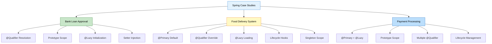
```mermaid
graph TD
    A[Spring Case Studies] --> B[Bank Loan Approval]
    A --> C[Food Delivery System]
    A --> D[Payment Processing]
    
    B --> B1["@Qualifier Resolution"]
    B --> B2[Prototype Scope]
    B --> B3["@Lazy Initialization"]
    B --> B4[Setter Injection]
    
    C --> C1["@Primary Default"]
    C --> C2["@Qualifier Override"]
    C --> C3["@Lazy Loading"]
    C --> C4[Lifecycle Hooks]
    C --> C5[Singleton Scope]
    
    D --> D1["@Primary + @Lazy"]
    D --> D2[Prototype Scope]
    D --> D3[Multiple @Qualifier]
    D --> D4[Lifecycle Management]
    
    style A fill:#e3f2fd,stroke:#1976d2,color:#000
    style B fill:#c8e6c9,stroke:#2e7d32,color:#000
    style C fill:#fff9c4,stroke:#f57f17,color:#000
    style D fill:#bbdefb,stroke:#1565c0,color:#000
```

### 🔍 Why These Case Studies Matter

**Real-World Relevance:**
- Bank Loan Approval → Financial services, validation systems
- Food Delivery → E-commerce, notification systems, order processing
- Payment Processing → Payment gateways, transaction management

**Spring Concepts Demonstrated:**
- Dependency resolution with multiple implementations
- Performance optimization with lazy loading
- Resource management with scopes
- Lifecycle management for cleanup

---

## 2. CASE STUDIES SUMMARY

<div align="center">

</div>

### 📦 Projects Overview Table

| Case Study | Domain | Key Concepts | Complexity | Lines of Code |
|:-----------|:-------|:-------------|:-----------|:--------------|
| **BankLoanApproval** | Finance | @Qualifier, Prototype, @Lazy, Setter DI | ⭐⭐⭐ | ~150 |
| **FoodDelivery** | E-Commerce | @Primary, @Qualifier, @Lazy, Lifecycle | ⭐⭐⭐⭐ | ~200 |
| **PaymentProcessing** | FinTech | @Primary+@Lazy, Prototype, Multiple @Qualifier | ⭐⭐⭐⭐ | ~180 |

### 🎯 Concepts Comparison Matrix

| Concept | BankLoanApproval | FoodDelivery | PaymentProcessing |
|:--------|:----------------|:-------------|:------------------|
| **@Primary** | ✅ CreditScoreValidator | ✅ EmailNotification | ✅ CreditCardPayment |
| **@Qualifier** | ✅ incomeValidator | ✅ smsNotification | ✅ upiPayment + creditCardPayment |
| **@Lazy** | ✅ AuditService | ✅ SmsNotification | ✅ CreditCardPayment |
| **Singleton** | ✅ LoanService | ✅ DeliveryService | ✅ TransactionLogger |
| **Prototype** | ✅ IncomeValidator | ❌ | ✅ UpiPayment |
| **@PostConstruct** | ✅ AuditService | ✅ DeliveryService | ✅ TransactionLogger |
| **@PreDestroy** | ✅ AuditService | ✅ DeliveryService | ✅ TransactionLogger |
| **Constructor DI** | ✅ LoanService | ✅ OrderService | ✅ PaymentProcessor |
| **Setter DI** | ✅ LoanService | ✅ RestaurantService | ❌ |

### 📊 Dependency Resolution Flow

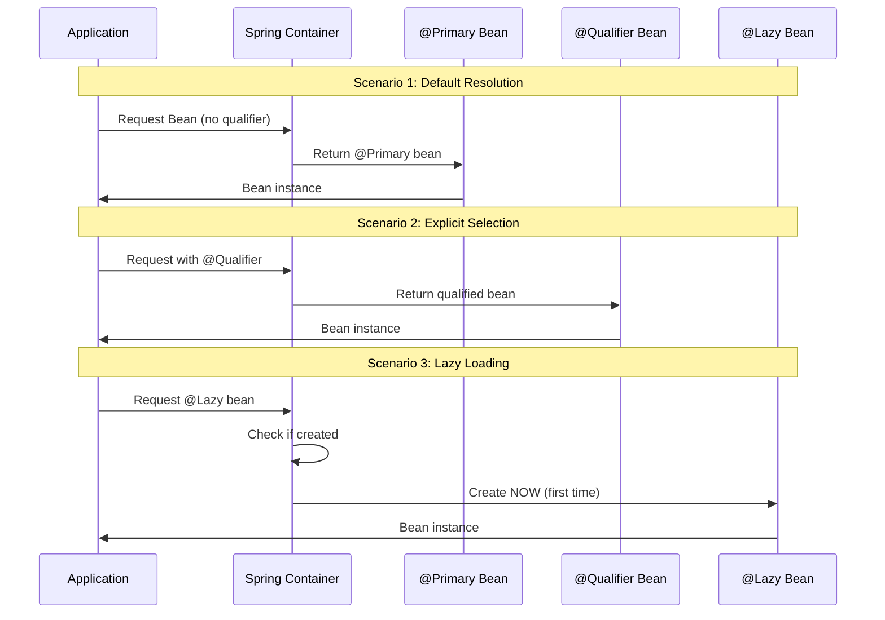
```mermaid
sequenceDiagram
    participant App as Application
    participant Container as Spring Container
    participant Primary as @Primary Bean
    participant Qualified as @Qualifier Bean
    participant Lazy as @Lazy Bean
    
    Note over App,Lazy: Scenario 1: Default Resolution
    App->>Container: Request Bean (no qualifier)
    Container->>Primary: Return @Primary bean
    Primary->>App: Bean instance
    
    Note over App,Lazy: Scenario 2: Explicit Selection
    App->>Container: Request with @Qualifier
    Container->>Qualified: Return qualified bean
    Qualified->>App: Bean instance
    
    Note over App,Lazy: Scenario 3: Lazy Loading
    App->>Container: Request @Lazy bean
    Container->>Container: Check if created
    Container->>Lazy: Create NOW (first time)
    Lazy->>App: Bean instance
```

---

## 3. CASE STUDY 1: BANK LOAN APPROVAL

<div align="center">
  
</div>

### 📌 Business Problem

A bank needs a loan approval system that can validate loan applications using different validation strategies:
- **Income-based validation** (check applicant's income)
- **Credit score validation** (check credit history)

The system must be flexible to switch validators and audit all loan requests.

### 🎯 Spring Concepts Demonstrated

1. **@Qualifier** - Explicitly select IncomeValidator over CreditScoreValidator
2. **@Primary** - CreditScoreValidator as default validator
3. **Prototype Scope** - New IncomeValidator instance per request
4. **@Lazy** - AuditService loaded only when needed
5. **Setter Injection** - AuditService injected via setter
6. **Constructor Injection** - LoanValidator injected via constructor
7. **@PostConstruct/@PreDestroy** - AuditService lifecycle management

### 📊 Architecture Diagram

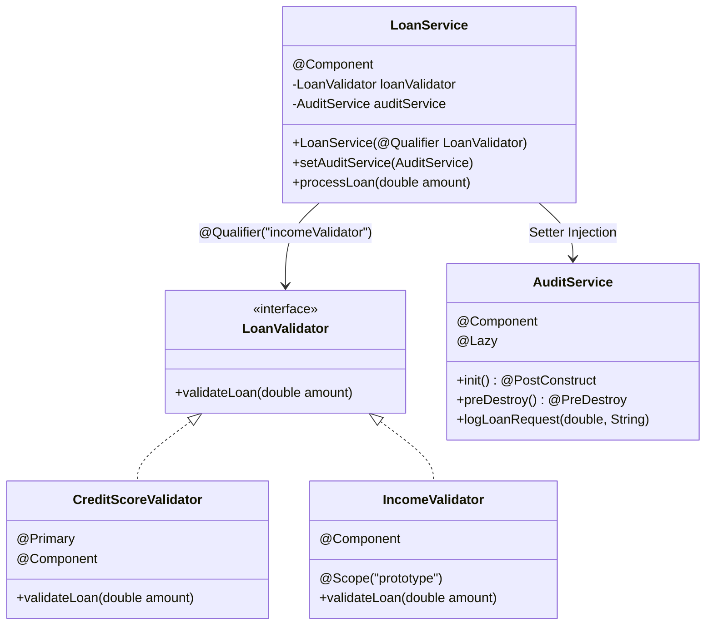
```mermaid
classDiagram
    class LoanValidator {
        <<interface>>
        +validateLoan(double amount)
    }
    
    class CreditScoreValidator {
        @Primary
        @Component
        +validateLoan(double amount)
    }
    
    class IncomeValidator {
        @Component
        @Scope("prototype")
        +validateLoan(double amount)
    }
    
    class LoanService {
        @Component
        -LoanValidator loanValidator
        -AuditService auditService
        +LoanService(@Qualifier LoanValidator)
        +setAuditService(AuditService)
        +processLoan(double amount)
    }
    
    class AuditService {
        @Component
        @Lazy
        +init() @PostConstruct
        +preDestroy() @PreDestroy
        +logLoanRequest(double, String)
    }
    
    LoanValidator <|.. CreditScoreValidator
    LoanValidator <|.. IncomeValidator
    LoanService --> LoanValidator : @Qualifier("incomeValidator")
    LoanService --> AuditService : Setter Injection
```

### 🔍 Component Breakdown

#### 1. LoanValidator Interface

```java
public interface LoanValidator {
    void validateLoan(double amount);
}
```

**Purpose:** Contract for different validation strategies

#### 2. CreditScoreValidator (@Primary)

```java
@Component
@Primary
public class CreditScoreValidator implements LoanValidator {
    @Override
    public void validateLoan(double amount) {
        System.out.println("CreditScoreValidator: Checking credit score for loan of $" + amount);
    }
}
```

**Key Points:**
- Marked with @Primary → Default validator
- Singleton scope (default)
- Used when no @Qualifier specified

#### 3. IncomeValidator (Prototype)

```java
@Component
@Scope("prototype")
public class IncomeValidator implements LoanValidator {
    @Override
    public void validateLoan(double amount) {
        System.out.println("IncomeValidator: Checking income for loan of $" + amount);
    }
}
```

**Key Points:**
- Prototype scope → New instance per request
- Must use @Qualifier to inject
- Useful for stateful validators

#### 4. AuditService (@Lazy)

```java
@Component
@Lazy
public class AuditService {
    @PostConstruct
    public void init() {
        System.out.println("AuditService initialized");
    }
    
    @PreDestroy
    public void preDestroy() {
        System.out.println("AuditService destroyed");
    }
    
    public void logLoanRequest(double amount, String validator) {
        System.out.println("AUDIT: Loan request for $" + amount + " using " + validator);
    }
}
```

**Key Points:**
- @Lazy → Created only when first used
- @PostConstruct → Initialization logic
- @PreDestroy → Cleanup logic
- Injected via setter (optional dependency)

#### 5. LoanService (Main Service)

```java
@Component
public class LoanService {
    private final LoanValidator loanValidator;
    private AuditService auditService;
    
    // Constructor Injection with @Qualifier
    @Autowired
    public LoanService(@Qualifier("incomeValidator") LoanValidator loanValidator) {
        this.loanValidator = loanValidator;
        System.out.println("LoanService created with " + loanValidator.getClass().getSimpleName());
    }
    
    // Setter Injection
    @Autowired
    public void setAuditService(AuditService auditService) {
        this.auditService = auditService;
    }
    
    public void processLoan(double amount) {
        System.out.println("LoanService: Processing loan application");
        auditService.logLoanRequest(amount, loanValidator.getClass().getSimpleName());
        loanValidator.validateLoan(amount);
        System.out.println("LoanService: Loan approved");
    }
}
```

**Key Points:**
- @Qualifier("incomeValidator") → Overrides @Primary
- Constructor injection for required dependency
- Setter injection for optional dependency
- Final field for immutability

### 📊 Execution Flow

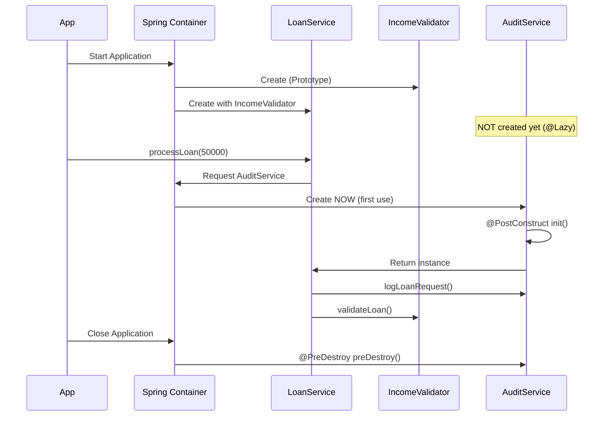
```mermaid
sequenceDiagram
    participant App
    participant Container as Spring Container
    participant LoanService
    participant IncomeValidator
    participant AuditService
    
    App->>Container: Start Application
    Container->>IncomeValidator: Create (Prototype)
    Container->>LoanService: Create with IncomeValidator
    Note over AuditService: NOT created yet (@Lazy)
    
    App->>LoanService: processLoan(50000)
    LoanService->>Container: Request AuditService
    Container->>AuditService: Create NOW (first use)
    AuditService->>AuditService: @PostConstruct init()
    AuditService->>LoanService: Return instance
    LoanService->>AuditService: logLoanRequest()
    LoanService->>IncomeValidator: validateLoan()
    
    App->>Container: Close Application
    Container->>AuditService: @PreDestroy preDestroy()
```

### 🎯 Why This Design?

**@Qualifier Usage:**
- Bank wants to use IncomeValidator specifically
- Overrides the @Primary CreditScoreValidator
- Explicit selection for business requirements

**Prototype Scope for IncomeValidator:**
- Each loan application gets fresh validator
- Prevents state pollution between requests
- Useful if validator maintains state

**@Lazy for AuditService:**
- Audit might not be needed in all scenarios
- Saves startup time
- Created only when loan processing starts

**Setter Injection for AuditService:**
- Audit is optional feature
- Can be null without breaking LoanService
- Allows runtime configuration

### 📈 Output Example

```
LoanService created with IncomeValidator

--- Using IncomeValidator (via @Qualifier) ---
LoanService: Processing loan application
AuditService initialized
AUDIT: Loan request for $50000.0 using IncomeValidator
IncomeValidator: Checking income for loan of $50000.0
LoanService: Loan approved

--- Using CreditScoreValidator (via @Primary) ---
CreditScoreValidator: Checking credit score for loan of $75000.0

Application closed
AuditService destroyed
```

---

## 4. CASE STUDY 2: FOOD DELIVERY SYSTEM

<div align="center">

</div>

### 📌 Business Problem

An online food delivery platform needs a notification system that can send order updates via:
- **Email** (default, most reliable)
- **SMS** (optional, for urgent notifications)

The system must handle order processing, restaurant coordination, and delivery tracking with proper lifecycle management.

### 🎯 Spring Concepts Demonstrated

1. **@Primary** - EmailNotification as default notification method
2. **@Qualifier** - OrderService explicitly uses SMS
3. **@Lazy** - SmsNotification loaded only when needed
4. **Singleton Scope** - DeliveryService shared across application
5. **@PostConstruct/@PreDestroy** - DeliveryService lifecycle
6. **Constructor Injection** - NotificationService in OrderService
7. **Setter Injection** - DeliveryService in RestaurantService
8. **Multiple Bean Resolution** - Different services use different notifications

### 📊 Architecture Diagram

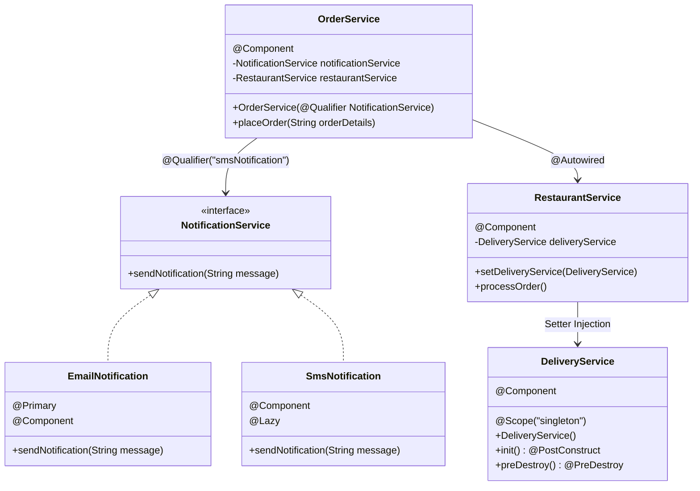
```mermaid
classDiagram
    class NotificationService {
        <<interface>>
        +sendNotification(String message)
    }
    
    class EmailNotification {
        @Primary
        @Component
        +sendNotification(String message)
    }
    
    class SmsNotification {
        @Component
        @Lazy
        +sendNotification(String message)
    }
    
    class OrderService {
        @Component
        -NotificationService notificationService
        -RestaurantService restaurantService
        +OrderService(@Qualifier NotificationService)
        +placeOrder(String orderDetails)
    }
    
    class RestaurantService {
        @Component
        -DeliveryService deliveryService
        +setDeliveryService(DeliveryService)
        +processOrder()
    }
    
    class DeliveryService {
        @Component
        @Scope("singleton")
        +DeliveryService()
        +init() @PostConstruct
        +preDestroy() @PreDestroy
    }
    
    NotificationService <|.. EmailNotification
    NotificationService <|.. SmsNotification
    OrderService --> NotificationService : @Qualifier("smsNotification")
    OrderService --> RestaurantService : @Autowired
    RestaurantService --> DeliveryService : Setter Injection
```

### 🔍 Component Breakdown

#### 1. NotificationService Interface

```java
public interface NotificationService {
    void sendNotification(String message);
}
```

**Purpose:** Contract for different notification channels

#### 2. EmailNotification (@Primary)

```java
@Primary
@Component
public class EmailNotification implements NotificationService {
    {
        System.out.println("Non-Static Block : Email Service is launching !!");
    }
    
    @Override
    public void sendNotification(String message) {
        System.out.println("📧 EMAIL: " + message);
    }
}
```

**Key Points:**
- @Primary → Default notification method
- Non-static initialization block
- Most reliable notification channel
- Used when no @Qualifier specified

#### 3. SmsNotification (@Lazy)

```java
@Component
@Lazy
public class SmsNotification implements NotificationService {
    static {
        System.out.println("Static Block : SMS Service is launching !!");
    }
    
    @Override
    public void sendNotification(String message) {
        System.out.println("📱 SMS: " + message);
    }
}
```

**Key Points:**
- @Lazy → Created only when requested
- Static initialization block
- Expensive SMS gateway connection
- Used with @Qualifier for explicit selection

#### 4. DeliveryService (Singleton with Lifecycle)

```java
@Component
@Scope("singleton")
public class DeliveryService {
    public DeliveryService() {
        System.out.println("-- Delivery Service Activated --");
    }
    
    @PostConstruct
    public void init() {
        System.out.println("Init Method: Delivery Service Ready");
    }
    
    @PreDestroy
    public void preDestroy() {
        System.out.println("Delivery Service Closed");
    }
}
```

**Key Points:**
- Singleton scope → One instance for entire application
- @PostConstruct → Initialize delivery tracking
- @PreDestroy → Cleanup delivery resources
- Shared across all orders

#### 5. RestaurantService (Setter Injection)

```java
@Component
public class RestaurantService {
    private DeliveryService deliveryService;
    
    @Autowired
    public void setDeliveryService(DeliveryService deliveryService) {
        this.deliveryService = deliveryService;
        System.out.println("-- Setter Injection: DeliveryService injected into RestaurantService --");
    }
    
    public void processOrder() {
        System.out.println("Restaurant is processing the order...");
    }
}
```

**Key Points:**
- Setter injection for DeliveryService
- Optional dependency pattern
- Allows runtime configuration

#### 6. OrderService (Constructor Injection with @Qualifier)

```java
@Component
public class OrderService {
    private final NotificationService notificationService;
    
    @Autowired
    private RestaurantService restaurantService;
    
    public OrderService(@Qualifier("smsNotification") NotificationService notificationService) {
        this.notificationService = notificationService;
        System.out.println("-- Constructor Injection: NotificationService injected into OrderService --");
    }
    
    public void placeOrder(String orderDetails) {
        System.out.println("\n=== Placing Order ===");
        restaurantService.processOrder();
        notificationService.sendNotification("Order placed: " + orderDetails);
        System.out.println("=== Order Completed ===\n");
    }
}
```

**Key Points:**
- @Qualifier("smsNotification") → Overrides @Primary
- Constructor injection for required dependency
- Field injection for RestaurantService
- Immutable notificationService with final

### 📊 Execution Flow

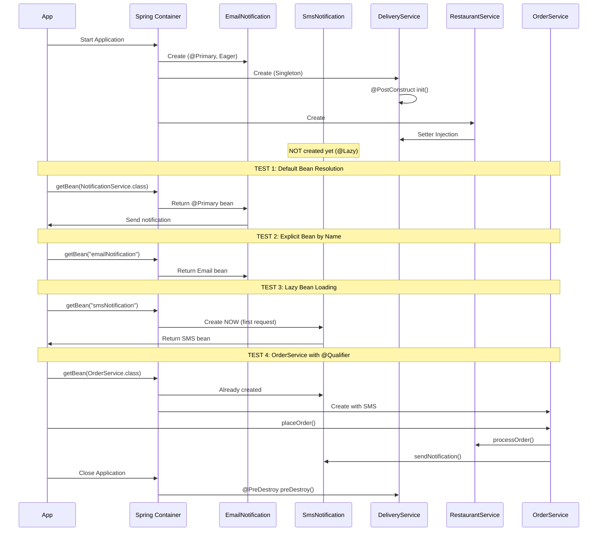
```mermaid
sequenceDiagram
    participant App
    participant Container as Spring Container
    participant Email as EmailNotification
    participant SMS as SmsNotification
    participant Delivery as DeliveryService
    participant Restaurant as RestaurantService
    participant Order as OrderService
    
    App->>Container: Start Application
    Container->>Email: Create (@Primary, Eager)
    Container->>Delivery: Create (Singleton)
    Delivery->>Delivery: @PostConstruct init()
    Container->>Restaurant: Create
    Restaurant->>Delivery: Setter Injection
    Note over SMS: NOT created yet (@Lazy)
    
    Note over App,Order: TEST 1: Default Bean Resolution
    App->>Container: getBean(NotificationService.class)
    Container->>Email: Return @Primary bean
    Email->>App: Send notification
    
    Note over App,Order: TEST 2: Explicit Bean by Name
    App->>Container: getBean("emailNotification")
    Container->>Email: Return Email bean
    
    Note over App,Order: TEST 3: Lazy Bean Loading
    App->>Container: getBean("smsNotification")
    Container->>SMS: Create NOW (first request)
    SMS->>App: Return SMS bean
    
    Note over App,Order: TEST 4: OrderService with @Qualifier
    App->>Container: getBean(OrderService.class)
    Container->>SMS: Already created
    Container->>Order: Create with SMS
    App->>Order: placeOrder()
    Order->>Restaurant: processOrder()
    Order->>SMS: sendNotification()
    
    App->>Container: Close Application
    Container->>Delivery: @PreDestroy preDestroy()
```

### 🎯 Why This Design?

**@Primary for EmailNotification:**
- Email is the most reliable notification method
- Default choice for most services
- Fallback when no specific channel requested

**@Qualifier in OrderService:**
- Orders need immediate SMS notification
- Overrides @Primary for urgent updates
- Business requirement for real-time alerts

**@Lazy for SmsNotification:**
- SMS gateway connection is expensive
- Not all services need SMS
- Created only when OrderService is used

**Singleton for DeliveryService:**
- Shared delivery tracking across all orders
- Single point of coordination
- Resource efficiency

**Lifecycle Management:**
- @PostConstruct → Initialize delivery tracking system
- @PreDestroy → Close delivery connections, save state

### 📈 Output Example

```
--- Online Food Delivery System ----
Non-Static Block : Email Service is launching !!
-- Delivery Service Activated --
Init Method: Delivery Service Ready
-- Setter Injection: DeliveryService injected into RestaurantService --

TEST 1: Default Bean Resolution (@Primary)
📧 EMAIL: Testing default notification (should be Email)

TEST 2: Explicit Bean Resolution by Name
📧 EMAIL: Explicitly requesting Email notification

TEST 3: @Lazy Bean Resolution
Requesting SMS Notification (Lazy-loaded)...
Static Block : SMS Service is launching !!
📱 SMS: SMS notification loaded lazily

TEST 4: OrderService with @Qualifier Override
OrderService uses @Qualifier("smsNotification") to override @Primary
-- Constructor Injection: NotificationService injected into OrderService --

=== Placing Order ===
Restaurant is processing the order...
📱 SMS: Order placed: Pizza Margherita x2, Coke x1
=== Order Completed ===

Closing Application Context...
Delivery Service Closed

Application Shutdown Complete!
```

---

## 5. CASE STUDY 3: PAYMENT PROCESSING

<div align="center">

</div>

### 📌 Business Problem

A payment gateway needs to support multiple payment methods:
- **Credit Card** (default, most common)
- **UPI** (popular in India, fast processing)

The system must log all transactions, support multiple payment methods simultaneously, and manage resources efficiently.

### 🎯 Spring Concepts Demonstrated

1. **@Primary + @Lazy** - CreditCardPayment as default but lazy-loaded
2. **Prototype Scope** - New UpiPayment instance per transaction
3. **Multiple @Qualifier** - PaymentProcessor uses both payment methods
4. **@PostConstruct/@PreDestroy** - TransactionLogger lifecycle
5. **Constructor Injection** - Multiple dependencies with @Qualifier
6. **Field Injection** - TransactionLogger injected via field
7. **Combining Annotations** - @Primary, @Lazy, @Qualifier together

### 📊 Architecture Diagram

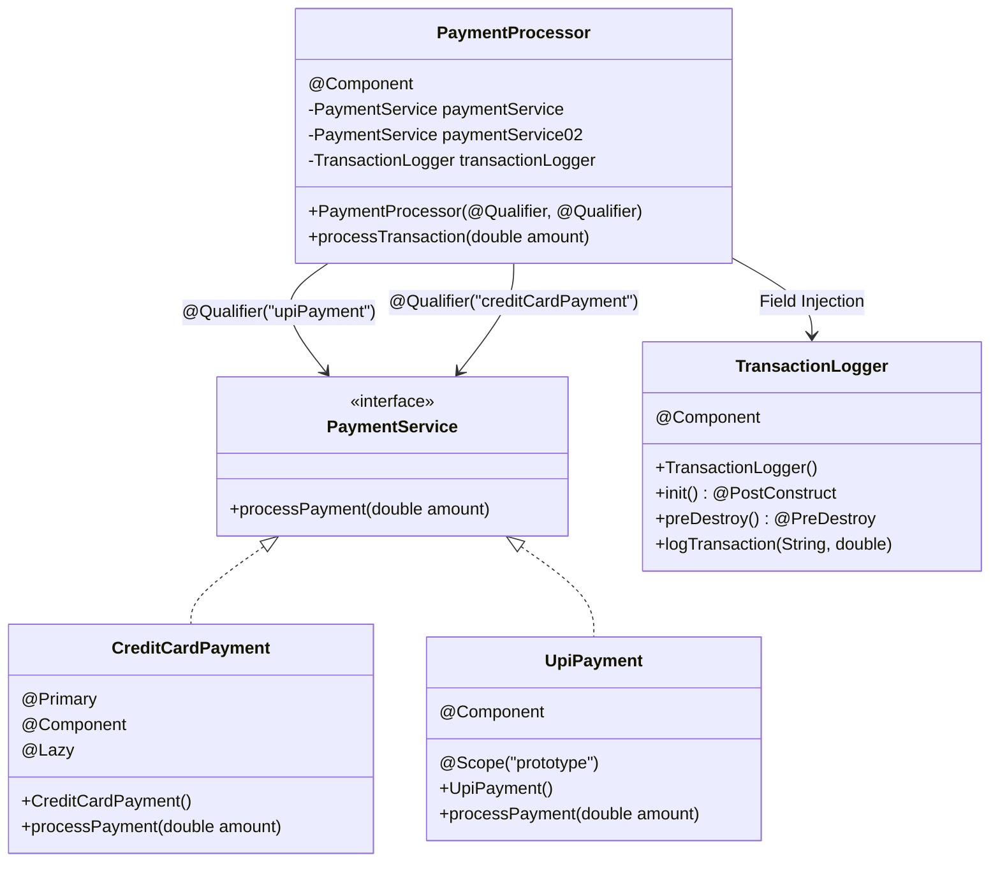
```mermaid
classDiagram
    class PaymentService {
        <<interface>>
        +processPayment(double amount)
    }
    
    class CreditCardPayment {
        @Primary
        @Component
        @Lazy
        +CreditCardPayment()
        +processPayment(double amount)
    }
    
    class UpiPayment {
        @Component
        @Scope("prototype")
        +UpiPayment()
        +processPayment(double amount)
    }
    
    class PaymentProcessor {
        @Component
        -PaymentService paymentService
        -PaymentService paymentService02
        -TransactionLogger transactionLogger
        +PaymentProcessor(@Qualifier, @Qualifier)
        +processTransaction(double amount)
    }
    
    class TransactionLogger {
        @Component
        +TransactionLogger()
        +init() @PostConstruct
        +preDestroy() @PreDestroy
        +logTransaction(String, double)
    }
    
    PaymentService <|.. CreditCardPayment
    PaymentService <|.. UpiPayment
    PaymentProcessor --> PaymentService : @Qualifier("upiPayment")
    PaymentProcessor --> PaymentService : @Qualifier("creditCardPayment")
    PaymentProcessor --> TransactionLogger : Field Injection
```

### 🔍 Component Breakdown

#### 1. PaymentService Interface

```java
public interface PaymentService {
    void processPayment(double amount);
}
```

**Purpose:** Contract for different payment methods

#### 2. CreditCardPayment (@Primary + @Lazy)

```java
@Primary
@Component
@Lazy
public class CreditCardPayment implements PaymentService {
    public CreditCardPayment() {
        System.out.println("CreditCardPayment bean created (Lazy)");
    }
    
    @Override
    public void processPayment(double amount) {
        System.out.println("Processing Credit Card payment of $" + amount);
    }
}
```

**Key Points:**
- @Primary → Default payment method
- @Lazy → Created only when used
- Singleton scope (default)
- Expensive credit card gateway initialization

#### 3. UpiPayment (Prototype)

```java
@Component
@Scope("prototype")
public class UpiPayment implements PaymentService {
    public UpiPayment() {
        System.out.println("UpiPayment bean created (Prototype)");
    }
    
    @Override
    public void processPayment(double amount) {
        System.out.println("Processing UPI payment of " + amount);
    }
}
```

**Key Points:**
- Prototype scope → New instance per request
- Fresh instance for each transaction
- Prevents transaction state mixing
- Must use @Qualifier to inject

#### 4. TransactionLogger (Lifecycle Management)

```java
@Component
public class TransactionLogger {
    public TransactionLogger() {
        System.out.println("TransactionLogger bean created");
    }
    
    @PostConstruct
    public void init() {
        System.out.println("Logger initialized");
    }
    
    @PreDestroy
    public void preDestroy() {
        System.out.println("Logger destroyed");
    }
    
    public void logTransaction(String paymentType, double amount) {
        System.out.println("Transaction logged: " + paymentType + " - " + amount);
    }
}
```

**Key Points:**
- Singleton scope → One logger for all transactions
- @PostConstruct → Open log file, initialize database connection
- @PreDestroy → Flush logs, close connections
- Shared resource management

#### 5. PaymentProcessor (Multiple @Qualifier)

```java
@Component
public class PaymentProcessor {
    private final PaymentService paymentService;
    private final PaymentService paymentService02;
    
    @Autowired
    private TransactionLogger transactionLogger;
    
    // Constructor injection with multiple @Qualifier
    public PaymentProcessor(
            @Qualifier("upiPayment") PaymentService paymentService,
            @Qualifier("creditCardPayment") PaymentService paymentService02) {
        this.paymentService02 = paymentService02;
        this.paymentService = paymentService;
        System.out.println("PaymentProcessor bean created");
    }
    
    public void processTransaction(double amount) {
        System.out.println("\n--- Processing ---");
        paymentService.processPayment(amount);
        transactionLogger.logTransaction("UPI", amount);
        System.out.println("--- Transaction Complete ---\n");
    }
}
```

**Key Points:**
- Two PaymentService dependencies with different @Qualifier
- Constructor injection for payment services
- Field injection for TransactionLogger
- Can switch between payment methods dynamically

### 📊 Execution Flow

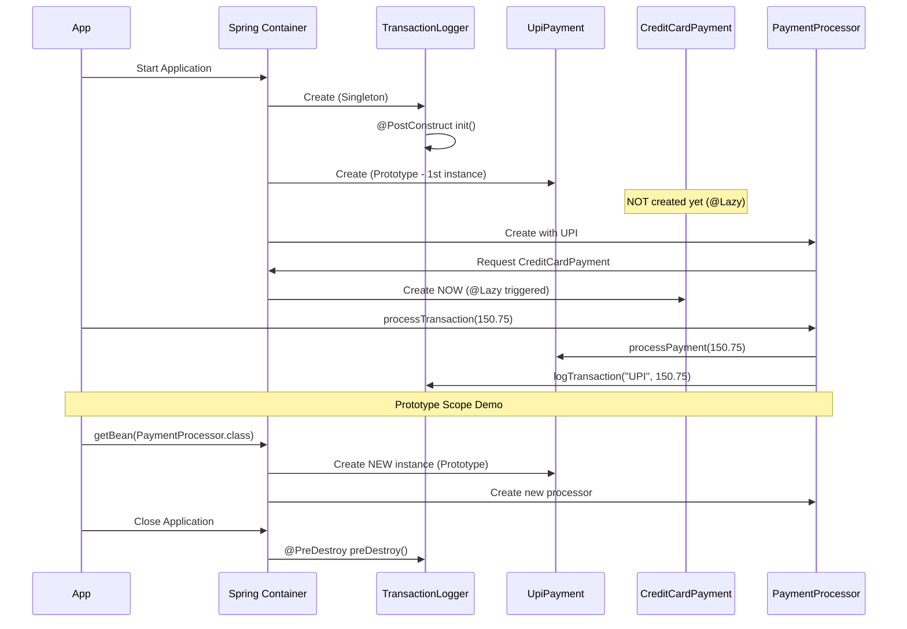
```mermaid
sequenceDiagram
    participant App
    participant Container as Spring Container
    participant Logger as TransactionLogger
    participant UPI as UpiPayment
    participant CC as CreditCardPayment
    participant Processor as PaymentProcessor
    
    App->>Container: Start Application
    Container->>Logger: Create (Singleton)
    Logger->>Logger: @PostConstruct init()
    Container->>UPI: Create (Prototype - 1st instance)
    Note over CC: NOT created yet (@Lazy)
    Container->>Processor: Create with UPI
    Processor->>Container: Request CreditCardPayment
    Container->>CC: Create NOW (@Lazy triggered)
    
    App->>Processor: processTransaction(150.75)
    Processor->>UPI: processPayment(150.75)
    Processor->>Logger: logTransaction("UPI", 150.75)
    
    Note over App,Processor: Prototype Scope Demo
    App->>Container: getBean(PaymentProcessor.class)
    Container->>UPI: Create NEW instance (Prototype)
    Container->>Processor: Create new processor
    
    App->>Container: Close Application
    Container->>Logger: @PreDestroy preDestroy()
```

### 🎯 Why This Design?

**@Primary + @Lazy for CreditCardPayment:**
- Credit card is most common payment method
- But expensive gateway initialization
- Created only when actually used
- Combines default selection with performance optimization

**Prototype for UpiPayment:**
- Each transaction needs fresh payment instance
- Prevents transaction state leakage
- Stateful payment processing
- New instance = clean state

**Multiple @Qualifier in PaymentProcessor:**
- System supports multiple payment methods
- Can process different payment types
- Flexibility to switch at runtime
- Demonstrates complex dependency resolution

**Singleton for TransactionLogger:**
- Centralized logging for all transactions
- Shared resource (log file, database)
- Lifecycle management for cleanup
- Resource efficiency

### 📈 Output Example

```
=== Starting Payment Processing System ===

TransactionLogger bean created
Logger initialized
UpiPayment bean created (Prototype)
CreditCardPayment bean created (Lazy)
PaymentProcessor bean created

--- Processing ---
Processing UPI payment of 150.75
Transaction logged: UPI - 150.75
--- Transaction Complete ---

=== Demonstrating Prototype Scope ===
UpiPayment bean created (Prototype)
PaymentProcessor bean created

--- Processing ---
Processing UPI payment of 200.0
Transaction logged: UPI - 200.0
--- Transaction Complete ---

=== Shutting Down ===
Logger destroyed

=== Application Terminated ===
```

---

## 6. CORE CONCEPTS DEEP DIVE

<div align="center">

</div>

### 📌 Spring Dependency Injection Fundamentals

**What is Dependency Injection?**

Dependency Injection is a design pattern where objects receive their dependencies from external sources rather than creating them internally. Spring IoC Container manages this process automatically.

**Traditional Approach (Without DI):**
```java
public class OrderService {
    private NotificationService notificationService;
    
    public OrderService() {
        // ❌ Tight coupling - creates dependency internally
        this.notificationService = new EmailNotification();
    }
}
```

**Problems:**
- Tight coupling between classes
- Hard to test (can't mock dependencies)
- Difficult to change implementation
- Violates Single Responsibility Principle

**Spring DI Approach:**
```java
@Component
public class OrderService {
    private final NotificationService notificationService;
    
    // ✅ Loose coupling - dependency injected
    @Autowired
    public OrderService(NotificationService notificationService) {
        this.notificationService = notificationService;
    }
}
```

**Benefits:**
- Loose coupling
- Easy to test (inject mocks)
- Flexible implementation switching
- Follows SOLID principles

### 🎯 How Spring Resolves Dependencies

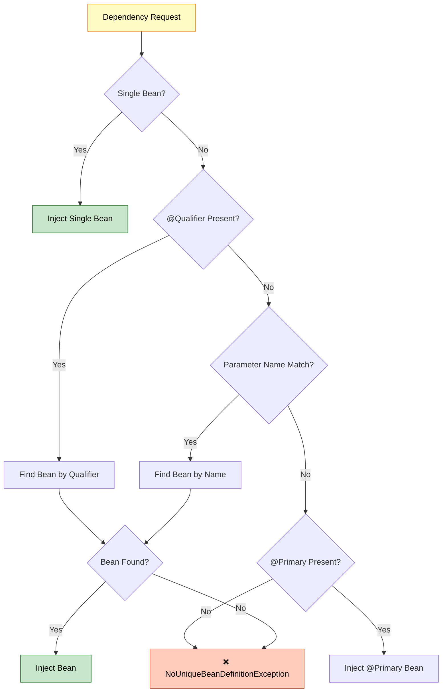
```mermaid
graph TD
    A[Dependency Request] --> B{Single Bean?}
    B -->|Yes| C[Inject Single Bean]
    B -->|No| D{"@Qualifier Present?"}
    
    D -->|Yes| E[Find Bean by Qualifier]
    D -->|No| F{Parameter Name Match?}
    
    F -->|Yes| G[Find Bean by Name]
    F -->|No| H{"@Primary Present?"}
    
    H -->|Yes| I[Inject @Primary Bean]
    H -->|No| J[❌ NoUniqueBeanDefinitionException]
    
    E --> K{Bean Found?}
    G --> K
    K -->|Yes| L[Inject Bean]
    K -->|No| J
    
    style A fill:#fff9c4,stroke:#f57f17,color:#000
    style C fill:#c8e6c9,stroke:#2e7d32,color:#000
    style L fill:#c8e6c9,stroke:#2e7d32,color:#000
    style J fill:#ffccbc,stroke:#d84315,color:#000
```

### 📊 Resolution Priority Table

| Priority | Mechanism | Example | Overrides |
|:---------|:----------|:--------|:----------|
| **1 (Highest)** | @Qualifier | `@Qualifier("smsNotification")` | Everything |
| **2** | Parameter Name | `NotificationService emailNotification` | @Primary, Single |
| **3** | @Primary | `@Primary @Component` | Single Bean |
| **4 (Lowest)** | Single Bean | Only one implementation | Nothing |

---

## 7. @PRIMARY VS @QUALIFIER

<div align="center">

</div>

### 📌 What is @Primary?

**@Primary** marks a bean as the default choice when multiple beans of the same type exist. It's a fallback mechanism when no explicit selection is made.

**When Spring Uses @Primary:**
- No @Qualifier specified
- Parameter name doesn't match any bean
- Multiple beans of same type exist

**Example from FoodDelivery:**
```java
@Primary
@Component
public class EmailNotification implements NotificationService {
    // This is the DEFAULT notification method
}

@Component
public class SmsNotification implements NotificationService {
    // Alternative notification method
}

// Usage
@Component
public class SomeService {
    private final NotificationService service;
    
    // Gets EmailNotification (marked with @Primary)
    public SomeService(NotificationService service) {
        this.service = service;
    }
}
```

### 📌 What is @Qualifier?

**@Qualifier** explicitly selects a specific bean by name. It overrides @Primary and provides precise control over dependency resolution.

**When to Use @Qualifier:**
- Need specific implementation
- Override @Primary selection
- Multiple beans of same type
- Explicit business requirement

**Example from BankLoanApproval:**
```java
@Component
@Primary
public class CreditScoreValidator implements LoanValidator {
    // Default validator
}

@Component
public class IncomeValidator implements LoanValidator {
    // Alternative validator
}

// Usage
@Component
public class LoanService {
    private final LoanValidator validator;
    
    // Gets IncomeValidator (overrides @Primary)
    public LoanService(@Qualifier("incomeValidator") LoanValidator validator) {
        this.validator = validator;
    }
}
```

### 🎯 @Primary vs @Qualifier Comparison

| Aspect | @Primary | @Qualifier |
|:-------|:---------|:-----------|
| **Purpose** | Default selection | Explicit selection |
| **Priority** | Lower (fallback) | Higher (overrides) |
| **Usage** | On bean definition | On injection point |
| **Count** | Only ONE per type | Multiple allowed |
| **Flexibility** | Less flexible | More flexible |
| **Use Case** | Common default | Specific requirement |
| **Overrides** | Single bean only | Everything |

### 📊 Resolution Scenarios

**Scenario 1: No @Qualifier, @Primary Exists**
```java
@Primary
@Component
class EmailNotification implements NotificationService { }

@Component
class SmsNotification implements NotificationService { }

@Component
class MyService {
    // Gets EmailNotification (@Primary)
    public MyService(NotificationService service) { }
}
```

**Scenario 2: @Qualifier Overrides @Primary**
```java
@Primary
@Component
class EmailNotification implements NotificationService { }

@Component
class SmsNotification implements NotificationService { }

@Component
class MyService {
    // Gets SmsNotification (@Qualifier overrides @Primary)
    public MyService(@Qualifier("smsNotification") NotificationService service) { }
}
```

**Scenario 3: Parameter Name Matching**
```java
@Primary
@Component
class EmailNotification implements NotificationService { }

@Component
class SmsNotification implements NotificationService { }

@Component
class MyService {
    // Gets SmsNotification (parameter name matches bean name)
    public MyService(NotificationService smsNotification) { }
}
```

**Scenario 4: Multiple @Primary (ERROR)**
```java
@Primary
@Component
class EmailNotification implements NotificationService { }

@Primary  // ❌ ERROR: Only ONE @Primary allowed per type
@Component
class SmsNotification implements NotificationService { }
```

### 🔍 Internal Working

**How Spring Processes @Primary:**

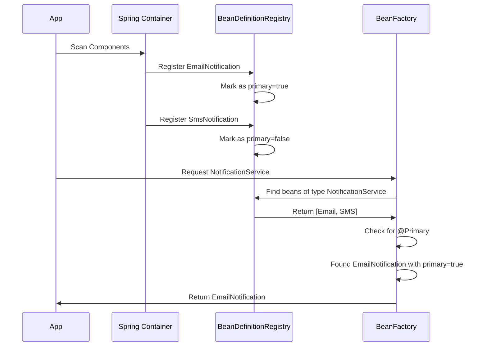
```mermaid
sequenceDiagram
    participant App
    participant Container as Spring Container
    participant Registry as BeanDefinitionRegistry
    participant Factory as BeanFactory
    
    App->>Container: Scan Components
    Container->>Registry: Register EmailNotification
    Registry->>Registry: Mark as primary=true
    Container->>Registry: Register SmsNotification
    Registry->>Registry: Mark as primary=false
    
    App->>Factory: Request NotificationService
    Factory->>Registry: Find beans of type NotificationService
    Registry->>Factory: Return [Email, SMS]
    Factory->>Factory: Check for @Primary
    Factory->>Factory: Found EmailNotification with primary=true
    Factory->>App: Return EmailNotification
```

**How Spring Processes @Qualifier:**

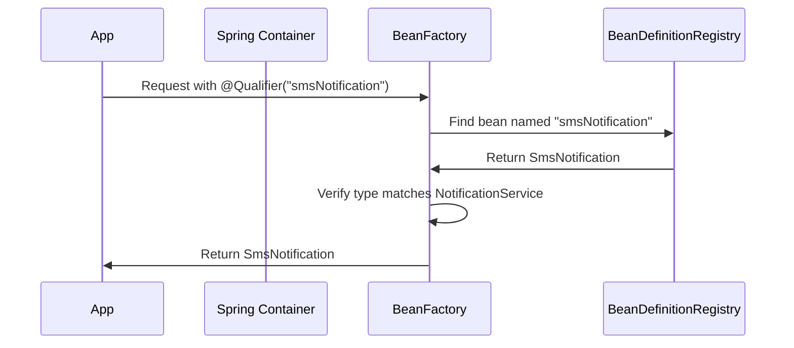
```mermaid
sequenceDiagram
    participant App
    participant Container as Spring Container
    participant Factory as BeanFactory
    participant Registry as BeanDefinitionRegistry
    
    App->>Factory: Request with @Qualifier("smsNotification")
    Factory->>Registry: Find bean named "smsNotification"
    Registry->>Factory: Return SmsNotification
    Factory->>Factory: Verify type matches NotificationService
    Factory->>App: Return SmsNotification
```

### 🎯 Best Practices

**Use @Primary When:**
- ✅ One implementation is clearly the default
- ✅ Most services should use this implementation
- ✅ Fallback behavior is desired
- ✅ Simplify configuration for common case

**Use @Qualifier When:**
- ✅ Need specific implementation
- ✅ Business logic requires particular bean
- ✅ Override default behavior
- ✅ Multiple beans needed in same class

**Avoid:**
- ❌ Multiple @Primary for same type
- ❌ @Qualifier without clear reason
- ❌ Overusing @Qualifier (consider separate interfaces)
- ❌ Mixing @Primary with unclear naming

---

## 8. @LAZY INITIALIZATION

<div align="center">

</div>

### 📌 What is @Lazy?

**@Lazy** tells Spring to delay bean creation until it's first requested, rather than creating it at application startup. This is a performance optimization technique.

**Default Behavior (Eager):**
```java
@Component
public class EmailService {
    public EmailService() {
        System.out.println("EmailService created at startup");
    }
}
// Output at startup: "EmailService created at startup"
```

**With @Lazy:**
```java
@Component
@Lazy
public class SmsService {
    public SmsService() {
        System.out.println("SmsService created on first use");
    }
}
// No output at startup
// Output when first used: "SmsService created on first use"
```

### 🎯 Why @Lazy Exists

**Problem: Slow Application Startup**

Imagine an application with 100 beans, each taking 1 second to initialize:
- Without @Lazy: 100 seconds startup time
- With @Lazy (50% lazy): 50 seconds startup time
- User waits less, application feels faster

**Real-World Example from Case Studies:**

**AuditService in BankLoanApproval:**
```java
@Component
@Lazy
public class AuditService {
    @PostConstruct
    public void init() {
        // Expensive: Connect to audit database
        // Load audit configuration
        // Initialize audit logger
        System.out.println("AuditService initialized");
    }
}
```

**Why Lazy?**
- Audit might not be needed immediately
- Expensive database connection
- Not all loan operations require audit
- Faster application startup

**SmsNotification in FoodDelivery:**
```java
@Component
@Lazy
public class SmsNotification implements NotificationService {
    static {
        // Expensive: Connect to SMS gateway
        // Load SMS templates
        // Initialize SMS client
        System.out.println("SMS Service is launching !!");
    }
}
```

**Why Lazy?**
- SMS gateway connection is expensive
- Not all orders need SMS notification
- Email is default (@Primary)
- SMS used only for urgent orders

**CreditCardPayment in PaymentProcessing:**
```java
@Primary
@Component
@Lazy
public class CreditCardPayment implements PaymentService {
    public CreditCardPayment() {
        // Expensive: Connect to payment gateway
        // Load encryption keys
        // Initialize payment processor
        System.out.println("CreditCardPayment bean created (Lazy)");
    }
}
```

**Why Lazy?**
- Payment gateway initialization is expensive
- Not all application features need payment
- Created only when payment is processed
- Combines @Primary (default) with @Lazy (performance)

### 📊 Eager vs Lazy Comparison

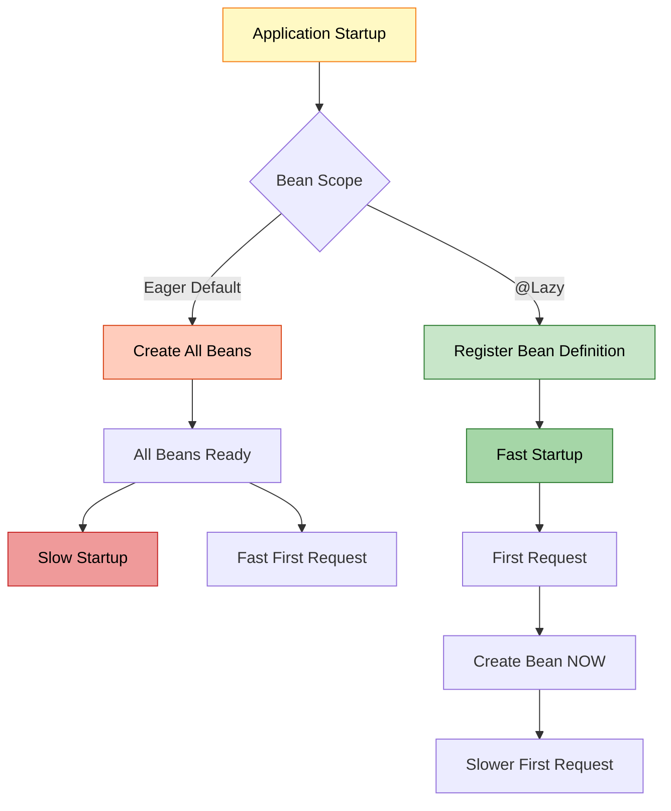
```mermaid
graph TD
    A[Application Startup] --> B{Bean Scope}
    B -->|Eager Default| C[Create All Beans]
    B -->|"@Lazy"| D[Register Bean Definition]
    
    C --> E[All Beans Ready]
    E --> F[Slow Startup]
    E --> G[Fast First Request]
    
    D --> H[Fast Startup]
    H --> I[First Request]
    I --> J[Create Bean NOW]
    J --> K[Slower First Request]
    
    style A fill:#fff9c4,stroke:#f57f17,color:#000
    style C fill:#ffccbc,stroke:#d84315,color:#000
    style D fill:#c8e6c9,stroke:#2e7d32,color:#000
    style F fill:#ef9a9a,stroke:#c62828,color:#000
    style H fill:#a5d6a7,stroke:#2e7d32,color:#000
```

| Aspect | Eager (Default) | @Lazy |
|:-------|:---------------|:------|
| **Creation Time** | Application startup | First use |
| **Startup Speed** | ❌ Slower | ✅ Faster |
| **First Request** | ✅ Fast | ❌ Slower |
| **Memory Usage** | ❌ Higher (all beans) | ✅ Lower (only used) |
| **Error Detection** | ✅ Immediate | ❌ Delayed |
| **Use Case** | Always-used beans | Rarely-used beans |

### 🔍 Internal Working

**Lazy Bean Creation Process:**

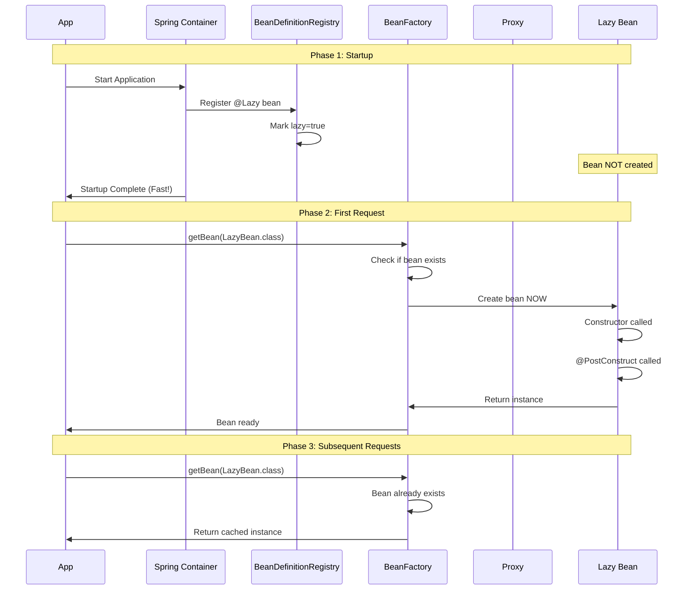
```mermaid
sequenceDiagram
    participant App
    participant Container as Spring Container
    participant Registry as BeanDefinitionRegistry
    participant Factory as BeanFactory
    participant Proxy
    participant Bean as Lazy Bean
    
    Note over App,Bean: Phase 1: Startup
    App->>Container: Start Application
    Container->>Registry: Register @Lazy bean
    Registry->>Registry: Mark lazy=true
    Note over Bean: Bean NOT created
    Container->>App: Startup Complete (Fast!)
    
    Note over App,Bean: Phase 2: First Request
    App->>Factory: getBean(LazyBean.class)
    Factory->>Factory: Check if bean exists
    Factory->>Bean: Create bean NOW
    Bean->>Bean: Constructor called
    Bean->>Bean: @PostConstruct called
    Bean->>Factory: Return instance
    Factory->>App: Bean ready
    
    Note over App,Bean: Phase 3: Subsequent Requests
    App->>Factory: getBean(LazyBean.class)
    Factory->>Factory: Bean already exists
    Factory->>App: Return cached instance
```

**Lazy with Dependency Injection (Proxy Pattern):**

When @Lazy bean is injected into another bean, Spring creates a proxy:

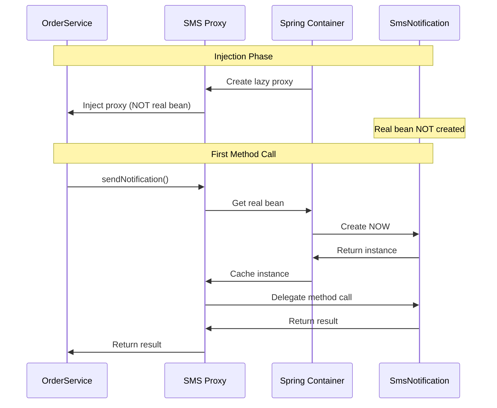
```mermaid
sequenceDiagram
    participant Service as OrderService
    participant Proxy as SMS Proxy
    participant Container as Spring Container
    participant Bean as SmsNotification
    
    Note over Service,Bean: Injection Phase
    Container->>Proxy: Create lazy proxy
    Proxy->>Service: Inject proxy (NOT real bean)
    Note over Bean: Real bean NOT created
    
    Note over Service,Bean: First Method Call
    Service->>Proxy: sendNotification()
    Proxy->>Container: Get real bean
    Container->>Bean: Create NOW
    Bean->>Container: Return instance
    Container->>Proxy: Cache instance
    Proxy->>Bean: Delegate method call
    Bean->>Proxy: Return result
    Proxy->>Service: Return result
```

### 🎯 When to Use @Lazy

**Use @Lazy When:**
- ✅ Bean initialization is expensive (database, network)
- ✅ Bean is rarely used
- ✅ Want faster application startup
- ✅ Optional features that may not be needed
- ✅ Breaking circular dependencies

**Avoid @Lazy When:**
- ❌ Bean is always used
- ❌ Want fail-fast behavior
- ❌ Initialization is quick
- ❌ Need predictable performance

### 📈 Performance Impact

**Example: E-Commerce Application**

Without @Lazy:
```
Startup Time: 30 seconds
- EmailService: 2s
- SmsService: 3s
- PaymentGateway: 5s
- ReportGenerator: 8s
- DataExporter: 7s
- Other services: 5s

First Request: 10ms
```

With @Lazy (50% lazy):
```
Startup Time: 12 seconds
- EmailService: 2s (eager - always used)
- PaymentGateway: 5s (eager - critical)
- Other services: 5s

First Request: 25ms (creates lazy beans)
- SmsService: 3s (lazy - rarely used)
- ReportGenerator: 8s (lazy - admin only)
- DataExporter: 7s (lazy - admin only)

User Experience: 60% faster startup!
```

---

## 9. BEAN SCOPES

<div align="center">
  
</div>

### 📌 What are Bean Scopes?

**Bean Scope** defines the lifecycle and visibility of a bean instance. It determines how many instances Spring creates and when they're created/destroyed.

### 🎯 Available Scopes

| Scope | Instances | Lifecycle | Use Case |
|:------|:----------|:----------|:---------|
| **Singleton** | 1 per container | Container lifetime | Stateless services |
| **Prototype** | New per request | Until garbage collected | Stateful objects |
| **Request** | 1 per HTTP request | Request lifetime | Web - Request data |
| **Session** | 1 per HTTP session | Session lifetime | Web - User session |
| **Application** | 1 per ServletContext | Application lifetime | Web - Shared data |
| **WebSocket** | 1 per WebSocket | WebSocket lifetime | WebSocket connections |

**Note:** Request, Session, Application, and WebSocket scopes are only available in web applications.

### 📊 Singleton vs Prototype (Our Case Studies)

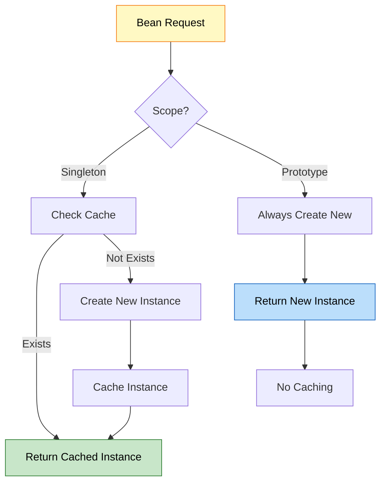
```mermaid
graph TD
    A[Bean Request] --> B{Scope?}
    B -->|Singleton| C[Check Cache]
    C -->|Exists| D[Return Cached Instance]
    C -->|Not Exists| E[Create New Instance]
    E --> F[Cache Instance]
    F --> D
    
    B -->|Prototype| G[Always Create New]
    G --> H[Return New Instance]
    H --> I[No Caching]
    
    style A fill:#fff9c4,stroke:#f57f17,color:#000
    style D fill:#c8e6c9,stroke:#2e7d32,color:#000
    style H fill:#bbdefb,stroke:#1565c0,color:#000
```

### 🔍 Singleton Scope (Default)

**Definition:** Spring creates only ONE instance per container. All requests get the same instance.

**Example from FoodDelivery:**
```java
@Component
@Scope("singleton")  // Default, can be omitted
public class DeliveryService {
    public DeliveryService() {
        System.out.println("-- Delivery Service Activated --");
    }
}
```

**Behavior:**
```java
DeliveryService service1 = context.getBean(DeliveryService.class);
DeliveryService service2 = context.getBean(DeliveryService.class);

System.out.println(service1 == service2);  // true (same instance)
```

**Output:**
```
-- Delivery Service Activated --  (created once)
true
```

**When to Use Singleton:**
- ✅ Stateless services
- ✅ Shared resources (database connections, caches)
- ✅ Thread-safe beans
- ✅ Configuration beans
- ✅ Most Spring beans

**Example: TransactionLogger (PaymentProcessing)**
```java
@Component  // Singleton by default
public class TransactionLogger {
    // Shared logger for all transactions
    // One instance serves entire application
}
```

**Why Singleton?**
- All transactions logged to same file
- Shared resource management
- Memory efficient
- Thread-safe logging

### 🔍 Prototype Scope

**Definition:** Spring creates a NEW instance every time the bean is requested.

**Example from BankLoanApproval:**
```java
@Component
@Scope("prototype")
public class IncomeValidator implements LoanValidator {
    @Override
    public void validateLoan(double amount) {
        System.out.println("IncomeValidator: Checking income for loan of $" + amount);
    }
}
```

**Behavior:**
```java
IncomeValidator validator1 = context.getBean(IncomeValidator.class);
IncomeValidator validator2 = context.getBean(IncomeValidator.class);

System.out.println(validator1 == validator2);  // false (different instances)
```

**Output:**
```
IncomeValidator created  (first request)
IncomeValidator created  (second request)
false
```

**When to Use Prototype:**
- ✅ Stateful objects
- ✅ Per-request processing
- ✅ Mutable beans
- ✅ Thread-unsafe beans
- ✅ Temporary objects

**Example: UpiPayment (PaymentProcessing)**
```java
@Component
@Scope("prototype")
public class UpiPayment implements PaymentService {
    // New instance per transaction
    // Prevents transaction state mixing
}
```

**Why Prototype?**
- Each transaction needs fresh payment instance
- Transaction state isolation
- Prevents data leakage between transactions
- Clean state for each payment

### 📊 Singleton vs Prototype Comparison

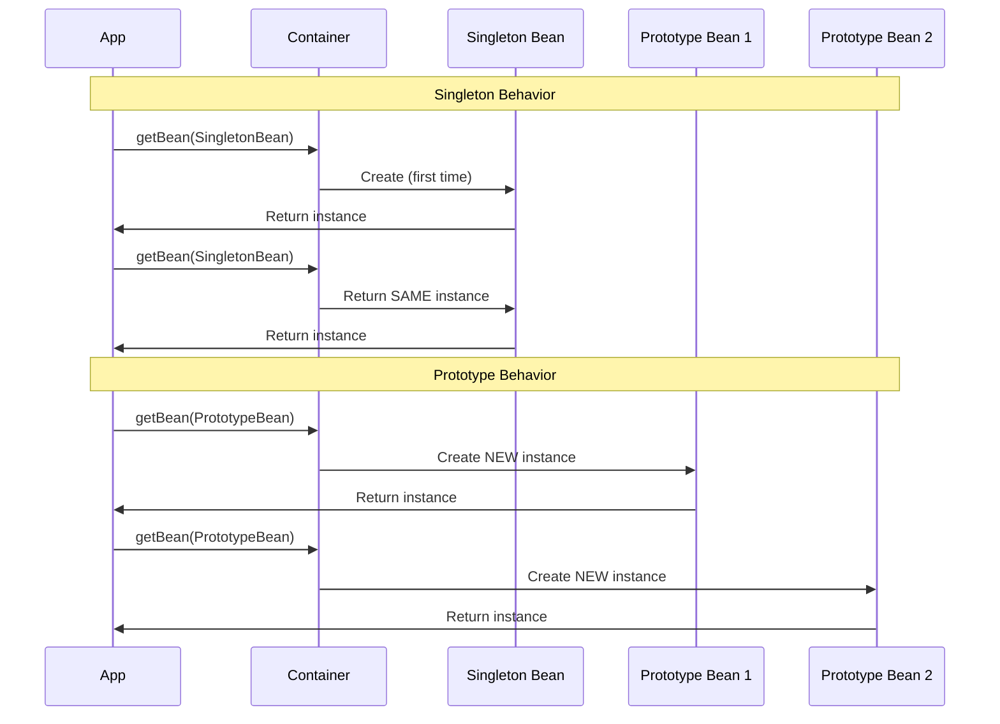
```mermaid
sequenceDiagram
    participant App
    participant Container
    participant Singleton as Singleton Bean
    participant Proto1 as Prototype Bean 1
    participant Proto2 as Prototype Bean 2
    
    Note over App,Proto2: Singleton Behavior
    App->>Container: getBean(SingletonBean)
    Container->>Singleton: Create (first time)
    Singleton->>App: Return instance
    
    App->>Container: getBean(SingletonBean)
    Container->>Singleton: Return SAME instance
    Singleton->>App: Return instance
    
    Note over App,Proto2: Prototype Behavior
    App->>Container: getBean(PrototypeBean)
    Container->>Proto1: Create NEW instance
    Proto1->>App: Return instance
    
    App->>Container: getBean(PrototypeBean)
    Container->>Proto2: Create NEW instance
    Proto2->>App: Return instance
```

| Aspect | Singleton | Prototype |
|:-------|:----------|:----------|
| **Instances** | 1 per container | New per request |
| **Creation** | At startup (eager) or first use (lazy) | Every getBean() call |
| **Caching** | ✅ Cached | ❌ Not cached |
| **Memory** | Low (one instance) | Higher (multiple instances) |
| **Thread Safety** | Must be thread-safe | Each thread gets own instance |
| **Lifecycle** | Container manages | Container creates, app manages |
| **@PreDestroy** | ✅ Called | ❌ NOT called |
| **Use Case** | Stateless services | Stateful objects |

### 🎯 Scope Interaction Gotcha

**Problem: Singleton with Prototype Dependency**

```java
@Component
@Scope("singleton")
public class OrderService {
    @Autowired
    private PaymentProcessor processor;  // Prototype
    
    public void processOrder() {
        processor.process();  // ALWAYS SAME INSTANCE!
    }
}
```

**Issue:** Singleton is created once, so it gets ONE prototype instance and keeps reusing it!

**Solution 1: Method Injection**
```java
@Component
@Scope("singleton")
public class OrderService {
    @Autowired
    private ApplicationContext context;
    
    public void processOrder() {
        PaymentProcessor processor = context.getBean(PaymentProcessor.class);
        processor.process();  // NEW instance each time
    }
}
```

**Solution 2: @Lookup**
```java
@Component
@Scope("singleton")
public abstract class OrderService {
    public void processOrder() {
        PaymentProcessor processor = getProcessor();
        processor.process();  // NEW instance each time
    }
    
    @Lookup
    protected abstract PaymentProcessor getProcessor();
}
```

### 📈 Performance Implications

**Singleton:**
- ✅ Fast (cached instance)
- ✅ Low memory usage
- ✅ Efficient for stateless services
- ⚠️ Must be thread-safe

**Prototype:**
- ⚠️ Slower (creates new instance)
- ⚠️ Higher memory usage
- ✅ No thread safety concerns
- ✅ Clean state per request

---

## 10. BEAN LIFECYCLE

<div align="center">

</div>

### 📌 What is Bean Lifecycle?

**Bean Lifecycle** is the complete journey of a Spring bean from creation to destruction. Spring provides hooks at various stages for custom initialization and cleanup logic.

### 🎯 Complete Lifecycle Phases

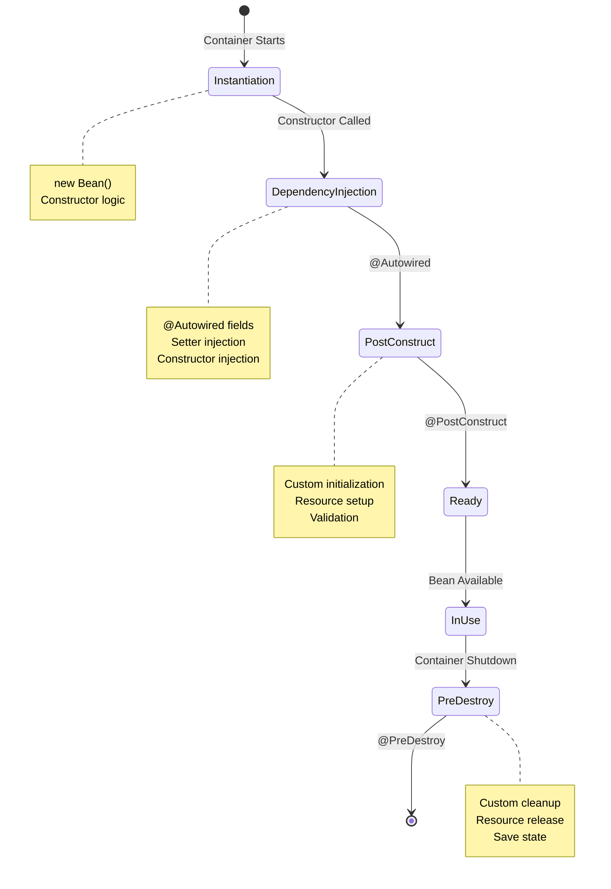
```mermaid
stateDiagram-v2
    [*] --> Instantiation: Container Starts
    Instantiation --> DependencyInjection: Constructor Called
    DependencyInjection --> PostConstruct: @Autowired
    PostConstruct --> Ready: @PostConstruct
    Ready --> InUse: Bean Available
    InUse --> PreDestroy: Container Shutdown
    PreDestroy --> [*]: @PreDestroy
    
    note right of Instantiation
        new Bean()
        Constructor logic
    end note
    
    note right of DependencyInjection
        @Autowired fields
        Setter injection
        Constructor injection
    end note
    
    note right of PostConstruct
        Custom initialization
        Resource setup
        Validation
    end note
    
    note right of PreDestroy
        Custom cleanup
        Resource release
        Save state
    end note
```

### 📊 Lifecycle Phases Breakdown

| Phase | Description | When | Example |
|:------|:-----------|:-----|:--------|
| **1. Instantiation** | Bean object created | Container startup | `new DeliveryService()` |
| **2. Dependency Injection** | Dependencies injected | After instantiation | `@Autowired` fields set |
| **3. @PostConstruct** | Custom initialization | After DI complete | Open connections |
| **4. Bean Ready** | Bean available for use | After initialization | Application uses bean |
| **5. @PreDestroy** | Custom cleanup | Before destruction | Close connections |
| **6. Destruction** | Bean removed | Container shutdown | Memory released |

### 🔍 @PostConstruct Deep Dive

**What is @PostConstruct?**

@PostConstruct marks a method to be executed AFTER dependency injection is complete. It's the recommended way to perform initialization logic.

**Why @PostConstruct Exists:**

**Problem: Constructor Limitations**
```java
@Component
public class DeliveryService {
    @Autowired
    private DatabaseConnection connection;
    
    public DeliveryService() {
        // ❌ PROBLEM: connection is NULL here!
        connection.connect();  // NullPointerException!
    }
}
```

**Solution: @PostConstruct**
```java
@Component
public class DeliveryService {
    @Autowired
    private DatabaseConnection connection;
    
    public DeliveryService() {
        System.out.println("Constructor: connection is " + connection);
        // Output: Constructor: connection is null
    }
    
    @PostConstruct
    public void init() {
        System.out.println("PostConstruct: connection is " + connection);
        // Output: PostConstruct: connection is DatabaseConnection@123
        
        // ✅ SAFE: Dependencies are injected
        connection.connect();
    }
}
```

**Example from FoodDelivery:**
```java
@Component
@Scope("singleton")
public class DeliveryService {
    public DeliveryService() {
        System.out.println("-- Delivery Service Activated --");
    }
    
    @PostConstruct
    public void init() {
        System.out.println("Init Method: Delivery Service Ready");
        // Initialize delivery tracking system
        // Connect to GPS service
        // Load delivery routes
    }
}
```

**Example from PaymentProcessing:**
```java
@Component
public class TransactionLogger {
    public TransactionLogger() {
        System.out.println("TransactionLogger bean created");
    }
    
    @PostConstruct
    public void init() {
        System.out.println("Logger initialized");
        // Open log file
        // Connect to logging database
        // Initialize log buffer
    }
}
```

**@PostConstruct Rules:**
- Must be `void` return type
- Must have no parameters
- Can be any access modifier (public, private, protected)
- Must NOT be static
- Can throw checked exceptions
- Called AFTER all dependencies injected

### 🔍 @PreDestroy Deep Dive

**What is @PreDestroy?**

@PreDestroy marks a method to be executed BEFORE the bean is destroyed. It's the recommended way to perform cleanup logic.

**Why @PreDestroy Exists:**

**Problem: Resource Leaks**
```java
@Component
public class FileProcessor {
    private FileWriter writer;
    
    @PostConstruct
    public void init() throws IOException {
        writer = new FileWriter("output.txt");
    }
    
    // ❌ PROBLEM: File never closed!
    // Resource leak when application shuts down
}
```

**Solution: @PreDestroy**
```java
@Component
public class FileProcessor {
    private FileWriter writer;
    
    @PostConstruct
    public void init() throws IOException {
        writer = new FileWriter("output.txt");
    }
    
    @PreDestroy
    public void cleanup() throws IOException {
        if (writer != null) {
            writer.close();  // ✅ Properly closed
            System.out.println("File closed");
        }
    }
}
```

**Example from FoodDelivery:**
```java
@Component
@Scope("singleton")
public class DeliveryService {
    @PreDestroy
    public void preDestroy() {
        System.out.println("Delivery Service Closed");
        // Close GPS connections
        // Save delivery state
        // Flush pending deliveries
    }
}
```

**Example from PaymentProcessing:**
```java
@Component
public class TransactionLogger {
    @PreDestroy
    public void preDestroy() {
        System.out.println("Logger destroyed");
        // Flush log buffer
        // Close log file
        // Disconnect from logging database
    }
}
```

**@PreDestroy Rules:**
- Must be `void` return type
- Must have no parameters
- Can be any access modifier
- Must NOT be static
- Can throw checked exceptions
- Called BEFORE bean destruction
- **NOT called for Prototype beans!**

### 📊 Lifecycle Execution Order

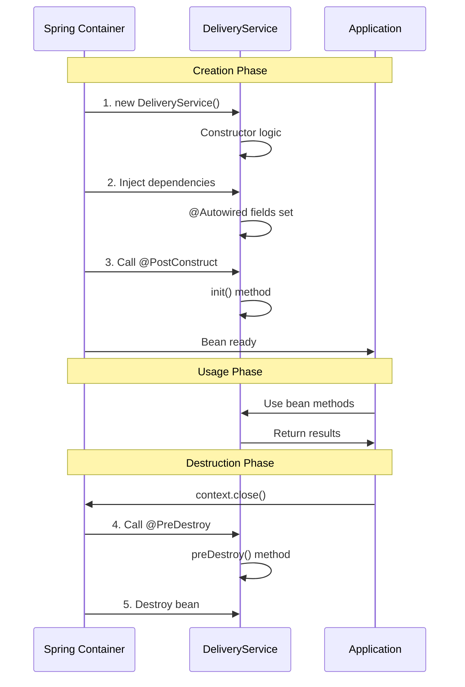
```mermaid
sequenceDiagram
    participant Container as Spring Container
    participant Bean as DeliveryService
    participant App as Application
    
    Note over Container,App: Creation Phase
    Container->>Bean: 1. new DeliveryService()
    Bean->>Bean: Constructor logic
    Container->>Bean: 2. Inject dependencies
    Bean->>Bean: @Autowired fields set
    Container->>Bean: 3. Call @PostConstruct
    Bean->>Bean: init() method
    Container->>App: Bean ready
    
    Note over Container,App: Usage Phase
    App->>Bean: Use bean methods
    Bean->>App: Return results
    
    Note over Container,App: Destruction Phase
    App->>Container: context.close()
    Container->>Bean: 4. Call @PreDestroy
    Bean->>Bean: preDestroy() method
    Container->>Bean: 5. Destroy bean
```

**Complete Example:**
```java
@Component
public class CompleteLifecycleBean {
    @Autowired
    private SomeDependency dependency;
    
    // Phase 1: Instantiation
    public CompleteLifecycleBean() {
        System.out.println("1. Constructor called");
        System.out.println("   dependency = " + dependency);  // null
    }
    
    // Phase 2: Dependency Injection happens here
    
    // Phase 3: Initialization
    @PostConstruct
    public void init() {
        System.out.println("2. @PostConstruct called");
        System.out.println("   dependency = " + dependency);  // NOT null
        // Safe to use dependencies here
    }
    
    // Phase 4: Bean Ready - Application uses it
    
    // Phase 5: Cleanup
    @PreDestroy
    public void cleanup() {
        System.out.println("3. @PreDestroy called");
        // Cleanup resources
    }
}
```

**Output:**
```
1. Constructor called
   dependency = null
2. @PostConstruct called
   dependency = SomeDependency@123
3. @PreDestroy called
```

### 🎯 Lifecycle with Different Scopes

**Singleton Scope:**
```java
@Component
@Scope("singleton")
public class SingletonBean {
    @PostConstruct
    public void init() {
        System.out.println("Singleton init - called ONCE");
    }
    
    @PreDestroy
    public void cleanup() {
        System.out.println("Singleton cleanup - called ONCE");
    }
}
```

**Prototype Scope:**
```java
@Component
@Scope("prototype")
public class PrototypeBean {
    @PostConstruct
    public void init() {
        System.out.println("Prototype init - called EVERY TIME");
    }
    
    @PreDestroy
    public void cleanup() {
        System.out.println("Prototype cleanup - NEVER CALLED!");
    }
}
```

**Important:** @PreDestroy is NOT called for Prototype beans because Spring doesn't manage their complete lifecycle!

---

## 11. DEPENDENCY INJECTION PATTERNS

<div align="center">

</div>

### 📌 Types of Dependency Injection

Spring supports three types of dependency injection:
1. **Constructor Injection** (Recommended ✅)
2. **Setter Injection** (For optional dependencies)
3. **Field Injection** (Not recommended ❌)

### 🎯 Constructor Injection (Recommended)

**Definition:** Dependencies are provided through the constructor.

**Example from BankLoanApproval:**
```java
@Component
public class LoanService {
    private final LoanValidator loanValidator;
    
    @Autowired  // Optional for single constructor
    public LoanService(@Qualifier("incomeValidator") LoanValidator loanValidator) {
        this.loanValidator = loanValidator;
    }
}
```

**Example from FoodDelivery:**
```java
@Component
public class OrderService {
    private final NotificationService notificationService;
    
    public OrderService(@Qualifier("smsNotification") NotificationService notificationService) {
        this.notificationService = notificationService;
    }
}
```

**Example from PaymentProcessing:**
```java
@Component
public class PaymentProcessor {
    private final PaymentService paymentService;
    private final PaymentService paymentService02;
    
    public PaymentProcessor(
            @Qualifier("upiPayment") PaymentService paymentService,
            @Qualifier("creditCardPayment") PaymentService paymentService02) {
        this.paymentService = paymentService;
        this.paymentService02 = paymentService02;
    }
}
```

**Advantages:**
- ✅ Immutability (final fields)
- ✅ Required dependencies enforced
- ✅ Easy to test (no reflection needed)
- ✅ Null-safe (dependencies guaranteed)
- ✅ Clear dependencies in constructor signature

### 🎯 Setter Injection

**Definition:** Dependencies are provided through setter methods.

**Example from BankLoanApproval:**
```java
@Component
public class LoanService {
    private AuditService auditService;
    
    @Autowired
    public void setAuditService(AuditService auditService) {
        this.auditService = auditService;
    }
}
```

**Example from FoodDelivery:**
```java
@Component
public class RestaurantService {
    private DeliveryService deliveryService;
    
    @Autowired
    public void setDeliveryService(DeliveryService deliveryService) {
        this.deliveryService = deliveryService;
        System.out.println("-- Setter Injection: DeliveryService injected --");
    }
}
```

**Advantages:**
- ✅ Optional dependencies
- ✅ Allows reconfiguration
- ✅ Circular dependency resolution
- ✅ Clear setter method names

**Disadvantages:**
- ❌ Mutable (not final)
- ❌ Can be null
- ❌ Dependencies not obvious

**When to Use:**
- Optional dependencies (AuditService in BankLoanApproval)
- Circular dependencies
- Reconfigurable beans

### 🎯 Field Injection (Not Recommended)

**Definition:** Dependencies are injected directly into fields.

**Example from PaymentProcessing:**
```java
@Component
public class PaymentProcessor {
    @Autowired
    private TransactionLogger transactionLogger;
}
```

**Disadvantages:**
- ❌ Hard to test (requires reflection)
- ❌ Breaks encapsulation
- ❌ Hidden dependencies
- ❌ Cannot make final
- ❌ Tight coupling to Spring

**When to Use:**
- Quick prototyping
- Legacy code
- Avoid in production code

### 📊 Injection Types Comparison

| Aspect | Constructor | Setter | Field |
|:-------|:-----------|:-------|:------|
| **Immutability** | ✅ final fields | ❌ mutable | ❌ mutable |
| **Required Dependencies** | ✅ enforced | ❌ optional | ❌ optional |
| **Testability** | ✅ easy | ✅ easy | ❌ hard |
| **Null Safety** | ✅ guaranteed | ❌ can be null | ❌ can be null |
| **Circular Dependencies** | ❌ difficult | ✅ possible | ✅ possible |
| **Visibility** | ✅ clear | ✅ clear | ❌ hidden |
| **Recommendation** | ✅ Use this | ⚠️ Optional only | ❌ Avoid |

---

## 12. INTERNAL WORKING MECHANISMS

<div align="center">

</div>

### 📌 How Spring Container Works

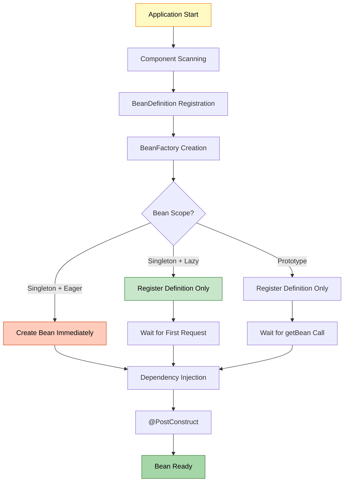
```mermaid
graph TD
    A[Application Start] --> B[Component Scanning]
    B --> C[BeanDefinition Registration]
    C --> D[BeanFactory Creation]
    D --> E{Bean Scope?}
    
    E -->|Singleton + Eager| F[Create Bean Immediately]
    E -->|Singleton + Lazy| G[Register Definition Only]
    E -->|Prototype| H[Register Definition Only]
    
    F --> I[Dependency Injection]
    I --> J["@PostConstruct"]
    J --> K[Bean Ready]
    
    G --> L[Wait for First Request]
    L --> I
    
    H --> M[Wait for getBean Call]
    M --> I
    
    style A fill:#fff9c4,stroke:#f57f17,color:#000
    style F fill:#ffccbc,stroke:#d84315,color:#000
    style G fill:#c8e6c9,stroke:#2e7d32,color:#000
    style K fill:#a5d6a7,stroke:#2e7d32,color:#000
```

### 🔍 Component Scanning Process

**Step 1: @ComponentScan**
```java
@Configuration
@ComponentScan(basePackages = "org.example")
public class AppConfig {
}
```

**What Happens:**
1. Spring scans "org.example" package
2. Finds classes with @Component, @Service, @Repository, @Controller
3. Creates BeanDefinition for each
4. Registers in BeanDefinitionRegistry

**Step 2: BeanDefinition Creation**
```java
// Spring internally creates:
BeanDefinition def = new GenericBeanDefinition();
def.setBeanClassName("org.example.service.LoanService");
def.setScope("singleton");
def.setLazyInit(false);
def.setAutowireMode(AUTOWIRE_BY_TYPE);
```

**Step 3: Bean Instantiation**
```java
// Spring internally does:
Class<?> clazz = Class.forName("org.example.service.LoanService");
Constructor<?> constructor = clazz.getConstructor(LoanValidator.class);
Object bean = constructor.newInstance(loanValidator);
```

### 🔍 Dependency Resolution Algorithm

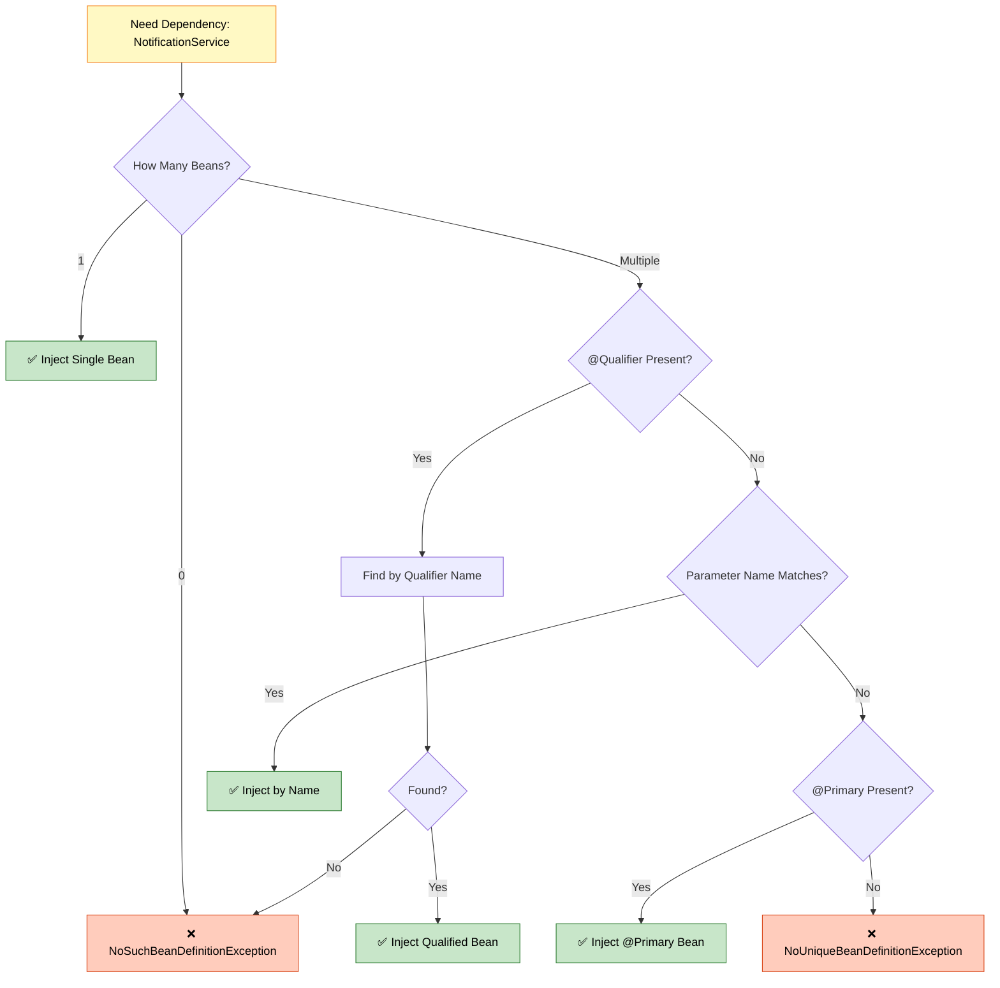
```mermaid
graph TD
    A[Need Dependency: NotificationService] --> B{How Many Beans?}
    B -->|0| C[❌ NoSuchBeanDefinitionException]
    B -->|1| D[✅ Inject Single Bean]
    B -->|Multiple| E{"@Qualifier Present?"}
    
    E -->|Yes| F[Find by Qualifier Name]
    F --> G{Found?}
    G -->|Yes| H[✅ Inject Qualified Bean]
    G -->|No| C
    
    E -->|No| I{Parameter Name Matches?}
    I -->|Yes| J[✅ Inject by Name]
    I -->|No| K{"@Primary Present?"}
    
    K -->|Yes| L[✅ Inject @Primary Bean]
    K -->|No| M[❌ NoUniqueBeanDefinitionException]
    
    style A fill:#fff9c4,stroke:#f57f17,color:#000
    style D fill:#c8e6c9,stroke:#2e7d32,color:#000
    style H fill:#c8e6c9,stroke:#2e7d32,color:#000
    style J fill:#c8e6c9,stroke:#2e7d32,color:#000
    style L fill:#c8e6c9,stroke:#2e7d32,color:#000
    style C fill:#ffccbc,stroke:#d84315,color:#000
    style M fill:#ffccbc,stroke:#d84315,color:#000
```

### 🔍 @Lazy Proxy Creation

**How Spring Creates Lazy Proxies:**

```mermaid
sequenceDiagram
    participant Container as Spring Container
    participant ProxyFactory
    participant CGLIB
    participant Proxy
    participant RealBean as Real Bean
    
    Container->>ProxyFactory: Create lazy proxy for SmsNotification
    ProxyFactory->>CGLIB: Generate proxy class
    CGLIB->>CGLIB: Extend SmsNotification
    CGLIB->>Proxy: Create proxy instance
    Proxy->>Container: Return proxy
    
    Note over RealBean: Real bean NOT created yet
    
    Note over Proxy,RealBean: First Method Call
    Proxy->>Container: Get real bean
    Container->>RealBean: Create NOW
    RealBean->>Container: Return instance
    Container->>Proxy: Cache instance
    Proxy->>RealBean: Delegate method call
```

**Proxy Class Structure:**
```java
// Spring generates something like:
public class SmsNotification$$EnhancerBySpringCGLIB$$12345678 extends SmsNotification {
    private SmsNotification target;
    private BeanFactory beanFactory;
    
    @Override
    public void sendNotification(String message) {
        if (target == null) {
            // First call - create real bean
            target = beanFactory.getBean(SmsNotification.class);
        }
        // Delegate to real bean
        target.sendNotification(message);
    }
}
```

---

## 13. EXECUTION FLOW ANALYSIS

<div align="center">

</div>

### 📊 BankLoanApproval Execution Flow

```mermaid
sequenceDiagram
    participant App
    participant Container
    participant Credit as CreditScoreValidator
    participant Income as IncomeValidator
    participant Loan as LoanService
    participant Audit as AuditService
    
    App->>Container: Start Application
    Container->>Credit: Create (@Primary, Singleton)
    Container->>Income: Create (Prototype)
    Container->>Loan: Create with IncomeValidator
    Note over Audit: NOT created (@Lazy)
    
    App->>Loan: processLoan(50000)
    Loan->>Container: Request AuditService
    Container->>Audit: Create NOW (first use)
    Audit->>Audit: @PostConstruct init()
    Loan->>Audit: logLoanRequest()
    Loan->>Income: validateLoan()
    
    App->>Container: getBean(LoanValidator.class)
    Container->>Credit: Return @Primary bean
    
    App->>Container: Close
    Container->>Audit: @PreDestroy
```

### 📊 FoodDelivery Execution Flow

```mermaid
sequenceDiagram
    participant App
    participant Container
    participant Email as EmailNotification
    participant SMS as SmsNotification
    participant Delivery as DeliveryService
    participant Restaurant as RestaurantService
    participant Order as OrderService
    
    App->>Container: Start Application
    Container->>Email: Create (@Primary, Eager)
    Container->>Delivery: Create (Singleton)
    Delivery->>Delivery: @PostConstruct init()
    Container->>Restaurant: Create
    Restaurant->>Delivery: Setter Injection
    Note over SMS: NOT created (@Lazy)
    
    App->>Container: getBean(NotificationService)
    Container->>Email: Return @Primary
    
    App->>Container: getBean("smsNotification")
    Container->>SMS: Create NOW (@Lazy)
    
    App->>Container: getBean(OrderService)
    Container->>Order: Create with SMS
    App->>Order: placeOrder()
    Order->>Restaurant: processOrder()
    Order->>SMS: sendNotification()
    
    App->>Container: Close
    Container->>Delivery: @PreDestroy
```

### 📊 PaymentProcessing Execution Flow

```mermaid
sequenceDiagram
    participant App
    participant Container
    participant Logger as TransactionLogger
    participant UPI as UpiPayment
    participant CC as CreditCardPayment
    participant Processor as PaymentProcessor
    
    App->>Container: Start Application
    Container->>Logger: Create (Singleton)
    Logger->>Logger: @PostConstruct init()
    Container->>UPI: Create (Prototype - 1st)
    Note over CC: NOT created (@Lazy)
    Container->>Processor: Create
    Processor->>Container: Request CreditCardPayment
    Container->>CC: Create NOW (@Lazy)
    
    App->>Processor: processTransaction(150.75)
    Processor->>UPI: processPayment()
    Processor->>Logger: logTransaction()
    
    App->>Container: getBean(PaymentProcessor)
    Container->>UPI: Create NEW (Prototype - 2nd)
    Container->>Processor: Create new processor
    
    App->>Container: Close
    Container->>Logger: @PreDestroy
```

---

## 14. REAL-WORLD APPLICATIONS

### 🌍 E-Commerce Platform

**Scenario:** Online shopping platform with multiple payment gateways

```java
// Payment Gateway Interface
public interface PaymentGateway {
    boolean processPayment(Order order);
}

// Default gateway
@Primary
@Component
public class StripeGateway implements PaymentGateway {
    // Most common, default choice
}

// Alternative gateways
@Component
public class PayPalGateway implements PaymentGateway { }

@Component
public class RazorpayGateway implements PaymentGateway { }

// Checkout Service
@Component
public class CheckoutService {
    // Uses Stripe by default (@Primary)
    public CheckoutService(PaymentGateway gateway) { }
}

// Admin Service
@Component
public class AdminPaymentService {
    // Can switch to specific gateway
    public AdminPaymentService(
        @Qualifier("payPalGateway") PaymentGateway gateway) { }
}
```

**Why This Design:**
- @Primary for most common gateway (Stripe)
- @Qualifier for specific business requirements
- Easy to add new gateways
- Flexible payment routing

### 🌍 Notification System

**Scenario:** Multi-channel notification system

```java
public interface NotificationChannel {
    void send(String message);
}

@Primary
@Component
public class EmailChannel implements NotificationChannel {
    // Default, most reliable
}

@Component
@Lazy
public class SmsChannel implements NotificationChannel {
    // Expensive SMS gateway
}

@Component
@Lazy
public class PushChannel implements NotificationChannel {
    // Mobile push notifications
}

@Component
public class NotificationService {
    private final NotificationChannel primary;
    private final NotificationChannel sms;
    
    public NotificationService(
        NotificationChannel primary,  // Email
        @Qualifier("smsChannel") NotificationChannel sms) {
        this.primary = primary;
        this.sms = sms;
    }
    
    public void sendUrgent(String message) {
        sms.send(message);  // SMS for urgent
    }
    
    public void sendNormal(String message) {
        primary.send(message);  // Email for normal
    }
}
```

**Why This Design:**
- @Primary for default channel (Email)
- @Lazy for expensive channels (SMS, Push)
- Multiple channels in same service
- Business logic determines channel

### 🌍 Database Connection Pool

**Scenario:** Multi-database application

```java
public interface DataSource {
    Connection getConnection();
}

@Primary
@Component
public class PrimaryDataSource implements DataSource {
    @PostConstruct
    public void init() {
        // Initialize primary database pool
    }
    
    @PreDestroy
    public void cleanup() {
        // Close all connections
    }
}

@Component
@Lazy
public class AnalyticsDataSource implements DataSource {
    // Expensive analytics database
    // Created only when analytics needed
}

@Component
public class UserRepository {
    // Uses primary database
    public UserRepository(DataSource dataSource) { }
}

@Component
public class AnalyticsService {
    // Uses analytics database
    public AnalyticsService(
        @Qualifier("analyticsDataSource") DataSource dataSource) { }
}
```

**Why This Design:**
- @Primary for main database
- @Lazy for analytics (expensive, rarely used)
- @PostConstruct/@PreDestroy for connection management
- Separate data sources for different purposes

---

## 15. BEST PRACTICES


### ✅ Dependency Injection

1. **Prefer Constructor Injection**
   ```java
   // ✅ GOOD
   @Component
   public class OrderService {
       private final PaymentService paymentService;
       
       public OrderService(PaymentService paymentService) {
           this.paymentService = paymentService;
       }
   }
   
   // ❌ BAD
   @Component
   public class OrderService {
       @Autowired
       private PaymentService paymentService;
   }
   ```

2. **Use final for Required Dependencies**
   ```java
   // ✅ GOOD - Immutable, null-safe
   private final PaymentService paymentService;
   
   // ❌ BAD - Mutable, can be null
   private PaymentService paymentService;
   ```

3. **Setter Injection for Optional Dependencies**
   ```java
   // ✅ GOOD - Optional audit service
   @Autowired(required = false)
   public void setAuditService(AuditService auditService) {
       this.auditService = auditService;
   }
   ```

### ✅ @Primary and @Qualifier

1. **Use @Primary for Default Implementation**
   ```java
   // ✅ GOOD - Clear default
   @Primary
   @Component
   public class EmailNotification implements NotificationService { }
   ```

2. **Use @Qualifier for Specific Requirements**
   ```java
   // ✅ GOOD - Explicit selection
   public OrderService(@Qualifier("smsNotification") NotificationService service) { }
   ```

3. **Only ONE @Primary per Type**
   ```java
   // ❌ BAD - Multiple @Primary
   @Primary @Component
   public class EmailNotification implements NotificationService { }
   
   @Primary @Component  // ERROR!
   public class SmsNotification implements NotificationService { }
   ```

### ✅ @Lazy Initialization

1. **Use @Lazy for Expensive Beans**
   ```java
   // ✅ GOOD - Expensive initialization
   @Component
   @Lazy
   public class ReportGenerator {
       @PostConstruct
       public void init() {
           // Load heavy templates
           // Connect to reporting service
       }
   }
   ```

2. **Combine @Primary with @Lazy**
   ```java
   // ✅ GOOD - Default but lazy
   @Primary
   @Component
   @Lazy
   public class CreditCardPayment implements PaymentService { }
   ```

3. **Don't Overuse @Lazy**
   ```java
   // ❌ BAD - Always-used service shouldn't be lazy
   @Component
   @Lazy
   public class UserService { }  // Used in every request!
   ```

### ✅ Bean Scopes

1. **Use Singleton for Stateless Services**
   ```java
   // ✅ GOOD - Stateless, thread-safe
   @Component  // Singleton by default
   public class EmailService {
       public void send(String message) { }
   }
   ```

2. **Use Prototype for Stateful Objects**
   ```java
   // ✅ GOOD - Stateful, per-request
   @Component
   @Scope("prototype")
   public class ShoppingCart {
       private List<Item> items = new ArrayList<>();
   }
   ```

3. **Be Careful with Singleton-Prototype Interaction**
   ```java
   // ❌ BAD - Singleton holds Prototype
   @Component
   public class OrderService {
       @Autowired
       private ShoppingCart cart;  // ALWAYS SAME INSTANCE!
   }
   
   // ✅ GOOD - Get new instance each time
   @Component
   public class OrderService {
       @Autowired
       private ApplicationContext context;
       
       public void processOrder() {
           ShoppingCart cart = context.getBean(ShoppingCart.class);
       }
   }
   ```

### ✅ Lifecycle Management

1. **Use @PostConstruct for Initialization**
   ```java
   // ✅ GOOD - Dependencies available
   @PostConstruct
   public void init() {
       connection.connect();
   }
   
   // ❌ BAD - Dependencies might be null
   public MyService() {
       connection.connect();  // NullPointerException!
   }
   ```

2. **Use @PreDestroy for Cleanup**
   ```java
   // ✅ GOOD - Proper cleanup
   @PreDestroy
   public void cleanup() {
       if (connection != null) {
           connection.close();
       }
   }
   ```

3. **Remember: @PreDestroy NOT Called for Prototype**
   ```java
   @Component
   @Scope("prototype")
   public class PrototypeBean {
       @PreDestroy
       public void cleanup() {
           // ⚠️ WARNING: This is NEVER called!
       }
   }
   ```

---

## 16. COMMON PITFALLS

<div align="center">

</div>

### ❌ Pitfall 1: Using Dependencies in Constructor

**Problem:**
```java
@Component
public class UserService {
    @Autowired
    private UserRepository repository;
    
    public UserService() {
        // ❌ repository is NULL here!
        repository.findAll();  // NullPointerException!
    }
}
```

**Solution:**
```java
@Component
public class UserService {
    @Autowired
    private UserRepository repository;
    
    @PostConstruct
    public void init() {
        // ✅ repository is injected
        repository.findAll();
    }
}
```

### ❌ Pitfall 2: Multiple @Primary

**Problem:**
```java
@Primary
@Component
public class EmailNotification implements NotificationService { }

@Primary  // ❌ ERROR: Only ONE @Primary allowed
@Component
public class SmsNotification implements NotificationService { }
```

**Error:**
```
NoUniqueBeanDefinitionException: more than one 'primary' bean found
```

**Solution:**
```java
@Primary
@Component
public class EmailNotification implements NotificationService { }

@Component  // ✅ No @Primary
public class SmsNotification implements NotificationService { }
```

### ❌ Pitfall 3: Forgetting @Qualifier Bean Name

**Problem:**
```java
@Component
public class SmsNotification implements NotificationService { }

// ❌ Wrong bean name
public OrderService(@Qualifier("smsService") NotificationService service) { }
```

**Error:**
```
NoSuchBeanDefinitionException: No bean named 'smsService' available
```

**Solution:**
```java
// ✅ Correct bean name (class name with lowercase first letter)
public OrderService(@Qualifier("smsNotification") NotificationService service) { }
```

### ❌ Pitfall 4: Singleton with Prototype Dependency

**Problem:**
```java
@Component
@Scope("prototype")
public class ShoppingCart { }

@Component  // Singleton
public class OrderService {
    @Autowired
    private ShoppingCart cart;  // ❌ ALWAYS SAME INSTANCE!
    
    public void addItem(Item item) {
        cart.add(item);  // All users share same cart!
    }
}
```

**Solution:**
```java
@Component
public class OrderService {
    @Autowired
    private ApplicationContext context;
    
    public void addItem(Item item) {
        ShoppingCart cart = context.getBean(ShoppingCart.class);
        cart.add(item);  // ✅ New cart each time
    }
}
```

### ❌ Pitfall 5: Expecting @PreDestroy for Prototype

**Problem:**
```java
@Component
@Scope("prototype")
public class FileProcessor {
    private FileWriter writer;
    
    @PostConstruct
    public void init() throws IOException {
        writer = new FileWriter("output.txt");
    }
    
    @PreDestroy
    public void cleanup() throws IOException {
        writer.close();  // ❌ NEVER CALLED!
    }
}
```

**Solution:**
```java
@Component
@Scope("prototype")
public class FileProcessor implements DisposableBean {
    private FileWriter writer;
    
    @PostConstruct
    public void init() throws IOException {
        writer = new FileWriter("output.txt");
    }
    
    // ✅ Manual cleanup
    public void close() throws IOException {
        if (writer != null) {
            writer.close();
        }
    }
}

// Usage
FileProcessor processor = context.getBean(FileProcessor.class);
try {
    processor.process();
} finally {
    processor.close();  // Manual cleanup
}
```

### ❌ Pitfall 6: Circular Dependencies

**Problem:**
```java
@Component
public class A {
    @Autowired
    private B b;  // A needs B
}

@Component
public class B {
    @Autowired
    private A a;  // B needs A → Circular!
}
```

**Error:**
```
BeanCurrentlyInCreationException: Circular dependency
```

**Solution 1: Use @Lazy**
```java
@Component
public class A {
    private final B b;
    
    public A(@Lazy B b) {  // ✅ Proxy injected
        this.b = b;
    }
}

@Component
public class B {
    private final A a;
    
    public B(A a) {
        this.a = a;
    }
}
```

**Solution 2: Redesign (Better)**
```java
// Extract common functionality to separate service
@Component
public class CommonService { }

@Component
public class A {
    @Autowired
    private CommonService common;
}

@Component
public class B {
    @Autowired
    private CommonService common;
}
```

---

## 17. TOP INTERVIEW QUESTIONS

<div align="center">

</div>

### 🎯 Dependency Injection Questions

**Q1: What happens if you have multiple beans of the same type and no @Primary or @Qualifier?**

**Answer:**
Spring throws `NoUniqueBeanDefinitionException` because it cannot determine which bean to inject.

```java
@Component
public class EmailNotification implements NotificationService { }

@Component
public class SmsNotification implements NotificationService { }

@Component
public class MyService {
    // ❌ ERROR: NoUniqueBeanDefinitionException
    public MyService(NotificationService service) { }
}
```

**Resolution Priority:**
1. @Qualifier (highest)
2. Parameter name matching
3. @Primary
4. Single bean (lowest)

**Q2: Can you have multiple @Primary annotations for the same type?**

**Answer:**
No! Only ONE @Primary is allowed per bean type. If you mark multiple beans with @Primary, Spring throws an exception at startup.

```java
@Primary @Component
public class EmailNotification implements NotificationService { }

@Primary @Component  // ❌ ERROR!
public class SmsNotification implements NotificationService { }

// Error: more than one 'primary' bean found
```

**Q3: What's the difference between @Qualifier and parameter name matching?**

**Answer:**

**@Qualifier (Explicit):**
```java
public MyService(@Qualifier("smsNotification") NotificationService service) { }
// Explicitly selects "smsNotification" bean
```

**Parameter Name Matching (Implicit):**
```java
public MyService(NotificationService smsNotification) { }
// Parameter name "smsNotification" matches bean name
```

**Priority:** @Qualifier > Parameter Name > @Primary

**Q4: Why is constructor injection preferred over field injection?**

**Answer:**

**Constructor Injection Advantages:**
- ✅ Immutability (final fields)
- ✅ Required dependencies enforced
- ✅ Easy to test (no reflection)
- ✅ Null-safe
- ✅ Clear dependencies

**Field Injection Disadvantages:**
- ❌ Cannot use final
- ❌ Hard to test (requires reflection)
- ❌ Hidden dependencies
- ❌ Breaks encapsulation

```java
// ✅ Constructor Injection
@Component
public class OrderService {
    private final PaymentService paymentService;
    
    public OrderService(PaymentService paymentService) {
        this.paymentService = paymentService;
    }
}

// ❌ Field Injection
@Component
public class OrderService {
    @Autowired
    private PaymentService paymentService;
}
```

### 🎯 @Lazy Questions

**Q5: What happens when you inject a @Lazy bean into another bean?**

**Answer:**
Spring creates a PROXY and injects it instead of the real bean. The real bean is created only when a method is called on the proxy.

```java
@Component
@Lazy
public class SmsService {
    public SmsService() {
        System.out.println("SmsService created");
    }
}

@Component
public class OrderService {
    private final SmsService smsService;
    
    public OrderService(SmsService smsService) {
        System.out.println("OrderService created");
        // smsService is a PROXY here
        System.out.println(smsService.getClass().getName());
        // Output: SmsService$$EnhancerBySpringCGLIB$$12345678
    }
    
    public void sendSms() {
        smsService.send();  // NOW real SmsService is created
    }
}
```

**Output:**
```
OrderService created
SmsService$$EnhancerBySpringCGLIB$$12345678
(when sendSms() is called)
SmsService created
```

**Q6: Can you combine @Primary with @Lazy?**

**Answer:**
Yes! This is a powerful combination for default but expensive beans.

```java
@Primary
@Component
@Lazy
public class CreditCardPayment implements PaymentService {
    // Default payment method
    // But expensive initialization
    // Created only when used
}
```

**Use Case:**
- Credit card is the default payment method (@Primary)
- But payment gateway initialization is expensive
- So delay creation until actually needed (@Lazy)

**Q7: What's the performance impact of @Lazy?**

**Answer:**

**Startup Time:**
- Without @Lazy: Slower startup (all beans created)
- With @Lazy: Faster startup (beans created on demand)

**First Request:**
- Without @Lazy: Fast (bean already created)
- With @Lazy: Slower (bean created now)

**Subsequent Requests:**
- Both: Same performance (bean cached)

**Example:**
```
Without @Lazy:
- Startup: 30 seconds
- First request: 10ms
- Subsequent: 10ms

With @Lazy:
- Startup: 5 seconds
- First request: 25ms (creates bean)
- Subsequent: 10ms
```

### 🎯 Bean Scope Questions

**Q8: What's the difference between Singleton and Prototype scope?**

**Answer:**

| Aspect | Singleton | Prototype |
|:-------|:----------|:----------|
| **Instances** | 1 per container | New per request |
| **Creation** | At startup or first use | Every getBean() call |
| **Caching** | ✅ Cached | ❌ Not cached |
| **@PreDestroy** | ✅ Called | ❌ NOT called |
| **Thread Safety** | Must be thread-safe | Each thread gets own |
| **Use Case** | Stateless services | Stateful objects |

```java
// Singleton
@Component
public class EmailService {
    // One instance for entire application
}

// Prototype
@Component
@Scope("prototype")
public class ShoppingCart {
    // New instance per request
}
```

**Q9: Why is @PreDestroy not called for Prototype beans?**

**Answer:**
Spring doesn't manage the complete lifecycle of Prototype beans. After creating and returning a Prototype bean, Spring "forgets" about it. The application is responsible for cleanup.

```java
@Component
@Scope("prototype")
public class FileProcessor {
    @PreDestroy
    public void cleanup() {
        // ⚠️ NEVER CALLED!
    }
}
```

**Reason:**
- Prototype beans can have multiple instances
- Spring doesn't track all instances
- Application controls when instances are destroyed
- @PreDestroy would be ambiguous (when to call?)

**Solution:** Manual cleanup
```java
FileProcessor processor = context.getBean(FileProcessor.class);
try {
    processor.process();
} finally {
    processor.close();  // Manual cleanup
}
```

**Q10: What happens when a Singleton bean has a Prototype dependency?**

**Answer:**
The Singleton bean gets ONE instance of the Prototype bean and keeps reusing it, defeating the purpose of Prototype scope!

```java
@Component
@Scope("prototype")
public class ShoppingCart { }

@Component  // Singleton
public class OrderService {
    @Autowired
    private ShoppingCart cart;  // ❌ ALWAYS SAME INSTANCE!
}
```

**Problem:**
- OrderService is created once (Singleton)
- ShoppingCart is injected once
- All users share the same cart!

**Solution 1: ApplicationContext**
```java
@Component
public class OrderService {
    @Autowired
    private ApplicationContext context;
    
    public void processOrder() {
        ShoppingCart cart = context.getBean(ShoppingCart.class);
        // ✅ New cart each time
    }
}
```

**Solution 2: @Lookup**
```java
@Component
public abstract class OrderService {
    public void processOrder() {
        ShoppingCart cart = getCart();
        // ✅ New cart each time
    }
    
    @Lookup
    protected abstract ShoppingCart getCart();
}
```

### 🎯 Lifecycle Questions

**Q11: Why can't you use dependencies in the constructor?**

**Answer:**
Dependencies are injected AFTER the constructor is called. In the constructor, all @Autowired fields are still null.

```java
@Component
public class UserService {
    @Autowired
    private UserRepository repository;
    
    public UserService() {
        System.out.println("Constructor: " + repository);
        // Output: Constructor: null
        
        // ❌ NullPointerException!
        repository.findAll();
    }
    
    @PostConstruct
    public void init() {
        System.out.println("PostConstruct: " + repository);
        // Output: PostConstruct: UserRepository@123
        
        // ✅ Safe to use
        repository.findAll();
    }
}
```

**Lifecycle Order:**
1. Constructor called (dependencies are null)
2. Dependencies injected
3. @PostConstruct called (dependencies available)

**Q12: What's the execution order of lifecycle methods?**

**Answer:**

```java
@Component
public class CompleteLifecycleBean implements InitializingBean, DisposableBean {
    
    // 1. Constructor
    public CompleteLifecycleBean() {
        System.out.println("1. Constructor");
    }
    
    // 2. @PostConstruct
    @PostConstruct
    public void postConstruct() {
        System.out.println("2. @PostConstruct");
    }
    
    // 3. InitializingBean.afterPropertiesSet()
    @Override
    public void afterPropertiesSet() {
        System.out.println("3. afterPropertiesSet");
    }
    
    // 4. Custom init-method (if configured)
    public void customInit() {
        System.out.println("4. customInit");
    }
    
    // 5. @PreDestroy
    @PreDestroy
    public void preDestroy() {
        System.out.println("5. @PreDestroy");
    }
    
    // 6. DisposableBean.destroy()
    @Override
    public void destroy() {
        System.out.println("6. destroy");
    }
    
    // 7. Custom destroy-method (if configured)
    public void customDestroy() {
        System.out.println("7. customDestroy");
    }
}
```

**Output:**
```
1. Constructor
2. @PostConstruct
3. afterPropertiesSet
4. customInit
5. @PreDestroy
6. destroy
7. customDestroy
```

**Recommendation:** Use @PostConstruct and @PreDestroy (simplest and standard)

### 🎯 Advanced Questions

**Q13: How does Spring resolve circular dependencies?**

**Answer:**
Spring uses a three-level cache mechanism and proxy creation to resolve circular dependencies.

**Problem:**
```java
@Component
public class A {
    @Autowired
    private B b;  // A needs B
}

@Component
public class B {
    @Autowired
    private A a;  // B needs A
}
```

**Spring's Solution:**
1. Create A (partially initialized)
2. Put A in "early reference" cache
3. Start injecting dependencies into A
4. Need B, so create B
5. B needs A, get A from early reference cache
6. Inject A into B (B is complete)
7. Inject B into A (A is complete)

**With Constructor Injection (Fails):**
```java
@Component
public class A {
    public A(B b) { }  // ❌ Cannot resolve
}

@Component
public class B {
    public B(A a) { }  // ❌ Cannot resolve
}
```

**Why it fails:** Spring cannot create A without B, and cannot create B without A.

**Solution: Use @Lazy**
```java
@Component
public class A {
    public A(@Lazy B b) { }  // ✅ Proxy injected
}

@Component
public class B {
    public B(A a) { }
}
```

**Q14: What's the difference between @Component and @Bean?**

**Answer:**

**@Component:**
- Class-level annotation
- Auto-detected by component scanning
- Spring creates bean automatically
- Used for your own classes

```java
@Component
public class EmailService {
    // Spring creates this automatically
}
```

**@Bean:**
- Method-level annotation
- Used in @Configuration classes
- Manual bean creation
- Used for third-party classes

```java
@Configuration
public class AppConfig {
    @Bean
    public DataSource dataSource() {
        // Manual creation for third-party class
        return new HikariDataSource();
    }
}
```

| Aspect | @Component | @Bean |
|:-------|:-----------|:------|
| **Level** | Class | Method |
| **Detection** | Auto (component scan) | Manual (@Configuration) |
| **Use Case** | Your classes | Third-party classes |
| **Control** | Less control | Full control |
| **Customization** | Limited | Flexible |

**Q15: Can you inject a List or Map of beans?**

**Answer:**
Yes! Spring can inject all beans of a type into a List or Map.

**List Injection:**
```java
public interface NotificationService {
    void send(String message);
}

@Component
public class EmailNotification implements NotificationService { }

@Component
public class SmsNotification implements NotificationService { }

@Component
public class PushNotification implements NotificationService { }

@Component
public class NotificationManager {
    private final List<NotificationService> allNotifications;
    
    // Injects ALL NotificationService beans
    public NotificationManager(List<NotificationService> allNotifications) {
        this.allNotifications = allNotifications;
        // List contains: [Email, SMS, Push]
    }
    
    public void sendToAll(String message) {
        allNotifications.forEach(n -> n.send(message));
    }
}
```

**Map Injection:**
```java
@Component
public class NotificationManager {
    private final Map<String, NotificationService> notificationMap;
    
    // Key = bean name, Value = bean instance
    public NotificationManager(Map<String, NotificationService> notificationMap) {
        this.notificationMap = notificationMap;
        // Map: {
        //   "emailNotification" -> EmailNotification,
        //   "smsNotification" -> SmsNotification,
        //   "pushNotification" -> PushNotification
        // }
    }
    
    public void send(String channel, String message) {
        NotificationService service = notificationMap.get(channel + "Notification");
        service.send(message);
    }
}
```

**Use Cases:**
- Strategy pattern (select from multiple implementations)
- Plugin architecture
- Dynamic service selection
- Broadcast to all implementations

**Q16: What happens if @PostConstruct throws an exception?**

**Answer:**
The bean creation fails, and Spring throws a `BeanCreationException`. The bean is NOT added to the container.

```java
@Component
public class DatabaseService {
    @PostConstruct
    public void init() {
        throw new RuntimeException("Database connection failed");
    }
}
```

**Result:**
- Application startup fails
- Bean is not created
- Other beans depending on this bean also fail
- Fail-fast behavior (good for catching errors early)

**Best Practice:**
```java
@Component
public class DatabaseService {
    @PostConstruct
    public void init() {
        try {
            connectToDatabase();
        } catch (Exception e) {
            // Log error
            logger.error("Failed to connect to database", e);
            // Rethrow to fail fast
            throw new BeanCreationException("Database initialization failed", e);
        }
    }
}
```

---

## 🎓 CONCLUSION


### 📚 What You've Learned

Through these three real-world case studies, you've mastered:

✅ **Dependency Injection Patterns**
- Constructor injection for required dependencies
- Setter injection for optional dependencies
- Field injection (and why to avoid it)

✅ **Dependency Resolution**
- @Primary for default implementations
- @Qualifier for explicit selection
- Resolution priority and ambiguity handling

✅ **Performance Optimization**
- @Lazy for expensive beans
- Lazy proxy mechanism
- Startup time vs first-request tradeoff

✅ **Bean Scopes**
- Singleton for stateless services
- Prototype for stateful objects
- Scope interaction gotchas

✅ **Lifecycle Management**
- @PostConstruct for initialization
- @PreDestroy for cleanup
- Resource management best practices

✅ **Real-World Applications**
- Bank loan approval system
- Food delivery platform
- Payment processing gateway

### 🚀 Next Steps

1. **Practice:** Build your own case studies
2. **Experiment:** Try different combinations of annotations
3. **Debug:** Use Spring's logging to understand bean creation
4. **Optimize:** Profile your application and apply @Lazy strategically
5. **Test:** Write unit tests for your Spring beans

### 📧 Contact

Questions or feedback? Reach out!

<div align="center">
<br/>
<table>
<tr>
<td align="center">

<br />


**Avinash Dhanuka**

[](https://github.com/Avinash-706)
[](mailto:avunashdhanuka@gmail.com)

**© 2026 Avinash Dhanuka | Crafted with ❤️ for Spring Mastery**

</td>
</tr>
</table>
</div>

---

<div align="center">

**Happy Coding! ☕**

*Master Spring, Build Better Applications*

</div>
