# ☕ Spring Framework: @Lazy Annotation - Complete Deep Dive

<div align="center">


</div>

<hr style="border: 1px solid rgb(98, 117, 187)">

<div align="center">
<table>
<tr>
<td align="center">
<br />

<h3>© 2026 Avinash Dhanuka</h3>
<p>Master Guide: Spring @Lazy Annotation</p>
<p><em>Crafted with ❤️ for Performance Optimization</em></p>

<a href="https://github.com/Avinash-706" target="_blank">

</a>
<br />
<a href="https://mail.google.com/mail/?view=cm&fs=1&to=avunashdhanuka@gmail.com&su=Spring%20Lazy%20Query&body=☕%20Hello%20Avinash,%0D%0A%0D%0AMy%20name%20is%20[Your%20Name]%20and%20I%20have%20a%20doubt%20regarding%20@Lazy%20annotation.%0D%0A%0D%0A🔹%20Topic:%20[Lazy/Performance/Bean%20Initialization]%0D%0A%0D%0AThank%20you!" target="_blank">

</a>
<br />
<br />
</td>
</tr>
</table>
</div>

> **Learning Note:** This guide demonstrates Spring's @Lazy annotation - a powerful performance optimization technique that delays bean initialization until first use. Master lazy loading to build faster, more efficient Spring applications.

> **Prerequisites:** 
> - Understanding of Spring IoC Container
> - Knowledge of @Component and @Autowired
> - Basic Spring configuration concepts
> - Bean lifecycle awareness

---

## 📑 Table of Contents
1. [What is @Lazy Annotation?](#1-what-is-lazy-annotation)
2. [The Problem: Eager Initialization](#2-the-problem-eager-initialization)
3. [How @Lazy Works](#3-how-lazy-works)
4. [Eager vs Lazy Initialization](#4-eager-vs-lazy-initialization)
5. [@Lazy at Different Levels](#5-lazy-at-different-levels)
6. [Proxy Mechanism](#6-proxy-mechanism)
7. [Internal Working Deep Dive](#7-internal-working-deep-dive)
8. [Lazy with Dependency Injection](#8-lazy-with-dependency-injection)
9. [Lazy with @Primary and @Qualifier](#9-lazy-with-primary-and-qualifier)
10. [Performance Impact](#10-performance-impact)
11. [Thread Safety Considerations](#11-thread-safety-considerations)
12. [Project Implementation](#12-project-implementation)
13. [Real-World Examples](#13-real-world-examples)
14. [Best Practices](#14-best-practices)
15. [Common Pitfalls](#15-common-pitfalls)
16. [Interview Questions](#16-top-interview-questions)

---

## 1. WHAT IS @LAZY ANNOTATION?

<div align="center">

</div>

> **📝 Author:** Avinash Dhanuka | [GitHub](https://github.com/Avinash-706)

### 📌 Definition

**@Lazy** is a Spring annotation that indicates whether a bean should be lazily initialized. When applied, the bean is NOT created when the ApplicationContext starts, but only when it's first requested.

**Simple Analogy:**
- **Eager (Default):** Like preparing all dishes before guests arrive
- **Lazy:** Like cooking dishes only when guests order them
- **Result:** Faster startup, on-demand resource allocation

### 🎯 Core Concept


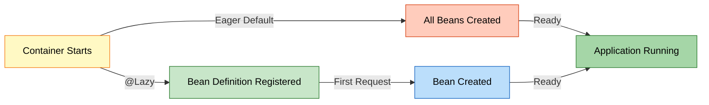

### 📊 Basic Example

**Reference:** [LazyBean.java](src/main/java/org/example/lazy/LazyBean.java)

**Without @Lazy (Eager - Default):**
```java
@Component
public class EagerBean {
    public EagerBean() {
        System.out.println("Eager Bean Created !!");
    }
}
```

**With @Lazy:**
```java
@Component
@Lazy
public class LazyBean {
    public LazyBean() {
        System.out.println("Lazy Bean Created !!");
    }
}
```

**Execution:**
```java
ApplicationContext context = new AnnotationConfigApplicationContext(LazyConfig.class);
// Output: "Eager Bean Created !!"
// NO output for LazyBean - not created yet!

LazyBean bean = context.getBean(LazyBean.class);
// NOW output: "Lazy Bean Created !!"
```

---

## 2. THE PROBLEM: EAGER INITIALIZATION

<div align="center">

</div>

### 📌 Default Spring Behavior

By default, Spring creates ALL singleton beans at container startup (eager initialization).

### 🎯 Problems with Eager Initialization


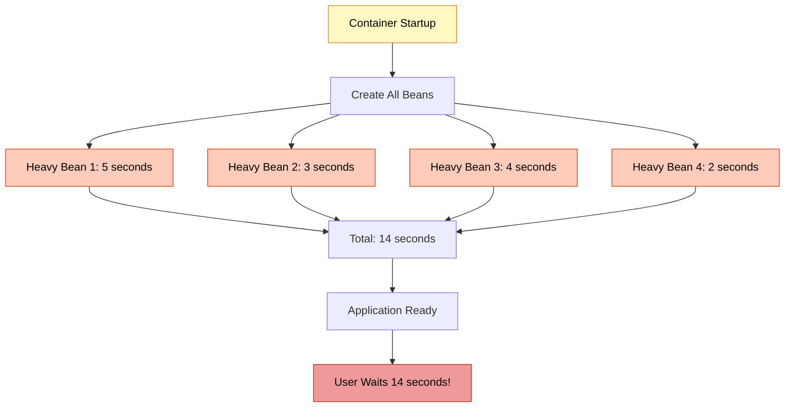

### ⚠️ Issues

| Issue | Description | Impact |
|:------|:-----------|:-------|
| **Slow Startup** | All beans created at once | Long wait time |
| **Memory Waste** | Unused beans consume memory | Higher memory footprint |
| **Resource Lock** | Database connections opened early | Resource exhaustion |
| **Unnecessary Work** | Rarely used beans initialized | Wasted CPU cycles |

### 📊 Real-World Scenario

**Example: E-Commerce Application**

```java
@Component
public class EmailService {
    public EmailService() {
        // Connect to SMTP server (2 seconds)
        // Load email templates (1 second)
        System.out.println("EmailService initialized - 3 seconds");
    }
}

@Component
public class ReportGenerator {
    public ReportGenerator() {
        // Load report templates (5 seconds)
        // Initialize PDF library (3 seconds)
        System.out.println("ReportGenerator initialized - 8 seconds");
    }
}

@Component
public class DataExporter {
    public DataExporter() {
        // Initialize Excel library (4 seconds)
        System.out.println("DataExporter initialized - 4 seconds");
    }
}
```

**Problem:**
- Application takes **15 seconds** to start
- User only needs product browsing (doesn't need reports/export immediately)
- Resources wasted on unused features

---

## 3. HOW @LAZY WORKS

<div align="center">

</div>

### 📌 Lazy Initialization Process


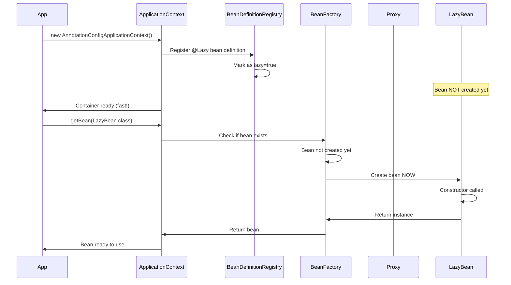

### 🔍 Step-by-Step Execution

**Reference:** [LazyDemo.java](src/main/java/org/example/lazy/LazyDemo.java)

**Step 1: Container Creation**
```java
System.out.println("== Container Created ==");
ApplicationContext context = new AnnotationConfigApplicationContext(LazyConfig.class);
```

**What Happens:**
1. Spring scans for @Component classes
2. Finds `EagerBean` (no @Lazy) → Creates immediately
3. Finds `LazyBean` (@Lazy) → Registers definition only
4. Container ready

**Output:**
```
== Container Created ==
Eager Bean Created !!
```

**Step 2: First Bean Request**
```java
LazyBean lazyBean = context.getBean(LazyBean.class);
```

**What Happens:**
1. Spring checks if bean exists
2. Bean not created yet
3. Creates bean NOW
4. Returns instance

**Output:**
```
Lazy Bean Created !!
```

### 📊 Timing Comparison

| Scenario | Eager | Lazy |
|:---------|:------|:-----|
| **Container Startup** | 10 seconds | 1 second |
| **First Bean Access** | Instant | 9 seconds |
| **Total Time** | 10 seconds | 10 seconds |
| **User Experience** | Wait at startup | Fast startup, wait on use |

---

## 4. EAGER VS LAZY INITIALIZATION

<div align="center">

</div>

### 📊 Detailed Comparison


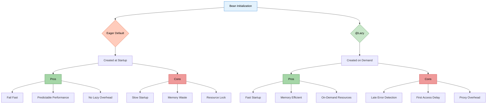

### 📋 Feature Comparison Table

| Feature | Eager (Default) | Lazy (@Lazy) |
|:--------|:---------------|:-------------|
| **Creation Time** | Container startup | First access |
| **Startup Speed** | ❌ Slower | ✅ Faster |
| **Memory Usage** | ❌ Higher (all beans) | ✅ Lower (only used) |
| **Error Detection** | ✅ Immediate | ❌ Delayed |
| **First Access** | ✅ Fast | ❌ Slower |
| **Predictability** | ✅ High | ⚠️ Medium |
| **Resource Management** | ❌ Early allocation | ✅ On-demand |
| **Proxy Overhead** | ❌ None | ⚠️ Yes (for injection) |
| **Thread Safety** | ✅ Safe | ⚠️ First access race |
| **Use Case** | Always-used beans | Rarely-used beans |

### 🎯 When to Use Each

**Use Eager (Default) When:**
- ✅ Bean is used in **every request**
- ✅ Want **fail-fast** behavior
- ✅ Initialization is **quick**
- ✅ Need **predictable performance**

**Use Lazy When:**
- ✅ Bean is **rarely used**
- ✅ Initialization is **expensive**
- ✅ Want **fast startup**
- ✅ **Optional features** that may not be used

### 📊 Performance Metrics

**Scenario: 100 Beans Application**

| Metric | Eager | Lazy (50% used) |
|:-------|:------|:---------------|
| **Startup Time** | 30 seconds | 5 seconds |
| **Memory at Startup** | 500 MB | 250 MB |
| **First Request** | 10 ms | 15 ms (proxy) |
| **Subsequent Requests** | 10 ms | 10 ms |
| **Total Memory (after use)** | 500 MB | 400 MB |

---

## 5. @LAZY AT DIFFERENT LEVELS

<div align="center">

</div>

### 📌 Where Can @Lazy Be Applied?


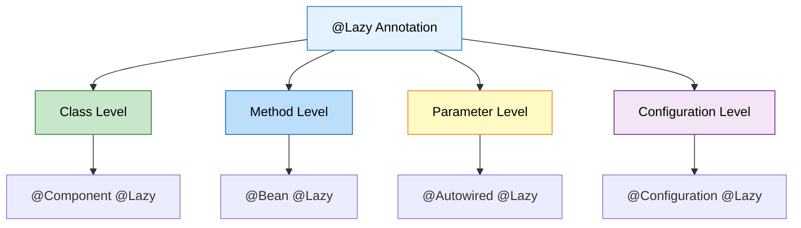

### 1️⃣ Class Level @Lazy

**Reference:** [LazyBean.java:7](src/main/java/org/example/lazy/LazyBean.java#L7)

```java
@Component
@Lazy
public class LazyBean {
    public LazyBean() {
        System.out.println("Lazy Bean Created !!");
    }
}
```

**Behavior:**
- Bean is NOT created at container startup
- Created when first requested via `getBean()` or injection
- Applies to the entire bean

---

### 2️⃣ Method Level @Lazy (@Bean)

```java
@Configuration
public class AppConfig {
    
    @Bean
    @Lazy
    public DataSource dataSource() {
        System.out.println("DataSource created");
        return new HikariDataSource();
    }
}
```

**Behavior:**
- Bean method not invoked at startup
- Invoked when bean is first requested
- Useful for expensive third-party beans

---

### 3️⃣ Parameter Level @Lazy (Injection)

```java
@Component
public class UserService {
    private final ReportGenerator reportGenerator;
    
    @Autowired
    public UserService(@Lazy ReportGenerator reportGenerator) {
        this.reportGenerator = reportGenerator;  // Proxy injected
        System.out.println("UserService created");
    }
    
    public void generateReport() {
        reportGenerator.generate();  // NOW ReportGenerator is created
    }
}
```

**Behavior:**
- UserService created immediately
- ReportGenerator NOT created
- Proxy injected instead
- Real bean created when method called

**Key Point:** This is the most powerful use case!

---

### 4️⃣ Configuration Level @Lazy

```java
@Configuration
@Lazy
public class DatabaseConfig {
    
    @Bean
    public DataSource primaryDataSource() {
        return new HikariDataSource();
    }
    
    @Bean
    public DataSource secondaryDataSource() {
        return new HikariDataSource();
    }
}
```

**Behavior:**
- ALL beans in this configuration are lazy
- Applies @Lazy to every @Bean method
- Convenient for optional modules

---

### 📊 Level Comparison

| Level | Scope | Use Case | Example |
|:------|:------|:---------|:--------|
| **Class** | Single bean | Rarely used service | `@Component @Lazy` |
| **Method** | Single @Bean | Third-party bean | `@Bean @Lazy` |
| **Parameter** | Dependency injection | Break circular deps | `@Autowired @Lazy` |
| **Configuration** | All beans in config | Optional module | `@Configuration @Lazy` |

---

## 6. PROXY MECHANISM

<div align="center">

</div>

### 📌 How Spring Creates Lazy Proxies


When @Lazy is used with dependency injection, Spring creates a **proxy** instead of the real bean.

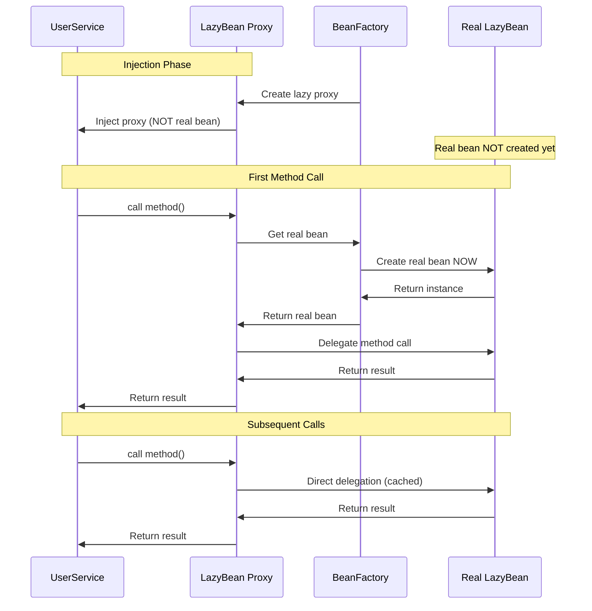

### 🔍 Proxy Types

Spring uses two types of proxies:

**1. JDK Dynamic Proxy (Interface-based)**
```java
public interface NotificationService {
    void send(String message);
}

@Component
@Lazy
public class EmailService implements NotificationService {
    public void send(String message) {
        System.out.println("Email: " + message);
    }
}

// Spring creates JDK proxy implementing NotificationService
```

**2. CGLIB Proxy (Class-based)**
```java
@Component
@Lazy
public class ReportGenerator {  // No interface
    public void generate() {
        System.out.println("Generating report...");
    }
}

// Spring creates CGLIB subclass proxy
```

### 📊 Proxy Behavior

```java
@Component
public class UserService {
    private final ReportGenerator reportGenerator;
    
    @Autowired
    public UserService(@Lazy ReportGenerator reportGenerator) {
        System.out.println("Injected: " + reportGenerator.getClass().getName());
        // Output: ReportGenerator$$EnhancerBySpringCGLIB$$12345678
        this.reportGenerator = reportGenerator;
    }
}
```

**Key Points:**
- Proxy class name contains `$$EnhancerBySpringCGLIB$$`
- Proxy intercepts ALL method calls
- First call triggers real bean creation
- Subsequent calls go directly to real bean

### ⚠️ Proxy Limitations

| Limitation | Description | Workaround |
|:-----------|:-----------|:-----------|
| **Final Classes** | Cannot proxy final classes | Remove final or use interface |
| **Final Methods** | Cannot proxy final methods | Remove final |
| **Private Methods** | Cannot proxy private methods | Make public/protected |
| **Self-Invocation** | Proxy not used for internal calls | Use `@Autowired` self-reference |

---

## 7. INTERNAL WORKING DEEP DIVE

<div align="center">

</div>

### 📌 Complete Execution Flow


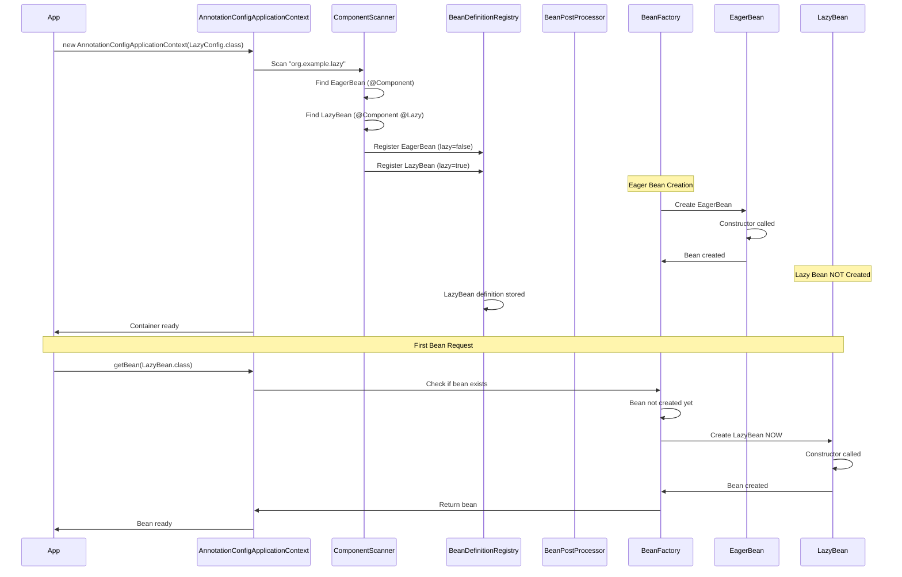

### 🔍 BeanDefinition Analysis

**Internal BeanDefinition Structure:**

```java
// For EagerBean
BeanDefinition eagerDef = new GenericBeanDefinition();
eagerDef.setBeanClassName("org.example.lazy.EagerBean");
eagerDef.setLazyInit(false);  // Default
eagerDef.setScope("singleton");

// For LazyBean
BeanDefinition lazyDef = new GenericBeanDefinition();
lazyDef.setBeanClassName("org.example.lazy.LazyBean");
lazyDef.setLazyInit(true);  // @Lazy sets this
lazyDef.setScope("singleton");
```

### 📊 Spring's Internal Decision Tree

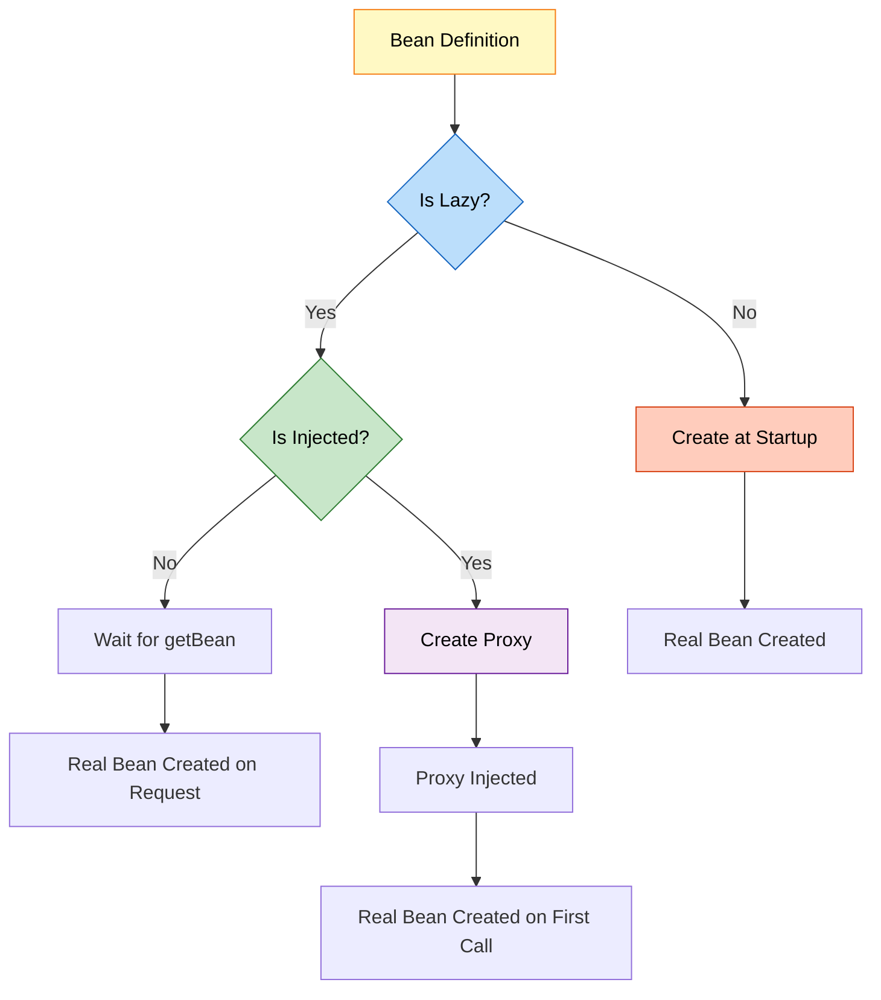

### 🎯 Key Internal Classes

| Class | Role | Responsibility |
|:------|:-----|:--------------|
| **LazyInitTargetSource** | Lazy initialization | Delays bean creation |
| **ProxyFactory** | Proxy creation | Creates CGLIB/JDK proxy |
| **AutowiredAnnotationBeanPostProcessor** | @Autowired processing | Handles @Lazy injection |
| **DefaultListableBeanFactory** | Bean creation | Checks lazy flag |

### 📝 Pseudo-Code: Spring's Internal Logic

```java
// Simplified Spring internal logic
public Object getBean(String beanName) {
    BeanDefinition def = getBeanDefinition(beanName);
    
    if (def.isLazyInit()) {
        // Check if bean already created
        if (!singletonCache.contains(beanName)) {
            // Create bean NOW
            Object bean = createBean(def);
            singletonCache.put(beanName, bean);
            return bean;
        }
        return singletonCache.get(beanName);
    } else {
        // Eager bean - should already exist
        return singletonCache.get(beanName);
    }
}
```

---

## 8. LAZY WITH DEPENDENCY INJECTION

<div align="center">

</div>

### 📌 Lazy Injection Patterns


### Pattern 1: Constructor Injection with @Lazy

```java
@Component
public class OrderService {
    private final EmailService emailService;
    private final ReportGenerator reportGenerator;
    
    @Autowired
    public OrderService(
            EmailService emailService,
            @Lazy ReportGenerator reportGenerator) {  // Lazy injection
        this.emailService = emailService;  // Created immediately
        this.reportGenerator = reportGenerator;  // Proxy injected
        System.out.println("OrderService created");
    }
    
    public void processOrder() {
        emailService.send("Order confirmed");  // Works immediately
    }
    
    public void generateReport() {
        reportGenerator.generate();  // NOW ReportGenerator is created
    }
}
```

**Execution Flow:**
```
1. Container starts
2. EmailService created
3. OrderService created
4. ReportGenerator proxy injected (NOT created)
5. processOrder() called → works fine
6. generateReport() called → ReportGenerator created NOW
```

### Pattern 2: Setter Injection with @Lazy

```java
@Component
public class UserService {
    private NotificationService notificationService;
    
    @Autowired
    @Lazy
    public void setNotificationService(NotificationService notificationService) {
        this.notificationService = notificationService;  // Proxy injected
    }
}
```

### Pattern 3: Field Injection with @Lazy

```java
@Component
public class ProductService {
    @Autowired
    @Lazy
    private InventoryService inventoryService;  // Proxy injected
}
```

### 📊 Injection Behavior Comparison

| Injection Type | Without @Lazy | With @Lazy |
|:--------------|:-------------|:-----------|
| **Constructor** | Real bean injected | Proxy injected |
| **Setter** | Real bean injected | Proxy injected |
| **Field** | Real bean injected | Proxy injected |
| **Bean Creation** | At injection time | On first method call |
| **Null Safety** | ✅ Guaranteed | ✅ Guaranteed (proxy) |

### 🎯 Breaking Circular Dependencies

**Problem: Circular Dependency**
```java
@Component
public class A {
    @Autowired
    private B b;  // A needs B
}

@Component
public class B {
    @Autowired
    private A a;  // B needs A → Circular!
}
```

**Solution: Use @Lazy**
```java
@Component
public class A {
    private final B b;
    
    @Autowired
    public A(@Lazy B b) {  // Proxy injected
        this.b = b;
    }
}

@Component
public class B {
    private final A a;
    
    @Autowired
    public B(A a) {
        this.a = a;
    }
}
```

**How It Works:**
1. Spring creates A
2. Injects B proxy (not real B)
3. Spring creates B
4. Injects real A
5. When A calls B method → real B is created

---

## 9. LAZY WITH @PRIMARY AND @QUALIFIER

<div align="center">

</div>

### 📌 Combining @Lazy with Other Annotations


### Scenario 1: @Lazy with @Primary

```java
@Component
@Primary
@Lazy
public class EmailNotificationService implements NotificationService {
    public EmailNotificationService() {
        System.out.println("Email service created");
    }
}

@Component
public class SmsNotificationService implements NotificationService {
    public SmsNotificationService() {
        System.out.println("SMS service created");
    }
}

@Component
public class NotificationManager {
    private final NotificationService service;
    
    @Autowired
    public NotificationManager(NotificationService service) {
        this.service = service;  // Gets @Primary (Email) as proxy
    }
}
```

**Execution:**
```
1. Container starts
2. SmsNotificationService created (eager)
3. NotificationManager created
4. EmailNotificationService proxy injected (NOT created)
5. First service.send() call → EmailNotificationService created
```

### Scenario 2: @Lazy with @Qualifier

```java
@Component
@Lazy
public class EmailNotificationService implements NotificationService { }

@Component
@Lazy
public class SmsNotificationService implements NotificationService { }

@Component
public class NotificationManager {
    private final NotificationService emailService;
    private final NotificationService smsService;
    
    @Autowired
    public NotificationManager(
            @Qualifier("emailNotificationService") @Lazy NotificationService emailService,
            @Qualifier("smsNotificationService") @Lazy NotificationService smsService) {
        this.emailService = emailService;  // Proxy
        this.smsService = smsService;      // Proxy
    }
}
```

**Behavior:**
- Both services are lazy
- Proxies injected
- Real beans created when methods called

### 📊 Resolution Priority with @Lazy

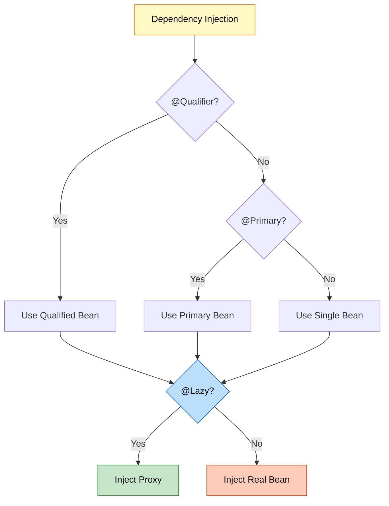

**Key Point:** @Lazy is applied AFTER bean selection (@Qualifier/@Primary)

---

## 10. PERFORMANCE IMPACT

<div align="center">

</div>

### 📊 Startup Time Analysis

**Test Scenario: 50 Beans Application**

| Configuration | Startup Time | Memory at Startup | First Request |
|:-------------|:------------|:-----------------|:-------------|
| **All Eager** | 15 seconds | 500 MB | 10 ms |
| **50% Lazy** | 8 seconds | 300 MB | 15 ms (first lazy) |
| **All Lazy** | 2 seconds | 100 MB | 20 ms (first lazy) |

### 🎯 Performance Metrics


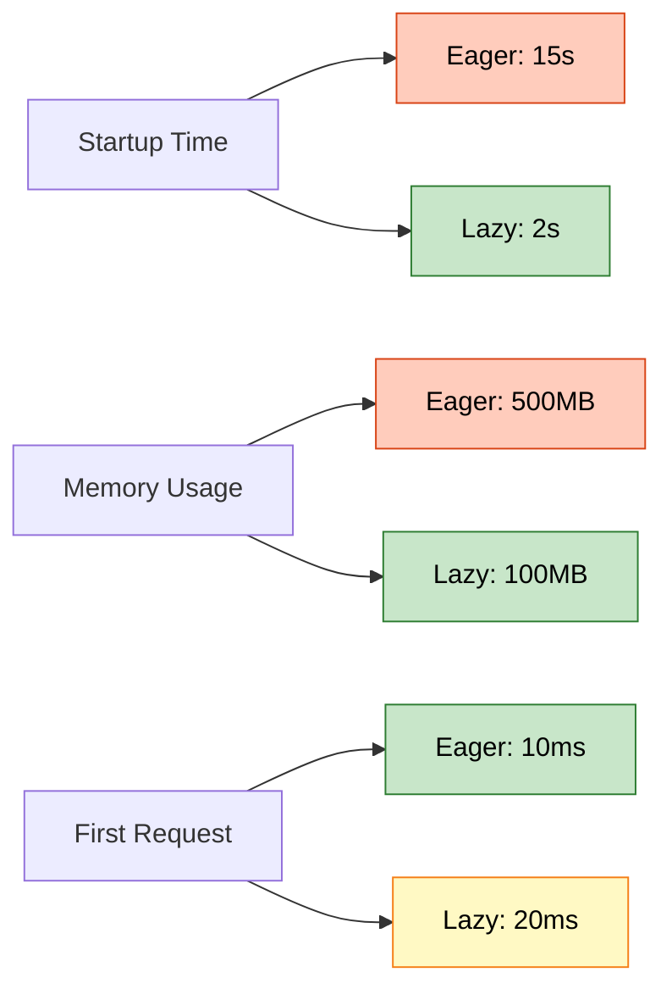

### 📈 Real-World Performance Test

**Application:** E-Commerce Platform with 100 beans

**Eager Configuration:**
```
Startup: 30 seconds
Memory: 800 MB
First page load: 50 ms
```

**Lazy Configuration (30% lazy):**
```
Startup: 12 seconds (60% faster!)
Memory: 500 MB (37% less)
First page load: 55 ms (10% slower)
Admin panel load: 200 ms (lazy beans created)
```

### ⚡ Proxy Overhead

**Proxy Method Call Overhead:**
- First call: ~5-10 ms (bean creation + proxy)
- Subsequent calls: ~0.1 ms (proxy delegation)
- Direct call: ~0.05 ms

**Overhead is negligible for:**
- Network calls (100+ ms)
- Database queries (10+ ms)
- File I/O (50+ ms)

**Overhead matters for:**
- High-frequency method calls (millions/sec)
- CPU-intensive calculations
- Real-time systems

### 📊 Memory Footprint

**Bean Memory Consumption:**

| Bean Type | Eager | Lazy (Unused) | Lazy (Used) |
|:----------|:------|:-------------|:-----------|
| **Simple Service** | 1 KB | 0 KB | 1 KB + proxy (0.5 KB) |
| **Heavy Service** | 50 MB | 0 KB | 50 MB + proxy (0.5 KB) |
| **Database Connection** | 10 MB | 0 KB | 10 MB + proxy (0.5 KB) |

**Key Insight:** Proxy overhead is minimal compared to bean size!

---

## 11. THREAD SAFETY CONSIDERATIONS

<div align="center">

</div>

### ⚠️ Race Condition on First Access

**Problem:**
```java
@Component
@Lazy
public class ExpensiveService {
    public ExpensiveService() {
        System.out.println("Creating expensive service...");
        // 5 seconds initialization
    }
}

@Component
public class UserService {
    @Autowired
    @Lazy
    private ExpensiveService expensiveService;
    
    public void process() {
        expensiveService.doWork();  // Multiple threads call this
    }
}
```

**Race Condition:**
```
Thread 1: Calls expensiveService.doWork()
Thread 2: Calls expensiveService.doWork() (simultaneously)

Both threads trigger bean creation!
```

### ✅ Spring's Solution

Spring uses **double-checked locking** internally:

```java
// Simplified Spring internal logic
public Object getBean(String beanName) {
    Object bean = singletonCache.get(beanName);
    if (bean == null) {
        synchronized (this.singletonObjects) {
            bean = singletonCache.get(beanName);  // Double-check
            if (bean == null) {
                bean = createBean(beanName);
                singletonCache.put(beanName, bean);
            }
        }
    }
    return bean;
}
```

**Result:** Only ONE bean is created, even with concurrent access.

### 📊 Thread Safety Guarantee

| Scenario | Thread Safe? | Explanation |
|:---------|:------------|:------------|
| **Singleton Lazy** | ✅ Yes | Spring synchronizes creation |
| **Prototype Lazy** | ✅ Yes | New instance per request |
| **First Access** | ✅ Yes | Double-checked locking |
| **Subsequent Access** | ✅ Yes | No synchronization needed |

---

## 12. PROJECT IMPLEMENTATION

<div align="center">

</div>

### 📁 Project Structure

```
LazyConfig/
├── src/
│   └── main/
│       └── java/
│           └── org/
│               └── example/
│                   ├── App.java
│                   └── lazy/
│                       ├── LazyConfig.java
│                       ├── EagerBean.java
│                       ├── LazyBean.java
│                       └── LazyDemo.java
├── pom.xml
└── README.md
```

### 🔍 Code Analysis


#### 1️⃣ Configuration Class

**Reference:** [LazyConfig.java](src/main/java/org/example/lazy/LazyConfig.java)

```java
@Configuration
@ComponentScan(basePackages = "org.example.lazy")
public class LazyConfig {
    // Spring scans for @Component classes
}
```

**Purpose:**
- Enables component scanning
- Finds EagerBean and LazyBean
- Registers bean definitions

---

#### 2️⃣ Eager Bean (Default Behavior)

**Reference:** [EagerBean.java](src/main/java/org/example/lazy/EagerBean.java)

```java
@Component
public class EagerBean {
    public EagerBean() {
        System.out.println("Eager Bean Created !!");
    }
    
    public void start() {
        System.out.println("Bean has been started");
    }
}
```

**Behavior:**
- Created at container startup
- No @Lazy annotation
- Default Spring behavior

---

#### 3️⃣ Lazy Bean

**Reference:** [LazyBean.java](src/main/java/org/example/lazy/LazyBean.java)

```java
@Lazy
@Component
public class LazyBean {
    public LazyBean() {
        System.out.println("Lazy Bean Created !!");
    }
    
    public void start() {
        System.out.println("Bean has been started : LAZY");
    }
}
```

**Behavior:**
- NOT created at container startup
- Created when first requested
- @Lazy annotation applied

---

#### 4️⃣ Demo Application

**Reference:** [LazyDemo.java](src/main/java/org/example/lazy/LazyDemo.java)

```java
public class LazyDemo {
    public static void main(String[] args) {
        System.out.println("== Container Created ==");
        AnnotationConfigApplicationContext context = 
            new AnnotationConfigApplicationContext(LazyConfig.class);
        
        context.close();
    }
}
```

**Output:**
```
== Container Created ==
Eager Bean Created !!
```

**Observation:** LazyBean is NOT created!

### 📊 Execution Flow

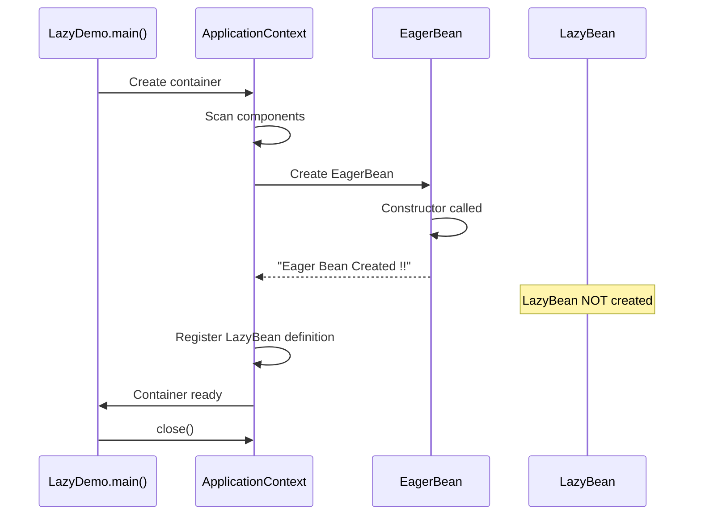

### 🎯 Testing Lazy Behavior

**Modified Demo:**
```java
public class LazyDemo {
    public static void main(String[] args) {
        System.out.println("== Container Created ==");
        ApplicationContext context = 
            new AnnotationConfigApplicationContext(LazyConfig.class);
        
        System.out.println("\n== Requesting LazyBean ==");
        LazyBean lazyBean = context.getBean(LazyBean.class);
        
        System.out.println("\n== Using LazyBean ==");
        lazyBean.start();
        
        context.close();
    }
}
```

**Output:**
```
== Container Created ==
Eager Bean Created !!

== Requesting LazyBean ==
Lazy Bean Created !!

== Using LazyBean ==
Bean has been started : LAZY
```

---

## 13. REAL-WORLD EXAMPLES

<div align="center">

</div>

### 🌐 Example 1: E-Commerce Platform


```java
// Always-used services (Eager)
@Component
public class ProductService {
    // Used in every page
}

@Component
public class CartService {
    // Used frequently
}

// Rarely-used services (Lazy)
@Component
@Lazy
public class ReportGenerator {
    public ReportGenerator() {
        // Load report templates (5 seconds)
        // Initialize PDF library (3 seconds)
    }
}

@Component
@Lazy
public class DataExporter {
    public DataExporter() {
        // Initialize Excel library (4 seconds)
    }
}

@Component
@Lazy
public class EmailMarketingService {
    public EmailMarketingService() {
        // Connect to email service (2 seconds)
    }
}

@Component
public class OrderService {
    private final ProductService productService;
    private final ReportGenerator reportGenerator;
    
    @Autowired
    public OrderService(
            ProductService productService,
            @Lazy ReportGenerator reportGenerator) {
        this.productService = productService;
        this.reportGenerator = reportGenerator;  // Proxy
    }
    
    public void processOrder() {
        productService.process();  // Works immediately
    }
    
    public void generateInvoice() {
        reportGenerator.generate();  // Created NOW (admin only)
    }
}
```

**Result:**
- Startup: 2 seconds (instead of 16 seconds)
- Regular users: Fast experience
- Admin users: Slight delay on first report (acceptable)

---

### 📧 Example 2: Notification System

```java
@Component
@Primary
public class EmailNotificationService implements NotificationService {
    // Always used
}

@Component
@Lazy
public class SmsNotificationService implements NotificationService {
    public SmsNotificationService() {
        // Connect to SMS gateway (expensive)
    }
}

@Component
@Lazy
public class PushNotificationService implements NotificationService {
    public PushNotificationService() {
        // Initialize push service (expensive)
    }
}

@Component
public class NotificationManager {
    private final NotificationService emailService;
    private final NotificationService smsService;
    
    @Autowired
    public NotificationManager(
            NotificationService emailService,  // @Primary (eager)
            @Qualifier("smsNotificationService") @Lazy NotificationService smsService) {
        this.emailService = emailService;
        this.smsService = smsService;  // Proxy
    }
    
    public void sendEmail(String message) {
        emailService.send(message);  // Fast
    }
    
    public void sendSms(String message) {
        smsService.send(message);  // First call: slow, subsequent: fast
    }
}
```

---

### 🏦 Example 3: Banking Application

```java
@Component
public class AccountService {
    // Core service - always needed
}

@Component
@Lazy
public class FraudDetectionService {
    public FraudDetectionService() {
        // Load ML models (10 seconds)
        // Initialize fraud detection engine
    }
}

@Component
@Lazy
public class CreditScoreService {
    public CreditScoreService() {
        // Connect to credit bureau API
        // Load scoring models
    }
}

@Component
public class TransactionService {
    private final AccountService accountService;
    private final FraudDetectionService fraudDetection;
    
    @Autowired
    public TransactionService(
            AccountService accountService,
            @Lazy FraudDetectionService fraudDetection) {
        this.accountService = accountService;
        this.fraudDetection = fraudDetection;
    }
    
    public void processTransaction(Transaction tx) {
        accountService.debit(tx.getAmount());
        
        if (tx.getAmount() > 10000) {
            fraudDetection.check(tx);  // Created only for large transactions
        }
    }
}
```

---

### 🎮 Example 4: Gaming Platform

```java
@Component
public class PlayerService {
    // Always needed
}

@Component
@Lazy
public class LeaderboardService {
    public LeaderboardService() {
        // Load leaderboard data from Redis (expensive)
    }
}

@Component
@Lazy
public class AchievementService {
    public AchievementService() {
        // Load achievement definitions
        // Initialize badge system
    }
}

@Component
@Lazy
public class ReplayRecorder {
    public ReplayRecorder() {
        // Initialize video recording library
    }
}

@Component
public class GameSession {
    private final PlayerService playerService;
    private final LeaderboardService leaderboard;
    private final ReplayRecorder recorder;
    
    @Autowired
    public GameSession(
            PlayerService playerService,
            @Lazy LeaderboardService leaderboard,
            @Lazy ReplayRecorder recorder) {
        this.playerService = playerService;
        this.leaderboard = leaderboard;
        this.recorder = recorder;
    }
    
    public void startGame() {
        playerService.loadPlayer();  // Fast
    }
    
    public void showLeaderboard() {
        leaderboard.display();  // Created when user clicks leaderboard
    }
    
    public void startRecording() {
        recorder.start();  // Created only if user enables recording
    }
}
```

---

## 14. BEST PRACTICES

<div align="center">

</div>

### 🎯 When to Use @Lazy

#### ✅ Use @Lazy For:

1. **Expensive Initialization**
   ```java
   @Component
   @Lazy
   public class MLModelService {
       public MLModelService() {
           // Load 500MB ML model
       }
   }
   ```

2. **Rarely Used Features**
   ```java
   @Component
   @Lazy
   public class AdminReportService {
       // Only used by admins
   }
   ```

3. **Optional Dependencies**
   ```java
   @Component
   public class UserService {
       @Autowired
       @Lazy
       private Optional<AnalyticsService> analytics;
   }
   ```

4. **Breaking Circular Dependencies**
   ```java
   @Component
   public class A {
       @Autowired
       public A(@Lazy B b) { }
   }
   ```

5. **Conditional Features**
   ```java
   @Component
   @Lazy
   @ConditionalOnProperty("feature.advanced.enabled")
   public class AdvancedFeatureService { }
   ```

#### ❌ Don't Use @Lazy For:

1. **Core Services**
   ```java
   @Component
   // NO @Lazy - always needed
   public class AuthenticationService { }
   ```

2. **Fast Initialization**
   ```java
   @Component
   // NO @Lazy - initializes in 1ms
   public class UtilityService { }
   ```

3. **Fail-Fast Requirements**
   ```java
   @Component
   // NO @Lazy - want to catch errors at startup
   public class DatabaseConnectionPool { }
   ```

### 📊 Decision Matrix


| Criteria | Use @Lazy? | Reason |
|:---------|:----------|:-------|
| **Initialization > 1 second** | ✅ Yes | Significant startup impact |
| **Used in < 20% requests** | ✅ Yes | Rarely needed |
| **Optional feature** | ✅ Yes | May not be used |
| **Circular dependency** | ✅ Yes | Break the cycle |
| **Core functionality** | ❌ No | Always needed |
| **Fast initialization** | ❌ No | No benefit |
| **Fail-fast needed** | ❌ No | Want early error detection |
| **High-frequency calls** | ❌ No | Proxy overhead matters |

### 🎯 Optimization Strategy

**Step 1: Measure Startup Time**
```java
long start = System.currentTimeMillis();
ApplicationContext context = new AnnotationConfigApplicationContext(Config.class);
long end = System.currentTimeMillis();
System.out.println("Startup: " + (end - start) + "ms");
```

**Step 2: Identify Slow Beans**
```java
@Component
public class BeanCreationLogger implements BeanPostProcessor {
    @Override
    public Object postProcessBeforeInitialization(Object bean, String name) {
        long start = System.currentTimeMillis();
        // Bean creation happens here
        long end = System.currentTimeMillis();
        if (end - start > 100) {
            System.out.println(name + " took " + (end - start) + "ms");
        }
        return bean;
    }
}
```

**Step 3: Apply @Lazy Selectively**
- Mark slow beans as @Lazy
- Test application behavior
- Measure improvement

**Step 4: Monitor Production**
- Track first-access latency
- Adjust @Lazy usage based on real usage patterns

---

## 15. COMMON PITFALLS

<div align="center">

</div>

### ❌ Pitfall 1: Lazy Everything

**Problem:**
```java
@Configuration
@Lazy  // Makes ALL beans lazy
public class AppConfig {
    @Bean public ServiceA serviceA() { }
    @Bean public ServiceB serviceB() { }
    @Bean public ServiceC serviceC() { }
}
```

**Issue:**
- First request is VERY slow
- Errors appear late
- Unpredictable performance

**Solution:** Be selective with @Lazy

---

### ❌ Pitfall 2: Lazy Core Services

**Problem:**
```java
@Component
@Lazy
public class DatabaseConnectionPool {
    // Core service marked as lazy!
}
```

**Issue:**
- First database query is slow
- Connection errors appear late
- Poor user experience

**Solution:** Keep core services eager

---

### ❌ Pitfall 3: Forgetting Proxy Behavior

**Problem:**
```java
@Component
public class UserService {
    @Autowired
    @Lazy
    private ReportService reportService;
    
    public void init() {
        if (reportService instanceof ReportService) {
            // This is FALSE! It's a proxy
        }
    }
}
```

**Issue:** Proxy is not the actual class

**Solution:** Use interfaces or check with `AopUtils.isAopProxy()`

---

### ❌ Pitfall 4: Lazy with @PostConstruct

**Problem:**
```java
@Component
@Lazy
public class CacheService {
    @PostConstruct
    public void init() {
        // When is this called?
    }
}
```

**Issue:** @PostConstruct called when bean is created (on first access)

**Solution:** Understand lifecycle timing

---

### ❌ Pitfall 5: Lazy Prototype Beans

**Problem:**
```java
@Component
@Scope("prototype")
@Lazy
public class UserSession {
    // Prototype + Lazy = Confusing
}
```

**Issue:** Prototype beans are already lazy by nature

**Solution:** Don't use @Lazy with prototype

---

## 16. TOP INTERVIEW QUESTIONS

<div align="center">

</div>

### Q1: What is @Lazy annotation and why do we need it?

**Answer:**

@Lazy is a Spring annotation that delays bean initialization until first use, instead of creating it at container startup.

**Why We Need It:**
1. **Faster Startup:** Reduces application startup time
2. **Memory Efficiency:** Unused beans don't consume memory
3. **Resource Management:** Expensive resources allocated on-demand
4. **Circular Dependencies:** Helps break circular dependency cycles

**Example:**
```java
@Component
@Lazy
public class ReportGenerator {
    public ReportGenerator() {
        // Expensive initialization (5 seconds)
    }
}
```

**Without @Lazy:** Application takes 5 extra seconds to start
**With @Lazy:** Application starts fast, report generation delayed until needed

---

### Q2: What happens internally when @Lazy is used with dependency injection?

**Answer:**

Spring creates a **proxy** instead of the real bean.

**Internal Process:**
1. Container starts
2. Spring detects @Lazy on dependency
3. Creates CGLIB/JDK proxy
4. Injects proxy (NOT real bean)
5. Real bean NOT created yet
6. First method call on proxy triggers real bean creation
7. Proxy delegates to real bean

**Example:**
```java
@Component
public class UserService {
    @Autowired
    @Lazy
    private ReportService reportService;  // Proxy injected
    
    public void generateReport() {
        reportService.generate();  // NOW real bean is created
    }
}
```

**Proxy Class Name:** `ReportService$$EnhancerBySpringCGLIB$$12345678`

---

### Q3: Can @Lazy be used to break circular dependencies? How?

**Answer:**

**Yes!** @Lazy breaks circular dependencies by injecting a proxy.

**Problem:**
```java
@Component
public class A {
    @Autowired
    private B b;  // A needs B
}

@Component
public class B {
    @Autowired
    private A a;  // B needs A → Circular!
}
```

**Solution:**
```java
@Component
public class A {
    private final B b;
    
    @Autowired
    public A(@Lazy B b) {  // Proxy injected
        this.b = b;
    }
}

@Component
public class B {
    private final A a;
    
    @Autowired
    public B(A a) {
        this.a = a;
    }
}
```

**How It Works:**
1. Spring creates A
2. Injects B proxy (not real B)
3. Spring creates B
4. Injects real A
5. When A calls B method → real B is created

---

### Q4: What is the difference between @Lazy at class level vs parameter level?

**Answer:**

| Level | Behavior | Use Case |
|:------|:---------|:---------|
| **Class Level** | Bean itself is lazy | Rarely used bean |
| **Parameter Level** | Dependency injection is lazy | Break circular deps |

**Class Level:**
```java
@Component
@Lazy
public class ReportService {
    // Bean created when requested via getBean()
}
```

**Parameter Level:**
```java
@Component
public class UserService {
    @Autowired
    public UserService(@Lazy ReportService report) {
        // UserService created immediately
        // ReportService proxy injected
        // Real ReportService created on first method call
    }
}
```

**Key Difference:**
- Class level: Affects bean creation
- Parameter level: Affects dependency injection

---

### Q5: Does @Lazy work with prototype beans?

**Answer:**

**Technically yes, but it's redundant.**

**Why?**
- Prototype beans are ALREADY lazy by nature
- Created on every `getBean()` call
- Not created at container startup

**Example:**
```java
@Component
@Scope("prototype")
@Lazy  // Redundant!
public class UserSession { }
```

**Behavior:**
- Without @Lazy: Created on each `getBean()` call
- With @Lazy: Same behavior (no difference)

**Recommendation:** Don't use @Lazy with prototype beans.

---

### Q6: What is the performance impact of @Lazy?

**Answer:**

**Startup Performance:**
- ✅ Faster startup (beans not created)
- ✅ Lower memory at startup

**Runtime Performance:**
- ❌ First access is slower (bean creation + proxy)
- ⚠️ Proxy overhead: ~0.1ms per call (negligible)

**Metrics:**

| Scenario | Eager | Lazy |
|:---------|:------|:-----|
| **Startup** | 15s | 3s |
| **First Access** | 10ms | 5010ms |
| **Subsequent Access** | 10ms | 10.1ms |

**When Overhead Matters:**
- High-frequency calls (millions/sec)
- Real-time systems
- CPU-intensive calculations

**When Overhead Doesn't Matter:**
- Network calls (100+ ms)
- Database queries (10+ ms)
- File I/O (50+ ms)

---

### Q7: Can @Lazy cause thread safety issues?

**Answer:**

**No, Spring handles thread safety.**

**Potential Issue:**
```java
@Component
@Lazy
public class ExpensiveService {
    // Multiple threads call getBean() simultaneously
}
```

**Spring's Solution:**
- Uses **double-checked locking**
- Synchronizes bean creation
- Only ONE bean is created

**Internal Logic:**
```java
if (bean == null) {
    synchronized (lock) {
        if (bean == null) {  // Double-check
            bean = createBean();
        }
    }
}
```

**Result:** Thread-safe lazy initialization

---

### Q8: What happens if @Lazy bean initialization fails?

**Answer:**

**Error occurs at first access, not at startup.**

**Example:**
```java
@Component
@Lazy
public class DatabaseService {
    public DatabaseService() {
        throw new RuntimeException("Database connection failed");
    }
}

@Component
public class UserService {
    @Autowired
    @Lazy
    private DatabaseService dbService;
    
    public void saveUser() {
        dbService.save();  // Exception thrown HERE
    }
}
```

**Behavior:**
1. Container starts successfully
2. UserService created successfully
3. First `saveUser()` call → Exception thrown

**Pros:**
- Application starts even if optional features fail

**Cons:**
- Errors appear late (not fail-fast)
- Harder to debug

**Solution:** Use eager initialization for critical services

---

### Q9: Can @Lazy be used with @Primary and @Qualifier?

**Answer:**

**Yes, they work together.**

**Example:**
```java
@Component
@Primary
@Lazy
public class EmailService implements NotificationService {
    // Primary + Lazy
}

@Component
@Lazy
public class SmsService implements NotificationService {
    // Lazy
}

@Component
public class NotificationManager {
    @Autowired
    public NotificationManager(
            NotificationService service,  // Gets @Primary (Email) as proxy
            @Qualifier("smsService") @Lazy NotificationService sms) {
        // Both are proxies
    }
}
```

**Resolution Order:**
1. @Qualifier/@Primary selects bean
2. @Lazy determines if proxy is created

**Key Point:** @Lazy is applied AFTER bean selection

---

### Q10: How do you test lazy beans?

**Answer:**

**Challenge:** Lazy beans not created until accessed

**Solution 1: Force Creation**
```java
@Test
public void testLazyBean() {
    ApplicationContext context = new AnnotationConfigApplicationContext(Config.class);
    
    // Force creation
    LazyBean bean = context.getBean(LazyBean.class);
    
    assertNotNull(bean);
}
```

**Solution 2: Test Proxy Behavior**
```java
@Test
public void testLazyInjection() {
    ApplicationContext context = new AnnotationConfigApplicationContext(Config.class);
    UserService service = context.getBean(UserService.class);
    
    // Verify proxy injected
    assertTrue(AopUtils.isAopProxy(service.getReportService()));
    
    // Trigger real bean creation
    service.generateReport();
}
```

**Solution 3: Mock Lazy Dependencies**
```java
@Test
public void testWithMock() {
    ReportService mockReport = mock(ReportService.class);
    UserService service = new UserService(mockReport);
    
    // Test without Spring context
}
```

---

### Q11: What is the difference between @Lazy and lazy-init in XML?

**Answer:**

**Same functionality, different syntax.**

**Annotation:**
```java
@Component
@Lazy
public class MyService { }
```

**XML:**
```xml
<bean id="myService" class="com.example.MyService" lazy-init="true"/>
```

**Global Lazy (XML):**
```xml
<beans default-lazy-init="true">
    <!-- All beans are lazy -->
</beans>
```

**Global Lazy (Annotation):**
```java
@Configuration
@Lazy
public class AppConfig {
    // All @Bean methods are lazy
}
```

---

### Q12: Can @Lazy improve application startup time significantly?

**Answer:**

**Yes, but depends on your beans.**

**Scenario 1: Many Expensive Beans**
```
Before @Lazy: 30 seconds startup
After @Lazy (50% lazy): 8 seconds startup
Improvement: 73% faster!
```

**Scenario 2: Fast Beans**
```
Before @Lazy: 2 seconds startup
After @Lazy (50% lazy): 1.5 seconds startup
Improvement: 25% faster (not significant)
```

**Best Candidates for @Lazy:**
- ML model loading (10+ seconds)
- Large file processing (5+ seconds)
- External API connections (3+ seconds)
- Report generation (2+ seconds)

**Poor Candidates:**
- Simple POJOs (< 1ms)
- Utility classes (< 1ms)
- Core services (always needed)

**Recommendation:** Profile your application to identify slow beans

---

<div align="center">

## 🎓 End of Spring @Lazy Annotation Guide

<br>
<table>
<tr>
<td align="center">


<br>

**Created with dedication by Avinash Dhanuka**

<br>

[](https://github.com/Avinash-706)
[](mailto:avunashdhanuka@gmail.com)

<br>

---

**Happy Learning! 🚀**

*"Lazy Loading: Start Fast, Scale Smart!"* - Avinash Dhanuka

<br>


---

**© 2026 Avinash Dhanuka | All Rights Reserved**

</td>
</tr>
</table>
</div>