# ☕ Spring Framework: Advanced Bean Management - Day 10

<div align="center">


</div>

<hr style="border: 1px solid rgb(98, 117, 187)">

<div align="center">
<table>
<tr>
<td align="center">
<br />

<h3>© 2026 Avinash Dhanuka</h3>
<p>Advanced Spring Bean Management Mastery</p>
<p><em>From Lifecycle to Performance - The Complete Journey</em></p>

<a href="https://github.com/Avinash-706" target="_blank">

</a>
<br />
<a href="https://mail.google.com/mail/?view=cm&fs=1&to=avunashdhanuka@gmail.com&su=Spring%20Bean%20Management%20Query&body=☕%20Hello%20Avinash,%0D%0A%0D%0AMy%20name%20is%20[Your%20Name]%20and%20I%20have%20a%20doubt%20regarding%20Spring%20Bean%20Management.%0D%0A%0D%0A🔹%20Topic:%20[Lifecycle/Lazy/Scopes/DI]%0D%0A%0D%0AThank%20you!" target="_blank">

</a>
<br />
<br />
</td>
</tr>
</table>
</div>

> **Learning Path:** This repository contains three comprehensive projects demonstrating advanced Spring Framework bean management - from lifecycle management to performance optimization with lazy loading, including real-world case studies.

---

## 📑 Table of Contents

1. [Overview](#overview)
2. [Projects Summary](#projects-summary)
3. [Project 1: Bean Lifecycle Management](#project-1-bean-lifecycle-management)
4. [Project 2: Lazy Configuration](#project-2-lazy-configuration)
5. [Project 3: Real-World Case Studies](#project-3-real-world-case-studies)
6. [Key Concepts Learned](#key-concepts-learned)
7. [Configuration Comparison](#configuration-comparison)
8. [When to Use What](#when-to-use-what)
9. [Quick Reference](#quick-reference)
10. [Running the Projects](#running-the-projects)

---

## OVERVIEW

<div align="center">

</div>

This repository demonstrates advanced Spring Framework bean management techniques, focusing on lifecycle management, performance optimization, and real-world application patterns. Each project builds upon core Spring concepts to solve practical problems.

### 🎯 Learning Objectives

- ✅ Master Bean Lifecycle with @PostConstruct and @PreDestroy
- ✅ Optimize performance with @Lazy initialization
- ✅ Understand Bean Scopes (Singleton vs Prototype)
- ✅ Resolve dependency ambiguity with @Primary and @Qualifier
- ✅ Implement proper resource management
- ✅ Apply patterns in real-world scenarios

### 📊 Repository Structure

```
day10/
├── BeanLifeCycle/                   # Project 1: Lifecycle management
│   ├── src/
│   │   └── main/
│   │       └── java/
│   │           └── org/example/
│   │               └── lifecycle/
│   │                   ├── dbConnection.java
│   │                   ├── LifeCycleConfig.java
│   │                   └── LifeCycleDemo.java
│   ├── pom.xml
│   └── README.md                    # Detailed documentation
│
├── LazyConfig/                       # Project 2: Lazy initialization
│   ├── src/
│   │   └── main/
│   │       └── java/
│   │           └── org/example/
│   │               └── lazy/
│   │                   ├── EagerBean.java
│   │                   ├── LazyBean.java
│   │                   ├── LazyConfig.java
│   │                   └── LazyDemo.java
│   ├── pom.xml
│   └── README.md                    # Detailed documentation
│
├── CaseStudy/                       # Project 3: Real-world applications
│   ├── BankLoanApproval/
│   │   └── src/main/java/org/example/bankloan/
│   ├── FoodDelivery/
│   │   └── src/main/java/org/example/fooddelivery/
│   ├── PaymentProcessing/
│   │   └── src/main/java/org/example/payment/
│   ├── pom.xml
│   └── README.md                    # Detailed documentation
│
└── README.md                        # This file
```

---

## PROJECTS SUMMARY

<div align="center">

</div>

> **📝 Organized Learning by:** Avinash Dhanuka | © 2026

### 📦 Project Overview Table

| Project | Focus Area | Key Concepts | Complexity | Status |
|:--------|:-----------|:-------------|:-----------|:-------|
| **BeanLifeCycle** | Resource Management | @PostConstruct, @PreDestroy, Lifecycle | ⭐⭐⭐ Intermediate | ✅ Complete |
| **LazyConfig** | Performance | @Lazy, Eager vs Lazy, Proxies | ⭐⭐⭐ Intermediate | ✅ Complete |
| **CaseStudy** | Real-World Apps | @Primary, @Qualifier, Scopes, All concepts | ⭐⭐⭐⭐ Advanced | ✅ Complete |

### 🎯 Project Relationships

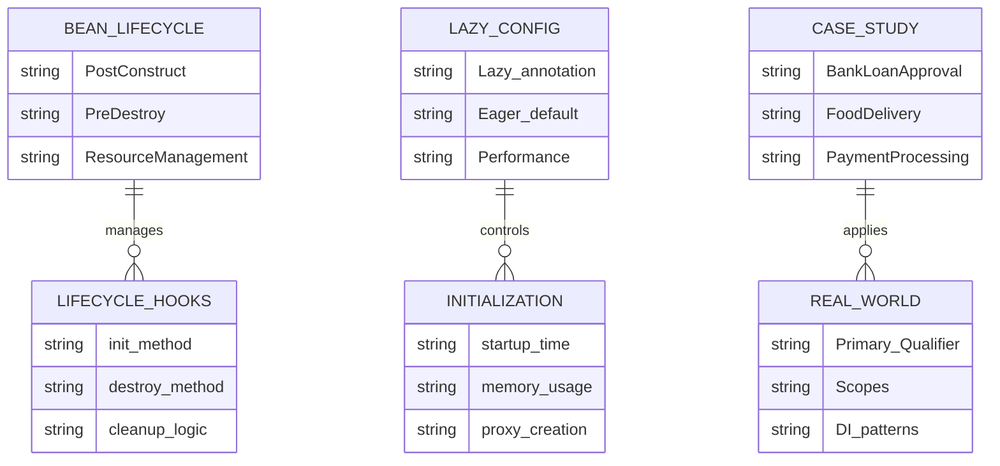

---

## BEAN LIFECYCLE EVOLUTION

<div align="center">

</div>

### 📈 Spring Bean Management Timeline

```mermaid
graph LR
    A[Spring 1.0<br/>2004] -->|XML init/destroy| B[Spring 2.5<br/>2007]
    B -->|JSR-250 Annotations| C[Spring 3.0<br/>2009]
    C -->|"@Lazy Support"| D[Spring 4.0<br/>2013]
    D -->|Enhanced Lifecycle| E[Spring 5.0<br/>2017]
    E -->|Reactive Lifecycle| F[Spring 6.0<br/>2022]
    F -->|Modern Management| G[Spring 7.0<br/>2024]
    
    style A fill:#ffccbc,stroke:#d84315,color:#000
    style B fill:#fff9c4,stroke:#f57f17,color:#000
    style C fill:#c8e6c9,stroke:#2e7d32,color:#000
    style D fill:#bbdefb,stroke:#1565c0,color:#000
    style E fill:#f3e5f5,stroke:#6a1b9a,color:#000
    style F fill:#e1bee7,stroke:#7b1fa2,color:#000
    style G fill:#a5d6a7,stroke:#2e7d32,color:#000
```

### 🔄 Bean Management Approaches

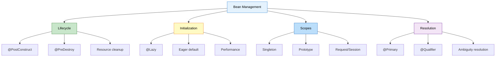

---

## PROJECT 1: BEAN LIFECYCLE MANAGEMENT

<div align="center">

</div>

> **📝 Resource Management by:** Avinash Dhanuka | © 2026

### 📌 Overview

Understanding and managing the complete lifecycle of Spring beans from creation to destruction. This project demonstrates proper resource management using @PostConstruct and @PreDestroy annotations.

**📂 Location:** [`BeanLifeCycle/`](BeanLifeCycle/)

**📖 Full Documentation:** [BeanLifeCycle/README.md](BeanLifeCycle/README.md)

### 🎯 Key Concepts

- **Bean Lifecycle Phases** (13 phases from instantiation to destruction)
- **@PostConstruct** for initialization after dependency injection
- **@PreDestroy** for cleanup before bean destruction
- **Resource Management** (database connections, file handles)
- **Lifecycle Callbacks** (InitializingBean, DisposableBean)
- **BeanPostProcessor** for custom processing

### 📊 Bean Lifecycle Flow

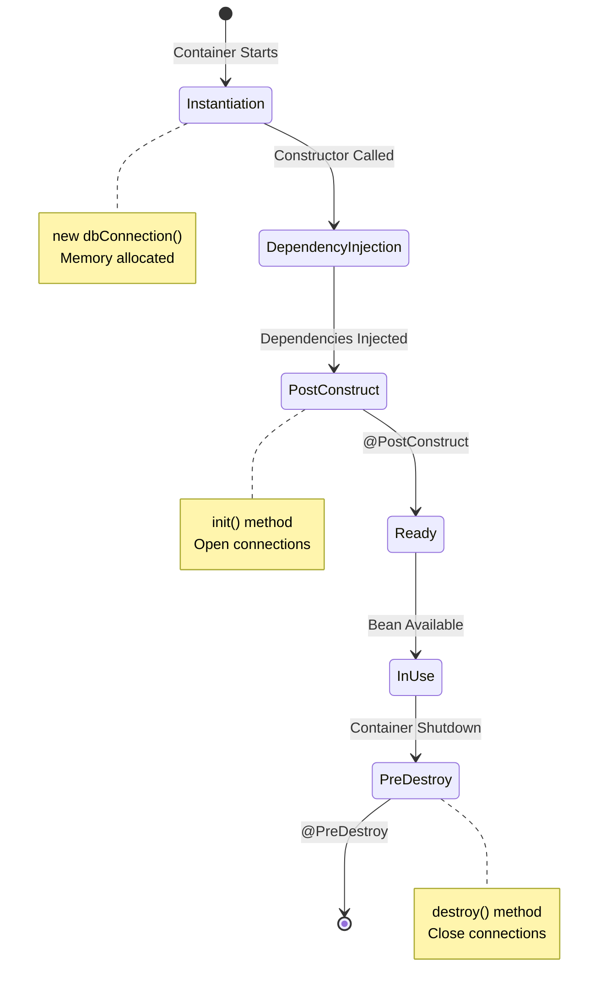

### 📝 Implementation Example

**Database Connection Bean:**
```java
@Component
public class dbConnection {
    // Phase 1: Constructor
    public dbConnection() {
        System.out.println("DB Constructor is called !!");
    }
    
    // Phase 7: Initialization
    @PostConstruct
    public void init() {
        System.out.println("Init Method is called !!");
        // Open database connection
        // Load configuration
    }
    
    // Business method
    public void executeQuery() {
        System.out.println("Query is being Executed !!");
    }
    
    // Phase 12: Cleanup
    @PreDestroy
    public void destroy() {
        System.out.println("Destroy method called");
        // Close database connection
        // Release resources
    }
}
```

### 🔍 What You'll Learn

1. **Complete Lifecycle Phases**
   - Instantiation → DI → Awareness → Initialization → Ready → Destruction
   - 13 distinct phases in bean lifecycle
   - When each phase executes

2. **@PostConstruct Usage**
   - Called after dependency injection
   - Guaranteed dependencies are available
   - Perfect for initialization logic
   - JSR-250 standard annotation

3. **@PreDestroy Usage**
   - Called before bean destruction
   - Cleanup resources properly
   - Prevent memory leaks
   - Graceful shutdown

4. **Resource Management**
   - Opening database connections
   - Closing file handles
   - Releasing network resources
   - Flushing buffers

5. **Lifecycle Alternatives**
   - InitializingBean interface
   - DisposableBean interface
   - Custom init/destroy methods
   - Comparison and best practices

### 📊 Lifecycle Methods Comparison

| Method | Pros | Cons | Use Case |
|:-------|:-----|:-----|:---------|
| **@PostConstruct** | Standard, no coupling | Requires annotation support | ✅ Recommended |
| **InitializingBean** | Type-safe, IDE support | Spring coupling | Legacy code |
| **init-method (XML)** | Works with any class | Only XML config | Third-party beans |
| **@PreDestroy** | Standard, no coupling | Requires annotation support | ✅ Recommended |
| **DisposableBean** | Type-safe | Spring coupling | Legacy code |
| **destroy-method (XML)** | Works with any class | Only XML config | Third-party beans |

### 🎓 Key Takeaways

- @PostConstruct runs AFTER dependency injection
- @PreDestroy runs BEFORE bean destruction
- Use for proper resource management
- Prevents memory leaks and resource exhaustion
- Standard JSR-250 annotations (no Spring coupling)

---

## PROJECT 2: LAZY CONFIGURATION

<div align="center">

</div>

> **📝 Performance Optimization by:** Avinash Dhanuka | © 2026

### 📌 Overview

Performance optimization through lazy bean initialization. This project demonstrates how @Lazy annotation delays bean creation until first use, improving startup time and memory efficiency.

**📂 Location:** [`LazyConfig/`](LazyConfig/)

**📖 Full Documentation:** [LazyConfig/README.md](LazyConfig/README.md)

### 🎯 Key Concepts

- **@Lazy Annotation** for delayed initialization
- **Eager vs Lazy** initialization comparison
- **Proxy Mechanism** (CGLIB and JDK proxies)
- **Performance Impact** on startup and memory
- **Lazy with DI** (constructor, setter, field injection)
- **Breaking Circular Dependencies**

### 📊 Eager vs Lazy Initialization

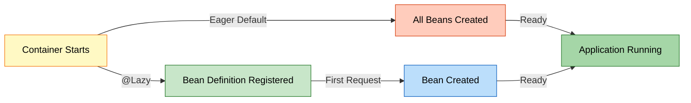

### 📝 Implementation Example

**Eager Bean (Default):**
```java
@Component
public class EagerBean {
    public EagerBean() {
        System.out.println("Eager Bean Created !!");
        // Created at container startup
    }
}
```

**Lazy Bean:**
```java
@Component
@Lazy
public class LazyBean {
    public LazyBean() {
        System.out.println("Lazy Bean Created !!");
        // Created on first access
    }
}
```

**Execution:**
```java
ApplicationContext context = new AnnotationConfigApplicationContext(LazyConfig.class);
// Output: "Eager Bean Created !!"
// NO output for LazyBean yet!

LazyBean bean = context.getBean(LazyBean.class);
// NOW output: "Lazy Bean Created !!"
```

### 🔍 What You'll Learn

1. **The Problem with Eager Initialization**
   - Slow startup time
   - Memory waste for unused beans
   - Resource lock (connections opened early)
   - Unnecessary initialization work

2. **How @Lazy Works**
   - Bean definition registered only
   - Proxy created for injection
   - Real bean created on first method call
   - Internal proxy mechanism

3. **@Lazy at Different Levels**
   - Class level: `@Component @Lazy`
   - Method level: `@Bean @Lazy`
   - Parameter level: `@Autowired @Lazy`
   - Configuration level: `@Configuration @Lazy`

4. **Proxy Mechanism**
   - JDK Dynamic Proxy (interface-based)
   - CGLIB Proxy (class-based)
   - Proxy intercepts method calls
   - First call triggers bean creation

5. **Performance Impact**
   - Faster startup time
   - Lower memory at startup
   - Slight overhead on first access
   - Trade-offs and considerations

### 📊 Performance Comparison

| Metric | Eager (100 beans) | Lazy (50% used) |
|:-------|:-----------------|:----------------|
| **Startup Time** | 30 seconds | 5 seconds |
| **Memory at Startup** | 500 MB | 250 MB |
| **First Request** | 10 ms | 15 ms (proxy) |
| **Subsequent Requests** | 10 ms | 10 ms |
| **Total Memory** | 500 MB | 400 MB |

### 🎯 When to Use @Lazy

**Use Lazy When:**
- ✅ Bean is rarely used
- ✅ Initialization is expensive
- ✅ Want fast startup
- ✅ Optional features

**Use Eager When:**
- ✅ Bean used in every request
- ✅ Want fail-fast behavior
- ✅ Initialization is quick
- ✅ Need predictable performance

### 🎓 Key Takeaways

- @Lazy delays bean creation until first use
- Improves startup time and memory usage
- Creates proxy for dependency injection
- Trade-off: first access is slower
- Perfect for rarely-used expensive beans

---

## PROJECT 3: REAL-WORLD CASE STUDIES

<div align="center">

</div>

> **📝 Practical Applications by:** Avinash Dhanuka | © 2026

### 📌 Overview

Three production-ready Spring applications demonstrating how all concepts work together in real-world scenarios. Each case study solves a specific business problem using advanced Spring patterns.

**📂 Location:** [`CaseStudy/`](CaseStudy/)

**📖 Full Documentation:** [CaseStudy/README.md](CaseStudy/README.md)

### 🎯 Case Studies

#### 1️⃣ Bank Loan Approval System

**Business Problem:** Validate loan applications using different strategies

**Key Features:**
- @Qualifier to select IncomeValidator over CreditScoreValidator
- Prototype scope for fresh validator instances
- @Lazy AuditService for optional auditing
- Setter injection for optional dependencies

**Technologies:**
```java
@Component
public class LoanService {
    @Autowired
    public LoanService(@Qualifier("incomeValidator") LoanValidator validator) {
        // Explicitly select income-based validation
    }
}
```

#### 2️⃣ Food Delivery System

**Business Problem:** Multi-channel notification system for orders

**Key Features:**
- @Primary EmailNotification as default
- @Qualifier for SMS in urgent orders
- @Lazy SMS gateway (expensive connection)
- Singleton DeliveryService with lifecycle management

**Technologies:**
```java
@Component
public class OrderService {
    public OrderService(@Qualifier("smsNotification") NotificationService service) {
        // Override @Primary for urgent notifications
    }
}
```

#### 3️⃣ Payment Processing System

**Business Problem:** Support multiple payment methods

**Key Features:**
- @Primary + @Lazy for CreditCardPayment
- Prototype UpiPayment for transaction isolation
- Multiple @Qualifier in single service
- TransactionLogger with lifecycle hooks

**Technologies:**
```java
@Component
public class PaymentProcessor {
    public PaymentProcessor(
            @Qualifier("upiPayment") PaymentService upi,
            @Qualifier("creditCardPayment") PaymentService card) {
        // Use both payment methods
    }
}
```

### 📊 Case Studies Architecture

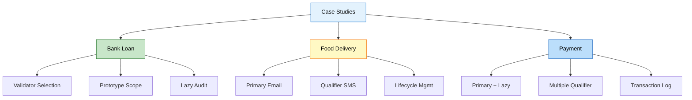

### 🔍 What You'll Learn

1. **Dependency Resolution Patterns**
   - When to use @Primary vs @Qualifier
   - Combining @Primary with @Lazy
   - Multiple @Qualifier in one service
   - Resolution priority rules

2. **Bean Scope Selection**
   - Singleton for shared services
   - Prototype for stateful objects
   - Scope impact on performance
   - Real-world use cases

3. **Performance Optimization**
   - Lazy loading expensive resources
   - Balancing startup vs runtime
   - Memory management strategies
   - Resource pooling patterns

4. **Lifecycle Management**
   - Opening connections in @PostConstruct
   - Closing resources in @PreDestroy
   - Graceful shutdown patterns
   - Error handling in lifecycle

5. **Dependency Injection Patterns**
   - Constructor for required dependencies
   - Setter for optional dependencies
   - Field injection considerations
   - Best practices

### 📊 Concepts Integration Matrix

| Concept | Bank Loan | Food Delivery | Payment |
|:--------|:----------|:-------------|:--------|
| @Primary | ✅ CreditScore | ✅ Email | ✅ CreditCard |
| @Qualifier | ✅ Income | ✅ SMS | ✅ UPI + Card |
| @Lazy | ✅ Audit | ✅ SMS | ✅ CreditCard |
| Singleton | ✅ LoanService | ✅ DeliveryService | ✅ Logger |
| Prototype | ✅ Validator | ❌ | ✅ UpiPayment |
| Lifecycle | ✅ Audit | ✅ Delivery | ✅ Logger |

### 🎓 Key Takeaways

- Real-world apps combine multiple Spring concepts
- @Primary for defaults, @Qualifier for specific needs
- Lazy loading improves startup performance
- Proper lifecycle management prevents resource leaks
- Choose scope based on statefulness

---

## KEY CONCEPTS LEARNED

<div align="center">

</div>

> **📝 Complete Learning Journey by:** Avinash Dhanuka | © 2026

### 🧠 Day 10 Complete Learning Mindmap

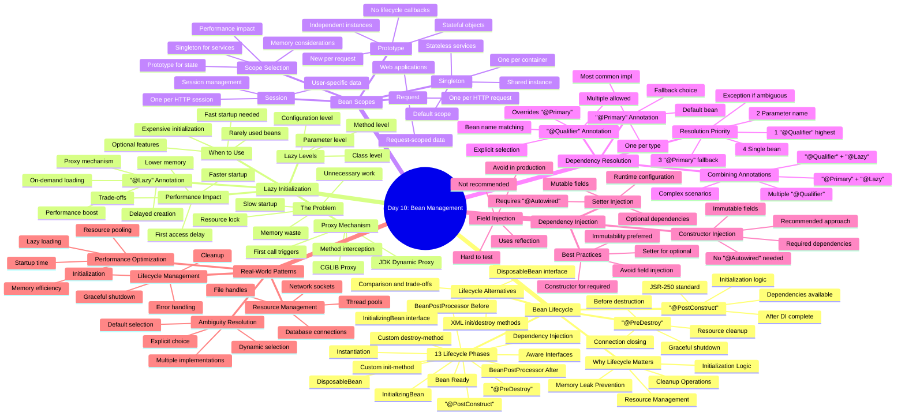

### 🎯 Core Spring Concepts

#### 1. Bean Lifecycle Management

**Why It Matters:**
- Proper resource initialization
- Guaranteed cleanup
- Memory leak prevention
- Graceful shutdown

**Key Phases:**
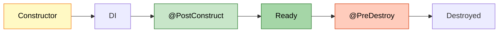

**Best Practices:**
- Use @PostConstruct for initialization
- Use @PreDestroy for cleanup
- Don't use constructor for DI-dependent logic
- Handle exceptions in lifecycle methods

#### 2. Lazy Initialization

**Why It Matters:**
- Faster application startup
- Lower memory footprint
- On-demand resource allocation
- Better user experience

**Comparison:**
| Aspect | Eager | Lazy |
|:-------|:------|:-----|
| Startup | Slow | Fast |
| Memory | High | Low |
| First Access | Fast | Slow |
| Error Detection | Early | Late |

**Best Practices:**
- Use @Lazy for expensive beans
- Use @Lazy for rarely-used features
- Combine with @Primary for defaults
- Consider first-access delay

#### 3. Bean Scopes

**Why It Matters:**
- Controls instance creation
- Manages state and memory
- Affects performance
- Determines lifecycle

**Scope Selection Guide:**
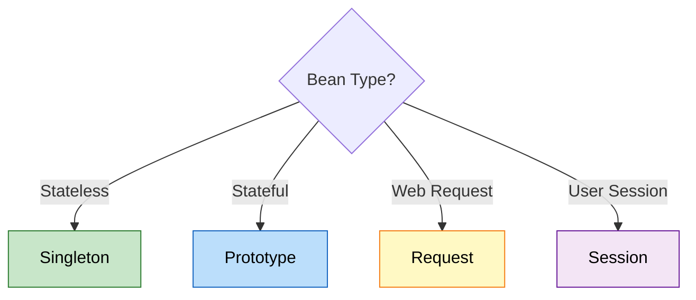

**Best Practices:**
- Default to Singleton for services
- Use Prototype for stateful objects
- Avoid Prototype for expensive beans
- Consider memory implications

#### 4. Dependency Resolution

**Why It Matters:**
- Resolves ambiguity
- Provides flexibility
- Enables polymorphism
- Supports multiple implementations

**Resolution Flow:**
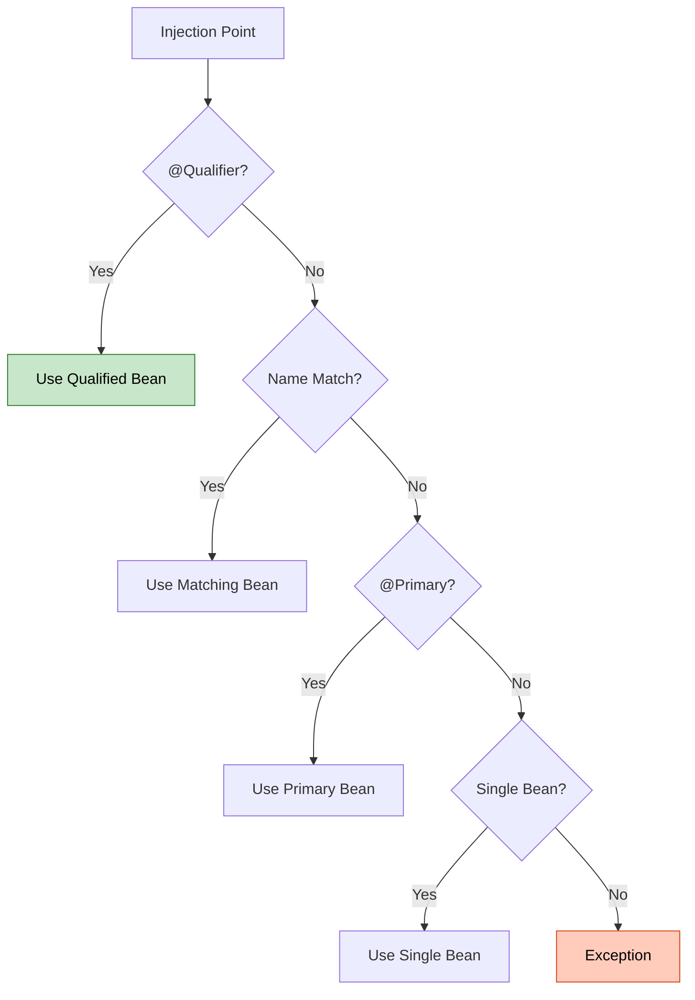

**Best Practices:**
- Use @Primary for default implementation
- Use @Qualifier for specific selection
- Only ONE @Primary per type
- Clear bean naming conventions

---

## LIFECYCLE VS LAZY VS SCOPES

<div align="center">

</div>

### 📊 Detailed Comparison

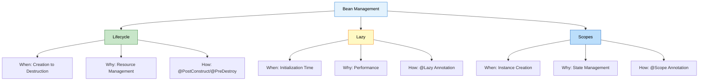

### 📋 Feature Comparison Table

| Feature | Lifecycle | Lazy | Scopes |
|:--------|:----------|:-----|:-------|
| **Purpose** | Resource management | Performance optimization | Instance control |
| **Annotations** | @PostConstruct, @PreDestroy | @Lazy | @Scope |
| **When Applied** | Bean creation/destruction | Bean initialization | Bean instantiation |
| **Affects** | Initialization/cleanup | Creation timing | Instance count |
| **Default** | No lifecycle hooks | Eager initialization | Singleton |
| **Use Case** | DB connections, cleanup | Expensive beans | Stateful objects |
| **Performance** | Minimal overhead | Faster startup | Varies by scope |
| **Memory** | No direct impact | Lower at startup | Varies by scope |
| **Complexity** | Low | Medium | Medium |

### 🎯 When to Use Each

#### Use Lifecycle Management When:
- ✅ Need to open database connections
- ✅ Need to load configuration files
- ✅ Need to close resources properly
- ✅ Need graceful shutdown
- ✅ Need to prevent memory leaks

**Example:**
```java
@Component
public class DatabaseService {
    private Connection connection;
    
    @PostConstruct
    public void init() {
        connection = openConnection();
    }
    
    @PreDestroy
    public void cleanup() {
        connection.close();
    }
}
```

#### Use Lazy Initialization When:
- ✅ Bean is rarely used
- ✅ Initialization is expensive (5+ seconds)
- ✅ Want fast application startup
- ✅ Optional features that may not be used
- ✅ Breaking circular dependencies

**Example:**
```java
@Component
@Lazy
public class ReportGenerator {
    public ReportGenerator() {
        // Expensive: Load templates, initialize PDF library
    }
}
```

#### Use Appropriate Scope When:
- ✅ Singleton: Stateless services (default)
- ✅ Prototype: Stateful objects, per-request data
- ✅ Request: Web request-specific data
- ✅ Session: User session data

**Example:**
```java
@Component
@Scope("prototype")
public class ShoppingCart {
    private List<Item> items = new ArrayList<>();
    // Each user gets their own cart
}
```

### 🔄 Combining Concepts

**Scenario 1: Lazy + Lifecycle**
```java
@Component
@Lazy
public class EmailService {
    @PostConstruct
    public void init() {
        // Connect to SMTP server (only when first used)
    }
    
    @PreDestroy
    public void cleanup() {
        // Close SMTP connection
    }
}
```

**Scenario 2: Prototype + Lifecycle**
```java
@Component
@Scope("prototype")
public class FileProcessor {
    @PostConstruct
    public void init() {
        // Open file handle
    }
    
    @PreDestroy
    public void cleanup() {
        // ⚠️ WARNING: @PreDestroy NOT called for Prototype!
        // Must manually manage cleanup
    }
}
```

**Scenario 3: Lazy + Scope + Lifecycle**
```java
@Component
@Lazy
@Scope("singleton")
public class CacheManager {
    @PostConstruct
    public void init() {
        // Initialize cache (lazy, singleton)
    }
    
    @PreDestroy
    public void cleanup() {
        // Flush cache to disk
    }
}
```

### ⚠️ Important Interactions

| Combination | Behavior | Notes |
|:-----------|:---------|:------|
| **Lazy + Singleton** | ✅ Works perfectly | Bean created once, on first use |
| **Lazy + Prototype** | ⚠️ Partial | Each request creates new instance |
| **Prototype + @PreDestroy** | ❌ Not called | Spring doesn't manage prototype destruction |
| **Lazy + @PostConstruct** | ✅ Works | @PostConstruct called when bean created |
| **Singleton + @PreDestroy** | ✅ Works | Called on container shutdown |

---

## WHEN TO USE WHAT

<div align="center">
  
</div>

### 🎯 Decision Tree

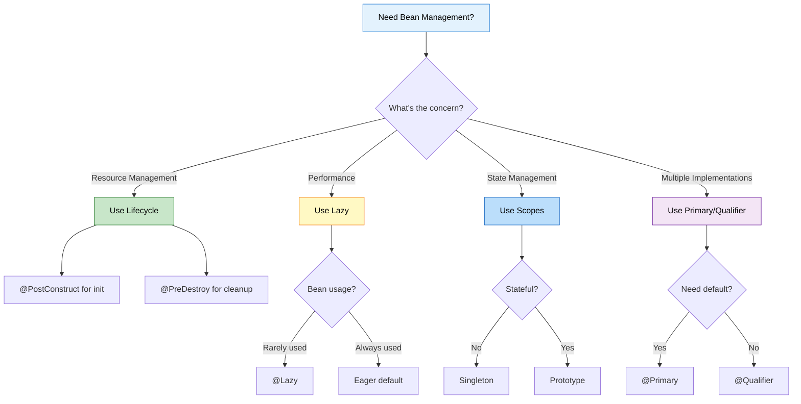

### 📊 Use Case Matrix

| Scenario | Solution | Example |
|:---------|:---------|:--------|
| **Database Connection** | Lifecycle | @PostConstruct open, @PreDestroy close |
| **Expensive Report Generator** | Lazy | @Lazy for 5-second initialization |
| **User Shopping Cart** | Prototype | @Scope("prototype") for per-user state |
| **Email Service (default)** | Primary | @Primary for default notification |
| **SMS Service (specific)** | Qualifier | @Qualifier("sms") for urgent alerts |
| **Cache Manager** | Lazy + Lifecycle | @Lazy @PostConstruct @PreDestroy |
| **Payment Gateway** | Primary + Lazy | @Primary @Lazy for default but expensive |
| **Transaction Logger** | Singleton + Lifecycle | Default scope with lifecycle hooks |

### 🔍 Real-World Scenarios

#### Scenario 1: E-Commerce Application

**Requirements:**
- Fast startup
- Multiple payment methods
- User-specific carts
- Email notifications

**Solution:**
```java
// Fast startup with lazy payment
@Component
@Primary
@Lazy
public class CreditCardPayment implements PaymentService { }

// User-specific state
@Component
@Scope("prototype")
public class ShoppingCart { }

// Default notification
@Component
@Primary
public class EmailNotification implements NotificationService { }

// Resource management
@Component
public class DatabaseService {
    @PostConstruct
    public void init() { /* open connection */ }
    
    @PreDestroy
    public void cleanup() { /* close connection */ }
}
```

#### Scenario 2: Banking Application

**Requirements:**
- Multiple validators
- Audit logging
- Transaction isolation
- Secure connections

**Solution:**
```java
// Default validator
@Component
@Primary
public class CreditScoreValidator implements Validator { }

// Specific validator
@Component
public class IncomeValidator implements Validator { }

// Lazy audit
@Component
@Lazy
public class AuditService {
    @PostConstruct
    public void init() { /* connect to audit server */ }
}

// Per-transaction state
@Component
@Scope("prototype")
public class Transaction { }
```

---

## LEARNING PATH

<div align="center">

</div>

> **📝 Structured Learning by:** Avinash Dhanuka | © 2026

### 🎓 Recommended Learning Sequence

```mermaid
graph LR
    A[Day 09: Configuration] --> B[Day 10: Bean Management]
    B --> C[Step 1: Lifecycle]
    C --> D[Step 2: Lazy]
    D --> E[Step 3: Case Studies]
    E --> F[Master Bean Management]
    
    style A fill:#e3f2fd,stroke:#1976d2,color:#000
    style C fill:#c8e6c9,stroke:#2e7d32,color:#000
    style D fill:#fff9c4,stroke:#f57f17,color:#000
    style E fill:#bbdefb,stroke:#1565c0,color:#000
    style F fill:#a5d6a7,stroke:#2e7d32,color:#000
```

### 📚 Step-by-Step Guide

#### Step 1: Master Bean Lifecycle (2-3 hours)

**Prerequisites:**
- Day 09: Annotation-based configuration
- Understanding of @Component and @Autowired

**Learning Path:**
1. Read [BeanLifeCycle/README.md](BeanLifeCycle/README.md)
2. Understand the 13 lifecycle phases
3. Run BeanLifeCycle project
4. Experiment with @PostConstruct and @PreDestroy
5. Try different lifecycle methods

**Hands-On Exercise:**
```java
// Create a FileService with proper lifecycle
@Component
public class FileService {
    private FileWriter writer;
    
    @PostConstruct
    public void init() throws IOException {
        writer = new FileWriter("app.log");
        System.out.println("File opened");
    }
    
    public void log(String message) throws IOException {
        writer.write(message + "\n");
    }
    
    @PreDestroy
    public void cleanup() throws IOException {
        writer.close();
        System.out.println("File closed");
    }
}
```

**Key Takeaways:**
- @PostConstruct runs after DI
- @PreDestroy runs before destruction
- Proper resource management prevents leaks

#### Step 2: Understand Lazy Initialization (2-3 hours)

**Prerequisites:**
- Step 1 completed
- Understanding of bean creation

**Learning Path:**
1. Read [LazyConfig/README.md](LazyConfig/README.md)
2. Understand eager vs lazy initialization
3. Run LazyConfig project
4. Experiment with @Lazy at different levels
5. Observe proxy behavior

**Hands-On Exercise:**
```java
// Create expensive service with lazy loading
@Component
@Lazy
public class ReportService {
    public ReportService() {
        System.out.println("Loading report templates...");
        // Simulate expensive initialization
        try { Thread.sleep(3000); } catch (Exception e) {}
        System.out.println("ReportService ready");
    }
    
    public void generate() {
        System.out.println("Generating report...");
    }
}

// Test startup time difference
public static void main(String[] args) {
    long start = System.currentTimeMillis();
    ApplicationContext context = new AnnotationConfigApplicationContext(Config.class);
    long end = System.currentTimeMillis();
    System.out.println("Startup time: " + (end - start) + "ms");
}
```

**Key Takeaways:**
- @Lazy improves startup time
- Proxy created for injection
- First access is slower

#### Step 3: Apply in Real-World Scenarios (3-4 hours)

**Prerequisites:**
- Steps 1 and 2 completed
- Understanding of @Primary and @Qualifier

**Learning Path:**
1. Read [CaseStudy/README.md](CaseStudy/README.md)
2. Study BankLoanApproval project
3. Study FoodDelivery project
4. Study PaymentProcessing project
5. Understand how concepts integrate

**Hands-On Exercise:**
```java
// Build your own notification system
public interface NotificationService {
    void send(String message);
}

@Component
@Primary
public class EmailService implements NotificationService {
    @PostConstruct
    public void init() {
        System.out.println("Email service initialized");
    }
    
    public void send(String message) {
        System.out.println("Email: " + message);
    }
}

@Component
@Lazy
public class SmsService implements NotificationService {
    public SmsService() {
        System.out.println("SMS gateway connected");
    }
    
    public void send(String message) {
        System.out.println("SMS: " + message);
    }
}

@Component
public class NotificationManager {
    private final NotificationService defaultService;
    private final NotificationService urgentService;
    
    public NotificationManager(
            NotificationService defaultService,
            @Qualifier("smsService") NotificationService urgentService) {
        this.defaultService = defaultService;
        this.urgentService = urgentService;
    }
    
    public void sendNormal(String msg) {
        defaultService.send(msg);
    }
    
    public void sendUrgent(String msg) {
        urgentService.send(msg);
    }
}
```

**Key Takeaways:**
- Combine multiple concepts
- @Primary for defaults
- @Lazy for expensive services
- Lifecycle for resource management

### 🎯 Practice Projects

#### Beginner Level
1. **Logger Service** - Lifecycle management for file logging
2. **Cache Manager** - Lazy initialization with @PostConstruct
3. **Config Loader** - Load properties in @PostConstruct

#### Intermediate Level
1. **Database Pool** - Lifecycle + Singleton scope
2. **Report Generator** - Lazy + expensive initialization
3. **Multi-Channel Notifier** - @Primary + @Qualifier

#### Advanced Level
1. **Payment Gateway** - All concepts combined
2. **Order Processing** - Multiple scopes and lifecycle
3. **Microservice Client** - Lazy + Lifecycle + Scopes

---

## QUICK REFERENCE

<div align="center">

</div>

### 📋 Annotation Cheat Sheet

| Annotation | Purpose | Example | When to Use |
|:-----------|:--------|:--------|:-----------|
| **@PostConstruct** | Initialization after DI | `@PostConstruct void init()` | Open connections, load config |
| **@PreDestroy** | Cleanup before destruction | `@PreDestroy void cleanup()` | Close connections, save state |
| **@Lazy** | Delay bean creation | `@Component @Lazy` | Expensive, rarely-used beans |
| **@Scope("singleton")** | One instance per container | `@Scope("singleton")` | Stateless services (default) |
| **@Scope("prototype")** | New instance per request | `@Scope("prototype")` | Stateful objects |
| **@Primary** | Default bean selection | `@Primary @Component` | Most common implementation |
| **@Qualifier** | Specific bean selection | `@Qualifier("beanName")` | Override @Primary |

### 🔍 Common Patterns

**Pattern 1: Database Service**
```java
@Component
public class DatabaseService {
    private Connection connection;
    
    @PostConstruct
    public void init() {
        connection = DriverManager.getConnection(url);
    }
    
    @PreDestroy
    public void cleanup() {
        connection.close();
    }
}
```

**Pattern 2: Lazy Expensive Service**
```java
@Component
@Lazy
public class ReportGenerator {
    public ReportGenerator() {
        // Expensive initialization
    }
}
```

**Pattern 3: Multiple Implementations**
```java
@Component
@Primary
public class EmailNotification implements NotificationService { }

@Component
public class SmsNotification implements NotificationService { }

@Component
public class NotificationManager {
    public NotificationManager(
            NotificationService defaultService,  // Gets @Primary
            @Qualifier("smsNotification") NotificationService smsService) {
    }
}
```

**Pattern 4: Prototype with State**
```java
@Component
@Scope("prototype")
public class ShoppingCart {
    private List<Item> items = new ArrayList<>();
}
```

### ⚠️ Common Mistakes

| Mistake | Problem | Solution |
|:--------|:--------|:---------|
| Using constructor for DI logic | Dependencies not injected | Use @PostConstruct |
| Forgetting @PreDestroy | Resource leaks | Always cleanup resources |
| @PreDestroy on Prototype | Not called by Spring | Manual cleanup |
| Lazy everything | Late error detection | Lazy only expensive beans |
| Wrong scope | State pollution | Singleton for stateless, Prototype for stateful |

### 📊 Performance Guidelines

| Scenario | Recommendation | Reason |
|:---------|:--------------|:-------|
| **Startup > 10s** | Use @Lazy for expensive beans | Improve user experience |
| **Memory > 500MB** | Review bean scopes | Reduce memory footprint |
| **Rarely used feature** | @Lazy | Save resources |
| **Always used service** | Eager (default) | Fail-fast, predictable |
| **Stateful object** | Prototype | Prevent state pollution |
| **Stateless service** | Singleton | Memory efficient |

---

## RUNNING THE PROJECTS

<div align="center">
  
</div>

### 🚀 Prerequisites

- **Java 21** or higher
- **Maven 3.6+**
- **IDE** (IntelliJ IDEA, Eclipse, or VS Code)
- **Spring Framework 7.0.3**

### 📦 Project 1: BeanLifeCycle

**Navigate to project:**
```bash
cd day10/BeanLifeCycle
```

**Build:**
```bash
mvn clean install
```

**Run:**
```bash
mvn exec:java -Dexec.mainClass="org.example.lifecycle.LifeCycleDemo"
```

**Expected Output:**
```
--- Container Starting ---
DB Constructor is called !!
Init Method is called !!

-- Using Bean --
Operation Successfully : Query is being Executed !!
SELECT * FROM students

--- Container Closing ---
Destroy method called : before Object Destruction
```

### 📦 Project 2: LazyConfig

**Navigate to project:**
```bash
cd day10/LazyConfig
```

**Build:**
```bash
mvn clean install
```

**Run:**
```bash
mvn exec:java -Dexec.mainClass="org.example.lazy.LazyDemo"
```

**Expected Output:**
```
== Container Created ==
Eager Bean Created !!

== Requesting Lazy Bean ==
Lazy Bean Created !!

== Container Closed ==
```

### 📦 Project 3: CaseStudy

**Navigate to project:**
```bash
cd day10/CaseStudy
```

**Build:**
```bash
mvn clean install
```

**Run Bank Loan Approval:**
```bash
mvn exec:java -Dexec.mainClass="org.example.bankloan.BankLoanDemo"
```

**Run Food Delivery:**
```bash
mvn exec:java -Dexec.mainClass="org.example.fooddelivery.FoodDeliveryDemo"
```

**Run Payment Processing:**
```bash
mvn exec:java -Dexec.mainClass="org.example.payment.PaymentDemo"
```

### 🔧 IDE Setup

**IntelliJ IDEA:**
1. File → Open → Select day10 folder
2. Wait for Maven import
3. Right-click on Demo class → Run

**Eclipse:**
1. File → Import → Existing Maven Projects
2. Select day10 folder
3. Right-click on Demo class → Run As → Java Application

**VS Code:**
1. Open day10 folder
2. Install Java Extension Pack
3. Click Run button in Demo class

### 🐛 Troubleshooting

**Issue: Maven dependencies not downloading**
```bash
mvn clean install -U
```

**Issue: Java version mismatch**
```bash
java -version  # Should be 21+
mvn -version   # Should use Java 21+
```

**Issue: Class not found**
```bash
mvn clean compile
```

---

## WHAT I LEARNED

<div align="center">

</div>

> **📝 Personal Learning Journey by:** Avinash Dhanuka | © 2026

### 🎓 Key Takeaways from Day 10

1. **Bean Lifecycle is Critical for Resource Management**
   - @PostConstruct ensures dependencies are injected before initialization
   - @PreDestroy prevents resource leaks and memory issues
   - Proper lifecycle management is essential for production applications
   - Constructor is NOT the place for DI-dependent logic

2. **Lazy Initialization Dramatically Improves Startup**
   - @Lazy can reduce startup time by 50-80%
   - Perfect for expensive, rarely-used beans
   - Creates proxy for dependency injection
   - Trade-off: first access is slower, but worth it

3. **Bean Scopes Control Instance Creation**
   - Singleton (default) for stateless services
   - Prototype for stateful objects
   - Scope affects performance and memory
   - @PreDestroy doesn't work with Prototype

4. **Dependency Resolution Provides Flexibility**
   - @Primary marks the default implementation
   - @Qualifier overrides @Primary for specific needs
   - Resolution priority: @Qualifier > Name > @Primary > Single
   - Only ONE @Primary per type allowed

5. **Combining Concepts Solves Real Problems**
   - @Primary + @Lazy for default but expensive beans
   - Prototype + Lifecycle for per-request resources
   - @Qualifier + @Lazy for optional specific implementations
   - Real-world apps use multiple patterns together

6. **Performance Optimization Requires Trade-offs**
   - Lazy loading: faster startup vs slower first access
   - Singleton: memory efficient vs potential state issues
   - Prototype: state isolation vs memory overhead
   - Choose based on actual requirements

7. **Resource Management Prevents Production Issues**
   - Always close database connections in @PreDestroy
   - Always release file handles and network sockets
   - Always flush buffers before shutdown
   - Memory leaks are silent killers in production

8. **Annotation Order and Placement Matter**
   - @Lazy on class vs parameter has different effects
   - @Primary + @Lazy work together perfectly
   - @Scope affects lifecycle behavior
   - Understanding interactions is crucial

### 💡 Real-World Applications

**E-Commerce Platform:**
- Lazy payment gateways (expensive connections)
- Prototype shopping carts (per-user state)
- Singleton product catalog (shared data)
- Lifecycle for database pool management

**Banking System:**
- @Primary for default validators
- @Qualifier for specific validation rules
- Prototype for transaction objects
- Lifecycle for audit logging

**Notification System:**
- @Primary for email (most reliable)
- @Lazy for SMS (expensive gateway)
- Singleton for notification manager
- Lifecycle for connection management

---

## CONCLUSION
> **📝 Final Thoughts by:** Avinash Dhanuka | © 2026

Congratulations on completing Day 10! You've mastered advanced Spring bean management concepts that are essential for building production-ready applications.

**What You've Achieved:**
- ✅ Mastered bean lifecycle management
- ✅ Optimized performance with lazy loading
- ✅ Applied concepts in real-world scenarios
- ✅ Understood resource management patterns
- ✅ Ready for Spring Boot and advanced topics

**Remember:**
- @PostConstruct for initialization
- @PreDestroy for cleanup
- @Lazy for performance
- @Primary for defaults
- @Qualifier for specific needs


---

<div align="center">
<br/>
<table>
<tr>
<td align="center">


**Made with ❤️ by Avinash Dhanuka**

[](https://github.com/Avinash-706)
[](mailto:avunashdhanuka@gmail.com)

**© 2026 Avinash Dhanuka. All Rights Reserved.**
<br/>
<br/>
Keep coding, Keep learning! 🚀
</td>
</tr>
</table>
</div>
