# Spring Framework: Document Processing Engine - Deep Dive

<div align="center">


</div>

<hr style="border: 1px solid rgb(98, 117, 187)">

<div align="center">
<table>
<tr>
<td align="center">
<br />

<h3>© 2026 Avinash Dhanuka</h3>
<p>Master Guide: Spring Dependency Injection & Bean Lifecycle</p>
<p><em>Crafted with ❤️ for Enterprise Architecture Mastery</em></p>

<a href="https://github.com/Avinash-706" target="_blank">

</a>
<br />
<a href="https://mail.google.com/mail/?view=cm&fs=1&to=avunashdhanuka@gmail.com&su=Spring%20DI%20Query&body=☕%20Hello%20Avinash,%0D%0A%0D%0AMy%20name%20is%20[Your%20Name]%20and%20I%20have%20a%20doubt%20regarding%20Spring%20DI.%0D%0A%0D%0A🔹%20Topic:%20[DI/Scopes/Lifecycle]%0D%0A%0D%0AThank%20you!" target="_blank">

</a>
<br />
<br />
</td>
</tr>
</table>
</div>

> **Learning Note:** This guide demonstrates Spring Framework's core concepts through a real-world Document Processing Engine. Master dependency injection patterns, bean scopes, lifecycle management, and annotation-based configuration.

> **Prerequisites:** 
> - Understanding of Java OOP concepts
> - Basic knowledge of Spring IoC Container
> - Familiarity with annotations
> - Maven basics

---

## Table of Contents
1. [What is Document Processing Engine?](#1-what-is-document-processing-engine)
2. [Architecture Overview](#2-architecture-overview)
3. [Dependency Injection Patterns](#3-dependency-injection-patterns)
4. [Bean Scopes Deep Dive](#4-bean-scopes-deep-dive)
5. [@Primary vs @Qualifier](#5-primary-vs-qualifier)
6. [Lazy Initialization](#6-lazy-initialization)
7. [Bean Lifecycle Management](#7-bean-lifecycle-management)
8. [Complete Execution Flow](#8-complete-execution-flow)
9. [Internal Working](#9-internal-working)
10. [Real-World Production Patterns](#10-real-world-production-patterns)
11. [Common Pitfalls & Solutions](#11-common-pitfalls--solutions)
12. [Interview Questions](#12-top-interview-questions)

---

## 1. WHAT IS DOCUMENT PROCESSING ENGINE?

<div align="center">

</div>

> **📝 Author:** Avinash Dhanuka | [GitHub](https://github.com/Avinash-706)

### 📌 Definition

**Document Processing Engine** is an enterprise-grade application demonstrating Spring Framework's core features through a practical document processing system that handles PDF, Word, and XML documents.

**Key Features:**
- Multiple document processors (PDF, Word, XML)
- Audit logging system
- Storage management
- Flexible dependency injection
- Bean lifecycle management

### Why This Case Study?

| Concept | Demonstration |
|:--------|:-------------|
| **Dependency Injection** | 3 types: Constructor, Setter, Field |
| **Bean Scopes** | Singleton vs Prototype |
| **@Primary** | Default bean selection |
| **@Qualifier** | Explicit bean selection |
| **@Lazy** | Delayed initialization |
| **Lifecycle Callbacks** | @PostConstruct, @PreDestroy |

---

## 2. ARCHITECTURE OVERVIEW

<div align="center">

</div>

### Component Architecture

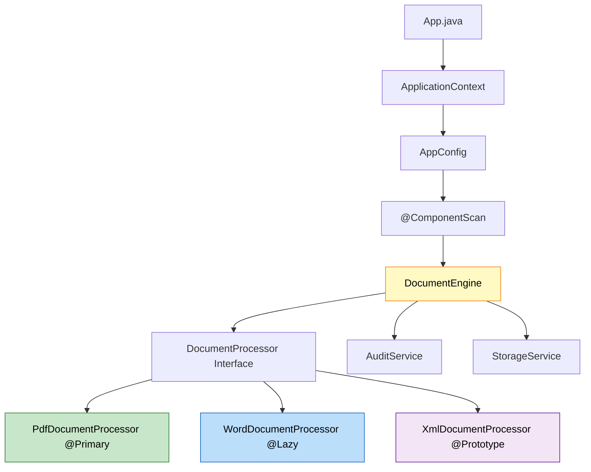

### Class Diagram

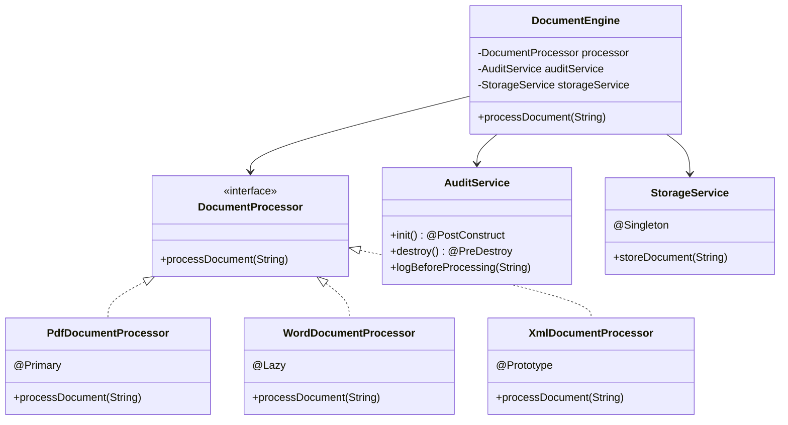

---

## 3. DEPENDENCY INJECTION PATTERNS

<div align="center">

</div>

### 📌 Three Types of Dependency Injection

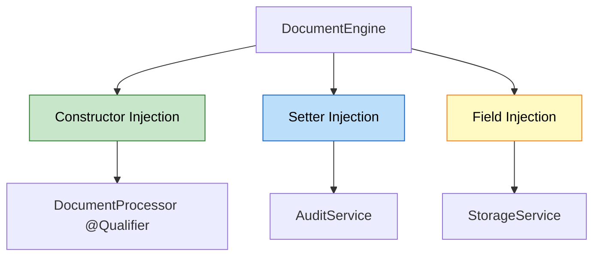

###  1. Constructor Injection (Recommended)

```java
@Component
public class DocumentEngine {
    private final DocumentProcessor documentProcessor;
    
    @Autowired
    public DocumentEngine(@Qualifier("xmlDocumentProcessor") DocumentProcessor documentProcessor) {
        this.documentProcessor = documentProcessor;
        System.out.println("[Constructor Injection] Injected: " + documentProcessor.getClass().getSimpleName());
    }
}
```

**Advantages:**
- Immutable dependencies (final fields)
- Required dependencies enforced
- Easy to test (no reflection needed)
- Null-safe

**When to Use:**
- Required dependencies
- Immutable objects
- Unit testing scenarios

---

###  2. Setter Injection

```java
@Component
public class DocumentEngine {
    private AuditService auditService;
    
    @Autowired
    public void setAuditService(AuditService auditService) {
        this.auditService = auditService;
        System.out.println("[Setter Injection] Injected: " + auditService.getClass().getSimpleName());
    }
}
```

**Advantages:**
- Optional dependencies
- Allows reconfiguration
- Circular dependency resolution

**When to Use:**
- Optional dependencies
- Reconfigurable beans
- Breaking circular dependencies

---

###  3. Field Injection

```java
@Component
public class DocumentEngine {
    @Autowired
    private StorageService storageService;
}
```

**Advantages:**
- Simplest syntax
- Less boilerplate code

**Disadvantages:**
- Cannot use final fields
- Harder to test (requires reflection)
- Hidden dependencies

**When to Use:**
- Rapid prototyping
- Simple applications
- Not recommended for production

---

### 📊 Injection Pattern Comparison

| Feature | Constructor | Setter | Field |
|:--------|:-----------|:-------|:------|
| **Immutability** | ✅ Yes (final) | ❌ No | ❌ No |
| **Required Dependencies** | ✅ Enforced | ❌ Optional | ❌ Optional |
| **Testability** | ✅ Easy | ⚠️ Medium | ❌ Hard |
| **Circular Dependencies** | ❌ Fails | ✅ Resolves | ✅ Resolves |
| **Null Safety** | ✅ Guaranteed | ⚠️ Possible | ⚠️ Possible |
| **Code Clarity** | ✅ Explicit | ✅ Explicit | ❌ Hidden |
| **Spring Recommendation** | ✅ Preferred | ⚠️ Acceptable | ❌ Discouraged |

---

## 4. BEAN SCOPES DEEP DIVE

<div align="center">

</div>

### 📌 Singleton vs Prototype

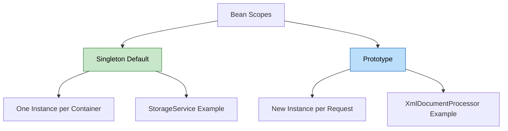

###  Singleton Scope (Default)

```java
@Component
@Scope("singleton")  // Default, can be omitted
public class StorageService {
    public StorageService() {
        System.out.println("Creating instance of: " + this.getClass().getSimpleName());
    }
}
```

**Behavior:**
```
Container starts → StorageService created ONCE
Request 1 → Same instance
Request 2 → Same instance
Request 3 → Same instance
```

**Characteristics:**
- One instance per Spring container
- Created at container startup (unless @Lazy)
- Thread-safe if stateless
- Memory efficient

**Use Cases:**
- Stateless services
- Shared resources (connection pools)
- Utility classes
- Configuration beans

---

###  Prototype Scope

```java
@Component
@Scope("prototype")
public class XmlDocumentProcessor implements DocumentProcessor {
    public XmlDocumentProcessor() {
        System.out.println("Creating instance of: " + this.getClass().getSimpleName());
    }
}
```

**Behavior:**
```
Container starts → No instance created
Request 1 → New instance created
Request 2 → New instance created
Request 3 → New instance created
```

**Characteristics:**
- New instance per getBean() call
- Not created at startup
- Spring doesn't manage destruction
- Higher memory usage

**Use Cases:**
- Stateful objects
- Per-request processing
- Thread-specific instances
- Temporary objects

---

### 📊 Scope Comparison

| Feature | Singleton | Prototype |
|:--------|:----------|:----------|
| **Instances** | One per container | Many |
| **Creation Time** | Startup (unless @Lazy) | On demand |
| **Memory** | Low | Higher |
| **Thread Safety** | Must be stateless | Each thread gets own |
| **Destruction** | Spring manages | Developer manages |
| **@PreDestroy** | ✅ Called | ❌ Not called |
| **Performance** | ✅ Fast | ⚠️ Slower |

###  Scope Demonstration

```java
// Singleton behavior
StorageService storage1 = context.getBean(StorageService.class);
StorageService storage2 = context.getBean(StorageService.class);
System.out.println(storage1 == storage2);  // true (same instance)

// Prototype behavior
XmlDocumentProcessor xml1 = context.getBean(XmlDocumentProcessor.class);
XmlDocumentProcessor xml2 = context.getBean(XmlDocumentProcessor.class);
System.out.println(xml1 == xml2);  // false (different instances)
```

---

## 5. @PRIMARY VS @QUALIFIER

<div align="center">

</div>

### 📌 The Problem: Multiple Implementations

```mermaid
graph TD
    A[DocumentProcessor Interface] --> B[PdfDocumentProcessor]
    A --> C[WordDocumentProcessor]
    A --> D[XmlDocumentProcessor]
    
    E[DocumentEngine needs one] --> F{Which one?}
    F -->|No annotation| G[❌ Error: Multiple beans]
    F -->|"@Primary"| H[✅ PdfDocumentProcessor]
    F -->|"@Qualifier"| I[✅ Specified bean]
    
    style G fill:#ffccbc,stroke:#d84315,color:#000
    style H fill:#c8e6c9,stroke:#2e7d32,color:#000
    style I fill:#bbdefb,stroke:#1565c0,color:#000
```

###  @Primary: Default Selection

```java
@Component
@Primary  // This is the default choice
public class PdfDocumentProcessor implements DocumentProcessor {
    @Override
    public void processDocument(String documentName) {
        System.out.println("Processing PDF: " + documentName);
    }
}
```

**Usage:**
```java
// Without @Qualifier, gets @Primary bean
DocumentProcessor processor = context.getBean(DocumentProcessor.class);
// Returns: PdfDocumentProcessor
```

**When to Use @Primary:**
- One implementation is used 80% of the time
- Default behavior for most cases
- Reduces @Qualifier usage

---

###  @Qualifier: Explicit Selection

```java
@Component
public class DocumentEngine {
    private final DocumentProcessor documentProcessor;
    
    @Autowired
    public DocumentEngine(@Qualifier("xmlDocumentProcessor") DocumentProcessor documentProcessor) {
        this.documentProcessor = documentProcessor;
        // Explicitly gets XmlDocumentProcessor, ignoring @Primary
    }
}
```

**Bean Naming:**
```java
@Component  // Bean name: "pdfDocumentProcessor" (camelCase)
public class PdfDocumentProcessor { }

@Component("customName")  // Bean name: "customName"
public class WordDocumentProcessor { }
```

**When to Use @Qualifier:**
- Need specific implementation
- Override @Primary behavior
- Multiple injection points need different beans

---

### 📊 @Primary vs @Qualifier Decision Tree

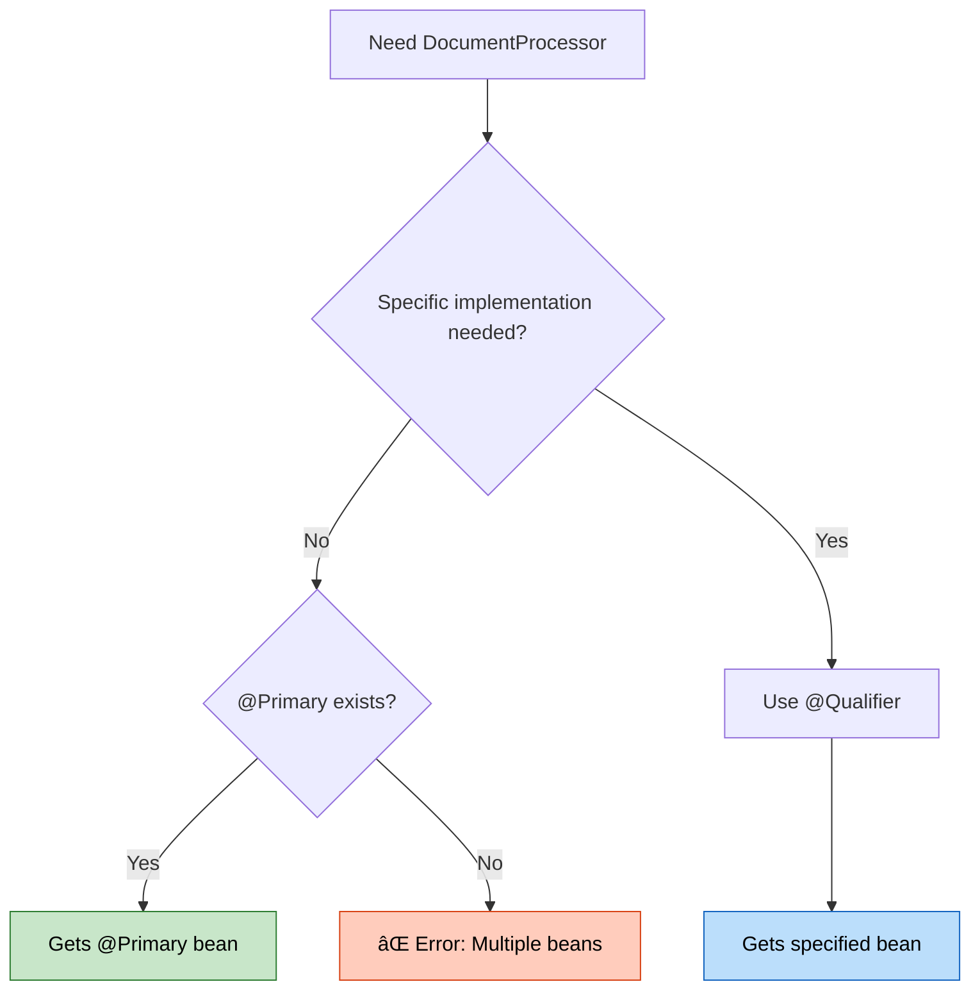

###  Real-World Example

```java
// Scenario: Payment Processing System

@Component
@Primary
public class CreditCardPayment implements PaymentProcessor {
    // Default payment method (80% of transactions)
}

@Component
public class PayPalPayment implements PaymentProcessor {
    // Alternative payment method
}

@Component
public class CryptoPayment implements PaymentProcessor {
    // Rare payment method
}

// Usage
@Service
public class OrderService {
    private final PaymentProcessor defaultPayment;
    private final PaymentProcessor cryptoPayment;
    
    @Autowired
    public OrderService(
            PaymentProcessor defaultPayment,  // Gets @Primary (CreditCard)
            @Qualifier("cryptoPayment") PaymentProcessor cryptoPayment) {
        this.defaultPayment = defaultPayment;
        this.cryptoPayment = cryptoPayment;
    }
}
```


---

## 6. LAZY INITIALIZATION


### 📌 Eager vs Lazy Loading

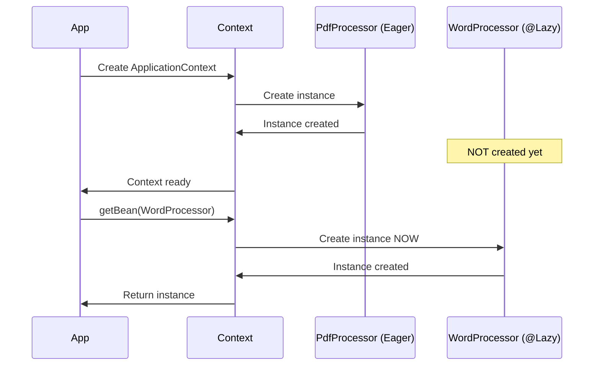

###  @Lazy Implementation

```java
@Component
@Lazy  // Not created at startup
public class WordDocumentProcessor implements DocumentProcessor {
    public WordDocumentProcessor() {
        System.out.println("Creating instance of: " + this.getClass().getSimpleName());
    }
}
```

**Execution Timeline:**
```
Time 0: Container starts
  ✅ PdfDocumentProcessor created
  ✅ XmlDocumentProcessor definition registered
  ✅ AuditService created
  ✅ StorageService created
  ❌ WordDocumentProcessor NOT created

Time 5: First getBean(WordDocumentProcessor.class)
  ✅ WordDocumentProcessor created NOW
```

### 📊 Lazy vs Eager Comparison

| Feature | Eager (Default) | Lazy (@Lazy) |
|:--------|:---------------|:-------------|
| **Creation Time** | Startup | First access |
| **Startup Speed** | ❌ Slower | ✅ Faster |
| **First Access** | ✅ Fast | ❌ Slower |
| **Error Detection** | ✅ Immediate | ❌ Delayed |
| **Memory at Startup** | ❌ Higher | ✅ Lower |
| **Use Case** | Always-used beans | Rarely-used beans |

###  When to Use @Lazy

**✅ Use @Lazy When:**
- Bean is rarely used
- Expensive initialization (database connections, file loading)
- Optional features
- Conditional beans

**❌ Don't Use @Lazy When:**
- Bean is always needed
- Fast initialization
- Want fail-fast behavior
- Critical startup validation

---

## 7. BEAN LIFECYCLE MANAGEMENT

<div align="center">

</div>

### 📌 Complete Bean Lifecycle

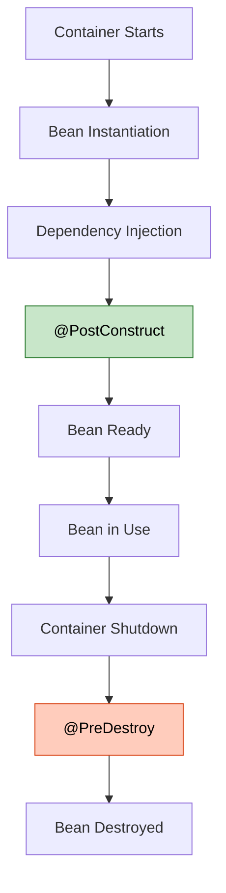

###  @PostConstruct: Initialization

```java
@Component
public class AuditService {
    
    public AuditService() {
        System.out.println("Creating instance of: " + this.getClass().getSimpleName());
    }
    
    @PostConstruct
    public void init() {
        System.out.println("[PostConstruct] Initializing audit configuration");
        // Initialize resources
        // Load configuration
        // Connect to audit database
    }
}
```

**Execution Order:**
```
1. Constructor called
2. Dependencies injected
3. @PostConstruct called  ← Initialization logic here
4. Bean ready for use
```

**Use Cases:**
- Initialize resources (connections, caches)
- Load configuration
- Validate dependencies
- Start background threads

---

###  @PreDestroy: Cleanup

```java
@Component
public class AuditService {
    
    @PreDestroy
    public void destroy() {
        System.out.println("[PreDestroy] Releasing audit resources");
        // Close connections
        // Flush buffers
        // Release resources
    }
}
```

**Execution Order:**
```
1. Container shutdown initiated
2. @PreDestroy called  ← Cleanup logic here
3. Bean destroyed
```

**Use Cases:**
- Close database connections
- Flush buffers
- Release file handles
- Stop background threads

---

### 📊 Lifecycle Callbacks Comparison

| Callback | Purpose | When Called | Scope Support |
|:---------|:--------|:-----------|:-------------|
| **Constructor** | Create instance | Bean instantiation | All |
| **@PostConstruct** | Initialize | After DI complete | Singleton, Prototype |
| **@PreDestroy** | Cleanup | Before destruction | Singleton only |

**Important:** @PreDestroy is NOT called for prototype beans!

---

## 8. COMPLETE EXECUTION FLOW

<div align="center">

</div>

### 📌 Application Execution Sequence

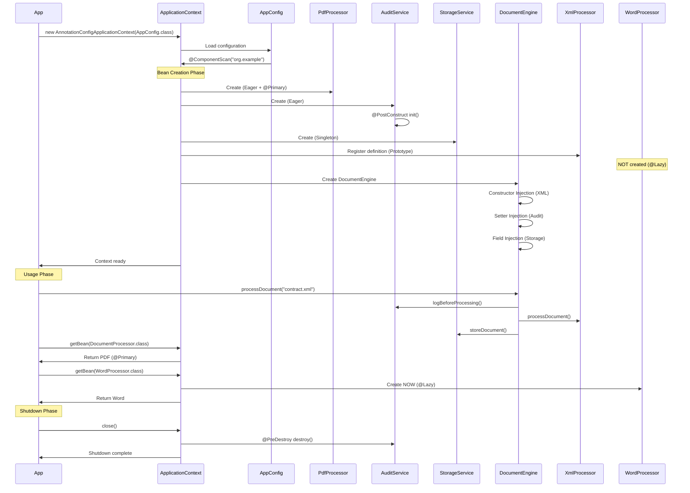

###  Console Output Analysis

```
--- Enterprise Document Processing Engine ---

Creating instance of: PdfDocumentProcessor
Creating instance of: AuditService
[PostConstruct] Initializing audit configuration for AuditService
Creating instance of: StorageService
Creating instance of: XmlDocumentProcessor
Creating instance of: DocumentEngine
[Constructor Injection] Injected DocumentProcessor: XmlDocumentProcessor
[Setter Injection] Injected AuditService: AuditService

-- @qualifier with XmlDocumentProcessor --
DocumentEngine is using: XmlDocumentProcessor

-- Document Processing Started --
[AUDIT LOG] Starting to process document: contract.xml
Processing XML document: contract.xml using XmlDocumentProcessor
[STORAGE] Storing document: contract.xml using StorageService
-- Document Processing Completed --

-- @primary (PdfDocumentProcessor) --
Default processor (without qualifier) is: PdfDocumentProcessor
Processing PDF document: report.pdf using PdfDocumentProcessor

-- @Lazy (WordDocumentProcessor) --
Creating instance of: WordDocumentProcessor
Processing Word document: document.docx using WordDocumentProcessor

-- Closing Application Context --
[PreDestroy] Releasing audit resources for AuditService

-- Application Completed --
```

**Key Observations:**
1. PdfDocumentProcessor created first (eager + @Primary)
2. AuditService @PostConstruct called after creation
3. XmlDocumentProcessor created for DocumentEngine (prototype)
4. WordDocumentProcessor created only when requested (@Lazy)
5. @PreDestroy called during shutdown

---

## 9. INTERNAL WORKING

<div align="center">

</div>

### 📌 Spring Container Internals

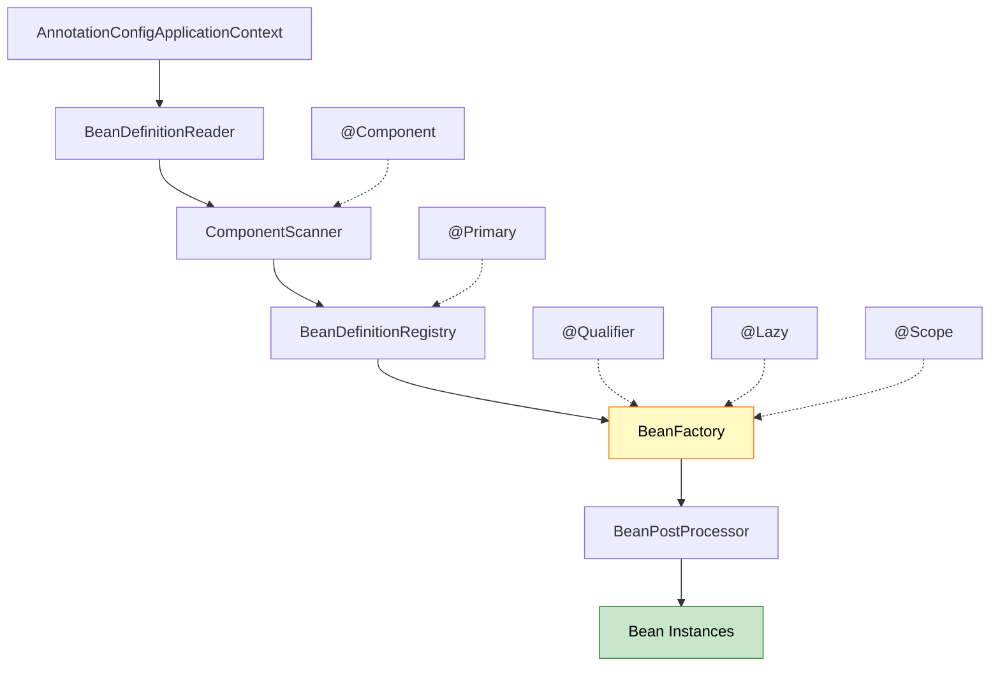

###  Bean Creation Process

**Step 1: Component Scanning**
```java
@ComponentScan(basePackages = "org.example")
// Spring scans all classes in org.example package
// Finds classes with @Component, @Service, @Repository, @Controller
```

**Step 2: Bean Definition Registration**
```java
// Spring internally creates BeanDefinition for each component
BeanDefinition pdfDef = new GenericBeanDefinition();
pdfDef.setBeanClassName("org.example.entity.PdfDocumentProcessor");
pdfDef.setPrimary(true);  // @Primary annotation
pdfDef.setLazyInit(false);  // Eager by default

BeanDefinition wordDef = new GenericBeanDefinition();
wordDef.setBeanClassName("org.example.entity.WordDocumentProcessor");
wordDef.setLazyInit(true);  // @Lazy annotation

BeanDefinition xmlDef = new GenericBeanDefinition();
xmlDef.setBeanClassName("org.example.entity.XmlDocumentProcessor");
xmlDef.setScope("prototype");  // @Scope annotation
```

**Step 3: Dependency Resolution**
```java
// Spring analyzes DocumentEngine dependencies
@Autowired
public DocumentEngine(@Qualifier("xmlDocumentProcessor") DocumentProcessor processor) {
    // Spring looks for bean named "xmlDocumentProcessor"
    // Ignores @Primary because @Qualifier is explicit
}
```

**Step 4: Bean Instantiation**
```java
// Spring uses reflection to create instances
Class<?> clazz = Class.forName("org.example.entity.PdfDocumentProcessor");
Constructor<?> constructor = clazz.getConstructor();
Object instance = constructor.newInstance();
```

**Step 5: Dependency Injection**
```java
// Constructor injection
Constructor<?> constructor = DocumentEngine.class.getConstructor(DocumentProcessor.class);
Object engine = constructor.newInstance(xmlProcessor);

// Setter injection
Method setter = DocumentEngine.class.getMethod("setAuditService", AuditService.class);
setter.invoke(engine, auditService);

// Field injection
Field field = DocumentEngine.class.getDeclaredField("storageService");
field.setAccessible(true);
field.set(engine, storageService);
```

**Step 6: Lifecycle Callbacks**
```java
// @PostConstruct
Method postConstruct = AuditService.class.getMethod("init");
postConstruct.invoke(auditServiceInstance);

// @PreDestroy (on shutdown)
Method preDestroy = AuditService.class.getMethod("destroy");
preDestroy.invoke(auditServiceInstance);
```


---

## 10. REAL-WORLD PRODUCTION PATTERNS

<div align="center">

</div>

###  Pattern 1: Strategy Pattern with DI

```java
// Payment Processing System
public interface PaymentStrategy {
    void processPayment(double amount);
}

@Component
@Primary
public class CreditCardPayment implements PaymentStrategy {
    @Override
    public void processPayment(double amount) {
        System.out.println("Processing credit card payment: $" + amount);
    }
}

@Component
public class PayPalPayment implements PaymentStrategy {
    @Override
    public void processPayment(double amount) {
        System.out.println("Processing PayPal payment: $" + amount);
    }
}

@Service
public class PaymentService {
    private final Map<String, PaymentStrategy> strategies;
    
    @Autowired
    public PaymentService(List<PaymentStrategy> strategyList) {
        // Spring injects ALL implementations
        this.strategies = strategyList.stream()
            .collect(Collectors.toMap(
                s -> s.getClass().getSimpleName(),
                s -> s
            ));
    }
    
    public void pay(String method, double amount) {
        PaymentStrategy strategy = strategies.get(method + "Payment");
        strategy.processPayment(amount);
    }
}
```

---

###  Pattern 2: Factory Pattern with @Qualifier

```java
@Component
public class DocumentProcessorFactory {
    private final Map<String, DocumentProcessor> processors;
    
    @Autowired
    public DocumentProcessorFactory(
            @Qualifier("pdfDocumentProcessor") DocumentProcessor pdfProcessor,
            @Qualifier("wordDocumentProcessor") DocumentProcessor wordProcessor,
            @Qualifier("xmlDocumentProcessor") DocumentProcessor xmlProcessor) {
        
        processors = Map.of(
            "pdf", pdfProcessor,
            "docx", wordProcessor,
            "xml", xmlProcessor
        );
    }
    
    public DocumentProcessor getProcessor(String fileExtension) {
        return processors.getOrDefault(fileExtension, processors.get("pdf"));
    }
}
```

---

###  Pattern 3: Resource Pool with Prototype

```java
@Component
@Scope("prototype")
public class DatabaseConnection {
    private final String connectionId;
    
    public DatabaseConnection() {
        this.connectionId = UUID.randomUUID().toString();
        System.out.println("Created connection: " + connectionId);
    }
    
    public void execute(String query) {
        System.out.println("Executing on " + connectionId + ": " + query);
    }
}

@Component
public class ConnectionPool {
    @Autowired
    private ApplicationContext context;
    
    private final Queue<DatabaseConnection> pool = new ConcurrentLinkedQueue<>();
    
    public DatabaseConnection getConnection() {
        if (pool.isEmpty()) {
            return context.getBean(DatabaseConnection.class);  // New instance
        }
        return pool.poll();
    }
    
    public void releaseConnection(DatabaseConnection conn) {
        pool.offer(conn);
    }
}
```

---

###  Pattern 4: Conditional Beans

```java
@Component
@Profile("dev")
public class DevDocumentProcessor implements DocumentProcessor {
    @Override
    public void processDocument(String documentName) {
        System.out.println("[DEV] Processing: " + documentName);
    }
}

@Component
@Profile("prod")
public class ProdDocumentProcessor implements DocumentProcessor {
    @Override
    public void processDocument(String documentName) {
        System.out.println("[PROD] Processing: " + documentName);
        // Add production logging, monitoring, etc.
    }
}
```

---

## 11. COMMON PITFALLS & SOLUTIONS

<div align="center">

</div>

### ❌ Pitfall 1: Field Injection in Final Fields

**Problem:**
```java
@Component
public class DocumentEngine {
    @Autowired
    private final DocumentProcessor processor;  // Compilation error!
}
```

**Solution:**
```java
@Component
public class DocumentEngine {
    private final DocumentProcessor processor;
    
    @Autowired  // Constructor injection for final fields
    public DocumentEngine(DocumentProcessor processor) {
        this.processor = processor;
    }
}
```

---

### ❌ Pitfall 2: Multiple Beans Without @Primary or @Qualifier

**Problem:**
```java
@Component
public class PdfDocumentProcessor implements DocumentProcessor { }

@Component
public class WordDocumentProcessor implements DocumentProcessor { }

@Component
public class DocumentEngine {
    @Autowired
    private DocumentProcessor processor;  // Error: Multiple beans found!
}
```

**Solution:**
```java
// Option 1: Use @Primary
@Component
@Primary
public class PdfDocumentProcessor implements DocumentProcessor { }

// Option 2: Use @Qualifier
@Component
public class DocumentEngine {
    @Autowired
    @Qualifier("wordDocumentProcessor")
    private DocumentProcessor processor;
}
```

---

### ❌ Pitfall 3: Circular Dependency

**Problem:**
```java
@Component
public class ServiceA {
    @Autowired
    private ServiceB serviceB;  // Circular!
}

@Component
public class ServiceB {
    @Autowired
    private ServiceA serviceA;  // Circular!
}
```

**Solution:**
```java
@Component
public class ServiceA {
    @Autowired
    @Lazy  // Break circular dependency
    private ServiceB serviceB;
}
```

---

### ❌ Pitfall 4: Prototype Bean in Singleton

**Problem:**
```java
@Component
@Scope("singleton")
public class DocumentEngine {
    @Autowired
    private DocumentProcessor processor;  // Prototype bean injected once!
}

@Component
@Scope("prototype")
public class DocumentProcessor { }
```

**Solution:**
```java
@Component
public class DocumentEngine {
    @Autowired
    private ApplicationContext context;
    
    public void process() {
        DocumentProcessor processor = context.getBean(DocumentProcessor.class);
        // New instance every time
    }
}
```

---

### ❌ Pitfall 5: @PostConstruct with Uninitialized Dependencies

**Problem:**
```java
@Component
public class AuditService {
    @Autowired
    private DatabaseService dbService;
    
    @PostConstruct
    public void init() {
        dbService.connect();  // May fail if dbService not fully initialized
    }
}
```

**Solution:**
```java
@Component
public class AuditService {
    private final DatabaseService dbService;
    
    @Autowired
    public AuditService(DatabaseService dbService) {
        this.dbService = dbService;  // Guaranteed initialized
    }
    
    @PostConstruct
    public void init() {
        dbService.connect();  // Safe now
    }
}
```

---

## 12. TOP INTERVIEW QUESTIONS

<div align="center">

</div>

### Q1: What happens if you inject a Prototype bean into a Singleton bean?

**Answer:**

**Scenario:**
```java
@Component
@Scope("singleton")
public class DocumentEngine {
    @Autowired
    private DocumentProcessor processor;  // Prototype bean
}

@Component
@Scope("prototype")
public class DocumentProcessor { }
```

**Problem:**
The prototype bean is injected ONLY ONCE when the singleton is created. You get the same instance every time, defeating the purpose of prototype scope.

**Why?**
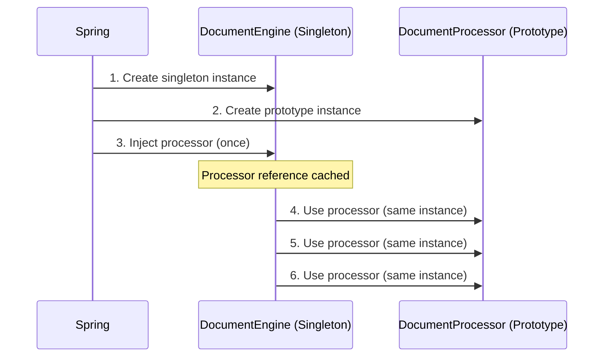

**Solutions:**

**Option 1: ApplicationContext Lookup**
```java
@Component
public class DocumentEngine {
    @Autowired
    private ApplicationContext context;
    
    public void process() {
        DocumentProcessor processor = context.getBean(DocumentProcessor.class);
        processor.process();  // New instance every time
    }
}
```

**Option 2: ObjectFactory**
```java
@Component
public class DocumentEngine {
    @Autowired
    private ObjectFactory<DocumentProcessor> processorFactory;
    
    public void process() {
        DocumentProcessor processor = processorFactory.getObject();
        processor.process();  // New instance every time
    }
}
```

**Option 3: @Lookup (Method Injection)**
```java
@Component
public abstract class DocumentEngine {
    
    @Lookup
    protected abstract DocumentProcessor getProcessor();
    
    public void process() {
        DocumentProcessor processor = getProcessor();
        processor.process();  // New instance every time
    }
}
```

---

### Q2: Explain the order of bean initialization when using @PostConstruct

**Answer:**

**Complete Lifecycle:**

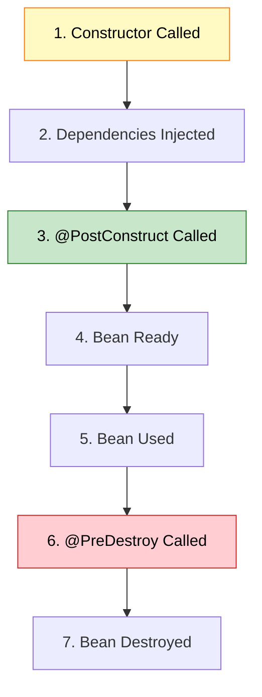

**Example:**
```java
@Component
public class AuditService {
    @Autowired
    private StorageService storageService;
    
    public AuditService() {
        System.out.println("1. Constructor called");
        // storageService is NULL here!
    }
    
    @PostConstruct
    public void init() {
        System.out.println("2. @PostConstruct called");
        // storageService is AVAILABLE here!
        storageService.initialize();
    }
    
    @PreDestroy
    public void cleanup() {
        System.out.println("3. @PreDestroy called");
        storageService.cleanup();
    }
}
```

**Output:**
```
1. Constructor called
2. @PostConstruct called
3. @PreDestroy called
```

**Key Points:**
- Constructor runs BEFORE dependency injection
- @PostConstruct runs AFTER all dependencies injected
- @PreDestroy runs BEFORE bean destruction
- Use @PostConstruct for initialization logic that needs dependencies

---

### Q3: What's the difference between @Autowired and @Inject?

**Answer:**

**Comparison:**

| Feature | @Autowired (Spring) | @Inject (JSR-330) |
|:--------|:-------------------|:-----------------|
| **Standard** | Spring-specific | Java standard |
| **Required** | @Autowired(required=false) | No equivalent |
| **Qualifier** | @Qualifier | @Named |
| **Provider** | No | Provider<T> |
| **Portability** | Spring only | Any DI framework |

**Example:**

**Spring @Autowired:**
```java
@Component
public class OrderService {
    @Autowired
    @Qualifier("creditCardPayment")
    private PaymentService paymentService;
    
    @Autowired(required = false)
    private Optional<EmailService> emailService;
}
```

**JSR-330 @Inject:**
```java
@Component
public class OrderService {
    @Inject
    @Named("creditCardPayment")
    private PaymentService paymentService;
    
    @Inject
    private Provider<EmailService> emailProvider;
}
```

**When to use:**
- **@Autowired:** Most common (Spring projects)
- **@Inject:** Need portability across DI frameworks

**Both do the same thing, but @Inject is a Java standard.**

---

### Q4: How does Spring resolve circular dependencies?

**Answer:**

**Scenario:**
```java
@Component
public class ServiceA {
    @Autowired
    private ServiceB serviceB;
}

@Component
public class ServiceB {
    @Autowired
    private ServiceA serviceA;  // Circular!
}
```

**Spring's Resolution Process:**

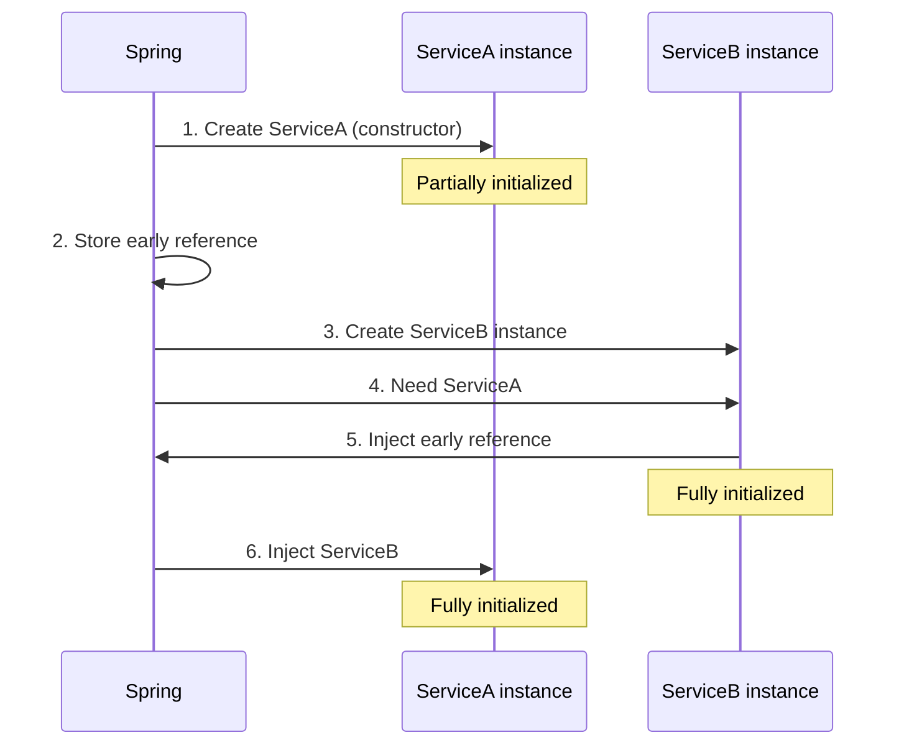

**Step-by-Step:**
```
1. Spring creates ServiceA instance (constructor called)
2. ServiceA tries to inject ServiceB
3. Spring creates ServiceB instance
4. ServiceB needs ServiceA
5. Spring injects early reference of ServiceA (not fully initialized)
6. ServiceB fully initialized
7. Spring injects ServiceB into ServiceA
8. ServiceA fully initialized
9. Both beans ready
```

**Why Constructor Injection Fails:**
```java
@Component
public class ServiceA {
    private final ServiceB serviceB;
    
    @Autowired
    public ServiceA(ServiceB serviceB) {  // Circular dependency error!
        this.serviceB = serviceB;
    }
}
```

**Solution:**
```java
// Option 1: Use @Lazy
@Component
public class ServiceA {
    private final ServiceB serviceB;
    
    @Autowired
    public ServiceA(@Lazy ServiceB serviceB) {
        this.serviceB = serviceB;  // Proxy injected
    }
}

// Option 2: Redesign (best)
// Extract common logic to ServiceC
```

---

### Q5: Explain bean naming conventions in Spring

**Answer:**

**Default Naming:**
```
Spring uses class name as bean name (camelCase)
```

**Examples:**

```java
@Component
public class UserService { }
// Bean name: "userService"

@Component
public class XMLParser { }
// Bean name: "XMLParser" (preserves capitals)

@Component("myService")
public class UserService { }
// Bean name: "myService"

@Component
@Qualifier("customName")
public class UserService { }
// Bean name: "userService"
// Qualifier: "customName"
```

**Accessing Beans:**

```java
// By type
UserService service = context.getBean(UserService.class);

// By name
UserService service = (UserService) context.getBean("userService");

// By name and type
UserService service = context.getBean("userService", UserService.class);

// Get all beans of type
Map<String, DocumentProcessor> processors = 
    context.getBeansOfType(DocumentProcessor.class);
// Returns: {"pdfDocumentProcessor": PdfDocumentProcessor, 
//           "wordDocumentProcessor": WordDocumentProcessor}
```

**Multiple Beans:**
```java
@Component("pdfProcessor")
public class PdfDocumentProcessor implements DocumentProcessor { }

@Component("wordProcessor")
public class WordDocumentProcessor implements DocumentProcessor { }

// Get specific bean
DocumentProcessor pdf = context.getBean("pdfProcessor", DocumentProcessor.class);
DocumentProcessor word = context.getBean("wordProcessor", DocumentProcessor.class);
```

---

### Q6: What happens if @PostConstruct method throws an exception?

**Answer:**

**Scenario:**
```java
@Component
public class AuditService {
    @PostConstruct
    public void init() {
        throw new RuntimeException("Initialization failed!");
    }
}
```

**Result:**
- Bean creation FAILS
- Application context fails to start
- Spring throws BeanCreationException
- Application DOES NOT START

**Example Output:**
```
Error creating bean with name 'auditService': 
Invocation of init method failed; 
nested exception is java.lang.RuntimeException: Initialization failed!
```

**Best Practice:**
```java
@Component
public class AuditService {
    @PostConstruct
    public void init() {
        try {
            // Risky initialization
            connectToDatabase();
        } catch (Exception e) {
            // Log error but don't fail application
            logger.error("Failed to initialize audit service", e);
            // Or rethrow if critical
            throw new BeanCreationException("Critical initialization failed", e);
        }
    }
}
```

**Lifecycle Impact:**

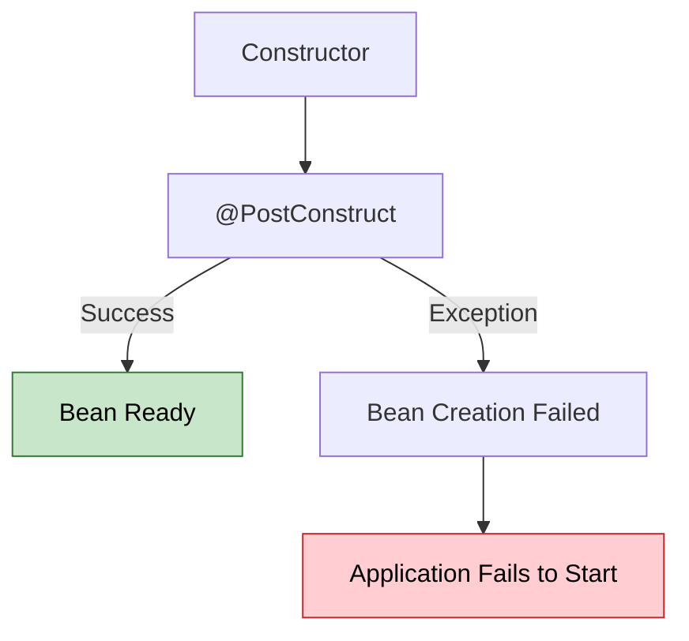

---

### Q7: Why use Constructor Injection over Field Injection?

**Answer:**

**Field Injection (Not Recommended):**
```java
@Component
public class DocumentEngine {
    @Autowired
    private DocumentProcessor processor;  // Hard to test
    @Autowired
    private StorageService storage;
}
```

**Constructor Injection (Recommended):**
```java
@Component
public class DocumentEngine {
    private final DocumentProcessor processor;
    private final StorageService storage;
    
    @Autowired
    public DocumentEngine(DocumentProcessor processor, StorageService storage) {
        this.processor = processor;
        this.storage = storage;
    }
}
```

**Advantages:**

| Aspect | Field Injection | Constructor Injection |
|:-------|:---------------|:---------------------|
| **Immutability** | No (mutable) | Yes (final fields) |
| **Testing** | Hard (need Spring) | Easy (plain Java) |
| **Null Safety** | Can be null | Never null |
| **Circular Dependency** | Hidden | Detected early |
| **Required Dependencies** | Unclear | Explicit |

**Testing Comparison:**

**Field Injection (Hard):**
```java
@Test
public void testDocumentEngine() {
    DocumentEngine engine = new DocumentEngine();
    // processor is NULL! Need reflection or Spring context
}
```

**Constructor Injection (Easy):**
```java
@Test
public void testDocumentEngine() {
    DocumentProcessor mockProcessor = mock(DocumentProcessor.class);
    StorageService mockStorage = mock(StorageService.class);
    
    DocumentEngine engine = new DocumentEngine(mockProcessor, mockStorage);
    // Easy to test without Spring!
}
```

**Circular Dependency Detection:**
```java
// Field injection: Fails at runtime
@Component
public class ServiceA {
    @Autowired
    private ServiceB serviceB;  // Runtime error
}

// Constructor injection: Fails at startup
@Component
public class ServiceA {
    @Autowired
    public ServiceA(ServiceB serviceB) {  // Immediate error
        this.serviceB = serviceB;
    }
}
```

---

### Q8: Explain @Primary vs @Qualifier with multiple beans

**Answer:**

**Scenario:**
```java
@Component
public class PdfDocumentProcessor implements DocumentProcessor { }

@Component
public class WordDocumentProcessor implements DocumentProcessor { }

@Component
public class XmlDocumentProcessor implements DocumentProcessor { }
```

**Problem:**
```java
@Component
public class DocumentEngine {
    @Autowired
    private DocumentProcessor processor;  // Error: 3 beans found!
}
```

**Solution 1: @Primary (Default Choice)**
```java
@Component
@Primary  // This will be injected by default
public class PdfDocumentProcessor implements DocumentProcessor { }

@Component
public class DocumentEngine {
    @Autowired
    private DocumentProcessor processor;  // PdfDocumentProcessor injected
}
```

**Solution 2: @Qualifier (Specific Choice)**
```java
@Component
public class DocumentEngine {
    @Autowired
    @Qualifier("xmlDocumentProcessor")  // Specific bean
    private DocumentProcessor processor;
}
```

**Combination:**
```java
@Component
@Primary
public class PdfDocumentProcessor implements DocumentProcessor { }

@Component
public class Engine1 {
    @Autowired
    private DocumentProcessor processor;  // PdfDocumentProcessor (@Primary)
}

@Component
public class Engine2 {
    @Autowired
    @Qualifier("wordDocumentProcessor")
    private DocumentProcessor processor;  // WordDocumentProcessor (@Qualifier wins)
}
```

**Priority:**
```
@Qualifier > @Primary > Bean Name
```

**Decision Tree:**

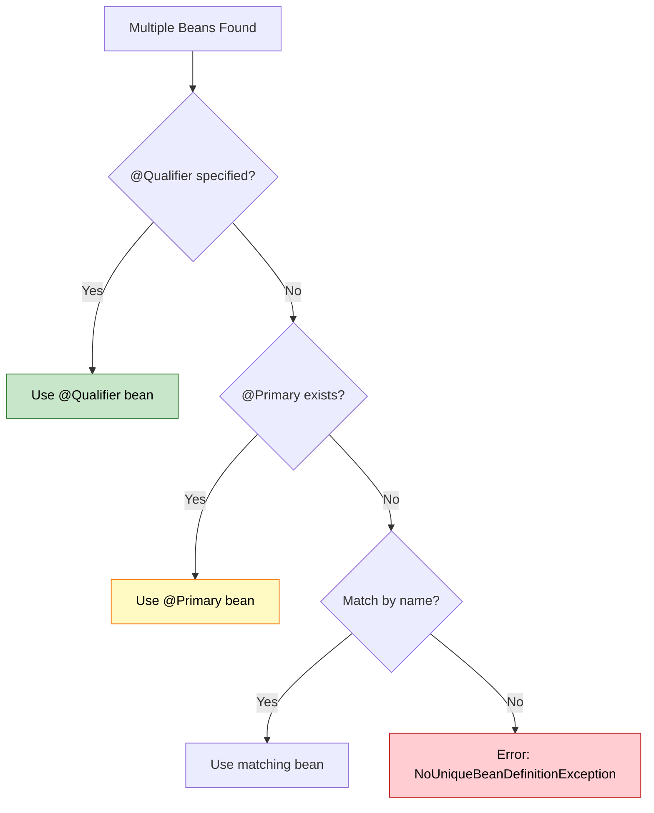

---

<div align="center">

<table>
<tr>
<td align="center">

## 🎓 End of Document Processing Engine Guide

<br>


<br>

**Created with dedication by Avinash Dhanuka**

<br>

[](https://github.com/Avinash-706)
[](mailto:avunashdhanuka@gmail.com)

<br>

---

**Happy Learning! 🚀**

*"Master Dependency Injection, Build Scalable Systems!"* - Avinash Dhanuka

<br>


---

**© 2026 Avinash Dhanuka | All Rights Reserved**

</td>
</tr>
</table>
</div>
