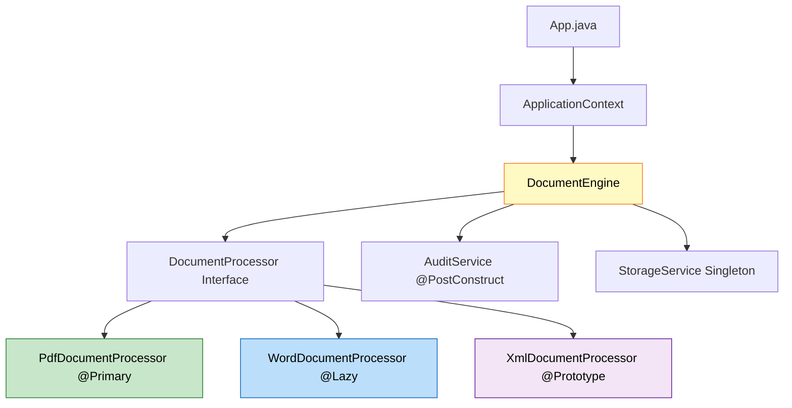
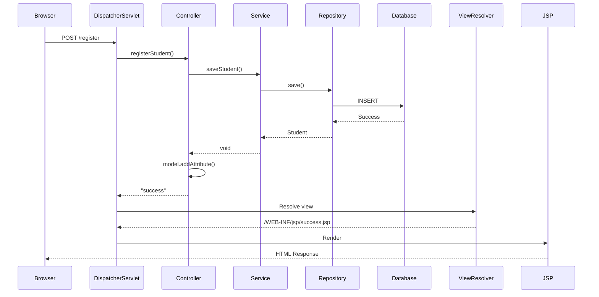
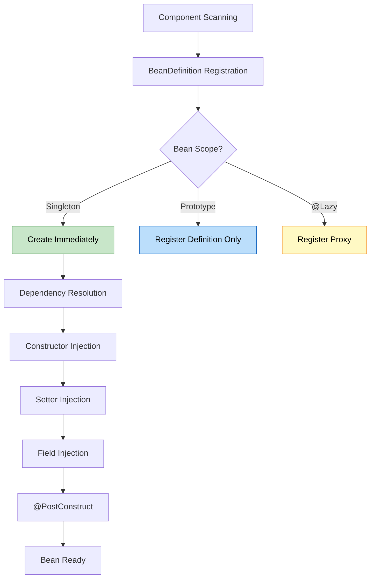

# ☕ Spring Framework Day 11: Complete Learning Journey

<div align="center">


</div>

<hr style="border: 1px solid rgb(98, 117, 187)">

<div align="center">
<table>
<tr>
<td align="center">
<br />

<h3>© 2026 Avinash Dhanuka</h3>
<p>Spring MVC & Advanced Dependency Injection Mastery</p>
<p><em>From Core Concepts to Production-Ready Applications</em></p>

<a href="https://github.com/Avinash-706" target="_blank">

</a>
<br />
<a href="https://mail.google.com/mail/?view=cm&fs=1&to=avunashdhanuka@gmail.com&su=Spring%20Day11%20Query&body=☕%20Hello%20Avinash,%0D%0A%0D%0AMy%20name%20is%20[Your%20Name]%20and%20I%20have%20a%20doubt%20regarding%20Spring%20Framework.%0D%0A%0D%0A🔹%20Topic:%20[MVC/DI/JPA]%0D%0A%0D%0AThank%20you!" target="_blank">

</a>
<br />
<br />
</td>
</tr>
</table>
</div>

> **Learning Path:** This repository contains two comprehensive projects demonstrating Spring Framework's evolution - from core dependency injection patterns to full-stack Spring MVC web applications with JPA integration.

---

## 📑 Table of Contents

1. [Overview](#overview)
2. [Projects Summary](#projects-summary)
3. [Learning Evolution](#learning-evolution)
4. [Project 1: Document Processing Engine](#project-1-document-processing-engine)
5. [Project 2: Spring MVC Application](#project-2-spring-mvc-application)
6. [Key Concepts Mastered](#key-concepts-mastered)
7. [Architecture Comparison](#architecture-comparison)
8. [Internal Working Deep Dive](#internal-working-deep-dive)
9. [Real-World Production Patterns](#real-world-production-patterns)
10. [Common Pitfalls & Solutions](#common-pitfalls--solutions)
11. [Interview Questions](#top-interview-questions)
12. [Running the Projects](#running-the-projects)

---

## OVERVIEW

<div align="center">

</div>


This repository represents Day 11 of Spring Framework learning, covering the complete journey from advanced dependency injection patterns to building production-ready Spring MVC web applications. It bridges the gap between Spring Core concepts and real-world web development.

### 🎯 Learning Objectives

- ✅ Master all three types of Dependency Injection (Constructor, Setter, Field)
- ✅ Understand Bean Scopes (Singleton vs Prototype) and their use cases
- ✅ Learn @Primary and @Qualifier for bean disambiguation
- ✅ Implement @Lazy initialization for performance optimization
- ✅ Master Bean Lifecycle with @PostConstruct and @PreDestroy
- ✅ Build complete Spring MVC architecture with layered design
- ✅ Integrate JPA/Hibernate for database persistence
- ✅ Understand DispatcherServlet and request-response flow
- ✅ Implement Model-View-Controller pattern with JSP
- ✅ Apply production-ready patterns and best practices

### 📊 Repository Structure

```
day11/
├── CaseStudy/
│   └── DocumentProcessingEngine/          # Project 1: Core DI Patterns
│       ├── src/
│       │   └── main/
│       │       └── java/
│       │           └── org/example/
│       │               ├── config/
│       │               │   └── AppConfig.java
│       │               ├── entity/
│       │               │   ├── DocumentProcessor.java      # Interface
│       │               │   ├── PdfDocumentProcessor.java   # @Primary
│       │               │   ├── WordDocumentProcessor.java  # @Lazy
│       │               │   ├── XmlDocumentProcessor.java   # @Prototype
│       │               │   ├── DocumentEngine.java         # 3 DI Types
│       │               │   ├── AuditService.java           # Lifecycle
│       │               │   └── StorageService.java         # Singleton
│       │               └── App.java
│       ├── pom.xml
│       └── README.md
│
├── SpringMvc/                              # Project 2: Full MVC Application
│   ├── src/
│   │   ├── main/
│   │   │   ├── java/
│   │   │   │   └── com/example/SpringMvc/
│   │   │   │       ├── Controller/
│   │   │   │       │   └── StudentController.java
│   │   │   │       ├── Service/
│   │   │   │       │   └── StudentService.java
│   │   │   │       ├── Repository/
│   │   │   │       │   └── StudentDao.java
│   │   │   │       ├── Model/
│   │   │   │       │   └── Student.java
│   │   │   │       └── SpringMvcApplication.java
│   │   │   ├── resources/
│   │   │   │   └── application.properties
│   │   │   └── webapp/
│   │   │       └── WEB-INF/
│   │   │           └── jsp/
│   │   │               ├── register.jsp
│   │   │               └── success.jsp
│   │   └── test/
│   ├── pom.xml
│   └── README.md
│
├── favicon.png
├── info.txt
├── REFERENCE.md
└── README.md                               # This file
```

---

## PROJECTS SUMMARY

<div align="center">

</div>

> **📝 Organized Learning by:** Avinash Dhanuka | © 2026

### 📦 Project Overview Table

| Project | Type | Key Concepts | Complexity | Status |
|:--------|:-----|:-------------|:-----------|:-------|
| **DocumentProcessingEngine** | Core Spring | DI Patterns, Scopes, Lifecycle | ⭐⭐⭐ Intermediate | ✅ Complete |
| **SpringMvc** | Spring Boot Web | MVC, JPA, REST, Layered Architecture | ⭐⭐⭐⭐ Advanced | ✅ Complete |


### 🎯 Technology Stack Comparison

| Technology | DocumentProcessingEngine | SpringMvc |
|:-----------|:------------------------|:----------|
| **Framework** | Spring Core 7.0.3 | Spring Boot 3.5.11 |
| **Java Version** | 21 | 21 |
| **Build Tool** | Maven | Maven |
| **Packaging** | JAR | WAR |
| **Web Server** | None | Embedded Tomcat |
| **View Technology** | None | JSP + JSTL |
| **Database** | None | MySQL + JPA/Hibernate |
| **Configuration** | Java-based (@Configuration) | application.properties |
| **Dependency Injection** | All 3 types demonstrated | Constructor (recommended) |
| **Focus** | Core Spring concepts | Full-stack web application |

---

## LEARNING EVOLUTION

<div align="center">

</div>

### 📈 From Core Spring to Spring MVC

```mermaid
graph LR
    A[Day 09: XML Config] -->|Annotations| B[Day 09: @Component]
    B -->|Advanced DI| C[Day 11: DI Patterns]
    C -->|Web Layer| D[Day 11: Spring MVC]
    D -->|Persistence| E[Day 11: JPA Integration]
    
    style A fill:#ffccbc,stroke:#d84315,color:#000
    style B fill:#fff9c4,stroke:#f57f17,color:#000
    style C fill:#c8e6c9,stroke:#2e7d32,color:#000
    style D fill:#bbdefb,stroke:#1565c0,color:#000
    style E fill:#a5d6a7,stroke:#2e7d32,color:#000
```



### 🔄 Conceptual Progression

**Phase 1: Core Spring (DocumentProcessingEngine)**
- Dependency Injection mastery
- Bean lifecycle management
- Scope understanding
- Annotation-based configuration

**Phase 2: Web Development (SpringMvc)**
- MVC architecture implementation
- Request-response handling
- Database integration
- Production-ready patterns

---

## PROJECT 1: DOCUMENT PROCESSING ENGINE

<div align="center">

</div>

> **📝 Core Spring Patterns by:** Avinash Dhanuka | © 2026

### 📌 Overview

Enterprise-grade document processing system demonstrating all Spring Core concepts through practical implementation. Handles PDF, Word, and XML documents with audit logging and storage management.

**📂 Location:** [`CaseStudy/DocumentProcessingEngine/`](CaseStudy/DocumentProcessingEngine/)

**📖 Full Documentation:** [DocumentProcessingEngine/README.md](CaseStudy/DocumentProcessingEngine/README.md)

### 🎯 Key Features Demonstrated

**1. Three Types of Dependency Injection**
```java
@Component
public class DocumentEngine {
    // Constructor Injection (Recommended)
    private final DocumentProcessor processor;
    
    @Autowired
    public DocumentEngine(@Qualifier("xmlDocumentProcessor") DocumentProcessor processor) {
        this.processor = processor;
    }
    
    // Setter Injection (Optional dependencies)
    @Autowired
    public void setAuditService(AuditService auditService) {
        this.auditService = auditService;
    }
    
    // Field Injection (Not recommended)
    @Autowired
    private StorageService storageService;
}
```

**2. Bean Scopes**
- Singleton (default): StorageService, AuditService
- Prototype: XmlDocumentProcessor (new instance per request)

**3. Bean Disambiguation**
- @Primary: PdfDocumentProcessor (default choice)
- @Qualifier: Explicit bean selection

**4. Lazy Initialization**
- @Lazy: WordDocumentProcessor (created on first access)

**5. Lifecycle Management**
- @PostConstruct: AuditService initialization
- @PreDestroy: Resource cleanup


### 📊 Component Architecture



### 🔍 Execution Flow

```
1. Container starts → Eager beans created (Pdf, Audit, Storage)
2. DocumentEngine created → Constructor injection (XML processor)
3. Setter injection → AuditService injected
4. Field injection → StorageService injected
5. @PostConstruct → AuditService.init() called
6. Application ready → Process documents
7. @Lazy bean → WordProcessor created on first access
8. Container shutdown → @PreDestroy called
```

### 🎓 Key Takeaways

- Constructor injection provides immutability and testability
- @Primary reduces @Qualifier usage for common scenarios
- Prototype scope creates new instances per request
- @Lazy improves startup performance for rarely-used beans
- Lifecycle callbacks enable proper resource management

---

## PROJECT 2: SPRING MVC APPLICATION

> **📝 Full-Stack Web Application by:** Avinash Dhanuka | © 2026

### 📌 Overview

Production-ready Spring MVC application with complete CRUD operations, JPA integration, and layered architecture. Demonstrates industry-standard patterns for building scalable web applications.

**📂 Location:** [`SpringMvc/`](SpringMvc/)

**📖 Full Documentation:** [SpringMvc/README.md](SpringMvc/README.md)

### 🎯 Architecture Layers

**1. Presentation Layer (Controller)**
```java
@Controller
public class StudentController {
    @GetMapping("/register")
    public String showForm() {
        return "register";  // Returns JSP view
    }
    
    @PostMapping("/register")
    public String registerStudent(@ModelAttribute Student student, Model model) {
        studentService.saveStudent(student);
        model.addAttribute("name", student.getName());
        return "success";
    }
}
```

**2. Business Layer (Service)**
```java
@Service
public class StudentService {
    @Autowired
    private StudentDao studentDao;
    
    public void saveStudent(Student student) {
        studentDao.save(student);  // Delegates to repository
    }
}
```

**3. Data Access Layer (Repository)**
```java
@Repository
public interface StudentDao extends JpaRepository<Student, Long> {
    // Spring Data JPA provides implementation automatically
}
```

**4. Model Layer (Entity)**
```java
@Entity
@Table(name = "StudentTable")
public class Student {
    @Id
    @GeneratedValue(strategy = GenerationType.IDENTITY)
    private Long id;
    
    private String name;
    
    @Email(message = "Invalid !!")
    private String email;
}
```

### 📊 Complete Request-Response Flow




### 🔧 Configuration Breakdown

**application.properties:**
```properties
# Server Configuration
server.port=8081

# View Resolver
spring.mvc.view.prefix=/WEB-INF/jsp/
spring.mvc.view.suffix=.jsp

# Database Configuration
spring.datasource.url=jdbc:mysql://localhost:3306/springmvc
spring.datasource.username=root
spring.datasource.password=yourpassword

# JPA/Hibernate Configuration
spring.jpa.hibernate.ddl-auto=update
spring.jpa.show-sql=true
spring.jpa.properties.hibernate.format_sql=true
```

### 🎓 Key Takeaways

- DispatcherServlet acts as front controller for all requests
- @ModelAttribute automatically binds form data to objects
- JpaRepository provides 20+ methods without implementation
- View resolver maps logical names to physical JSP files
- Layered architecture ensures separation of concerns
- Spring Boot auto-configures DataSource and EntityManager

---

## KEY CONCEPTS MASTERED

<div align="center">

</div>

> **📝 Complete Learning Journey by:** Avinash Dhanuka | © 2026

### 🧠 Core Spring Concepts

#### 1. Dependency Injection Types

| Type | Use Case | Advantages | Disadvantages |
|:-----|:---------|:-----------|:-------------|
| **Constructor** | Required dependencies | Immutable, testable | Verbose for many deps |
| **Setter** | Optional dependencies | Flexible | Mutable, can be null |
| **Field** | Rapid prototyping | Concise | Hard to test, not recommended |

#### 2. Bean Scopes

| Scope | Instances | Creation Time | Use Case |
|:------|:----------|:-------------|:---------|
| **Singleton** | 1 per container | Startup | Stateless services |
| **Prototype** | New per request | On demand | Stateful objects |
| **Request** | 1 per HTTP request | Per request | Web - Form data |
| **Session** | 1 per HTTP session | Per session | Web - User data |

#### 3. Bean Lifecycle

```
Instantiation → Dependency Injection → @PostConstruct → 
Bean Ready → Bean Used → @PreDestroy → Destruction
```

#### 4. Spring MVC Components

| Component | Role | Example |
|:----------|:-----|:--------|
| **DispatcherServlet** | Front controller | Routes all requests |
| **HandlerMapping** | URL mapping | @GetMapping, @PostMapping |
| **Controller** | Request handler | StudentController |
| **Service** | Business logic | StudentService |
| **Repository** | Data access | StudentDao |
| **ViewResolver** | View resolution | JSP resolver |
| **Model** | Data carrier | Model interface |

#### 5. JPA Hierarchy

```
Repository (marker)
    ↓
CrudRepository (basic CRUD)
    ↓
PagingAndSortingRepository (pagination)
    ↓
JpaRepository (JPA-specific + all above)
```

### 💡 Real-World Applications

**E-Commerce Platform:**
- @Primary for default payment gateway (Stripe)
- @Qualifier for alternative gateways (PayPal, Razorpay)
- Prototype scope for shopping carts
- Singleton for product catalog service

**Banking System:**
- Constructor injection for transaction service (immutable)
- @Lazy for report generation (expensive operation)
- @PostConstruct for connection pool initialization
- @PreDestroy for graceful shutdown

**Content Management System:**
- Spring MVC for web interface
- JPA for content persistence
- @Transactional for atomic operations
- Layered architecture for maintainability

---

## ARCHITECTURE COMPARISON

<div align="center">

</div>

### 📊 Core Spring vs Spring MVC

| Aspect | DocumentProcessingEngine | SpringMvc |
|:-------|:------------------------|:----------|
| **Purpose** | Demonstrate DI patterns | Build web applications |
| **Entry Point** | main() method | DispatcherServlet |
| **Configuration** | @Configuration class | application.properties |
| **Dependencies** | Spring Core only | Spring Boot + Web + JPA |
| **Output** | Console | HTML/JSON |
| **State Management** | Bean scopes | HTTP session |
| **Persistence** | None | MySQL + Hibernate |
| **Testing** | Unit tests | Integration tests |


### 🔄 When to Use What

**Use Core Spring (like DocumentProcessingEngine) when:**
- Building standalone applications
- Batch processing systems
- Background services
- Learning Spring fundamentals
- No web interface needed

**Use Spring MVC (like SpringMvc) when:**
- Building web applications
- REST APIs
- User-facing interfaces
- CRUD operations with database
- Need request-response handling

---

## INTERNAL WORKING DEEP DIVE

<div align="center">

</div>

### 🎯 Spring Container Initialization

**DocumentProcessingEngine Startup:**
```
1. AnnotationConfigApplicationContext created
2. @ComponentScan processes org.example package
3. BeanDefinitions registered for all @Component classes
4. Singleton beans instantiated (Pdf, Audit, Storage)
5. @PostConstruct methods called (AuditService.init())
6. Prototype bean definitions registered (XML processor)
7. @Lazy bean definitions registered (Word processor)
8. Container ready for getBean() calls
```

**SpringMvc Startup:**
```
1. SpringApplication.run() called
2. Spring Boot auto-configuration kicks in
3. DataSource configured from application.properties
4. EntityManagerFactory created with Hibernate
5. JpaRepository proxies generated
6. DispatcherServlet registered
7. ViewResolver configured
8. Embedded Tomcat started on port 8081
9. Application ready to handle HTTP requests
```

### 🔍 Bean Creation Process



### 🎯 DispatcherServlet Internal Flow

**Request Processing Steps:**
```
1. HTTP Request arrives at Tomcat
2. DispatcherServlet.doGet()/doPost() called
3. HandlerMapping finds matching @GetMapping/@PostMapping
4. HandlerAdapter invokes controller method
5. @ModelAttribute binds request parameters to object
6. Controller executes business logic
7. Returns view name (String) or ModelAndView
8. ViewResolver resolves logical name to physical path
9. View (JSP) renders with model data
10. HTML response sent to browser
```

### 🔍 JPA Save Operation Internals

**When studentDao.save(student) is called:**
```
1. Spring Data JPA proxy intercepts call
2. SimpleJpaRepository.save() executed
3. EntityManager.persist() or merge() called
4. Hibernate Session manages entity
5. Dirty checking determines if INSERT or UPDATE
6. SQL generated based on @Entity mapping
7. PreparedStatement created with parameters
8. MySQL JDBC driver executes query
9. Generated ID returned and set on entity
10. Transaction committed (if @Transactional)
```

### 🎯 @ModelAttribute Binding Mechanism

**Form Submission Process:**
```
Browser sends: name=John&email=john@test.com
    ↓
DispatcherServlet receives POST request
    ↓
DataBinder created for Student class
    ↓
new Student() instantiated
    ↓
For each parameter:
  - Find matching setter (setName, setEmail)
  - Convert String to target type
  - Invoke setter via reflection
    ↓
Populated Student object passed to controller
```

---

## REAL-WORLD PRODUCTION PATTERNS

<div align="center">

</div>

### 🎯 Pattern 1: Strategy Pattern with DI

```java
// Payment processing with multiple strategies
@Service
public class PaymentService {
    private final Map<String, PaymentStrategy> strategies;
    
    @Autowired
    public PaymentService(List<PaymentStrategy> strategyList) {
        this.strategies = strategyList.stream()
            .collect(Collectors.toMap(
                s -> s.getClass().getSimpleName(),
                s -> s
            ));
    }
    
    public void processPayment(String method, double amount) {
        strategies.get(method + "Payment").process(amount);
    }
}
```


### 🎯 Pattern 2: Exception Handling

```java
@ControllerAdvice
public class GlobalExceptionHandler {
    
    @ExceptionHandler(DataIntegrityViolationException.class)
    public String handleDuplicateEmail(Model model) {
        model.addAttribute("error", "Email already exists");
        return "register";
    }
    
    @ExceptionHandler(Exception.class)
    public String handleGenericException(Exception ex, Model model) {
        log.error("Unexpected error", ex);
        model.addAttribute("error", "An error occurred");
        return "error";
    }
}
```

### 🎯 Pattern 3: Validation

```java
@Entity
public class Student {
    @NotBlank(message = "Name is required")
    @Size(min = 2, max = 50)
    private String name;
    
    @Email(message = "Invalid email format")
    @Column(unique = true)
    private String email;
}

@Controller
public class StudentController {
    @PostMapping("/register")
    public String register(@Valid @ModelAttribute Student student, 
                          BindingResult result, Model model) {
        if (result.hasErrors()) {
            return "register";  // Return to form with errors
        }
        studentService.saveStudent(student);
        return "success";
    }
}
```

### 🎯 Pattern 4: RESTful API

```java
@RestController
@RequestMapping("/api/students")
public class StudentRestController {
    
    @PostMapping
    public ResponseEntity<Student> create(@Valid @RequestBody Student student) {
        Student saved = studentService.saveStudent(student);
        return ResponseEntity.status(HttpStatus.CREATED).body(saved);
    }
    
    @GetMapping
    public ResponseEntity<Page<Student>> getAll(
            @RequestParam(defaultValue = "0") int page,
            @RequestParam(defaultValue = "10") int size) {
        Pageable pageable = PageRequest.of(page, size);
        return ResponseEntity.ok(studentService.getAll(pageable));
    }
}
```

---

## COMMON PITFALLS & SOLUTIONS

<div align="center">

</div>

### ❌ Pitfall 1: Field Injection with Final Fields

**Problem:**
```java
@Autowired
private final DocumentProcessor processor;  // Compilation error!
```

**Solution:**
```java
private final DocumentProcessor processor;

@Autowired
public DocumentEngine(DocumentProcessor processor) {
    this.processor = processor;  // Constructor injection
}
```

---

### ❌ Pitfall 2: Missing No-Arg Constructor in @Entity

**Problem:**
```java
@Entity
public class Student {
    public Student(String name) { }  // Only parameterized constructor
}
// Error: No default constructor for entity
```

**Solution:**
```java
@Entity
public class Student {
    public Student() { }  // Required by JPA
    public Student(String name) { this.name = name; }
}
```

---

### ❌ Pitfall 3: Prototype Bean in Singleton

**Problem:**
```java
@Component
public class DocumentEngine {  // Singleton
    @Autowired
    private DocumentProcessor processor;  // Prototype injected once!
}
```

**Solution:**
```java
@Component
public class DocumentEngine {
    @Autowired
    private ApplicationContext context;
    
    public void process() {
        DocumentProcessor processor = context.getBean(DocumentProcessor.class);
        processor.process();  // New instance every time
    }
}
```

---

### ❌ Pitfall 4: Circular Dependency

**Problem:**
```java
@Component
public class ServiceA {
    @Autowired
    private ServiceB serviceB;  // Circular!
}

@Component
public class ServiceB {
    @Autowired
    private ServiceA serviceA;  // Circular!
}
```

**Solution:**
```java
@Component
public class ServiceA {
    @Autowired
    @Lazy  // Break circular dependency
    private ServiceB serviceB;
}
```

---

### ❌ Pitfall 5: Wrong JSP Location

**Problem:**
```
src/main/resources/templates/register.jsp  ❌
```

**Solution:**
```
src/main/webapp/WEB-INF/jsp/register.jsp  ✅
```

---

### ❌ Pitfall 6: Missing JSP Dependencies

**Problem:** JSP not rendering (404 error)

**Solution:** Add to pom.xml:
```xml
<dependency>
    <groupId>org.apache.tomcat.embed</groupId>
    <artifactId>tomcat-embed-jasper</artifactId>
</dependency>
```

---

## TOP INTERVIEW QUESTIONS

<div align="center">

</div>


### Q1: Explain the complete flow when a user submits a form in Spring MVC

**Answer:**

**Step-by-Step Flow:**
```
1. Browser sends POST /register with form data
2. Tomcat receives HTTP request
3. DispatcherServlet.doPost() called
4. HandlerMapping finds @PostMapping("/register")
5. DataBinder creates Student object
6. @ModelAttribute binds form parameters to Student
7. Controller method registerStudent() invoked
8. StudentService.saveStudent() called
9. StudentDao.save() delegates to JPA
10. Hibernate generates INSERT SQL
11. MySQL executes query
12. Controller adds attributes to Model
13. Returns "success" view name
14. ViewResolver: /WEB-INF/jsp/ + "success" + .jsp
15. JSP engine processes success.jsp with ${name}
16. HTML response sent to browser
```

**Key Points:**
- @ModelAttribute automatically binds form data
- Model carries data from controller to view
- ViewResolver maps logical names to physical files
- JSP Expression Language (${name}) accesses model attributes

---

### Q2: What happens if you inject a Prototype bean into a Singleton bean?

**Answer:**

**Problem:** The prototype bean is injected ONLY ONCE when the singleton is created. You get the same instance every time, defeating the purpose of prototype scope.

**Why?**
```
Container starts → Singleton created → Prototype injected once
All subsequent calls use the same cached prototype instance
```

**Solutions:**

**Option 1: ApplicationContext Lookup**
```java
@Autowired
private ApplicationContext context;

public void process() {
    DocumentProcessor processor = context.getBean(DocumentProcessor.class);
    processor.process();  // New instance every time
}
```

**Option 2: @Lookup Method Injection**
```java
@Component
public abstract class DocumentEngine {
    @Lookup
    protected abstract DocumentProcessor getProcessor();
    
    public void process() {
        getProcessor().process();  // New instance every time
    }
}
```

---

### Q3: Why use Constructor Injection over Field Injection?

**Answer:**

| Aspect | Field Injection | Constructor Injection |
|:-------|:---------------|:---------------------|
| **Immutability** | No (mutable) | Yes (final fields) |
| **Testing** | Hard (need Spring) | Easy (plain Java) |
| **Null Safety** | Can be null | Never null |
| **Circular Dependency** | Hidden | Detected early |
| **Required Dependencies** | Unclear | Explicit |

**Testing Example:**

**Field Injection (Hard):**
```java
@Test
public void test() {
    DocumentEngine engine = new DocumentEngine();
    // processor is NULL! Need reflection or Spring context
}
```

**Constructor Injection (Easy):**
```java
@Test
public void test() {
    DocumentProcessor mock = mock(DocumentProcessor.class);
    DocumentEngine engine = new DocumentEngine(mock);
    // Easy to test without Spring!
}
```

---

### Q4: How does Spring resolve view names to JSP files?

**Answer:**

**Configuration:**
```properties
spring.mvc.view.prefix=/WEB-INF/jsp/
spring.mvc.view.suffix=.jsp
```

**Resolution Process:**
```
Controller returns: "register"
    ↓
InternalResourceViewResolver applies:
prefix + viewName + suffix
    ↓
Result: /WEB-INF/jsp/register.jsp
    ↓
RequestDispatcher forwards to JSP
    ↓
JSP engine processes and generates HTML
```

**Why WEB-INF?**
- Files in WEB-INF are NOT directly accessible from browser
- Must go through controller → view resolver
- Prevents users from accessing raw JSP files
- Forces proper MVC flow

---

### Q5: Explain @Primary vs @Qualifier with multiple beans

**Answer:**

**Scenario:**
```java
@Component
public class PdfDocumentProcessor implements DocumentProcessor { }

@Component
public class WordDocumentProcessor implements DocumentProcessor { }

@Component
public class XmlDocumentProcessor implements DocumentProcessor { }
```

**Without annotation:**
```java
@Autowired
private DocumentProcessor processor;  // Error: 3 beans found!
```

**Solution 1: @Primary (Default Choice)**
```java
@Component
@Primary  // This will be injected by default
public class PdfDocumentProcessor implements DocumentProcessor { }

@Autowired
private DocumentProcessor processor;  // PdfDocumentProcessor injected
```

**Solution 2: @Qualifier (Specific Choice)**
```java
@Autowired
@Qualifier("xmlDocumentProcessor")  // Specific bean
private DocumentProcessor processor;  // XmlDocumentProcessor injected
```

**Priority:**
```
@Qualifier > @Primary > Bean Name Match > Error
```

---

### Q6: What is the difference between @Controller and @RestController?

**Answer:**

| Feature | @Controller | @RestController |
|:--------|:-----------|:---------------|
| **Returns** | View name (String) | Data (Object) |
| **Response** | HTML (via JSP) | JSON/XML |
| **@ResponseBody** | Required per method | Implicit on all methods |
| **Use Case** | Traditional web apps | REST APIs |

**@Controller:**
```java
@Controller
public class StudentController {
    @GetMapping("/register")
    public String showForm() {
        return "register";  // View name → JSP
    }
}
```

**@RestController:**
```java
@RestController  // = @Controller + @ResponseBody
public class StudentRestController {
    @GetMapping("/api/student")
    public Student getStudent() {
        return new Student("John", "john@test.com");
        // Automatically converted to JSON
    }
}
```

---

### Q7: How does JpaRepository work without implementation?

**Answer:**

**Magic Behind the Interface:**

```
1. You define: interface StudentDao extends JpaRepository<Student, Long>
2. Spring Data JPA scans for repositories at startup
3. Creates proxy implementation at runtime
4. Proxy delegates to SimpleJpaRepository
5. SimpleJpaRepository uses EntityManager
6. EntityManager uses Hibernate
7. Hibernate generates SQL
8. JDBC executes query
```

**Internal Flow:**
```java
// Your code
studentDao.save(student);

// Spring creates proxy
class StudentDaoImpl implements StudentDao {
    private EntityManager em;
    
    public Student save(Student entity) {
        if (isNew(entity)) {
            em.persist(entity);  // INSERT
        } else {
            return em.merge(entity);  // UPDATE
        }
    }
}
```

**Benefits:**
- No boilerplate code
- 20+ methods for free
- Custom query methods by naming convention
- Type-safe

---

### Q8: Explain Bean Lifecycle with @PostConstruct and @PreDestroy

**Answer:**

**Complete Lifecycle:**
```
1. Constructor called
2. Dependencies injected (all 3 types)
3. @PostConstruct called ← Initialization logic here
4. Bean ready for use
5. Bean used by application
6. Container shutdown initiated
7. @PreDestroy called ← Cleanup logic here
8. Bean destroyed
```

**Example:**
```java
@Component
public class AuditService {
    @Autowired
    private StorageService storage;
    
    public AuditService() {
        System.out.println("1. Constructor");
        // storage is NULL here!
    }
    
    @PostConstruct
    public void init() {
        System.out.println("2. @PostConstruct");
        // storage is AVAILABLE here!
        storage.initialize();
    }
    
    @PreDestroy
    public void cleanup() {
        System.out.println("3. @PreDestroy");
        storage.cleanup();
    }
}
```

**Important:**
- Constructor runs BEFORE dependency injection
- @PostConstruct runs AFTER all dependencies injected
- @PreDestroy runs BEFORE bean destruction
- @PreDestroy is NOT called for prototype beans!

---

### Q9: How does Spring Boot auto-configure DataSource?

**Answer:**

**What Spring Boot Does Internally:**

**1. Reads application.properties:**
```properties
spring.datasource.url=jdbc:mysql://localhost:3306/springmvc
spring.datasource.username=root
spring.datasource.password=password
```

**2. Creates DataSource Bean:**
```java
@Configuration
@ConditionalOnClass(DataSource.class)
public class DataSourceAutoConfiguration {
    @Bean
    public DataSource dataSource() {
        return DataSourceBuilder.create()
                .url(properties.getUrl())
                .username(properties.getUsername())
                .password(properties.getPassword())
                .build();
    }
}
```

**3. Creates EntityManagerFactory:**
```java
@Bean
public LocalContainerEntityManagerFactoryBean entityManagerFactory(
        DataSource dataSource) {
    LocalContainerEntityManagerFactoryBean em = 
        new LocalContainerEntityManagerFactoryBean();
    em.setDataSource(dataSource);
    em.setPackagesToScan("com.example");
    em.setJpaVendorAdapter(new HibernateJpaVendorAdapter());
    return em;
}
```

**Advantages:**
- No XML configuration
- Convention over configuration
- Auto-detects dependencies
- Sensible defaults

---

### Q10: What happens if @PostConstruct method throws an exception?

**Answer:**

**Result:**
- Bean creation FAILS
- Application context fails to start
- Spring throws BeanCreationException
- Application DOES NOT START

**Example:**
```java
@Component
public class AuditService {
    @PostConstruct
    public void init() {
        throw new RuntimeException("Initialization failed!");
    }
}

// Output:
// Error creating bean with name 'auditService': 
// Invocation of init method failed
```

**Best Practice:**
```java
@PostConstruct
public void init() {
    try {
        connectToDatabase();
    } catch (Exception e) {
        logger.error("Failed to initialize", e);
        // Decide: fail fast or continue with degraded functionality
        throw new BeanCreationException("Critical initialization failed", e);
    }
}
```

---

## RUNNING THE PROJECTS

<div align="center">

</div>

### 🚀 Prerequisites

- **Java 21** or higher
- **Maven 3.6+**
- **MySQL 8.0+** (for SpringMvc project)
- **IDE** (IntelliJ IDEA, Eclipse, or VS Code)


### 📦 Project 1: Document Processing Engine

```bash
cd CaseStudy/DocumentProcessingEngine
mvn clean compile
mvn exec:java -Dexec.mainClass="org.example.App"
```

**Expected Output:**
```
--- Enterprise Document Processing Engine ---

Creating instance of: PdfDocumentProcessor
Creating instance of: AuditService
[PostConstruct] Initializing audit configuration for AuditService
Creating instance of: StorageService
Creating instance of: XmlDocumentProcessor
Creating instance of: DocumentEngine
[Constructor Injection] Injected DocumentProcessor: XmlDocumentProcessor
[Setter Injection] Injected AuditService: AuditService

-- @qualifier with XmlDocumentProcessor --
DocumentEngine is using: XmlDocumentProcessor

-- Document Processing Started --
[AUDIT LOG] Starting to process document: contract.xml
Processing XML document: contract.xml using XmlDocumentProcessor
[STORAGE] Storing document: contract.xml using StorageService
-- Document Processing Completed --

-- @primary (PdfDocumentProcessor) --
Default processor (without qualifier) is: PdfDocumentProcessor
Processing PDF document: report.pdf using PdfDocumentProcessor

-- @Lazy (WordDocumentProcessor) --
Creating instance of: WordDocumentProcessor
Processing Word document: document.docx using WordDocumentProcessor

-- Closing Application Context --
[PreDestroy] Releasing audit resources for AuditService

-- Application Completed --
```

---

### 📦 Project 2: Spring MVC Application

**Step 1: Create Database**
```sql
CREATE DATABASE springmvc;
```

**Step 2: Update application.properties**
```properties
spring.datasource.password=yourpassword
```

**Step 3: Run Application**
```bash
cd SpringMvc
mvn clean install
mvn spring-boot:run
```

**Step 4: Access Application**
```
Open browser: http://localhost:8081/register
```

**Expected Behavior:**
1. Registration form appears
2. Fill in name and email
3. Click "Register" button
4. Success page displays with welcome message
5. Data saved to MySQL database

**Verify Database:**
```sql
USE springmvc;
SELECT * FROM StudentTable;
```

---

### 🔧 Using IDE

**IntelliJ IDEA / Eclipse:**
1. **Import Project:** File → Open → Select project folder
2. **Maven Sync:** Right-click on `pom.xml` → Maven → Reload Project
3. **Run:** Right-click on main class → Run

**VS Code:**
1. Install "Extension Pack for Java"
2. Open project folder
3. Run from Run and Debug panel

---

## 📚 ADDITIONAL RESOURCES

<div align="center">

</div>


### 🎯 Project-Specific Documentation

| Project | Detailed Guide | Key Files |
|:--------|:--------------|:----------|
| **DocumentProcessingEngine** | [README.md](CaseStudy/DocumentProcessingEngine/README.md) | [App.java](CaseStudy/DocumentProcessingEngine/src/main/java/org/example/App.java), [DocumentEngine.java](CaseStudy/DocumentProcessingEngine/src/main/java/org/example/entity/DocumentEngine.java) |
| **SpringMvc** | [README.md](SpringMvc/README.md) | [SpringMvcApplication.java](SpringMvc/src/main/java/com/example/SpringMvc/SpringMvcApplication.java), [StudentController.java](SpringMvc/src/main/java/com/example/SpringMvc/Controller/StudentController.java) |

### 📖 Quick Navigation

**Want to understand Dependency Injection patterns?**
→ Start with [DocumentProcessingEngine/README.md](CaseStudy/DocumentProcessingEngine/README.md)

**Want to learn Spring MVC architecture?**
→ Start with [SpringMvc/README.md](SpringMvc/README.md)

**Want to see complete examples?**
→ Explore source code in respective project folders

---

## 🎯 KEY TAKEAWAYS

<div align="center">

</div>

### ✅ What We Learned

**1. Dependency Injection Mastery**
- Constructor injection for required dependencies (immutable)
- Setter injection for optional dependencies
- Field injection for rapid prototyping (not recommended)

**2. Bean Lifecycle Management**
- @PostConstruct for initialization after DI
- @PreDestroy for cleanup before destruction
- Proper resource management prevents leaks

**3. Bean Scopes Understanding**
- Singleton (default) - one instance per container
- Prototype - new instance per request
- Choose based on statefulness

**4. Bean Disambiguation**
- @Primary for default implementation
- @Qualifier for specific selection
- Resolution priority: @Qualifier > @Primary > Name Match

**5. Spring MVC Architecture**
- DispatcherServlet as front controller
- Layered architecture (Controller → Service → Repository)
- @ModelAttribute for automatic form binding
- ViewResolver for view resolution

**6. JPA Integration**
- JpaRepository provides 20+ methods without code
- Hibernate generates SQL automatically
- @Entity maps Java classes to database tables
- Spring Boot auto-configures DataSource

### 🎓 Best Practices Summary

| Practice | Recommendation | Reason |
|:---------|:--------------|:-------|
| **Injection Type** | Constructor | Immutable, testable |
| **Bean Scope** | Singleton (default) | Memory efficient |
| **Multiple Beans** | @Primary + @Qualifier | Clear intent |
| **Lifecycle** | @PostConstruct/@PreDestroy | Standard, clean |
| **Field Injection** | Avoid | Hard to test |
| **MVC Layers** | Separate concerns | Maintainability |
| **Repository** | JpaRepository | Less boilerplate |

---

## 🤝 CONTRIBUTING

Found an issue or want to improve the documentation? Feel free to reach out!

<div align="center">

[](https://github.com/Avinash-706)
[](mailto:avunashdhanuka@gmail.com)

</div>

---

<div align="center">
<table>
<tr>
<td align="center">

## 🎓 End of Spring Framework Day 11 Guide

<br>

<br>

**Created with dedication by Avinash Dhanuka**

<br>

---

**Happy Learning! 🚀**

*"Master the Patterns, Build the Future!"* - Avinash Dhanuka

<br>


---

### 📊 Day 11 Statistics

| Metric | Value |
|:-------|:------|
| **Total Projects** | 2 |
| **Configuration Types** | Java-based + Properties |
| **Key Annotations Covered** | 20+ |
| **Architecture Patterns** | MVC, Layered, Strategy |
| **Code Examples** | 30+ |
| **Mermaid Diagrams** | 8 |
| **Interview Questions** | 10 comprehensive |

---

**© 2026 Avinash Dhanuka | All Rights Reserved**

</td>
</tr>
</table>
</div>
