# ☕ Spring MVC: Complete Architecture Deep Dive

<div align="center">


</div>

<hr style="border: 1px solid rgb(98, 117, 187)">

<div align="center">
<table>
<tr>
<td align="center">
<br />

<h3>© 2026 Avinash Dhanuka</h3>
<p>Master Guide: Spring MVC Architecture</p>
<p><em>Crafted with ❤️ for Full-Stack Mastery</em></p>

<a href="https://github.com/Avinash-706" target="_blank">

</a>
<br />
<a href="https://mail.google.com/mail/?view=cm&fs=1&to=avunashdhanuka@gmail.com&su=Spring%20MVC%20Query&body=☕%20Hello%20Avinash,%0D%0A%0D%0AMy%20name%20is%20[Your%20Name]%20and%20I%20have%20a%20doubt%20regarding%20Spring%20MVC.%0D%0A%0D%0A🔹%20Topic:%20[MVC/JPA/Architecture]%0D%0A%0D%0AThank%20you!" target="_blank">

</a>
<br />
<br />
</td>
</tr>
</table>
</div>

> **Learning Note:** This guide demonstrates Spring MVC architecture with JPA integration - the industry-standard pattern for building scalable web applications. Master the complete request-response lifecycle, data persistence, and layered architecture.

> **Prerequisites:** 
> - Understanding of Spring Core & IoC
> - Basic knowledge of HTTP & REST
> - Familiarity with Servlets & JSP
> - Database fundamentals (SQL)

---

## 📑 Table of Contents
1. [What is Spring MVC?](#1-what-is-spring-mvc)
2. [MVC Architecture Pattern](#2-mvc-architecture-pattern)
3. [Project Structure Analysis](#3-project-structure-analysis)
4. [Complete Request Flow](#4-complete-request-flow)
5. [Layer-by-Layer Deep Dive](#5-layer-by-layer-deep-dive)
6. [JPA vs Hibernate vs JDBC](#6-jpa-vs-hibernate-vs-jdbc)
7. [JpaRepository Hierarchy](#7-jparepository-hierarchy)
8. [Internal Working: DispatcherServlet](#8-internal-working-dispatcherservlet)
9. [Model & ModelAttribute](#9-model--modelattribute)
10. [JSP vs HTML: View Resolution](#10-jsp-vs-html-view-resolution)
11. [application.properties Deep Dive](#11-applicationproperties-deep-dive)
12. [Maven & Dependency Management](#12-maven--dependency-management)
13. [Real-World Production Patterns](#13-real-world-production-patterns)
14. [Common Pitfalls & Solutions](#14-common-pitfalls--solutions)
15. [Interview Questions](#15-top-interview-questions)

---

## 1. WHAT IS SPRING MVC?

<div align="center">

</div>

> **📝 Author:** Avinash Dhanuka | [GitHub](https://github.com/Avinash-706)

### 📌 Definition

**Spring MVC** is a web framework built on the Servlet API that follows the Model-View-Controller design pattern. It provides a clean separation of concerns for building web applications.

**Key Components:**
- **Model:** Data & Business Logic
- **View:** UI Presentation (JSP, Thymeleaf, etc.)
- **Controller:** Request Handler & Flow Control

### 🎯 Why Spring MVC?

| Feature | Benefit |
|:--------|:--------|
| **Separation of Concerns** | Clean architecture, easy maintenance |
| **Flexible View Resolution** | JSP, Thymeleaf, JSON, XML |
| **Annotation-Based** | Less XML, more productivity |
| **RESTful Support** | Built-in REST capabilities |
| **Integration** | Seamless with Spring ecosystem |


---

## 2. MVC ARCHITECTURE PATTERN

<div align="center">

</div>

### 📌 Traditional MVC Flow

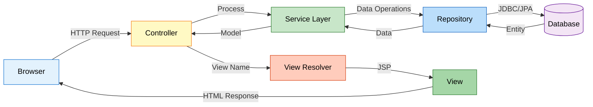

### 🎯 Layered Architecture

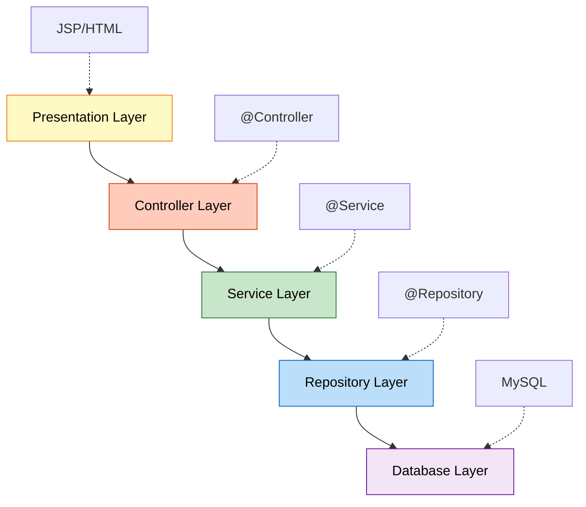

### 📊 Layer Responsibilities

| Layer | Annotation | Responsibility | Example |
|:------|:-----------|:--------------|:--------|
| **Controller** | @Controller | Handle HTTP requests | StudentController |
| **Service** | @Service | Business logic | StudentService |
| **Repository** | @Repository | Data access | StudentDao |
| **Model** | @Entity | Data representation | Student |

---

## 3. PROJECT STRUCTURE ANALYSIS

<div align="center">

</div>

### 📁 Complete Project Structure

```
SpringMvc/
├── src/
│   ├── main/
│   │   ├── java/
│   │   │   └── com/example/SpringMvc/
│   │   │       ├── SpringMvcApplication.java      # Entry Point
│   │   │       ├── Controller/
│   │   │       │   └── StudentController.java     # Request Handler
│   │   │       ├── Service/
│   │   │       │   └── StudentService.java        # Business Logic
│   │   │       ├── Repository/
│   │   │       │   └── StudentDao.java            # Data Access
│   │   │       └── Model/
│   │   │           └── Student.java               # Entity
│   │   ├── resources/
│   │   │   └── application.properties             # Configuration
│   │   └── webapp/
│   │       └── WEB-INF/
│   │           └── jsp/
│   │               ├── register.jsp               # Form View
│   │               └── success.jsp                # Success View
│   └── test/
├── pom.xml                                        # Maven Dependencies
└── README.md
```

### 🔍 File Purpose Breakdown

**1. SpringMvcApplication.java**
```java
@SpringBootApplication  // = @Configuration + @EnableAutoConfiguration + @ComponentScan
public class SpringMvcApplication {
    public static void main(String[] args) {
        SpringApplication.run(SpringMvcApplication.class, args);
    }
}
```
- Entry point of application
- Bootstraps Spring Boot
- Auto-configures components

**2. StudentController.java**
```java
@Controller  // Marks as Spring MVC controller
public class StudentController {
    @Autowired
    private StudentService studentService;
    
    @GetMapping("/register")   // Handles GET requests
    public String showForm() {
        return "register";      // Returns view name
    }
    
    @PostMapping("/register")  // Handles POST requests
    public String registerStudent(@ModelAttribute Student student, Model model) {
        studentService.saveStudent(student);
        model.addAttribute("name", student.getName());
        return "success";
    }
}
```

**3. StudentService.java**
```java
@Service  // Business logic layer
public class StudentService {
    @Autowired
    private StudentDao studentDao;
    
    public void saveStudent(Student student) {
        studentDao.save(student);  // Delegates to repository
    }
}
```

**4. StudentDao.java**
```java
@Repository  // Data access layer
public interface StudentDao extends JpaRepository<Student, Long> {
    // No code needed! Spring Data JPA provides implementation
}
```

**5. Student.java**
```java
@Entity  // JPA entity
@Table(name = "StudentTable")
public class Student {
    @Id
    @GeneratedValue(strategy = GenerationType.IDENTITY)
    private Long id;
    
    private String name;
    
    @Email(message = "Invalid !!")
    private String email;
}
```

---

## 4. COMPLETE REQUEST FLOW

<div align="center">

</div>

### 📌 End-to-End Request Processing

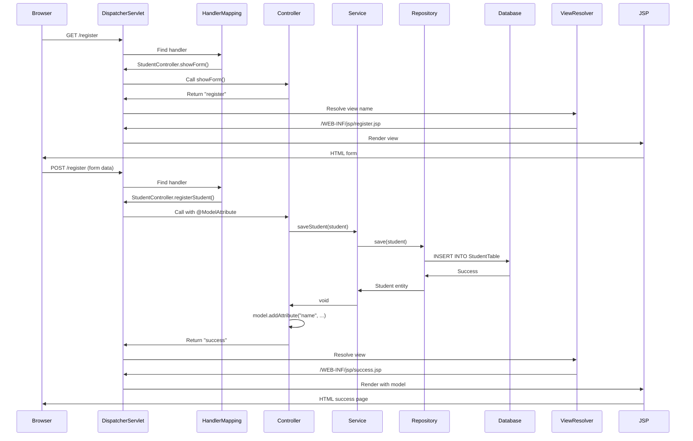

### 🎯 Step-by-Step Breakdown

**Step 1: User Opens Form**
```
Browser → GET http://localhost:8081/register
↓
DispatcherServlet receives request
↓
HandlerMapping finds @GetMapping("/register")
↓
StudentController.showForm() called
↓
Returns "register" (view name)
↓
ViewResolver: prefix + "register" + suffix
↓
/WEB-INF/jsp/register.jsp rendered
↓
HTML form sent to browser
```

**Step 2: User Submits Form**
```
Browser → POST http://localhost:8081/register
         name=John&email=john@example.com
↓
DispatcherServlet receives POST
↓
@ModelAttribute binds form data to Student object
↓
StudentController.registerStudent(student, model) called
↓
studentService.saveStudent(student)
↓
studentDao.save(student)  [JPA Repository]
↓
Hibernate generates: INSERT INTO StudentTable (name, email) VALUES (?, ?)
↓
MySQL executes query
↓
model.addAttribute("name", student.getName())
↓
Returns "success"
↓
/WEB-INF/jsp/success.jsp rendered with ${name}
↓
HTML response to browser
```


---

## 5. LAYER-BY-LAYER DEEP DIVE

<div align="center">

</div>

### 🎯 Controller Layer (@Controller)

**Purpose:** Handle HTTP requests and responses

```java
@Controller  // Spring MVC controller
public class StudentController {
    @Autowired  // Dependency injection
    private StudentService studentService;
    
    @GetMapping("/register")  // Maps GET requests
    public String showForm() {
        return "register";  // Logical view name
    }
    
    @PostMapping("/register")  // Maps POST requests
    public String registerStudent(
            @ModelAttribute Student student,  // Binds form data
            Model model) {                     // Carries data to view
        
        studentService.saveStudent(student);
        model.addAttribute("name", student.getName());
        return "success";
    }
}
```

**Key Annotations:**

| Annotation | Purpose | Example |
|:-----------|:--------|:--------|
| @Controller | Marks as MVC controller | Class level |
| @GetMapping | Handle GET requests | Method level |
| @PostMapping | Handle POST requests | Method level |
| @ModelAttribute | Bind form data to object | Parameter level |
| @Autowired | Inject dependencies | Field/Constructor |

**Why @Controller vs @RestController?**

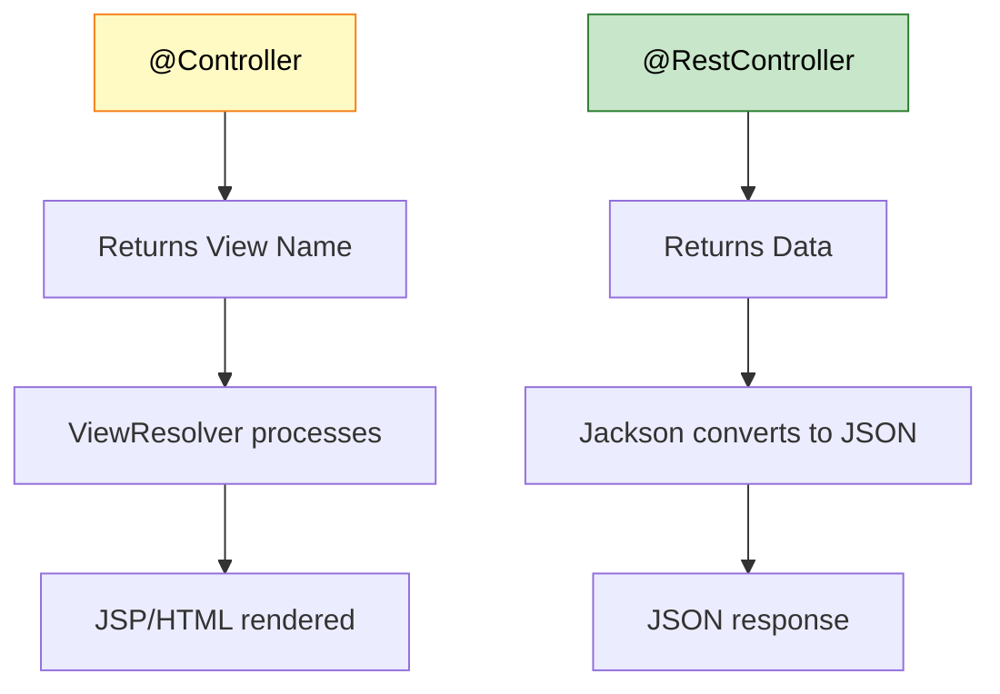

---

### 🎯 Service Layer (@Service)

**Purpose:** Business logic & transaction management

```java
@Service  // Business logic component
public class StudentService {
    @Autowired
    private StudentDao studentDao;
    
    public void saveStudent(Student student) {
        // Business validation
        if (student.getName() == null || student.getName().isEmpty()) {
            throw new IllegalArgumentException("Name cannot be empty");
        }
        
        // Delegate to repository
        studentDao.save(student);
    }
    
    // Additional business methods
    public List<Student> getAllStudents() {
        return studentDao.findAll();
    }
}
```

**Why Service Layer?**
- Separates business logic from controllers
- Reusable across multiple controllers
- Transaction boundary (@Transactional)
- Easy to test with mocks

---

### 🎯 Repository Layer (@Repository)

**Purpose:** Data access & persistence

**Before (Manual DAO):**
```java
@Repository
public class StudentDao {
    public void saveStudent(Student student) {
        // Manual JDBC code
        Connection conn = DriverManager.getConnection(...);
        PreparedStatement ps = conn.prepareStatement(
            "INSERT INTO StudentTable (name, email) VALUES (?, ?)");
        ps.setString(1, student.getName());
        ps.setString(2, student.getEmail());
        ps.executeUpdate();
        // Close resources...
    }
}
```

**After (JPA Repository):**
```java
@Repository
public interface StudentDao extends JpaRepository<Student, Long> {
    // No implementation needed!
    // Spring Data JPA provides:
    // - save()
    // - findAll()
    // - findById()
    // - delete()
    // - count()
    // + 20+ more methods
}
```

**Magic Behind the Interface:**

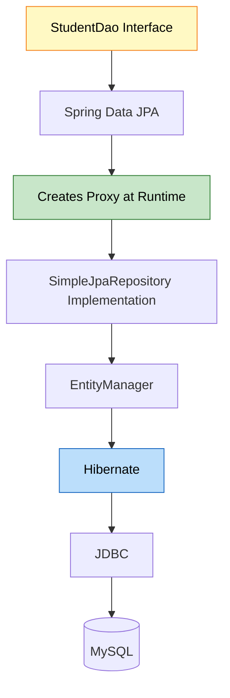

---

### 🎯 Model Layer (@Entity)

**Purpose:** Represent database tables as Java objects

```java
@Entity  // JPA entity
@Table(name = "StudentTable")  // Custom table name
public class Student {
    
    @Id  // Primary key
    @GeneratedValue(strategy = GenerationType.IDENTITY)  // Auto-increment
    private Long id;
    
    @Column(nullable = false)  // NOT NULL constraint
    private String name;
    
    @Email(message = "Invalid email")  // Validation
    @Column(unique = true)  // UNIQUE constraint
    private String email;
    
    // Constructors, getters, setters
}
```

**JPA Annotations:**

| Annotation | Purpose | SQL Equivalent |
|:-----------|:--------|:--------------|
| @Entity | Mark as JPA entity | CREATE TABLE |
| @Table | Custom table name | TABLE name |
| @Id | Primary key | PRIMARY KEY |
| @GeneratedValue | Auto-increment | AUTO_INCREMENT |
| @Column | Column properties | Column definition |
| @Email | Email validation | - |

---

## 6. JPA VS HIBERNATE VS JDBC

<div align="center">

</div>

### 📊 Technology Stack Comparison

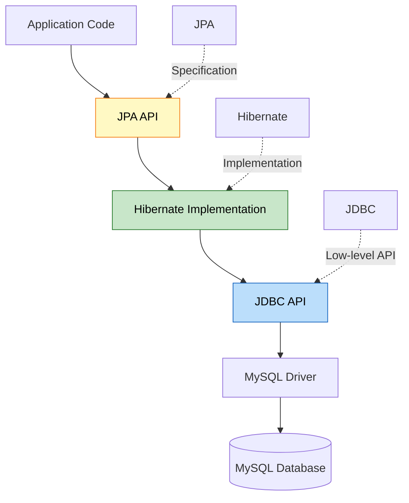

### 🎯 Detailed Comparison

| Feature | JDBC | Hibernate | JPA |
|:--------|:-----|:----------|:----|
| **Type** | API | ORM Framework | Specification |
| **Code** | Boilerplate heavy | Less boilerplate | Minimal code |
| **SQL** | Manual queries | Auto-generated | Auto-generated |
| **Mapping** | Manual | Automatic | Automatic |
| **Caching** | No | Yes (L1, L2) | Yes (via provider) |
| **Lazy Loading** | No | Yes | Yes |
| **Vendor Lock** | No | Yes | No |
| **Learning Curve** | Easy | Medium | Easy |

### 📝 Code Comparison

**JDBC Approach:**
```java
Connection conn = DriverManager.getConnection(url, user, pass);
PreparedStatement ps = conn.prepareStatement(
    "INSERT INTO StudentTable (name, email) VALUES (?, ?)");
ps.setString(1, student.getName());
ps.setString(2, student.getEmail());
ps.executeUpdate();
ps.close();
conn.close();
```

**Hibernate Approach:**
```java
Session session = sessionFactory.openSession();
Transaction tx = session.beginTransaction();
session.save(student);
tx.commit();
session.close();
```

**JPA Approach:**
```java
EntityManager em = emf.createEntityManager();
em.getTransaction().begin();
em.persist(student);
em.getTransaction().commit();
em.close();
```

**Spring Data JPA Approach:**
```java
studentDao.save(student);  // That's it!
```

### 🎯 Why JPA?

**Advantages:**
- Vendor-independent (switch from Hibernate to EclipseLink easily)
- Standard API (portable across projects)
- Less code (Spring Data JPA magic)
- Built-in features (caching, lazy loading, transactions)

**Relationship:**
```
JPA (Specification)
  ↓
Hibernate (Implementation)
  ↓
JDBC (Low-level API)
  ↓
Database Driver
  ↓
Database
```


---

## 7. JPAREPOSITORY HIERARCHY

<div align="center">

</div>

### 📌 Complete Repository Hierarchy

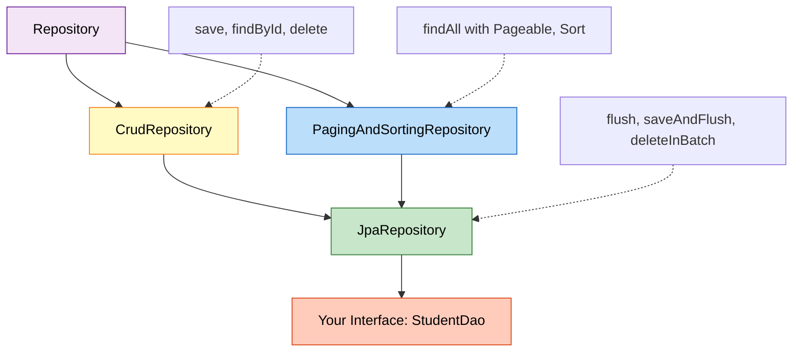

### 🎯 Interface Breakdown

**1. Repository<T, ID>**
- Marker interface
- No methods
- Base for all Spring Data repositories

**2. CrudRepository<T, ID>**
```java
public interface CrudRepository<T, ID> extends Repository<T, ID> {
    <S extends T> S save(S entity);
    Optional<T> findById(ID id);
    Iterable<T> findAll();
    long count();
    void deleteById(ID id);
    void delete(T entity);
    void deleteAll();
}
```

**3. PagingAndSortingRepository<T, ID>**
```java
public interface PagingAndSortingRepository<T, ID> extends CrudRepository<T, ID> {
    Iterable<T> findAll(Sort sort);
    Page<T> findAll(Pageable pageable);
}
```

**4. JpaRepository<T, ID>**
```java
public interface JpaRepository<T, ID> extends PagingAndSortingRepository<T, ID> {
    void flush();
    <S extends T> S saveAndFlush(S entity);
    void deleteInBatch(Iterable<T> entities);
    void deleteAllInBatch();
    T getOne(ID id);  // Returns proxy
    List<T> findAll();  // Returns List instead of Iterable
    List<T> findAll(Sort sort);
}
```

### 📊 Method Comparison

| Method | CrudRepository | JpaRepository | Difference |
|:-------|:--------------|:-------------|:-----------|
| findAll() | Iterable<T> | List<T> | JPA returns List |
| save() | ✅ | ✅ | Same |
| flush() | ❌ | ✅ | JPA-specific |
| saveAndFlush() | ❌ | ✅ | JPA-specific |
| deleteInBatch() | ❌ | ✅ | Batch delete |

### 🎯 Why Extend JpaRepository?

**Reasons:**
1. **More Methods:** 20+ ready-to-use methods
2. **Better Return Types:** List instead of Iterable
3. **JPA-Specific Features:** flush(), batch operations
4. **Pagination & Sorting:** Built-in support

**Example Usage:**
```java
@Repository
public interface StudentDao extends JpaRepository<Student, Long> {
    // Inherited methods (no code needed):
    // - save(student)
    // - findById(id)
    // - findAll()
    // - delete(student)
    // - count()
    
    // Custom query methods (Spring generates implementation):
    List<Student> findByName(String name);
    Optional<Student> findByEmail(String email);
    List<Student> findByNameContaining(String keyword);
    
    // Custom JPQL query:
    @Query("SELECT s FROM Student s WHERE s.email LIKE %:domain")
    List<Student> findByEmailDomain(@Param("domain") String domain);
}
```

### 📝 Query Method Naming Convention

| Method Name | Generated Query |
|:------------|:---------------|
| findByName(String name) | WHERE name = ? |
| findByNameAndEmail(...) | WHERE name = ? AND email = ? |
| findByNameContaining(...) | WHERE name LIKE %?% |
| findByNameStartingWith(...) | WHERE name LIKE ?% |
| findByAgeGreaterThan(int age) | WHERE age > ? |
| findByAgeBetween(int min, int max) | WHERE age BETWEEN ? AND ? |
| findByOrderByNameAsc() | ORDER BY name ASC |

---

## 8. INTERNAL WORKING: DISPATCHERSERVLET

<div align="center">

</div>

### 📌 DispatcherServlet: The Front Controller

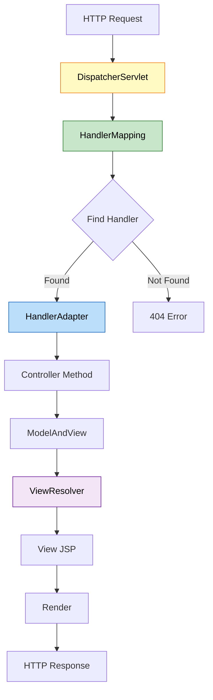

### 🎯 Step-by-Step Internal Process

**Step 1: Request Arrives**
```
Browser sends: GET /register
↓
Tomcat receives request
↓
DispatcherServlet.doGet() called
```

**Step 2: Handler Mapping**
```java
// Spring internally does:
HandlerExecutionChain chain = handlerMapping.getHandler(request);
// Finds: StudentController.showForm() for @GetMapping("/register")
```

**Step 3: Handler Adapter**
```java
// Spring internally:
HandlerAdapter adapter = getHandlerAdapter(handler);
ModelAndView mav = adapter.handle(request, response, handler);
// Calls: StudentController.showForm()
// Returns: ModelAndView with view name "register"
```

**Step 4: View Resolution**
```java
// Spring internally:
View view = viewResolver.resolveViewName("register", locale);
// Resolves to: /WEB-INF/jsp/register.jsp
```

**Step 5: Render View**
```java
// Spring internally:
view.render(mav.getModelMap(), request, response);
// JSP engine processes register.jsp
// Generates HTML
```

### 📊 Key Components

| Component | Role | Configuration |
|:----------|:-----|:-------------|
| **DispatcherServlet** | Front controller | Auto-configured by Spring Boot |
| **HandlerMapping** | Maps URLs to controllers | @GetMapping, @PostMapping |
| **HandlerAdapter** | Invokes controller methods | Handles @ModelAttribute, Model |
| **ViewResolver** | Resolves view names | application.properties |
| **View** | Renders response | JSP, Thymeleaf, etc. |

### 🎯 Configuration in application.properties

```properties
# View Resolver Configuration
spring.mvc.view.prefix=/WEB-INF/jsp/
spring.mvc.view.suffix=.jsp
```

**How it works:**
```
Controller returns: "register"
↓
ViewResolver applies:
prefix + viewName + suffix
↓
Result: /WEB-INF/jsp/register.jsp
```


---

## 9. MODEL & MODELATTRIBUTE

<div align="center">

</div>

### 📌 What is Model?

**Model** is an interface that holds data to be displayed in the view. It's a map of key-value pairs.

```java
public interface Model {
    Model addAttribute(String name, Object value);
    Model addAttribute(Object value);
    Map<String, Object> asMap();
    // ... more methods
}
```

### 🎯 Model in Action

```java
@PostMapping("/register")
public String registerStudent(@ModelAttribute Student student, Model model) {
    studentService.saveStudent(student);
    
    // Add data to model
    model.addAttribute("name", student.getName());
    model.addAttribute("email", student.getEmail());
    model.addAttribute("timestamp", LocalDateTime.now());
    
    return "success";  // View can access ${name}, ${email}, ${timestamp}
}
```

**In JSP:**
```jsp
<h2>Welcome, ${name}!</h2>
<p>Email: ${email}</p>
<p>Registered at: ${timestamp}</p>
```

### 📊 Model vs ModelAndView vs ModelMap

| Type | Usage | Return Type |
|:-----|:------|:-----------|
| **Model** | Interface, parameter injection | String (view name) |
| **ModelAndView** | Contains both model & view | ModelAndView |
| **ModelMap** | Implementation of Model | String (view name) |

**Example with ModelAndView:**
```java
@PostMapping("/register")
public ModelAndView registerStudent(@ModelAttribute Student student) {
    studentService.saveStudent(student);
    
    ModelAndView mav = new ModelAndView();
    mav.setViewName("success");
    mav.addObject("name", student.getName());
    
    return mav;
}
```

### 🎯 @ModelAttribute Deep Dive

**Purpose:** Binds HTTP request parameters to Java object

**How it works:**

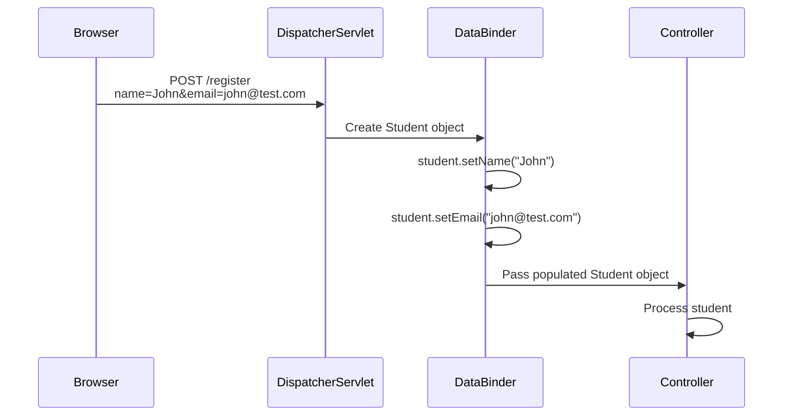

**Without @ModelAttribute:**
```java
@PostMapping("/register")
public String register(HttpServletRequest request) {
    String name = request.getParameter("name");
    String email = request.getParameter("email");
    
    Student student = new Student();
    student.setName(name);
    student.setEmail(email);
    
    // ... rest of code
}
```

**With @ModelAttribute:**
```java
@PostMapping("/register")
public String register(@ModelAttribute Student student) {
    // student object already populated!
    // Spring did all the binding automatically
}
```

### 📝 Form Binding Rules

**HTML Form:**
```html
<form action="/register" method="post">
    <input type="text" name="name" />      <!-- Binds to student.name -->
    <input type="email" name="email" />    <!-- Binds to student.email -->
    <button type="submit">Register</button>
</form>
```

**Java Object:**
```java
public class Student {
    private String name;   // Matches form field "name"
    private String email;  // Matches form field "email"
    
    // Getters and setters required for binding!
}
```

**Key Points:**
- Form field names MUST match Java field names
- Getters/setters are REQUIRED
- Spring uses reflection to set values
- Type conversion is automatic (String → int, String → Date, etc.)

### 🎯 Is Model an ORM?

**No!** Model is NOT an ORM.

| Concept | Purpose | Example |
|:--------|:--------|:--------|
| **Model (MVC)** | Carries data between controller & view | Spring's Model interface |
| **ORM** | Maps objects to database tables | Hibernate, JPA |
| **Entity** | Represents database table | @Entity Student |

**Confusion Clarified:**
```
Model (MVC) → Data carrier for views
Entity (JPA) → Database table representation
ORM (Hibernate) → Framework that maps entities to DB
```

---

## 10. JSP VS HTML: VIEW RESOLUTION

<div align="center">

</div>

### 📌 What is JSP?

**JSP (JavaServer Pages)** is a server-side technology that allows embedding Java code in HTML.

### 🎯 JSP vs HTML

| Feature | HTML | JSP |
|:--------|:-----|:----|
| **Type** | Static | Dynamic |
| **Server Processing** | No | Yes |
| **Java Code** | No | Yes |
| **Access Model Data** | No | Yes (${variable}) |
| **Location** | Anywhere | WEB-INF (protected) |
| **Extension** | .html | .jsp |

### 📝 Why JSP?

**HTML (Static):**
```html
<h2>Welcome, John!</h2>
<!-- Name is hardcoded, cannot change dynamically -->
```

**JSP (Dynamic):**
```jsp
<h2>Welcome, ${name}!</h2>
<!-- ${name} is replaced with actual value from Model -->
```

### 🎯 JSP Features

**1. Expression Language (EL):**
```jsp
${name}                    <!-- Access model attribute -->
${student.email}           <!-- Access object property -->
${student.name.toUpperCase()}  <!-- Call methods -->
```

**2. JSTL (JSP Standard Tag Library):**
```jsp
<%@ taglib uri="http://java.sun.com/jsp/jstl/core" prefix="c" %>

<c:forEach items="${students}" var="student">
    <p>${student.name}</p>
</c:forEach>

<c:if test="${student.age >= 18}">
    <p>Adult</p>
</c:if>
```

**3. Java Code (Scriptlets - Not Recommended):**
```jsp
<%
    String name = (String) request.getAttribute("name");
    out.println("Welcome, " + name);
%>
```

### 📊 Why WEB-INF/jsp/?

**Security Reason:**

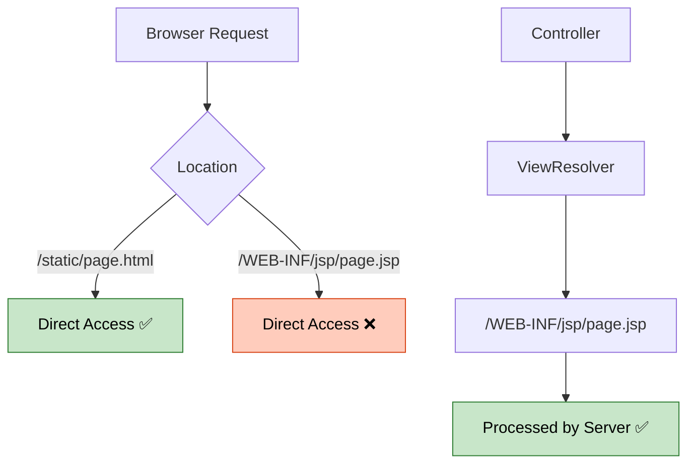

**Key Points:**
- Files in WEB-INF are NOT directly accessible from browser
- Must go through controller → view resolver
- Prevents users from accessing raw JSP files
- Forces proper MVC flow

### 🎯 Can We Use HTML Instead of JSP?

**Yes, but with limitations:**

**Option 1: Static HTML**
```
src/main/resources/static/register.html
```
- No dynamic data
- No model access
- Direct browser access

**Option 2: Thymeleaf (Modern Alternative)**
```html
<!DOCTYPE html>
<html xmlns:th="http://www.thymeleaf.org">
<body>
    <h2>Welcome, <span th:text="${name}">User</span>!</h2>
</body>
</html>
```
- Modern template engine
- Natural templates (valid HTML)
- Better than JSP for new projects

**Comparison:**

| Feature | JSP | Thymeleaf | Static HTML |
|:--------|:----|:----------|:-----------|
| Dynamic Data | ✅ | ✅ | ❌ |
| Modern Syntax | ❌ | ✅ | N/A |
| Valid HTML | ❌ | ✅ | ✅ |
| Learning Curve | Medium | Easy | Easy |
| Industry Use | Legacy | Modern | Static sites |


---

## 11. APPLICATION.PROPERTIES DEEP DIVE

<div align="center">

</div>

### 📌 What is application.properties?

**application.properties** is Spring Boot's configuration file using key-value pairs.

### 🎯 Complete Configuration Breakdown

```properties
# Application Name
spring.application.name=SpringMvc

# Server Configuration
server.port=8081

# JSP View Resolver
spring.mvc.view.prefix=/WEB-INF/jsp/
spring.mvc.view.suffix=.jsp

# Database Configuration
spring.datasource.url=jdbc:mysql://localhost:3306/springmvc?useSSL=false&serverTimezone=UTC
spring.datasource.username=root
spring.datasource.password=Asansol@0341
spring.datasource.driver-class-name=com.mysql.cj.jdbc.Driver

# JPA/Hibernate Configuration
spring.jpa.hibernate.ddl-auto=update
spring.jpa.show-sql=true
spring.jpa.properties.hibernate.format_sql=true
spring.jpa.database-platform=org.hibernate.dialect.MySQL8Dialect
```

### 📊 Configuration Categories

**1. Server Configuration**
```properties
server.port=8081                    # Application runs on port 8081
server.servlet.context-path=/app   # Base URL: http://localhost:8081/app
```

**2. View Resolver Configuration**
```properties
spring.mvc.view.prefix=/WEB-INF/jsp/
spring.mvc.view.suffix=.jsp
```

**How it works:**
```
Controller returns: "register"
↓
ViewResolver: prefix + "register" + suffix
↓
Result: /WEB-INF/jsp/register.jsp
```

**3. Database Configuration**
```properties
spring.datasource.url=jdbc:mysql://localhost:3306/springmvc
spring.datasource.username=root
spring.datasource.password=yourpassword
spring.datasource.driver-class-name=com.mysql.cj.jdbc.Driver
```

**Equivalent to Hibernate XML:**
```xml
<property name="hibernate.connection.url">jdbc:mysql://localhost:3306/springmvc</property>
<property name="hibernate.connection.username">root</property>
<property name="hibernate.connection.password">yourpassword</property>
<property name="hibernate.connection.driver_class">com.mysql.cj.jdbc.Driver</property>
```

**4. JPA/Hibernate Configuration**

| Property | Values | Purpose |
|:---------|:-------|:--------|
| **ddl-auto** | create, update, validate, none | Schema management |
| **show-sql** | true, false | Print SQL queries |
| **format_sql** | true, false | Format SQL output |
| **database-platform** | Dialect class | Database-specific SQL |

**ddl-auto Options:**

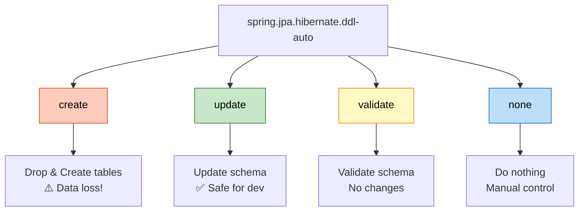

### 🎯 Properties vs YAML

**application.properties:**
```properties
spring.datasource.url=jdbc:mysql://localhost:3306/springmvc
spring.datasource.username=root
spring.datasource.password=password
```

**application.yml (YAML):**
```yaml
spring:
  datasource:
    url: jdbc:mysql://localhost:3306/springmvc
    username: root
    password: password
```

**Comparison:**

| Feature | Properties | YAML |
|:--------|:----------|:-----|
| **Syntax** | key=value | Hierarchical |
| **Readability** | Medium | High |
| **Nesting** | Repetitive | Clean |
| **Comments** | # | # |
| **Spring Support** | ✅ | ✅ |

**Which to use?**
- **Properties:** Simple projects, legacy codebases
- **YAML:** Complex configurations, modern projects

---

## 12. MAVEN & DEPENDENCY MANAGEMENT

<div align="center">

</div>

### 📌 What is Maven?

**Maven** is a build automation and dependency management tool for Java projects.

### 🎯 Why Maven?

**Without Maven:**
```
1. Download spring-core.jar manually
2. Download spring-web.jar manually
3. Download hibernate.jar manually
4. Download mysql-connector.jar manually
5. Add all JARs to classpath
6. Manage version conflicts manually
7. Update each JAR individually
```

**With Maven:**
```xml
<dependency>
    <groupId>org.springframework.boot</groupId>
    <artifactId>spring-boot-starter-web</artifactId>
</dependency>
<!-- Maven downloads 50+ JARs automatically! -->
```

### 📊 pom.xml Structure

```xml
<project>
    <parent>
        <groupId>org.springframework.boot</groupId>
        <artifactId>spring-boot-starter-parent</artifactId>
        <version>3.5.11</version>
    </parent>
    
    <groupId>com.example</groupId>
    <artifactId>SpringMvc</artifactId>
    <version>0.0.1-SNAPSHOT</version>
    <packaging>war</packaging>
    
    <properties>
        <java.version>21</java.version>
    </properties>
    
    <dependencies>
        <!-- Dependencies here -->
    </dependencies>
    
    <build>
        <plugins>
            <!-- Build plugins -->
        </plugins>
    </build>
</project>
```

### 🎯 Key Dependencies Explained

**1. spring-boot-starter-web**
```xml
<dependency>
    <groupId>org.springframework.boot</groupId>
    <artifactId>spring-boot-starter-web</artifactId>
</dependency>
```
**Includes:**
- Spring MVC
- Embedded Tomcat
- Jackson (JSON)
- Validation
- Logging

**2. spring-boot-starter-data-jpa**
```xml
<dependency>
    <groupId>org.springframework.boot</groupId>
    <artifactId>spring-boot-starter-data-jpa</artifactId>
</dependency>
```
**Includes:**
- Spring Data JPA
- Hibernate
- JDBC
- Transaction management

**3. tomcat-embed-jasper**
```xml
<dependency>
    <groupId>org.apache.tomcat.embed</groupId>
    <artifactId>tomcat-embed-jasper</artifactId>
</dependency>
```
**Purpose:** Compile and render JSP files

**4. mysql-connector-j**
```xml
<dependency>
    <groupId>com.mysql</groupId>
    <artifactId>mysql-connector-j</artifactId>
    <scope>runtime</scope>
</dependency>
```
**Purpose:** MySQL JDBC driver

### 📊 Dependency Scopes

| Scope | Availability | Example |
|:------|:------------|:--------|
| **compile** | All phases | spring-boot-starter-web |
| **runtime** | Runtime & test | mysql-connector-j |
| **test** | Test only | junit |
| **provided** | Compile & test (not packaged) | servlet-api |

### 🎯 Maven vs Gradle

| Feature | Maven | Gradle |
|:--------|:------|:-------|
| **Config File** | pom.xml | build.gradle |
| **Language** | XML | Groovy/Kotlin |
| **Performance** | Slower | Faster |
| **Learning Curve** | Easy | Medium |
| **Industry Use** | High | Growing |

### 📝 Is This Spring Boot or Maven Project?

**Answer: BOTH!**

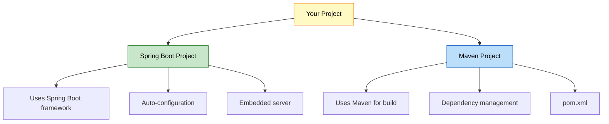

**Clarification:**
- **Spring Boot:** Application framework
- **Maven:** Build tool
- **Spring MVC:** Web framework (part of Spring Boot)


---

## 13. REAL-WORLD PRODUCTION PATTERNS

<div align="center">

</div>

### 🎯 Enhanced Student Registration System

**1. Add Validation**
```java
@Entity
public class Student {
    @Id
    @GeneratedValue(strategy = GenerationType.IDENTITY)
    private Long id;
    
    @NotBlank(message = "Name is required")
    @Size(min = 2, max = 50, message = "Name must be 2-50 characters")
    private String name;
    
    @NotBlank(message = "Email is required")
    @Email(message = "Invalid email format")
    @Column(unique = true)
    private String email;
    
    @Min(value = 18, message = "Must be 18 or older")
    private Integer age;
}
```

**2. Controller with Validation**
```java
@Controller
public class StudentController {
    @Autowired
    private StudentService studentService;
    
    @PostMapping("/register")
    public String registerStudent(
            @Valid @ModelAttribute Student student,
            BindingResult result,
            Model model) {
        
        if (result.hasErrors()) {
            return "register";  // Return to form with errors
        }
        
        try {
            studentService.saveStudent(student);
            model.addAttribute("name", student.getName());
            return "success";
        } catch (DataIntegrityViolationException e) {
            model.addAttribute("error", "Email already exists");
            return "register";
        }
    }
}
```

**3. Service with Business Logic**
```java
@Service
@Transactional
public class StudentService {
    @Autowired
    private StudentDao studentDao;
    
    @Autowired
    private EmailService emailService;
    
    public void saveStudent(Student student) {
        // Business validation
        if (studentDao.existsByEmail(student.getEmail())) {
            throw new DuplicateEmailException("Email already registered");
        }
        
        // Save to database
        Student saved = studentDao.save(student);
        
        // Send welcome email (async)
        emailService.sendWelcomeEmail(saved.getEmail(), saved.getName());
        
        // Log activity
        log.info("New student registered: {}", saved.getEmail());
    }
    
    public List<Student> searchStudents(String keyword) {
        return studentDao.findByNameContainingIgnoreCase(keyword);
    }
    
    public Page<Student> getAllStudents(Pageable pageable) {
        return studentDao.findAll(pageable);
    }
}
```

**4. Repository with Custom Queries**
```java
@Repository
public interface StudentDao extends JpaRepository<Student, Long> {
    
    // Query method
    Optional<Student> findByEmail(String email);
    
    boolean existsByEmail(String email);
    
    List<Student> findByNameContainingIgnoreCase(String keyword);
    
    // JPQL query
    @Query("SELECT s FROM Student s WHERE s.age >= :minAge")
    List<Student> findAdultStudents(@Param("minAge") int minAge);
    
    // Native SQL query
    @Query(value = "SELECT * FROM student_table WHERE email LIKE %:domain", 
           nativeQuery = true)
    List<Student> findByEmailDomain(@Param("domain") String domain);
    
    // Pagination
    Page<Student> findByAgeGreaterThan(int age, Pageable pageable);
}
```

### 📊 Exception Handling

```java
@ControllerAdvice
public class GlobalExceptionHandler {
    
    @ExceptionHandler(DuplicateEmailException.class)
    public String handleDuplicateEmail(DuplicateEmailException ex, Model model) {
        model.addAttribute("error", ex.getMessage());
        return "register";
    }
    
    @ExceptionHandler(Exception.class)
    public String handleGenericException(Exception ex, Model model) {
        model.addAttribute("error", "An error occurred. Please try again.");
        log.error("Unexpected error", ex);
        return "error";
    }
}
```

### 🎯 RESTful API Version

```java
@RestController
@RequestMapping("/api/students")
public class StudentRestController {
    @Autowired
    private StudentService studentService;
    
    @PostMapping
    public ResponseEntity<Student> createStudent(@Valid @RequestBody Student student) {
        Student saved = studentService.saveStudent(student);
        return ResponseEntity.status(HttpStatus.CREATED).body(saved);
    }
    
    @GetMapping
    public ResponseEntity<Page<Student>> getAllStudents(
            @RequestParam(defaultValue = "0") int page,
            @RequestParam(defaultValue = "10") int size) {
        
        Pageable pageable = PageRequest.of(page, size);
        Page<Student> students = studentService.getAllStudents(pageable);
        return ResponseEntity.ok(students);
    }
    
    @GetMapping("/{id}")
    public ResponseEntity<Student> getStudent(@PathVariable Long id) {
        return studentService.findById(id)
                .map(ResponseEntity::ok)
                .orElse(ResponseEntity.notFound().build());
    }
    
    @DeleteMapping("/{id}")
    public ResponseEntity<Void> deleteStudent(@PathVariable Long id) {
        studentService.deleteStudent(id);
        return ResponseEntity.noContent().build();
    }
}
```

---

## 14. COMMON PITFALLS & SOLUTIONS

<div align="center">

</div>

### ❌ Pitfall 1: Missing No-Arg Constructor

**Problem:**
```java
@Entity
public class Student {
    private String name;
    
    public Student(String name) {  // Only parameterized constructor
        this.name = name;
    }
}
```

**Error:**
```
org.hibernate.InstantiationException: No default constructor for entity
```

**Solution:**
```java
@Entity
public class Student {
    private String name;
    
    public Student() {}  // Required by JPA
    
    public Student(String name) {
        this.name = name;
    }
}
```

---

### ❌ Pitfall 2: Missing Getters/Setters

**Problem:**
```java
@Entity
public class Student {
    private String name;
    // No getters/setters
}
```

**Result:** @ModelAttribute cannot bind form data

**Solution:**
```java
@Entity
public class Student {
    private String name;
    
    public String getName() { return name; }
    public void setName(String name) { this.name = name; }
}
```

---

### ❌ Pitfall 3: Wrong JSP Location

**Problem:**
```
src/main/resources/templates/register.jsp  ❌
```

**Error:**
```
404 - JSP not found
```

**Solution:**
```
src/main/webapp/WEB-INF/jsp/register.jsp  ✅
```

---

### ❌ Pitfall 4: Missing JSP Dependencies

**Problem:**
```xml
<!-- Missing tomcat-embed-jasper -->
```

**Error:**
```
HTTP 404 - JSP not rendered
```

**Solution:**
```xml
<dependency>
    <groupId>org.apache.tomcat.embed</groupId>
    <artifactId>tomcat-embed-jasper</artifactId>
</dependency>
```

---

### ❌ Pitfall 5: Incorrect Form Field Names

**Problem:**
```html
<input type="text" name="studentName" />  <!-- Wrong -->
```

```java
public class Student {
    private String name;  // Field name doesn't match
}
```

**Result:** Field remains null

**Solution:**
```html
<input type="text" name="name" />  <!-- Matches field name -->
```

---

### ❌ Pitfall 6: Database Not Created

**Problem:**
```properties
spring.datasource.url=jdbc:mysql://localhost:3306/springmvc
```

**Error:**
```
Unknown database 'springmvc'
```

**Solution:**
```sql
CREATE DATABASE springmvc;
```

Or use:
```properties
spring.datasource.url=jdbc:mysql://localhost:3306/springmvc?createDatabaseIfNotExist=true
```

---

### ❌ Pitfall 7: Circular Dependency

**Problem:**
```java
@Service
public class ServiceA {
    @Autowired
    private ServiceB serviceB;
}

@Service
public class ServiceB {
    @Autowired
    private ServiceA serviceA;  // Circular!
}
```

**Solution:**
```java
@Service
public class ServiceA {
    @Autowired
    @Lazy  // Break circular dependency
    private ServiceB serviceB;
}
```


---

## 15. TOP INTERVIEW QUESTIONS

<div align="center">

</div>

### Q1: Explain the complete flow when a user submits a form in Spring MVC

**Answer:**

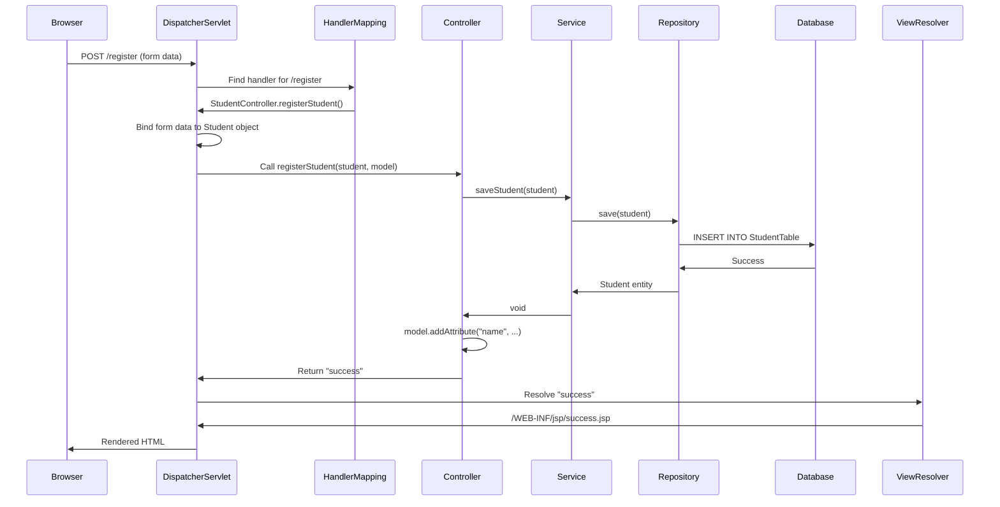

**Key Steps:**
1. **Request Reception:** DispatcherServlet receives POST request
2. **Handler Mapping:** Finds @PostMapping("/register") method
3. **Data Binding:** @ModelAttribute binds form data to Student object
4. **Controller Execution:** Calls registerStudent() method
5. **Service Layer:** Business logic execution
6. **Repository Layer:** JPA save() method
7. **Hibernate:** Generates SQL INSERT statement
8. **Database:** Executes query
9. **Model Population:** Adds attributes to Model
10. **View Resolution:** Resolves view name to JSP path
11. **Rendering:** JSP processes and generates HTML
12. **Response:** HTML sent to browser

---

### Q2: Why do we extend JpaRepository instead of CrudRepository?

**Answer:**

**JpaRepository provides:**

1. **Better Return Types**
```java
// CrudRepository
Iterable<Student> findAll();  // Less convenient

// JpaRepository
List<Student> findAll();  // More convenient
```

2. **JPA-Specific Methods**
```java
void flush();  // Synchronize with database
<S extends T> S saveAndFlush(S entity);  // Save and flush immediately
void deleteInBatch(Iterable<T> entities);  // Batch delete (single query)
```

3. **Pagination & Sorting**
```java
Page<Student> findAll(Pageable pageable);
List<Student> findAll(Sort sort);
```

**Hierarchy:**
```
Repository (marker)
    ↓
CrudRepository (basic CRUD)
    ↓
PagingAndSortingRepository (pagination)
    ↓
JpaRepository (JPA-specific + all above)
```

**When to use CrudRepository?**
- When you don't need JPA-specific features
- When working with non-JPA data stores (MongoDB, Redis)

**When to use JpaRepository?**
- Most Spring Boot + JPA projects (recommended)
- When you need batch operations
- When you need flush control

---

### Q3: What happens internally when you call studentDao.save(student)?

**Answer:**

**Complete Internal Flow:**

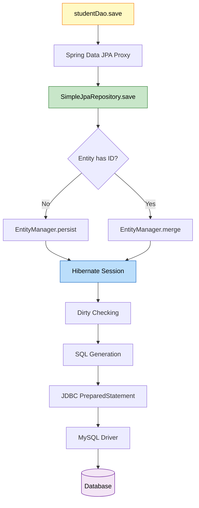

**Step-by-Step:**

1. **Proxy Invocation**
```java
studentDao.save(student);  // Interface method call
↓
Spring creates proxy at runtime
↓
Delegates to SimpleJpaRepository
```

2. **SimpleJpaRepository Logic**
```java
public <S extends T> S save(S entity) {
    if (entityInformation.isNew(entity)) {
        em.persist(entity);  // INSERT
        return entity;
    } else {
        return em.merge(entity);  // UPDATE
    }
}
```

3. **EntityManager (JPA)**
```java
em.persist(student);
↓
Adds entity to persistence context
↓
Marks for INSERT operation
```

4. **Hibernate Session**
```java
Session session = em.unwrap(Session.class);
session.save(student);
↓
Generates SQL based on entity mapping
```

5. **SQL Generation**
```sql
INSERT INTO StudentTable (name, email) VALUES (?, ?)
```

6. **JDBC Execution**
```java
PreparedStatement ps = conn.prepareStatement(sql);
ps.setString(1, "John");
ps.setString(2, "john@test.com");
ps.executeUpdate();
```

7. **Database Execution**
```
MySQL receives query
↓
Executes INSERT
↓
Returns generated ID
↓
Hibernate sets ID on entity
```

---

### Q4: Explain @ModelAttribute binding mechanism

**Answer:**

**Internal Process:**

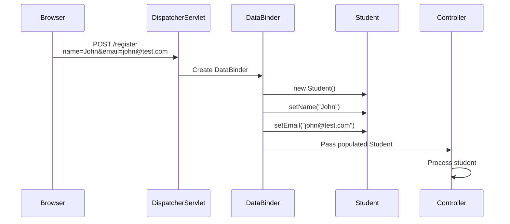

**How It Works:**

1. **Request Parameters**
```
POST /register
Content-Type: application/x-www-form-urlencoded

name=John&email=john@test.com
```

2. **Spring Creates DataBinder**
```java
// Spring internally:
DataBinder binder = new DataBinder(new Student());
binder.bind(request.getParameterMap());
```

3. **Property Binding**
```java
// For each request parameter:
String paramName = "name";
String paramValue = "John";

// Spring uses reflection:
PropertyDescriptor pd = BeanUtils.getPropertyDescriptor(Student.class, paramName);
Method setter = pd.getWriteMethod();  // setName()
setter.invoke(student, paramValue);   // student.setName("John")
```

4. **Type Conversion**
```java
// Automatic conversion:
String age = "25";  // From request
Integer ageInt = conversionService.convert(age, Integer.class);
student.setAge(ageInt);
```

**Requirements:**
- Default no-arg constructor
- Setter methods for each field
- Field names match form parameter names

---

### Q5: What's the difference between @Controller and @RestController?

**Answer:**

| Feature | @Controller | @RestController |
|:--------|:-----------|:---------------|
| **Returns** | View name (String) | Data (Object) |
| **Response** | HTML (via JSP) | JSON/XML |
| **@ResponseBody** | Required per method | Implicit on all methods |
| **Use Case** | Traditional web apps | REST APIs |

**@Controller:**
```java
@Controller
public class StudentController {
    @GetMapping("/register")
    public String showForm() {
        return "register";  // View name → JSP
    }
    
    @GetMapping("/api/student")
    @ResponseBody  // Required for JSON response
    public Student getStudent() {
        return new Student("John", "john@test.com");
    }
}
```

**@RestController:**
```java
@RestController  // = @Controller + @ResponseBody
public class StudentRestController {
    @GetMapping("/api/student")
    public Student getStudent() {
        return new Student("John", "john@test.com");
        // Automatically converted to JSON
    }
}
```

**Internal Difference:**

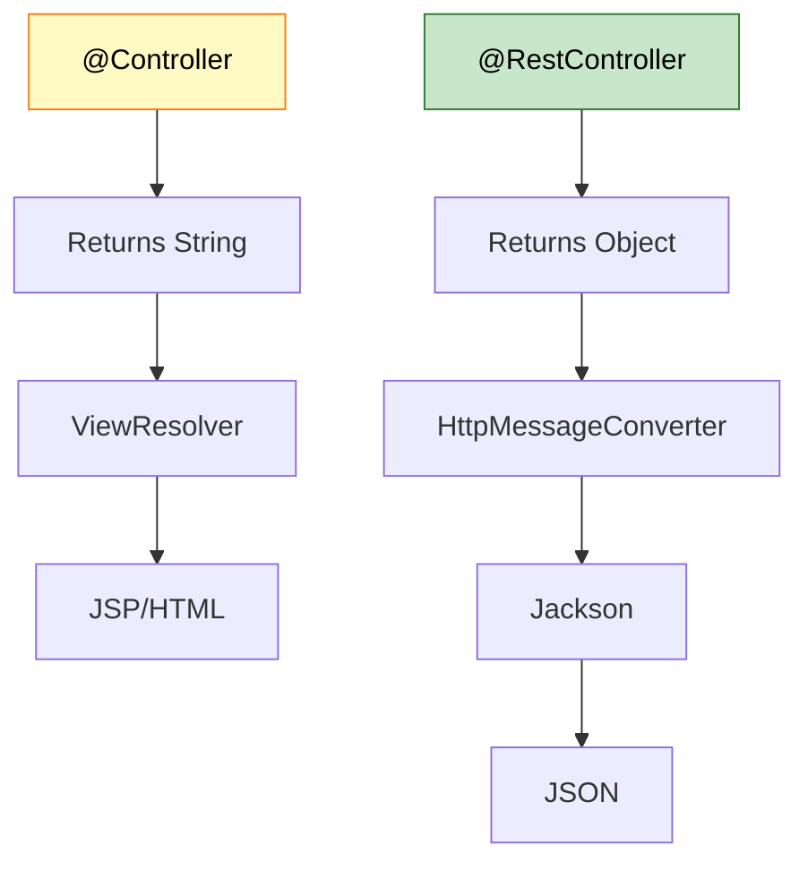

---

### Q6: How does Spring resolve view names to JSP files?

**Answer:**

**Configuration:**
```properties
spring.mvc.view.prefix=/WEB-INF/jsp/
spring.mvc.view.suffix=.jsp
```

**Resolution Process:**

```mermaid
graph LR
    A[Controller returns 'register'] --> B[InternalResourceViewResolver]
    B --> C[Apply prefix]
    C --> D["/WEB-INF/jsp/register"]
    D --> E[Apply suffix]
    E --> F["/WEB-INF/jsp/register.jsp"]
    F --> G[RequestDispatcher]
    G --> H[JSP Engine]
    H --> I[HTML Response]
    
    style B fill:#fff9c4,stroke:#f57f17,color:#000
    style H fill:#c8e6c9,stroke:#2e7d32,color:#000
```

**Internal Code:**
```java
// Spring internally:
public class InternalResourceViewResolver extends UrlBasedViewResolver {
    
    @Override
    protected String getUrl(String viewName) {
        return getPrefix() + viewName + getSuffix();
        // "/WEB-INF/jsp/" + "register" + ".jsp"
        // = "/WEB-INF/jsp/register.jsp"
    }
}
```

**Multiple View Resolvers:**
```java
@Configuration
public class WebConfig {
    @Bean
    public ViewResolver thymeleafResolver() {
        // Order 1: Try Thymeleaf first
    }
    
    @Bean
    public ViewResolver jspResolver() {
        // Order 2: Fallback to JSP
    }
}
```

---

### Q7: Why change StudentDao from class to interface?

**Answer:**

**Before (Manual Implementation):**
```java
@Repository
public class StudentDao {
    @PersistenceContext
    private EntityManager em;
    
    public void save(Student student) {
        em.persist(student);
    }
    
    public Student findById(Long id) {
        return em.find(Student.class, id);
    }
    
    public List<Student> findAll() {
        return em.createQuery("SELECT s FROM Student s", Student.class)
                 .getResultList();
    }
    
    // 20+ more methods to write manually...
}
```

**After (Spring Data JPA):**
```java
@Repository
public interface StudentDao extends JpaRepository<Student, Long> {
    // No code needed!
    // Spring Data JPA provides implementation at runtime
}
```

**Why Interface?**

1. **Spring Data JPA Magic**
```java
// At runtime, Spring creates:
class StudentDaoImpl implements StudentDao {
    // Generated by Spring Data JPA
    public Student save(Student entity) {
        return em.merge(entity);
    }
    // ... all other methods
}
```

2. **Proxy Pattern**
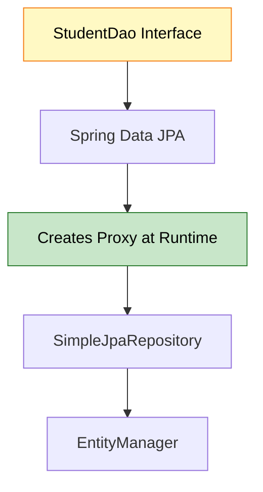

3. **Benefits**
- No boilerplate code
- 20+ methods for free
- Custom query methods by naming convention
- Type-safe

**Custom Methods:**
```java
public interface StudentDao extends JpaRepository<Student, Long> {
    // Spring generates implementation automatically:
    List<Student> findByName(String name);
    Optional<Student> findByEmail(String email);
    List<Student> findByAgeGreaterThan(int age);
}
```


---

### Q8: Explain the difference between JPA and Hibernate

**Answer:**

**JPA (Java Persistence API):**
- **Specification** (not implementation)
- Defines interfaces and annotations
- Vendor-independent
- Part of Jakarta EE

**Hibernate:**
- **Implementation** of JPA specification
- ORM framework
- Provides additional features beyond JPA
- Most popular JPA provider

**Analogy:**
```
JPA = JDBC (Specification)
Hibernate = MySQL Driver (Implementation)
```

**Comparison:**

| Aspect | JPA | Hibernate |
|:-------|:----|:----------|
| **Type** | Specification | Implementation |
| **Package** | jakarta.persistence.* | org.hibernate.* |
| **EntityManager** | JPA interface | Hibernate implements |
| **Session** | No | Hibernate-specific |
| **Caching** | Defined in spec | Implemented by Hibernate |
| **Vendor Lock** | No | Yes |

**Code Example:**

**JPA Code (Portable):**
```java
@PersistenceContext
private EntityManager em;

public void save(Student student) {
    em.persist(student);  // JPA method
}
```

**Hibernate Code (Vendor-specific):**
```java
@Autowired
private SessionFactory sessionFactory;

public void save(Student student) {
    Session session = sessionFactory.getCurrentSession();
    session.save(student);  // Hibernate method
}
```

**Relationship:**

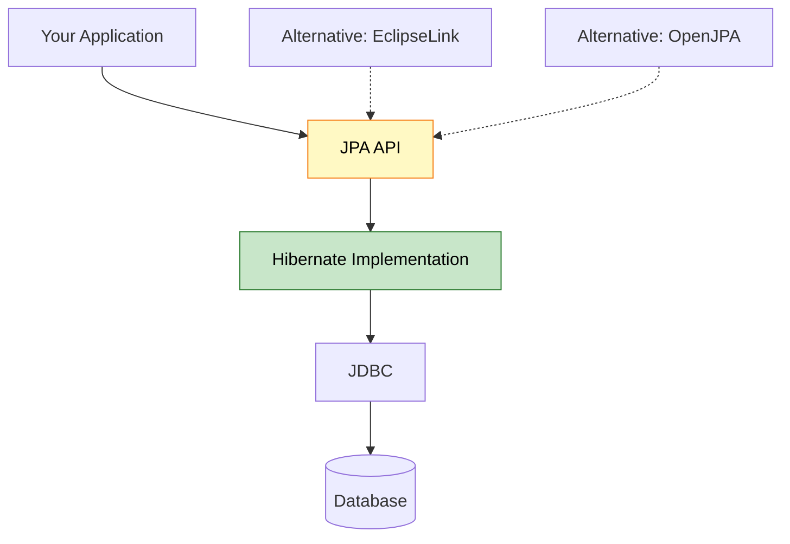

**Why Use JPA Instead of Hibernate Directly?**
- Switch providers easily (Hibernate → EclipseLink)
- Standard API (portable code)
- Better for long-term maintenance

---

### Q9: What is the purpose of @Transactional and where should it be placed?

**Answer:**

**Purpose:**
- Manages database transactions
- Ensures ACID properties
- Automatic rollback on exceptions

**Where to Place:**

**❌ Wrong: On Repository**
```java
@Repository
public interface StudentDao extends JpaRepository<Student, Long> {
    @Transactional  // Wrong! Repository methods already transactional
    Student save(Student student);
}
```

**✅ Correct: On Service**
```java
@Service
@Transactional  // Correct! Service layer manages transactions
public class StudentService {
    @Autowired
    private StudentDao studentDao;
    
    public void saveStudent(Student student) {
        studentDao.save(student);
        // If exception occurs, transaction rolls back
    }
    
    public void registerStudent(Student student) {
        studentDao.save(student);
        emailService.sendWelcomeEmail(student.getEmail());
        // Both operations in same transaction
    }
}
```

**Why Service Layer?**

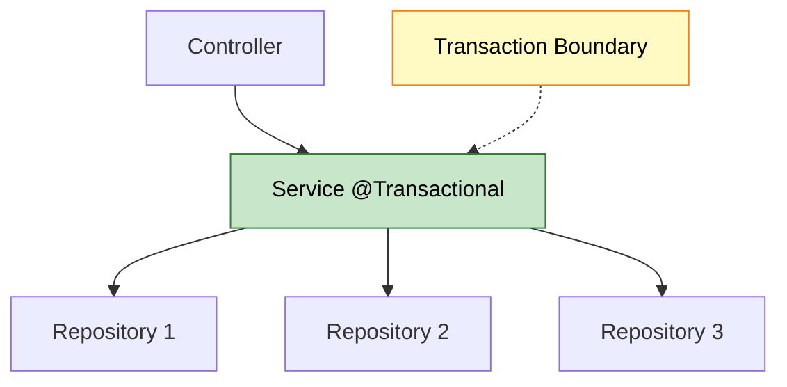

**Transaction Propagation:**

```java
@Service
public class StudentService {
    
    @Transactional  // Creates new transaction
    public void method1() {
        // Transaction 1
        method2();  // Joins Transaction 1
    }
    
    @Transactional(propagation = Propagation.REQUIRES_NEW)
    public void method2() {
        // Creates new Transaction 2 (independent)
    }
}
```

**Rollback Behavior:**

```java
@Transactional
public void saveStudent(Student student) {
    studentDao.save(student);  // Saved to DB
    
    if (student.getAge() < 18) {
        throw new RuntimeException("Age must be 18+");
        // Transaction rolls back, student NOT saved
    }
}
```

---

### Q10: How does Spring Boot auto-configure DataSource without XML?

**Answer:**

**Magic of Auto-Configuration:**

```mermaid
graph TD
    A[application.properties] --> B[Spring Boot]
    B --> C[DataSourceAutoConfiguration]
    C --> D[Creates DataSource Bean]
    D --> E[HikariCP Connection Pool]
    E --> F[MySQL Connection]
    
    G[JpaAutoConfiguration] --> H[EntityManagerFactory]
    H --> I[Hibernate]
    
    style B fill:#fff9c4,stroke:#f57f17,color:#000
    style C fill:#c8e6c9,stroke:#2e7d32,color:#000
```

**What Spring Boot Does Internally:**

1. **Reads application.properties**
```properties
spring.datasource.url=jdbc:mysql://localhost:3306/springmvc
spring.datasource.username=root
spring.datasource.password=password
```

2. **Creates DataSource Bean**
```java
// Spring Boot internally:
@Configuration
@ConditionalOnClass(DataSource.class)
public class DataSourceAutoConfiguration {
    
    @Bean
    @ConfigurationProperties(prefix = "spring.datasource")
    public DataSource dataSource() {
        return DataSourceBuilder.create()
                .url(properties.getUrl())
                .username(properties.getUsername())
                .password(properties.getPassword())
                .build();
    }
}
```

3. **Creates EntityManagerFactory**
```java
// Spring Boot internally:
@Configuration
@ConditionalOnClass(EntityManager.class)
public class HibernateJpaAutoConfiguration {
    
    @Bean
    public LocalContainerEntityManagerFactoryBean entityManagerFactory(
            DataSource dataSource) {
        
        LocalContainerEntityManagerFactoryBean em = 
            new LocalContainerEntityManagerFactoryBean();
        em.setDataSource(dataSource);
        em.setPackagesToScan("com.example");
        em.setJpaVendorAdapter(new HibernateJpaVendorAdapter());
        
        return em;
    }
}
```

**Equivalent XML Configuration (Old Way):**
```xml
<bean id="dataSource" class="org.apache.commons.dbcp.BasicDataSource">
    <property name="url" value="jdbc:mysql://localhost:3306/springmvc"/>
    <property name="username" value="root"/>
    <property name="password" value="password"/>
</bean>

<bean id="entityManagerFactory" 
      class="org.springframework.orm.jpa.LocalContainerEntityManagerFactoryBean">
    <property name="dataSource" ref="dataSource"/>
    <property name="packagesToScan" value="com.example"/>
</bean>
```

**Spring Boot Advantage:**
- No XML configuration
- Convention over configuration
- Auto-detects dependencies
- Sensible defaults

---

### Q11: What happens if you remove @Repository from StudentDao?

**Answer:**

**Scenario:**
```java
// @Repository removed
public interface StudentDao extends JpaRepository<Student, Long> {
}
```

**Result: Still Works! 🤔**

**Why?**

```mermaid
graph TD
    A[StudentDao extends JpaRepository] --> B[Spring Data JPA]
    B --> C["@EnableJpaRepositories"]
    C --> D[Scans for JpaRepository interfaces]
    D --> E[Creates Bean automatically]
    
    F["@Repository"] -.->|Optional| E
    
    style B fill:#c8e6c9,stroke:#2e7d32,color:#000
    style C fill:#fff9c4,stroke:#f57f17,color:#000
```

**Spring Boot Auto-Configuration:**
```java
@SpringBootApplication  // Includes @EnableJpaRepositories
public class SpringMvcApplication {
    // Spring Data JPA automatically scans for repositories
}
```

**When @Repository is Needed:**

1. **Exception Translation**
```java
@Repository  // Translates SQLException to DataAccessException
public class CustomDao {
    @PersistenceContext
    private EntityManager em;
    
    public void customQuery() {
        // SQLException → DataAccessException
    }
}
```

2. **Component Scanning (Non-JPA)**
```java
@Repository  // Required for non-JPA repositories
public class StudentDaoImpl {
    // Manual implementation
}
```

**Best Practice:**
```java
@Repository  // Use it for clarity and consistency
public interface StudentDao extends JpaRepository<Student, Long> {
}
```

---

### Q12: Explain the difference between Model, ModelMap, and ModelAndView

**Answer:**

**1. Model (Interface)**
```java
@PostMapping("/register")
public String register(@ModelAttribute Student student, Model model) {
    model.addAttribute("name", student.getName());
    return "success";  // View name
}
```

**2. ModelMap (Implementation)**
```java
@PostMapping("/register")
public String register(@ModelAttribute Student student, ModelMap model) {
    model.addAttribute("name", student.getName());
    model.put("email", student.getEmail());  // Additional method
    return "success";
}
```

**3. ModelAndView (Container)**
```java
@PostMapping("/register")
public ModelAndView register(@ModelAttribute Student student) {
    ModelAndView mav = new ModelAndView();
    mav.setViewName("success");
    mav.addObject("name", student.getName());
    return mav;  // Contains both model and view
}
```

**Comparison:**

| Feature | Model | ModelMap | ModelAndView |
|:--------|:------|:---------|:------------|
| **Type** | Interface | Class | Class |
| **Return** | String (view) | String (view) | ModelAndView |
| **View Setting** | Separate | Separate | Included |
| **Use Case** | Simple | Extended | Complex |

**Internal Relationship:**

```mermaid
graph TD
    A[Model Interface] --> B[ModelMap Class]
    B --> C[LinkedHashMap]
    
    D[ModelAndView] --> E[Contains ModelMap]
    D --> F[Contains View Name]
    
    style A fill:#fff9c4,stroke:#f57f17,color:#000
    style D fill:#c8e6c9,stroke:#2e7d32,color:#000
```

**When to Use:**
- **Model:** Most cases (simple, clean)
- **ModelMap:** Need Map operations
- **ModelAndView:** Complex scenarios, multiple views

---

<div align="center">

<table>
<tr>
<td align="center">

## 🎓 End of Spring MVC Architecture Guide

<br>


<br>

**Created with dedication by Avinash Dhanuka**

<br>

[](https://github.com/Avinash-706)
[](mailto:avunashdhanuka@gmail.com)

<br>

---

**Happy Learning! 🚀**

*"Master the Architecture, Build the Future!"* - Avinash Dhanuka

<br>


---

**© 2026 Avinash Dhanuka | All Rights Reserved**

</td>
</tr>
</table>
</div>
