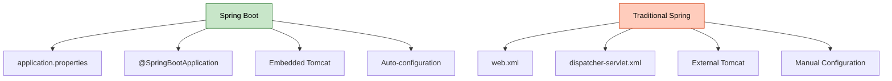
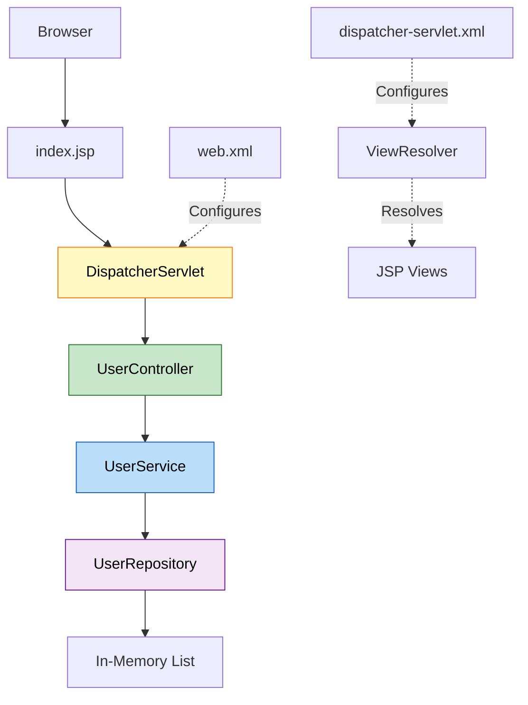
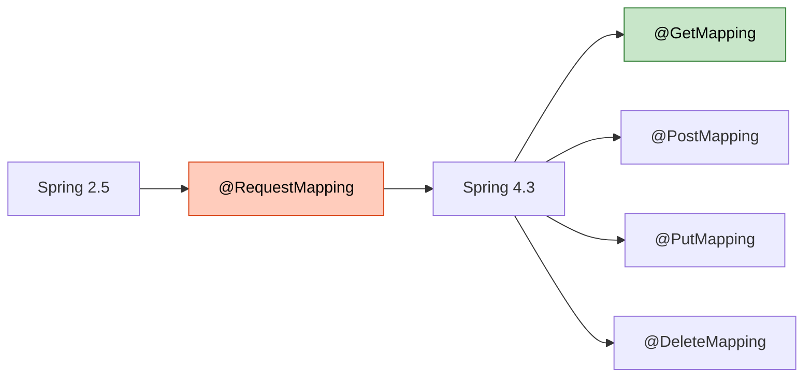
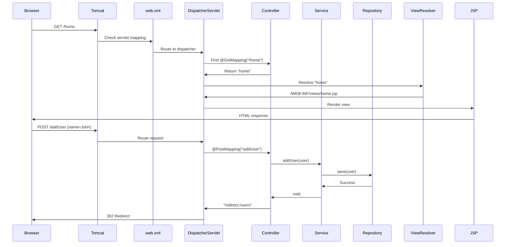
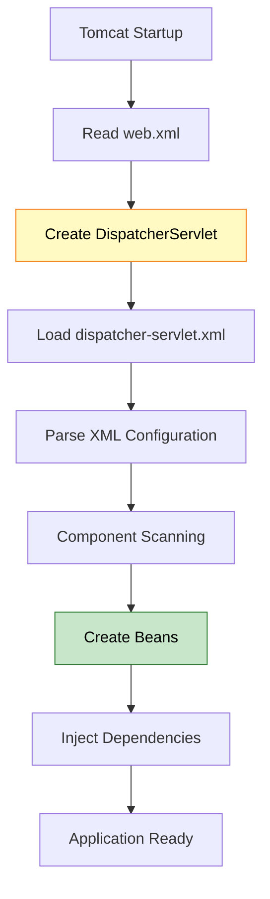
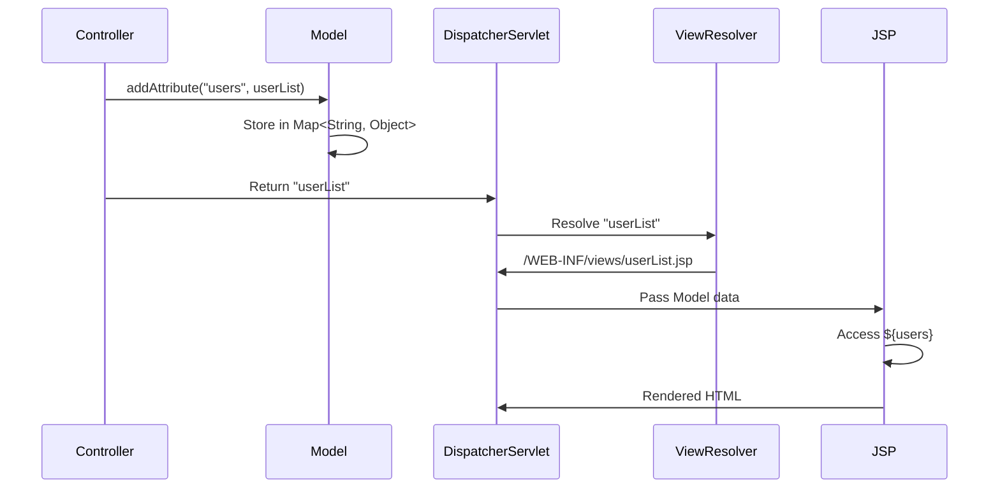
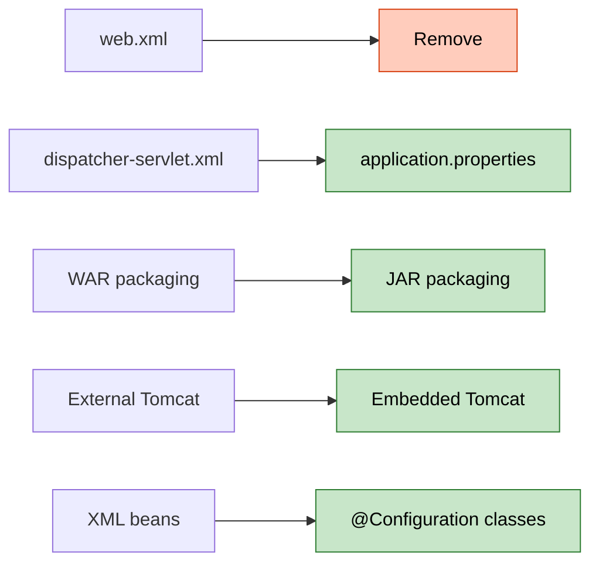
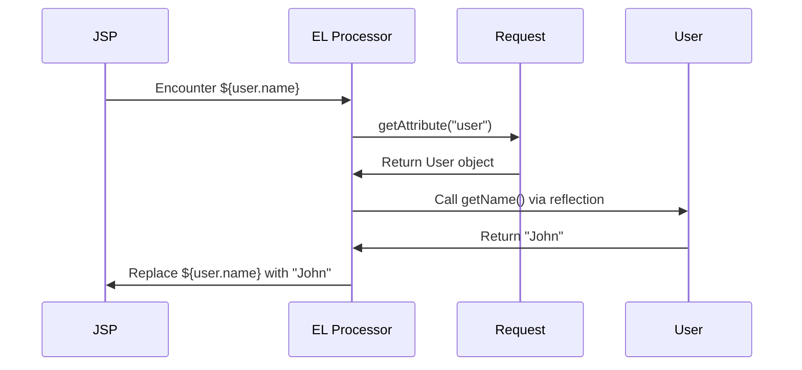

# ☕ Spring MVC with XML Configuration: Traditional Web Application

<div align="center">


</div>

<hr style="border: 1px solid rgb(98, 117, 187)">

<div align="center">
<table>
<tr>
<td align="center">
<br />

<h3>© 2026 Avinash Dhanuka</h3>
<p>Master Guide: Traditional Spring MVC with XML Configuration</p>
<p><em>Crafted with ❤️ for Understanding Spring Evolution</em></p>

<a href="https://github.com/Avinash-706" target="_blank">

</a>
<br />
<a href="https://mail.google.com/mail/?view=cm&fs=1&to=avunashdhanuka@gmail.com&su=Spring%20MVC%20XML%20Query&body=☕%20Hello%20Avinash,%0D%0A%0D%0AMy%20name%20is%20[Your%20Name]%20and%20I%20have%20a%20doubt%20regarding%20Spring%20MVC%20XML%20Configuration.%0D%0A%0D%0A🔹%20Topic:%20[XML/Servlet/Deployment]%0D%0A%0D%0AThank%20you!" target="_blank">

</a>
<br />
<br />
</td>
</tr>
</table>
</div>

> **Learning Note:** This project demonstrates traditional Spring MVC with XML configuration - understanding this helps appreciate Spring Boot's auto-configuration magic. Master web.xml, dispatcher-servlet.xml, and manual servlet configuration.

> **Prerequisites:** 
> - Understanding of Spring Boot MVC (day11/SpringMvc)
> - Basic knowledge of Servlets & Deployment Descriptors
> - Familiarity with XML configuration
> - Maven basics


---

## 📑 Table of Contents
1. [What is Traditional Spring MVC?](#1-what-is-traditional-spring-mvc)
2. [Spring Boot vs Traditional Spring](#2-spring-boot-vs-traditional-spring)
3. [Project Architecture](#3-project-architecture)
4. [XML Configuration Deep Dive](#4-xml-configuration-deep-dive)
5. [Request Mapping Evolution](#5-request-mapping-evolution)
6. [Complete Request Flow](#6-complete-request-flow)
7. [Internal Working](#7-internal-working)
8. [Query Parameters & Path Variables](#8-query-parameters--path-variables)
9. [Model Interface Explained](#9-model-interface-explained)
10. [Deployment Descriptor (web.xml)](#10-deployment-descriptor-webxml)
11. [Real-World Comparison](#11-real-world-comparison)
12. [Common Pitfalls & Solutions](#12-common-pitfalls--solutions)
13. [Interview Questions](#13-top-interview-questions)

---

## 1. WHAT IS TRADITIONAL SPRING MVC?

<div align="center">

</div>

> **📝 Author:** Avinash Dhanuka | [GitHub](https://github.com/Avinash-706)

### 📌 Definition

**Traditional Spring MVC** is the pre-Spring Boot way of building web applications using XML configuration files (web.xml, dispatcher-servlet.xml) and manual servlet setup. This approach requires explicit configuration of every component.

**Key Differences from Spring Boot:**
- Manual DispatcherServlet configuration in web.xml
- XML-based bean configuration (dispatcher-servlet.xml)
- No auto-configuration
- Requires external servlet container (Tomcat)
- More boilerplate code

### 🎯 Why Learn This?

| Reason | Benefit |
|:-------|:--------|
| **Legacy Projects** | Many production apps still use XML config |
| **Interview Questions** | Understand Spring's evolution |
| **Appreciate Spring Boot** | See what auto-configuration does |
| **Debugging Skills** | Know what happens under the hood |
| **Migration Projects** | Convert XML to Java config |


---

## 2. SPRING BOOT VS TRADITIONAL SPRING

<div align="center">

</div>

### 📊 Configuration Comparison



### 🎯 Side-by-Side Comparison

| Feature | Spring Boot (Day 11) | Traditional Spring (Day 12) |
|:--------|:--------------------|:---------------------------|
| **Configuration** | application.properties | web.xml + dispatcher-servlet.xml |
| **DispatcherServlet** | Auto-configured | Manual in web.xml |
| **View Resolver** | Auto-configured | Manual bean in XML |
| **Component Scan** | @SpringBootApplication | <context:component-scan> |
| **Server** | Embedded Tomcat | External Tomcat |
| **Packaging** | JAR (executable) | WAR (deploy to server) |
| **Startup** | java -jar app.jar | Deploy WAR to Tomcat |
| **Dependencies** | spring-boot-starter-web | spring-webmvc + JSTL |
| **Lines of Config** | ~10 lines | ~50+ lines |

### 📝 Configuration Examples

**Spring Boot (Day 11):**
```properties
# application.properties
server.port=8081
spring.mvc.view.prefix=/WEB-INF/jsp/
spring.mvc.view.suffix=.jsp
```

**Traditional Spring (Day 12):**
```xml
<!-- web.xml -->
<servlet>
    <servlet-name>dispatcher</servlet-name>
    <servlet-class>org.springframework.web.servlet.DispatcherServlet</servlet-class>
    <load-on-startup>1</load-on-startup>
</servlet>

<!-- dispatcher-servlet.xml -->
<bean class="org.springframework.web.servlet.view.InternalResourceViewResolver">
    <property name="prefix" value="/WEB-INF/views/"/>
    <property name="suffix" value=".jsp"/>
</bean>
```


---

## 3. PROJECT ARCHITECTURE

<div align="center">

</div>

### 📁 Complete Project Structure

```
MavenApp/
├── src/
│   └── main/
│       ├── java/
│       │   └── com/example/
│       │       ├── controller/
│       │       │   └── UserController.java          # @Controller
│       │       ├── service/
│       │       │   ├── UserService.java             # Interface
│       │       │   └── UserServiceImpl.java         # @Service
│       │       ├── repository/
│       │       │   ├── UserRepository.java          # Interface
│       │       │   └── UserRepositoryImpl.java      # @Repository
│       │       └── model/
│       │           └── User.java                    # POJO
│       ├── resources/                               # Empty (no properties)
│       └── webapp/
│           ├── WEB-INF/
│           │   ├── web.xml                          # Deployment Descriptor
│           │   ├── dispatcher-servlet.xml           # Spring Config
│           │   └── views/
│           │       ├── home.jsp
│           │       ├── userList.jsp
│           │       ├── userDetail.jsp
│           │       └── addUser.jsp
│           └── index.jsp
├── pom.xml                                          # Maven Dependencies
└── README.md
```

### 🎯 Layered Architecture



### 📊 Layer Responsibilities

| Layer | Annotation | File | Responsibility |
|:------|:-----------|:-----|:--------------|
| **Controller** | @Controller | UserController.java | Handle HTTP requests |
| **Service** | @Service | UserServiceImpl.java | Business logic |
| **Repository** | @Repository | UserRepositoryImpl.java | Data access (in-memory) |
| **Model** | POJO | User.java | Data representation |
| **View** | JSP | home.jsp, userList.jsp | UI presentation |


---

## 4. XML CONFIGURATION DEEP DIVE

<div align="center">

</div>

> **📝 Author:** Avinash Dhanuka | [GitHub](https://github.com/Avinash-706)

### 📌 web.xml (Deployment Descriptor)

**Purpose:** Configure servlet container (Tomcat) and register DispatcherServlet

```xml
<servlet>
    <servlet-name>dispatcher</servlet-name>
    <servlet-class>org.springframework.web.servlet.DispatcherServlet</servlet-class>
    <init-param>
        <param-name>contextConfigLocation</param-name>
        <param-value>/WEB-INF/dispatcher-servlet.xml</param-value>
    </init-param>
    <load-on-startup>1</load-on-startup>
</servlet>

<servlet-mapping>
    <servlet-name>dispatcher</servlet-name>
    <url-pattern>/</url-pattern>
</servlet-mapping>
```

**Breakdown:**

| Element | Purpose | Value |
|:--------|:--------|:------|
| **servlet-name** | Unique identifier | dispatcher |
| **servlet-class** | DispatcherServlet class | Spring's front controller |
| **contextConfigLocation** | Spring config file | /WEB-INF/dispatcher-servlet.xml |
| **load-on-startup** | Load priority | 1 (load immediately) |
| **url-pattern** | URL mapping | / (all requests) |

### 📌 dispatcher-servlet.xml (Spring Configuration)

**Purpose:** Configure Spring beans, component scanning, and view resolver

```xml
<!-- Enable component scanning -->
<context:component-scan base-package="com.example"/>

<!-- Enable annotation-driven MVC -->
<mvc:annotation-driven/>

<!-- View Resolver -->
<bean class="org.springframework.web.servlet.view.InternalResourceViewResolver">
    <property name="prefix" value="/WEB-INF/views/"/>
    <property name="suffix" value=".jsp"/>
</bean>
```

**Breakdown:**

| Configuration | Purpose | Equivalent in Spring Boot |
|:-------------|:--------|:-------------------------|
| **component-scan** | Scan @Controller, @Service | @SpringBootApplication |
| **annotation-driven** | Enable @RequestMapping | Auto-configured |
| **ViewResolver bean** | Resolve view names | spring.mvc.view.prefix/suffix |

### 🎯 Why web.xml is Called "Deployment Descriptor"

**Answer:** It describes how to deploy the application to the servlet container.

**What it describes:**
- Which servlets to load
- URL patterns to map
- Initialization parameters
- Load order
- Welcome files
- Error pages

**Analogy:**
```
web.xml = Instruction manual for Tomcat
"Hey Tomcat, when you start:
1. Load DispatcherServlet
2. Map all URLs (/) to it
3. Use this config file: dispatcher-servlet.xml"
```


---

## 5. REQUEST MAPPING EVOLUTION

<div align="center">

</div>

### 📌 @RequestMapping vs @GetMapping

**Historical Evolution:**



### 🎯 Old Way (@RequestMapping)

```java
@RequestMapping(value = "/home", method = RequestMethod.GET)
public String home() {
    return "home";
}

@RequestMapping(value = "/addUser", method = RequestMethod.POST)
public String addUser(@RequestParam String name) {
    // ...
}
```

### 🎯 New Way (Specialized Annotations)

```java
@GetMapping("/home")
public String home() {
    return "home";
}

@PostMapping("/addUser")
public String addUser(@RequestParam String name) {
    // ...
}
```

### 📊 Comparison Table

| Feature | @RequestMapping | @GetMapping/@PostMapping |
|:--------|:---------------|:------------------------|
| **Verbosity** | More verbose | Concise |
| **HTTP Method** | Explicit parameter | Implicit in annotation |
| **Readability** | Lower | Higher |
| **Spring Version** | 2.5+ | 4.3+ |
| **Use Case** | Multiple methods | Single method |

### 🎯 Can You Use Both Together?

**Answer: NO! You cannot use @GetMapping and @RequestMapping on the same method.**

```java
// ❌ WRONG - Compilation error
@GetMapping("/home")
@RequestMapping(value = "/home", method = RequestMethod.GET)
public String home() {
    return "home";
}

// ✅ CORRECT - Use one or the other
@GetMapping("/home")
public String home() {
    return "home";
}
```

### 🎯 Class-Level vs Method-Level

**Both can be used at class and method level:**

```java
@Controller
@RequestMapping("/api")  // Base URL
public class UserController {
    
    @GetMapping("/users")  // Full URL: /api/users
    public String listUsers() {
        return "userList";
    }
    
    @PostMapping("/users")  // Full URL: /api/users
    public String addUser() {
        return "redirect:/api/users";
    }
}
```

**Is it like a base URL?**
- **Yes!** Class-level @RequestMapping acts as a base URL prefix
- All method-level mappings are appended to it


---

## 6. COMPLETE REQUEST FLOW

<div align="center">

</div>

> **📝 Author:** Avinash Dhanuka | [GitHub](https://github.com/Avinash-706)

### 📌 End-to-End Request Processing



### 🎯 Step-by-Step Breakdown

**Step 1: Application Startup**
```
1. Tomcat starts
2. Reads web.xml
3. Creates DispatcherServlet instance
4. DispatcherServlet reads dispatcher-servlet.xml
5. Component scanning finds @Controller, @Service, @Repository
6. ViewResolver bean created
7. Application ready
```

**Step 2: User Visits /home**
```
Browser → http://localhost:8080/MavenApp/home
↓
Tomcat receives request
↓
web.xml: url-pattern="/" → dispatcher servlet
↓
DispatcherServlet: Find handler for "/home"
↓
UserController.home() called
↓
Returns "home" (view name)
↓
ViewResolver: /WEB-INF/views/ + "home" + .jsp
↓
home.jsp rendered
↓
HTML sent to browser
```

**Step 3: User Adds New User**
```
Browser → POST /addUser (name=John, email=john@test.com)
↓
DispatcherServlet receives POST
↓
@RequestParam binds form data
↓
UserController.addUser() called
↓
UserService.addUser() → UserRepository.save()
↓
User added to in-memory list
↓
Returns "redirect:/users"
↓
Browser redirected to /users
↓
GET /users → userList.jsp displayed
```


---

## 7. INTERNAL WORKING

<div align="center">

</div>

### 📌 DispatcherServlet Initialization

**What happens when Tomcat starts:**



**Internal Process:**

```java
// 1. Tomcat creates DispatcherServlet
DispatcherServlet servlet = new DispatcherServlet();

// 2. Calls init() method
servlet.init(servletConfig);

// 3. DispatcherServlet loads Spring context
WebApplicationContext context = new XmlWebApplicationContext();
context.setConfigLocation("/WEB-INF/dispatcher-servlet.xml");
context.refresh();

// 4. Component scanning
ClassPathBeanDefinitionScanner scanner = new ClassPathBeanDefinitionScanner(context);
scanner.scan("com.example");

// 5. Bean creation
UserController controller = context.getBean(UserController.class);
UserService service = context.getBean(UserService.class);
UserRepository repository = context.getBean(UserRepository.class);

// 6. Dependency injection
controller.setUserService(service);  // @Autowired
service.setUserRepository(repository);  // @Autowired
```

### 🎯 Why dispatcher-servlet.xml?

**Answer:** Spring convention - if servlet name is "dispatcher", it looks for "dispatcher-servlet.xml"

**Naming Convention:**
```
Servlet name: dispatcher
Config file: dispatcher-servlet.xml

Servlet name: myapp
Config file: myapp-servlet.xml
```

**Custom Location:**
```xml
<init-param>
    <param-name>contextConfigLocation</param-name>
    <param-value>/WEB-INF/spring-config.xml</param-value>
</init-param>
```

### 📊 XML vs Java Config vs Spring Boot

| Configuration | Traditional | Java Config | Spring Boot |
|:-------------|:-----------|:-----------|:-----------|
| **File** | dispatcher-servlet.xml | AppConfig.java | application.properties |
| **Component Scan** | `<context:component-scan>` | @ComponentScan | @SpringBootApplication |
| **View Resolver** | `<bean>` XML | @Bean method | Auto-configured |
| **Verbosity** | High | Medium | Low |


---

## 8. QUERY PARAMETERS & PATH VARIABLES

<div align="center">

</div>

> **📝 Author:** Avinash Dhanuka | [GitHub](https://github.com/Avinash-706)

### 📌 What are Query Parameters?

**Query parameters** are key-value pairs appended to URL after `?`

**Example:**
```
http://localhost:8080/search?name=John&age=25
                              ↑
                        Query Parameters
```

### 🎯 @RequestParam Usage

```java
@GetMapping("/search")
public String search(@RequestParam("name") String name, 
                    @RequestParam("age") int age) {
    // URL: /search?name=John&age=25
    // name = "John"
    // age = 25
}
```

**Optional Parameters:**
```java
@GetMapping("/search")
public String search(@RequestParam(value = "name", required = false) String name) {
    // name can be null if not provided
}

@GetMapping("/search")
public String search(@RequestParam(defaultValue = "Unknown") String name) {
    // name = "Unknown" if not provided
}
```

### 📌 Path Variables

**Path variables** are part of the URL path

```java
@GetMapping("/user/{id}")
public String getUser(@PathVariable("id") Long id, Model model) {
    // URL: /user/123
    // id = 123
    User user = userService.getUserById(id);
    model.addAttribute("user", user);
    return "userDetail";
}
```

### 📊 Query Param vs Path Variable

| Feature | Query Parameter | Path Variable |
|:--------|:---------------|:-------------|
| **Syntax** | ?key=value | /resource/{id} |
| **Annotation** | @RequestParam | @PathVariable |
| **Use Case** | Filtering, searching | Resource identification |
| **Optional** | Yes (required=false) | No (part of URL) |
| **Example** | /search?name=John | /user/123 |

**When to use:**
- **Path Variable:** Identifying a specific resource (`/user/123`)
- **Query Parameter:** Filtering or optional data (`/users?role=admin&active=true`)

### 🎯 Real-World Example

```java
@GetMapping("/users")
public String listUsers(
    @RequestParam(defaultValue = "0") int page,
    @RequestParam(defaultValue = "10") int size,
    @RequestParam(required = false) String role,
    Model model) {
    // URL: /users?page=2&size=20&role=admin
    List<User> users = userService.getUsers(page, size, role);
    model.addAttribute("users", users);
    return "userList";
}

@GetMapping("/user/{id}/orders/{orderId}")
public String getOrder(
    @PathVariable Long id,
    @PathVariable Long orderId,
    Model model) {
    // URL: /user/123/orders/456
    Order order = orderService.getOrder(id, orderId);
    model.addAttribute("order", order);
    return "orderDetail";
}
```


---

## 9. MODEL INTERFACE EXPLAINED

<div align="center">

</div>

### 📌 What is Model?

**Model** is an interface that carries data from controller to view. It's a map of key-value pairs.

```java
public interface Model {
    Model addAttribute(String name, Object value);
    Model addAttribute(Object value);
    Map<String, Object> asMap();
}
```

### 🎯 Model in Action

```java
@GetMapping("/users")
public String listUsers(Model model) {
    List<User> users = userService.getAllUsers();
    model.addAttribute("users", users);  // Add data to model
    return "userList";  // View can access ${users}
}
```

**In JSP:**
```jsp
<c:forEach var="user" items="${users}">
    <tr>
        <td>${user.id}</td>
        <td>${user.name}</td>
    </tr>
</c:forEach>
```

### 📊 Model vs ModelAndView vs ModelMap

| Type | Usage | Return Type |
|:-----|:------|:-----------|
| **Model** | Interface (parameter) | String (view name) |
| **ModelAndView** | Contains both | ModelAndView object |
| **ModelMap** | Implementation | String (view name) |

**Example:**

```java
// Using Model (most common)
@GetMapping("/users")
public String listUsers(Model model) {
    model.addAttribute("users", userService.getAllUsers());
    return "userList";
}

// Using ModelAndView
@GetMapping("/users")
public ModelAndView listUsers() {
    ModelAndView mav = new ModelAndView("userList");
    mav.addObject("users", userService.getAllUsers());
    return mav;
}
```

### 🎯 What is "Model model ui"?

**Answer:** It's a parameter name confusion!

```java
public String listUsers(Model model) {
    // "Model" = Interface type
    // "model" = Variable name
    // "ui" = NOT part of syntax (typo/confusion)
}
```

**Correct Understanding:**
- `Model` = Interface from Spring
- `model` = Variable name (can be anything)
- Used to pass data to view

**You can name it anything:**
```java
public String listUsers(Model m) { }
public String listUsers(Model data) { }
public String listUsers(Model viewModel) { }
```

### 🎯 How Model Works Internally



**Internal Implementation:**
```java
// Spring internally
Map<String, Object> modelMap = new LinkedHashMap<>();
modelMap.put("users", userList);

// JSP can access
request.setAttribute("users", modelMap.get("users"));
```


---

## 10. DEPLOYMENT DESCRIPTOR (web.xml)

<div align="center">

</div>

> **📝 Author:** Avinash Dhanuka | [GitHub](https://github.com/Avinash-706)

### 📌 Why is web.xml Called "Deployment Descriptor"?

**Answer:** It describes how to deploy and configure the web application in the servlet container.

**What it describes:**
1. **Servlet Configuration** - Which servlets to load
2. **URL Mappings** - Which URLs map to which servlets
3. **Initialization Parameters** - Configuration for servlets
4. **Load Order** - When to load servlets
5. **Welcome Files** - Default pages (index.jsp)
6. **Error Pages** - Custom error handling
7. **Security Constraints** - Authentication/authorization
8. **Session Configuration** - Timeout, cookies

### 🎯 Complete web.xml Breakdown

```xml
<?xml version="1.0" encoding="UTF-8"?>
<web-app version="4.0">

    <!-- 1. Define Servlet -->
    <servlet>
        <servlet-name>dispatcher</servlet-name>
        <servlet-class>org.springframework.web.servlet.DispatcherServlet</servlet-class>
        
        <!-- 2. Initialization Parameter -->
        <init-param>
            <param-name>contextConfigLocation</param-name>
            <param-value>/WEB-INF/dispatcher-servlet.xml</param-value>
        </init-param>
        
        <!-- 3. Load on Startup -->
        <load-on-startup>1</load-on-startup>
    </servlet>

    <!-- 4. Servlet Mapping -->
    <servlet-mapping>
        <servlet-name>dispatcher</servlet-name>
        <url-pattern>/</url-pattern>
    </servlet-mapping>

</web-app>
```

**Element Explanation:**

| Element | Purpose | Value in Project |
|:--------|:--------|:----------------|
| **servlet-name** | Unique identifier | dispatcher |
| **servlet-class** | Fully qualified class | DispatcherServlet |
| **contextConfigLocation** | Spring config file | /WEB-INF/dispatcher-servlet.xml |
| **load-on-startup** | Load priority (1=first) | 1 |
| **url-pattern** | URL to intercept | / (all requests) |

### 🎯 load-on-startup Explained

**Values:**
- **Negative or absent:** Load on first request (lazy)
- **0 or positive:** Load at startup (eager)
- **Lower number = higher priority**

```xml
<servlet>
    <servlet-name>servlet1</servlet-name>
    <load-on-startup>1</load-on-startup>  <!-- Loads first -->
</servlet>

<servlet>
    <servlet-name>servlet2</servlet-name>
    <load-on-startup>2</load-on-startup>  <!-- Loads second -->
</servlet>

<servlet>
    <servlet-name>servlet3</servlet-name>
    <!-- No load-on-startup = loads on first request -->
</servlet>
```

### 📊 URL Pattern Matching

| Pattern | Matches | Example |
|:--------|:--------|:--------|
| `/` | All requests | /home, /users, /api/data |
| `*.jsp` | All JSP files | /page.jsp, /admin/page.jsp |
| `/api/*` | All under /api | /api/users, /api/orders |
| `/admin` | Exact match | /admin only |

**Our Project:**
```xml
<url-pattern>/</url-pattern>
```
- Matches ALL requests
- DispatcherServlet handles everything
- Static resources also go through it


---

## 11. REAL-WORLD COMPARISON

<div align="center">

</div>

### 📊 Spring Boot vs Traditional Spring: Production Perspective

| Aspect | Traditional Spring (This Project) | Spring Boot (Day 11) |
|:-------|:--------------------------------|:--------------------|
| **Setup Time** | 2-3 hours | 15 minutes |
| **Configuration Files** | 2 XML files (50+ lines) | 1 properties file (10 lines) |
| **Server Setup** | Install Tomcat separately | Embedded (no setup) |
| **Deployment** | Build WAR → Deploy to Tomcat | java -jar app.jar |
| **Debugging** | Check XML, web.xml, Tomcat logs | Check application.properties |
| **Learning Curve** | Steep (XML, servlets) | Gentle (conventions) |
| **Maintenance** | High (XML changes) | Low (properties changes) |
| **Industry Use** | Legacy projects (20%) | Modern projects (80%) |

### 🎯 When to Use Traditional Spring

**Use Traditional Spring When:**
- Working on legacy projects
- Company policy requires XML config
- Need fine-grained control
- Deploying to existing Tomcat infrastructure
- Learning Spring internals

**Use Spring Boot When:**
- Starting new projects
- Need rapid development
- Microservices architecture
- Cloud deployment
- Modern best practices

### 📝 Migration Path

**Traditional Spring → Spring Boot:**



**Steps:**
1. Remove web.xml
2. Remove dispatcher-servlet.xml
3. Add @SpringBootApplication
4. Create application.properties
5. Change packaging: WAR → JAR
6. Add spring-boot-starter-web dependency

### 🎯 Real-World Scenario

**Company X (Legacy):**
- 10-year-old application
- Traditional Spring with XML
- Deployed on Tomcat 8
- 50+ XML configuration files
- Maintenance nightmare

**Company Y (Modern):**
- New microservices
- Spring Boot
- Docker containers
- application.yml
- Easy to maintain


---

## 12. COMMON PITFALLS & SOLUTIONS

<div align="center">

</div>

> **📝 Author:** Avinash Dhanuka | [GitHub](https://github.com/Avinash-706)

### ❌ Pitfall 1: Wrong JSP Location

**Problem:**
```
src/main/resources/views/home.jsp  ❌
```

**Error:** 404 - JSP not found

**Solution:**
```
src/main/webapp/WEB-INF/views/home.jsp  ✅
```

**Why?** Servlet containers look in webapp/, not resources/

---

### ❌ Pitfall 2: Missing JSTL Dependency

**Problem:**
```xml
<!-- Missing JSTL in pom.xml -->
```

**Error:**
```
<%@ taglib uri="http://java.sun.com/jsp/jstl/core" prefix="c" %>
                                                                ↑
                                                        Not recognized
```

**Solution:**
```xml
<dependency>
    <groupId>jakarta.servlet.jsp.jstl</groupId>
    <artifactId>jakarta.servlet.jsp.jstl-api</artifactId>
    <version>3.0.0</version>
</dependency>
```

---

### ❌ Pitfall 3: Wrong Servlet Name Convention

**Problem:**
```xml
<!-- web.xml -->
<servlet-name>myapp</servlet-name>

<!-- But config file is: dispatcher-servlet.xml ❌ -->
```

**Error:** Config file not found

**Solution:**
```xml
<!-- Option 1: Match names -->
<servlet-name>dispatcher</servlet-name>
<!-- Config: dispatcher-servlet.xml ✅ -->

<!-- Option 2: Explicit path -->
<init-param>
    <param-name>contextConfigLocation</param-name>
    <param-value>/WEB-INF/myapp-config.xml</param-value>
</init-param>
```

---

### ❌ Pitfall 4: Component Scan Package Mismatch

**Problem:**
```xml
<context:component-scan base-package="com.myapp"/>
```

**But classes are in:**
```
com.example.controller.UserController  ❌
```

**Error:** No beans found

**Solution:**
```xml
<context:component-scan base-package="com.example"/>
```

---

### ❌ Pitfall 5: Missing @Controller Annotation

**Problem:**
```java
public class UserController {  // Missing @Controller
    @GetMapping("/home")
    public String home() {
        return "home";
    }
}
```

**Error:** 404 - No handler found

**Solution:**
```java
@Controller  // Required!
public class UserController {
    @GetMapping("/home")
    public String home() {
        return "home";
    }
}
```

---

### ❌ Pitfall 6: Packaging as JAR Instead of WAR

**Problem:**
```xml
<packaging>jar</packaging>  ❌
```

**Error:** Cannot deploy to Tomcat

**Solution:**
```xml
<packaging>war</packaging>  ✅
```

**Why?** Traditional Spring needs WAR for external Tomcat


---

## 13. TOP INTERVIEW QUESTIONS

<div align="center">

</div>

### Q1: Explain the difference between web.xml and dispatcher-servlet.xml

**Answer:**

| Aspect | web.xml | dispatcher-servlet.xml |
|:-------|:--------|:----------------------|
| **Purpose** | Configure servlet container | Configure Spring beans |
| **Scope** | Tomcat/Jetty configuration | Spring MVC configuration |
| **Loaded By** | Servlet container | DispatcherServlet |
| **Contains** | Servlet mappings, filters | Beans, component scan, view resolver |
| **Required** | Yes (traditional) | Yes (unless Java config) |

**Analogy:**
- **web.xml** = Building blueprint (tells Tomcat how to set up)
- **dispatcher-servlet.xml** = Interior design (tells Spring how to configure)

**Flow:**
```
Tomcat starts → Reads web.xml → Creates DispatcherServlet → 
DispatcherServlet reads dispatcher-servlet.xml → Spring context created
```

---

### Q2: Why can't we use @GetMapping and @RequestMapping together?

**Answer:**

**They are mutually exclusive because @GetMapping is a specialized version of @RequestMapping.**

**Internal Definition:**
```java
@RequestMapping(method = RequestMethod.GET)
public @interface GetMapping {
    // @GetMapping is just a shortcut
}
```

**Using both creates conflict:**
```java
@GetMapping("/home")  // Says: GET method only
@RequestMapping(value = "/home", method = RequestMethod.POST)  // Says: POST method
public String home() {
    // Conflict! Which method to use?
}
```

**Correct Usage:**
```java
// Option 1: Use @GetMapping
@GetMapping("/home")
public String home() { }

// Option 2: Use @RequestMapping
@RequestMapping(value = "/home", method = RequestMethod.GET)
public String home() { }

// Option 3: Multiple methods with @RequestMapping
@RequestMapping(value = "/home", method = {RequestMethod.GET, RequestMethod.POST})
public String home() { }
```

---

### Q3: What happens if you don't specify load-on-startup in web.xml?

**Answer:**

**Without load-on-startup:**
```xml
<servlet>
    <servlet-name>dispatcher</servlet-name>
    <servlet-class>org.springframework.web.servlet.DispatcherServlet</servlet-class>
    <!-- No load-on-startup -->
</servlet>
```

**Behavior:**
- Servlet is NOT created at startup
- Created on FIRST request
- First request is SLOW (initialization overhead)
- Subsequent requests are fast

**Timeline:**
```
Tomcat starts → Servlet NOT created
↓
First request arrives → Create servlet → Initialize Spring context → Process request (SLOW)
↓
Second request → Servlet already exists → Process request (FAST)
```

**With load-on-startup=1:**
```xml
<load-on-startup>1</load-on-startup>
```

**Behavior:**
- Servlet created at startup
- Spring context initialized immediately
- ALL requests are fast
- Startup time is longer

**Best Practice:** Always use `<load-on-startup>1</load-on-startup>` for production

---

### Q4: How does Spring resolve view names without application.properties?

**Answer:**

**In Traditional Spring, view resolution is configured in dispatcher-servlet.xml:**

```xml
<bean class="org.springframework.web.servlet.view.InternalResourceViewResolver">
    <property name="prefix" value="/WEB-INF/views/"/>
    <property name="suffix" value=".jsp"/>
</bean>
```

**Internal Process:**
```java
// Controller returns
return "home";

// Spring internally
String prefix = "/WEB-INF/views/";
String suffix = ".jsp";
String fullPath = prefix + "home" + suffix;
// Result: /WEB-INF/views/home.jsp

RequestDispatcher dispatcher = request.getRequestDispatcher(fullPath);
dispatcher.forward(request, response);
```

**Comparison:**

| Configuration | Traditional Spring | Spring Boot |
|:-------------|:------------------|:-----------|
| **File** | dispatcher-servlet.xml | application.properties |
| **Syntax** | XML `<bean>` | Key-value pairs |
| **Prefix** | `<property name="prefix">` | spring.mvc.view.prefix |
| **Suffix** | `<property name="suffix">` | spring.mvc.view.suffix |

---

### Q5: What is the difference between @RequestParam and @PathVariable?

**Answer:**

**@RequestParam - Query Parameters:**
```java
@GetMapping("/search")
public String search(@RequestParam("name") String name) {
    // URL: /search?name=John
    // name = "John"
}
```

**@PathVariable - URL Path:**
```java
@GetMapping("/user/{id}")
public String getUser(@PathVariable("id") Long id) {
    // URL: /user/123
    // id = 123
}
```

**Key Differences:**

| Feature | @RequestParam | @PathVariable |
|:--------|:-------------|:-------------|
| **Location** | After `?` in URL | Part of URL path |
| **Syntax** | ?key=value | /{variable} |
| **Optional** | Yes (required=false) | No (must be present) |
| **Multiple** | ?key1=val1&key2=val2 | /path/{var1}/{var2} |
| **Use Case** | Filtering, searching | Resource identification |

**Real-World Example:**
```java
// Get user by ID (PathVariable)
@GetMapping("/user/{id}")
public String getUser(@PathVariable Long id) {
    // URL: /user/123
}

// Search users (RequestParam)
@GetMapping("/users")
public String searchUsers(
    @RequestParam(required = false) String name,
    @RequestParam(defaultValue = "0") int page) {
    // URL: /users?name=John&page=2
}

// Combined
@GetMapping("/user/{id}/orders")
public String getUserOrders(
    @PathVariable Long id,
    @RequestParam(defaultValue = "pending") String status) {
    // URL: /user/123/orders?status=completed
}
```

---

### Q6: Why do we need both UserService interface and UserServiceImpl?

**Answer:**

**Benefits of Interface + Implementation:**

1. **Loose Coupling**
```java
@Controller
public class UserController {
    @Autowired
    private UserService userService;  // Depends on interface, not implementation
}
```

2. **Easy Testing**
```java
@Test
public void testController() {
    UserService mockService = mock(UserService.class);
    UserController controller = new UserController(mockService);
    // Easy to mock interface
}
```

3. **Multiple Implementations**
```java
@Service("dbUserService")
public class DatabaseUserServiceImpl implements UserService { }

@Service("cacheUserService")
public class CachedUserServiceImpl implements UserService { }

// Switch implementations easily
@Autowired
@Qualifier("cacheUserService")
private UserService userService;
```

4. **Follows SOLID Principles**
- **Dependency Inversion:** Depend on abstractions, not concretions
- **Open/Closed:** Open for extension, closed for modification

**Without Interface (Tight Coupling):**
```java
@Controller
public class UserController {
    @Autowired
    private UserServiceImpl userService;  // Tightly coupled to implementation
    // Hard to test, hard to change
}
```

---

### Q7: What happens internally when you access ${user.name} in JSP?

**Answer:**

**JSP Expression Language (EL) Process:**



**Internal Process:**
```java
// 1. Controller adds to model
model.addAttribute("user", userObject);

// 2. Spring adds to request
request.setAttribute("user", userObject);

// 3. JSP processes ${user.name}
Object user = request.getAttribute("user");
Method getter = user.getClass().getMethod("getName");
String name = (String) getter.invoke(user);

// 4. Output to HTML
out.print(name);  // Prints "John"
```

**Why it works:**
- EL uses reflection to call getters
- `${user.name}` → calls `user.getName()`
- `${user.email}` → calls `user.getEmail()`
- Requires getters to be present!

**Without Getter:**
```java
public class User {
    private String name;
    // No getName() method
}
```
```jsp
${user.name}  <!-- Error! No getter found -->
```

---

### Q8: Explain the complete lifecycle of a request in Traditional Spring MVC

**Answer:**

**Complete Flow:**

```
1. Browser sends request: GET /home
   ↓
2. Tomcat receives request
   ↓
3. Tomcat checks web.xml for servlet mapping
   ↓
4. Finds: url-pattern="/" → dispatcher servlet
   ↓
5. Tomcat calls DispatcherServlet.doGet()
   ↓
6. DispatcherServlet asks HandlerMapping: "Who handles /home?"
   ↓
7. HandlerMapping finds: UserController.home() with @GetMapping("/home")
   ↓
8. DispatcherServlet calls UserController.home()
   ↓
9. Controller returns "home" (view name)
   ↓
10. DispatcherServlet asks ViewResolver: "Where is 'home' view?"
    ↓
11. ViewResolver: prefix + "home" + suffix = /WEB-INF/views/home.jsp
    ↓
12. DispatcherServlet forwards to home.jsp
    ↓
13. JSP engine processes home.jsp
    ↓
14. Generates HTML
    ↓
15. HTML sent to browser
```

**Key Components:**
- **Tomcat:** Servlet container
- **web.xml:** Servlet configuration
- **DispatcherServlet:** Front controller
- **HandlerMapping:** URL → Controller mapping
- **Controller:** Request handler
- **ViewResolver:** View name → JSP path
- **JSP:** View template


---

<div align="center">

<table>
<tr>
<td align="center">

## 🎓 End of Traditional Spring MVC Guide

<br>


<br>

**Created with dedication by Avinash Dhanuka**

<br>

[](https://github.com/Avinash-706)
[](mailto:avunashdhanuka@gmail.com)

<br>

---

**Happy Learning! 🚀**

*"Understand the Past, Master the Present, Build the Future!"* - Avinash Dhanuka

<br>


---

### 📊 Project Statistics

| Metric | Value |
|:-------|:------|
| **Configuration Type** | XML-based |
| **Packaging** | WAR |
| **Server** | External Tomcat |
| **View Technology** | JSP + JSTL |
| **Data Storage** | In-Memory List |
| **Key Annotations** | @Controller, @Service, @Repository |
| **XML Files** | 2 (web.xml, dispatcher-servlet.xml) |
| **Learning Focus** | Traditional Spring MVC |

---

**© 2026 Avinash Dhanuka | All Rights Reserved**

</td>
</tr>
</table>
</div>
