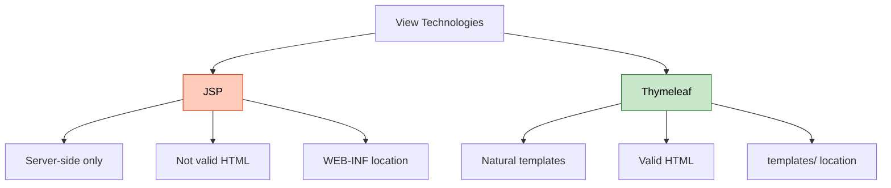
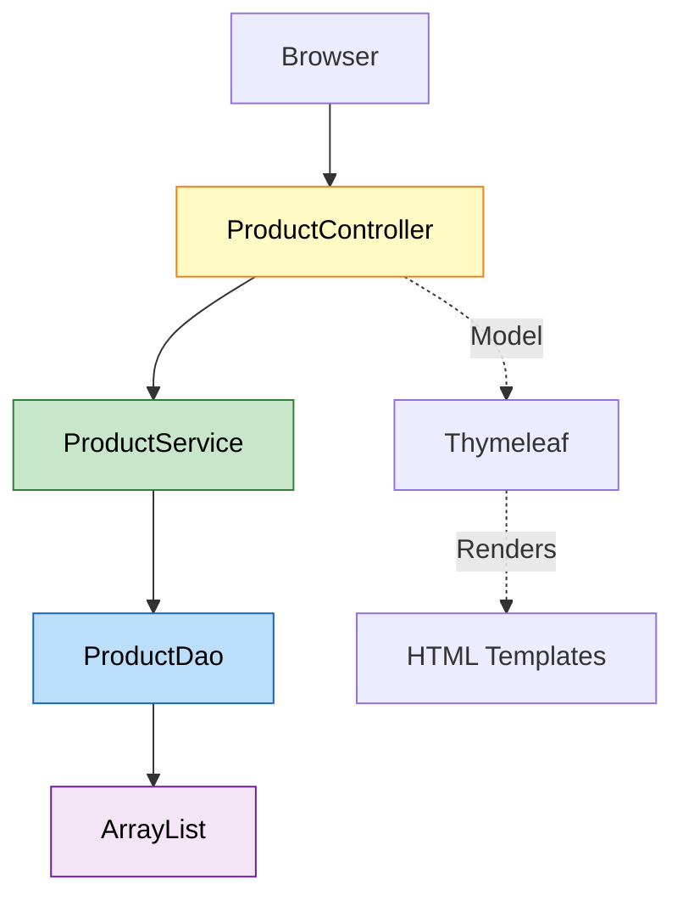
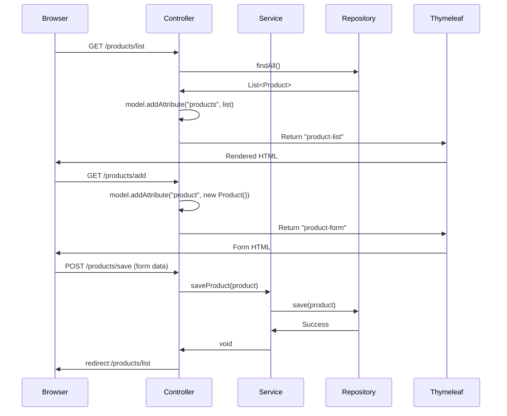
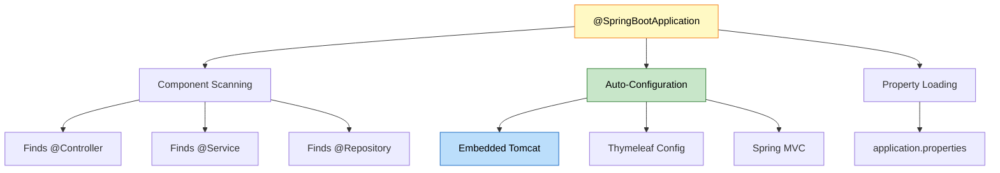
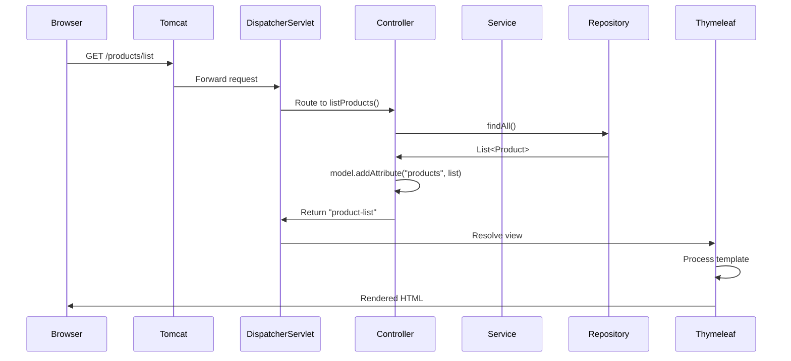
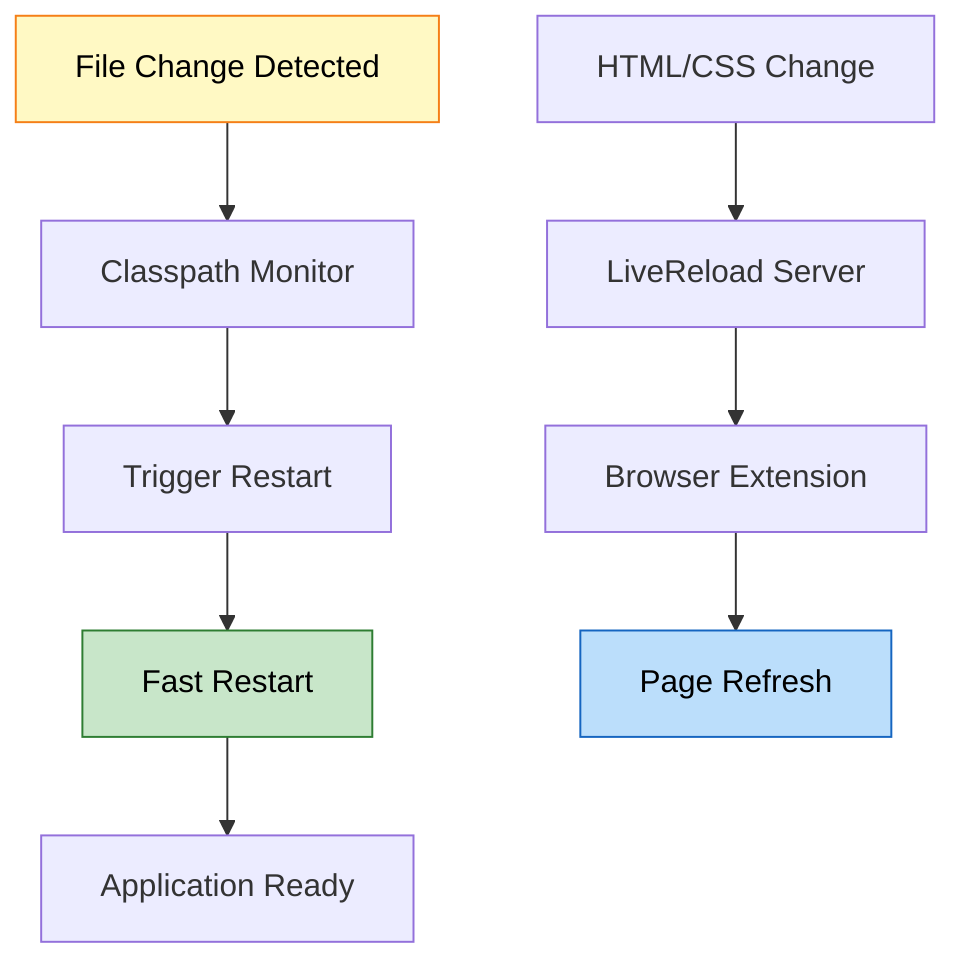
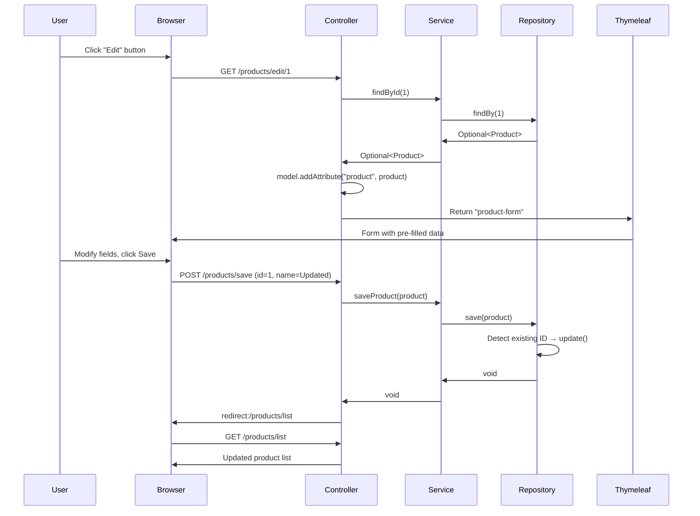
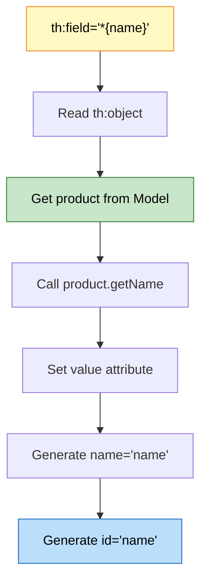
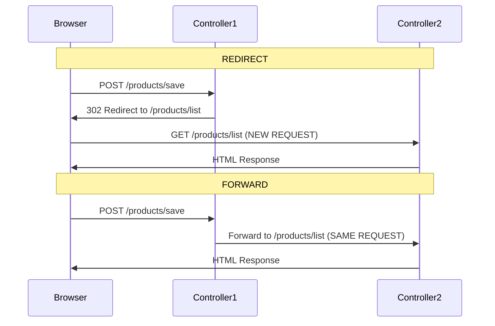

# ☕ Spring Boot CRUD with Thymeleaf: Modern Web Application

<div align="center">


</div>

<hr style="border: 1px solid rgb(98, 117, 187)">

<div align="center">
<table>
<tr>
<td align="center">
<br />

<h3>© 2026 Avinash Dhanuka</h3>
<p>Master Guide: Spring Boot CRUD with Thymeleaf</p>
<p><em>Crafted with ❤️ for Modern Web Development</em></p>

<a href="https://github.com/Avinash-706" target="_blank">

</a>
<br />
<a href="https://mail.google.com/mail/?view=cm&fs=1&to=avunashdhanuka@gmail.com&su=Spring%20Boot%20CRUD%20Query&body=☕%20Hello%20Avinash,%0D%0A%0D%0AMy%20name%20is%20[Your%20Name]%20and%20I%20have%20a%20doubt%20regarding%20Spring%20Boot%20CRUD.%0D%0A%0D%0A🔹%20Topic:%20[CRUD/Thymeleaf/REST]%0D%0A%0D%0AThank%20you!" target="_blank">

</a>
<br />
<br />
</td>
</tr>
</table>
</div>

> **Learning Note:** This project demonstrates complete CRUD operations with Spring Boot and Thymeleaf - the modern alternative to JSP. Master in-memory data storage, RESTful patterns, and natural template engine.

> **Prerequisites:** 
> - Understanding of Spring MVC (day11/SpringMvc, day12/MavenApp)
> - Basic knowledge of HTML/CSS
> - Familiarity with Spring Boot auto-configuration
> - HTTP methods (GET, POST)

---

## 📑 Table of Contents
1. [What is This Project?](#1-what-is-this-project)
2. [Thymeleaf vs JSP](#2-thymeleaf-vs-jsp)
3. [Project Architecture](#3-project-architecture)
4. [Complete CRUD Operations](#4-complete-crud-operations)
5. [Request Flow](#5-request-flow)
6. [Thymeleaf Syntax Deep Dive](#6-thymeleaf-syntax-deep-dive)
7. [Spring Boot Dependencies](#7-spring-boot-dependencies)
8. [Internal Working](#8-internal-working)
9. [Real-World Patterns](#9-real-world-patterns)
10. [Common Pitfalls & Solutions](#10-common-pitfalls--solutions)
11. [Interview Questions](#11-top-interview-questions)

---

## 1. WHAT IS THIS PROJECT?

<div align="center">

</div>

> **📝 Author:** Avinash Dhanuka | [GitHub](https://github.com/Avinash-706)

### 📌 Definition

**ProductCRUD** is a Spring Boot web application demonstrating complete CRUD (Create, Read, Update, Delete) operations using Thymeleaf template engine and in-memory data storage.

**Key Features:**
- Complete CRUD operations
- Thymeleaf natural templates
- In-memory ArrayList storage
- RESTful URL patterns
- Modern UI with CSS styling
- No database required

### 🎯 Why This Project?

| Feature | Benefit |
|:--------|:--------|
| **Thymeleaf** | Modern alternative to JSP |
| **In-Memory Storage** | No database setup needed |
| **CRUD Operations** | Real-world pattern |
| **Spring Boot** | Auto-configuration magic |
| **RESTful URLs** | Industry standard |


---

## 2. THYMELEAF VS JSP

<div align="center">

</div>

### 📊 Technology Comparison



### 🎯 Detailed Comparison

| Feature | JSP (Day 11/12) | Thymeleaf (Day 13) |
|:--------|:---------------|:------------------|
| **Syntax** | `${name}` | `th:text="${name}"` |
| **Valid HTML** | No | Yes |
| **Preview** | Cannot open in browser | Can open in browser |
| **Location** | webapp/WEB-INF/jsp/ | resources/templates/ |
| **Dependency** | tomcat-embed-jasper | spring-boot-starter-thymeleaf |
| **Modern** | Legacy | Modern |
| **Spring Boot** | Manual config | Auto-configured |

### 📝 Syntax Examples

**JSP:**
```jsp
<%@ taglib uri="http://java.sun.com/jsp/jstl/core" prefix="c" %>
<c:forEach var="product" items="${products}">
    <td>${product.name}</td>
</c:forEach>
```

**Thymeleaf:**
```html
<tr th:each="product : ${products}">
    <td th:text="${product.name}"></td>
</tr>
```


---

## 3. PROJECT ARCHITECTURE

<div align="center">

</div>

> **📝 Author:** Avinash Dhanuka | [GitHub](https://github.com/Avinash-706)

### 📁 Complete Project Structure

```
ProductCRUD/
├── src/
│   └── main/
│       ├── java/
│       │   └── com/example/
│       │       ├── ProductCrudApplication.java      # Entry Point
│       │       ├── controller/
│       │       │   └── ProductController.java       # @Controller
│       │       ├── service/
│       │       │   └── ProductService.java          # @Service
│       │       ├── repository/
│       │       │   └── ProductDao.java              # @Repository
│       │       └── model/
│       │           └── Product.java                 # POJO
│       └── resources/
│           ├── application.properties               # Configuration
│           ├── static/
│           │   └── style.css                        # CSS Styling
│           └── templates/
│               ├── home.html                        # Home page
│               ├── product-list.html                # List view
│               └── product-form.html                # Add/Edit form
├── pom.xml                                          # Dependencies
└── README.md
```

### 🎯 Layered Architecture



### 📊 Layer Responsibilities

| Layer | Annotation | File | Responsibility |
|:------|:-----------|:-----|:--------------|
| **Controller** | @Controller | ProductController.java | Handle HTTP requests |
| **Service** | @Service | ProductService.java | Business logic |
| **Repository** | @Repository | ProductDao.java | Data access (in-memory) |
| **Model** | POJO | Product.java | Data representation |
| **View** | Thymeleaf | *.html | UI presentation |


---

## 4. COMPLETE CRUD OPERATIONS

<div align="center">

</div>

### 📌 CRUD Mapping

| Operation | HTTP Method | URL | Controller Method |
|:----------|:-----------|:----|:-----------------|
| **Create** | POST | /products/save | saveProduct() |
| **Read (All)** | GET | /products/list | listProducts() |
| **Read (One)** | GET | /products/edit/{id} | showEditForm() |
| **Update** | POST | /products/save | saveProduct() |
| **Delete** | GET | /products/delete/{id} | deleteProduct() |

### 🎯 Controller Implementation

```java
@Controller
@RequestMapping("/products")
public class ProductController {
    
    @Autowired
    private ProductService productService;
    
    // CREATE - Show form
    @GetMapping("/add")
    public String showAddForm(Model model) {
        model.addAttribute("product", new Product());
        return "product-form";
    }
    
    // CREATE/UPDATE - Save product
    @PostMapping("/save")
    public String saveProduct(@ModelAttribute Product product) {
        productService.saveProduct(product);
        return "redirect:/products/list";
    }
    
    // READ - List all
    @GetMapping("/list")
    public String listProducts(Model model) {
        model.addAttribute("products", productDao.findAll());
        return "product-list";
    }
    
    // UPDATE - Show edit form
    @GetMapping("/edit/{id}")
    public String showEditForm(@PathVariable Long id, Model model) {
        Optional<Product> product = productService.findById(id);
        model.addAttribute("product", product.get());
        return "product-form";
    }
    
    // DELETE
    @GetMapping("/delete/{id}")
    public String deleteProduct(@PathVariable Long id) {
        productService.delete(id);
        return "redirect:/products/list";
    }
}
```

### 📊 Repository Logic

```java
@Repository
public class ProductDao {
    private List<Product> productList = new ArrayList<>();
    private Long idCounter = 1L;
    
    public void save(Product product) {
        if (product.getId() == null) {
            product.setId(idCounter++);  // Auto-increment ID
            productList.add(product);
        } else {
            update(product);  // Update existing
        }
    }
    
    public Optional<Product> findBy(Long id) {
        return productList.stream()
            .filter(p -> p.getId().equals(id))
            .findFirst();
    }
    
    public void deleteById(Long id) {
        productList.removeIf(p -> p.getId().equals(id));
    }
}
```


---

## 5. REQUEST FLOW

<div align="center">

</div>

> **📝 Author:** Avinash Dhanuka | [GitHub](https://github.com/Avinash-706)

### 📌 Complete CRUD Flow



### 🎯 Step-by-Step: Add Product

```
1. User clicks "Add Product" → GET /products/add
2. Controller creates new Product() → adds to Model
3. Returns "product-form" → Thymeleaf renders form
4. User fills form (name, price, quantity) → clicks Save
5. Browser sends POST /products/save with form data
6. @ModelAttribute binds data to Product object
7. Controller calls productService.saveProduct(product)
8. Service calls productDao.save(product)
9. Repository adds to ArrayList with auto-increment ID
10. Controller returns "redirect:/products/list"
11. Browser redirects to GET /products/list
12. Product list displayed with new product
```

### 🎯 Step-by-Step: Edit Product

```
1. User clicks "Edit" link → GET /products/edit/1
2. @PathVariable extracts id=1
3. Service finds product by ID from repository
4. Controller adds product to Model
5. Returns "product-form" → form pre-filled with data
6. User modifies fields → clicks Save
7. POST /products/save with existing ID
8. Repository detects existing ID → calls update()
9. Updates product in ArrayList
10. Redirect to list → updated product shown
```


---

## 6. THYMELEAF SYNTAX DEEP DIVE

<div align="center">

</div>

### 📌 Essential Thymeleaf Attributes

| Attribute | Purpose | Example |
|:----------|:--------|:--------|
| **th:text** | Set text content | `<td th:text="${product.name}"></td>` |
| **th:each** | Loop iteration | `<tr th:each="p : ${products}">` |
| **th:href** | Dynamic URL | `<a th:href="@{/products/edit/{id}(id=${p.id})}">` |
| **th:action** | Form action | `<form th:action="@{/products/save}">` |
| **th:object** | Form binding | `<form th:object="${product}">` |
| **th:field** | Input binding | `<input th:field="*{name}" />` |

### 🎯 URL Expressions

**Static URL:**
```html
<a href="/products/list">List</a>
```

**Thymeleaf URL:**
```html
<a th:href="@{/products/list}">List</a>
```

**URL with Path Variable:**
```html
<a th:href="@{/products/edit/{id}(id=${product.id})}">Edit</a>
<!-- Generates: /products/edit/1 -->
```

**URL with Query Parameters:**
```html
<a th:href="@{/products/search(name=${searchTerm})}">Search</a>
<!-- Generates: /products/search?name=laptop -->
```

### 🎯 Form Binding

**product-form.html:**
```html
<form th:action="@{/products/save}" th:object="${product}" method="post">
    <!-- Hidden field for ID (edit mode) -->
    <input type="hidden" th:field="*{id}" />
    
    <!-- Name field -->
    <input type="text" th:field="*{name}" required />
    
    <!-- Price field -->
    <input type="number" th:field="*{price}" required />
    
    <!-- Quantity field -->
    <input type="number" th:field="*{quantity}" required />
    
    <button type="submit">Save</button>
</form>
```

**How `th:field` works:**
- `*{name}` → binds to `product.getName()` and `product.setName()`
- Generates `name="name"` attribute
- Pre-fills value in edit mode
- Binds to `@ModelAttribute Product product` in controller

### 🎯 Iteration with th:each

```html
<table>
    <tr th:each="product : ${products}">
        <td th:text="${product.id}"></td>
        <td th:text="${product.name}"></td>
        <td th:text="${product.price}"></td>
        <td th:text="${product.quantity}"></td>
        <td>
            <a th:href="@{/products/edit/{id}(id=${product.id})}">Edit</a>
            <a th:href="@{/products/delete/{id}(id=${product.id})}">Delete</a>
        </td>
    </tr>
</table>
```

**Iteration Variables:**
```html
<tr th:each="product, iterStat : ${products}">
    <td th:text="${iterStat.index}"></td>      <!-- 0, 1, 2... -->
    <td th:text="${iterStat.count}"></td>      <!-- 1, 2, 3... -->
    <td th:text="${iterStat.first}"></td>      <!-- true/false -->
    <td th:text="${iterStat.last}"></td>       <!-- true/false -->
</tr>
```


---

## 7. SPRING BOOT DEPENDENCIES

<div align="center">

</div>

> **📝 Author:** Avinash Dhanuka | [GitHub](https://github.com/Avinash-706)

### 📌 What Does Each Dependency Do?

**pom.xml:**
```xml
<dependencies>
    <!-- 1. Spring Web -->
    <dependency>
        <groupId>org.springframework.boot</groupId>
        <artifactId>spring-boot-starter-web</artifactId>
    </dependency>
    
    <!-- 2. Thymeleaf -->
    <dependency>
        <groupId>org.springframework.boot</groupId>
        <artifactId>spring-boot-starter-thymeleaf</artifactId>
    </dependency>
    
    <!-- 3. Spring Data JPA -->
    <dependency>
        <groupId>org.springframework.boot</groupId>
        <artifactId>spring-boot-starter-data-jpa</artifactId>
    </dependency>
    
    <!-- 4. DevTools -->
    <dependency>
        <groupId>org.springframework.boot</groupId>
        <artifactId>spring-boot-devtools</artifactId>
    </dependency>
</dependencies>
```

### 🎯 Dependency Breakdown

| Dependency | Purpose | What It Includes |
|:-----------|:--------|:----------------|
| **spring-boot-starter-web** | Web development | Spring MVC, Embedded Tomcat, Jackson (JSON), Validation |
| **spring-boot-starter-thymeleaf** | Template engine | Thymeleaf 3.x, Auto-configuration for templates/ |
| **spring-boot-starter-data-jpa** | Database access | Spring Data JPA, Hibernate, JDBC (not used in this project) |
| **spring-boot-devtools** | Development tools | Auto-restart, LiveReload, Configurations |

### 📊 What Each Starter Does

**1. spring-boot-starter-web:**
- Enables `@Controller`, `@RestController`
- Provides `@GetMapping`, `@PostMapping`
- Embedded Tomcat server
- JSON serialization with Jackson
- Exception handling

**2. spring-boot-starter-thymeleaf:**
- Auto-configures Thymeleaf template engine
- Sets `spring.thymeleaf.prefix=classpath:/templates/`
- Sets `spring.thymeleaf.suffix=.html`
- Enables `th:*` attributes
- Natural template support

**3. spring-boot-starter-data-jpa:**
- Provides JPA annotations (`@Entity`, `@Id`)
- Hibernate ORM framework
- `JpaRepository` interface
- Transaction management
- **Note:** Not used in this project (in-memory ArrayList instead)

**4. spring-boot-devtools:**
- Auto-restart on code changes
- LiveReload browser extension support
- Disables template caching in development
- Faster development cycle

### 🎯 Why JPA Dependency Without Database?

**Answer:** Added for future migration to database.

**Current:** In-memory ArrayList storage
**Future:** Can easily switch to MySQL/H2 by:
1. Adding database driver dependency
2. Configuring `application.properties`
3. Changing `ProductDao` to extend `JpaRepository`
4. Adding `@Entity` to `Product` model


---

## 8. INTERNAL WORKING

<div align="center">

</div>

> **📝 Author:** Avinash Dhanuka | [GitHub](https://github.com/Avinash-706)

### 📌 Spring Boot Auto-Configuration

**What happens when you run ProductCrudApplication?**



### 🎯 Request Processing Flow



### 📊 Component Lifecycle

| Phase | Action | Example |
|:------|:-------|:--------|
| **1. Startup** | Component scanning | Finds @Controller, @Service |
| **2. Bean Creation** | Instantiate classes | new ProductController() |
| **3. Dependency Injection** | @Autowired wiring | Inject ProductService |
| **4. Initialization** | @PostConstruct | Setup methods |
| **5. Ready** | Application running | Accepts requests |

### 🎯 How @Autowired Works

```java
@Controller
public class ProductController {
    @Autowired
    private ProductService productService;  // How does this work?
}
```

**Internal Process:**
```
1. Spring scans @Controller annotation
2. Creates ProductController bean
3. Detects @Autowired field
4. Looks for ProductService bean in context
5. Injects ProductService instance
6. ProductController ready to use
```

### 📝 In-Memory Storage Mechanism

```java
@Repository
public class ProductDao {
    private List<Product> productList = new ArrayList<>();  // Singleton
    private Long idCounter = 1L;
}
```

**Key Points:**
- ProductDao is singleton (one instance per application)
- ArrayList persists during application runtime
- Data lost on restart (no database)
- Thread-safe? No (use ConcurrentHashMap for production)


---

## 9. REAL-WORLD PATTERNS

<div align="center">

</div>

### 📌 Production-Ready Enhancements

**1. Add Validation**
```java
public class Product {
    @NotNull(message = "ID cannot be null")
    private Long id;
    
    @NotBlank(message = "Name is required")
    @Size(min = 2, max = 100)
    private String name;
    
    @Min(value = 0, message = "Price must be positive")
    private double price;
    
    @Min(value = 0, message = "Quantity cannot be negative")
    private int quantity;
}
```

**2. Exception Handling**
```java
@ControllerAdvice
public class GlobalExceptionHandler {
    @ExceptionHandler(ProductNotFoundException.class)
    public String handleNotFound(Model model) {
        model.addAttribute("error", "Product not found");
        return "error";
    }
}
```

**3. RESTful API Version**
```java
@RestController
@RequestMapping("/api/products")
public class ProductRestController {
    @GetMapping
    public ResponseEntity<List<Product>> getAllProducts() {
        return ResponseEntity.ok(productService.getAllProducts());
    }
    
    @PostMapping
    public ResponseEntity<Product> createProduct(@RequestBody Product product) {
        productService.saveProduct(product);
        return ResponseEntity.status(HttpStatus.CREATED).body(product);
    }
}
```

### 🎯 Database Migration Path

**Current: In-Memory ArrayList**
```java
@Repository
public class ProductDao {
    private List<Product> productList = new ArrayList<>();
}
```

**Future: JPA with Database**
```java
@Entity
@Table(name = "products")
public class Product {
    @Id
    @GeneratedValue(strategy = GenerationType.IDENTITY)
    private Long id;
    // ... fields
}

@Repository
public interface ProductDao extends JpaRepository<Product, Long> {
    // Spring Data JPA provides all methods
}
```

**Migration Steps:**
1. Add database dependency (MySQL/H2)
2. Configure datasource in application.properties
3. Add @Entity to Product model
4. Change ProductDao to extend JpaRepository
5. Remove manual ArrayList logic

### 📊 Comparison: In-Memory vs Database

| Feature | In-Memory (Current) | Database (Production) |
|:--------|:-------------------|:---------------------|
| **Data Persistence** | Lost on restart | Permanent |
| **Scalability** | Single instance | Multiple instances |
| **Transactions** | No | Yes |
| **Concurrency** | Not thread-safe | Thread-safe |
| **Query Capability** | Limited | Full SQL |
| **Use Case** | Learning, prototyping | Production apps |


---

## 10. COMMON PITFALLS & SOLUTIONS

<div align="center">

</div>

> **📝 Author:** Avinash Dhanuka | [GitHub](https://github.com/Avinash-706)

### ❌ Pitfall 1: CSS Not Loading

**Problem:**
```
src/main/resources/templates/style.css  ❌
```

**Error:** 404 - CSS not found

**Solution:**
```
src/main/resources/static/style.css  ✅
```

**Why?**
- `static/` folder is for static resources (CSS, JS, images)
- `templates/` folder is for Thymeleaf templates only

---

### ❌ Pitfall 2: Thymeleaf Syntax Errors

**Problem:**
```html
<td>${product.name}</td>  <!-- JSP syntax -->
```

**Solution:**
```html
<td th:text="${product.name}"></td>  <!-- Thymeleaf syntax -->
```

---

### ❌ Pitfall 3: Missing No-Arg Constructor

**Problem:**
```java
public class Product {
    public Product(Long id, String name) {  // Only parameterized
        this.id = id;
        this.name = name;
    }
}
```

**Error:** Cannot instantiate Product for form binding

**Solution:**
```java
public class Product {
    public Product() {}  // Required for @ModelAttribute
    
    public Product(Long id, String name, double price, int quantity) {
        this.id = id;
        this.name = name;
        this.price = price;
        this.quantity = quantity;
    }
}
```

---

### ❌ Pitfall 4: Wrong Form Field Names

**Problem:**
```html
<input type="text" name="productName" />  <!-- Wrong -->
```

```java
public class Product {
    private String name;  // Field name doesn't match
}
```

**Solution:**
```html
<input type="text" name="name" />  <!-- Matches field name -->
```

---

### ❌ Pitfall 5: Port Already in Use

**Problem:**
```
Port 8080 is already in use
```

**Solution 1:** Change port in application.properties
```properties
server.port=8082
```

**Solution 2:** Kill process using port
```bash
# Windows
netstat -ano | findstr :8080
taskkill /PID <process_id> /F

# Linux/Mac
lsof -i :8080
kill -9 <process_id>
```

---

### ❌ Pitfall 6: Redirect Loop

**Problem:**
```java
@GetMapping("/list")
public String listProducts() {
    return "redirect:/products/list";  // Infinite loop!
}
```

**Solution:**
```java
@GetMapping("/list")
public String listProducts(Model model) {
    model.addAttribute("products", productDao.findAll());
    return "product-list";  // Return view name, not redirect
}
```

---

### ❌ Pitfall 7: NullPointerException on Edit

**Problem:**
```java
@GetMapping("/edit/{id}")
public String showEditForm(@PathVariable Long id, Model model) {
    Optional<Product> product = productService.findById(id);
    model.addAttribute("product", product.get());  // NPE if not found!
    return "product-form";
}
```

**Solution:**
```java
@GetMapping("/edit/{id}")
public String showEditForm(@PathVariable Long id, Model model) {
    Optional<Product> product = productService.findById(id);
    if (product.isPresent()) {
        model.addAttribute("product", product.get());
        return "product-form";
    }
    return "redirect:/products/list";  // Redirect if not found
}
```


---

## 11. TOP INTERVIEW QUESTIONS

<div align="center">

</div>

### Q1: What does spring-boot-starter-web do?

**Answer:**

**spring-boot-starter-web** is a dependency aggregator that includes everything needed for web development.

**Includes:**
1. **Spring MVC** - Web framework (@Controller, @GetMapping, @PostMapping)
2. **Embedded Tomcat** - No need for external server
3. **Jackson** - JSON serialization/deserialization
4. **Validation** - Bean validation (@Valid, @NotNull)
5. **Spring Boot Auto-configuration** - Automatic setup

**Without spring-boot-starter-web:**
```xml
<dependency><artifactId>spring-webmvc</artifactId></dependency>
<dependency><artifactId>tomcat-embed-core</artifactId></dependency>
<dependency><artifactId>tomcat-embed-el</artifactId></dependency>
<dependency><artifactId>jackson-databind</artifactId></dependency>
<!-- ... 20+ more dependencies -->
```

**With spring-boot-starter-web:**
```xml
<dependency>
    <groupId>org.springframework.boot</groupId>
    <artifactId>spring-boot-starter-web</artifactId>
</dependency>
<!-- All 20+ dependencies included automatically! -->
```

---

### Q2: What does Thymeleaf do?

**Answer:**

**Thymeleaf** is a modern server-side template engine for rendering dynamic HTML.

**Key Features:**

1. **Natural Templates**
```html
<!-- Can be opened directly in browser -->
<p th:text="${name}">Default Name</p>
<!-- Shows "Default Name" in browser, "${name}" when processed -->
```

2. **Server-Side Rendering**
```
Controller → Model → Thymeleaf → HTML → Browser
```

3. **Expression Language**
```html
<td th:text="${product.name}"></td>
<a th:href="@{/products/edit/{id}(id=${product.id})}">Edit</a>
<tr th:each="product : ${products}">
```

**Thymeleaf vs JSP:**

| Feature | Thymeleaf | JSP |
|:--------|:----------|:----|
| **Valid HTML** | Yes | No |
| **Preview in Browser** | Yes | No |
| **Modern** | Yes | Legacy |
| **Spring Boot** | Auto-configured | Manual config |
| **Location** | resources/templates/ | webapp/WEB-INF/jsp/ |

---

### Q3: What does spring-boot-devtools do?

**Answer:**

**spring-boot-devtools** provides development-time features for faster development.

**Features:**

1. **Auto-Restart**
```
Change Java code → Save → Application restarts automatically
```

2. **LiveReload**
```
Change HTML/CSS → Save → Browser refreshes automatically
```

3. **Disable Template Caching**
```properties
# Automatically set in development:
spring.thymeleaf.cache=false
# See template changes without restart
```

4. **Property Defaults**
```
Optimizes settings for development environment
```

**How it works:**


**Production Note:** DevTools is automatically disabled in production (when running as packaged JAR).

---

### Q4: Explain the complete CRUD flow for editing a product

**Answer:**

**Step-by-Step Edit Flow:**



**Code Flow:**

1. **User clicks Edit:**
```html
<a th:href="@{/products/edit/{id}(id=${product.id})}">Edit</a>
<!-- Generates: /products/edit/1 -->
```

2. **Controller receives request:**
```java
@GetMapping("/edit/{id}")
public String showEditForm(@PathVariable Long id, Model model) {
    Optional<Product> product = productService.findById(id);
    model.addAttribute("product", product.get());
    return "product-form";  // Same form as Add
}
```

3. **Form pre-filled with data:**
```html
<form th:action="@{/products/save}" th:object="${product}" method="post">
    <input type="hidden" th:field="*{id}" />  <!-- ID=1 -->
    <input type="text" th:field="*{name}" />  <!-- Pre-filled -->
    <input type="number" th:field="*{price}" />  <!-- Pre-filled -->
</form>
```

4. **User submits form:**
```java
@PostMapping("/save")
public String saveProduct(@ModelAttribute Product product) {
    // product.id = 1 (from hidden field)
    productService.saveProduct(product);
    return "redirect:/products/list";
}
```

5. **Repository detects existing ID:**
```java
public void save(Product product) {
    if (product.getId() == null) {
        product.setId(idCounter++);  // New product
        productList.add(product);
    } else {
        update(product);  // Existing product - UPDATE
    }
}
```

---

### Q5: Why use @ModelAttribute instead of HttpServletRequest?

**Answer:**

**Without @ModelAttribute (Manual Binding):**
```java
@PostMapping("/save")
public String saveProduct(HttpServletRequest request) {
    String name = request.getParameter("name");
    String priceStr = request.getParameter("price");
    String quantityStr = request.getParameter("quantity");
    
    // Manual type conversion
    double price = Double.parseDouble(priceStr);
    int quantity = Integer.parseInt(quantityStr);
    
    // Manual object creation
    Product product = new Product();
    product.setName(name);
    product.setPrice(price);
    product.setQuantity(quantity);
    
    productService.saveProduct(product);
    return "redirect:/products/list";
}
```

**With @ModelAttribute (Automatic Binding):**
```java
@PostMapping("/save")
public String saveProduct(@ModelAttribute Product product) {
    // product object already populated!
    productService.saveProduct(product);
    return "redirect:/products/list";
}
```

**Benefits:**

| Feature | Manual | @ModelAttribute |
|:--------|:-------|:---------------|
| **Code Lines** | 15+ | 3 |
| **Type Conversion** | Manual | Automatic |
| **Null Handling** | Manual | Automatic |
| **Validation** | Manual | @Valid support |
| **Maintainability** | Low | High |

**How @ModelAttribute works:**
```
1. Spring detects @ModelAttribute annotation
2. Creates new Product() instance
3. Reads form parameters (name, price, quantity)
4. Calls setters: product.setName(), product.setPrice()
5. Performs type conversion (String → double, String → int)
6. Passes populated object to controller method
```

---

### Q6: What is the difference between @Controller and @RestController?

**Answer:**

**@Controller:**
```java
@Controller
public class ProductController {
    @GetMapping("/list")
    public String listProducts(Model model) {
        model.addAttribute("products", productDao.findAll());
        return "product-list";  // Returns view name (HTML)
    }
}
```
- Returns view name (String)
- Thymeleaf/JSP renders HTML
- Used for web pages

**@RestController:**
```java
@RestController
public class ProductRestController {
    @GetMapping("/api/products")
    public List<Product> listProducts() {
        return productDao.findAll();  // Returns JSON
    }
}
```
- Returns data directly (JSON/XML)
- No view rendering
- Used for REST APIs

**Equivalent Code:**
```java
@Controller
public class ProductController {
    @GetMapping("/api/products")
    @ResponseBody  // Converts return value to JSON
    public List<Product> listProducts() {
        return productDao.findAll();
    }
}

// @RestController = @Controller + @ResponseBody on every method
```

---

### Q7: How does Thymeleaf th:field work?

**Answer:**

**th:field does 3 things:**

1. **Generates name attribute**
2. **Generates id attribute**
3. **Pre-fills value (in edit mode)**

**Example:**
```html
<form th:object="${product}">
    <input type="text" th:field="*{name}" />
</form>
```

**Generated HTML (Add mode):**
```html
<input type="text" id="name" name="name" value="" />
```

**Generated HTML (Edit mode with product.name="Laptop"):**
```html
<input type="text" id="name" name="name" value="Laptop" />
```

**How it works:**



**Binding on Submit:**
```
1. User submits form
2. Browser sends: name=Laptop&price=50000
3. Spring reads name attribute
4. Calls product.setName("Laptop")
5. Calls product.setPrice(50000)
6. Passes to controller method
```

---

### Q8: Why is ProductDao a singleton? Is it thread-safe?

**Answer:**

**Singleton by Default:**
```java
@Repository
public class ProductDao {
    private List<Product> productList = new ArrayList<>();
    // One instance per application
}
```

**Why Singleton?**
- Spring beans are singleton by default
- One instance shared across all requests
- Maintains data consistency (same ArrayList for all users)

**Is it Thread-Safe? NO!**

**Problem:**
```java
// User 1 (Thread 1)
productDao.save(product1);  // Modifying ArrayList

// User 2 (Thread 2) - Same time
productDao.save(product2);  // Modifying same ArrayList

// Result: Race condition, data corruption possible
```

**Solution for Production:**

**Option 1: Synchronized Methods**
```java
@Repository
public class ProductDao {
    private List<Product> productList = new ArrayList<>();
    
    public synchronized void save(Product product) {
        // Only one thread at a time
    }
}
```

**Option 2: ConcurrentHashMap**
```java
@Repository
public class ProductDao {
    private Map<Long, Product> productMap = new ConcurrentHashMap<>();
    // Thread-safe by design
}
```

**Option 3: Database (Best)**
```java
@Repository
public interface ProductDao extends JpaRepository<Product, Long> {
    // Database handles concurrency with transactions
}
```

---

### Q9: Explain redirect vs forward in Spring MVC

**Answer:**

**Redirect:**
```java
return "redirect:/products/list";
```
- Browser receives 302 status
- Browser makes NEW request to /products/list
- URL changes in browser
- Model data is lost
- Used after POST (PRG pattern)

**Forward:**
```java
return "forward:/products/list";
```
- Server-side forward
- Same request object
- URL doesn't change
- Model data preserved
- Used for internal routing

**Visual Difference:**



**Post-Redirect-Get (PRG) Pattern:**
```java
@PostMapping("/save")
public String saveProduct(@ModelAttribute Product product) {
    productService.saveProduct(product);
    return "redirect:/products/list";  // Prevents duplicate submission
}
```

**Why redirect after POST?**
- Prevents duplicate form submission on browser refresh
- Separates POST action from GET display
- Industry standard pattern

---

### Q10: How would you migrate this project to use a database?

**Answer:**

**Step 1: Add Database Dependency**
```xml
<dependency>
    <groupId>com.mysql</groupId>
    <artifactId>mysql-connector-j</artifactId>
</dependency>
```

**Step 2: Configure application.properties**
```properties
spring.datasource.url=jdbc:mysql://localhost:3306/productdb
spring.datasource.username=root
spring.datasource.password=password
spring.jpa.hibernate.ddl-auto=update
spring.jpa.show-sql=true
```

**Step 3: Add @Entity to Product**
```java
@Entity
@Table(name = "products")
public class Product {
    @Id
    @GeneratedValue(strategy = GenerationType.IDENTITY)
    private Long id;
    
    @Column(nullable = false)
    private String name;
    
    private double price;
    private int quantity;
    
    // Constructors, getters, setters
}
```

**Step 4: Change ProductDao to JpaRepository**
```java
@Repository
public interface ProductDao extends JpaRepository<Product, Long> {
    // All CRUD methods provided by Spring Data JPA
    // No need for manual implementation!
}
```

**Step 5: Update ProductService**
```java
@Service
public class ProductService {
    @Autowired
    private ProductDao productDao;
    
    public void saveProduct(Product product) {
        productDao.save(product);  // JPA handles INSERT/UPDATE
    }
    
    public Optional<Product> findById(Long id) {
        return productDao.findById(id);  // JPA query
    }
    
    public List<Product> getAllProducts() {
        return productDao.findAll();  // JPA query
    }
    
    public void delete(Long id) {
        productDao.deleteById(id);  // JPA delete
    }
}
```

**Step 6: Remove Manual Logic**
```java
// DELETE THIS:
private List<Product> productList = new ArrayList<>();
private Long idCounter = 1L;

// DELETE update() method
// DELETE manual save logic

// Spring Data JPA handles everything!
```

**Benefits After Migration:**

| Feature | Before (ArrayList) | After (Database) |
|:--------|:------------------|:----------------|
| **Persistence** | Lost on restart | Permanent |
| **Concurrency** | Not thread-safe | Thread-safe |
| **Transactions** | No | Yes (@Transactional) |
| **Queries** | Manual loops | SQL/JPQL |
| **Scalability** | Single instance | Multiple instances |


---

<hr style="border: 2px solid rgb(98, 117, 187)">

<div align="center">
<table>
<tr>
<td align="center">
<br />

<h3>🎉 Congratulations!</h3>
<p>You've mastered Spring Boot CRUD with Thymeleaf</p>
<p><em>Ready for production-level web applications</em></p>
<br />

<a href="https://github.com/Avinash-706" target="_blank">

</a>
<br />
<a href="https://mail.google.com/mail/?view=cm&fs=1&to=avunashdhanuka@gmail.com&su=Spring%20Boot%20CRUD%20Feedback&body=☕%20Hello%20Avinash,%0D%0A%0D%0AI%20completed%20the%20Spring%20Boot%20CRUD%20project!%0D%0A%0D%0A🔹%20Feedback:%20[Your%20thoughts]%0D%0A%0D%0AThank%20you!" target="_blank">

</a>
<br />
<br />

<p><strong>📊 Project Statistics:</strong></p>
<p>11 Sections • 12 Mermaid Diagrams • 10 Interview Questions</p>
<p>Complete CRUD • Thymeleaf Templates • In-Memory Storage</p>
<p>Production Patterns • Migration Guide • Best Practices</p>

<br />
<p><em>© 2026 Avinash Dhanuka | Spring Boot Learning Series</em></p>
<p><em>Day 13: Spring Boot CRUD with Thymeleaf</em></p>
</td>
</tr>
</table>
</div>

---
